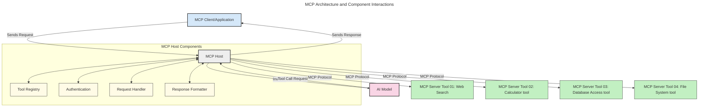
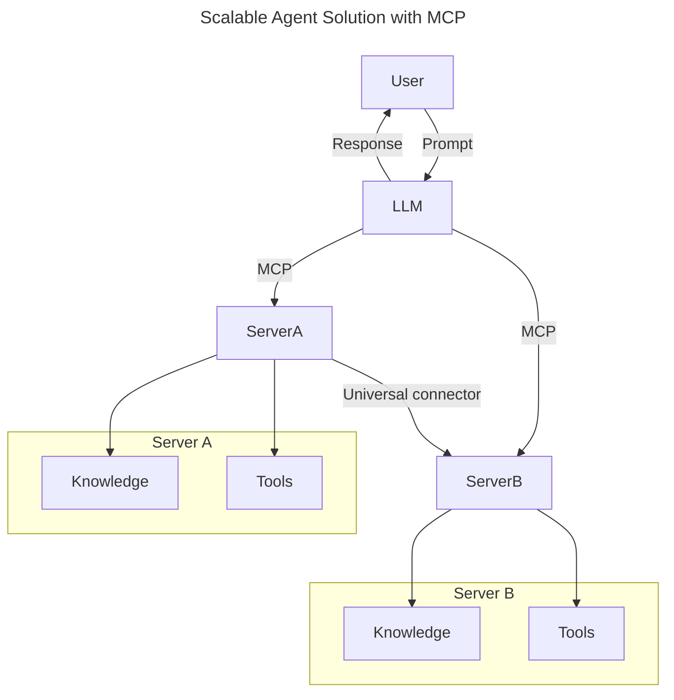
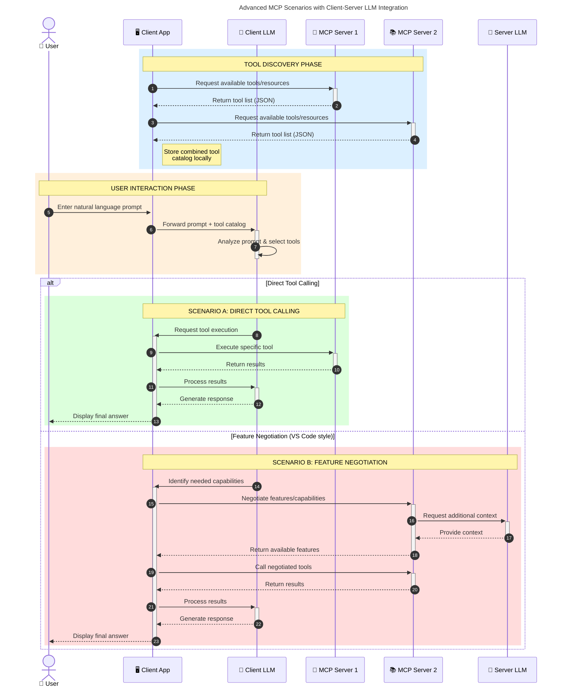

<!--
CO_OP_TRANSLATOR_METADATA:
{
  "original_hash": "9678e0c6945b8e0c23586869b0e26783",
  "translation_date": "2025-10-06T10:56:31+00:00",
  "source_file": "00-Introduction/README.md",
  "language_code": "mr"
}
-->
# मॉडेल कॉन्टेक्स्ट प्रोटोकॉल (MCP) ची ओळख: स्केलेबल AI अनुप्रयोगांसाठी याचे महत्त्व

_(वरील प्रतिमेवर क्लिक करून या धड्याचा व्हिडिओ पहा)_

जनरेटिव्ह AI अनुप्रयोग हे एक मोठे पाऊल पुढे आहे कारण ते वापरकर्त्याला नैसर्गिक भाषेतील प्रॉम्प्ट्सद्वारे अॅपशी संवाद साधण्याची परवानगी देतात. परंतु, अशा अॅप्समध्ये अधिक वेळ आणि संसाधने गुंतवल्यानंतर, तुम्हाला खात्री करायची आहे की तुम्ही कार्यक्षमता आणि संसाधने अशा प्रकारे सहजपणे समाकलित करू शकता की ते विस्तार करणे सोपे होईल, तुमचे अॅप एकापेक्षा जास्त मॉडेल्ससाठी उपयुक्त ठरेल आणि विविध मॉडेल्सच्या गुंतागुंतीचे व्यवस्थापन करू शकेल. थोडक्यात, जनरेटिव्ह AI अॅप्स तयार करणे सुरुवातीला सोपे असते, परंतु ते वाढत जातात आणि अधिक जटिल बनतात, तेव्हा तुम्हाला आर्किटेक्चर परिभाषित करण्यास सुरुवात करावी लागेल आणि तुमचे अॅप्स सुसंगत पद्धतीने तयार करण्यासाठी मानकावर अवलंबून राहावे लागेल. याच ठिकाणी MCP गोष्टी व्यवस्थित करण्यासाठी आणि मानक प्रदान करण्यासाठी मदत करते.

---

## **🔍 मॉडेल कॉन्टेक्स्ट प्रोटोकॉल (MCP) म्हणजे काय?**

**मॉडेल कॉन्टेक्स्ट प्रोटोकॉल (MCP)** हा एक **मुक्त, मानकीकृत इंटरफेस** आहे जो मोठ्या भाषा मॉडेल्सना (LLMs) बाह्य साधने, APIs आणि डेटा स्रोतांसह सहजपणे संवाद साधण्याची परवानगी देतो. हे AI मॉडेल्सच्या कार्यक्षमतेला त्यांच्या प्रशिक्षण डेटाच्या पलीकडे वाढवण्यासाठी सुसंगत आर्किटेक्चर प्रदान करते, ज्यामुळे अधिक स्मार्ट, स्केलेबल आणि प्रतिसादक्षम AI प्रणाली सक्षम होतात.

---

## **🎯 AI मध्ये मानकीकरण का महत्त्वाचे आहे**

जनरेटिव्ह AI अनुप्रयोग अधिक जटिल होत असताना, **स्केलेबिलिटी, विस्तारक्षमता, देखभालक्षमता** आणि **विक्रेता लॉक-इन टाळणे** सुनिश्चित करणारी मानके स्वीकारणे आवश्यक आहे. MCP या गरजा पूर्ण करते:

- मॉडेल-टूल समाकलन एकत्रित करणे
- नाजूक, एक-वेळच्या सानुकूल उपाय कमी करणे
- एकाच इकोसिस्टममध्ये विविध विक्रेत्यांकडून अनेक मॉडेल्स सह-अस्तित्वात असू देणे

**टीप:** MCP स्वतःला एक खुले मानक म्हणून सादर करते, परंतु IEEE, IETF, W3C, ISO किंवा इतर कोणत्याही मानक संस्थांद्वारे MCP मानकीकरण करण्याची कोणतीही योजना नाही.

---

## **📚 शिकण्याची उद्दिष्टे**

या लेखाच्या शेवटी, तुम्ही हे करू शकाल:

- **मॉडेल कॉन्टेक्स्ट प्रोटोकॉल (MCP)** आणि त्याचे उपयोग परिभाषित करा
- MCP मॉडेल-टूल संवाद कसा मानकीकृत करते ते समजून घ्या
- MCP आर्किटेक्चरचे मुख्य घटक ओळखा
- एंटरप्राइझ आणि विकास संदर्भातील MCP च्या वास्तविक-जगातील अनुप्रयोगांचा शोध घ्या

---

## **💡 मॉडेल कॉन्टेक्स्ट प्रोटोकॉल (MCP) का गेम-चेंजर आहे**

### **🔗 MCP AI संवादांमधील विखंडन सोडवते**

MCP च्या आधी, मॉडेल्सना साधनांसह समाकलित करण्यासाठी आवश्यक होते:

- प्रत्येक टूल-मॉडेल जोडीसाठी सानुकूल कोड
- प्रत्येक विक्रेत्यासाठी नॉन-स्टँडर्ड APIs
- अद्यतनांमुळे वारंवार तुटणे
- अधिक साधनांसह खराब स्केलेबिलिटी

### **✅ MCP मानकीकरणाचे फायदे**

| **फायदा**                | **वर्णन**                                                                      |
|--------------------------|--------------------------------------------------------------------------------|
| इंटरऑपरेबिलिटी           | LLMs विविध विक्रेत्यांच्या साधनांसह सहजपणे कार्य करतात                        |
| सुसंगतता                 | प्लॅटफॉर्म्स आणि साधनांमध्ये एकसमान वर्तन                                     |
| पुनर्वापरक्षमता          | एकदा तयार केलेली साधने प्रकल्प आणि प्रणालींमध्ये वापरता येतात                  |
| जलद विकास               | मानकीकृत, प्लग-एंड-प्ले इंटरफेस वापरून विकास वेळ कमी करा                      |

---

## **🧱 MCP आर्किटेक्चरचा उच्च-स्तरीय आढावा**

MCP एक **क्लायंट-सर्व्हर मॉडेल** अनुसरते, जिथे:

- **MCP होस्ट्स** AI मॉडेल्स चालवतात
- **MCP क्लायंट्स** विनंत्या सुरू करतात
- **MCP सर्व्हर्स** संदर्भ, साधने आणि क्षमता प्रदान करतात

### **मुख्य घटक:**

- **संसाधने** – मॉडेल्ससाठी स्थिर किंवा गतिशील डेटा  
- **प्रॉम्प्ट्स** – मार्गदर्शित जनरेशनसाठी पूर्वनिर्धारित वर्कफ्लो  
- **साधने** – शोध, गणना यांसारख्या कार्यक्षम फंक्शन्स  
- **सॅम्पलिंग** – पुनरावृत्ती संवादांद्वारे एजेंटिक वर्तन  

---

## MCP सर्व्हर्स कसे कार्य करतात

MCP सर्व्हर्स खालीलप्रमाणे कार्य करतात:

- **विनंती प्रवाह**:
    1. अंतिम वापरकर्ता किंवा त्यांच्या वतीने कार्य करणारे सॉफ्टवेअर विनंती सुरू करते.
    2. **MCP क्लायंट** ही विनंती **MCP होस्ट**ला पाठवते, जो AI मॉडेल रनटाइम व्यवस्थापित करतो.
    3. **AI मॉडेल** वापरकर्त्याचा प्रॉम्प्ट प्राप्त करते आणि एक किंवा अधिक टूल कॉल्सद्वारे बाह्य साधनांमध्ये किंवा डेटामध्ये प्रवेश करण्याची विनंती करू शकते.
    4. **MCP होस्ट**, मॉडेल थेट नाही, मानकीकृत प्रोटोकॉल वापरून योग्य **MCP सर्व्हर(स)** शी संवाद साधतो.
- **MCP होस्ट कार्यक्षमता**:
    - **टूल रजिस्ट्रेशन**: उपलब्ध साधने आणि त्यांची क्षमता यांची सूची ठेवते.
    - **प्रमाणीकरण**: टूल ऍक्सेससाठी परवानग्या सत्यापित करते.
    - **विनंती हँडलर**: मॉडेलकडून येणाऱ्या टूल विनंत्या प्रक्रिया करते.
    - **प्रतिक्रिया स्वरूपक**: टूल आउटपुट मॉडेल समजू शकेल अशा स्वरूपात संरचित करते.
- **MCP सर्व्हर अंमलबजावणी**:
    - **MCP होस्ट** टूल कॉल्स एका किंवा अधिक **MCP सर्व्हर्स**कडे रूट करतो, प्रत्येक विशेष फंक्शन्स (उदा. शोध, गणना, डेटाबेस क्वेरी) उघड करतो.
    - **MCP सर्व्हर्स** त्यांच्या संबंधित ऑपरेशन्स अंमलात आणतात आणि **MCP होस्ट**ला सुसंगत स्वरूपात निकाल परत करतात.
    - **MCP होस्ट** हे निकाल स्वरूपित करते आणि ते **AI मॉडेल**ला पाठवते.
- **प्रतिक्रिया पूर्णता**:
    - **AI मॉडेल** अंतिम प्रतिसादात टूल आउटपुट समाविष्ट करते.
    - **MCP होस्ट** हा प्रतिसाद परत **MCP क्लायंट**ला पाठवतो, जो तो अंतिम वापरकर्त्याला किंवा कॉलिंग सॉफ्टवेअरला वितरित करतो.

## 👨‍💻 MCP सर्व्हर कसे तयार करावे (उदाहरणांसह)

MCP सर्व्हर्स LLM क्षमतांचा विस्तार डेटा आणि कार्यक्षमता प्रदान करून करतात.

तयार आहात का? येथे वेगवेगळ्या भाषा/स्टॅकसाठी SDKs आणि सोप्या MCP सर्व्हर्स तयार करण्याचे उदाहरण दिले आहे:

- **Python SDK**: https://github.com/modelcontextprotocol/python-sdk

- **TypeScript SDK**: https://github.com/modelcontextprotocol/typescript-sdk

- **Java SDK**: https://github.com/modelcontextprotocol/java-sdk

- **C#/.NET SDK**: https://github.com/modelcontextprotocol/csharp-sdk

## 🌍 MCP साठी वास्तविक-जगातील उपयोग

MCP AI क्षमतांचा विस्तार करून विविध अनुप्रयोग सक्षम करते:

| **अनुप्रयोग**               | **वर्णन**                                                                      |
|-----------------------------|--------------------------------------------------------------------------------|
| एंटरप्राइझ डेटा समाकलन     | LLMsना डेटाबेस, CRMs किंवा अंतर्गत साधनांशी जोडणे                              |
| एजेंटिक AI प्रणाली          | निर्णय घेण्याच्या वर्कफ्लो आणि टूल ऍक्सेससह स्वायत्त एजंट सक्षम करणे          |
| मल्टी-मोडल अनुप्रयोग        | एकाच एकत्रित AI अॅपमध्ये मजकूर, प्रतिमा आणि ऑडिओ साधने एकत्र करणे              |
| रिअल-टाइम डेटा समाकलन      | AI संवादांमध्ये थेट डेटा आणणे जेणेकरून अधिक अचूक, वर्तमान आउटपुट मिळू शकेल     |

### 🧠 MCP = AI संवादांसाठी सार्वत्रिक मानक

मॉडेल कॉन्टेक्स्ट प्रोटोकॉल (MCP) AI संवादांसाठी सार्वत्रिक मानक म्हणून कार्य करते, जसे USB-C उपकरणांसाठी भौतिक कनेक्शन मानकीकृत करते. AI च्या जगात, MCP एक सुसंगत इंटरफेस प्रदान करते, ज्यामुळे मॉडेल्स (क्लायंट्स) बाह्य साधने आणि डेटा प्रदात्यांसह (सर्व्हर्स) सहजपणे समाकलित होऊ शकतात. हे प्रत्येक API किंवा डेटा स्रोतासाठी विविध, सानुकूल प्रोटोकॉलची गरज दूर करते.

MCP अंतर्गत, MCP-सुसंगत टूल (MCP सर्व्हर म्हणून संदर्भित) एकसंध मानकाचे अनुसरण करते. हे सर्व्हर्स ते ऑफर करत असलेल्या साधनांची किंवा क्रियांची यादी करू शकतात आणि AI एजंटने विनंती केल्यावर त्या क्रिया अंमलात आणू शकतात. MCP ला समर्थन देणारे AI एजंट प्लॅटफॉर्म्स सर्व्हर्सकडून उपलब्ध साधने शोधू शकतात आणि या मानक प्रोटोकॉलद्वारे त्यांना कॉल करू शकतात.

### 💡 ज्ञानाचा प्रवेश सुलभ करणे

साधने ऑफर करण्याव्यतिरिक्त, MCP ज्ञानाचा प्रवेश सुलभ करते. हे मोठ्या भाषा मॉडेल्सना (LLMs) विविध डेटा स्रोतांशी जोडून संदर्भ प्रदान करण्यास सक्षम करते. उदाहरणार्थ, MCP सर्व्हर कंपनीच्या दस्तऐवज संग्रहाचे प्रतिनिधित्व करू शकतो, ज्यामुळे एजंट्सना मागणीनुसार संबंधित माहिती मिळू शकते. दुसरा सर्व्हर ईमेल पाठवणे किंवा रेकॉर्ड अपडेट करणे यासारख्या विशिष्ट क्रिया हाताळू शकतो. एजंटच्या दृष्टिकोनातून, ही फक्त साधने आहेत जी तो वापरू शकतो—काही साधने डेटा परत करतात (ज्ञान संदर्भ), तर काही क्रिया करतात. MCP दोन्ही कार्यक्षमतेने व्यवस्थापित करते.

एजंट MCP सर्व्हरशी कनेक्ट होताच, तो सर्व्हरच्या उपलब्ध क्षमता आणि प्रवेशयोग्य डेटाबद्दल मानक स्वरूपात आपोआप शिकतो. या मानकीकरणामुळे डायनॅमिक टूल उपलब्धता सक्षम होते. उदाहरणार्थ, एजंटच्या प्रणालीमध्ये नवीन MCP सर्व्हर जोडल्याने त्याच्या फंक्शन्स त्वरित वापरण्यायोग्य बनतात, एजंटच्या सूचनांमध्ये कोणत्याही अतिरिक्त सानुकूलनाची आवश्यकता नसते.

हे सुलभ समाकलन खालील आकृतीमध्ये दर्शविलेल्या प्रवाहाशी जुळते, जिथे सर्व्हर्स साधने आणि ज्ञान प्रदान करतात, प्रणालींमध्ये अखंड सहकार्य सुनिश्चित करतात.

### 👉 उदाहरण: स्केलेबल एजंट सोल्यूशन

युनिव्हर्सल कनेक्टर MCP सर्व्हर्सना एकमेकांशी संवाद साधण्याची आणि क्षमता सामायिक करण्याची परवानगी देतो, ज्यामुळे ServerA ServerB ला कार्ये सोपवू शकतो किंवा त्याची साधने आणि ज्ञान वापरू शकतो. हे साधने आणि डेटा सर्व्हर्समध्ये वितरित करते, स्केलेबल आणि मॉड्युलर एजंट आर्किटेक्चरला समर्थन देते. MCP टूल एक्सपोजर मानकीकृत करते, त्यामुळे एजंट्स हार्डकोडेड समाकलनाशिवाय सर्व्हर्समधील विनंत्या डायनॅमिकपणे शोधू आणि रूट करू शकतात.

साधन आणि ज्ञान संघटन: साधने आणि डेटा सर्व्हर्समध्ये प्रवेशयोग्य असतात, अधिक स्केलेबल आणि मॉड्युलर एजेंटिक आर्किटेक्चर सक्षम करतात.

### 🔄 क्लायंट-साइड LLM समाकलनासह प्रगत MCP परिस्थिती

मूलभूत MCP आर्किटेक्चरच्या पलीकडे, अशा प्रगत परिस्थिती आहेत जिथे क्लायंट आणि सर्व्हर दोन्ही LLMs समाविष्ट करतात, अधिक परिष्कृत संवाद सक्षम करतात. खालील आकृतीमध्ये, **क्लायंट अॅप** IDE असू शकतो ज्यामध्ये वापरकर्त्यासाठी LLM उपलब्ध MCP साधने आहेत:

## 🔐 MCP वापरण्याचे व्यावहारिक फायदे

MCP वापरण्याचे व्यावहारिक फायदे येथे आहेत:

- **ताजेपणा**: मॉडेल्स त्यांच्या प्रशिक्षण डेटाच्या पलीकडे अद्ययावत माहिती मिळवू शकतात
- **क्षमता विस्तार**: मॉडेल्स अशा विशेष साधनांचा लाभ घेऊ शकतात ज्यासाठी त्यांना प्रशिक्षण दिले गेले नाही
- **हॅल्युसिनेशन्स कमी**: बाह्य डेटा स्रोत तथ्यात्मक आधार प्रदान करतात
- **गोपनीयता**: संवेदनशील डेटा प्रॉम्प्ट्समध्ये एम्बेड करण्याऐवजी सुरक्षित वातावरणात राहू शकतो

## 📌 मुख्य मुद्दे

MCP वापरण्यासाठी खालील मुख्य मुद्दे आहेत:

- **MCP** AI मॉडेल्स साधने आणि डेटाशी कसे संवाद साधतात ते मानकीकृत करते
- **विस्तारक्षमता, सुसंगतता आणि इंटरऑपरेबिलिटी**ला प्रोत्साहन देते
- MCP **विकास वेळ कमी करण्यास, विश्वासार्हता सुधारण्यास आणि मॉडेल क्षमतांचा विस्तार करण्यास मदत करते**
- क्लायंट-सर्व्हर आर्किटेक्चर **लवचिक, विस्तारक्षम AI अनुप्रयोग सक्षम करते**

## 🧠 व्यायाम

तुम्हाला तयार करायचा असलेल्या AI अॅप्लिकेशनबद्दल विचार करा.

- कोणते **बाह्य साधने किंवा डेटा** त्याच्या क्षमतांचा विस्तार करू शकतात?
- MCP समाकलन **सोपे आणि अधिक विश्वासार्ह** कसे बनवू शकते?

## अतिरिक्त संसाधने

- [MCP GitHub Repository](https://github.com/modelcontextprotocol)

## पुढे काय

पुढे: [अध्याय 1: मुख्य संकल्पना](../01-CoreConcepts/README.md)

---

**अस्वीकरण**:  
हा दस्तऐवज AI भाषांतर सेवा [Co-op Translator](https://github.com/Azure/co-op-translator) वापरून भाषांतरित करण्यात आला आहे. आम्ही अचूकतेसाठी प्रयत्नशील असलो तरी, कृपया लक्षात ठेवा की स्वयंचलित भाषांतरांमध्ये त्रुटी किंवा अचूकतेचा अभाव असू शकतो. मूळ भाषेतील दस्तऐवज हा अधिकृत स्रोत मानला जावा. महत्त्वाच्या माहितीसाठी व्यावसायिक मानवी भाषांतराची शिफारस केली जाते. या भाषांतराचा वापर करून निर्माण होणाऱ्या कोणत्याही गैरसमज किंवा चुकीच्या अर्थासाठी आम्ही जबाबदार राहणार नाही.