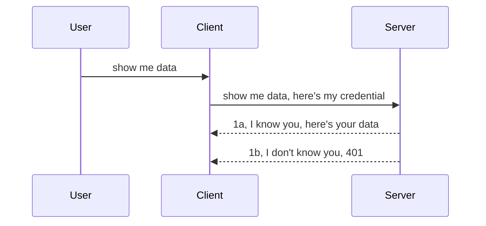

<!--
CO_OP_TRANSLATOR_METADATA:
{
  "original_hash": "5b00b8a8971a07d2d8803be4c9f138f8",
  "translation_date": "2025-10-07T00:41:51+00:00",
  "source_file": "03-GettingStarted/11-simple-auth/README.md",
  "language_code": "mr"
}
-->
# साधी प्रमाणीकरण प्रणाली

MCP SDKs OAuth 2.1 चा वापर समर्थन करतात, जो प्रामाणिकपणे सांगायचे तर एक गुंतागुंतीची प्रक्रिया आहे ज्यामध्ये प्रमाणीकरण सर्व्हर, संसाधन सर्व्हर, क्रेडेन्शियल्स पोस्ट करणे, कोड मिळवणे, कोडला बियरर टोकनमध्ये बदलणे आणि शेवटी तुमचा संसाधन डेटा मिळवणे यासारख्या संकल्पनांचा समावेश आहे. जर तुम्ही OAuth वापरण्यास अनभिज्ञ असाल, जो अंमलात आणण्यासाठी एक उत्कृष्ट गोष्ट आहे, तर मूलभूत स्तरावर प्रमाणीकरणासह सुरुवात करणे आणि अधिक चांगल्या सुरक्षा उपायांकडे जाणे चांगले आहे. म्हणूनच हा अध्याय अस्तित्वात आहे, तुम्हाला अधिक प्रगत प्रमाणीकरणासाठी तयार करण्यासाठी.

## प्रमाणीकरण म्हणजे काय?

प्रमाणीकरण म्हणजे "Authentication" आणि "Authorization" यासाठी संक्षेप आहे. यामध्ये दोन गोष्टी करणे आवश्यक आहे:

- **Authentication**, म्हणजे एखाद्या व्यक्तीला आमच्या घरात प्रवेश करण्याची परवानगी आहे का हे शोधण्याची प्रक्रिया, म्हणजेच त्यांना "येथे" प्रवेश करण्याचा अधिकार आहे का, जिथे आमच्या MCP सर्व्हरची वैशिष्ट्ये आहेत.
- **Authorization**, म्हणजे एखाद्या वापरकर्त्याला त्यांनी विचारलेल्या विशिष्ट संसाधनांमध्ये प्रवेश असावा का हे शोधण्याची प्रक्रिया, उदाहरणार्थ, ऑर्डर्स किंवा उत्पादने, किंवा ते सामग्री वाचण्यास परवानगी देतात पण ती हटवू शकत नाहीत.

## क्रेडेन्शियल्स: प्रणालीला आपण कोण आहोत हे सांगण्याचा मार्ग

बरं, बहुतेक वेब विकसक क्रेडेन्शियल्स प्रदान करण्याच्या दृष्टीने विचार करतात, सामान्यतः एक गुपित जे सांगते की त्यांना "Authentication" साठी येथे परवानगी आहे. हे क्रेडेन्शियल सामान्यतः वापरकर्तानाव आणि पासवर्डचे बेस64 एन्कोड केलेले आवृत्ती किंवा विशिष्ट वापरकर्त्याला अद्वितीयपणे ओळखणारी API की असते.

हे "Authorization" नावाच्या हेडरद्वारे पाठवले जाते, असे:

```json
{ "Authorization": "secret123" }
```

याला सामान्यतः बेसिक प्रमाणीकरण म्हणतात. संपूर्ण प्रवाह कसा कार्य करतो ते खालीलप्रमाणे आहे:



आता प्रवाहाच्या दृष्टिकोनातून हे कसे कार्य करते ते समजले आहे, ते अंमलात कसे आणायचे? बरं, बहुतेक वेब सर्व्हरमध्ये "middleware" नावाची संकल्पना असते, एक कोडचा भाग जो विनंतीचा भाग म्हणून चालतो जो क्रेडेन्शियल्स सत्यापित करू शकतो आणि क्रेडेन्शियल्स वैध असल्यास विनंतीला पुढे जाण्याची परवानगी देतो. जर विनंतीमध्ये वैध क्रेडेन्शियल्स नसतील तर तुम्हाला प्रमाणीकरण त्रुटी मिळते. हे कसे अंमलात आणता येईल ते पाहूया:

**Python**

```python
class AuthMiddleware(BaseHTTPMiddleware):
    async def dispatch(self, request, call_next):

        has_header = request.headers.get("Authorization")
        if not has_header:
            print("-> Missing Authorization header!")
            return Response(status_code=401, content="Unauthorized")

        if not valid_token(has_header):
            print("-> Invalid token!")
            return Response(status_code=403, content="Forbidden")

        print("Valid token, proceeding...")
       
        response = await call_next(request)
        # add any customer headers or change in the response in some way
        return response


starlette_app.add_middleware(CustomHeaderMiddleware)
```

येथे आम्ही:

- `AuthMiddleware` नावाचा middleware तयार केला आहे जिथे त्याचा `dispatch` पद्धत वेब सर्व्हरद्वारे बोलवला जात आहे.
- वेब सर्व्हरमध्ये middleware जोडले आहे:

    ```python
    starlette_app.add_middleware(AuthMiddleware)
    ```

- सत्यापन लॉजिक लिहिले आहे जे तपासते की Authorization हेडर उपस्थित आहे का आणि पाठवलेले गुपित वैध आहे का:

    ```python
    has_header = request.headers.get("Authorization")
    if not has_header:
        print("-> Missing Authorization header!")
        return Response(status_code=401, content="Unauthorized")

    if not valid_token(has_header):
        print("-> Invalid token!")
        return Response(status_code=403, content="Forbidden")
    ```

    जर गुपित उपस्थित असेल आणि वैध असेल तर आम्ही `call_next` कॉल करून विनंतीला पुढे जाण्याची परवानगी देतो आणि प्रतिसाद परत करतो.

    ```python
    response = await call_next(request)
    # add any customer headers or change in the response in some way
    return response
    ```

हे कसे कार्य करते ते असे आहे की वेब सर्व्हरकडे विनंती केली गेली तर middleware सक्रिय होईल आणि त्याच्या अंमलबजावणीमुळे विनंतीला पुढे जाण्याची परवानगी दिली जाईल किंवा क्लायंटला पुढे जाण्याची परवानगी नाही हे सूचित करणारी त्रुटी परत येईल.

**TypeScript**

येथे आम्ही Express या लोकप्रिय फ्रेमवर्कसह middleware तयार करतो आणि MCP सर्व्हरपर्यंत पोहोचण्यापूर्वी विनंती अडवतो. त्यासाठी कोड खालीलप्रमाणे आहे:

```typescript
function isValid(secret) {
    return secret === "secret123";
}

app.use((req, res, next) => {
    // 1. Authorization header present?  
    if(!req.headers["Authorization"]) {
        res.status(401).send('Unauthorized');
    }
    
    let token = req.headers["Authorization"];

    // 2. Check validity.
    if(!isValid(token)) {
        res.status(403).send('Forbidden');
    }

   
    console.log('Middleware executed');
    // 3. Passes request to the next step in the request pipeline.
    next();
});
```

या कोडमध्ये आम्ही:

1. प्रथम Authorization हेडर उपस्थित आहे का ते तपासतो, जर नसेल तर आम्ही 401 त्रुटी पाठवतो.
2. क्रेडेन्शियल/टोकन वैध आहे याची खात्री करतो, जर नसेल तर आम्ही 403 त्रुटी पाठवतो.
3. शेवटी विनंती पाइपलाइनमध्ये विनंती पास करतो आणि विचारलेले संसाधन परत करतो.

## व्यायाम: प्रमाणीकरण अंमलात आणा

आता आपले ज्ञान घेऊन ते अंमलात आणण्याचा प्रयत्न करूया. योजना अशी आहे:

सर्व्हर

- वेब सर्व्हर आणि MCP उदाहरण तयार करा.
- सर्व्हरसाठी middleware अंमलात आणा.

क्लायंट 

- हेडरद्वारे क्रेडेन्शियलसह वेब विनंती पाठवा.

### -1- वेब सर्व्हर आणि MCP उदाहरण तयार करा

आमच्या पहिल्या चरणात, आम्हाला वेब सर्व्हर उदाहरण आणि MCP सर्व्हर तयार करणे आवश्यक आहे.

**Python**

येथे आम्ही MCP सर्व्हर उदाहरण तयार करतो, स्टारलेट वेब अॅप तयार करतो आणि ते uvicorn सह होस्ट करतो.

```python
# creating MCP Server

app = FastMCP(
    name="MCP Resource Server",
    instructions="Resource Server that validates tokens via Authorization Server introspection",
    host=settings["host"],
    port=settings["port"],
    debug=True
)

# creating starlette web app
starlette_app = app.streamable_http_app()

# serving app via uvicorn
async def run(starlette_app):
    import uvicorn
    config = uvicorn.Config(
            starlette_app,
            host=app.settings.host,
            port=app.settings.port,
            log_level=app.settings.log_level.lower(),
        )
    server = uvicorn.Server(config)
    await server.serve()

run(starlette_app)
```

या कोडमध्ये आम्ही:

- MCP सर्व्हर तयार केला.
- MCP सर्व्हरमधून स्टारलेट वेब अॅप तयार केला, `app.streamable_http_app()`.
- uvicorn वापरून वेब अॅप होस्ट आणि सर्व्ह केला `server.serve()`.

**TypeScript**

येथे आम्ही MCP सर्व्हर उदाहरण तयार करतो.

```typescript
const server = new McpServer({
      name: "example-server",
      version: "1.0.0"
    });

    // ... set up server resources, tools, and prompts ...
```

ही MCP सर्व्हर निर्मिती आमच्या POST /mcp रूट परिभाषेत होणे आवश्यक आहे, म्हणून वरील कोड असे हलवूया:

```typescript
import express from "express";
import { randomUUID } from "node:crypto";
import { McpServer } from "@modelcontextprotocol/sdk/server/mcp.js";
import { StreamableHTTPServerTransport } from "@modelcontextprotocol/sdk/server/streamableHttp.js";
import { isInitializeRequest } from "@modelcontextprotocol/sdk/types.js"

const app = express();
app.use(express.json());

// Map to store transports by session ID
const transports: { [sessionId: string]: StreamableHTTPServerTransport } = {};

// Handle POST requests for client-to-server communication
app.post('/mcp', async (req, res) => {
  // Check for existing session ID
  const sessionId = req.headers['mcp-session-id'] as string | undefined;
  let transport: StreamableHTTPServerTransport;

  if (sessionId && transports[sessionId]) {
    // Reuse existing transport
    transport = transports[sessionId];
  } else if (!sessionId && isInitializeRequest(req.body)) {
    // New initialization request
    transport = new StreamableHTTPServerTransport({
      sessionIdGenerator: () => randomUUID(),
      onsessioninitialized: (sessionId) => {
        // Store the transport by session ID
        transports[sessionId] = transport;
      },
      // DNS rebinding protection is disabled by default for backwards compatibility. If you are running this server
      // locally, make sure to set:
      // enableDnsRebindingProtection: true,
      // allowedHosts: ['127.0.0.1'],
    });

    // Clean up transport when closed
    transport.onclose = () => {
      if (transport.sessionId) {
        delete transports[transport.sessionId];
      }
    };
    const server = new McpServer({
      name: "example-server",
      version: "1.0.0"
    });

    // ... set up server resources, tools, and prompts ...

    // Connect to the MCP server
    await server.connect(transport);
  } else {
    // Invalid request
    res.status(400).json({
      jsonrpc: '2.0',
      error: {
        code: -32000,
        message: 'Bad Request: No valid session ID provided',
      },
      id: null,
    });
    return;
  }

  // Handle the request
  await transport.handleRequest(req, res, req.body);
});

// Reusable handler for GET and DELETE requests
const handleSessionRequest = async (req: express.Request, res: express.Response) => {
  const sessionId = req.headers['mcp-session-id'] as string | undefined;
  if (!sessionId || !transports[sessionId]) {
    res.status(400).send('Invalid or missing session ID');
    return;
  }
  
  const transport = transports[sessionId];
  await transport.handleRequest(req, res);
};

// Handle GET requests for server-to-client notifications via SSE
app.get('/mcp', handleSessionRequest);

// Handle DELETE requests for session termination
app.delete('/mcp', handleSessionRequest);

app.listen(3000);
```

आता तुम्ही पाहू शकता की MCP सर्व्हर निर्मिती `app.post("/mcp")` मध्ये हलवली गेली आहे.

चला पुढील चरणाकडे जाऊया, म्हणजेच middleware तयार करणे जेणेकरून येणाऱ्या क्रेडेन्शियलची पडताळणी करता येईल.

### -2- सर्व्हरसाठी middleware अंमलात आणा

चला पुढे middleware भाग तयार करूया. येथे आम्ही एक middleware तयार करू जो `Authorization` हेडरमध्ये क्रेडेन्शियल शोधतो आणि त्याची पडताळणी करतो. जर ते स्वीकारण्यायोग्य असेल तर विनंती पुढे जाईल आणि आवश्यक कार्य करेल (उदा. साधने सूचीबद्ध करणे, संसाधन वाचणे किंवा क्लायंटने विचारलेले MCP कार्य).

**Python**

middleware तयार करण्यासाठी, आम्हाला `BaseHTTPMiddleware` पासून वारसाहक्क असलेला वर्ग तयार करणे आवश्यक आहे. येथे दोन महत्त्वाचे भाग आहेत:

- विनंती `request`, जिथून आम्ही हेडर माहिती वाचतो.
- `call_next` कॉलबॅक जो आम्हाला बोलवायचा आहे जर क्लायंटने आम्ही स्वीकारलेले क्रेडेन्शियल आणले असेल.

प्रथम, जर `Authorization` हेडर गहाळ असेल तर आम्हाला केस हाताळणे आवश्यक आहे:

```python
has_header = request.headers.get("Authorization")

# no header present, fail with 401, otherwise move on.
if not has_header:
    print("-> Missing Authorization header!")
    return Response(status_code=401, content="Unauthorized")
```

येथे आम्ही 401 अनधिकृत संदेश पाठवतो कारण क्लायंट प्रमाणीकरण अयशस्वी होत आहे.

यानंतर, जर क्रेडेन्शियल सबमिट केले गेले असेल, तर आम्हाला त्याची वैधता तपासणे आवश्यक आहे:

```python
 if not valid_token(has_header):
    print("-> Invalid token!")
    return Response(status_code=403, content="Forbidden")
```

वरीलप्रमाणे आम्ही 403 प्रतिबंधित संदेश पाठवतो. खाली संपूर्ण middleware पाहूया:

```python
class AuthMiddleware(BaseHTTPMiddleware):
    async def dispatch(self, request, call_next):

        has_header = request.headers.get("Authorization")
        if not has_header:
            print("-> Missing Authorization header!")
            return Response(status_code=401, content="Unauthorized")

        if not valid_token(has_header):
            print("-> Invalid token!")
            return Response(status_code=403, content="Forbidden")

        print("Valid token, proceeding...")
        print(f"-> Received {request.method} {request.url}")
        response = await call_next(request)
        response.headers['Custom'] = 'Example'
        return response

```

छान, पण `valid_token` फंक्शनबद्दल काय? ते खाली आहे:

```python
# DON'T use for production - improve it !!
def valid_token(token: str) -> bool:
    # remove the "Bearer " prefix
    if token.startswith("Bearer "):
        token = token[7:]
        return token == "secret-token"
    return False
```

हे स्पष्टपणे सुधारले पाहिजे.

महत्त्वाचे: तुम्ही कधीही कोडमध्ये गुपिते ठेवू नय
पुढे, आपण भूमिका आधारित प्रवेश नियंत्रण, ज्याला RBAC म्हणून ओळखले जाते, यावर चर्चा करूया.

## भूमिका आधारित प्रवेश नियंत्रण जोडणे

कल्पना अशी आहे की वेगवेगळ्या भूमिकांना वेगवेगळ्या परवानग्या असतात हे व्यक्त करायचे आहे. उदाहरणार्थ, आम्ही गृहीत धरतो की एक प्रशासक सर्वकाही करू शकतो, सामान्य वापरकर्ते वाचू/लिहू शकतात आणि पाहुणे फक्त वाचू शकतात. म्हणून, येथे काही संभाव्य परवानगी स्तर आहेत:

- Admin.Write 
- User.Read
- Guest.Read

चला पाहूया की अशा प्रकारचे नियंत्रण मध्यस्थांसह कसे लागू करता येईल. मध्यस्थे विशिष्ट मार्गांसाठी तसेच सर्व मार्गांसाठी जोडता येतात.

**Python**

```python
from starlette.middleware.base import BaseHTTPMiddleware
from starlette.responses import JSONResponse
import jwt

# DON'T have the secret in the code like, this is for demonstration purposes only. Read it from a safe place.
SECRET_KEY = "your-secret-key" # put this in env variable
REQUIRED_PERMISSION = "User.Read"

class JWTPermissionMiddleware(BaseHTTPMiddleware):
    async def dispatch(self, request, call_next):
        auth_header = request.headers.get("Authorization")
        if not auth_header or not auth_header.startswith("Bearer "):
            return JSONResponse({"error": "Missing or invalid Authorization header"}, status_code=401)

        token = auth_header.split(" ")[1]
        try:
            decoded = jwt.decode(token, SECRET_KEY, algorithms=["HS256"])
        except jwt.ExpiredSignatureError:
            return JSONResponse({"error": "Token expired"}, status_code=401)
        except jwt.InvalidTokenError:
            return JSONResponse({"error": "Invalid token"}, status_code=401)

        permissions = decoded.get("permissions", [])
        if REQUIRED_PERMISSION not in permissions:
            return JSONResponse({"error": "Permission denied"}, status_code=403)

        request.state.user = decoded
        return await call_next(request)


```

मध्यस्थ जोडण्यासाठी खालीलप्रमाणे काही वेगवेगळे मार्ग आहेत:

```python

# Alt 1: add middleware while constructing starlette app
middleware = [
    Middleware(JWTPermissionMiddleware)
]

app = Starlette(routes=routes, middleware=middleware)

# Alt 2: add middleware after starlette app is a already constructed
starlette_app.add_middleware(JWTPermissionMiddleware)

# Alt 3: add middleware per route
routes = [
    Route(
        "/mcp",
        endpoint=..., # handler
        middleware=[Middleware(JWTPermissionMiddleware)]
    )
]
```

**TypeScript**

आपण `app.use` वापरू शकतो आणि एक मध्यस्थ जोडू शकतो जो सर्व विनंत्यांसाठी चालेल.

```typescript
app.use((req, res, next) => {
    console.log('Request received:', req.method, req.url, req.headers);
    console.log('Headers:', req.headers["authorization"]);

    // 1. Check if authorization header has been sent

    if(!req.headers["authorization"]) {
        res.status(401).send('Unauthorized');
        return;
    }
    
    let token = req.headers["authorization"];

    // 2. Check if token is valid
    if(!isValid(token)) {
        res.status(403).send('Forbidden');
        return;
    }  

    // 3. Check if token user exist in our system
    if(!isExistingUser(token)) {
        res.status(403).send('Forbidden');
        console.log("User does not exist");
        return;
    }
    console.log("User exists");

    // 4. Verify the token has the right permissions
    if(!hasScopes(token, ["User.Read"])){
        res.status(403).send('Forbidden - insufficient scopes');
    }

    console.log("User has required scopes");

    console.log('Middleware executed');
    next();
});

```

मध्यस्थे काय करू शकतात आणि काय करायला हवे यामध्ये काही महत्त्वाचे मुद्दे आहेत, म्हणजे:

1. तपासा की अधिकृतता हेडर उपस्थित आहे का
2. टोकन वैध आहे का तपासा, आम्ही `isValid` नावाची पद्धत वापरतो जी JWT टोकनची अखंडता आणि वैधता तपासते.
3. वापरकर्ता आमच्या प्रणालीमध्ये अस्तित्वात आहे का ते सत्यापित करा, हे तपासणे आवश्यक आहे.

   ```typescript
    // users in DB
   const users = [
     "user1",
     "User usersson",
   ]

   function isExistingUser(token) {
     let decodedToken = verifyToken(token);

     // TODO, check if user exists in DB
     return users.includes(decodedToken?.name || "");
   }
   ```

   वर, आम्ही एक साधी `users` यादी तयार केली आहे, जी स्पष्टपणे डेटाबेसमध्ये असायला हवी.

4. याशिवाय, टोकनमध्ये योग्य परवानग्या आहेत का हे देखील तपासले पाहिजे.

   ```typescript
   if(!hasScopes(token, ["User.Read"])){
        res.status(403).send('Forbidden - insufficient scopes');
   }
   ```

   वर दिलेल्या कोडमध्ये, आम्ही तपासतो की टोकनमध्ये User.Read परवानगी आहे का, जर नसेल तर आम्ही 403 त्रुटी पाठवतो. खाली `hasScopes` सहाय्यक पद्धत आहे.

   ```typescript
   function hasScopes(scope: string, requiredScopes: string[]) {
     let decodedToken = verifyToken(scope);
    return requiredScopes.every(scope => decodedToken?.scopes.includes(scope));
  }
   ```

Have a think which additional checks you should be doing, but these are the absolute minimum of checks you should be doing.

Using Express as a web framework is a common choice. There are helpers library when you use JWT so you can write less code.

- `express-jwt`, helper library that provides a middleware that helps decode your token.
- `express-jwt-permissions`, this provides a middleware `guard` that helps check if a certain permission is on the token.

Here's what these libraries can look like when used:

```typescript
const express = require('express');
const jwt = require('express-jwt');
const guard = require('express-jwt-permissions')();

const app = express();
const secretKey = 'your-secret-key'; // put this in env variable

// Decode JWT and attach to req.user
app.use(jwt({ secret: secretKey, algorithms: ['HS256'] }));

// Check for User.Read permission
app.use(guard.check('User.Read'));

// multiple permissions
// app.use(guard.check(['User.Read', 'Admin.Access']));

app.get('/protected', (req, res) => {
  res.json({ message: `Welcome ${req.user.name}` });
});

// Error handler
app.use((err, req, res, next) => {
  if (err.code === 'permission_denied') {
    return res.status(403).send('Forbidden');
  }
  next(err);
});

```

आता तुम्ही पाहिले आहे की मध्यस्थे प्रमाणीकरण आणि अधिकृततेसाठी कसे वापरले जाऊ शकतात, MCP बद्दल काय, ते प्रमाणीकरण कसे बदलते? पुढील विभागात शोधूया.

### -3- MCP साठी RBAC जोडा

आतापर्यंत तुम्ही पाहिले आहे की मध्यस्थांद्वारे RBAC कसे जोडता येते, तथापि, MCP साठी प्रत्येक MCP वैशिष्ट्यासाठी RBAC जोडण्याचा सोपा मार्ग नाही, तर आपण काय करतो? बरं, आपल्याला फक्त असे कोड जोडावे लागेल जे या प्रकरणात तपासते की क्लायंटला विशिष्ट साधन कॉल करण्याचा अधिकार आहे का:

प्रत्येक वैशिष्ट्यासाठी RBAC साध्य करण्यासाठी तुमच्याकडे काही वेगवेगळे पर्याय आहेत, येथे काही आहेत:

- प्रत्येक साधन, संसाधन, प्रॉम्प्टसाठी तपासणी जोडा जिथे तुम्हाला परवानगी स्तर तपासण्याची आवश्यकता आहे.

   **Python**

   ```python
   @tool()
   def delete_product(id: int):
      try:
          check_permissions(role="Admin.Write", request)
      catch:
        pass # client failed authorization, raise authorization error
   ```

   **TypeScript**

   ```typescript
   server.registerTool(
    "delete-product",
    {
      title: Delete a product",
      description: "Deletes a product",
      inputSchema: { id: z.number() }
    },
    async ({ id }) => {
      
      try {
        checkPermissions("Admin.Write", request);
        // todo, send id to productService and remote entry
      } catch(Exception e) {
        console.log("Authorization error, you're not allowed");  
      }

      return {
        content: [{ type: "text", text: `Deletected product with id ${id}` }]
      };
    }
   );
   ```


- प्रगत सर्व्हर दृष्टिकोन आणि विनंती हँडलर्स वापरा जेणेकरून तुम्हाला तपासणी करायच्या ठिकाणांची संख्या कमी होईल.

   **Python**

   ```python
   
   tool_permission = {
      "create_product": ["User.Write", "Admin.Write"],
      "delete_product": ["Admin.Write"]
   }

   def has_permission(user_permissions, required_permissions) -> bool:
      # user_permissions: list of permissions the user has
      # required_permissions: list of permissions required for the tool
      return any(perm in user_permissions for perm in required_permissions)

   @server.call_tool()
   async def handle_call_tool(
     name: str, arguments: dict[str, str] | None
   ) -> list[types.TextContent]:
    # Assume request.user.permissions is a list of permissions for the user
     user_permissions = request.user.permissions
     required_permissions = tool_permission.get(name, [])
     if not has_permission(user_permissions, required_permissions):
        # Raise error "You don't have permission to call tool {name}"
        raise Exception(f"You don't have permission to call tool {name}")
     # carry on and call tool
     # ...
   ```   
   

   **TypeScript**

   ```typescript
   function hasPermission(userPermissions: string[], requiredPermissions: string[]): boolean {
       if (!Array.isArray(userPermissions) || !Array.isArray(requiredPermissions)) return false;
       // Return true if user has at least one required permission
       
       return requiredPermissions.some(perm => userPermissions.includes(perm));
   }
  
   server.setRequestHandler(CallToolRequestSchema, async (request) => {
      const { params: { name } } = request;
  
      let permissions = request.user.permissions;
  
      if (!hasPermission(permissions, toolPermissions[name])) {
         return new Error(`You don't have permission to call ${name}`);
      }
  
      // carry on..
   });
   ```

   लक्षात ठेवा, तुम्हाला तुमच्या मध्यस्थाने विनंतीच्या user प्रॉपर्टीला डिकोड केलेले टोकन असाइन करणे सुनिश्चित करावे लागेल जेणेकरून वरील कोड सोपा होईल.

### संक्षेप

आता आपण सामान्यतः RBAC कसे जोडायचे आणि MCP साठी विशेषतः कसे जोडायचे यावर चर्चा केली आहे, आता तुम्ही सादर केलेल्या संकल्पना समजल्या आहेत याची खात्री करण्यासाठी स्वतःच सुरक्षा लागू करण्याचा प्रयत्न करा.

## असाइनमेंट 1: बेसिक प्रमाणीकरण वापरून MCP सर्व्हर आणि MCP क्लायंट तयार करा

येथे तुम्ही हेडर्सद्वारे क्रेडेन्शियल्स पाठवण्याच्या बाबतीत जे काही शिकलात ते वापराल.

## उपाय 1

[उपाय 1](./code/basic/README.md)

## असाइनमेंट 2: असाइनमेंट 1 मधील उपाय सुधारित करून JWT वापरा

पहिला उपाय घ्या पण यावेळी, त्यावर सुधारणा करूया.

बेसिक ऑथ वापरण्याऐवजी, JWT वापरूया.

## उपाय 2

[उपाय 2](./solution/jwt-solution/README.md)

## आव्हान

"Add RBAC to MCP" विभागात वर्णन केल्याप्रमाणे प्रत्येक साधनासाठी RBAC जोडा.

## संक्षेप

आशा आहे की तुम्ही या अध्यायात बरेच काही शिकलात, सुरुवातीला कोणतीही सुरक्षा नसल्यापासून, बेसिक सुरक्षा, JWT आणि MCP मध्ये ते कसे जोडता येते.

आम्ही कस्टम JWT सह एक मजबूत पाया तयार केला आहे, परंतु जसजसे आम्ही स्केल करतो, तसतसे आम्ही मानक-आधारित ओळख मॉडेलकडे जात आहोत. Entra किंवा Keycloak सारख्या IdP स्वीकारल्याने आम्हाला टोकन जारी करणे, सत्यापन आणि जीवनचक्र व्यवस्थापन विश्वसनीय प्लॅटफॉर्मवर ऑफलोड करण्याची परवानगी मिळते — ज्यामुळे आम्हाला अॅप लॉजिक आणि वापरकर्ता अनुभवावर लक्ष केंद्रित करता येते.

त्यासाठी, आमच्याकडे [Entra वर अधिक प्रगत अध्याय](../../05-AdvancedTopics/mcp-security-entra/README.md) आहे.

---

**अस्वीकरण**:  
हा दस्तऐवज AI भाषांतर सेवा [Co-op Translator](https://github.com/Azure/co-op-translator) वापरून भाषांतरित करण्यात आला आहे. आम्ही अचूकतेसाठी प्रयत्नशील असलो तरी कृपया लक्षात ठेवा की स्वयंचलित भाषांतरांमध्ये त्रुटी किंवा अचूकतेचा अभाव असू शकतो. मूळ भाषेतील दस्तऐवज हा अधिकृत स्रोत मानला जावा. महत्त्वाच्या माहितीसाठी व्यावसायिक मानवी भाषांतराची शिफारस केली जाते. या भाषांतराचा वापर करून उद्भवलेल्या कोणत्याही गैरसमज किंवा चुकीच्या अर्थासाठी आम्ही जबाबदार राहणार नाही.