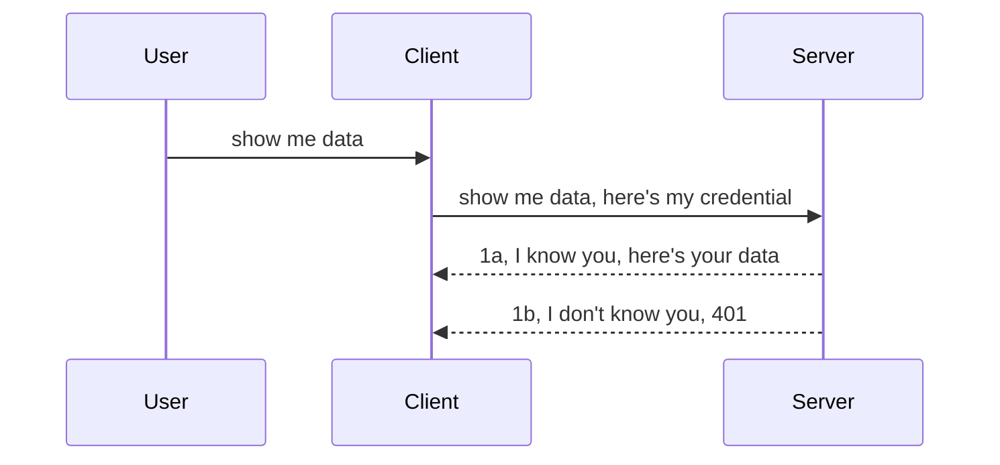

<!--
CO_OP_TRANSLATOR_METADATA:
{
  "original_hash": "5b00b8a8971a07d2d8803be4c9f138f8",
  "translation_date": "2025-10-07T00:58:03+00:00",
  "source_file": "03-GettingStarted/11-simple-auth/README.md",
  "language_code": "ms"
}
-->
# Auth Mudah

SDK MCP menyokong penggunaan OAuth 2.1 yang, secara jujurnya, adalah proses yang agak kompleks melibatkan konsep seperti pelayan pengesahan, pelayan sumber, menghantar kelayakan, mendapatkan kod, menukar kod kepada token pembawa sehingga akhirnya anda boleh mendapatkan data sumber anda. Jika anda tidak biasa dengan OAuth, yang merupakan sesuatu yang bagus untuk dilaksanakan, adalah idea yang baik untuk bermula dengan tahap pengesahan asas dan membina kepada keselamatan yang lebih baik. Itulah sebabnya bab ini wujud, untuk membantu anda membina pengesahan yang lebih maju.

## Auth, apa maksudnya?

Auth adalah singkatan untuk pengesahan dan kebenaran. Ideanya adalah kita perlu melakukan dua perkara:

- **Pengesahan**, iaitu proses menentukan sama ada kita membenarkan seseorang masuk ke rumah kita, bahawa mereka mempunyai hak untuk berada "di sini", iaitu mempunyai akses kepada pelayan sumber kita di mana ciri-ciri Pelayan MCP kita berada.
- **Kebenaran**, adalah proses menentukan sama ada pengguna sepatutnya mempunyai akses kepada sumber tertentu yang mereka minta, contohnya pesanan ini atau produk ini, atau sama ada mereka dibenarkan membaca kandungan tetapi tidak memadam sebagai contoh lain.

## Kelayakan: bagaimana kita memberitahu sistem siapa kita

Kebanyakan pembangun web di luar sana biasanya mula berfikir dalam konteks memberikan kelayakan kepada pelayan, biasanya rahsia yang mengatakan sama ada mereka dibenarkan berada di sini "Pengesahan". Kelayakan ini biasanya adalah versi nama pengguna dan kata laluan yang dikodkan base64 atau kunci API yang mengenal pasti pengguna tertentu secara unik.

Ini melibatkan penghantaran melalui header yang dipanggil "Authorization" seperti berikut:

```json
{ "Authorization": "secret123" }
```

Ini biasanya dirujuk sebagai pengesahan asas. Bagaimana aliran keseluruhan berfungsi adalah seperti berikut:



Sekarang kita memahami bagaimana ia berfungsi dari sudut pandangan aliran, bagaimana kita melaksanakannya? Kebanyakan pelayan web mempunyai konsep yang dipanggil middleware, iaitu sekeping kod yang berjalan sebagai sebahagian daripada permintaan yang boleh mengesahkan kelayakan, dan jika kelayakan sah, membenarkan permintaan diteruskan. Jika permintaan tidak mempunyai kelayakan yang sah, anda akan mendapat ralat pengesahan. Mari kita lihat bagaimana ini boleh dilaksanakan:

**Python**

```python
class AuthMiddleware(BaseHTTPMiddleware):
    async def dispatch(self, request, call_next):

        has_header = request.headers.get("Authorization")
        if not has_header:
            print("-> Missing Authorization header!")
            return Response(status_code=401, content="Unauthorized")

        if not valid_token(has_header):
            print("-> Invalid token!")
            return Response(status_code=403, content="Forbidden")

        print("Valid token, proceeding...")
       
        response = await call_next(request)
        # add any customer headers or change in the response in some way
        return response


starlette_app.add_middleware(CustomHeaderMiddleware)
```

Di sini kita telah:

- Mencipta middleware yang dipanggil `AuthMiddleware` di mana kaedah `dispatch`nya dipanggil oleh pelayan web.
- Menambah middleware kepada pelayan web:

    ```python
    starlette_app.add_middleware(AuthMiddleware)
    ```

- Menulis logik pengesahan yang memeriksa sama ada header Authorization hadir dan sama ada rahsia yang dihantar adalah sah:

    ```python
    has_header = request.headers.get("Authorization")
    if not has_header:
        print("-> Missing Authorization header!")
        return Response(status_code=401, content="Unauthorized")

    if not valid_token(has_header):
        print("-> Invalid token!")
        return Response(status_code=403, content="Forbidden")
    ```

    jika rahsia hadir dan sah, maka kita membenarkan permintaan diteruskan dengan memanggil `call_next` dan mengembalikan respons.

    ```python
    response = await call_next(request)
    # add any customer headers or change in the response in some way
    return response
    ```

Bagaimana ia berfungsi ialah jika permintaan web dibuat kepada pelayan, middleware akan dipanggil dan berdasarkan pelaksanaannya, ia sama ada membenarkan permintaan diteruskan atau mengembalikan ralat yang menunjukkan bahawa klien tidak dibenarkan meneruskan.

**TypeScript**

Di sini kita mencipta middleware dengan rangka kerja popular Express dan memintas permintaan sebelum ia sampai ke Pelayan MCP. Berikut adalah kodnya:

```typescript
function isValid(secret) {
    return secret === "secret123";
}

app.use((req, res, next) => {
    // 1. Authorization header present?  
    if(!req.headers["Authorization"]) {
        res.status(401).send('Unauthorized');
    }
    
    let token = req.headers["Authorization"];

    // 2. Check validity.
    if(!isValid(token)) {
        res.status(403).send('Forbidden');
    }

   
    console.log('Middleware executed');
    // 3. Passes request to the next step in the request pipeline.
    next();
});
```

Dalam kod ini kita:

1. Memeriksa sama ada header Authorization hadir, jika tidak, kita menghantar ralat 401.
2. Memastikan kelayakan/token adalah sah, jika tidak, kita menghantar ralat 403.
3. Akhirnya membenarkan permintaan diteruskan dalam pipeline permintaan dan mengembalikan sumber yang diminta.

## Latihan: Melaksanakan pengesahan

Mari kita ambil pengetahuan kita dan cuba melaksanakannya. Berikut adalah rancangannya:

Pelayan

- Cipta pelayan web dan instance MCP.
- Laksanakan middleware untuk pelayan.

Klien 

- Hantar permintaan web, dengan kelayakan, melalui header.

### -1- Cipta pelayan web dan instance MCP

Dalam langkah pertama kita, kita perlu mencipta instance pelayan web dan Pelayan MCP.

**Python**

Di sini kita mencipta instance pelayan MCP, mencipta aplikasi web starlette dan menghoskannya dengan uvicorn.

```python
# creating MCP Server

app = FastMCP(
    name="MCP Resource Server",
    instructions="Resource Server that validates tokens via Authorization Server introspection",
    host=settings["host"],
    port=settings["port"],
    debug=True
)

# creating starlette web app
starlette_app = app.streamable_http_app()

# serving app via uvicorn
async def run(starlette_app):
    import uvicorn
    config = uvicorn.Config(
            starlette_app,
            host=app.settings.host,
            port=app.settings.port,
            log_level=app.settings.log_level.lower(),
        )
    server = uvicorn.Server(config)
    await server.serve()

run(starlette_app)
```

Dalam kod ini kita:

- Mencipta Pelayan MCP.
- Membina aplikasi web starlette daripada Pelayan MCP, `app.streamable_http_app()`.
- Menghoskan dan melayani aplikasi web menggunakan uvicorn `server.serve()`.

**TypeScript**

Di sini kita mencipta instance Pelayan MCP.

```typescript
const server = new McpServer({
      name: "example-server",
      version: "1.0.0"
    });

    // ... set up server resources, tools, and prompts ...
```

Penciptaan Pelayan MCP ini perlu berlaku dalam definisi laluan POST /mcp kita, jadi mari kita ambil kod di atas dan pindahkan seperti berikut:

```typescript
import express from "express";
import { randomUUID } from "node:crypto";
import { McpServer } from "@modelcontextprotocol/sdk/server/mcp.js";
import { StreamableHTTPServerTransport } from "@modelcontextprotocol/sdk/server/streamableHttp.js";
import { isInitializeRequest } from "@modelcontextprotocol/sdk/types.js"

const app = express();
app.use(express.json());

// Map to store transports by session ID
const transports: { [sessionId: string]: StreamableHTTPServerTransport } = {};

// Handle POST requests for client-to-server communication
app.post('/mcp', async (req, res) => {
  // Check for existing session ID
  const sessionId = req.headers['mcp-session-id'] as string | undefined;
  let transport: StreamableHTTPServerTransport;

  if (sessionId && transports[sessionId]) {
    // Reuse existing transport
    transport = transports[sessionId];
  } else if (!sessionId && isInitializeRequest(req.body)) {
    // New initialization request
    transport = new StreamableHTTPServerTransport({
      sessionIdGenerator: () => randomUUID(),
      onsessioninitialized: (sessionId) => {
        // Store the transport by session ID
        transports[sessionId] = transport;
      },
      // DNS rebinding protection is disabled by default for backwards compatibility. If you are running this server
      // locally, make sure to set:
      // enableDnsRebindingProtection: true,
      // allowedHosts: ['127.0.0.1'],
    });

    // Clean up transport when closed
    transport.onclose = () => {
      if (transport.sessionId) {
        delete transports[transport.sessionId];
      }
    };
    const server = new McpServer({
      name: "example-server",
      version: "1.0.0"
    });

    // ... set up server resources, tools, and prompts ...

    // Connect to the MCP server
    await server.connect(transport);
  } else {
    // Invalid request
    res.status(400).json({
      jsonrpc: '2.0',
      error: {
        code: -32000,
        message: 'Bad Request: No valid session ID provided',
      },
      id: null,
    });
    return;
  }

  // Handle the request
  await transport.handleRequest(req, res, req.body);
});

// Reusable handler for GET and DELETE requests
const handleSessionRequest = async (req: express.Request, res: express.Response) => {
  const sessionId = req.headers['mcp-session-id'] as string | undefined;
  if (!sessionId || !transports[sessionId]) {
    res.status(400).send('Invalid or missing session ID');
    return;
  }
  
  const transport = transports[sessionId];
  await transport.handleRequest(req, res);
};

// Handle GET requests for server-to-client notifications via SSE
app.get('/mcp', handleSessionRequest);

// Handle DELETE requests for session termination
app.delete('/mcp', handleSessionRequest);

app.listen(3000);
```

Sekarang anda melihat bagaimana penciptaan Pelayan MCP dipindahkan dalam `app.post("/mcp")`.

Mari kita teruskan ke langkah seterusnya untuk mencipta middleware supaya kita boleh mengesahkan kelayakan yang masuk.

### -2- Laksanakan middleware untuk pelayan

Mari kita teruskan ke bahagian middleware seterusnya. Di sini kita akan mencipta middleware yang mencari kelayakan dalam header `Authorization` dan mengesahkannya. Jika ia boleh diterima, maka permintaan akan diteruskan untuk melakukan apa yang perlu (contohnya senarai alat, membaca sumber atau apa sahaja fungsi MCP yang diminta oleh klien).

**Python**

Untuk mencipta middleware, kita perlu mencipta kelas yang mewarisi daripada `BaseHTTPMiddleware`. Terdapat dua bahagian menarik:

- Permintaan `request`, yang kita baca maklumat header daripadanya.
- `call_next` panggilan balik yang perlu kita panggil jika klien membawa kelayakan yang kita terima.

Pertama, kita perlu menangani kes jika header `Authorization` hilang:

```python
has_header = request.headers.get("Authorization")

# no header present, fail with 401, otherwise move on.
if not has_header:
    print("-> Missing Authorization header!")
    return Response(status_code=401, content="Unauthorized")
```

Di sini kita menghantar mesej 401 tidak dibenarkan kerana klien gagal pengesahan.

Seterusnya, jika kelayakan dihantar, kita perlu memeriksa kesahannya seperti berikut:

```python
 if not valid_token(has_header):
    print("-> Invalid token!")
    return Response(status_code=403, content="Forbidden")
```

Perhatikan bagaimana kita menghantar mesej 403 larangan di atas. Mari kita lihat middleware penuh di bawah yang melaksanakan semua yang kita sebutkan di atas:

```python
class AuthMiddleware(BaseHTTPMiddleware):
    async def dispatch(self, request, call_next):

        has_header = request.headers.get("Authorization")
        if not has_header:
            print("-> Missing Authorization header!")
            return Response(status_code=401, content="Unauthorized")

        if not valid_token(has_header):
            print("-> Invalid token!")
            return Response(status_code=403, content="Forbidden")

        print("Valid token, proceeding...")
        print(f"-> Received {request.method} {request.url}")
        response = await call_next(request)
        response.headers['Custom'] = 'Example'
        return response

```

Bagus, tetapi bagaimana dengan fungsi `valid_token`? Berikut adalah kodnya:

```python
# DON'T use for production - improve it !!
def valid_token(token: str) -> bool:
    # remove the "Bearer " prefix
    if token.startswith("Bearer "):
        token = token[7:]
        return token == "secret-token"
    return False
```

Ini sepatutnya diperbaiki.

PENTING: Anda TIDAK PERNAH sepatutnya mempunyai rahsia seperti ini dalam kod. Anda sepatutnya mendapatkan nilai untuk dibandingkan daripada sumber data atau daripada IDP (penyedia perkhidmatan identiti) atau lebih baik lagi, biarkan IDP melakukan pengesahan.

**TypeScript**

Untuk melaksanakan ini dengan Express, kita perlu memanggil kaedah `use` yang mengambil fungsi middleware.

Kita perlu:

- Berinteraksi dengan pembolehubah permintaan untuk memeriksa kelayakan yang dihantar dalam sifat `Authorization`.
- Mengesahkan kelayakan, dan jika sah, membenarkan permintaan diteruskan dan membiarkan permintaan MCP klien melakukan apa yang sepatutnya (contohnya senarai alat, membaca sumber atau apa sahaja yang berkaitan dengan MCP).

Di sini, kita memeriksa sama ada header `Authorization` hadir dan jika tidak, kita menghentikan permintaan daripada diteruskan:

```typescript
if(!req.headers["authorization"]) {
    res.status(401).send('Unauthorized');
    return;
}
```

Jika header tidak dihantar, anda akan menerima 401.

Seterusnya, kita memeriksa sama ada kelayakan adalah sah, jika tidak, kita sekali lagi menghentikan permintaan tetapi dengan mesej yang sedikit berbeza:

```typescript
if(!isValid(token)) {
    res.status(403).send('Forbidden');
    return;
} 
```

Perhatikan bagaimana anda kini mendapat ralat 403.

Berikut adalah kod penuh:

```typescript
app.use((req, res, next) => {
    console.log('Request received:', req.method, req.url, req.headers);
    console.log('Headers:', req.headers["authorization"]);
    if(!req.headers["authorization"]) {
        res.status(401).send('Unauthorized');
        return;
    }
    
    let token = req.headers["authorization"];

    if(!isValid(token)) {
        res.status(403).send('Forbidden');
        return;
    }  

    console.log('Middleware executed');
    next();
});
```

Kita telah menyediakan pelayan web untuk menerima middleware untuk memeriksa kelayakan yang diharapkan dihantar oleh klien kepada kita. Bagaimana pula dengan klien itu sendiri?

### -3- Hantar permintaan web dengan kelayakan melalui header

Kita perlu memastikan klien menghantar kelayakan melalui header. Oleh kerana kita akan menggunakan klien MCP untuk melakukannya, kita perlu mengetahui bagaimana ia dilakukan.

**Python**

Untuk klien, kita perlu menghantar header dengan kelayakan kita seperti berikut:

```python
# DON'T hardcode the value, have it at minimum in an environment variable or a more secure storage
token = "secret-token"

async with streamablehttp_client(
        url = f"http://localhost:{port}/mcp",
        headers = {"Authorization": f"Bearer {token}"}
    ) as (
        read_stream,
        write_stream,
        session_callback,
    ):
        async with ClientSession(
            read_stream,
            write_stream
        ) as session:
            await session.initialize()
      
            # TODO, what you want done in the client, e.g list tools, call tools etc.
```

Perhatikan bagaimana kita mengisi sifat `headers` seperti berikut `headers = {"Authorization": f"Bearer {token}"}`.

**TypeScript**

Kita boleh menyelesaikan ini dalam dua langkah:

1. Mengisi objek konfigurasi dengan kelayakan kita.
2. Menghantar objek konfigurasi kepada transport.

```typescript

// DON'T hardcode the value like shown here. At minimum have it as a env variable and use something like dotenv (in dev mode).
let token = "secret123"

// define a client transport option object
let options: StreamableHTTPClientTransportOptions = {
  sessionId: sessionId,
  requestInit: {
    headers: {
      "Authorization": "secret123"
    }
  }
};

// pass the options object to the transport
async function main() {
   const transport = new StreamableHTTPClientTransport(
      new URL(serverUrl),
      options
   );
```

Di sini anda melihat bagaimana kita perlu mencipta objek `options` dan meletakkan header kita di bawah sifat `requestInit`.

PENTING: Bagaimana kita memperbaikinya dari sini? Nah, pelaksanaan semasa mempunyai beberapa isu. Pertama sekali, menghantar kelayakan seperti ini agak berisiko kecuali anda sekurang-kurangnya mempunyai HTTPS. Walaupun begitu, kelayakan boleh dicuri jadi anda memerlukan sistem di mana anda boleh dengan mudah membatalkan token dan menambah pemeriksaan tambahan seperti dari mana di dunia ia datang, adakah permintaan berlaku terlalu kerap (tingkah laku seperti bot), secara ringkasnya, terdapat banyak kebimbangan. 

Namun, untuk API yang sangat mudah di mana anda tidak mahu sesiapa memanggil API anda tanpa pengesahan, apa yang kita ada di sini adalah permulaan yang baik. 

Dengan itu, mari kita cuba mengukuhkan keselamatan sedikit dengan menggunakan format standard seperti JSON Web Token, juga dikenali sebagai JWT atau token "JOT".

## JSON Web Tokens, JWT

Jadi, kita cuba memperbaiki perkara daripada menghantar kelayakan yang sangat mudah. Apakah peningkatan segera yang kita dapat dengan mengguna pakai JWT?

- **Peningkatan keselamatan**. Dalam pengesahan asas, anda menghantar nama pengguna dan kata laluan sebagai token yang dikodkan base64 (atau anda menghantar kunci API) berulang kali yang meningkatkan risiko. Dengan JWT, anda menghantar nama pengguna dan kata laluan anda dan mendapat token sebagai balasan dan ia juga terikat masa yang bermaksud ia akan tamat tempoh. JWT membolehkan anda menggunakan kawalan akses yang lebih terperinci menggunakan peranan, skop dan kebenaran. 
- **Tanpa status dan skalabiliti**. JWT adalah berdiri sendiri, ia membawa semua maklumat pengguna dan menghapuskan keperluan untuk menyimpan storan sesi di sisi pelayan. Token juga boleh disahkan secara tempatan.
- **Interoperabiliti dan federasi**. JWT adalah pusat kepada Open ID Connect dan digunakan dengan penyedia identiti yang dikenali seperti Entra ID, Google Identity dan Auth0. Ia juga memungkinkan untuk menggunakan log masuk tunggal dan banyak lagi menjadikannya berskala perusahaan.
- **Modulariti dan fleksibiliti**. JWT juga boleh digunakan dengan API Gateways seperti Azure API Management, NGINX dan banyak lagi. Ia juga menyokong senario pengesahan pengguna dan komunikasi pelayan-ke-pelayan termasuk senario impersonasi dan delegasi.
- **Prestasi dan caching**. JWT boleh dicache selepas decoding yang mengurangkan keperluan untuk parsing. Ini membantu terutamanya dengan aplikasi trafik tinggi kerana ia meningkatkan throughput dan mengurangkan beban pada infrastruktur pilihan anda.
- **Ciri-ciri lanjutan**. Ia juga menyokong introspeksi (memeriksa kesahihan di pelayan) dan pembatalan (menjadikan token tidak sah).

Dengan semua manfaat ini, mari kita lihat bagaimana kita boleh membawa pelaksanaan kita ke tahap seterusnya.

## Menukar pengesahan asas kepada JWT

Jadi, perubahan yang perlu kita lakukan pada tahap tinggi adalah:

- **Belajar membina token JWT** dan menjadikannya sedia untuk dihantar dari klien ke pelayan.
- **Mengesahkan token JWT**, dan jika sah, membenarkan klien mendapatkan sumber kita.
- **Penyimpanan token yang selamat**. Bagaimana kita menyimpan token ini.
- **Melindungi laluan**. Kita perlu melindungi laluan, dalam kes kita, kita perlu melindungi laluan dan ciri-ciri MCP tertentu.
- **Menambah token penyegaran**. Pastikan kita mencipta token yang berumur pendek tetapi token penyegaran yang berumur panjang yang boleh digunakan untuk mendapatkan token baru jika ia tamat tempoh. Juga pastikan terdapat endpoint penyegaran dan strategi putaran.

### -1- Membina token JWT

Pertama sekali, token JWT mempunyai bahagian berikut:

- **header**, algoritma yang digunakan dan jenis token.
- **payload**, tuntutan, seperti sub (pengguna atau entiti yang diwakili oleh token. Dalam senario pengesahan ini biasanya userid), exp (bila ia tamat tempoh) role (peranan)
- **signature**, ditandatangani dengan rahsia atau kunci peribadi.

Untuk ini, kita perlu membina header, payload dan token yang dikodkan.

**Python**

```python

import jwt
import jwt
from jwt.exceptions import ExpiredSignatureError, InvalidTokenError
import datetime

# Secret key used to sign the JWT
secret_key = 'your-secret-key'

header = {
    "alg": "HS256",
    "typ": "JWT"
}

# the user info andits claims and expiry time
payload = {
    "sub": "1234567890",               # Subject (user ID)
    "name": "User Userson",                # Custom claim
    "admin": True,                     # Custom claim
    "iat": datetime.datetime.utcnow(),# Issued at
    "exp": datetime.datetime.utcnow() + datetime.timedelta(hours=1)  # Expiry
}

# encode it
encoded_jwt = jwt.encode(payload, secret_key, algorithm="HS256", headers=header)
```

Dalam kod di atas kita telah:

- Mendefinisikan header menggunakan HS256 sebagai algoritma dan jenis sebagai JWT.
- Membina payload yang mengandungi subjek atau id pengguna, nama pengguna, peranan, bila ia dikeluarkan dan bila ia ditetapkan untuk tamat tempoh dengan itu melaksanakan aspek terikat masa yang kita sebutkan sebelum ini. 

**TypeScript**

Di sini kita memerlukan beberapa kebergantungan yang akan membantu kita membina token JWT.

Kebergantungan

```sh

npm install jsonwebtoken
npm install --save-dev @types/jsonwebtoken
```

Sekarang kita mempunyai itu, mari kita bina header, payload dan melalui itu mencipta token yang dikodkan.

```typescript
import jwt from 'jsonwebtoken';

const secretKey = 'your-secret-key'; // Use env vars in production

// Define the payload
const payload = {
  sub: '1234567890',
  name: 'User usersson',
  admin: true,
  iat: Math.floor(Date.now() / 1000), // Issued at
  exp: Math.floor(Date.now() / 1000) + 60 * 60 // Expires in 1 hour
};

// Define the header (optional, jsonwebtoken sets defaults)
const header = {
  alg: 'HS256',
  typ: 'JWT'
};

// Create the token
const token = jwt.sign(payload, secretKey, {
  algorithm: 'HS256',
  header: header
});

console.log('JWT:', token);
```

Token ini:

Ditandatangani menggunakan HS256
Sah selama 1 jam
Termasuk tuntutan seperti sub, name, admin, iat, dan exp.

### -2- Mengesahkan token

Kita juga perlu mengesahkan token, ini adalah sesuatu yang perlu kita lakukan di pelayan untuk memastikan apa yang dihantar oleh klien kepada kita adalah sah. Terdapat banyak pemeriksaan yang perlu kita lakukan di sini daripada mengesahkan strukturnya kepada kesahihannya. Anda juga digalakkan untuk menambah pemeriksaan lain untuk melihat sama ada pengguna berada dalam sistem anda dan banyak lagi.

Untuk mengesahkan token, kita perlu mendekodnya supaya kita boleh membacanya dan kemudian mula memeriksa kesahihannya:

**Python**

```python

# Decode and verify the JWT
try:
    decoded = jwt.decode(token, secret_key, algorithms=["HS256"])
    print("✅ Token is valid.")
    print("Decoded claims:")
    for key, value in decoded.items():
        print(f"  {key}: {value}")
except ExpiredSignatureError:
    print("❌ Token has expired.")
except InvalidTokenError as e:
    print(f"❌ Invalid token: {e}")

```

Dalam kod ini, kita memanggil `jwt.decode` menggunakan token, kunci rahsia dan algoritma yang dipilih sebagai input. Perhatikan bagaimana kita menggunakan konstruksi try-catch kerana pengesahan yang gagal akan menyebabkan ralat dinaikkan.

**TypeScript**

Di sini kita perlu memanggil `jwt.verify` untuk mendapatkan versi token yang telah dikodkan yang boleh kita analisis lebih lanjut. Jika panggilan ini gagal, itu bermakna struktur token tidak betul atau ia tidak lagi sah. 

```typescript

try {
  const decoded = jwt.verify(token, secretKey);
  console.log('Decoded Payload:', decoded);
} catch (err) {
  console.error('Token verification failed:', err);
}
```

NOTA: seperti yang disebutkan sebelum ini, kita sepatutnya melakukan pemeriksaan tambahan untuk memastikan token ini menunjuk kepada pengguna dalam sistem kita dan memastikan pengguna mempunyai hak yang didakwa.
Seterusnya, mari kita lihat kawalan akses berdasarkan peranan, juga dikenali sebagai RBAC.

## Menambah kawalan akses berdasarkan peranan

Idea di sini adalah untuk menyatakan bahawa peranan yang berbeza mempunyai kebenaran yang berbeza. Sebagai contoh, kita mengandaikan bahawa seorang admin boleh melakukan segalanya, pengguna biasa boleh membaca/menulis, dan tetamu hanya boleh membaca. Oleh itu, berikut adalah beberapa tahap kebenaran yang mungkin:

- Admin.Write 
- User.Read
- Guest.Read

Mari kita lihat bagaimana kita boleh melaksanakan kawalan seperti ini dengan middleware. Middleware boleh ditambah untuk setiap laluan serta untuk semua laluan.

**Python**

```python
from starlette.middleware.base import BaseHTTPMiddleware
from starlette.responses import JSONResponse
import jwt

# DON'T have the secret in the code like, this is for demonstration purposes only. Read it from a safe place.
SECRET_KEY = "your-secret-key" # put this in env variable
REQUIRED_PERMISSION = "User.Read"

class JWTPermissionMiddleware(BaseHTTPMiddleware):
    async def dispatch(self, request, call_next):
        auth_header = request.headers.get("Authorization")
        if not auth_header or not auth_header.startswith("Bearer "):
            return JSONResponse({"error": "Missing or invalid Authorization header"}, status_code=401)

        token = auth_header.split(" ")[1]
        try:
            decoded = jwt.decode(token, SECRET_KEY, algorithms=["HS256"])
        except jwt.ExpiredSignatureError:
            return JSONResponse({"error": "Token expired"}, status_code=401)
        except jwt.InvalidTokenError:
            return JSONResponse({"error": "Invalid token"}, status_code=401)

        permissions = decoded.get("permissions", [])
        if REQUIRED_PERMISSION not in permissions:
            return JSONResponse({"error": "Permission denied"}, status_code=403)

        request.state.user = decoded
        return await call_next(request)


```

Terdapat beberapa cara berbeza untuk menambah middleware seperti di bawah:

```python

# Alt 1: add middleware while constructing starlette app
middleware = [
    Middleware(JWTPermissionMiddleware)
]

app = Starlette(routes=routes, middleware=middleware)

# Alt 2: add middleware after starlette app is a already constructed
starlette_app.add_middleware(JWTPermissionMiddleware)

# Alt 3: add middleware per route
routes = [
    Route(
        "/mcp",
        endpoint=..., # handler
        middleware=[Middleware(JWTPermissionMiddleware)]
    )
]
```

**TypeScript**

Kita boleh menggunakan `app.use` dan middleware yang akan berjalan untuk semua permintaan.

```typescript
app.use((req, res, next) => {
    console.log('Request received:', req.method, req.url, req.headers);
    console.log('Headers:', req.headers["authorization"]);

    // 1. Check if authorization header has been sent

    if(!req.headers["authorization"]) {
        res.status(401).send('Unauthorized');
        return;
    }
    
    let token = req.headers["authorization"];

    // 2. Check if token is valid
    if(!isValid(token)) {
        res.status(403).send('Forbidden');
        return;
    }  

    // 3. Check if token user exist in our system
    if(!isExistingUser(token)) {
        res.status(403).send('Forbidden');
        console.log("User does not exist");
        return;
    }
    console.log("User exists");

    // 4. Verify the token has the right permissions
    if(!hasScopes(token, ["User.Read"])){
        res.status(403).send('Forbidden - insufficient scopes');
    }

    console.log("User has required scopes");

    console.log('Middleware executed');
    next();
});

```

Terdapat beberapa perkara yang boleh kita biarkan middleware kita lakukan dan yang SEPATUTNYA dilakukan oleh middleware kita, iaitu:

1. Periksa sama ada header kebenaran hadir
2. Periksa sama ada token sah, kita memanggil `isValid` yang merupakan kaedah yang kita tulis untuk memeriksa integriti dan kesahihan token JWT.
3. Sahkan pengguna wujud dalam sistem kita, kita perlu memeriksa ini.

   ```typescript
    // users in DB
   const users = [
     "user1",
     "User usersson",
   ]

   function isExistingUser(token) {
     let decodedToken = verifyToken(token);

     // TODO, check if user exists in DB
     return users.includes(decodedToken?.name || "");
   }
   ```

   Di atas, kita telah mencipta senarai `users` yang sangat ringkas, yang sepatutnya berada dalam pangkalan data.

4. Selain itu, kita juga perlu memeriksa sama ada token mempunyai kebenaran yang betul.

   ```typescript
   if(!hasScopes(token, ["User.Read"])){
        res.status(403).send('Forbidden - insufficient scopes');
   }
   ```

   Dalam kod di atas daripada middleware, kita memeriksa bahawa token mengandungi kebenaran User.Read, jika tidak, kita menghantar ralat 403. Di bawah adalah kaedah pembantu `hasScopes`.

   ```typescript
   function hasScopes(scope: string, requiredScopes: string[]) {
     let decodedToken = verifyToken(scope);
    return requiredScopes.every(scope => decodedToken?.scopes.includes(scope));
  }
   ```

Have a think which additional checks you should be doing, but these are the absolute minimum of checks you should be doing.

Using Express as a web framework is a common choice. There are helpers library when you use JWT so you can write less code.

- `express-jwt`, helper library that provides a middleware that helps decode your token.
- `express-jwt-permissions`, this provides a middleware `guard` that helps check if a certain permission is on the token.

Here's what these libraries can look like when used:

```typescript
const express = require('express');
const jwt = require('express-jwt');
const guard = require('express-jwt-permissions')();

const app = express();
const secretKey = 'your-secret-key'; // put this in env variable

// Decode JWT and attach to req.user
app.use(jwt({ secret: secretKey, algorithms: ['HS256'] }));

// Check for User.Read permission
app.use(guard.check('User.Read'));

// multiple permissions
// app.use(guard.check(['User.Read', 'Admin.Access']));

app.get('/protected', (req, res) => {
  res.json({ message: `Welcome ${req.user.name}` });
});

// Error handler
app.use((err, req, res, next) => {
  if (err.code === 'permission_denied') {
    return res.status(403).send('Forbidden');
  }
  next(err);
});

```

Sekarang anda telah melihat bagaimana middleware boleh digunakan untuk kedua-dua pengesahan dan kebenaran, bagaimana pula dengan MCP, adakah ia mengubah cara kita melakukan pengesahan? Mari kita ketahui dalam bahagian seterusnya.

### -3- Tambah RBAC kepada MCP

Anda telah melihat setakat ini bagaimana anda boleh menambah RBAC melalui middleware, namun, untuk MCP tiada cara mudah untuk menambah RBAC per ciri MCP, jadi apa yang kita lakukan? Nah, kita hanya perlu menambah kod seperti ini yang memeriksa dalam kes ini sama ada klien mempunyai hak untuk memanggil alat tertentu:

Anda mempunyai beberapa pilihan berbeza tentang bagaimana untuk mencapai RBAC per ciri, berikut adalah beberapa:

- Tambah pemeriksaan untuk setiap alat, sumber, prompt di mana anda perlu memeriksa tahap kebenaran.

   **Python**

   ```python
   @tool()
   def delete_product(id: int):
      try:
          check_permissions(role="Admin.Write", request)
      catch:
        pass # client failed authorization, raise authorization error
   ```

   **TypeScript**

   ```typescript
   server.registerTool(
    "delete-product",
    {
      title: Delete a product",
      description: "Deletes a product",
      inputSchema: { id: z.number() }
    },
    async ({ id }) => {
      
      try {
        checkPermissions("Admin.Write", request);
        // todo, send id to productService and remote entry
      } catch(Exception e) {
        console.log("Authorization error, you're not allowed");  
      }

      return {
        content: [{ type: "text", text: `Deletected product with id ${id}` }]
      };
    }
   );
   ```


- Gunakan pendekatan pelayan lanjutan dan pengendali permintaan supaya anda meminimumkan berapa banyak tempat anda perlu membuat pemeriksaan.

   **Python**

   ```python
   
   tool_permission = {
      "create_product": ["User.Write", "Admin.Write"],
      "delete_product": ["Admin.Write"]
   }

   def has_permission(user_permissions, required_permissions) -> bool:
      # user_permissions: list of permissions the user has
      # required_permissions: list of permissions required for the tool
      return any(perm in user_permissions for perm in required_permissions)

   @server.call_tool()
   async def handle_call_tool(
     name: str, arguments: dict[str, str] | None
   ) -> list[types.TextContent]:
    # Assume request.user.permissions is a list of permissions for the user
     user_permissions = request.user.permissions
     required_permissions = tool_permission.get(name, [])
     if not has_permission(user_permissions, required_permissions):
        # Raise error "You don't have permission to call tool {name}"
        raise Exception(f"You don't have permission to call tool {name}")
     # carry on and call tool
     # ...
   ```   
   

   **TypeScript**

   ```typescript
   function hasPermission(userPermissions: string[], requiredPermissions: string[]): boolean {
       if (!Array.isArray(userPermissions) || !Array.isArray(requiredPermissions)) return false;
       // Return true if user has at least one required permission
       
       return requiredPermissions.some(perm => userPermissions.includes(perm));
   }
  
   server.setRequestHandler(CallToolRequestSchema, async (request) => {
      const { params: { name } } = request;
  
      let permissions = request.user.permissions;
  
      if (!hasPermission(permissions, toolPermissions[name])) {
         return new Error(`You don't have permission to call ${name}`);
      }
  
      // carry on..
   });
   ```

   Perhatikan, anda perlu memastikan middleware anda menetapkan token yang telah disahkod kepada sifat pengguna permintaan supaya kod di atas menjadi mudah.

### Rumusan

Sekarang kita telah membincangkan bagaimana untuk menambah sokongan untuk RBAC secara umum dan untuk MCP secara khusus, tiba masanya untuk mencuba melaksanakan keselamatan sendiri untuk memastikan anda memahami konsep yang dibentangkan kepada anda.

## Tugasan 1: Bina pelayan MCP dan klien MCP menggunakan pengesahan asas

Di sini anda akan menggunakan apa yang telah anda pelajari dalam menghantar kelayakan melalui header.

## Penyelesaian 1

[Penyelesaian 1](./code/basic/README.md)

## Tugasan 2: Tingkatkan penyelesaian daripada Tugasan 1 untuk menggunakan JWT

Ambil penyelesaian pertama tetapi kali ini, mari kita perbaiki.

Daripada menggunakan Basic Auth, mari kita gunakan JWT.

## Penyelesaian 2

[Penyelesaian 2](./solution/jwt-solution/README.md)

## Cabaran

Tambah RBAC per alat seperti yang kita terangkan dalam bahagian "Tambah RBAC kepada MCP".

## Rumusan

Anda diharapkan telah mempelajari banyak perkara dalam bab ini, daripada tiada keselamatan langsung, kepada keselamatan asas, kepada JWT dan bagaimana ia boleh ditambah kepada MCP.

Kita telah membina asas yang kukuh dengan JWT tersuai, tetapi apabila kita berkembang, kita bergerak ke arah model identiti berasaskan piawaian. Menggunakan IdP seperti Entra atau Keycloak membolehkan kita menyerahkan pengeluaran token, pengesahan, dan pengurusan kitaran hayat kepada platform yang dipercayai — membebaskan kita untuk memberi tumpuan kepada logik aplikasi dan pengalaman pengguna.

Untuk itu, kita mempunyai [bab yang lebih maju tentang Entra](../../05-AdvancedTopics/mcp-security-entra/README.md)

---

**Penafian**:  
Dokumen ini telah diterjemahkan menggunakan perkhidmatan terjemahan AI [Co-op Translator](https://github.com/Azure/co-op-translator). Walaupun kami berusaha untuk ketepatan, sila ambil perhatian bahawa terjemahan automatik mungkin mengandungi kesilapan atau ketidaktepatan. Dokumen asal dalam bahasa asalnya harus dianggap sebagai sumber yang berwibawa. Untuk maklumat kritikal, terjemahan manusia profesional adalah disyorkan. Kami tidak bertanggungjawab atas sebarang salah faham atau salah tafsir yang timbul daripada penggunaan terjemahan ini.