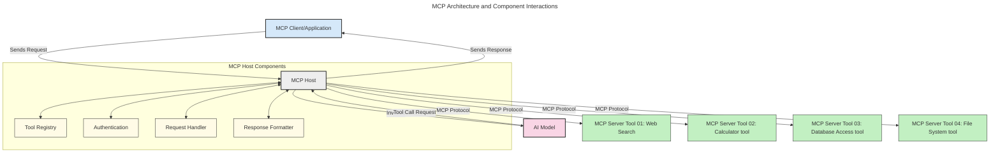
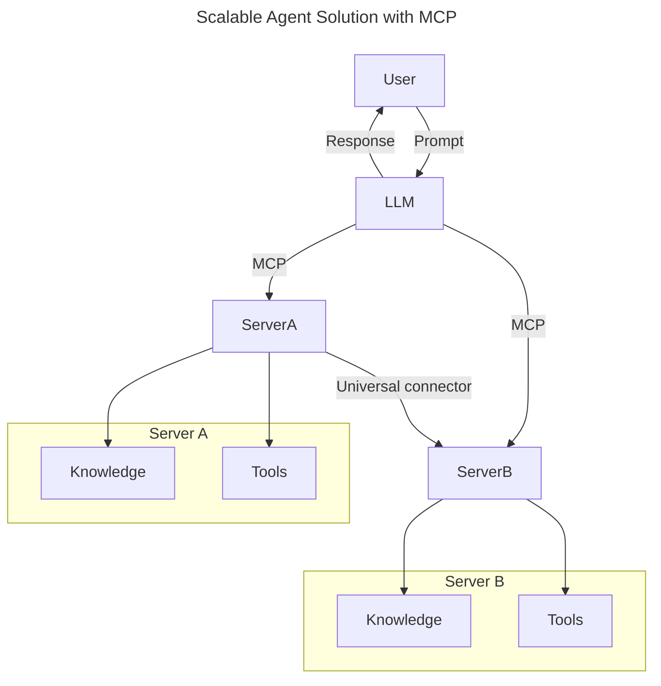
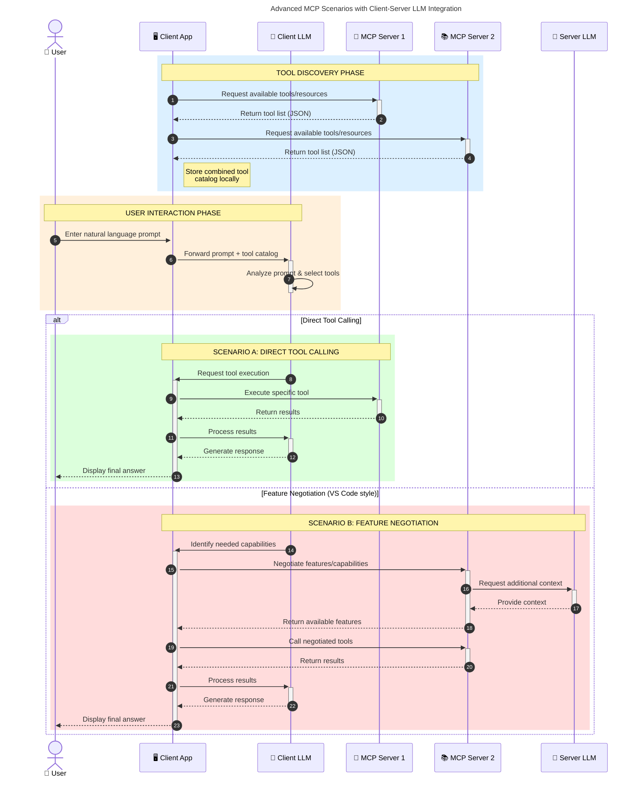

<!--
CO_OP_TRANSLATOR_METADATA:
{
  "original_hash": "9678e0c6945b8e0c23586869b0e26783",
  "translation_date": "2025-10-06T11:14:02+00:00",
  "source_file": "00-Introduction/README.md",
  "language_code": "my"
}
-->
# Model Context Protocol (MCP) ကိုမိတ်ဆက်ခြင်း - Scalable AI Applications အတွက် အရေးကြီးမှု

_(ဤသင်ခန်းစာ၏ ဗီဒီယိုကို ကြည့်ရန် အထက်ပါပုံကို နှိပ်ပါ)_

Generative AI အက်ပ်များသည် သဘာဝဘာသာစကားကို အသုံးပြု၍ အက်ပ်နှင့် အလွယ်တကူ ဆက်သွယ်နိုင်စေသော အရေးကြီးသော တိုးတက်မှုတစ်ခုဖြစ်သည်။ သို့သော်၊ ဤအက်ပ်များအတွက် အချိန်နှင့် အရင်းအမြစ်များ ပိုမိုရင်းနှီးမြှုပ်နှံသည့်အခါ၊ အက်ပ်ကို ပိုမိုတိုးချဲ့နိုင်စေရန်၊ မော်ဒယ်များစွာကို ထည့်သွင်းအသုံးပြုနိုင်စေရန်နှင့် မော်ဒယ်၏ အမျိုးမျိုးသော အကျိုးဆက်များကို ကိုင်တွယ်နိုင်စေရန် လွယ်ကူစွာ ပေါင်းစည်းနိုင်စေရန် သေချာစေလိုပါသည်။ အကျဉ်းချုပ်အားဖြင့် Gen AI အက်ပ်များကို စတင်ဖွဲ့စည်းရန် လွယ်ကူသော်လည်း၊ ၎င်းတို့သည် ကြီးထွားလာပြီး ရှုပ်ထွေးလာသည့်အခါ၊ architecture ကို သတ်မှတ်ရန် စတင်ရန်လိုအပ်ပြီး၊ အက်ပ်များကို တစ်စည်းတစ်လုံးဖြစ်စေရန် standard ကို အားထားရန်လိုအပ်နိုင်ပါသည်။ MCP သည် အရာများကို စနစ်တကျ စီမံခန့်ခွဲရန်နှင့် standard ကို ပေးစွမ်းရန် အရေးပါသည်။

---

## **🔍 Model Context Protocol (MCP) ဆိုတာဘာလဲ?**

**Model Context Protocol (MCP)** သည် **ပွင့်လင်းပြီး စံပြအင်တာဖေ့စ်** တစ်ခုဖြစ်ပြီး Large Language Models (LLMs) များကို အပြင်ဘက် tools, APIs, နှင့် data sources များနှင့် အဆင်ပြေစွာ ဆက်သွယ်နိုင်စေသည်။ ၎င်းသည် AI မော်ဒယ်များ၏ လုပ်ဆောင်နိုင်စွမ်းကို ၎င်းတို့၏ သင်ကြားမှုဒေတာအပြင်ပိုမိုတိုးတက်စေသော architecture တစ်ခုကို ပေးစွမ်းပြီး ပိုမိုထက်မြက်သော၊ scalable ဖြစ်သော၊ တုံ့ပြန်မှုမြန်သော AI စနစ်များကို ဖန်တီးနိုင်စေသည်။

---

## **🎯 AI အတွက် Standardization အရေးကြီးမှု**

Generative AI အက်ပ်များသည် ပိုမိုရှုပ်ထွေးလာသည့်အခါ၊ **scalability, extensibility, maintainability** နှင့် **vendor lock-in ကိုရှောင်ရှားခြင်း** ကို သေချာစေရန် standard များကို လက်ခံအသုံးပြုရန် အရေးကြီးသည်။ MCP သည် အောက်ပါလိုအပ်ချက်များကို ဖြေရှင်းပေးသည်-

- မော်ဒယ်နှင့် tool integration များကို တစ်စည်းတစ်လုံးဖြစ်စေခြင်း  
- brittle ဖြစ်သော၊ တစ်ခါသုံး custom solution များကို လျှော့ချခြင်း  
- vendor များကွဲပြားမှုရှိသည့် မော်ဒယ်များစွာကို ecosystem တစ်ခုအတွင်းတွင် ပေါင်းစည်းနိုင်စေခြင်း  

**Note:** MCP သည် ပွင့်လင်း standard အဖြစ်ကို ကြေညာသော်လည်း၊ IEEE, IETF, W3C, ISO သို့မဟုတ် အခြား standard body များဖြင့် MCP ကို standardize လုပ်ရန် အစီအစဉ်မရှိပါ။

---

## **📚 သင်ယူရမည့်အရာများ**

ဤဆောင်းပါးကို ဖတ်ပြီးဆုံးသည့်အခါ၊ သင်သည်-

- **Model Context Protocol (MCP)** နှင့် ၎င်း၏ အသုံးချမှုများကို သတ်မှတ်နိုင်မည်  
- MCP သည် မော်ဒယ်နှင့် tool ဆက်သွယ်မှုကို စံပြအဖြစ် ဖော်ပြပုံကို နားလည်နိုင်မည်  
- MCP architecture ၏ အဓိကအစိတ်အပိုင်းများကို ဖော်ထုတ်နိုင်မည်  
- MCP ၏ လုပ်ငန်းနှင့် ဖွံ့ဖြိုးတိုးတက်မှုဆိုင်ရာ အကွက်များတွင် အမှန်တကယ်အသုံးချမှုများကို ရှာဖွေနိုင်မည်  

---

## **💡 Model Context Protocol (MCP) သည် Game-Changer ဖြစ်ရခြင်း**

### **🔗 MCP သည် AI Interaction များတွင် Fragmentation ကို ဖြေရှင်းပေးသည်**

MCP မရှိမီ၊ မော်ဒယ်များနှင့် tools များကို ပေါင်းစည်းရန်-

- tool-model pair တစ်ခုစီအတွက် custom code ရေးရန်လိုအပ်သည်  
- vendor တစ်ခုစီအတွက် non-standard APIs များကို အသုံးပြုရသည်  
- update များကြောင့် မကြာခဏ ပြတ်တောက်မှုများဖြစ်ပေါ်သည်  
- tools များ ပိုမိုများလာသည်နှင့်အမျှ scalability မရှိပါ  

### **✅ MCP Standardization ၏ အကျိုးကျေးဇူးများ**

| **အကျိုးကျေးဇူး**          | **ဖော်ပြချက်**                                                                |
|--------------------------|--------------------------------------------------------------------------------|
| Interoperability         | LLMs များသည် vendor ကွဲပြားမှုရှိသည့် tools များနှင့် အဆင်ပြေစွာ လုပ်ဆောင်နိုင်သည် |
| Consistency              | platform နှင့် tools များအတွင်း uniform behavior ရရှိစေသည်                     |
| Reusability              | တစ်ခါတည်း ဖန်တီးထားသော tools များကို project နှင့် system များအတွင်း အသုံးပြုနိုင်သည် |
| Accelerated Development  | standardized, plug-and-play interface များကို အသုံးပြုခြင်းဖြင့် ဖွံ့ဖြိုးတိုးတက်မှုအချိန်ကို လျှော့ချနိုင်သည် |

---

## **🧱 MCP Architecture ၏ High-Level အကျဉ်းချုပ်**

MCP သည် **client-server model** ကို လိုက်နာပြီး၊

- **MCP Hosts** သည် AI မော်ဒယ်များကို run လုပ်သည်  
- **MCP Clients** သည် request များကို စတင်သည်  
- **MCP Servers** သည် context, tools, နှင့် capabilities များကို ပေးသည်  

### **အဓိကအစိတ်အပိုင်းများ**:

- **Resources** – မော်ဒယ်များအတွက် static သို့မဟုတ် dynamic data  
- **Prompts** – guided generation အတွက် predefined workflows  
- **Tools** – search, calculations ကဲ့သို့သော executable functions  
- **Sampling** – recursive interactions မှတစ်ဆင့် agentic behavior  

---

## MCP Servers ၏ လုပ်ဆောင်ပုံ

MCP servers သည် အောက်ပါအတိုင်း လုပ်ဆောင်သည်-

- **Request Flow**:
    1. အဆုံးသုံးသူ သို့မဟုတ် ၎င်းတို့အတွက် လုပ်ဆောင်နေသော software မှ request တစ်ခုကို စတင်သည်။
    2. **MCP Client** သည် request ကို **MCP Host** သို့ ပို့ပြီး AI Model runtime ကို စီမံခန့်ခွဲသည်။
    3. **AI Model** သည် user prompt ကို လက်ခံပြီး tool calls တစ်ခု သို့မဟုတ် အများကြီးမှတစ်ဆင့် အပြင် tools သို့မဟုတ် data ကို access လုပ်ရန် တောင်းဆိုနိုင်သည်။
    4. **MCP Host** သည် မော်ဒယ်ကို မဟုတ်ဘဲ၊ standardized protocol ကို အသုံးပြု၍ သင့်လျော်သော **MCP Server(s)** နှင့် ဆက်သွယ်သည်။
- **MCP Host Functionality**:
    - **Tool Registry**: ရရှိနိုင်သော tools နှင့် ၎င်းတို့၏ capabilities catalog ကို ထိန်းသိမ်းသည်။
    - **Authentication**: tool access အတွက် permissions ကို အတည်ပြုသည်။
    - **Request Handler**: မော်ဒယ်မှ tool requests များကို ကိုင်တွယ်သည်။
    - **Response Formatter**: tool outputs များကို မော်ဒယ်နားလည်နိုင်သော format ဖြင့် ဖွဲ့စည်းသည်။
- **MCP Server Execution**:
    - **MCP Host** သည် tool calls များကို **MCP Servers** တစ်ခု သို့မဟုတ် အများကြီးသို့ ပို့ပြီး၊ ၎င်းတို့၏ အထူးလုပ်ဆောင်ချက်များ (ဥပမာ- search, calculations, database queries) ကို ဖော်ပြသည်။
    - **MCP Servers** သည် ၎င်းတို့၏ လုပ်ဆောင်ချက်များကို ပြုလုပ်ပြီး **MCP Host** သို့ consistent format ဖြင့် ရလဒ်များကို ပြန်ပေးသည်။
    - **MCP Host** သည် ရလဒ်များကို format ပြုလုပ်ပြီး **AI Model** သို့ ပြန်ပေးသည်။
- **Response Completion**:
    - **AI Model** သည် tool outputs များကို အဆုံးသတ် response အဖြစ် ပေါင်းစည်းသည်။
    - **MCP Host** သည် response ကို **MCP Client** သို့ ပြန်ပေးပြီး အဆုံးသုံးသူ သို့မဟုတ် calling software သို့ ပို့သည်။

## 👨‍💻 MCP Server တစ်ခုကို ဖန်တီးပုံ (ဥပမာများနှင့်အတူ)

MCP servers သည် LLM ၏ လုပ်ဆောင်နိုင်စွမ်းကို data နှင့် functionality ပေးခြင်းဖြင့် တိုးချဲ့နိုင်သည်။

စမ်းသပ်ရန် အဆင်သင့်ဖြစ်ပါသလား? MCP servers ကို အမျိုးမျိုးသော programming language/stack များတွင် ဖန်တီးပုံကို ဖော်ပြထားသော SDK များနှင့် simple examples များကို အောက်တွင် ရှာဖွေပါ-

- **Python SDK**: https://github.com/modelcontextprotocol/python-sdk

- **TypeScript SDK**: https://github.com/modelcontextprotocol/typescript-sdk

- **Java SDK**: https://github.com/modelcontextprotocol/java-sdk

- **C#/.NET SDK**: https://github.com/modelcontextprotocol/csharp-sdk

---

## 🌍 MCP ၏ အမှန်တကယ်အသုံးချမှုများ

MCP သည် AI ၏ လုပ်ဆောင်နိုင်စွမ်းကို တိုးချဲ့ခြင်းဖြင့် အမျိုးမျိုးသော application များကို ပံ့ပိုးပေးသည်-

| **Application**              | **ဖော်ပြချက်**                                                                |
|------------------------------|--------------------------------------------------------------------------------|
| Enterprise Data Integration  | LLMs များကို databases, CRMs, သို့မဟုတ် internal tools များနှင့် ချိတ်ဆက်သည်     |
| Agentic AI Systems           | tool access နှင့် decision-making workflows ဖြင့် autonomous agents များကို ဖန်တီးသည် |
| Multi-modal Applications     | text, image, နှင့် audio tools များကို AI app တစ်ခုအတွင်း ပေါင်းစည်းသည်          |
| Real-time Data Integration   | AI interaction များတွင် live data ကို ထည့်သွင်းခြင်းဖြင့် ပိုမိုတိကျသော၊ လက်ရှိ output များကို ရရှိစေသည် |

---

### 🧠 MCP = AI Interaction များအတွက် Universal Standard

Model Context Protocol (MCP) သည် AI interaction များအတွက် universal standard အဖြစ် လုပ်ဆောင်ပြီး၊ USB-C သည် devices များအတွက် physical connection များကို standardize လုပ်သည့်ပုံစံနှင့် ဆင်တူသည်။ AI ကမ္ဘာတွင် MCP သည် consistent interface ကို ပေးပြီး၊ မော်ဒယ်များ (clients) သည် tools နှင့် data providers (servers) များနှင့် အဆင်ပြေစွာ ပေါင်းစည်းနိုင်စေသည်။ ၎င်းသည် API သို့မဟုတ် data source တစ်ခုစီအတွက် custom protocols များကို လိုအပ်မှုကို ဖယ်ရှားပေးသည်။

MCP အောက်တွင် MCP-compatible tool (MCP server ဟုခေါ်သည်) သည် unified standard ကို လိုက်နာသည်။ ဤ servers များသည် ၎င်းတို့၏ tools သို့မဟုတ် actions များကို ဖော်ပြပြီး၊ AI agent မှ တောင်းဆိုသောအခါ ၎င်းတို့၏ actions များကို လုပ်ဆောင်နိုင်သည်။ MCP ကို ပံ့ပိုးသော AI agent platforms များသည် servers များမှ ရရှိနိုင်သော tools များကို ရှာဖွေနိုင်ပြီး၊ standard protocol မှတစ်ဆင့် ၎င်းတို့ကို invoke လုပ်နိုင်သည်။

---

### 💡 Knowledge Access ကို ပံ့ပိုးပေးခြင်း

Tools ပေးခြင်းအပြင် MCP သည် knowledge access ကိုလည်း ပံ့ပိုးပေးသည်။ ၎င်းသည် applications များကို LLMs များနှင့် data sources များကို ချိတ်ဆက်ခြင်းဖြင့် context ပေးနိုင်စေသည်။ ဥပမာအားဖြင့် MCP server တစ်ခုသည် ကုမ္ပဏီ၏ document repository ကို ကိုယ်စားပြုနိုင်ပြီး၊ agents များကို လိုအပ်သောအချက်အလက်များကို တောင်းဆိုမှုအပေါ်မူတည်၍ ရယူနိုင်စေသည်။ အခြား server တစ်ခုသည် email ပို့ခြင်း သို့မဟုတ် records များကို update လုပ်ခြင်းကဲ့သို့သော အထူးလုပ်ဆောင်ချက်များကို ကိုင်တွယ်နိုင်သည်။ agent ၏ အမြင်အရ၊ ၎င်းတို့သည် အသုံးပြုနိုင်သော tools များသာဖြစ်သည်—tools တစ်ချို့သည် data (knowledge context) ကို ပြန်ပေးပြီး၊ အခြား tools များသည် actions များကို လုပ်ဆောင်သည်။ MCP သည် ၎င်းတို့နှစ်ခုလုံးကို ထိရောက်စွာ စီမံခန့်ခွဲပေးသည်။

Agent တစ်ခုသည် MCP server တစ်ခုနှင့် ချိတ်ဆက်သည့်အခါ၊ server ၏ ရရှိနိုင်သော capabilities နှင့် accessible data များကို standard format မှတစ်ဆင့် အလိုအလျောက် သင်ယူနိုင်သည်။ ဤ standardization သည် dynamic tool availability ကို ပံ့ပိုးပေးသည်။ ဥပမာအားဖြင့် agent system တစ်ခုတွင် MCP server အသစ်တစ်ခုကို ထည့်သွင်းခြင်းဖြင့် ၎င်း၏ functions များကို agent ၏ instructions ကို ထပ်မံ customize လုပ်ရန်မလိုဘဲ ချက်ချင်းအသုံးပြုနိုင်စေသည်။

ဤ streamlined integration သည် အောက်ပါ diagram တွင် ဖော်ပြထားသည့် flow နှင့် ကိုက်ညီပြီး၊ servers များသည် tools နှင့် knowledge ကို ပေးစွမ်းခြင်းဖြင့် systems များအတွင်း seamless collaboration ကို သေချာစေသည်။

---

### 👉 ဥပမာ: Scalable Agent Solution

Universal Connector သည် MCP servers များကို တစ်ဦးနှင့်တစ်ဦး ဆက်သွယ်နိုင်စေပြီး၊ ServerA သည် ServerB သို့ task များကို ပေးအပ်ခြင်း သို့မဟုတ် ၎င်း၏ tools နှင့် knowledge ကို access လုပ်နိုင်စေသည်။ ဤသည်သည် servers များအတွင်း tools နှင့် data ကို federate လုပ်ခြင်းဖြစ်ပြီး၊ scalable နှင့် modular agent architectures ကို ပံ့ပိုးပေးသည်။ MCP သည် tool exposure ကို standardize လုပ်သည့်အတွက်၊ agents များသည် servers များအတွင်း request များကို dynamic ဖြစ်စွာ ရှာဖွေနိုင်ပြီး route လုပ်နိုင်သည်။

Tool နှင့် knowledge federation: Servers များအတွင်း tools နှင့် data ကို access လုပ်နိုင်ခြင်းဖြင့် ပိုမို scalable နှင့် modular agentic architectures ကို ပံ့ပိုးပေးသည်။

---

### 🔄 Client-Side LLM Integration ဖြင့် Advanced MCP Scenarios

Basic MCP architecture အပြင်၊ client နှင့် server နှစ်ခုစလုံး LLMs များပါဝင်သော advanced scenarios များရှိပြီး၊ ပိုမိုရှုပ်ထွေးသော interaction များကို ပံ့ပိုးပေးနိုင်သည်။ အောက်ပါ diagram တွင် **Client App** သည် IDE တစ်ခုဖြစ်ပြီး၊ user အတွက် LLM မှ အသုံးပြုနိုင်သော MCP tools များပါဝင်နိုင်သည်-

---

## 🔐 MCP ၏ အကျိုးကျေးဇူးများ

MCP ကို အသုံးပြုခြင်း၏ အကျိုးကျေးဇူးများမှာ-

- **Freshness**: မော်ဒယ်များသည် ၎င်းတို့၏ သင်ကြားမှုဒေတာအပြင် လက်ရှိအချက်အလက်များကို access လုပ်နိုင်သည်  
- **Capability Extension**: မော်ဒယ်များသည် ၎င်းတို့မသင်ကြားထားသော task များအတွက် အထူး tools များကို အသုံးပြုနိုင်သည်  
- **Reduced Hallucinations**: အပြင် data sources များသည် အချက်အလက်အခြေခံမှုကို ပံ့ပိုးပေးသည်  
- **Privacy**: sensitive data များကို prompts အတွင်း embed လုပ်ခြင်းမရှိဘဲ secure environments အတွင်း ထိန်းသိမ်းနိုင်သည်  

---

## 📌 အဓိက Takeaways

MCP ကို အသုံးပြုခြင်း၏ အဓိက Takeaways များမှာ-

- **MCP** သည် AI မော်ဒ

---

**အကြောင်းကြားချက်**:  
ဤစာရွက်စာတမ်းကို AI ဘာသာပြန်ဝန်ဆောင်မှု [Co-op Translator](https://github.com/Azure/co-op-translator) ကို အသုံးပြု၍ ဘာသာပြန်ထားပါသည်။ ကျွန်ုပ်တို့သည် တိကျမှုအတွက် ကြိုးစားနေသော်လည်း၊ အလိုအလျောက် ဘာသာပြန်ခြင်းတွင် အမှားများ သို့မဟုတ် မတိကျမှုများ ပါဝင်နိုင်သည်ကို သတိပြုပါ။ မူလဘာသာစကားဖြင့် ရေးသားထားသော စာရွက်စာတမ်းကို အာဏာတရားရှိသော ရင်းမြစ်အဖြစ် သတ်မှတ်သင့်ပါသည်။ အရေးကြီးသော အချက်အလက်များအတွက် လူက ဘာသာပြန်ခြင်းကို အကြံပြုပါသည်။ ဤဘာသာပြန်ကို အသုံးပြုခြင်းမှ ဖြစ်ပေါ်လာသော အလွဲအလွတ်များ သို့မဟုတ် အနားယူမှုမှားများအတွက် ကျွန်ုပ်တို့သည် တာဝန်မယူပါ။