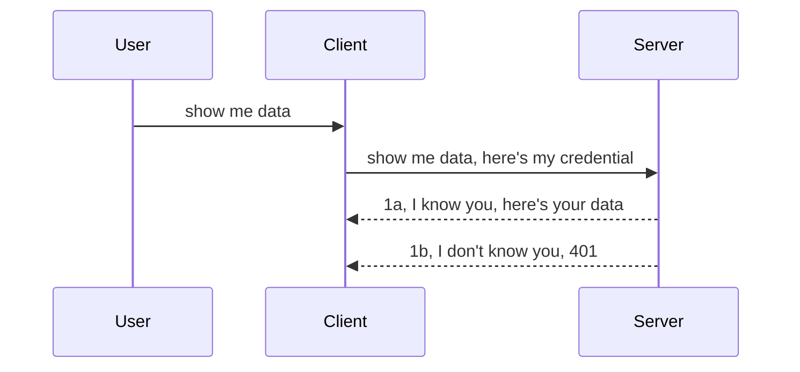

<!--
CO_OP_TRANSLATOR_METADATA:
{
  "original_hash": "5b00b8a8971a07d2d8803be4c9f138f8",
  "translation_date": "2025-10-07T01:08:10+00:00",
  "source_file": "03-GettingStarted/11-simple-auth/README.md",
  "language_code": "my"
}
-->
# ရိုးရှင်းသော အာ့သ် (Auth)

MCP SDKs တွင် OAuth 2.1 ကို အသုံးပြုနိုင်ပြီး၊ အာ့သ်ဆာဗာ၊ ရစ်ဆိုစ်ဆာဗာ၊ ခရက်ဒင်ရှယ်များ ပို့ခြင်း၊ ကုဒ်ရယူခြင်း၊ ကုဒ်ကို bearer token အဖြစ် ပြောင်းခြင်း၊ နောက်ဆုံးတွင် ရစ်ဆိုစ်ဒေတာရယူနိုင်ရန် စသည်တို့ကို ပါဝင်သော အဆင့်ဆင့်လုပ်ငန်းစဉ်များ ပါဝင်သည်။ OAuth ကို မကျွမ်းကျင်သေးသူများအတွက် အရမ်းကောင်းသော နည်းလမ်းတစ်ခုဖြစ်ပြီး၊ အရင်ဆုံး ရိုးရှင်းသော အာ့သ်နည်းလမ်းများကို စတင်ပြီး၊ လုံခြုံရေးကို တဖြည်းဖြည်း မြှင့်တင်သင့်သည်။ ဒီအခန်းရဲ့ ရည်ရွယ်ချက်ကတော့ အဆင့်မြင့်သော အာ့သ်ဆီသို့ တဖြည်းဖြည်း တိုးတက်စေဖို့ ဖြစ်ပါတယ်။

## အာ့သ်ဆိုတာ ဘာကို ဆိုလိုတာလဲ?

အာ့သ်ဆိုတာ authentication နဲ့ authorization ရဲ့ အတိုကောက်ဖြစ်ပါတယ်။ အဓိပ္ပါယ်ကတော့ အောက်ပါအရာနှစ်ခုကို လုပ်ဆောင်ဖို့လိုပါတယ်။

- **Authentication**: လူတစ်ဦးကို ကျွန်တော်တို့ရဲ့အိမ်ထဲဝင်ခွင့်ပေးမလား၊ သူတို့ရဲ့ MCP Server feature တွေရှိတဲ့ ရစ်ဆိုစ်ဆာဗာကို ဝင်ခွင့်ရှိလားဆိုတာကို စစ်ဆေးတဲ့လုပ်ငန်းစဉ်။
- **Authorization**: အသုံးပြုသူက သူတို့တောင်းဆိုတဲ့ ရစ်ဆိုစ်တွေကို ဝင်ခွင့်ရှိလား၊ ဥပမာ အော်ဒါတွေ၊ ပစ္စည်းတွေ၊ ဒါမှမဟုတ် ဖတ်ခွင့်ရှိပေမယ့် ဖျက်ခွင့်မရှိဘူးဆိုတဲ့ အခြေအနေတွေကို စစ်ဆေးတဲ့လုပ်ငန်းစဉ်။

## ခရက်ဒင်ရှယ်များ: စနစ်ကို ကျွန်တော်တို့ဘယ်လို အတည်ပြုမလဲ

အများစုသော ဝက်ဘ်ဒီဗလော့ပါများက ခရက်ဒင်ရှယ်တစ်ခုကို ဆာဗာကို ပေးပို့ဖို့ စဉ်းစားတတ်ကြပါတယ်၊ 通常တော့ username နဲ့ password ကို base64 encode လုပ်ထားတဲ့ version သို့မဟုတ် အသုံးပြုသူတစ်ဦးကို ထူးခြားစွာ ဖော်ပြတဲ့ API key တစ်ခုဖြစ်ပါတယ်။

ဒီအရာကို "Authorization" header မှတဆင့် ပေးပို့ရပါတယ်၊ ဥပမာ:

```json
{ "Authorization": "secret123" }
```

ဒီနည်းလမ်းကို "basic authentication" လို့ ခေါ်ပါတယ်။ အထွေထွေ လုပ်ငန်းစဉ်ကတော့ အောက်ပါအတိုင်း ဖြစ်ပါတယ်။



အခုတော့ လုပ်ငန်းစဉ်ကို နားလည်ပြီးနောက်၊ ဘယ်လို အကောင်အထည်ဖော်မလဲဆိုတာကို ကြည့်ရအောင်။ အများစုသော ဝက်ဘ်ဆာဗာတွေမှာ middleware ဆိုတဲ့ အကြောင်းအရာရှိပါတယ်၊ request ရဲ့ အစိတ်အပိုင်းအနေနဲ့ လည်ပတ်ပြီး ခရက်ဒင်ရှယ်ကို အတည်ပြုနိုင်တဲ့ ကုဒ်တစ်ခုပါဝင်ပါတယ်။ ခရက်ဒင်ရှယ်မှန်ကန်ရင် request ကို ဆက်လက်လုပ်ဆောင်ခွင့်ပေးပြီး၊ မမှန်ကန်ရင် auth error ကို ရရှိမှာဖြစ်ပါတယ်။ Python နဲ့ ဘယ်လိုလုပ်ဆောင်မလဲဆိုတာ ကြည့်ရအောင်:

**Python**

```python
class AuthMiddleware(BaseHTTPMiddleware):
    async def dispatch(self, request, call_next):

        has_header = request.headers.get("Authorization")
        if not has_header:
            print("-> Missing Authorization header!")
            return Response(status_code=401, content="Unauthorized")

        if not valid_token(has_header):
            print("-> Invalid token!")
            return Response(status_code=403, content="Forbidden")

        print("Valid token, proceeding...")
       
        response = await call_next(request)
        # add any customer headers or change in the response in some way
        return response


starlette_app.add_middleware(CustomHeaderMiddleware)
```

ဒီမှာ ကျွန်တော်တို့:

- `AuthMiddleware` ဆိုတဲ့ middleware တစ်ခု ဖန်တီးပြီး၊ `dispatch` method ကို web server က ခေါ်သုံးနေပါတယ်။
- middleware ကို web server မှာ ထည့်သွင်းထားပါတယ်။

    ```python
    starlette_app.add_middleware(AuthMiddleware)
    ```

- Authorization header ရှိမရှိ၊ ပေးပို့ထားတဲ့ secret မှန်ကန်မမှန်ကန် စစ်ဆေးတဲ့ logic ရေးသားထားပါတယ်။

    ```python
    has_header = request.headers.get("Authorization")
    if not has_header:
        print("-> Missing Authorization header!")
        return Response(status_code=401, content="Unauthorized")

    if not valid_token(has_header):
        print("-> Invalid token!")
        return Response(status_code=403, content="Forbidden")
    ```

    secret ရှိပြီး မှန်ကန်ရင် `call_next` ကို ခေါ်ပြီး response ကို ပြန်ပေးပါတယ်။

    ```python
    response = await call_next(request)
    # add any customer headers or change in the response in some way
    return response
    ```

request တစ်ခု server ကို ပေးပို့တဲ့အခါ middleware က လည်ပတ်ပြီး၊ request ကို ဆက်လက်လုပ်ဆောင်ခွင့်ပေးမလား၊ client ကို error ပြန်ပေးမလားဆိုတာ ဆုံးဖြတ်ပါတယ်။

**TypeScript**

Express framework နဲ့ middleware တစ်ခု ဖန်တီးပြီး MCP Server ကို ရောက်မယ့် request ကို intercept လုပ်ပါတယ်။ အောက်ပါကုဒ်ကို ကြည့်ပါ:

```typescript
function isValid(secret) {
    return secret === "secret123";
}

app.use((req, res, next) => {
    // 1. Authorization header present?  
    if(!req.headers["Authorization"]) {
        res.status(401).send('Unauthorized');
    }
    
    let token = req.headers["Authorization"];

    // 2. Check validity.
    if(!isValid(token)) {
        res.status(403).send('Forbidden');
    }

   
    console.log('Middleware executed');
    // 3. Passes request to the next step in the request pipeline.
    next();
});
```

ဒီကုဒ်မှာ ကျွန်တော်တို့:

1. Authorization header ရှိမရှိ စစ်ဆေးပြီး မရှိရင် 401 error ပေးပါတယ်။
2. credential/token မှန်ကန်မမှန်ကန် စစ်ဆေးပြီး မမှန်ကန်ရင် 403 error ပေးပါတယ်။
3. request pipeline မှာ request ကို ဆက်လက်လုပ်ဆောင်ခွင့်ပေးပြီး client ရဲ့ resource ကို ပြန်ပေးပါတယ်။

## လေ့ကျင့်ခန်း: authentication ကို အကောင်အထည်ဖော်ပါ

ကျွန်တော်တို့ရဲ့ အသိပညာကို အသုံးပြုပြီး authentication ကို အကောင်အထည်ဖော်ကြည့်ရအောင်။ အစီအစဉ်ကတော့:

Server

- web server နဲ့ MCP instance တစ်ခု ဖန်တီးပါ။
- server အတွက် middleware တစ်ခု အကောင်အထည်ဖော်ပါ။

Client 

- header မှတဆင့် credential ပါဝင်တဲ့ web request ပေးပို့ပါ။

### -1- web server နဲ့ MCP instance တစ်ခု ဖန်တီးပါ

ပထမအဆင့်မှာ web server instance နဲ့ MCP Server ကို ဖန်တီးဖို့လိုပါတယ်။

**Python**

ဒီမှာ MCP server instance တစ်ခု ဖန်တီးပြီး၊ starlette web app တစ်ခု ဖန်တီးပြီး uvicorn နဲ့ host လုပ်ပါတယ်။

```python
# creating MCP Server

app = FastMCP(
    name="MCP Resource Server",
    instructions="Resource Server that validates tokens via Authorization Server introspection",
    host=settings["host"],
    port=settings["port"],
    debug=True
)

# creating starlette web app
starlette_app = app.streamable_http_app()

# serving app via uvicorn
async def run(starlette_app):
    import uvicorn
    config = uvicorn.Config(
            starlette_app,
            host=app.settings.host,
            port=app.settings.port,
            log_level=app.settings.log_level.lower(),
        )
    server = uvicorn.Server(config)
    await server.serve()

run(starlette_app)
```

ဒီကုဒ်မှာ ကျွန်တော်တို့:

- MCP Server ကို ဖန်တီးပါတယ်။
- MCP Server မှ `app.streamable_http_app()` ကို အသုံးပြုပြီး starlette web app ကို ဖန်တီးပါတယ်။
- uvicorn ကို အသုံးပြုပြီး web app ကို host လုပ်ပါတယ် `server.serve()`။

**TypeScript**

ဒီမှာ MCP Server instance တစ်ခု ဖန်တီးပါတယ်။

```typescript
const server = new McpServer({
      name: "example-server",
      version: "1.0.0"
    });

    // ... set up server resources, tools, and prompts ...
```

ဒီ MCP Server ဖန်တီးမှုကို POST /mcp route definition အတွင်းမှာ လုပ်ဆောင်ဖို့လိုပါတယ်၊ အောက်ပါအတိုင်း ပြောင်းလဲထားပါတယ်:

```typescript
import express from "express";
import { randomUUID } from "node:crypto";
import { McpServer } from "@modelcontextprotocol/sdk/server/mcp.js";
import { StreamableHTTPServerTransport } from "@modelcontextprotocol/sdk/server/streamableHttp.js";
import { isInitializeRequest } from "@modelcontextprotocol/sdk/types.js"

const app = express();
app.use(express.json());

// Map to store transports by session ID
const transports: { [sessionId: string]: StreamableHTTPServerTransport } = {};

// Handle POST requests for client-to-server communication
app.post('/mcp', async (req, res) => {
  // Check for existing session ID
  const sessionId = req.headers['mcp-session-id'] as string | undefined;
  let transport: StreamableHTTPServerTransport;

  if (sessionId && transports[sessionId]) {
    // Reuse existing transport
    transport = transports[sessionId];
  } else if (!sessionId && isInitializeRequest(req.body)) {
    // New initialization request
    transport = new StreamableHTTPServerTransport({
      sessionIdGenerator: () => randomUUID(),
      onsessioninitialized: (sessionId) => {
        // Store the transport by session ID
        transports[sessionId] = transport;
      },
      // DNS rebinding protection is disabled by default for backwards compatibility. If you are running this server
      // locally, make sure to set:
      // enableDnsRebindingProtection: true,
      // allowedHosts: ['127.0.0.1'],
    });

    // Clean up transport when closed
    transport.onclose = () => {
      if (transport.sessionId) {
        delete transports[transport.sessionId];
      }
    };
    const server = new McpServer({
      name: "example-server",
      version: "1.0.0"
    });

    // ... set up server resources, tools, and prompts ...

    // Connect to the MCP server
    await server.connect(transport);
  } else {
    // Invalid request
    res.status(400).json({
      jsonrpc: '2.0',
      error: {
        code: -32000,
        message: 'Bad Request: No valid session ID provided',
      },
      id: null,
    });
    return;
  }

  // Handle the request
  await transport.handleRequest(req, res, req.body);
});

// Reusable handler for GET and DELETE requests
const handleSessionRequest = async (req: express.Request, res: express.Response) => {
  const sessionId = req.headers['mcp-session-id'] as string | undefined;
  if (!sessionId || !transports[sessionId]) {
    res.status(400).send('Invalid or missing session ID');
    return;
  }
  
  const transport = transports[sessionId];
  await transport.handleRequest(req, res);
};

// Handle GET requests for server-to-client notifications via SSE
app.get('/mcp', handleSessionRequest);

// Handle DELETE requests for session termination
app.delete('/mcp', handleSessionRequest);

app.listen(3000);
```

အခု MCP Server ဖန်တီးမှုကို `app.post("/mcp")` အတွင်းမှာ ပြောင်းထားတာကို တွေ့ရပါတယ်။

အခုတော့ middleware ဖန်တီးပြီး credential ကို validate လုပ်ဖို့ အဆင့်ဆက်သွားရအောင်။

### -2- server အတွက် middleware တစ်ခု အကောင်အထည်ဖော်ပါ

အခု middleware အပိုင်းကို ဆက်လုပ်ရအောင်။ ဒီမှာ `Authorization` header မှာ credential ရှိမရှိ စစ်ဆေးပြီး၊ ရှိရင် request ကို ဆက်လက်လုပ်ဆောင်ခွင့်ပေးပါမယ်။ client က MCP functionality တောင်းဆိုထားတဲ့အတိုင်း (ဥပမာ tools တွေကို ဖော်ပြခြင်း၊ resource ဖတ်ခြင်း) လုပ်ဆောင်နိုင်ပါမယ်။

**Python**

middleware ဖန်တီးဖို့ `BaseHTTPMiddleware` ကို အခြေခံတဲ့ class တစ်ခု ဖန်တီးဖို့လိုပါတယ်။ အဓိကအချက်နှစ်ခုကတော့:

- request `request` , header အချက်အလက်ကို ဖတ်ရန်။
- `call_next` client က ပေးပို့ထားတဲ့ credential ကို ကျွန်တော်တို့ လက်ခံရင် ခေါ်သုံးရန် callback။

ပထမဆုံး `Authorization` header မရှိတဲ့အခြေအနေကို handle လုပ်ရပါမယ်:

```python
has_header = request.headers.get("Authorization")

# no header present, fail with 401, otherwise move on.
if not has_header:
    print("-> Missing Authorization header!")
    return Response(status_code=401, content="Unauthorized")
```

ဒီမှာ client authentication မအောင်မြင်တဲ့အတွက် 401 unauthorized message ကို ပေးပို့ပါတယ်။

နောက်ဆုံး credential တစ်ခု ပေးပို့ထားရင်၊ valid ဖြစ်မဖြစ် စစ်ဆေးရပါမယ်:

```python
 if not valid_token(has_header):
    print("-> Invalid token!")
    return Response(status_code=403, content="Forbidden")
```

ဒီမှာ 403 forbidden message ကို ပေးပို့ထားတာကို တွေ့ရပါတယ်။ အောက်မှာ အားလုံးကို အကောင်အထည်ဖော်ထားတဲ့ middleware ကို ကြည့်ပါ:

```python
class AuthMiddleware(BaseHTTPMiddleware):
    async def dispatch(self, request, call_next):

        has_header = request.headers.get("Authorization")
        if not has_header:
            print("-> Missing Authorization header!")
            return Response(status_code=401, content="Unauthorized")

        if not valid_token(has_header):
            print("-> Invalid token!")
            return Response(status_code=403, content="Forbidden")

        print("Valid token, proceeding...")
        print(f"-> Received {request.method} {request.url}")
        response = await call_next(request)
        response.headers['Custom'] = 'Example'
        return response

```

ကောင်းပြီ၊ ဒါပေမယ့် `valid_token` function က ဘာလဲ? အောက်မှာ ကြည့်ပါ:

```python
# DON'T use for production - improve it !!
def valid_token(token: str) -> bool:
    # remove the "Bearer " prefix
    if token.startswith("Bearer "):
        token = token[7:]
        return token == "secret-token"
    return False
```

ဒီ function ကို အဆင့်မြှင့်တင်သင့်ပါတယ်။

အရေးကြီး: secret တွေကို code ထဲမှာ ထည့်သွင်းထားသင့်တာ မဟုတ်ပါဘူး။ secret ကို data source မှာ သို့မဟုတ် IDP (identity service provider) မှာ ရယူသင့်ပါတယ်။ အကောင်းဆုံးကတော့ IDP ကို validation လုပ်ခွင့်ပေးသင့်ပါတယ်။

**TypeScript**

Express framework နဲ့ middleware ကို ဖန်တီးဖို့ `use` method ကို ခေါ်သုံးရပါမယ်။

ကျွန်တော်တို့:

- request variable ကို အသုံးပြုပြီး `Authorization` property မှာ credential ရှိမရှိ စစ်ဆေးပါမယ်။
- credential ကို validate လုပ်ပြီး၊ valid ဖြစ်ရင် request ကို ဆက်လက်လုပ်ဆောင်ခွင့်ပေးပါမယ်။

ဒီမှာ `Authorization` header ရှိမရှိ စစ်ဆေးပြီး မရှိရင် request ကို ရပ်တန့်ပါတယ်:

```typescript
if(!req.headers["authorization"]) {
    res.status(401).send('Unauthorized');
    return;
}
```

header မပေးပို့ရင် 401 error ကို ရရှိပါမယ်။

နောက်ဆုံး credential valid ဖြစ်မဖြစ် စစ်ဆေးပြီး valid မဖြစ်ရင် request ကို ရပ်တန့်ပါတယ်:

```typescript
if(!isValid(token)) {
    res.status(403).send('Forbidden');
    return;
} 
```

ဒီမှာ 403 error ကို ရရှိပါမယ်။

အောက်မှာ အပြည့်အစုံကုဒ်ကို ကြည့်ပါ:

```typescript
app.use((req, res, next) => {
    console.log('Request received:', req.method, req.url, req.headers);
    console.log('Headers:', req.headers["authorization"]);
    if(!req.headers["authorization"]) {
        res.status(401).send('Unauthorized');
        return;
    }
    
    let token = req.headers["authorization"];

    if(!isValid(token)) {
        res.status(403).send('Forbidden');
        return;
    }  

    console.log('Middleware executed');
    next();
});
```

web server ကို client ပေးပို့တဲ့ credential ကို စစ်ဆေးနိုင်တဲ့ middleware ကို ထည့်သွင်းထားပါတယ်။ client ကို ဘာလုပ်ရမလဲ?

### -3- header မှတဆင့် credential ပါဝင်တဲ့ web request ပေးပို့ပါ

client က header မှတဆင့် credential ကို ပေးပို့နေကြောင်း သေချာစေရမယ်။ MCP client ကို အသုံးပြုမယ်ဆိုရင်၊ ဘယ်လိုလုပ်ရမလဲဆိုတာကို ရှာဖွေရမယ်။

**Python**

client အတွက် header မှာ credential ကို ပေးပို့ဖို့လိုပါတယ်၊ ဥပမာ:

```python
# DON'T hardcode the value, have it at minimum in an environment variable or a more secure storage
token = "secret-token"

async with streamablehttp_client(
        url = f"http://localhost:{port}/mcp",
        headers = {"Authorization": f"Bearer {token}"}
    ) as (
        read_stream,
        write_stream,
        session_callback,
    ):
        async with ClientSession(
            read_stream,
            write_stream
        ) as session:
            await session.initialize()
      
            # TODO, what you want done in the client, e.g list tools, call tools etc.
```

ဒီမှာ `headers` property ကို ` headers = {"Authorization": f"Bearer {token}"}` အတိုင်း populate လုပ်ထားတာကို တွေ့ရပါတယ်။

**TypeScript**

ဒီအရာကို နှစ်ဆင့်ဖြင့် ဖြေရှင်းနိုင်ပါတယ်:

1. configuration object တစ်ခုကို credential ဖြင့် populate လုပ်ပါ။
2. configuration object ကို transport ကို ပေးပို့ပါ။

```typescript

// DON'T hardcode the value like shown here. At minimum have it as a env variable and use something like dotenv (in dev mode).
let token = "secret123"

// define a client transport option object
let options: StreamableHTTPClientTransportOptions = {
  sessionId: sessionId,
  requestInit: {
    headers: {
      "Authorization": "secret123"
    }
  }
};

// pass the options object to the transport
async function main() {
   const transport = new StreamableHTTPClientTransport(
      new URL(serverUrl),
      options
   );
```

ဒီမှာ `options` object တစ်ခု ဖန်တီးပြီး headers ကို `requestInit` property အောက်မှာ ထည့်သွင်းထားတာကို တွေ့ရပါတယ်။

အရေးကြီး: ဒီနေရာကနေ ဘယ်လို အဆင့်မြှင့်တင်နိုင်မလဲ? လက်ရှိ implementation မှာ အချို့ပြဿနာတွေ ရှိပါတယ်။ credential ကို ဒီလိုပေးပို့တာက အနည်းဆုံး HTTPS ရှိမှသာ လုံခြုံပါတယ်။ credential ကို ခိုးယူနိုင်တဲ့အတွက် token ကို revoke လုပ်နိုင်တဲ့စနစ်၊ request ရဲ့ location၊ bot-like behavior စသည်တို့ကို စစ်ဆေးနိုင်တဲ့ စနစ်တွေလိုအပ်ပါတယ်။

ရိုးရှင်းတဲ့ API တွေမှာ authentication မရှိဘဲ API ကို ခေါ်ဆိုမရအောင် လုပ်ချင်တဲ့အခါ ဒီနည်းလမ်းက အစကောင်းတစ်ခုဖြစ်ပါတယ်။

ဒီအရာကို JSON Web Token (JWT) ဆိုတဲ့ standardized format ကို အသုံးပြုပြီး လုံခြုံရေးကို တိုးတက်စေကြရအောင်။

## JSON Web Tokens, JWT

ရိုးရှင်းတဲ့ credential ပေးပို့မှုကို တိုးတက်စေဖို့ ကြိုးစားနေပါတယ်။ JWT ကို အသုံးပြုခြင်းက ဘာတွေကောင်းကျိုးရရှိစေမလဲ?

- **လုံခြုံရေးတိုးတက်မှု**: basic auth မှာ username နဲ့ password ကို base64 encode လုပ်ထားတဲ့ token (သို့မဟုတ် API key) ကို အကြိမ်ကြိမ် ပေးပို့ရပါတယ်။ JWT မှာ username နဲ့ password ကို ပေးပြီး token ရယူရပါတယ်၊ token က အချိန်ကန့်သတ်ထားပြီး expire ဖြစ်ပါတယ်။ JWT က role, scope, permission စသည်တို့ကို အသုံးပြုပြီး fine-grained access control ကို လွယ်ကူစွာ အသုံးပြုနိုင်စေပါတယ်။
- **Statelessness နဲ့ scalability**: JWT တွေက self-contained ဖြစ်ပြီး၊ user info အားလုံးကို ပါဝင်စေပါတယ်။ server-side session storage ကို လိုအပ်မှုမရှိတော့ပါဘူး။ token ကို locally validate လုပ်နိုင်ပါတယ်။
- **Interoperability နဲ့ federation**: JWT တွေက Open ID Connect ရဲ့ အဓိကဖြစ်ပြီး၊ Entra ID, Google Identity, Auth0 စသည်တို့နဲ့ အသုံးပြုနိုင်ပါတယ်။ single sign-on စနစ်နဲ့ အခြား enterprise-grade features တွေကိုလည်း အသုံးပြုနိုင်ပါတယ်။
- **Modularity နဲ့ flexibility**: JWT တွေကို Azure API Management, NGINX စသည်တို့လို API Gateways တွေနဲ့ အသုံးပြုနိုင်ပါတယ်။ authentication scenarios နဲ့ server-to-service communication တွေကိုလည်း support လုပ်ပါတယ်။
- **Performance နဲ့ caching**: JWT တွေကို decode လုပ်ပြီး caching လုပ်နိုင်ပါတယ်၊ parsing လုပ်စရာမလိုတော့ပါဘူး။ high-traffic apps တွေမှာ throughput တိုးတက်ပြီး infrastructure ပေါ်မှာ load လျော့နည်းစေပါတယ်။
- **Advanced features**: introspection (server မှာ validity စစ်ဆေးခြင်း) နဲ့ revocation (token ကို invalid လုပ်ခြင်း) ကို support လုပ်ပါတယ်။

ဒီအကျိုးကျေးဇူးတွေကို ရရှိစေဖို့ ကျွန်တော်တို့ implementation ကို အဆင့်မြှင့်တင်ကြရအောင်။

## Basic auth ကို JWT အဖြစ် ပြောင်းလဲခြင်း

mile-high level မှာ ကျွန်တော်တို့ လုပ်ဆောင်ရမယ့်အရာတွေကတော့:

- **JWT token တစ်ခု ဖန်တီးခြင်း**: client မှ server ကို ပေးပို့ဖို့ ပြင်ဆင်ပါ။
- **JWT token ကို validate လုပ်ခြင်း**: valid ဖြစ်ရင် client ကို resource ပေးပါ။
- **Token storage ကို လုံခြုံစွာ သိမ်းဆည်းခြင်း**: token ကို ဘယ်လို သိမ်းဆည်းမလဲ။
- **Routes ကို ကာကွယ်ခြင်း**: routes နဲ့ MCP features တွေကို ကာကွယ်ပါ။
- **Refresh tokens ထည့်သွင်းခြင်း**: short-lived tokens နဲ့ long-lived refresh tokens ကို ဖန်တီးပါ။ refresh endpoint နဲ့ rotation strategy ကို ထည့်သွင်းပါ။

### -1- JWT token တစ်ခု ဖန်တီးပါ

ပထမဆုံး JWT token ရဲ့ အစိတ်အပိုင်းတွေကတော့:

- **header**: algorithm နဲ့ token type.
- **payload**: claims, ဥပမာ sub (token ကို ကိုယ်စားပြုတဲ့ user သို့မဟုတ် entity), exp (expire ဖြစ်မယ့်အချိန်), role (user role).
- **signature**: secret သို့မဟုတ် private key နဲ့ sign လုပ်ထားခြင်း။

ဒီအတွက် header, payload, encoded token ကို ဖန်တီးရပါမယ်။

**Python**

```python

import jwt
import jwt
from jwt.exceptions import ExpiredSignatureError, InvalidTokenError
import datetime

# Secret key used to sign the JWT
secret_key = 'your-secret-key'

header = {
    "alg": "HS256",
    "typ": "JWT"
}

# the user info andits claims and expiry time
payload = {
    "sub": "1234567890",               # Subject (user ID)
    "name": "User Userson",                # Custom claim
    "admin": True,                     # Custom claim
    "iat": datetime.datetime.utcnow(),# Issued at
    "exp": datetime.datetime.utcnow() + datetime.timedelta(hours=1)  # Expiry
}

# encode it
encoded_jwt = jwt.encode(payload, secret_key, algorithm="HS256", headers=header)
```

ဒီကုဒ်မှာ ကျွန်တော်တို့:

- HS256 algorithm နဲ့ type ကို JWT အဖြစ် header ကို သတ်မှတ်ထားပါတယ်။
- subject သို့မဟုတ် user id, username, role, issue time, expire time စသည်တို့ပါဝင်တဲ့ payload ကို ဖန်တီးထားပါတယ်။

**TypeScript**

ဒီမှာ JWT token ကို ဖန်တီးဖို့လိုအပ်တဲ့ dependencies တွေကို ထည့်သွင်းရပါမယ်။

Dependencies

```sh

npm install jsonwebtoken
npm install --save-dev @types/jsonwebtoken
```

အခုတော့ header, payload ကို ဖန်တီးပြီး encoded token ကို ဖန်တီးရအောင်။

```typescript
import jwt from 'jsonwebtoken';

const secretKey = 'your-secret-key'; // Use env vars in production

// Define the payload
const payload = {
  sub: '1234567890',
  name: 'User usersson',
  admin: true,
  iat: Math.floor(Date.now() / 1000), // Issued at
  exp: Math.floor(Date.now() / 1000) + 60 * 60 // Expires in 1 hour
};

// Define the header (optional, jsonwebtoken sets defaults)
const header = {
  alg: 'HS256',
  typ: 'JWT'
};

// Create the token
const token = jwt.sign(payload, secretKey, {
  algorithm: 'HS256',
  header: header
});

console.log('JWT:', token);
```

ဒီ token က:

HS256 နဲ့ sign လုပ်ထားပါတယ်။
1 နာရီအတွင်း valid ဖြစ်ပါတယ်။
sub, name, admin, iat, exp စသည်တို့လို claims တွေ ပါဝင်ပါတယ်။

### -2- Token ကို validate လုပ်ပါ

Token ကို validate လုပ်ဖို့ client က ပေးပို့တဲ့ token က valid ဖြစ်ကြောင်း သေချာစေရမယ်။ ဒီမှာ token ရဲ့ structure နဲ့ validity ကို စစ်ဆေးရပါမယ်။ user system ထဲမှာရှိမရှိ စစ်ဆေးခြင်း၊ user ရဲ့ rights စသည်တို့ကိုလည်း စစ်ဆေးသင့်ပါတယ်။

Token ကို validate လုပ်ဖို့ decode လုပ်ပြီး စစ်ဆေးရပါမယ်:

**Python**

```python

# Decode and verify the JWT
try:
    decoded = jwt.decode(token, secret_key, algorithms=["HS256"])
    print("✅ Token is valid.")
    print("Decoded claims:")
    for key, value in decoded.items():
        print(f"  {key}: {value}")
except ExpiredSignatureError:
    print("❌ Token has expired.")
except InvalidTokenError as e:
    print(f"❌ Invalid token: {e}")

```

ဒီကုဒ်မှာ token, secret key, algorithm ကို input အဖြစ် အသုံးပြုပြီး `jwt.decode` ကို ခေါ်သုံးပါတယ်။ try-catch construct ကို အသုံးပြုထားပြီး validation မအောင်မြင်ရင် error ကို ပြန်ပေးပါတယ်။

**TypeScript**

ဒီမှာ `jwt.verify` ကို ခေါ်ပြီး token ကို decode လုပ်ရပါမယ်။ ဒီ call မအောင်မြင်ရင်
နောက်တစ်ခုမှာ Role Based Access Control (RBAC) ဆိုတာကို လေ့လာကြမယ်။

## Role Based Access Control ထည့်သွင်းခြင်း

RBAC ရဲ့ အဓိကအကြောင်းအရာကတော့ အခန်းကဏ္ဍ (roles) တစ်ခုချင်းစီမှာ ခွင့်ပြုချက် (permissions) မတူညီတာကို ဖော်ပြချင်တာပါ။ ဥပမာအားဖြင့် admin က အားလုံးကိုလုပ်နိုင်ပြီး၊ သာမန် user ကတော့ read/write လုပ်နိုင်ပြီး၊ guest ကတော့ read လုပ်နိုင်တယ်လို့ ယူဆပါစို့။ ဒါကြောင့် အောက်ပါ permission levels တွေကို သတ်မှတ်နိုင်ပါတယ်-

- Admin.Write 
- User.Read
- Guest.Read

ဒီလို control ကို middleware နဲ့ ဘယ်လိုအကောင်အထည်ဖော်နိုင်မလဲဆိုတာကို ကြည့်ကြမယ်။ Middleware တွေကို route တစ်ခုချင်းစီအတွက် သို့မဟုတ် route အားလုံးအတွက် ထည့်သွင်းနိုင်ပါတယ်။

**Python**

```python
from starlette.middleware.base import BaseHTTPMiddleware
from starlette.responses import JSONResponse
import jwt

# DON'T have the secret in the code like, this is for demonstration purposes only. Read it from a safe place.
SECRET_KEY = "your-secret-key" # put this in env variable
REQUIRED_PERMISSION = "User.Read"

class JWTPermissionMiddleware(BaseHTTPMiddleware):
    async def dispatch(self, request, call_next):
        auth_header = request.headers.get("Authorization")
        if not auth_header or not auth_header.startswith("Bearer "):
            return JSONResponse({"error": "Missing or invalid Authorization header"}, status_code=401)

        token = auth_header.split(" ")[1]
        try:
            decoded = jwt.decode(token, SECRET_KEY, algorithms=["HS256"])
        except jwt.ExpiredSignatureError:
            return JSONResponse({"error": "Token expired"}, status_code=401)
        except jwt.InvalidTokenError:
            return JSONResponse({"error": "Invalid token"}, status_code=401)

        permissions = decoded.get("permissions", [])
        if REQUIRED_PERMISSION not in permissions:
            return JSONResponse({"error": "Permission denied"}, status_code=403)

        request.state.user = decoded
        return await call_next(request)


```

Middleware ထည့်သွင်းဖို့ အနည်းငယ်ကွဲပြားတဲ့နည်းလမ်းတွေရှိပါတယ်၊ အောက်ပါအတိုင်း-

```python

# Alt 1: add middleware while constructing starlette app
middleware = [
    Middleware(JWTPermissionMiddleware)
]

app = Starlette(routes=routes, middleware=middleware)

# Alt 2: add middleware after starlette app is a already constructed
starlette_app.add_middleware(JWTPermissionMiddleware)

# Alt 3: add middleware per route
routes = [
    Route(
        "/mcp",
        endpoint=..., # handler
        middleware=[Middleware(JWTPermissionMiddleware)]
    )
]
```

**TypeScript**

`app.use` ကိုအသုံးပြုပြီး request အားလုံးအတွက် run လုပ်မယ့် middleware ကို အသုံးပြုနိုင်ပါတယ်။

```typescript
app.use((req, res, next) => {
    console.log('Request received:', req.method, req.url, req.headers);
    console.log('Headers:', req.headers["authorization"]);

    // 1. Check if authorization header has been sent

    if(!req.headers["authorization"]) {
        res.status(401).send('Unauthorized');
        return;
    }
    
    let token = req.headers["authorization"];

    // 2. Check if token is valid
    if(!isValid(token)) {
        res.status(403).send('Forbidden');
        return;
    }  

    // 3. Check if token user exist in our system
    if(!isExistingUser(token)) {
        res.status(403).send('Forbidden');
        console.log("User does not exist");
        return;
    }
    console.log("User exists");

    // 4. Verify the token has the right permissions
    if(!hasScopes(token, ["User.Read"])){
        res.status(403).send('Forbidden - insufficient scopes');
    }

    console.log("User has required scopes");

    console.log('Middleware executed');
    next();
});

```

Middleware က လုပ်ဆောင်နိုင်တဲ့အရာတွေ အများကြီးရှိပြီး၊ လုပ်ဆောင်သင့်တဲ့အရာတွေက-

1. Authorization header ရှိ/မရှိ စစ်ဆေးပါ။
2. Token မှန်ကန်မှုကို စစ်ဆေးပါ။ `isValid` ဆိုတဲ့ JWT token ရဲ့ integrity နဲ့ validity ကို စစ်ဆေးတဲ့ method ကို အသုံးပြုပါ။
3. User က စနစ်ထဲမှာ ရှိ/မရှိ စစ်ဆေးပါ။

   ```typescript
    // users in DB
   const users = [
     "user1",
     "User usersson",
   ]

   function isExistingUser(token) {
     let decodedToken = verifyToken(token);

     // TODO, check if user exists in DB
     return users.includes(decodedToken?.name || "");
   }
   ```

   အထက်မှာတော့ ရိုးရှင်းတဲ့ `users` list ကို ဖန်တီးထားပါတယ်၊ ဒါဟာ database ထဲမှာ ရှိသင့်ပါတယ်။

4. ထို့အပြင် token ရဲ့ permission မှန်/မမှန်ကိုလည်း စစ်ဆေးသင့်ပါတယ်။

   ```typescript
   if(!hasScopes(token, ["User.Read"])){
        res.status(403).send('Forbidden - insufficient scopes');
   }
   ```

   Middleware ရဲ့ အထက်ပါ code မှာ token ရဲ့ User.Read permission ရှိ/မရှိကို စစ်ဆေးထားပြီး၊ မရှိရင် 403 error ကို ပေးပို့ပါတယ်။ အောက်မှာ `hasScopes` helper method ရှိပါတယ်။

   ```typescript
   function hasScopes(scope: string, requiredScopes: string[]) {
     let decodedToken = verifyToken(scope);
    return requiredScopes.every(scope => decodedToken?.scopes.includes(scope));
  }
   ```

Have a think which additional checks you should be doing, but these are the absolute minimum of checks you should be doing.

Using Express as a web framework is a common choice. There are helpers library when you use JWT so you can write less code.

- `express-jwt`, helper library that provides a middleware that helps decode your token.
- `express-jwt-permissions`, this provides a middleware `guard` that helps check if a certain permission is on the token.

Here's what these libraries can look like when used:

```typescript
const express = require('express');
const jwt = require('express-jwt');
const guard = require('express-jwt-permissions')();

const app = express();
const secretKey = 'your-secret-key'; // put this in env variable

// Decode JWT and attach to req.user
app.use(jwt({ secret: secretKey, algorithms: ['HS256'] }));

// Check for User.Read permission
app.use(guard.check('User.Read'));

// multiple permissions
// app.use(guard.check(['User.Read', 'Admin.Access']));

app.get('/protected', (req, res) => {
  res.json({ message: `Welcome ${req.user.name}` });
});

// Error handler
app.use((err, req, res, next) => {
  if (err.code === 'permission_denied') {
    return res.status(403).send('Forbidden');
  }
  next(err);
});

```

Middleware ကို authentication နဲ့ authorization အတွက် ဘယ်လိုအသုံးပြုနိုင်တယ်ဆိုတာကို ကြည့်ပြီးပြီ၊ MCP အတွက်တော့ auth လုပ်ပုံကို ပြောင်းလဲသွားမလား? နောက်ပိုင်းမှာ ဆက်လေ့လာကြမယ်။

### -3- MCP အတွက် RBAC ထည့်သွင်းခြင်း

Middleware နဲ့ RBAC ထည့်သွင်းပုံကို ကြည့်ပြီးပြီ၊ MCP အတွက် feature တစ်ခုချင်းစီမှာ RBAC ထည့်သွင်းဖို့ လွယ်ကူတဲ့နည်းလမ်းမရှိပါဘူး။ ဒါကြောင့် ဘာလုပ်ရမလဲ? ဒီလို code ကို ထည့်သွင်းရပါမယ်၊ ဥပမာအားဖြင့် client က tool တစ်ခုကို အသုံးပြုခွင့်ရှိ/မရှိ စစ်ဆေးရမယ်-

Feature တစ်ခုချင်းစီအတွက် RBAC ကို အကောင်အထည်ဖော်ဖို့ နည်းလမ်းအချို့ရှိပါတယ်၊ အောက်ပါအတိုင်း-

- Tool, resource, prompt တစ်ခုချင်းစီမှာ permission level ကို စစ်ဆေးဖို့ check ထည့်သွင်းပါ။

   **Python**

   ```python
   @tool()
   def delete_product(id: int):
      try:
          check_permissions(role="Admin.Write", request)
      catch:
        pass # client failed authorization, raise authorization error
   ```

   **TypeScript**

   ```typescript
   server.registerTool(
    "delete-product",
    {
      title: Delete a product",
      description: "Deletes a product",
      inputSchema: { id: z.number() }
    },
    async ({ id }) => {
      
      try {
        checkPermissions("Admin.Write", request);
        // todo, send id to productService and remote entry
      } catch(Exception e) {
        console.log("Authorization error, you're not allowed");  
      }

      return {
        content: [{ type: "text", text: `Deletected product with id ${id}` }]
      };
    }
   );
   ```


- Server approach နဲ့ request handlers ကို အသုံးပြုပြီး စစ်ဆေးရမယ့်နေရာတွေကို လျှော့ချပါ။

   **Python**

   ```python
   
   tool_permission = {
      "create_product": ["User.Write", "Admin.Write"],
      "delete_product": ["Admin.Write"]
   }

   def has_permission(user_permissions, required_permissions) -> bool:
      # user_permissions: list of permissions the user has
      # required_permissions: list of permissions required for the tool
      return any(perm in user_permissions for perm in required_permissions)

   @server.call_tool()
   async def handle_call_tool(
     name: str, arguments: dict[str, str] | None
   ) -> list[types.TextContent]:
    # Assume request.user.permissions is a list of permissions for the user
     user_permissions = request.user.permissions
     required_permissions = tool_permission.get(name, [])
     if not has_permission(user_permissions, required_permissions):
        # Raise error "You don't have permission to call tool {name}"
        raise Exception(f"You don't have permission to call tool {name}")
     # carry on and call tool
     # ...
   ```   
   

   **TypeScript**

   ```typescript
   function hasPermission(userPermissions: string[], requiredPermissions: string[]): boolean {
       if (!Array.isArray(userPermissions) || !Array.isArray(requiredPermissions)) return false;
       // Return true if user has at least one required permission
       
       return requiredPermissions.some(perm => userPermissions.includes(perm));
   }
  
   server.setRequestHandler(CallToolRequestSchema, async (request) => {
      const { params: { name } } = request;
  
      let permissions = request.user.permissions;
  
      if (!hasPermission(permissions, toolPermissions[name])) {
         return new Error(`You don't have permission to call ${name}`);
      }
  
      // carry on..
   });
   ```

   မှတ်ချက်- Middleware က decoded token ကို request ရဲ့ user property မှာ assign လုပ်ထားဖို့ လိုအပ်ပါတယ်၊ ဒါမှ code ကို ရိုးရှင်းစွာရေးနိုင်ပါမယ်။

### အကျဉ်းချုပ်

RBAC ကို အထွေထွေသုံးပုံနဲ့ MCP အတွက် သုံးပုံကို ဆွေးနွေးပြီးပြီ၊ အခုတော့ သင်နားလည်မှုကို စစ်ဆေးဖို့ security ကို ကိုယ်တိုင် implement လုပ်ကြည့်ပါ။

## Assignment 1: Basic authentication အသုံးပြုပြီး MCP server နဲ့ MCP client တည်ဆောက်ပါ

Header တွေကနေ credentials ပေးပို့ပုံကို သင်ယူထားတဲ့အတိုင်း အသုံးပြုပါ။

## Solution 1

[Solution 1](./code/basic/README.md)

## Assignment 2: Assignment 1 ရဲ့ solution ကို JWT အသုံးပြုဖို့ upgrade လုပ်ပါ

ပထမ solution ကို ယူပြီး ဒီတစ်ခါတော့ တိုးတက်အောင်လုပ်ပါ။

Basic Auth ကို အသုံးမပြုဘဲ JWT ကို အသုံးပြုပါ။

## Solution 2

[Solution 2](./solution/jwt-solution/README.md)

## Challenge

"Add RBAC to MCP" အပိုင်းမှာ ဖော်ပြထားတဲ့အတိုင်း tool တစ်ခုချင်းစီအတွက် RBAC ထည့်သွင်းပါ။

## အကျဉ်းချုပ်

ဒီ chapter မှာ security မရှိတာကနေ Basic security, JWT သို့မဟုတ် MCP အတွက် ဘယ်လိုထည့်သွင်းရမလဲဆိုတာကို သင်ယူနိုင်ခဲ့မယ်လို့ မျှော်လင့်ပါတယ်။

Custom JWTs နဲ့ အခြေခံကို တည်ဆောက်ပြီးပြီ၊ ဒါပေမယ့် scale တိုးလာတာနဲ့အမျှ standards-based identity model ကို ရောက်ရှိလာပါတယ်။ Entra သို့မဟုတ် Keycloak ကဲ့သို့ IdP ကို အသုံးပြုခြင်းအားဖြင့် token issuance, validation, lifecycle management ကို ယုံကြည်ရတဲ့ platform ကို အပ်နှံနိုင်ပြီး app logic နဲ့ user experience ကို အာရုံစိုက်နိုင်ပါတယ်။

ဒီအတွက် [Entra အပေါ် အဆင့်မြင့် chapter](../../05-AdvancedTopics/mcp-security-entra/README.md) ရှိပါတယ်။

---

**အကြောင်းကြားချက်**:  
ဤစာရွက်စာတမ်းကို AI ဘာသာပြန်ဝန်ဆောင်မှု [Co-op Translator](https://github.com/Azure/co-op-translator) ကို အသုံးပြု၍ ဘာသာပြန်ထားပါသည်။ ကျွန်ုပ်တို့သည် တိကျမှုအတွက် ကြိုးစားနေသော်လည်း အလိုအလျောက် ဘာသာပြန်မှုများတွင် အမှားများ သို့မဟုတ် မတိကျမှုများ ပါဝင်နိုင်သည်ကို သတိပြုပါ။ မူရင်းဘာသာစကားဖြင့် ရေးသားထားသော စာရွက်စာတမ်းကို အာဏာတရ အရင်းအမြစ်အဖြစ် သတ်မှတ်သင့်ပါသည်။ အရေးကြီးသော အချက်အလက်များအတွက် လူက ဘာသာပြန်မှုကို အသုံးပြုရန် အကြံပြုပါသည်။ ဤဘာသာပြန်မှုကို အသုံးပြုခြင်းမှ ဖြစ်ပေါ်လာသော အလွဲအလွဲအချော်များ သို့မဟုတ် အနားယူမှုများအတွက် ကျွန်ုပ်တို့သည် တာဝန်မယူပါ။