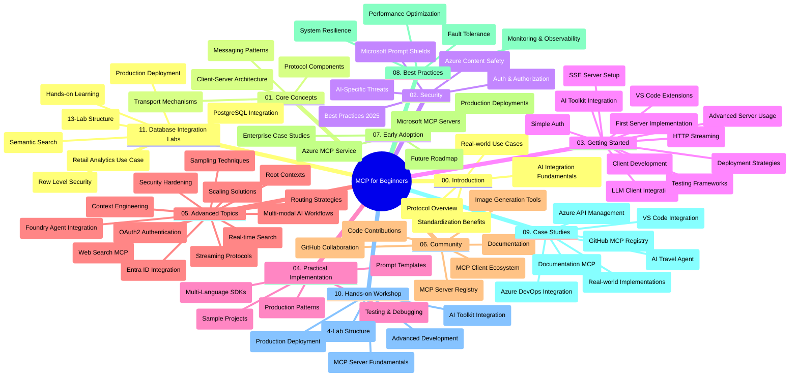

<!--
CO_OP_TRANSLATOR_METADATA:
{
  "original_hash": "af27b0acfae6caa134d9701453884df8",
  "translation_date": "2025-10-07T00:19:41+00:00",
  "source_file": "study_guide.md",
  "language_code": "my"
}
-->
# Model Context Protocol (MCP) အတွက် အခြေခံလမ်းညွှန် - သင်ကြားရေးလမ်းညွှန်

ဒီသင်ကြားရေးလမ်းညွှန်မှာ "Model Context Protocol (MCP) for Beginners" သင်ခန်းစာအတွက် repository ရဲ့ ဖွဲ့စည်းပုံနဲ့ အကြောင်းအရာကို အကျဉ်းချုပ်ဖော်ပြထားပါတယ်။ Repository ကို ထိရောက်စွာ အသုံးချနိုင်ဖို့ ဒီလမ်းညွှန်ကို အသုံးပြုပါ။

## Repository အကြောင်းအရာ

Model Context Protocol (MCP) ဟာ AI မော်ဒယ်နဲ့ client application တွေကြား အပြန်အလှန်ဆက်သွယ်မှုအတွက် စံပြစနစ်တစ်ခုဖြစ်ပါတယ်။ အစပိုင်းမှာ Anthropic က ဖန်တီးခဲ့ပြီးနောက်ပိုင်း MCP community က GitHub အဖွဲ့အစည်းမှ တရားဝင်ထိန်းသိမ်းနေပါတယ်။ ဒီ repository မှာ C#, Java, JavaScript, Python, TypeScript စတဲ့ programming language တွေကို အသုံးပြုပြီး လက်တွေ့ကိုယ်တိုင်လုပ်ဆောင်နိုင်တဲ့ code နမူနာတွေပါဝင်တဲ့ သင်ခန်းစာတွေကို AI developer, system architect, software engineer တွေအတွက် ရည်ရွယ်ဖန်တီးထားပါတယ်။

## သင်ခန်းစာမြင်ကွင်းပုံစံ

## Repository ဖွဲ့စည်းပုံ

Repository ကို MCP ရဲ့ အမျိုးမျိုးသော အခန်းကဏ္ဍ ၁၁ ခုအလိုက် ဖွဲ့စည်းထားပြီး အဓိကအချက်အလက်တွေကို အခြေခံထားပါတယ်။

1. **Introduction (00-Introduction/)**
   - Model Context Protocol ရဲ့ အကျဉ်းချုပ်
   - AI pipeline တွေမှာ စံပြစနစ်ရဲ့ အရေးပါမှု
   - လက်တွေ့အသုံးချမှုနဲ့ အကျိုးကျေးဇူးများ

2. **Core Concepts (01-CoreConcepts/)**
   - Client-server architecture
   - Protocol ရဲ့ အဓိကအစိတ်အပိုင်းများ
   - MCP ရဲ့ messaging pattern များ

3. **Security (02-Security/)**
   - MCP-based system တွေမှာ ဖြစ်နိုင်တဲ့ လုံခြုံရေးအန္တရာယ်များ
   - လုံခြုံရေးအကောင်အထည်ဖော်မှုအတွက် အကောင်းဆုံးနည်းလမ်းများ
   - Authentication နဲ့ authorization ရဲ့ မူဝါဒများ
   - **လုံခြုံရေးဆိုင်ရာ စာရွက်စာတမ်းများ**:
     - MCP Security Best Practices 2025
     - Azure Content Safety Implementation Guide
     - MCP Security Controls and Techniques
     - MCP Best Practices Quick Reference
   - **အဓိက လုံခြုံရေးအကြောင်းအရာများ**:
     - Prompt injection နဲ့ tool poisoning အန္တရာယ်များ
     - Session hijacking နဲ့ confused deputy ပြဿနာများ
     - Token passthrough vulnerabilities
     - Excessive permissions နဲ့ access control
     - AI components အတွက် supply chain security
     - Microsoft Prompt Shields integration

4. **Getting Started (03-GettingStarted/)**
   - Environment setup နဲ့ configuration
   - MCP server နဲ့ client များကို အခြေခံအဆင့် ဖန်တီးခြင်း
   - ရှိပြီးသား application တွေနဲ့ ပေါင်းစည်းခြင်း
   - အပိုင်းများပါဝင်သည့်အတူ:
     - ပထမဆုံး server ဖန်တီးခြင်း
     - Client ဖွံ့ဖြိုးတိုးတက်မှု
     - LLM client integration
     - VS Code integration
     - Server-Sent Events (SSE) server
     - အဆင့်မြင့် server အသုံးပြုမှု
     - HTTP streaming
     - AI Toolkit integration
     - စမ်းသပ်မှုနည်းလမ်းများ
     - Deployment လမ်းညွှန်များ

5. **Practical Implementation (04-PracticalImplementation/)**
   - အမျိုးမျိုးသော programming language တွေမှာ SDK အသုံးပြုခြင်း
   - Debugging, testing, validation နည်းလမ်းများ
   - Prompt template နဲ့ workflow များကို ပြန်အသုံးပြုနိုင်အောင် ဖန်တီးခြင်း
   - လက်တွေ့ project နမူနာများ

6. **Advanced Topics (05-AdvancedTopics/)**
   - Context engineering နည်းလမ်းများ
   - Foundry agent integration
   - Multi-modal AI workflow များ
   - OAuth2 authentication နမူနာများ
   - အချိန်နှင့်တပြေးညီ search လုပ်နိုင်မှု
   - အချိန်နှင့်တပြေးညီ streaming
   - Root contexts implementation
   - Routing နည်းလမ်းများ
   - Sampling နည်းလမ်းများ
   - Scaling နည်းလမ်းများ
   - လုံခြုံရေးအချက်အလက်များ
   - Entra ID security integration
   - Web search integration

7. **Community Contributions (06-CommunityContributions/)**
   - Code နဲ့ documentation တွေကို ဘယ်လို အထောက်အကူပြုမလဲ
   - GitHub မှတဆင့် ပူးပေါင်းဆောင်ရွက်ခြင်း
   - Community-driven အဆင့်မြှင့်တင်မှုနဲ့ အကြံပြုချက်များ
   - MCP client များ (Claude Desktop, Cline, VSCode) အသုံးပြုခြင်း
   - ပုံမှန် MCP server များနှင့် ပေါင်းစည်းခြင်း

8. **Lessons from Early Adoption (07-LessonsfromEarlyAdoption/)**
   - လက်တွေ့အသုံးချမှုနဲ့ အောင်မြင်မှုဇာတ်လမ်းများ
   - MCP-based solution တွေကို တည်ဆောက်ခြင်းနဲ့ deploy လုပ်ခြင်း
   - အနာဂတ်လမ်းကြောင်းနဲ့ trend များ
   - **Microsoft MCP Servers Guide**: Microsoft MCP server ၁၀ ခုအတွက် လမ်းညွှန်ချက်များ:
     - Microsoft Learn Docs MCP Server
     - Azure MCP Server (15+ specialized connectors)
     - GitHub MCP Server
     - Azure DevOps MCP Server
     - MarkItDown MCP Server
     - SQL Server MCP Server
     - Playwright MCP Server
     - Dev Box MCP Server
     - Azure AI Foundry MCP Server
     - Microsoft 365 Agents Toolkit MCP Server

9. **Best Practices (08-BestPractices/)**
   - Performance tuning နဲ့ optimization
   - Fault-tolerant MCP system တွေကို ဒီဇိုင်းဆွဲခြင်း
   - စမ်းသပ်မှုနဲ့ resilience နည်းလမ်းများ

10. **Case Studies (09-CaseStudy/)**
    - MCP ရဲ့ အမျိုးမျိုးသော scenario တွေမှာ အသုံးချနိုင်မှုကို ပြသတဲ့ **Case Study ၇ ခု**:
    - **Azure AI Travel Agents**: Azure OpenAI နဲ့ AI Search ကို အသုံးပြု Multi-agent orchestration
    - **Azure DevOps Integration**: YouTube data update တွေကို workflow process တွေဖြင့် automate လုပ်ခြင်း
    - **Real-Time Documentation Retrieval**: Python console client နဲ့ streaming HTTP
    - **Interactive Study Plan Generator**: Chainlit web app နဲ့ conversational AI
    - **In-Editor Documentation**: VS Code integration နဲ့ GitHub Copilot workflow
    - **Azure API Management**: Enterprise API integration နဲ့ MCP server ဖန်တီးခြင်း
    - **GitHub MCP Registry**: Ecosystem development နဲ့ agentic integration platform
    - Enterprise integration, developer productivity, ecosystem development အတွက် implementation နမူနာများ

11. **Hands-on Workshop (10-StreamliningAIWorkflowsBuildingAnMCPServerWithAIToolkit/)**
    - MCP နဲ့ AI Toolkit ကို ပေါင်းစည်းထားတဲ့ လက်တွေ့ workshop
    - AI model တွေကို လက်တွေ့ tool တွေနဲ့ ချိတ်ဆက်ထားတဲ့ intelligent application တွေ တည်ဆောက်ခြင်း
    - အခြေခံ, custom server ဖွံ့ဖြိုးတိုးတက်မှု, production deployment strategy တွေပါဝင်တဲ့ module များ
    - **Lab Structure**:
      - Lab 1: MCP Server Fundamentals
      - Lab 2: Advanced MCP Server Development
      - Lab 3: AI Toolkit Integration
      - Lab 4: Production Deployment and Scaling
    - လမ်းညွှန်ချက်အဆင့်ဆင့်ပါဝင်တဲ့ lab-based သင်ကြားမှု

12. **MCP Server Database Integration Labs (11-MCPServerHandsOnLabs/)**
    - PostgreSQL integration နဲ့ production-ready MCP server တည်ဆောက်ခြင်းအတွက် **13-lab learning path**
    - **Zava Retail use case** ကို အသုံးပြုတဲ့ real-world retail analytics implementation
    - **Enterprise-grade pattern များ**: Row Level Security (RLS), semantic search, multi-tenant data access
    - **Complete Lab Structure**:
      - **Labs 00-03: Foundations** - Introduction, Architecture, Security, Environment Setup
      - **Labs 04-06: Building the MCP Server** - Database Design, MCP Server Implementation, Tool Development
      - **Labs 07-09: Advanced Features** - Semantic Search, Testing & Debugging, VS Code Integration
      - **Labs 10-12: Production & Best Practices** - Deployment, Monitoring, Optimization
    - **Technologies Covered**: FastMCP framework, PostgreSQL, Azure OpenAI, Azure Container Apps, Application Insights
    - **Learning Outcomes**: Production-ready MCP servers, database integration pattern များ, AI-powered analytics, enterprise security

## အပိုဆောင်းအရင်းအမြစ်များ

Repository မှာ အထောက်အကူပြုအရင်းအမြစ်များပါဝင်သည်:

- **Images folder**: သင်ခန်းစာတစ်လျှောက်မှာ အသုံးပြုထားတဲ့ diagram နဲ့ illustration များ
- **Translations**: Documentation ကို အလိုအလျောက် ဘာသာပြန်ထားတဲ့ multi-language support
- **Official MCP Resources**:
  - [MCP Documentation](https://modelcontextprotocol.io/)
  - [MCP Specification](https://spec.modelcontextprotocol.io/)
  - [MCP GitHub Repository](https://github.com/modelcontextprotocol)

## ဒီ Repository ကို ဘယ်လို အသုံးပြုမလဲ

1. **Sequential Learning**: အခန်း 00 မှ 11 အထိ အစဉ်လိုက် လေ့လာပါ။
2. **Language-Specific Focus**: သင်နှစ်သက်တဲ့ programming language အတွက် sample directory တွေကို ရှာဖွေပါ။
3. **Practical Implementation**: "Getting Started" အပိုင်းကို စတင်ပြီး MCP server နဲ့ client ကို ဖန်တီးပါ။
4. **Advanced Exploration**: အခြေခံကို နားလည်ပြီးရင် advanced topics ကို လေ့လာပါ။
5. **Community Engagement**: GitHub discussion နဲ့ Discord channel တွေမှတဆင့် MCP community နဲ့ ဆက်သွယ်ပါ။

## MCP Clients နဲ့ Tools

Curriculum မှာ MCP client နဲ့ tool များကို ဖော်ပြထားသည်:

1. **Official Clients**:
   - Visual Studio Code 
   - MCP in Visual Studio Code
   - Claude Desktop
   - Claude in VSCode 
   - Claude API

2. **Community Clients**:
   - Cline (terminal-based)
   - Cursor (code editor)
   - ChatMCP
   - Windsurf

3. **MCP Management Tools**:
   - MCP CLI
   - MCP Manager
   - MCP Linker
   - MCP Router

## လူကြိုက်များသော MCP Servers

Repository မှာ MCP server များကို ဖော်ပြထားသည်:

1. **Official Microsoft MCP Servers**:
   - Microsoft Learn Docs MCP Server
   - Azure MCP Server (15+ specialized connectors)
   - GitHub MCP Server
   - Azure DevOps MCP Server
   - MarkItDown MCP Server
   - SQL Server MCP Server
   - Playwright MCP Server
   - Dev Box MCP Server
   - Azure AI Foundry MCP Server
   - Microsoft 365 Agents Toolkit MCP Server

2. **Official Reference Servers**:
   - Filesystem
   - Fetch
   - Memory
   - Sequential Thinking

3. **Image Generation**:
   - Azure OpenAI DALL-E 3
   - Stable Diffusion WebUI
   - Replicate

4. **Development Tools**:
   - Git MCP
   - Terminal Control
   - Code Assistant

5. **Specialized Servers**:
   - Salesforce
   - Microsoft Teams
   - Jira & Confluence

## Contributing

ဒီ repository မှာ community မှ အထောက်အကူပြုမှုကို ကြိုဆိုပါတယ်။ MCP ecosystem ကို ထိရောက်စွာ အထောက်အကူပြုဖို့ Community Contributions အပိုင်းကို ကြည့်ပါ။

----

*ဒီသင်ကြားရေးလမ်းညွှန်ကို ၂၀၂၅ ခုနှစ် အောက်တိုဘာလ ၆ ရက်နေ့မှာ update လုပ်ထားပြီး အဲဒီနေ့အထိ repository ရဲ့ အကျဉ်းချုပ်ကို ဖော်ပြထားပါတယ်။ Repository content ကို အဲဒီနေ့နောက်ပိုင်းမှာ update လုပ်နိုင်ပါသည်။*

---

**အကြောင်းကြားချက်**:  
ဤစာရွက်စာတမ်းကို AI ဘာသာပြန်ဝန်ဆောင်မှု [Co-op Translator](https://github.com/Azure/co-op-translator) ကို အသုံးပြု၍ ဘာသာပြန်ထားပါသည်။ ကျွန်ုပ်တို့သည် တိကျမှုအတွက် ကြိုးစားနေသော်လည်း အလိုအလျောက် ဘာသာပြန်မှုများတွင် အမှားများ သို့မဟုတ် မမှန်ကန်မှုများ ပါဝင်နိုင်သည်ကို သတိပြုပါ။ မူရင်းဘာသာစကားဖြင့် ရေးသားထားသော စာရွက်စာတမ်းကို အာဏာတရ အရင်းအမြစ်အဖြစ် သတ်မှတ်သင့်ပါသည်။ အရေးကြီးသော အချက်အလက်များအတွက် လူက ဘာသာပြန်မှုကို အကြံပြုပါသည်။ ဤဘာသာပြန်မှုကို အသုံးပြုခြင်းမှ ဖြစ်ပေါ်လာသော အလွဲအမှားများ သို့မဟုတ် အနားလွဲမှုများအတွက် ကျွန်ုပ်တို့သည် တာဝန်မယူပါ။