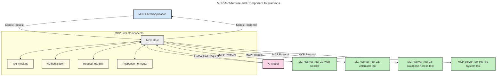
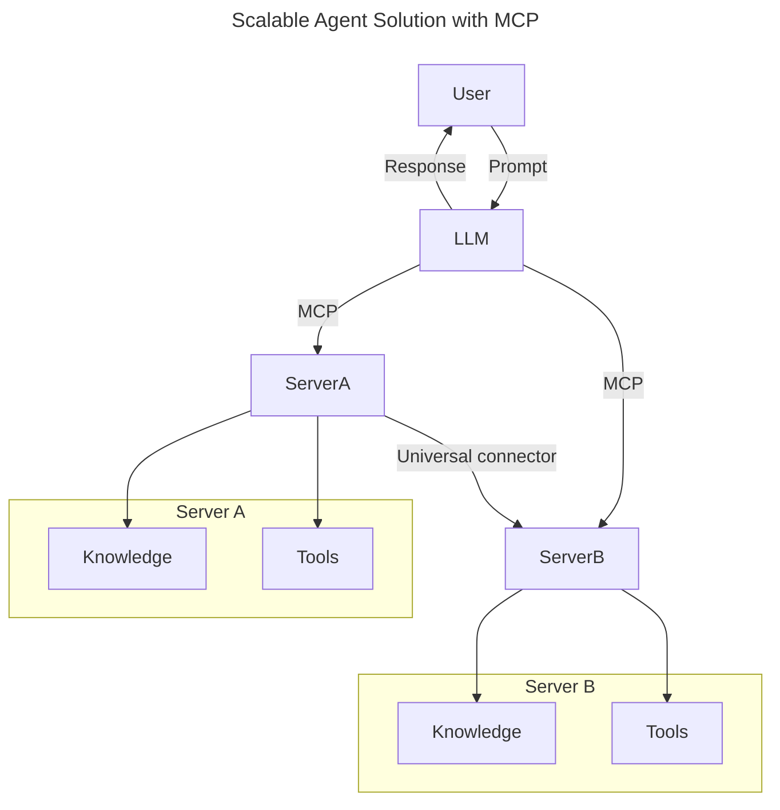

<!--
CO_OP_TRANSLATOR_METADATA:
{
  "original_hash": "9678e0c6945b8e0c23586869b0e26783",
  "translation_date": "2025-10-06T10:57:02+00:00",
  "source_file": "00-Introduction/README.md",
  "language_code": "ne"
}
-->
# मोडेल कन्टेक्स्ट प्रोटोकल (MCP) को परिचय: स्केलेबल एआई एप्लिकेसनहरूको लागि यसको महत्त्व

_(माथिको तस्बिरमा क्लिक गरेर यस पाठको भिडियो हेर्नुहोस्)_

जेनेरेटिभ एआई एप्लिकेसनहरू एक ठूलो कदम अगाडि हो किनभने तिनीहरूले प्रायः प्रयोगकर्तालाई प्राकृतिक भाषा प्रम्प्टहरू प्रयोग गरेर एपसँग अन्तरक्रिया गर्न अनुमति दिन्छ। तर, जब यस्ता एपहरूमा समय र स्रोतहरू थप लगानी गरिन्छ, तपाईंले सुनिश्चित गर्न चाहनुहुन्छ कि तपाईंले कार्यक्षमताहरू र स्रोतहरू सजिलैसँग एकीकृत गर्न सक्नुहुन्छ जसले विस्तार गर्न सजिलो बनाउँछ, तपाईंको एपले एकभन्दा बढी मोडेललाई समर्थन गर्न सक्छ, र विभिन्न मोडेल जटिलताहरूलाई व्यवस्थापन गर्न सक्छ। छोटकरीमा, जेनेरेटिभ एआई एप बनाउनु सुरु गर्न सजिलो छ, तर जब तिनीहरू बढ्छन् र जटिल बन्छन्, तपाईंले आर्किटेक्चर परिभाषित गर्न सुरु गर्न आवश्यक छ र सम्भवतः एक मानकमा निर्भर रहनु पर्नेछ ताकि तपाईंको एपहरू एक सुसंगत तरिकामा निर्माण गरिएका छन्। यहीँ MCP आउँछ चीजहरू व्यवस्थित गर्न र एक मानक प्रदान गर्न।

---

## **🔍 मोडेल कन्टेक्स्ट प्रोटोकल (MCP) के हो?**

**मोडेल कन्टेक्स्ट प्रोटोकल (MCP)** एक **खुला, मानकीकृत इन्टरफेस** हो जसले ठूलो भाषा मोडेलहरू (LLMs) लाई बाह्य उपकरणहरू, APIहरू, र डाटा स्रोतहरूसँग सहज रूपमा अन्तरक्रिया गर्न अनुमति दिन्छ। यसले एक सुसंगत आर्किटेक्चर प्रदान गर्दछ जसले एआई मोडेलको कार्यक्षमता तिनीहरूको प्रशिक्षण डाटाभन्दा बाहिर बढाउँछ, स्मार्ट, स्केलेबल, र थप प्रतिक्रियाशील एआई प्रणालीहरू सक्षम बनाउँछ।

---

## **🎯 एआईमा मानकीकरण किन महत्त्वपूर्ण छ**

जेनेरेटिभ एआई एप्लिकेसनहरू जटिल हुँदै जाँदा, **स्केलेबिलिटी, विस्तारयोग्यता, मर्मतयोग्यता**, र **विक्रेता-लॉक-इनबाट बच्न** सुनिश्चित गर्ने मानकहरू अपनाउनु आवश्यक छ। MCP ले निम्न आवश्यकताहरूलाई सम्बोधन गर्दछ:

- मोडेल-उपकरण एकीकरणलाई एकीकृत गर्दै
- कमजोर, एकपटकका कस्टम समाधानहरू घटाउँदै
- विभिन्न विक्रेताहरूका मोडेलहरूलाई एउटै इकोसिस्टममा सह-अस्तित्व गर्न अनुमति दिँदै

**Note:** MCP आफूलाई खुला मानकको रूपमा प्रस्तुत गरे पनि, IEEE, IETF, W3C, ISO, वा अन्य कुनै पनि मानक निकायमार्फत MCP लाई मानकीकरण गर्ने कुनै योजना छैन।

---

## **📚 सिकाइ उद्देश्यहरू**

यस लेखको अन्त्यसम्ममा, तपाईं सक्षम हुनुहुनेछ:

- **मोडेल कन्टेक्स्ट प्रोटोकल (MCP)** र यसको प्रयोगका केसहरू परिभाषित गर्न
- MCP ले मोडेल-उपकरण सञ्चारलाई कसरी मानकीकरण गर्छ भन्ने बुझ्न
- MCP आर्किटेक्चरका मुख्य घटकहरू पहिचान गर्न
- उद्यम र विकास सन्दर्भहरूमा MCP को वास्तविक-विश्व अनुप्रयोगहरू अन्वेषण गर्न

---

## **💡 मोडेल कन्टेक्स्ट प्रोटोकल (MCP) किन गेम-चेन्जर हो**

### **🔗 MCP ले एआई अन्तरक्रियामा विखण्डन समाधान गर्छ**

MCP भन्दा पहिले, मोडेलहरूलाई उपकरणहरूसँग एकीकृत गर्न आवश्यक थियो:

- प्रत्येक उपकरण-मोडेल जोडीका लागि कस्टम कोड
- प्रत्येक विक्रेताका लागि गैर-मानक APIहरू
- अपडेटका कारण बारम्बार ब्रेक
- धेरै उपकरणहरूसँग खराब स्केलेबिलिटी

### **✅ MCP मानकीकरणका फाइदाहरू**

| **फाइदा**                | **विवरण**                                                                      |
|--------------------------|--------------------------------------------------------------------------------|
| अन्तरक्रियात्मकता       | LLMs विभिन्न विक्रेताहरूका उपकरणहरूसँग सहज रूपमा काम गर्छन्                     |
| सुसंगतता                | प्लेटफर्म र उपकरणहरूमा समान व्यवहार                                            |
| पुनःप्रयोगयोग्यता       | एकपटक निर्माण गरिएका उपकरणहरू परियोजनाहरू र प्रणालीहरूमा प्रयोग गर्न सकिन्छ     |
| तीव्र विकास              | मानकीकृत, प्लग-एन्ड-प्ले इन्टरफेसहरू प्रयोग गरेर विकास समय घटाउनु              |

---

## **🧱 उच्च-स्तरीय MCP आर्किटेक्चरको अवलोकन**

MCP ले **क्लाइन्ट-सर्भर मोडेल** अनुसरण गर्छ, जहाँ:

- **MCP होस्टहरू** एआई मोडेलहरू चलाउँछन्
- **MCP क्लाइन्टहरू** अनुरोध सुरु गर्छन्
- **MCP सर्भरहरू** सन्दर्भ, उपकरणहरू, र क्षमताहरू प्रदान गर्छन्

### **मुख्य घटकहरू:**

- **स्रोतहरू** – मोडेलहरूको लागि स्थिर वा गतिशील डाटा  
- **प्रम्प्टहरू** – निर्देशित जेनेरेशनका लागि पूर्वनिर्धारित वर्कफ्लोहरू  
- **उपकरणहरू** – खोज, गणना जस्ता कार्यहरू  
- **नमूना** – पुनरावृत्त अन्तरक्रियाहरू मार्फत एजेन्टिक व्यवहार  

---

## MCP सर्भरहरू कसरी काम गर्छन्

MCP सर्भरहरू निम्न तरिकामा सञ्चालन गर्छन्:

- **अनुरोध प्रवाह**:
    1. अन्तिम प्रयोगकर्ता वा तिनीहरूको तर्फबाट कार्य गर्ने सफ्टवेयरद्वारा अनुरोध सुरु गरिन्छ।
    2. **MCP क्लाइन्ट** अनुरोधलाई **MCP होस्ट** मा पठाउँछ, जसले एआई मोडेल रनटाइम व्यवस्थापन गर्छ।
    3. **एआई मोडेल** प्रयोगकर्ता प्रम्प्ट प्राप्त गर्छ र एक वा बढी उपकरण कलहरू मार्फत बाह्य उपकरणहरू वा डाटामा पहुँचको अनुरोध गर्न सक्छ।
    4. **MCP होस्ट**, मोडेलले प्रत्यक्ष रूपमा होइन, मानकीकृत प्रोटोकल प्रयोग गरेर उपयुक्त **MCP सर्भर(हरू)** सँग सञ्चार गर्छ।
- **MCP होस्ट कार्यक्षमता**:
    - **उपकरण रजिस्ट्री**: उपलब्ध उपकरणहरू र तिनीहरूको क्षमताहरूको सूची राख्छ।
    - **प्रमाणीकरण**: उपकरण पहुँचको अनुमति प्रमाणित गर्छ।
    - **अनुरोध ह्यान्डलर**: मोडेलबाट आउने उपकरण अनुरोधहरू प्रशोधन गर्छ।
    - **प्रतिक्रिया स्वरूपकर्ता**: उपकरण आउटपुटलाई मोडेलले बुझ्न सक्ने स्वरूपमा संरचना गर्छ।
- **MCP सर्भर कार्यान्वयन**:
    - **MCP होस्ट** उपकरण कलहरूलाई एक वा बढी **MCP सर्भर(हरू)** मा रुट गर्छ, प्रत्येकले विशेष कार्यहरू (जस्तै, खोज, गणना, डाटाबेस क्वेरीहरू) प्रदान गर्छ।
    - **MCP सर्भर(हरू)** तिनीहरूको सम्बन्धित अपरेशनहरू प्रदर्शन गर्छन् र **MCP होस्ट** लाई परिणामहरू सुसंगत स्वरूपमा फर्काउँछन्।
    - **MCP होस्ट** यी परिणामहरूलाई स्वरूपित गर्छ र **एआई मोडेल** मा पठाउँछ।
- **प्रतिक्रिया पूरा**:
    - **एआई मोडेल** उपकरण आउटपुटलाई अन्तिम प्रतिक्रियामा समाहित गर्छ।
    - **MCP होस्ट** यो प्रतिक्रिया **MCP क्लाइन्ट** मा पठाउँछ, जसले अन्तिम प्रयोगकर्ता वा कल गर्ने सफ्टवेयरलाई प्रदान गर्छ।

## 👨‍💻 MCP सर्भर कसरी निर्माण गर्ने (उदाहरणसहित)

MCP सर्भरहरूले LLM क्षमताहरू विस्तार गर्न डाटा र कार्यक्षमता प्रदान गर्न अनुमति दिन्छ।

तयार हुनुहुन्छ प्रयास गर्न? यहाँ विभिन्न भाषाहरू/स्ट्याकहरूमा सरल MCP सर्भरहरू निर्माण गर्ने उदाहरणहरू सहित भाषा र/वा स्ट्याक विशिष्ट SDKहरू छन्:

- **Python SDK**: https://github.com/modelcontextprotocol/python-sdk

- **TypeScript SDK**: https://github.com/modelcontextprotocol/typescript-sdk

- **Java SDK**: https://github.com/modelcontextprotocol/java-sdk

- **C#/.NET SDK**: https://github.com/modelcontextprotocol/csharp-sdk

## 🌍 MCP को वास्तविक-विश्व प्रयोगका केसहरू

MCP ले एआई क्षमताहरू विस्तार गरेर विभिन्न प्रकारका अनुप्रयोगहरू सक्षम बनाउँछ:

| **अनुप्रयोग**                | **विवरण**                                                                      |
|------------------------------|--------------------------------------------------------------------------------|
| उद्यम डाटा एकीकरण           | LLMs लाई डाटाबेस, CRM, वा आन्तरिक उपकरणहरूसँग जडान गर्नु                     |
| एजेन्टिक एआई प्रणालीहरू      | उपकरण पहुँच र निर्णय-निर्माण वर्कफ्लोहरूसँग स्वायत्त एजेन्टहरू सक्षम गर्नु     |
| मल्टी-मोडल एप्लिकेसनहरू     | एकल एकीकृत एआई एपभित्र पाठ, तस्बिर, र अडियो उपकरणहरू संयोजन गर्नु            |
| वास्तविक-समय डाटा एकीकरण    | एआई अन्तरक्रियामा लाइभ डाटा ल्याएर थप सटीक, वर्तमान आउटपुटहरू प्रदान गर्नु     |

### 🧠 MCP = एआई अन्तरक्रियाको लागि सार्वभौमिक मानक

मोडेल कन्टेक्स्ट प्रोटोकल (MCP) एआई अन्तरक्रियाको लागि सार्वभौमिक मानकको रूपमा कार्य गर्दछ, ठीक USB-C ले उपकरणहरूको भौतिक जडानलाई मानकीकरण गरेजस्तै। एआईको संसारमा, MCP ले एक सुसंगत इन्टरफेस प्रदान गर्दछ, जसले मोडेलहरू (क्लाइन्टहरू) लाई बाह्य उपकरणहरू र डाटा प्रदायकहरू (सर्भरहरू) सँग सहज रूपमा एकीकृत गर्न अनुमति दिन्छ। यसले प्रत्येक API वा डाटा स्रोतका लागि विविध, कस्टम प्रोटोकलहरूको आवश्यकता हटाउँछ।

MCP अन्तर्गत, MCP-संगत उपकरण (MCP सर्भर भनिन्छ) एक एकीकृत मानक अनुसरण गर्छ। यी सर्भरहरूले तिनीहरूले प्रस्ताव गर्ने उपकरणहरू वा कार्यहरूको सूची दिन सक्छन् र एआई एजेन्टले अनुरोध गर्दा ती कार्यहरू कार्यान्वयन गर्न सक्छन्। MCP समर्थन गर्ने एआई एजेन्ट प्लेटफर्महरूले सर्भरहरूबाट उपलब्ध उपकरणहरू पत्ता लगाउन र यस मानक प्रोटोकलमार्फत तिनीहरूलाई आह्वान गर्न सक्षम छन्।

### 💡 ज्ञान पहुँचलाई सहज बनाउँछ

उपकरणहरू प्रदान गर्नुको बाहेक, MCP ले ज्ञान पहुँचलाई पनि सहज बनाउँछ। यसले एप्लिकेसनहरूलाई विभिन्न डाटा स्रोतहरूसँग जडान गरेर ठूलो भाषा मोडेलहरू (LLMs) लाई सन्दर्भ प्रदान गर्न सक्षम बनाउँछ। उदाहरणका लागि, MCP सर्भरले कम्पनीको दस्तावेज भण्डारलाई प्रतिनिधित्व गर्न सक्छ, जसले एजेन्टहरूलाई मागमा सम्बन्धित जानकारी पुनःप्राप्त गर्न अनुमति दिन्छ। अर्को सर्भरले इमेल पठाउने वा रेकर्ड अपडेट गर्ने जस्ता विशिष्ट कार्यहरू ह्यान्डल गर्न सक्छ। एजेन्टको दृष्टिकोणबाट, यी केवल उपकरणहरू हुन् जुन यसले प्रयोग गर्न सक्छ—केही उपकरणहरूले डाटा (ज्ञान सन्दर्भ) फर्काउँछन् भने अन्यले कार्यहरू प्रदर्शन गर्छन्। MCP ले दुवैलाई कुशलतापूर्वक व्यवस्थापन गर्छ।

एजेन्टले MCP सर्भरमा जडान गर्दा सर्भरको उपलब्ध क्षमताहरू र पहुँचयोग्य डाटालाई मानक स्वरूपमा स्वचालित रूपमा सिक्छ। यस मानकीकरणले गतिशील उपकरण उपलब्धता सक्षम बनाउँछ। उदाहरणका लागि, एजेन्टको प्रणालीमा नयाँ MCP सर्भर थप्दा यसको कार्यहरू तुरुन्तै प्रयोग गर्न सकिन्छ बिना एजेन्टको निर्देशनहरूको थप अनुकूलन आवश्यक पर्दा।

यो सरल एकीकरण निम्न चित्रमा देखाइएको प्रवाहसँग मेल खान्छ, जहाँ सर्भरहरूले उपकरण र ज्ञान प्रदान गर्छन्, प्रणालीहरूमा सहज सहयोग सुनिश्चित गर्दै।

### 👉 उदाहरण: स्केलेबल एजेन्ट समाधान

यूनिभर्सल कनेक्टरले MCP सर्भरहरूलाई एकअर्कासँग सञ्चार गर्न र क्षमताहरू साझा गर्न सक्षम बनाउँछ, जसले ServerA लाई ServerB मा कार्यहरू प्रतिनिधि गर्न वा यसको उपकरण र ज्ञान पहुँच गर्न अनुमति दिन्छ। यसले सर्भरहरूमा उपकरण र डाटालाई संघीय बनाउँछ, स्केलेबल र मोड्युलर एजेन्ट आर्किटेक्चरलाई समर्थन गर्दै। MCP ले उपकरण एक्सपोजरलाई मानकीकरण गर्ने भएकाले, एजेन्टहरूले सर्भरहरू बीच गतिशील रूपमा अनुरोधहरू पत्ता लगाउन र रुट गर्न सक्छन् बिना हार्डकोडेड एकीकरणहरूको।

उपकरण र ज्ञान संघीयकरण: उपकरण र डाटालाई सर्भरहरूमा पहुँच गर्न सकिन्छ, स्केलेबल र मोड्युलर एजेन्टिक आर्किटेक्चर सक्षम गर्दै।

### 🔄 क्लाइन्ट-साइड LLM एकीकरणसहित उन्नत MCP परिदृश्यहरू

मूल MCP आर्किटेक्चरभन्दा बाहिर, त्यहाँ उन्नत परिदृश्यहरू छन् जहाँ क्लाइन्ट र सर्भर दुवैमा LLMs हुन्छन्, जसले थप परिष्कृत अन्तरक्रियाहरू सक्षम बनाउँछ। निम्न चित्रमा, **क्लाइन्ट एप** IDE हुन सक्छ जसमा प्रयोगकर्ताका लागि LLM द्वारा उपलब्ध MCP उपकरणहरूको संख्या छ:

```mermaid
---
title: Advanced MCP Scenarios with Client-Server LLM Integration
description: A sequence diagram showing the detailed interaction flow between user, client application, client LLM, multiple MCP servers, and server LLM, illustrating tool discovery, user interaction, direct tool calling, and feature negotiation phases
---
sequenceDiagram
    autonumber
    actor User as 👤 User
    participant ClientApp as 🖥️ Client App
    participant ClientLLM as 🧠 Client LLM
    participant Server1 as 🔧 MCP Server 1
    participant Server2 as 📚 MCP Server 2
    participant ServerLLM as 🤖 Server LLM
    
    %% Discovery Phase
    rect rgb(220, 240, 255)
        Note over ClientApp, Server2: TOOL DISCOVERY PHASE
        ClientApp->>+Server1: Request available tools/resources
        Server1-->>-ClientApp: Return tool list (JSON)
        ClientApp->>+Server2: Request available tools/resources
        Server2-->>-ClientApp: Return tool list (JSON)
        Note right of ClientApp: Store combined tool<br/>catalog locally
    end
    
    %% User Interaction
    rect rgb(255, 240, 220)
        Note over User, ClientLLM: USER INTERACTION PHASE
        User->>+ClientApp: Enter natural language prompt
        ClientApp->>+ClientLLM: Forward prompt + tool catalog
        ClientLLM->>-ClientLLM: Analyze prompt & select tools
    end
    
    %% Scenario A: Direct Tool Calling
    alt Direct Tool Calling
        rect rgb(220, 255, 220)
            Note over ClientApp, Server1: SCENARIO A: DIRECT TOOL CALLING
            ClientLLM->>+ClientApp: Request tool execution
            ClientApp->>+Server1: Execute specific tool
            Server1-->>-ClientApp: Return results
            ClientApp->>+ClientLLM: Process results
            ClientLLM-->>-ClientApp: Generate response
            ClientApp-->>-User: Display final answer
        end
    
    %% Scenario B: Feature Negotiation (VS Code style)
    else Feature Negotiation (VS Code style)
        rect rgb(255, 220, 220)
            Note over ClientApp, ServerLLM: SCENARIO B: FEATURE NEGOTIATION
            ClientLLM->>+ClientApp: Identify needed capabilities
            ClientApp->>+Server2: Negotiate features/capabilities
            Server2->>+ServerLLM: Request additional context
            ServerLLM-->>-Server2: Provide context
            Server2-->>-ClientApp: Return available features
            ClientApp->>+Server2: Call negotiated tools
            Server2-->>-ClientApp: Return results
            ClientApp->>+ClientLLM: Process results
            ClientLLM-->>-ClientApp: Generate response
            ClientApp-->>-User: Display final answer
        end
    end
```

## 🔐 MCP को व्यावहारिक फाइदाहरू

MCP प्रयोग गर्दा निम्न व्यावहारिक फाइदाहरू छन्:

- **ताजगी**: मोडेलहरूले तिनीहरूको प्रशिक्षण डाटाभन्दा बाहिरको अद्यावधिक जानकारी पहुँच गर्न सक्छन्
- **क्षमता विस्तार**: मोडेलहरूले तिनीहरूलाई प्रशिक्षण नगरिएका कार्यहरूको लागि विशेष उपकरणहरू प्रयोग गर्न सक्छन्
- **भ्रम कम गर्नु**: बाह्य डाटा स्रोतहरूले तथ्यात्मक आधार प्रदान गर्छन्
- **गोपनीयता**: संवेदनशील डाटा प्रम्प्टहरूमा समाहित हुनुको सट्टा सुरक्षित वातावरणभित्र रहन सक्छ

## 📌 मुख्य बुँदाहरू

MCP प्रयोग गर्दा निम्न मुख्य बुँदाहरू छन्:

- **MCP** ले एआई मोडेलहरू उपकरण र डाटासँग कसरी अन्तरक्रिया गर्छन् भन्ने मानकीकरण गर्छ
- **विस्तारयोग्यता, सुसंगतता, र अन्तरक्रियात्मकता** प्रवर्द्धन गर्छ
- MCP ले **विकास समय घटाउन, विश्वसनीयता सुधार गर्न, र मोडेल क्षमताहरू विस्तार गर्न मद्दत गर्छ**
- क्लाइन्ट-सर्भर आर्किटेक्चरले **लचिलो, विस्तारयोग्य एआई एप्लिकेसनहरू सक्षम बनाउँछ**

## 🧠 अभ्यास

तपाईं निर्माण गर्न इच्छुक एआई एप्लिकेसनको बारेमा सोच्नुहोस्।

- कुन **बाह्य उपकरण वा डाटा** ले यसको क्षमताहरू सुधार गर्न सक्छ?
- MCP ले एकीकरणलाई **सरल र विश्वसनीय** कसरी बनाउन सक्छ?

## थप स्रोतहरू

- [MCP GitHub Repository](https://github.com/modelcontextprotocol)

## अब के गर्ने

अर्को: [अध्याय १: कोर अवधारणाहरू](../01-CoreConcepts/README.md)

---

**अस्वीकरण**:  
यो दस्तावेज़ AI अनुवाद सेवा [Co-op Translator](https://github.com/Azure/co-op-translator) प्रयोग गरेर अनुवाद गरिएको हो। हामी यथार्थताको लागि प्रयास गर्छौं, तर कृपया ध्यान दिनुहोस् कि स्वचालित अनुवादमा त्रुटिहरू वा अशुद्धताहरू हुन सक्छ। यसको मूल भाषा मा रहेको मूल दस्तावेज़लाई आधिकारिक स्रोत मानिनुपर्छ। महत्वपूर्ण जानकारीको लागि, व्यावसायिक मानव अनुवाद सिफारिस गरिन्छ। यस अनुवादको प्रयोगबाट उत्पन्न हुने कुनै पनि गलतफहमी वा गलत व्याख्याको लागि हामी जिम्मेवार हुने छैनौं।