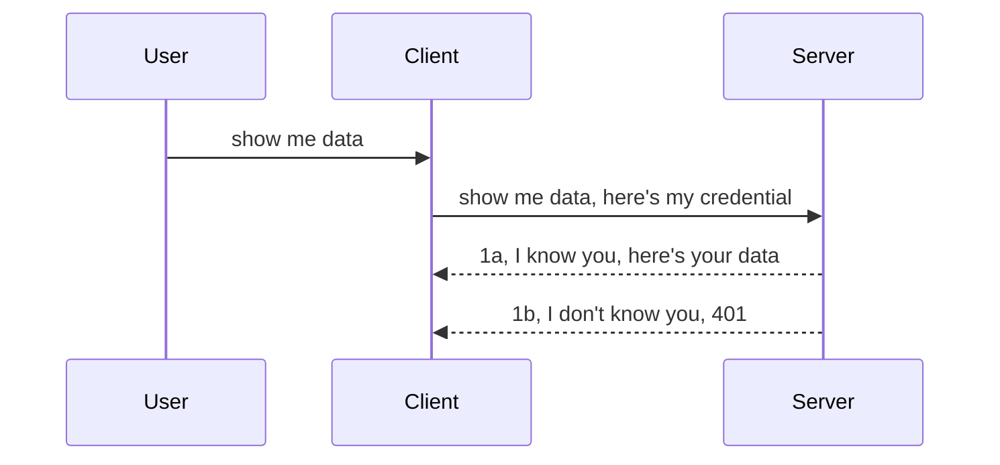

<!--
CO_OP_TRANSLATOR_METADATA:
{
  "original_hash": "5b00b8a8971a07d2d8803be4c9f138f8",
  "translation_date": "2025-10-07T00:43:03+00:00",
  "source_file": "03-GettingStarted/11-simple-auth/README.md",
  "language_code": "ne"
}
-->
# सरल प्रमाणीकरण

MCP SDKs ले OAuth 2.1 को प्रयोगलाई समर्थन गर्दछ, जुन निष्पक्ष रूपमा भन्नुपर्दा, प्रमाणीकरण सर्भर, स्रोत सर्भर, प्रमाणहरू पोस्ट गर्ने, कोड प्राप्त गर्ने, कोडलाई बियरर टोकनमा साट्ने जस्ता अवधारणाहरू समावेश गर्ने जटिल प्रक्रिया हो। अन्ततः तपाईंले आफ्नो स्रोत डेटा प्राप्त गर्न सक्नुहुन्छ। यदि तपाईं OAuth प्रयोग गर्न अभ्यस्त हुनुहुन्न भने, जुन लागू गर्न उत्कृष्ट कुरा हो, आधारभूत स्तरको प्रमाणीकरणबाट सुरु गरेर सुरक्षा सुधार गर्दै जानु राम्रो हुन्छ। यही कारणले यो अध्यायको अस्तित्व छ, तपाईंलाई उन्नत प्रमाणीकरणतर्फ लैजान।

## प्रमाणीकरण भनेको के हो?

प्रमाणीकरण भनेको प्रमाणीकरण र अधिकार प्रदान गर्ने प्रक्रियालाई बुझिन्छ। यसको मुख्य उद्देश्य दुई कुरा सुनिश्चित गर्नु हो:

- **प्रमाणीकरण**, जसले व्यक्तिलाई हाम्रो घरमा प्रवेश गर्न दिने कि नदिने निर्णय गर्ने प्रक्रिया हो। यसले उनीहरूलाई "यहाँ" अर्थात् हाम्रो स्रोत सर्भरमा पहुँच गर्न योग्य बनाउँछ जहाँ हाम्रो MCP सर्भर सुविधाहरू छन्।
- **अधिकार प्रदान गर्ने प्रक्रिया**, जसले प्रयोगकर्ताले उनीहरूले माग गरिरहेका विशिष्ट स्रोतहरूमा पहुँच गर्न योग्य छन् कि छैनन् भनेर पत्ता लगाउँछ। उदाहरणका लागि, यी अर्डरहरू वा यी उत्पादनहरूमा पहुँच, वा सामग्री पढ्न अनुमति छ तर मेटाउन अनुमति छैन।

## प्रमाणहरू: प्रणालीलाई हामी को हौं भनेर कसरी बताउने

धेरैजसो वेब विकासकर्ताहरूले सर्भरलाई प्रमाण प्रदान गर्ने बारे सोच्न सुरु गर्छन्, सामान्यतया एउटा गोप्य कुरा जसले उनीहरूलाई "प्रमाणीकरण" को लागि योग्य बनाउँछ। यो प्रमाण सामान्यतया प्रयोगकर्ता नाम र पासवर्डको बेस64 एन्कोड गरिएको संस्करण वा विशिष्ट प्रयोगकर्तालाई पहिचान गर्ने API कुञ्जी हो।

यो "Authorization" नामक हेडर मार्फत पठाइन्छ, जस्तै:

```json
{ "Authorization": "secret123" }
```

यसलाई सामान्यतया आधारभूत प्रमाणीकरण भनिन्छ। समग्र प्रवाह कसरी काम गर्छ भन्ने कुरा निम्नानुसार छ:



अब हामीले प्रवाहको दृष्टिकोणबाट यो कसरी काम गर्छ भन्ने कुरा बुझ्यौं, यसलाई कसरी कार्यान्वयन गर्ने? धेरैजसो वेब सर्भरहरूमा "मिडलवेयर" नामक अवधारणा हुन्छ, जुन अनुरोधको भागको रूपमा चल्ने कोडको टुक्रा हो। यसले प्रमाणहरू प्रमाणित गर्न सक्छ, र यदि प्रमाणहरू मान्य छन् भने अनुरोधलाई अगाडि बढ्न दिन्छ। यदि अनुरोधमा मान्य प्रमाणहरू छैनन् भने तपाईंलाई प्रमाणीकरण त्रुटि प्राप्त हुन्छ। यसलाई कसरी कार्यान्वयन गर्न सकिन्छ हेर्नुहोस्:

**Python**

```python
class AuthMiddleware(BaseHTTPMiddleware):
    async def dispatch(self, request, call_next):

        has_header = request.headers.get("Authorization")
        if not has_header:
            print("-> Missing Authorization header!")
            return Response(status_code=401, content="Unauthorized")

        if not valid_token(has_header):
            print("-> Invalid token!")
            return Response(status_code=403, content="Forbidden")

        print("Valid token, proceeding...")
       
        response = await call_next(request)
        # add any customer headers or change in the response in some way
        return response


starlette_app.add_middleware(CustomHeaderMiddleware)
```

यहाँ हामीले:

- `AuthMiddleware` नामक मिडलवेयर सिर्जना गरेका छौं, जसको `dispatch` विधि वेब सर्भरद्वारा बोलाइन्छ।
- मिडलवेयरलाई वेब सर्भरमा थपेका छौं:

    ```python
    starlette_app.add_middleware(AuthMiddleware)
    ```

- मान्यताको तर्क लेखेका छौं जसले जाँच गर्छ कि Authorization हेडर उपस्थित छ कि छैन र पठाइएको गोप्य कुरा मान्य छ कि छैन:

    ```python
    has_header = request.headers.get("Authorization")
    if not has_header:
        print("-> Missing Authorization header!")
        return Response(status_code=401, content="Unauthorized")

    if not valid_token(has_header):
        print("-> Invalid token!")
        return Response(status_code=403, content="Forbidden")
    ```

    यदि गोप्य कुरा उपस्थित छ र मान्य छ भने हामी अनुरोधलाई `call_next` बोलाएर अगाडि बढ्न दिन्छौं र प्रतिक्रिया फर्काउँछौं।

    ```python
    response = await call_next(request)
    # add any customer headers or change in the response in some way
    return response
    ```

यसले कसरी काम गर्छ भने, यदि वेब अनुरोध सर्भरतर्फ गरिन्छ भने मिडलवेयर बोलाइन्छ। यसको कार्यान्वयनले अनुरोधलाई अगाडि बढ्न दिन्छ वा ग्राहकलाई अगाडि बढ्न अनुमति छैन भन्ने त्रुटि फर्काउँछ।

**TypeScript**

यहाँ हामी लोकप्रिय फ्रेमवर्क Express प्रयोग गरेर मिडलवेयर सिर्जना गर्छौं र अनुरोधलाई MCP सर्भरमा पुग्नुअघि रोक्छौं। यसको लागि कोड यस्तो छ:

```typescript
function isValid(secret) {
    return secret === "secret123";
}

app.use((req, res, next) => {
    // 1. Authorization header present?  
    if(!req.headers["Authorization"]) {
        res.status(401).send('Unauthorized');
    }
    
    let token = req.headers["Authorization"];

    // 2. Check validity.
    if(!isValid(token)) {
        res.status(403).send('Forbidden');
    }

   
    console.log('Middleware executed');
    // 3. Passes request to the next step in the request pipeline.
    next();
});
```

यस कोडमा हामी:

1. Authorization हेडर उपस्थित छ कि छैन जाँच गर्छौं। यदि छैन भने, हामी 401 त्रुटि पठाउँछौं।
2. प्रमाण/टोकन मान्य छ कि छैन सुनिश्चित गर्छौं। यदि छैन भने, हामी 403 त्रुटि पठाउँछौं।
3. अन्ततः अनुरोधलाई पाइपलाइनमा अगाडि बढाउँछौं र माग गरिएको स्रोत फर्काउँछौं।

## अभ्यास: प्रमाणीकरण कार्यान्वयन गर्नुहोस्

हामीले सिकेको ज्ञानलाई प्रयोग गरेर यसलाई कार्यान्वयन गर्ने प्रयास गरौं। योजना यस्तो छ:

सर्भर

- वेब सर्भर र MCP इन्स्ट्यान्स सिर्जना गर्नुहोस्।
- सर्भरको लागि मिडलवेयर कार्यान्वयन गर्नुहोस्।

ग्राहक 

- हेडर मार्फत प्रमाण सहित वेब अनुरोध पठाउनुहोस्।

### -1- वेब सर्भर र MCP इन्स्ट्यान्स सिर्जना गर्नुहोस्

पहिलो चरणमा, हामीले वेब सर्भर इन्स्ट्यान्स र MCP सर्भर सिर्जना गर्नुपर्छ।

**Python**

यहाँ हामी MCP सर्भर इन्स्ट्यान्स सिर्जना गर्छौं, starlette वेब एप बनाउँछौं र uvicorn प्रयोग गरेर होस्ट गर्छौं।

```python
# creating MCP Server

app = FastMCP(
    name="MCP Resource Server",
    instructions="Resource Server that validates tokens via Authorization Server introspection",
    host=settings["host"],
    port=settings["port"],
    debug=True
)

# creating starlette web app
starlette_app = app.streamable_http_app()

# serving app via uvicorn
async def run(starlette_app):
    import uvicorn
    config = uvicorn.Config(
            starlette_app,
            host=app.settings.host,
            port=app.settings.port,
            log_level=app.settings.log_level.lower(),
        )
    server = uvicorn.Server(config)
    await server.serve()

run(starlette_app)
```

यस कोडमा हामीले:

- MCP सर्भर सिर्जना गरेका छौं।
- MCP सर्भरबाट starlette वेब एप निर्माण गरेका छौं, `app.streamable_http_app()`।
- uvicorn प्रयोग गरेर वेब एप होस्ट गरेका छौं `server.serve()`।

**TypeScript**

यहाँ हामी MCP सर्भर इन्स्ट्यान्स सिर्जना गर्छौं।

```typescript
const server = new McpServer({
      name: "example-server",
      version: "1.0.0"
    });

    // ... set up server resources, tools, and prompts ...
```

यो MCP सर्भर सिर्जना हाम्रो POST /mcp मार्ग परिभाषामा गर्नुपर्नेछ। त्यसैले माथिको कोडलाई यसरी सारौं:

```typescript
import express from "express";
import { randomUUID } from "node:crypto";
import { McpServer } from "@modelcontextprotocol/sdk/server/mcp.js";
import { StreamableHTTPServerTransport } from "@modelcontextprotocol/sdk/server/streamableHttp.js";
import { isInitializeRequest } from "@modelcontextprotocol/sdk/types.js"

const app = express();
app.use(express.json());

// Map to store transports by session ID
const transports: { [sessionId: string]: StreamableHTTPServerTransport } = {};

// Handle POST requests for client-to-server communication
app.post('/mcp', async (req, res) => {
  // Check for existing session ID
  const sessionId = req.headers['mcp-session-id'] as string | undefined;
  let transport: StreamableHTTPServerTransport;

  if (sessionId && transports[sessionId]) {
    // Reuse existing transport
    transport = transports[sessionId];
  } else if (!sessionId && isInitializeRequest(req.body)) {
    // New initialization request
    transport = new StreamableHTTPServerTransport({
      sessionIdGenerator: () => randomUUID(),
      onsessioninitialized: (sessionId) => {
        // Store the transport by session ID
        transports[sessionId] = transport;
      },
      // DNS rebinding protection is disabled by default for backwards compatibility. If you are running this server
      // locally, make sure to set:
      // enableDnsRebindingProtection: true,
      // allowedHosts: ['127.0.0.1'],
    });

    // Clean up transport when closed
    transport.onclose = () => {
      if (transport.sessionId) {
        delete transports[transport.sessionId];
      }
    };
    const server = new McpServer({
      name: "example-server",
      version: "1.0.0"
    });

    // ... set up server resources, tools, and prompts ...

    // Connect to the MCP server
    await server.connect(transport);
  } else {
    // Invalid request
    res.status(400).json({
      jsonrpc: '2.0',
      error: {
        code: -32000,
        message: 'Bad Request: No valid session ID provided',
      },
      id: null,
    });
    return;
  }

  // Handle the request
  await transport.handleRequest(req, res, req.body);
});

// Reusable handler for GET and DELETE requests
const handleSessionRequest = async (req: express.Request, res: express.Response) => {
  const sessionId = req.headers['mcp-session-id'] as string | undefined;
  if (!sessionId || !transports[sessionId]) {
    res.status(400).send('Invalid or missing session ID');
    return;
  }
  
  const transport = transports[sessionId];
  await transport.handleRequest(req, res);
};

// Handle GET requests for server-to-client notifications via SSE
app.get('/mcp', handleSessionRequest);

// Handle DELETE requests for session termination
app.delete('/mcp', handleSessionRequest);

app.listen(3000);
```

अब तपाईंले देख्न सक्नुहुन्छ कि MCP सर्भर सिर्जना `app.post("/mcp")` भित्र सारिएको छ।

अब हामी मिडलवेयर सिर्जना गर्ने अर्को चरणमा जान्छौं ताकि हामी आउने प्रमाणलाई मान्य बनाउन सकौं।

### -2- सर्भरको लागि मिडलवेयर कार्यान्वयन गर्नुहोस्

अब हामी मिडलवेयर भागमा जान्छौं। यहाँ हामी मिडलवेयर सिर्जना गर्नेछौं जसले `Authorization` हेडरमा प्रमाण खोज्छ र मान्य बनाउँछ। यदि यो स्वीकार्य छ भने अनुरोधले आफ्नो काम गर्न सक्छ (जस्तै उपकरणहरूको सूची बनाउने, स्रोत पढ्ने वा ग्राहकले माग गरेको MCP कार्यक्षमता)।

**Python**

मिडलवेयर सिर्जना गर्न, हामीले `BaseHTTPMiddleware` बाट उत्तराधिकारी हुने कक्षा सिर्जना गर्नुपर्छ। यहाँ दुई रोचक भागहरू छन्:

- अनुरोध `request`, जसबाट हामी हेडर जानकारी पढ्छौं।
- `call_next` कलब्याक, जुन ग्राहकले स्वीकार्य प्रमाण ल्याएको छ भने बोलाउनुपर्छ।

पहिले, हामीले `Authorization` हेडर हराएको अवस्थामा ह्यान्डल गर्नुपर्छ:

```python
has_header = request.headers.get("Authorization")

# no header present, fail with 401, otherwise move on.
if not has_header:
    print("-> Missing Authorization header!")
    return Response(status_code=401, content="Unauthorized")
```

यहाँ हामी 401 अनधिकृत सन्देश पठाउँछौं किनभने ग्राहक प्रमाणीकरणमा असफल भएको छ।

अर्को, यदि प्रमाण पेश गरिएको छ भने, हामी यसको मान्यता जाँच गर्नुपर्छ:

```python
 if not valid_token(has_header):
    print("-> Invalid token!")
    return Response(status_code=403, content="Forbidden")
```

यहाँ हामी 403 निषेधित सन्देश पठाउँछौं। अब हामीले माथि उल्लेख गरेका सबै कुरा कार्यान्वयन गर्दै पूर्ण मिडलवेयर हेर्नुहोस्:

```python
class AuthMiddleware(BaseHTTPMiddleware):
    async def dispatch(self, request, call_next):

        has_header = request.headers.get("Authorization")
        if not has_header:
            print("-> Missing Authorization header!")
            return Response(status_code=401, content="Unauthorized")

        if not valid_token(has_header):
            print("-> Invalid token!")
            return Response(status_code=403, content="Forbidden")

        print("Valid token, proceeding...")
        print(f"-> Received {request.method} {request.url}")
        response = await call_next(request)
        response.headers['Custom'] = 'Example'
        return response

```

ठीक छ, तर `valid_token` कार्य के हो? यहाँ तल छ:

```python
# DON'T use for production - improve it !!
def valid_token(token: str) -> bool:
    # remove the "Bearer " prefix
    if token.startswith("Bearer "):
        token = token[7:]
        return token == "secret-token"
    return False
```

यसलाई स्पष्ट रूपमा सुधार गर्नुपर्छ।

महत्त्वपूर्ण: तपाईंले कहिल्यै यस्तो गोप्य कुरा कोडमा राख्नु हुँदैन। तपाईंले आदर्श रूपमा मूल्यलाई डेटा स्रोतबाट वा IDP (पहिचान सेवा प्रदायक) बाट तुलना गर्न प्राप्त गर्नुपर्छ। अझ राम्रो, IDP ले मान्यता प्रदान गर्नुपर्छ।

**TypeScript**

यसलाई Express सँग कार्यान्वयन गर्न, हामीले `use` विधि बोलाउनुपर्छ जसले मिडलवेयर कार्यहरू लिन्छ।

हामीले:

- अनुरोध चरसँग अन्तरक्रिया गर्नुपर्छ ताकि `Authorization` सम्पत्तिमा पठाइएको प्रमाण जाँच गर्न सकियोस्।
- प्रमाण मान्य छ भने अनुरोधलाई अगाडि बढ्न दिनुपर्छ ताकि ग्राहकको MCP अनुरोधले आफ्नो काम गर्न सकियोस् (जस्तै उपकरणहरूको सूची बनाउने, स्रोत पढ्ने वा MCP सम्बन्धित कुनै पनि कार्य)।

यहाँ, हामी जाँच गर्छौं कि `Authorization` हेडर उपस्थित छ कि छैन। यदि छैन भने, हामी अनुरोधलाई अगाडि बढ्न रोक्छौं:

```typescript
if(!req.headers["authorization"]) {
    res.status(401).send('Unauthorized');
    return;
}
```

यदि हेडर पहिलो स्थानमा पठाइएको छैन भने, तपाईंले 401 प्राप्त गर्नुहुन्छ।

अर्को, हामी प्रमाण मान्य छ कि छैन जाँच गर्छौं। यदि छैन भने, हामी अनुरोधलाई रोक्छौं तर अलि फरक सन्देशसहित:

```typescript
if(!isValid(token)) {
    res.status(403).send('Forbidden');
    return;
} 
```

यहाँ तपाईंले 403 त्रुटि प्राप्त गर्नुहुन्छ।

पूर्ण कोड यहाँ छ:

```typescript
app.use((req, res, next) => {
    console.log('Request received:', req.method, req.url, req.headers);
    console.log('Headers:', req.headers["authorization"]);
    if(!req.headers["authorization"]) {
        res.status(401).send('Unauthorized');
        return;
    }
    
    let token = req.headers["authorization"];

    if(!isValid(token)) {
        res.status(403).send('Forbidden');
        return;
    }  

    console.log('Middleware executed');
    next();
});
```

हामीले वेब सर्भरलाई मिडलवेयर स्वीकार गर्न सेट गरेका छौं ताकि ग्राहकले हामीलाई पठाइरहेको प्रमाण जाँच गर्न सकियोस्। ग्राहकको बारेमा के?

### -3- हेडर मार्फत प्रमाण सहित वेब अनुरोध पठाउनुहोस्

हामीले सुनिश्चित गर्नुपर्छ कि ग्राहकले हेडर मार्फत प्रमाण पठाइरहेको छ। हामी MCP ग्राहक प्रयोग गर्न गइरहेका छौं, त्यसैले यो कसरी गरिन्छ पत्ता लगाउनुपर्छ।

**Python**

ग्राहकको लागि, हामीले हाम्रो प्रमाण सहित हेडर पास गर्नुपर्छ, जस्तै:

```python
# DON'T hardcode the value, have it at minimum in an environment variable or a more secure storage
token = "secret-token"

async with streamablehttp_client(
        url = f"http://localhost:{port}/mcp",
        headers = {"Authorization": f"Bearer {token}"}
    ) as (
        read_stream,
        write_stream,
        session_callback,
    ):
        async with ClientSession(
            read_stream,
            write_stream
        ) as session:
            await session.initialize()
      
            # TODO, what you want done in the client, e.g list tools, call tools etc.
```

यहाँ हामीले `headers` सम्पत्ति यसरी भर्यौं: `headers = {"Authorization": f"Bearer {token}"}`।

**TypeScript**

हामी यसलाई दुई चरणमा समाधान गर्न सक्छौं:

1. हाम्रो प्रमाण सहित कन्फिगरेसन वस्तु भर्यौं।
2. कन्फिगरेसन वस्तुलाई ट्रान्सपोर्टमा पास गर्यौं।

```typescript

// DON'T hardcode the value like shown here. At minimum have it as a env variable and use something like dotenv (in dev mode).
let token = "secret123"

// define a client transport option object
let options: StreamableHTTPClientTransportOptions = {
  sessionId: sessionId,
  requestInit: {
    headers: {
      "Authorization": "secret123"
    }
  }
};

// pass the options object to the transport
async function main() {
   const transport = new StreamableHTTPClientTransport(
      new URL(serverUrl),
      options
   );
```

यहाँ तपाईंले देख्न सक्नुहुन्छ कि हामीले `options` वस्तु सिर्जना गर्नुपर्‍यो र हाम्रो हेडरलाई `requestInit` सम्पत्तिमा राख्यौं।

महत्त्वपूर्ण: यहाँबाट यसलाई कसरी सुधार गर्ने? वर्तमान कार्यान्वयनमा केही समस्या छन्। पहिलो कुरा, यस्तो प्रमाण पास गर्नु जोखिमपूर्ण छ जबसम्म तपाईं कम्तिमा HTTPS प्रयोग गर्नुहुन्न। त्यसपछि पनि, प्रमाण चोरी हुन सक्छ। त्यसैले तपाईंलाई टोकन सजिलै रद्द गर्न सक्ने प्रणाली चाहिन्छ। साथै, अन्य जाँचहरू थप्नुपर्छ, जस्तै यो कहाँबाट आएको हो, अनुरोध धेरै पटक भइरहेको छ कि छैन (बोट-जस्तो व्यवहार), छोटकरीमा, धेरै चिन्ताहरू छन्।

तर, धेरै सरल APIs को लागि जहाँ तपाईं आफ्नो API बिना प्रमाणीकरण कसैले कल गर्न चाहनुहुन्न, यहाँ हामीले गरेको कुरा राम्रो सुरुवात हो।

यससँगै, JSON Web Token (JWT) जस्तै मानकीकृत ढाँचा प्रयोग गरेर सुरक्षा अलि कडा बनाउने प्रयास गरौं।

## JSON Web Tokens, JWT

त्यसो भए, हामी धेरै सरल प्रमाण पठाउने प्रक्रियाबाट सुधार गर्न प्रयास गर्दैछौं। JWT अपनाउँदा तत्काल सुधार के हुन्छ?

- **सुरक्षा सुधारहरू**। आधारभूत प्रमाणीकरणमा, तपाईंले प्रयोगकर्ता नाम र पासवर्डलाई बेस64 एन्कोड गरिएको टोकन (वा API कुञ्जी) बारम्बार पठाउनुहुन्छ जसले जोखिम बढाउँछ। JWT प्रयोग गर्दा, तपाईंले आफ्नो प्रयोगकर्ता नाम र पासवर्ड पठाउनुहुन्छ र टोकन प्राप्त गर्नुहुन्छ। यो समय सीमित पनि हुन्छ, जसले यसको म्याद सकिन्छ। JWT ले तपाईंलाई भूमिकाहरू, स्कोपहरू र अनुमतिहरू प्रयोग गरेर सूक्ष्म पहुँच नियन्त्रण सजिलै प्रयोग गर्न दिन्छ।
- **स्टेटलेसनेस र स्केलेबिलिटी**। JWTs आत्म-निहित हुन्छन्। तिनीहरूले सबै प्रयोगकर्ता जानकारी बोक्छन् र सर्भर-साइड सत्र भण्डारणको आवश्यकता हटाउँछन्। टोकन स्थानीय रूपमा पनि मान्य गर्न सकिन्छ।
- **अन्तरक्रियाशीलता र संघ**। JWTs Open ID Connect को केन्द्रमा छन् र Entra ID, Google Identity र Auth0 जस्ता पहिचान प्रदायकहरूसँग प्रयोग गरिन्छ। तिनीहरूले एकल साइन अन र धेरै अन्य सुविधाहरू सम्भव बनाउँछन् जसले यसलाई उद्यम-ग्रेड बनाउँछ।
- **मोड्युलरता र लचिलोपन**। JWTs API गेटवेहरू जस्तै Azure API Management, NGINX र अन्यसँग पनि प्रयोग गर्न सकिन्छ। यसले प्रमाणीकरण परिदृश्यहरू र सर्भर-टु-सर्भिस संचारलाई समर्थन गर्दछ जसमा नक्कल र प्रतिनिधित्व परिदृश्यहरू समावेश छन्।
- **प्रदर्शन र क्यासिङ**। JWTs डिकोड गरेपछि क्यास गर्न सकिन्छ जसले पार्सिङको आवश्यकता कम गर्छ। यसले विशेष गरी उच्च-ट्राफिक एपहरूमा throughput सुधार गर्दछ र तपाईंको छनोट गरिएको पूर्वाधारमा लोड कम गर्दछ।
- **उन्नत सुविधाहरू**। यसले introspection (सर्भरमा मान्यता जाँच गर्ने) र revocation (टोकनलाई अमान्य बनाउने) पनि समर्थन गर्दछ।

यी सबै फाइदाहरूको साथ, हामीले हाम्रो कार्यान्वयनलाई अर्को स्तरमा कसरी लैजान सकिन्छ हेर्नुहोस्।

## आधारभूत प्रमाणीकरणलाई JWT मा रूपान्तरण गर्नुहोस्

त्यसो भए, हामीले गर्नुपर्ने परिवर्तनहरू उच्च स्तरमा:

- **JWT टोकन निर्माण गर्न सिक्नुहोस्** र यसलाई ग्राहकबाट सर्भरमा पठाउन तयार बनाउनुहोस्।
- **JWT टोकन मान्य गर्नुहोस्**, र यदि मान्य छ भने, ग्राहकलाई हाम्रो स्रोतहरू दिनुहोस्।
- **टोकन भण्डारण सुरक्षित गर्नुहोस्**। हामीले यो टोकन कसरी भण्डारण गर्ने।
- **मार्गहरू सुरक्षित गर्नुहोस्**। हामीले मार्गहरू सुरक्षित गर्नुपर्छ। हाम्रो मामलामा, हामीले मार्गहरू र विशिष्ट MCP सुविधाहरू सुरक्षित गर्नुपर्छ।
- **रिफ्रेस टोकनहरू थप्नुहोस्**। सुनिश्चित गर्नुहोस् कि हामी छोटो समयको लागि टोकन सिर्जना गर्छौं तर लामो समयको लागि रिफ्रेस टोकनहरू सिर्जना गर्छौं जसले टोकन समाप्त भएमा नयाँ टोकन प्राप्त गर्न प्रयोग गर्न सकिन्छ। साथै, रिफ्रेस अन्त बिन्दु र रोटेशन रणनीति सुनिश्चित गर्नुहोस्।

### -1- JWT टोकन निर्माण गर्नुहोस्

पहिलो कुरा, JWT टोकनमा निम्न भागहरू हुन्छन्:

- **हेडर**, प्रयोग गरिएको एल्गोरिदम र टोकन प्रकार।
- **पेलोड**, दाबीहरू, जस्तै sub (टोकनले प्रतिनिधित्व गर्ने प्रयोगकर्ता वा इकाई। प्रमाणीकरण परिदृश्यमा यो सामान्यतया प्रयोगकर्ता आईडी हो), exp (यो कहिले समाप्त हुन्छ), role (भूमिका)।
- **हस्ताक्षर**, गोप्य कुरा वा निजी कुञ्जी प्रयोग गरेर हस्ताक्षर गरिएको।

यसका लागि, हामीले हेडर, पेलोड र एन्कोड गरिएको टोकन निर्माण गर्नुपर्छ।

**Python**

```python

import jwt
import jwt
from jwt.exceptions import ExpiredSignatureError, InvalidTokenError
import datetime

# Secret key used to sign the JWT
secret_key = 'your-secret-key'

header = {
    "alg": "HS256",
    "typ": "JWT"
}

# the user info andits claims and expiry time
payload = {
    "sub": "1234567890",               # Subject (user ID)
    "name": "User Userson",                # Custom claim
    "admin": True,                     # Custom claim
    "iat": datetime.datetime.utcnow(),# Issued at
    "exp": datetime.datetime.utcnow() + datetime.timedelta(hours=1)  # Expiry
}

# encode it
encoded_jwt = jwt.encode(payload, secret_key, algorithm="HS256", headers=header)
```

माथिको कोडमा हामीले:

- HS256 लाई एल्गोरिदमको रूपमा प्रयोग गर्दै हेडर परिभाषित गरेका छौं र प्रकारलाई JWT बनाएका छौं।
- पेलोड निर्माण गरेका छौं जसमा विषय वा प्रयोगकर्ता आईडी, प्रयोगकर्ता नाम, भूमिका, कहिले जारी गरिएको थियो र कहिले समाप्त हुने सेट गरिएको छ। यसरी हामीले पहिले उल्लेख गरेको समय सीमित पक्ष कार्यान्वयन गरेका छौं।

**TypeScript**

यहाँ हामीले केही निर्भरता चाहिन्छ जसले हामीलाई JWT टोकन निर्माण गर्न मद्दत गर्नेछ।

निर्भरता

```sh

npm install jsonwebtoken
npm install --save-dev @types/jsonwebtoken
```

अब हामीले यो सेटअप गरेपछि, हेडर, पेलोड निर्माण गरौं र त्यसको माध्यमबाट एन्कोड गरिएको टोकन निर्माण गरौं।

```typescript
import jwt from 'jsonwebtoken';

const secretKey = 'your-secret-key'; // Use env vars in production

// Define the payload
const payload = {
  sub: '1234567890',
  name: 'User usersson',
  admin: true,
  iat: Math.floor(Date.now() / 1000), // Issued at
  exp: Math.floor(Date.now() / 1000) + 60 * 60 // Expires in 1 hour
};

// Define the header (optional, jsonwebtoken sets defaults)
const header = {
  alg: 'HS256',
  typ: 'JWT'
};

// Create the token
const token = jwt.sign(payload, secretKey, {
  algorithm: 'HS256',
  header: header
});

console.log('JWT:', token);
```

यो टोकन:

HS256 प्रयोग गरेर हस्ताक्षर गरिएको छ।
1 घण्टाको लागि मान्य छ।
sub, name, admin, iat, र exp जस्ता दाबीहरू समावेश गर्दछ।

### -2- टोकन मान्य गर्नुहोस्

हामीले टोकन मान्य गर्न पनि आवश्यक छ। यो सर्भरमा गर्नुपर्छ ताकि ग्राहकले हामीलाई पठाइरहेको टोकन वास्तवमा मान्य छ कि छैन सुनिश्चित गर्न सकियोस्। यहाँ धेरै जाँचहरू गर्नुपर्छ, संरचना मान्य छ कि छैनदेखि यसको वैधता जाँचसम्म। तपाईंलाई अन्य जाँचहरू थप्न पनि प्रोत्साहित गरिन्छ, जस्तै प्रयोगकर्ता तपाईंको प्रणालीमा छ कि छैन र थप।

टोकन मान्य गर्न, हामीले यसलाई डिकोड गर्नुपर्छ ताकि हामी यसलाई पढ्न सकौं र त्यसपछि यसको वैधता जाँच गर्न सुरु गर्न सकौं:

**Python**

```python

# Decode and verify the JWT
try:
    decoded = jwt.decode(token, secret_key, algorithms=["HS256"])
    print("✅ Token is valid.")
    print("Decoded claims:")
    for key, value in decoded.items():
        print(f"  {key}: {value}")
except ExpiredSignatureError:
    print("❌ Token has expired.")
except InvalidTokenError as e:
    print(f"❌ Invalid token: {e}")

```

यस कोडमा, हामीले `jwt.decode` बोलाएका छौं जसले टोकन, गोप्य कुञ्जी र चयन गरिएको एल्गोरिदमलाई इनपुटको रूपमा लिन्छ। ध्यान दिनुहोस् कि हामीले try-catch संरचना प्रयोग गरेका छौं किनभने असफल मान्यता त्रुटि उत्पन्न गर्दछ।

**TypeScript**

यहाँ हामीले `jwt.verify` बोलाउनुपर्छ ताकि हामीले टोकनको डिकोड गरिएको संस्करण प्राप्त गर्न सकौं जसलाई हामी थप विश्लेषण गर्न सक्छौं। यदि यो कल असफल भयो भने, यसको मतलब टोकनको संरचना गलत छ वा यो अब मान्य छैन।

```typescript

try {
  const decoded = jwt.verify(token, secretKey);
  console.log('Decoded Payload:', decoded);
} catch (err) {
  console.error('Token verification failed:', err);
}
```

नोट: पहिले उल्लेख गरिएझैं, हामीले थप जाँचहरू गर्नुपर्छ ताकि यो टोकनले हाम्रो प्रणालीमा प्रयोगकर्तालाई संकेत गर्छ कि छैन र प्रयोगकर्ताले दाबी गरेको अधिकार छ कि छैन सुनिश्चित गर्न।
अब, हामी भूमिका आधारित पहुँच नियन्त्रण (RBAC) मा ध्यान केन्द्रित गरौं।

## भूमिका आधारित पहुँच नियन्त्रण थप्दै

यो विचार हो कि हामी विभिन्न भूमिकाहरूले विभिन्न अनुमति पाउँछन् भन्ने कुरा व्यक्त गर्न चाहन्छौं। उदाहरणका लागि, हामी मान्छौं कि एडमिनले सबै कुरा गर्न सक्छ, सामान्य प्रयोगकर्ताले पढ्न/लेख्न सक्छ, र अतिथिले मात्र पढ्न सक्छ। त्यसैले, यहाँ केही सम्भावित अनुमति स्तरहरू छन्:

- Admin.Write  
- User.Read  
- Guest.Read  

अब, हामी यस्तो नियन्त्रणलाई मिडलवेयरको साथ कसरी कार्यान्वयन गर्न सक्छौं भनेर हेरौं। मिडलवेयरहरूलाई प्रत्येक रूटका लागि वा सबै रूटहरूका लागि थप्न सकिन्छ।

**Python**

```python
from starlette.middleware.base import BaseHTTPMiddleware
from starlette.responses import JSONResponse
import jwt

# DON'T have the secret in the code like, this is for demonstration purposes only. Read it from a safe place.
SECRET_KEY = "your-secret-key" # put this in env variable
REQUIRED_PERMISSION = "User.Read"

class JWTPermissionMiddleware(BaseHTTPMiddleware):
    async def dispatch(self, request, call_next):
        auth_header = request.headers.get("Authorization")
        if not auth_header or not auth_header.startswith("Bearer "):
            return JSONResponse({"error": "Missing or invalid Authorization header"}, status_code=401)

        token = auth_header.split(" ")[1]
        try:
            decoded = jwt.decode(token, SECRET_KEY, algorithms=["HS256"])
        except jwt.ExpiredSignatureError:
            return JSONResponse({"error": "Token expired"}, status_code=401)
        except jwt.InvalidTokenError:
            return JSONResponse({"error": "Invalid token"}, status_code=401)

        permissions = decoded.get("permissions", [])
        if REQUIRED_PERMISSION not in permissions:
            return JSONResponse({"error": "Permission denied"}, status_code=403)

        request.state.user = decoded
        return await call_next(request)


```
  
तलका जस्तै केही फरक तरिकाहरू छन् मिडलवेयर थप्नका लागि:

```python

# Alt 1: add middleware while constructing starlette app
middleware = [
    Middleware(JWTPermissionMiddleware)
]

app = Starlette(routes=routes, middleware=middleware)

# Alt 2: add middleware after starlette app is a already constructed
starlette_app.add_middleware(JWTPermissionMiddleware)

# Alt 3: add middleware per route
routes = [
    Route(
        "/mcp",
        endpoint=..., # handler
        middleware=[Middleware(JWTPermissionMiddleware)]
    )
]
```
  

**TypeScript**

हामी `app.use` र एउटा मिडलवेयर प्रयोग गर्न सक्छौं, जुन सबै अनुरोधहरूको लागि चल्छ। 

```typescript
app.use((req, res, next) => {
    console.log('Request received:', req.method, req.url, req.headers);
    console.log('Headers:', req.headers["authorization"]);

    // 1. Check if authorization header has been sent

    if(!req.headers["authorization"]) {
        res.status(401).send('Unauthorized');
        return;
    }
    
    let token = req.headers["authorization"];

    // 2. Check if token is valid
    if(!isValid(token)) {
        res.status(403).send('Forbidden');
        return;
    }  

    // 3. Check if token user exist in our system
    if(!isExistingUser(token)) {
        res.status(403).send('Forbidden');
        console.log("User does not exist");
        return;
    }
    console.log("User exists");

    // 4. Verify the token has the right permissions
    if(!hasScopes(token, ["User.Read"])){
        res.status(403).send('Forbidden - insufficient scopes');
    }

    console.log("User has required scopes");

    console.log('Middleware executed');
    next();
});

```
  
हाम्रो मिडलवेयरले गर्न सक्ने र गर्नुपर्ने केही महत्त्वपूर्ण कुराहरू छन्, जस्तै:

1. जाँच गर्नुहोस् कि authorization हेडर उपस्थित छ कि छैन।  
2. टोकन मान्य छ कि छैन जाँच गर्नुहोस्। हामीले `isValid` नामक एउटा विधि लेखेका छौं, जसले JWT टोकनको अखण्डता र वैधता जाँच गर्छ।  
3. प्रयोगकर्ता हाम्रो प्रणालीमा छ कि छैन पुष्टि गर्नुहोस्।  

   ```typescript
    // users in DB
   const users = [
     "user1",
     "User usersson",
   ]

   function isExistingUser(token) {
     let decodedToken = verifyToken(token);

     // TODO, check if user exists in DB
     return users.includes(decodedToken?.name || "");
   }
   ```
  
   माथि, हामीले एउटा धेरै साधारण `users` सूची बनाएका छौं, जुन स्पष्ट रूपमा डेटाबेसमा हुनुपर्छ।  

4. थप रूपमा, हामीले यो पनि जाँच गर्नुपर्छ कि टोकनसँग सही अनुमति छ।  

   ```typescript
   if(!hasScopes(token, ["User.Read"])){
        res.status(403).send('Forbidden - insufficient scopes');
   }
   ```
  
   माथिको कोडमा, मिडलवेयरबाट हामी जाँच गर्छौं कि टोकनमा User.Read अनुमति छ कि छैन। यदि छैन भने, हामी 403 त्रुटि पठाउँछौं। तल `hasScopes` सहायक विधि छ।  

   ```typescript
   function hasScopes(scope: string, requiredScopes: string[]) {
     let decodedToken = verifyToken(scope);
    return requiredScopes.every(scope => decodedToken?.scopes.includes(scope));
  
   ```

Have a think which additional checks you should be doing, but these are the absolute minimum of checks you should be doing.

Using Express as a web framework is a common choice. There are helpers library when you use JWT so you can write less code.

- `express-jwt`, helper library that provides a middleware that helps decode your token.
- `express-jwt-permissions`, this provides a middleware `guard` that helps check if a certain permission is on the token.

Here's what these libraries can look like when used:

```typescript
const express = require('express');
const jwt = require('express-jwt');
const guard = require('express-jwt-permissions')();

const app = express();
const secretKey = 'your-secret-key'; // put this in env variable

// Decode JWT and attach to req.user
app.use(jwt({ secret: secretKey, algorithms: ['HS256'] }));

// Check for User.Read permission
app.use(guard.check('User.Read'));

// multiple permissions
// app.use(guard.check(['User.Read', 'Admin.Access']));

app.get('/protected', (req, res) => {
  res.json({ message: `Welcome ${req.user.name}` });
});

// Error handler
app.use((err, req, res, next) => {
  if (err.code === 'permission_denied') {
    return res.status(403).send('Forbidden');
  }
  next(err);
});

```
  
अब तपाईंले देख्नुभयो कि मिडलवेयरलाई प्रमाणीकरण र प्राधिकरणका लागि कसरी प्रयोग गर्न सकिन्छ। तर MCP को बारेमा के? के यसले प्रमाणीकरणमा कुनै परिवर्तन ल्याउँछ? आउनुहोस्, अर्को खण्डमा पत्ता लगाउँ।  

### -3- MCP मा RBAC थप्नुहोस्

तपाईंले अहिलेसम्म देख्नुभयो कि मिडलवेयरमार्फत RBAC कसरी थप्न सकिन्छ। तर MCP का लागि, प्रति MCP सुविधा RBAC थप्न सजिलो तरिका छैन। त्यसोभए, हामी के गर्छौं? खैर, हामीले यस्तो कोड थप्नुपर्छ, जसले यो जाँच गर्छ कि क्लाइन्टसँग कुनै विशेष उपकरणलाई कल गर्ने अधिकार छ कि छैन।  

प्रति सुविधा RBAC पूरा गर्नका लागि तपाईंले केही विकल्पहरू छन्, जस्तै:

- प्रत्येक उपकरण, स्रोत, वा प्रम्प्टका लागि अनुमति स्तर जाँच गर्ने कोड थप्नुहोस्।  

   **Python**

   ```python
   @tool()
   def delete_product(id: int):
      try:
          check_permissions(role="Admin.Write", request)
      catch:
        pass # client failed authorization, raise authorization error
   ```
  

   **TypeScript**

   ```typescript
   server.registerTool(
    "delete-product",
    {
      title: Delete a product",
      description: "Deletes a product",
      inputSchema: { id: z.number() }
    },
    async ({ id }) => {
      
      try {
        checkPermissions("Admin.Write", request);
        // todo, send id to productService and remote entry
      } catch(Exception e) {
        console.log("Authorization error, you're not allowed");  
      }

      return {
        content: [{ type: "text", text: `Deletected product with id ${id}` }]
      };
    }
   );
   ```
  

- उन्नत सर्भर दृष्टिकोण र अनुरोध ह्यान्डलरहरू प्रयोग गर्नुहोस्, जसले तपाईंले जाँच गर्नुपर्ने स्थानहरूको संख्या घटाउँछ।  

   **Python**

   ```python
   
   tool_permission = {
      "create_product": ["User.Write", "Admin.Write"],
      "delete_product": ["Admin.Write"]
   }

   def has_permission(user_permissions, required_permissions) -> bool:
      # user_permissions: list of permissions the user has
      # required_permissions: list of permissions required for the tool
      return any(perm in user_permissions for perm in required_permissions)

   @server.call_tool()
   async def handle_call_tool(
     name: str, arguments: dict[str, str] | None
   ) -> list[types.TextContent]:
    # Assume request.user.permissions is a list of permissions for the user
     user_permissions = request.user.permissions
     required_permissions = tool_permission.get(name, [])
     if not has_permission(user_permissions, required_permissions):
        # Raise error "You don't have permission to call tool {name}"
        raise Exception(f"You don't have permission to call tool {name}")
     # carry on and call tool
     # ...
   ```   
  

   **TypeScript**

   ```typescript
   function hasPermission(userPermissions: string[], requiredPermissions: string[]): boolean {
       if (!Array.isArray(userPermissions) || !Array.isArray(requiredPermissions)) return false;
       // Return true if user has at least one required permission
       
       return requiredPermissions.some(perm => userPermissions.includes(perm));
   }
  
   server.setRequestHandler(CallToolRequestSchema, async (request) => {
      const { params: { name } } = request;
  
      let permissions = request.user.permissions;
  
      if (!hasPermission(permissions, toolPermissions[name])) {
         return new Error(`You don't have permission to call ${name}`);
      }
  
      // carry on..
   });
   ```
  
   ध्यान दिनुहोस्, तपाईंले सुनिश्चित गर्नुपर्नेछ कि तपाईंको मिडलवेयरले अनुरोधको `user` प्रोपर्टीमा डिकोड गरिएको टोकन असाइन गर्छ, जसले माथिको कोडलाई सरल बनाउँछ।  

### संक्षेपमा

अब हामीले सामान्य रूपमा RBAC र विशेष गरी MCP का लागि समर्थन कसरी थप्ने भनेर छलफल गरिसकेका छौं। अब तपाईंले प्रस्तुत गरिएका अवधारणाहरू बुझ्नुभएको सुनिश्चित गर्न आफ्नै सुरक्षा कार्यान्वयन गर्ने प्रयास गर्ने समय हो।  

## कार्य 1: आधारभूत प्रमाणीकरण प्रयोग गरेर MCP सर्भर र MCP क्लाइन्ट निर्माण गर्नुहोस्

यहाँ तपाईंले हेडरमार्फत प्रमाणपत्र पठाउने सम्बन्धमा सिक्नुभएको कुरा प्रयोग गर्नुहुनेछ।  

## समाधान 1

[Solution 1](./code/basic/README.md)  

## कार्य 2: कार्य 1 बाट समाधानलाई JWT प्रयोग गरेर अपग्रेड गर्नुहोस्

पहिलो समाधान लिनुहोस्, तर यस पटक यसलाई सुधार गरौं।  

आधारभूत प्रमाणीकरणको सट्टा, JWT प्रयोग गरौं।  

## समाधान 2

[Solution 2](./solution/jwt-solution/README.md)  

## चुनौती

"Add RBAC to MCP" खण्डमा वर्णन गरिएझैं प्रति उपकरण RBAC थप्नुहोस्।  

## संक्षेप

तपाईंले यस अध्यायमा धेरै कुरा सिक्नुभएको आशा छ, कुनै सुरक्षा नभएको अवस्थाबाट, आधारभूत सुरक्षा, JWT सम्म र यसलाई MCP मा कसरी थप्न सकिन्छ।  

हामीले कस्टम JWT को साथमा एक बलियो आधार निर्माण गरेका छौं। तर जब हामी स्केल गर्छौं, हामी मानक-आधारित पहिचान मोडेलतर्फ सर्दैछौं। Entra वा Keycloak जस्ता IdP अपनाउँदा हामीलाई टोकन जारी गर्ने, मान्यकरण गर्ने, र जीवनचक्र व्यवस्थापन गर्ने जिम्मेवारी एक विश्वसनीय प्लेटफर्ममा सुम्पन अनुमति दिन्छ — जसले हामीलाई एप्लिकेसनको तर्क र प्रयोगकर्ता अनुभवमा ध्यान केन्द्रित गर्न स्वतन्त्र बनाउँछ।  

यसका लागि, हामीसँग [Entra मा उन्नत अध्याय](../../05-AdvancedTopics/mcp-security-entra/README.md) छ।  

---

**अस्वीकरण**:  
यो दस्तावेज़ AI अनुवाद सेवा [Co-op Translator](https://github.com/Azure/co-op-translator) प्रयोग गरेर अनुवाद गरिएको हो। हामी शुद्धताको लागि प्रयास गर्छौं, तर कृपया ध्यान दिनुहोस् कि स्वचालित अनुवादमा त्रुटिहरू वा अशुद्धताहरू हुन सक्छ। यसको मूल भाषा मा रहेको दस्तावेज़लाई आधिकारिक स्रोत मानिनुपर्छ। महत्वपूर्ण जानकारीको लागि, व्यावसायिक मानव अनुवाद सिफारिस गरिन्छ। यस अनुवादको प्रयोगबाट उत्पन्न हुने कुनै पनि गलतफहमी वा गलत व्याख्याको लागि हामी जिम्मेवार हुने छैनौं।