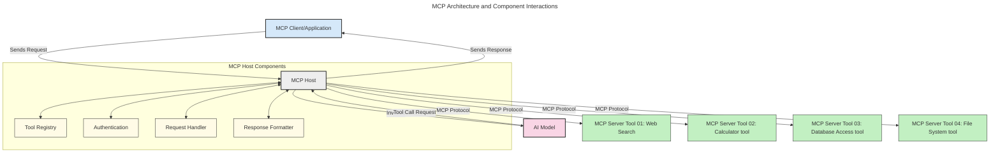
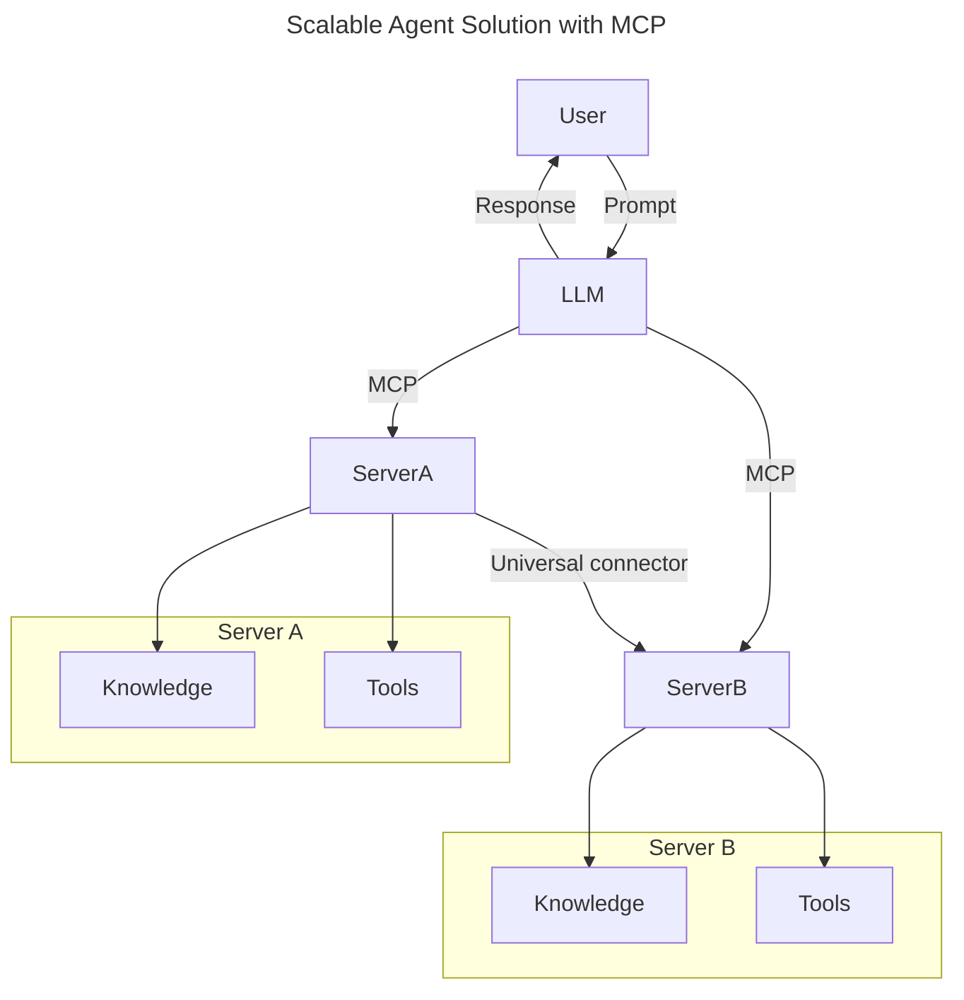
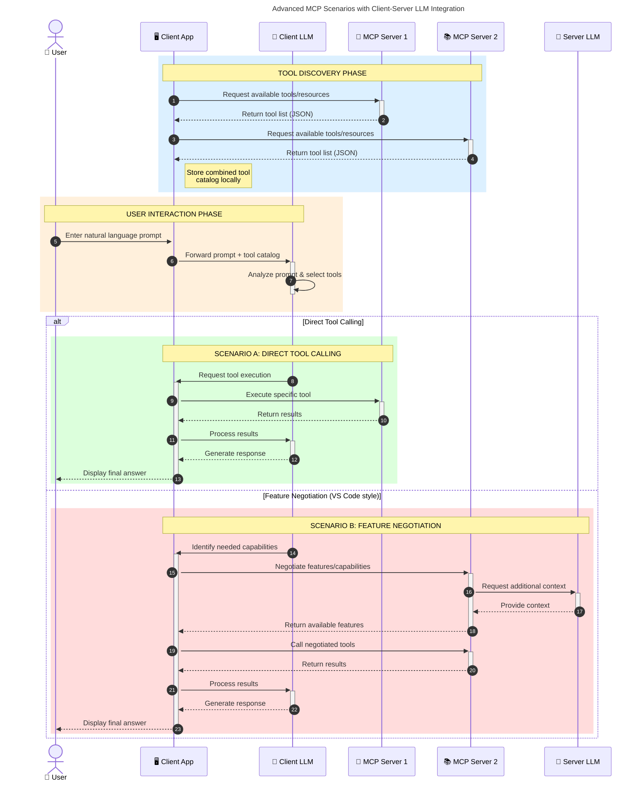

<!--
CO_OP_TRANSLATOR_METADATA:
{
  "original_hash": "9678e0c6945b8e0c23586869b0e26783",
  "translation_date": "2025-10-06T11:04:59+00:00",
  "source_file": "00-Introduction/README.md",
  "language_code": "nl"
}
-->
# Introductie tot Model Context Protocol (MCP): Waarom Het Belangrijk Is voor Schaalbare AI-toepassingen

_(Klik op de afbeelding hierboven om de video van deze les te bekijken)_

Generatieve AI-toepassingen zijn een grote stap vooruit, omdat ze gebruikers vaak in staat stellen om met de app te communiceren via natuurlijke taalprompts. Maar naarmate er meer tijd en middelen worden geïnvesteerd in dergelijke apps, wil je ervoor zorgen dat je functionaliteiten en bronnen gemakkelijk kunt integreren op een manier die uitbreidbaar is, dat je app meer dan één model kan ondersteunen en verschillende modelcomplexiteiten kan verwerken. Kortom, het bouwen van Gen AI-apps is eenvoudig om mee te beginnen, maar naarmate ze groeien en complexer worden, moet je een architectuur definiëren en waarschijnlijk vertrouwen op een standaard om ervoor te zorgen dat je apps op een consistente manier worden gebouwd. Hier komt MCP om de hoek kijken om zaken te organiseren en een standaard te bieden.

---

## **🔍 Wat Is het Model Context Protocol (MCP)?**

Het **Model Context Protocol (MCP)** is een **open, gestandaardiseerde interface** die grote taalmodellen (LLMs) naadloos laat samenwerken met externe tools, API's en gegevensbronnen. Het biedt een consistente architectuur om de functionaliteit van AI-modellen te verbeteren buiten hun trainingsdata, waardoor slimmere, schaalbare en responsievere AI-systemen mogelijk worden.

---

## **🎯 Waarom Standaardisatie in AI Belangrijk Is**

Naarmate generatieve AI-toepassingen complexer worden, is het essentieel om standaarden te adopteren die zorgen voor **schaalbaarheid, uitbreidbaarheid, onderhoudbaarheid** en **het vermijden van afhankelijkheid van één leverancier**. MCP speelt in op deze behoeften door:

- Het verenigen van model-tool integraties
- Het verminderen van kwetsbare, eenmalige maatwerkoplossingen
- Het mogelijk maken dat meerdere modellen van verschillende leveranciers binnen één ecosysteem kunnen bestaan

**Let op:** Hoewel MCP zichzelf presenteert als een open standaard, zijn er geen plannen om MCP te standaardiseren via bestaande standaardisatieorganisaties zoals IEEE, IETF, W3C, ISO of andere.

---

## **📚 Leerdoelen**

Aan het einde van dit artikel kun je:

- **Model Context Protocol (MCP)** definiëren en de toepassingsmogelijkheden ervan begrijpen
- Begrijpen hoe MCP model-tool communicatie standaardiseert
- De kerncomponenten van MCP-architectuur identificeren
- Verkennen hoe MCP wordt toegepast in zakelijke en ontwikkelingscontexten

---

## **💡 Waarom het Model Context Protocol (MCP) Een Doorbraak Is**

### **🔗 MCP Lost Fragmentatie in AI-interacties Op**

Voor MCP vereiste het integreren van modellen met tools:

- Maatwerkcode per tool-model combinatie
- Niet-standaard API's voor elke leverancier
- Regelmatige storingen door updates
- Slechte schaalbaarheid met meer tools

### **✅ Voordelen van MCP Standaardisatie**

| **Voordeel**              | **Beschrijving**                                                                |
|---------------------------|--------------------------------------------------------------------------------|
| Interoperabiliteit        | LLMs werken naadloos samen met tools van verschillende leveranciers            |
| Consistentie              | Uniform gedrag over platforms en tools                                         |
| Herbruikbaarheid          | Tools die eenmaal zijn gebouwd, kunnen worden gebruikt in meerdere projecten   |
| Versnelde Ontwikkeling    | Verminder ontwikkeltijd door gestandaardiseerde, plug-and-play interfaces       |

---

## **🧱 Overzicht van MCP Architectuur op Hoog Niveau**

MCP volgt een **client-server model**, waarbij:

- **MCP Hosts** de AI-modellen draaien
- **MCP Clients** verzoeken initiëren
- **MCP Servers** context, tools en mogelijkheden aanbieden

### **Belangrijke Componenten:**

- **Resources** – Statische of dynamische data voor modellen  
- **Prompts** – Vooraf gedefinieerde workflows voor begeleide generatie  
- **Tools** – Uitvoerbare functies zoals zoeken, berekeningen  
- **Sampling** – Agentisch gedrag via herhaalde interacties  

---

## Hoe MCP Servers Werken

MCP-servers werken als volgt:

- **Verzoekstroom**:
    1. Een verzoek wordt geïnitieerd door een eindgebruiker of software die namens hen handelt.
    2. De **MCP Client** stuurt het verzoek naar een **MCP Host**, die de AI Model runtime beheert.
    3. Het **AI Model** ontvangt de gebruikersprompt en kan toegang vragen tot externe tools of data via een of meer tooloproepen.
    4. De **MCP Host**, niet het model zelf, communiceert met de juiste **MCP Server(s)** via het gestandaardiseerde protocol.
- **MCP Host Functionaliteit**:
    - **Toolregister**: Beheert een catalogus van beschikbare tools en hun mogelijkheden.
    - **Authenticatie**: Verifieert permissies voor tooltoegang.
    - **Verzoekhandler**: Verwerkt inkomende toolverzoeken van het model.
    - **Responsformatter**: Structureert tooluitvoer in een formaat dat het model kan begrijpen.
- **MCP Server Uitvoering**:
    - De **MCP Host** leidt tooloproepen naar een of meer **MCP Servers**, die gespecialiseerde functies aanbieden (bijv. zoeken, berekeningen, databasequery's).
    - De **MCP Servers** voeren hun respectieve operaties uit en sturen resultaten terug naar de **MCP Host** in een consistent formaat.
    - De **MCP Host** formatteert en geeft deze resultaten door aan het **AI Model**.
- **Responsafronding**:
    - Het **AI Model** verwerkt de tooluitvoer in een definitieve respons.
    - De **MCP Host** stuurt deze respons terug naar de **MCP Client**, die deze levert aan de eindgebruiker of oproepende software.

## 👨‍💻 Hoe Bouw Je een MCP Server (Met Voorbeelden)

MCP-servers stellen je in staat om de mogelijkheden van LLMs uit te breiden door data en functionaliteit aan te bieden.

Klaar om het uit te proberen? Hier zijn taal- en/of stack-specifieke SDK's met voorbeelden van het maken van eenvoudige MCP-servers in verschillende talen/stacks:

- **Python SDK**: https://github.com/modelcontextprotocol/python-sdk

- **TypeScript SDK**: https://github.com/modelcontextprotocol/typescript-sdk

- **Java SDK**: https://github.com/modelcontextprotocol/java-sdk

- **C#/.NET SDK**: https://github.com/modelcontextprotocol/csharp-sdk

## 🌍 Praktijkvoorbeelden van MCP

MCP maakt een breed scala aan toepassingen mogelijk door AI-mogelijkheden uit te breiden:

| **Toepassing**              | **Beschrijving**                                                                |
|-----------------------------|--------------------------------------------------------------------------------|
| Integratie van Bedrijfsdata | Verbind LLMs met databases, CRM's of interne tools                              |
| Agentische AI-systemen      | Maak autonome agents mogelijk met tooltoegang en besluitvormingsworkflows       |
| Multimodale Toepassingen    | Combineer tekst-, beeld- en audiotools binnen één AI-app                        |
| Real-time Data Integratie   | Breng live data in AI-interacties voor nauwkeurigere, actuele outputs           |

### 🧠 MCP = Universele Standaard voor AI-interacties

Het Model Context Protocol (MCP) fungeert als een universele standaard voor AI-interacties, vergelijkbaar met hoe USB-C fysieke verbindingen voor apparaten heeft gestandaardiseerd. In de wereld van AI biedt MCP een consistente interface, waardoor modellen (clients) naadloos kunnen integreren met externe tools en dataproviders (servers). Dit elimineert de noodzaak voor diverse, aangepaste protocollen voor elke API of gegevensbron.

Onder MCP volgt een MCP-compatibele tool (een MCP-server genoemd) een uniforme standaard. Deze servers kunnen de tools of acties die ze aanbieden opsommen en die acties uitvoeren wanneer daarom wordt gevraagd door een AI-agent. AI-agentplatforms die MCP ondersteunen, kunnen beschikbare tools van de servers ontdekken en deze via dit standaardprotocol aanroepen.

### 💡 Vergemakkelijkt toegang tot kennis

Naast het aanbieden van tools, vergemakkelijkt MCP ook toegang tot kennis. Het stelt toepassingen in staat om context te bieden aan grote taalmodellen (LLMs) door ze te koppelen aan verschillende gegevensbronnen. Bijvoorbeeld, een MCP-server kan een documentrepository van een bedrijf vertegenwoordigen, waardoor agents relevante informatie op aanvraag kunnen ophalen. Een andere server kan specifieke acties afhandelen, zoals e-mails verzenden of records bijwerken. Vanuit het perspectief van de agent zijn dit gewoon tools die het kan gebruiken—sommige tools leveren data (kenniscontext), terwijl andere acties uitvoeren. MCP beheert beide efficiënt.

Een agent die verbinding maakt met een MCP-server leert automatisch de beschikbare mogelijkheden en toegankelijke data van de server via een standaardformaat. Deze standaardisatie maakt dynamische toolbeschikbaarheid mogelijk. Bijvoorbeeld, het toevoegen van een nieuwe MCP-server aan het systeem van een agent maakt de functies ervan onmiddellijk bruikbaar zonder verdere aanpassing van de instructies van de agent.

Deze gestroomlijnde integratie sluit aan bij de stroom die wordt weergegeven in het volgende diagram, waar servers zowel tools als kennis bieden, wat zorgt voor naadloze samenwerking tussen systemen.

### 👉 Voorbeeld: Schaalbare Agentoplossing

De Universele Connector stelt MCP-servers in staat om met elkaar te communiceren en mogelijkheden te delen, waardoor ServerA taken kan delegeren aan ServerB of toegang kan krijgen tot diens tools en kennis. Dit federatieve systeem van tools en data ondersteunt schaalbare en modulaire agentarchitecturen. Omdat MCP toolblootstelling standaardiseert, kunnen agents dynamisch tools ontdekken en verzoeken tussen servers routeren zonder hardcoded integraties.

Tool- en kennisfederatie: Tools en data kunnen worden gedeeld tussen servers, wat schaalbare en modulaire agentische architecturen mogelijk maakt.

### 🔄 Geavanceerde MCP-scenario's met Client-side LLM-integratie

Naast de basisarchitectuur van MCP zijn er geavanceerde scenario's waarbij zowel de client als de server LLMs bevatten, wat meer verfijnde interacties mogelijk maakt. In het volgende diagram kan de **Client App** een IDE zijn met een aantal MCP-tools beschikbaar voor gebruik door de LLM:

## 🔐 Praktische Voordelen van MCP

Hier zijn de praktische voordelen van het gebruik van MCP:

- **Actualiteit**: Modellen kunnen toegang krijgen tot actuele informatie buiten hun trainingsdata
- **Uitbreiding van Mogelijkheden**: Modellen kunnen gespecialiseerde tools gebruiken voor taken waarvoor ze niet zijn getraind
- **Minder Hallucinaties**: Externe gegevensbronnen bieden feitelijke onderbouwing
- **Privacy**: Gevoelige gegevens kunnen binnen veilige omgevingen blijven in plaats van in prompts te worden opgenomen

## 📌 Belangrijkste Punten

De volgende punten zijn belangrijk bij het gebruik van MCP:

- **MCP** standaardiseert hoe AI-modellen met tools en data communiceren
- Bevordert **uitbreidbaarheid, consistentie en interoperabiliteit**
- MCP helpt **ontwikkeltijd te verminderen, betrouwbaarheid te verbeteren en modelmogelijkheden uit te breiden**
- De client-server architectuur **maakt flexibele, uitbreidbare AI-toepassingen mogelijk**

## 🧠 Oefening

Denk na over een AI-toepassing die je wilt bouwen.

- Welke **externe tools of data** zouden de mogelijkheden ervan kunnen verbeteren?
- Hoe zou MCP integratie **eenvoudiger en betrouwbaarder** kunnen maken?

## Aanvullende Bronnen

- [MCP GitHub Repository](https://github.com/modelcontextprotocol)

## Wat komt hierna

Volgende: [Hoofdstuk 1: Kernconcepten](../01-CoreConcepts/README.md)

---

**Disclaimer**:  
Dit document is vertaald met behulp van de AI-vertalingsservice [Co-op Translator](https://github.com/Azure/co-op-translator). Hoewel we streven naar nauwkeurigheid, dient u zich ervan bewust te zijn dat geautomatiseerde vertalingen fouten of onnauwkeurigheden kunnen bevatten. Het originele document in de oorspronkelijke taal moet worden beschouwd als de gezaghebbende bron. Voor cruciale informatie wordt professionele menselijke vertaling aanbevolen. Wij zijn niet aansprakelijk voor eventuele misverstanden of verkeerde interpretaties die voortvloeien uit het gebruik van deze vertaling.