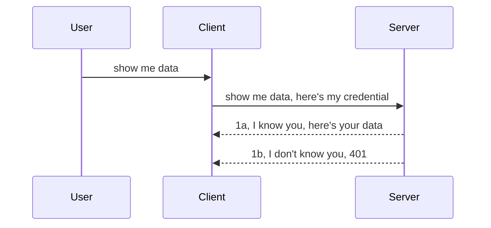

<!--
CO_OP_TRANSLATOR_METADATA:
{
  "original_hash": "5b00b8a8971a07d2d8803be4c9f138f8",
  "translation_date": "2025-10-07T00:55:20+00:00",
  "source_file": "03-GettingStarted/11-simple-auth/README.md",
  "language_code": "nl"
}
-->
# Eenvoudige authenticatie

MCP SDK's ondersteunen het gebruik van OAuth 2.1, wat eerlijk gezegd een behoorlijk ingewikkeld proces is met concepten zoals een authenticatieserver, een resource server, het posten van inloggegevens, het verkrijgen van een code, het inwisselen van de code voor een bearer-token totdat je uiteindelijk toegang krijgt tot je resourcegegevens. Als je niet bekend bent met OAuth, wat een geweldige implementatie is, is het een goed idee om te beginnen met een basisniveau van authenticatie en dit op te bouwen naar steeds betere beveiliging. Daarom bestaat dit hoofdstuk: om je op te bouwen naar meer geavanceerde authenticatie.

## Auth, wat bedoelen we?

Auth is een afkorting van authenticatie en autorisatie. Het idee is dat we twee dingen moeten doen:

- **Authenticatie**, het proces waarbij we bepalen of we iemand toegang geven tot ons huis, of ze het recht hebben om "hier" te zijn, dat wil zeggen toegang hebben tot onze resource server waar onze MCP Server-functies zich bevinden.
- **Autorisatie**, het proces waarbij we bepalen of een gebruiker toegang mag hebben tot de specifieke resources die ze opvragen, bijvoorbeeld bepaalde bestellingen of producten, of dat ze bijvoorbeeld alleen de inhoud mogen lezen maar niet mogen verwijderen.

## Inloggegevens: hoe we het systeem vertellen wie we zijn

De meeste webontwikkelaars denken in termen van het verstrekken van inloggegevens aan de server, meestal een geheim dat aangeeft of ze hier mogen zijn ("Authenticatie"). Deze inloggegevens zijn meestal een base64-gecodeerde versie van een gebruikersnaam en wachtwoord of een API-sleutel die een specifieke gebruiker uniek identificeert.

Dit wordt verzonden via een header genaamd "Authorization", zoals hieronder:

```json
{ "Authorization": "secret123" }
```

Dit wordt meestal aangeduid als basisauthenticatie. Het algemene proces werkt dan als volgt:



Nu we begrijpen hoe het werkt vanuit een procesperspectief, hoe implementeren we het? De meeste webservers hebben een concept genaamd middleware, een stukje code dat wordt uitgevoerd als onderdeel van het verzoek en inloggegevens kan verifiëren. Als de inloggegevens geldig zijn, kan het verzoek doorgaan. Als het verzoek geen geldige inloggegevens bevat, krijg je een authenticatiefout. Laten we eens kijken hoe dit kan worden geïmplementeerd:

**Python**

```python
class AuthMiddleware(BaseHTTPMiddleware):
    async def dispatch(self, request, call_next):

        has_header = request.headers.get("Authorization")
        if not has_header:
            print("-> Missing Authorization header!")
            return Response(status_code=401, content="Unauthorized")

        if not valid_token(has_header):
            print("-> Invalid token!")
            return Response(status_code=403, content="Forbidden")

        print("Valid token, proceeding...")
       
        response = await call_next(request)
        # add any customer headers or change in the response in some way
        return response


starlette_app.add_middleware(CustomHeaderMiddleware)
```

Hier hebben we:

- Een middleware genaamd `AuthMiddleware` gemaakt, waarvan de `dispatch`-methode wordt aangeroepen door de webserver.
- De middleware toegevoegd aan de webserver:

    ```python
    starlette_app.add_middleware(AuthMiddleware)
    ```

- Validatielogica geschreven die controleert of de Authorization-header aanwezig is en of het verzonden geheim geldig is:

    ```python
    has_header = request.headers.get("Authorization")
    if not has_header:
        print("-> Missing Authorization header!")
        return Response(status_code=401, content="Unauthorized")

    if not valid_token(has_header):
        print("-> Invalid token!")
        return Response(status_code=403, content="Forbidden")
    ```

    Als het geheim aanwezig en geldig is, laten we het verzoek doorgaan door `call_next` aan te roepen en de respons terug te geven.

    ```python
    response = await call_next(request)
    # add any customer headers or change in the response in some way
    return response
    ```

Hoe het werkt is dat als een webverzoek naar de server wordt gedaan, de middleware wordt aangeroepen en op basis van de implementatie het verzoek doorgaat of een fout retourneert die aangeeft dat de client niet mag doorgaan.

**TypeScript**

Hier maken we een middleware met het populaire framework Express en onderscheppen we het verzoek voordat het de MCP Server bereikt. Hier is de code daarvoor:

```typescript
function isValid(secret) {
    return secret === "secret123";
}

app.use((req, res, next) => {
    // 1. Authorization header present?  
    if(!req.headers["Authorization"]) {
        res.status(401).send('Unauthorized');
    }
    
    let token = req.headers["Authorization"];

    // 2. Check validity.
    if(!isValid(token)) {
        res.status(403).send('Forbidden');
    }

   
    console.log('Middleware executed');
    // 3. Passes request to the next step in the request pipeline.
    next();
});
```

In deze code:

1. Controleren we of de Authorization-header überhaupt aanwezig is; zo niet, dan sturen we een 401-fout.
2. Controleren we of de inloggegevens/token geldig zijn; zo niet, dan sturen we een 403-fout.
3. Laten we het verzoek uiteindelijk doorgaan in de verzoekpipeline en retourneren we de gevraagde resource.

## Oefening: Implementeren van authenticatie

Laten we onze kennis gebruiken en proberen dit te implementeren. Hier is het plan:

Server

- Maak een webserver en MCP-instantie.
- Implementeer een middleware voor de server.

Client 

- Stuur een webverzoek met inloggegevens via een header.

### -1- Maak een webserver en MCP-instantie

In onze eerste stap moeten we de webserverinstantie en de MCP Server maken.

**Python**

Hier maken we een MCP-serverinstantie, maken we een Starlette-webapp en hosten we deze met uvicorn.

```python
# creating MCP Server

app = FastMCP(
    name="MCP Resource Server",
    instructions="Resource Server that validates tokens via Authorization Server introspection",
    host=settings["host"],
    port=settings["port"],
    debug=True
)

# creating starlette web app
starlette_app = app.streamable_http_app()

# serving app via uvicorn
async def run(starlette_app):
    import uvicorn
    config = uvicorn.Config(
            starlette_app,
            host=app.settings.host,
            port=app.settings.port,
            log_level=app.settings.log_level.lower(),
        )
    server = uvicorn.Server(config)
    await server.serve()

run(starlette_app)
```

In deze code:

- Maken we de MCP Server.
- Construeren we de Starlette-webapp vanuit de MCP Server, `app.streamable_http_app()`.
- Hosten en serveren we de webapp met uvicorn `server.serve()`.

**TypeScript**

Hier maken we een MCP Server-instantie.

```typescript
const server = new McpServer({
      name: "example-server",
      version: "1.0.0"
    });

    // ... set up server resources, tools, and prompts ...
```

Deze MCP Server-creatie moet plaatsvinden binnen onze POST /mcp route-definitie, dus laten we de bovenstaande code verplaatsen zoals hieronder:

```typescript
import express from "express";
import { randomUUID } from "node:crypto";
import { McpServer } from "@modelcontextprotocol/sdk/server/mcp.js";
import { StreamableHTTPServerTransport } from "@modelcontextprotocol/sdk/server/streamableHttp.js";
import { isInitializeRequest } from "@modelcontextprotocol/sdk/types.js"

const app = express();
app.use(express.json());

// Map to store transports by session ID
const transports: { [sessionId: string]: StreamableHTTPServerTransport } = {};

// Handle POST requests for client-to-server communication
app.post('/mcp', async (req, res) => {
  // Check for existing session ID
  const sessionId = req.headers['mcp-session-id'] as string | undefined;
  let transport: StreamableHTTPServerTransport;

  if (sessionId && transports[sessionId]) {
    // Reuse existing transport
    transport = transports[sessionId];
  } else if (!sessionId && isInitializeRequest(req.body)) {
    // New initialization request
    transport = new StreamableHTTPServerTransport({
      sessionIdGenerator: () => randomUUID(),
      onsessioninitialized: (sessionId) => {
        // Store the transport by session ID
        transports[sessionId] = transport;
      },
      // DNS rebinding protection is disabled by default for backwards compatibility. If you are running this server
      // locally, make sure to set:
      // enableDnsRebindingProtection: true,
      // allowedHosts: ['127.0.0.1'],
    });

    // Clean up transport when closed
    transport.onclose = () => {
      if (transport.sessionId) {
        delete transports[transport.sessionId];
      }
    };
    const server = new McpServer({
      name: "example-server",
      version: "1.0.0"
    });

    // ... set up server resources, tools, and prompts ...

    // Connect to the MCP server
    await server.connect(transport);
  } else {
    // Invalid request
    res.status(400).json({
      jsonrpc: '2.0',
      error: {
        code: -32000,
        message: 'Bad Request: No valid session ID provided',
      },
      id: null,
    });
    return;
  }

  // Handle the request
  await transport.handleRequest(req, res, req.body);
});

// Reusable handler for GET and DELETE requests
const handleSessionRequest = async (req: express.Request, res: express.Response) => {
  const sessionId = req.headers['mcp-session-id'] as string | undefined;
  if (!sessionId || !transports[sessionId]) {
    res.status(400).send('Invalid or missing session ID');
    return;
  }
  
  const transport = transports[sessionId];
  await transport.handleRequest(req, res);
};

// Handle GET requests for server-to-client notifications via SSE
app.get('/mcp', handleSessionRequest);

// Handle DELETE requests for session termination
app.delete('/mcp', handleSessionRequest);

app.listen(3000);
```

Nu zie je hoe de MCP Server-creatie is verplaatst binnen `app.post("/mcp")`.

Laten we doorgaan naar de volgende stap: het maken van de middleware zodat we de binnenkomende inloggegevens kunnen valideren.

### -2- Implementeer een middleware voor de server

Laten we verder gaan met het middleware-gedeelte. Hier maken we een middleware die zoekt naar inloggegevens in de `Authorization`-header en deze valideert. Als deze acceptabel is, gaat het verzoek verder met wat het moet doen (bijvoorbeeld tools opsommen, een resource lezen of welke MCP-functionaliteit de client ook vraagt).

**Python**

Om de middleware te maken, moeten we een klasse maken die erft van `BaseHTTPMiddleware`. Er zijn twee interessante onderdelen:

- Het verzoek `request`, waarvan we de headerinformatie lezen.
- `call_next`, de callback die we moeten aanroepen als de client inloggegevens heeft die we accepteren.

Eerst moeten we de situatie afhandelen waarin de `Authorization`-header ontbreekt:

```python
has_header = request.headers.get("Authorization")

# no header present, fail with 401, otherwise move on.
if not has_header:
    print("-> Missing Authorization header!")
    return Response(status_code=401, content="Unauthorized")
```

Hier sturen we een 401 Unauthorized-bericht omdat de client faalt in authenticatie.

Vervolgens, als er inloggegevens zijn ingediend, moeten we de geldigheid ervan controleren zoals hieronder:

```python
 if not valid_token(has_header):
    print("-> Invalid token!")
    return Response(status_code=403, content="Forbidden")
```

Let op hoe we hierboven een 403 Forbidden-bericht sturen. Hier is de volledige middleware die alles implementeert wat we hierboven hebben genoemd:

```python
class AuthMiddleware(BaseHTTPMiddleware):
    async def dispatch(self, request, call_next):

        has_header = request.headers.get("Authorization")
        if not has_header:
            print("-> Missing Authorization header!")
            return Response(status_code=401, content="Unauthorized")

        if not valid_token(has_header):
            print("-> Invalid token!")
            return Response(status_code=403, content="Forbidden")

        print("Valid token, proceeding...")
        print(f"-> Received {request.method} {request.url}")
        response = await call_next(request)
        response.headers['Custom'] = 'Example'
        return response

```

Geweldig, maar hoe zit het met de `valid_token`-functie? Hier is deze hieronder:

```python
# DON'T use for production - improve it !!
def valid_token(token: str) -> bool:
    # remove the "Bearer " prefix
    if token.startswith("Bearer "):
        token = token[7:]
        return token == "secret-token"
    return False
```

Dit moet uiteraard worden verbeterd.

BELANGRIJK: Je moet NOOIT geheimen zoals deze in de code hebben. Je moet idealiter de waarde ophalen om mee te vergelijken vanuit een gegevensbron of van een IDP (identity service provider) of beter nog, de IDP de validatie laten uitvoeren.

**TypeScript**

Om dit te implementeren met Express, moeten we de `use`-methode aanroepen die middleware-functies accepteert.

We moeten:

- Interageren met de request-variabele om de doorgegeven inloggegevens in de `Authorization`-eigenschap te controleren.
- De inloggegevens valideren, en als ze geldig zijn, het verzoek laten doorgaan zodat de MCP-aanvraag van de client kan doen wat het moet doen (bijvoorbeeld tools opsommen, een resource lezen of iets anders MCP-gerelateerd).

Hier controleren we of de `Authorization`-header aanwezig is, en zo niet, stoppen we het verzoek:

```typescript
if(!req.headers["authorization"]) {
    res.status(401).send('Unauthorized');
    return;
}
```

Als de header niet wordt verzonden, ontvang je een 401.

Vervolgens controleren we of de inloggegevens geldig zijn, en zo niet, stoppen we het verzoek opnieuw maar met een iets andere boodschap:

```typescript
if(!isValid(token)) {
    res.status(403).send('Forbidden');
    return;
} 
```

Let op hoe je nu een 403-fout krijgt.

Hier is de volledige code:

```typescript
app.use((req, res, next) => {
    console.log('Request received:', req.method, req.url, req.headers);
    console.log('Headers:', req.headers["authorization"]);
    if(!req.headers["authorization"]) {
        res.status(401).send('Unauthorized');
        return;
    }
    
    let token = req.headers["authorization"];

    if(!isValid(token)) {
        res.status(403).send('Forbidden');
        return;
    }  

    console.log('Middleware executed');
    next();
});
```

We hebben de webserver ingesteld om een middleware te accepteren die de inloggegevens controleert die de client hopelijk naar ons stuurt. Hoe zit het met de client zelf?

### -3- Stuur een webverzoek met inloggegevens via een header

We moeten ervoor zorgen dat de client de inloggegevens via de header doorgeeft. Omdat we een MCP-client gaan gebruiken, moeten we uitzoeken hoe dat wordt gedaan.

**Python**

Voor de client moeten we een header met onze inloggegevens doorgeven zoals hieronder:

```python
# DON'T hardcode the value, have it at minimum in an environment variable or a more secure storage
token = "secret-token"

async with streamablehttp_client(
        url = f"http://localhost:{port}/mcp",
        headers = {"Authorization": f"Bearer {token}"}
    ) as (
        read_stream,
        write_stream,
        session_callback,
    ):
        async with ClientSession(
            read_stream,
            write_stream
        ) as session:
            await session.initialize()
      
            # TODO, what you want done in the client, e.g list tools, call tools etc.
```

Let op hoe we de eigenschap `headers` vullen zoals `headers = {"Authorization": f"Bearer {token}"}`.

**TypeScript**

We kunnen dit in twee stappen oplossen:

1. Een configuratieobject vullen met onze inloggegevens.
2. Het configuratieobject doorgeven aan de transport.

```typescript

// DON'T hardcode the value like shown here. At minimum have it as a env variable and use something like dotenv (in dev mode).
let token = "secret123"

// define a client transport option object
let options: StreamableHTTPClientTransportOptions = {
  sessionId: sessionId,
  requestInit: {
    headers: {
      "Authorization": "secret123"
    }
  }
};

// pass the options object to the transport
async function main() {
   const transport = new StreamableHTTPClientTransport(
      new URL(serverUrl),
      options
   );
```

Hier zie je hierboven hoe we een `options`-object moesten maken en onze headers onder de `requestInit`-eigenschap moesten plaatsen.

BELANGRIJK: Hoe kunnen we dit vanaf hier verbeteren? Nou, de huidige implementatie heeft enkele problemen. Ten eerste, het doorgeven van inloggegevens zoals deze is behoorlijk riskant, tenzij je minimaal HTTPS hebt. Zelfs dan kunnen de inloggegevens worden gestolen, dus je hebt een systeem nodig waarin je gemakkelijk het token kunt intrekken en extra controles kunt toevoegen, zoals waar ter wereld het vandaan komt, of het verzoek veel te vaak gebeurt (botachtig gedrag). Kortom, er zijn een hele reeks zorgen.

Het moet echter gezegd worden dat voor zeer eenvoudige API's waarbij je niet wilt dat iemand je API aanroept zonder geauthenticeerd te zijn, wat we hier hebben een goed begin is.

Dat gezegd hebbende, laten we proberen de beveiliging een beetje te versterken door een gestandaardiseerd formaat zoals JSON Web Token, ook wel JWT of "JOT"-tokens genoemd, te gebruiken.

## JSON Web Tokens, JWT

Dus, we proberen dingen te verbeteren door zeer eenvoudige inloggegevens te verzenden. Wat zijn de directe verbeteringen die we krijgen door JWT te adopteren?

- **Beveiligingsverbeteringen**. Bij basisauthenticatie stuur je de gebruikersnaam en het wachtwoord als een base64-gecodeerd token (of je stuurt een API-sleutel) keer op keer, wat het risico vergroot. Met JWT stuur je je gebruikersnaam en wachtwoord en krijg je een token terug dat ook tijdgebonden is, wat betekent dat het zal verlopen. JWT maakt het gemakkelijk om fijnmazige toegangscontrole te gebruiken met rollen, scopes en permissies.
- **Statelessness en schaalbaarheid**. JWT's zijn zelfvoorzienend, ze bevatten alle gebruikersinformatie en elimineren de noodzaak om server-side sessieopslag te gebruiken. Tokens kunnen ook lokaal worden gevalideerd.
- **Interoperabiliteit en federatie**. JWT's zijn centraal in Open ID Connect en worden gebruikt met bekende identity providers zoals Entra ID, Google Identity en Auth0. Ze maken ook single sign-on mogelijk en nog veel meer, waardoor ze geschikt zijn voor ondernemingen.
- **Modulariteit en flexibiliteit**. JWT's kunnen ook worden gebruikt met API Gateways zoals Azure API Management, NGINX en meer. Ze ondersteunen ook authenticatiescenario's en server-naar-server communicatie, inclusief scenario's voor impersonatie en delegatie.
- **Prestaties en caching**. JWT's kunnen worden gecached na decodering, wat de noodzaak voor parsing vermindert. Dit helpt specifiek bij apps met veel verkeer, omdat het de doorvoer verbetert en de belasting op je gekozen infrastructuur vermindert.
- **Geavanceerde functies**. Ze ondersteunen ook introspectie (controle van geldigheid op de server) en intrekking (een token ongeldig maken).

Met al deze voordelen, laten we eens kijken hoe we onze implementatie naar een hoger niveau kunnen tillen.

## Basisauthenticatie omzetten naar JWT

Dus, de veranderingen die we op hoog niveau moeten maken zijn:

- **Leer een JWT-token te construeren** en maak het klaar om van client naar server te worden verzonden.
- **Valideer een JWT-token**, en als het geldig is, laat de client onze resources gebruiken.
- **Beveiligde tokenopslag**. Hoe we dit token opslaan.
- **Bescherm de routes**. We moeten de routes beschermen, in ons geval moeten we routes en specifieke MCP-functies beschermen.
- **Voeg refresh tokens toe**. Zorg ervoor dat we tokens maken die kortdurend zijn, maar refresh tokens die langdurend zijn en kunnen worden gebruikt om nieuwe tokens te verkrijgen als ze verlopen. Zorg ook voor een refresh-endpoint en een rotatiestrategie.

### -1- Een JWT-token construeren

Eerst heeft een JWT-token de volgende onderdelen:

- **Header**, algoritme dat wordt gebruikt en het type token.
- **Payload**, claims, zoals sub (de gebruiker of entiteit die het token vertegenwoordigt. In een authenticatiescenario is dit meestal de gebruikers-ID), exp (wanneer het verloopt), rol (de rol).
- **Handtekening**, ondertekend met een geheim of privésleutel.

Hiervoor moeten we de header, payload en het gecodeerde token construeren.

**Python**

```python

import jwt
import jwt
from jwt.exceptions import ExpiredSignatureError, InvalidTokenError
import datetime

# Secret key used to sign the JWT
secret_key = 'your-secret-key'

header = {
    "alg": "HS256",
    "typ": "JWT"
}

# the user info andits claims and expiry time
payload = {
    "sub": "1234567890",               # Subject (user ID)
    "name": "User Userson",                # Custom claim
    "admin": True,                     # Custom claim
    "iat": datetime.datetime.utcnow(),# Issued at
    "exp": datetime.datetime.utcnow() + datetime.timedelta(hours=1)  # Expiry
}

# encode it
encoded_jwt = jwt.encode(payload, secret_key, algorithm="HS256", headers=header)
```

In de bovenstaande code hebben we:

- Een header gedefinieerd met HS256 als algoritme en type ingesteld op JWT.
- Een payload geconstrueerd die een subject of gebruikers-ID bevat, een gebruikersnaam, een rol, wanneer het is uitgegeven en wanneer het verloopt, waarmee we het tijdgebonden aspect implementeren dat we eerder hebben genoemd.

**TypeScript**

Hier hebben we enkele afhankelijkheden nodig die ons zullen helpen het JWT-token te construeren.

Afhankelijkheden

```sh

npm install jsonwebtoken
npm install --save-dev @types/jsonwebtoken
```

Nu we dat hebben ingesteld, laten we de header, payload en via die weg het gecodeerde token maken.

```typescript
import jwt from 'jsonwebtoken';

const secretKey = 'your-secret-key'; // Use env vars in production

// Define the payload
const payload = {
  sub: '1234567890',
  name: 'User usersson',
  admin: true,
  iat: Math.floor(Date.now() / 1000), // Issued at
  exp: Math.floor(Date.now() / 1000) + 60 * 60 // Expires in 1 hour
};

// Define the header (optional, jsonwebtoken sets defaults)
const header = {
  alg: 'HS256',
  typ: 'JWT'
};

// Create the token
const token = jwt.sign(payload, secretKey, {
  algorithm: 'HS256',
  header: header
});

console.log('JWT:', token);
```

Dit token is:

Ondertekend met HS256  
Geldig voor 1 uur  
Bevat claims zoals sub, naam, admin, iat en exp.

### -2- Een token valideren

We moeten ook een token valideren, dit moeten we op de server doen om ervoor te zorgen dat wat de client ons stuurt daadwerkelijk geldig is. Er zijn veel controles die we hier moeten uitvoeren, van het valideren van de structuur tot de geldigheid ervan. Je wordt ook aangemoedigd om andere controles toe te voegen, zoals controleren of de gebruiker in je systeem zit en meer.

Om een token te valideren, moeten we het decoderen zodat we het kunnen lezen en vervolgens beginnen met het controleren van de geldigheid ervan:

**Python**

```python

# Decode and verify the JWT
try:
    decoded = jwt.decode(token, secret_key, algorithms=["HS256"])
    print("✅ Token is valid.")
    print("Decoded claims:")
    for key, value in decoded.items():
        print(f"  {key}: {value}")
except ExpiredSignatureError:
    print("❌ Token has expired.")
except InvalidTokenError as e:
    print(f"❌ Invalid token: {e}")

```

In deze code roepen we `jwt.decode` aan met het token, de geheime sleutel en het gekozen algoritme als invoer. Let op hoe we een try-catch-construct gebruiken, omdat een mislukte validatie leidt tot een fout.

**TypeScript**

Hier moeten we `jwt.verify` aanroepen om een gedecodeerde versie van het token te krijgen die we verder kunnen analyseren. Als deze oproep faalt, betekent dit dat de structuur van het token onjuist is of dat het niet langer geldig is.

```typescript

try {
  const decoded = jwt.verify(token, secretKey);
  console.log('Decoded Payload:', decoded);
} catch (err) {
  console.error('Token verification failed:', err);
}
```

OPMERKING: zoals eerder vermeld, moeten we aanvullende controles uitvoeren om ervoor te zorgen dat dit token wijst naar een gebruiker in ons systeem en ervoor zorgen dat de gebruiker de rechten heeft die het claimt te hebben.
Laten we vervolgens kijken naar rolgebaseerde toegangscontrole, ook wel RBAC genoemd.

## Rolgebaseerde toegangscontrole toevoegen

Het idee is dat we willen aangeven dat verschillende rollen verschillende rechten hebben. Bijvoorbeeld, we gaan ervan uit dat een beheerder alles kan doen, dat normale gebruikers kunnen lezen en schrijven, en dat een gast alleen kan lezen. Hier zijn enkele mogelijke toestemmingsniveaus:

- Admin.Write 
- User.Read
- Guest.Read

Laten we eens kijken hoe we dergelijke controle kunnen implementeren met middleware. Middleware kan per route worden toegevoegd, maar ook voor alle routes.

**Python**

```python
from starlette.middleware.base import BaseHTTPMiddleware
from starlette.responses import JSONResponse
import jwt

# DON'T have the secret in the code like, this is for demonstration purposes only. Read it from a safe place.
SECRET_KEY = "your-secret-key" # put this in env variable
REQUIRED_PERMISSION = "User.Read"

class JWTPermissionMiddleware(BaseHTTPMiddleware):
    async def dispatch(self, request, call_next):
        auth_header = request.headers.get("Authorization")
        if not auth_header or not auth_header.startswith("Bearer "):
            return JSONResponse({"error": "Missing or invalid Authorization header"}, status_code=401)

        token = auth_header.split(" ")[1]
        try:
            decoded = jwt.decode(token, SECRET_KEY, algorithms=["HS256"])
        except jwt.ExpiredSignatureError:
            return JSONResponse({"error": "Token expired"}, status_code=401)
        except jwt.InvalidTokenError:
            return JSONResponse({"error": "Invalid token"}, status_code=401)

        permissions = decoded.get("permissions", [])
        if REQUIRED_PERMISSION not in permissions:
            return JSONResponse({"error": "Permission denied"}, status_code=403)

        request.state.user = decoded
        return await call_next(request)


```

Er zijn een paar verschillende manieren om de middleware toe te voegen, zoals hieronder:

```python

# Alt 1: add middleware while constructing starlette app
middleware = [
    Middleware(JWTPermissionMiddleware)
]

app = Starlette(routes=routes, middleware=middleware)

# Alt 2: add middleware after starlette app is a already constructed
starlette_app.add_middleware(JWTPermissionMiddleware)

# Alt 3: add middleware per route
routes = [
    Route(
        "/mcp",
        endpoint=..., # handler
        middleware=[Middleware(JWTPermissionMiddleware)]
    )
]
```

**TypeScript**

We kunnen `app.use` gebruiken en een middleware die voor alle verzoeken wordt uitgevoerd.

```typescript
app.use((req, res, next) => {
    console.log('Request received:', req.method, req.url, req.headers);
    console.log('Headers:', req.headers["authorization"]);

    // 1. Check if authorization header has been sent

    if(!req.headers["authorization"]) {
        res.status(401).send('Unauthorized');
        return;
    }
    
    let token = req.headers["authorization"];

    // 2. Check if token is valid
    if(!isValid(token)) {
        res.status(403).send('Forbidden');
        return;
    }  

    // 3. Check if token user exist in our system
    if(!isExistingUser(token)) {
        res.status(403).send('Forbidden');
        console.log("User does not exist");
        return;
    }
    console.log("User exists");

    // 4. Verify the token has the right permissions
    if(!hasScopes(token, ["User.Read"])){
        res.status(403).send('Forbidden - insufficient scopes');
    }

    console.log("User has required scopes");

    console.log('Middleware executed');
    next();
});

```

Er zijn een aantal dingen die we onze middleware kunnen laten doen en die onze middleware MOET doen, namelijk:

1. Controleren of de autorisatieheader aanwezig is.
2. Controleren of de token geldig is; we roepen `isValid` aan, een methode die we hebben geschreven om de integriteit en geldigheid van de JWT-token te controleren.
3. Verifiëren dat de gebruiker in ons systeem bestaat; dit moeten we controleren.

   ```typescript
    // users in DB
   const users = [
     "user1",
     "User usersson",
   ]

   function isExistingUser(token) {
     let decodedToken = verifyToken(token);

     // TODO, check if user exists in DB
     return users.includes(decodedToken?.name || "");
   }
   ```

   Hierboven hebben we een zeer eenvoudige `users`-lijst gemaakt, die uiteraard in een database zou moeten staan.

4. Daarnaast moeten we ook controleren of de token de juiste rechten bevat.

   ```typescript
   if(!hasScopes(token, ["User.Read"])){
        res.status(403).send('Forbidden - insufficient scopes');
   }
   ```

   In de bovenstaande code van de middleware controleren we of de token de User.Read-rechten bevat; zo niet, dan sturen we een 403-fout. Hieronder staat de `hasScopes`-hulpmethode.

   ```typescript
   function hasScopes(scope: string, requiredScopes: string[]) {
     let decodedToken = verifyToken(scope);
    return requiredScopes.every(scope => decodedToken?.scopes.includes(scope));
  }
   ```

Have a think which additional checks you should be doing, but these are the absolute minimum of checks you should be doing.

Using Express as a web framework is a common choice. There are helpers library when you use JWT so you can write less code.

- `express-jwt`, helper library that provides a middleware that helps decode your token.
- `express-jwt-permissions`, this provides a middleware `guard` that helps check if a certain permission is on the token.

Here's what these libraries can look like when used:

```typescript
const express = require('express');
const jwt = require('express-jwt');
const guard = require('express-jwt-permissions')();

const app = express();
const secretKey = 'your-secret-key'; // put this in env variable

// Decode JWT and attach to req.user
app.use(jwt({ secret: secretKey, algorithms: ['HS256'] }));

// Check for User.Read permission
app.use(guard.check('User.Read'));

// multiple permissions
// app.use(guard.check(['User.Read', 'Admin.Access']));

app.get('/protected', (req, res) => {
  res.json({ message: `Welcome ${req.user.name}` });
});

// Error handler
app.use((err, req, res, next) => {
  if (err.code === 'permission_denied') {
    return res.status(403).send('Forbidden');
  }
  next(err);
});

```

Nu je hebt gezien hoe middleware kan worden gebruikt voor zowel authenticatie als autorisatie, hoe zit het dan met MCP? Verandert dat hoe we authenticatie doen? Laten we dat in het volgende gedeelte ontdekken.

### -3- RBAC toevoegen aan MCP

Je hebt tot nu toe gezien hoe je RBAC kunt toevoegen via middleware, maar voor MCP is er geen eenvoudige manier om RBAC per MCP-functie toe te voegen. Dus wat doen we? Nou, we moeten gewoon code toevoegen zoals deze, die in dit geval controleert of de client de rechten heeft om een specifieke tool aan te roepen:

Je hebt een paar verschillende keuzes om RBAC per functie te implementeren, hier zijn enkele opties:

- Voeg een controle toe voor elke tool, bron of prompt waar je het toestemmingsniveau moet controleren.

   **Python**

   ```python
   @tool()
   def delete_product(id: int):
      try:
          check_permissions(role="Admin.Write", request)
      catch:
        pass # client failed authorization, raise authorization error
   ```

   **TypeScript**

   ```typescript
   server.registerTool(
    "delete-product",
    {
      title: Delete a product",
      description: "Deletes a product",
      inputSchema: { id: z.number() }
    },
    async ({ id }) => {
      
      try {
        checkPermissions("Admin.Write", request);
        // todo, send id to productService and remote entry
      } catch(Exception e) {
        console.log("Authorization error, you're not allowed");  
      }

      return {
        content: [{ type: "text", text: `Deletected product with id ${id}` }]
      };
    }
   );
   ```


- Gebruik een geavanceerde serveraanpak en de request handlers, zodat je het aantal plaatsen waar je de controle moet uitvoeren minimaliseert.

   **Python**

   ```python
   
   tool_permission = {
      "create_product": ["User.Write", "Admin.Write"],
      "delete_product": ["Admin.Write"]
   }

   def has_permission(user_permissions, required_permissions) -> bool:
      # user_permissions: list of permissions the user has
      # required_permissions: list of permissions required for the tool
      return any(perm in user_permissions for perm in required_permissions)

   @server.call_tool()
   async def handle_call_tool(
     name: str, arguments: dict[str, str] | None
   ) -> list[types.TextContent]:
    # Assume request.user.permissions is a list of permissions for the user
     user_permissions = request.user.permissions
     required_permissions = tool_permission.get(name, [])
     if not has_permission(user_permissions, required_permissions):
        # Raise error "You don't have permission to call tool {name}"
        raise Exception(f"You don't have permission to call tool {name}")
     # carry on and call tool
     # ...
   ```   
   

   **TypeScript**

   ```typescript
   function hasPermission(userPermissions: string[], requiredPermissions: string[]): boolean {
       if (!Array.isArray(userPermissions) || !Array.isArray(requiredPermissions)) return false;
       // Return true if user has at least one required permission
       
       return requiredPermissions.some(perm => userPermissions.includes(perm));
   }
  
   server.setRequestHandler(CallToolRequestSchema, async (request) => {
      const { params: { name } } = request;
  
      let permissions = request.user.permissions;
  
      if (!hasPermission(permissions, toolPermissions[name])) {
         return new Error(`You don't have permission to call ${name}`);
      }
  
      // carry on..
   });
   ```

   Let op, je moet ervoor zorgen dat je middleware een gedecodeerde token toewijst aan de user-eigenschap van het verzoek, zodat de bovenstaande code eenvoudig kan worden gemaakt.

### Samenvatting

Nu we hebben besproken hoe je ondersteuning voor RBAC in het algemeen en voor MCP in het bijzonder kunt toevoegen, is het tijd om zelf beveiliging te implementeren om te controleren of je de gepresenteerde concepten hebt begrepen.

## Opdracht 1: Bouw een MCP-server en MCP-client met basisauthenticatie

Hier ga je toepassen wat je hebt geleerd over het verzenden van inloggegevens via headers.

## Oplossing 1

[Oplossing 1](./code/basic/README.md)

## Opdracht 2: Upgrade de oplossing van Opdracht 1 naar JWT

Neem de eerste oplossing, maar verbeter deze deze keer.

In plaats van Basic Auth te gebruiken, gaan we JWT gebruiken.

## Oplossing 2

[Oplossing 2](./solution/jwt-solution/README.md)

## Uitdaging

Voeg RBAC per tool toe zoals beschreven in de sectie "RBAC toevoegen aan MCP".

## Samenvatting

Hopelijk heb je veel geleerd in dit hoofdstuk, van helemaal geen beveiliging tot basisbeveiliging, tot JWT en hoe dit kan worden toegevoegd aan MCP.

We hebben een solide basis gelegd met aangepaste JWT's, maar naarmate we opschalen, bewegen we ons naar een op standaarden gebaseerd identiteitsmodel. Het adopteren van een IdP zoals Entra of Keycloak stelt ons in staat om het uitgeven, valideren en beheren van tokens over te dragen aan een vertrouwd platform — waardoor wij ons kunnen richten op de applicatielogica en gebruikerservaring.

Daarvoor hebben we een meer [geavanceerd hoofdstuk over Entra](../../05-AdvancedTopics/mcp-security-entra/README.md).

---

**Disclaimer**:  
Dit document is vertaald met behulp van de AI-vertalingsservice [Co-op Translator](https://github.com/Azure/co-op-translator). Hoewel we streven naar nauwkeurigheid, dient u zich ervan bewust te zijn dat geautomatiseerde vertalingen fouten of onnauwkeurigheden kunnen bevatten. Het originele document in de oorspronkelijke taal moet worden beschouwd als de gezaghebbende bron. Voor cruciale informatie wordt professionele menselijke vertaling aanbevolen. Wij zijn niet aansprakelijk voor misverstanden of verkeerde interpretaties die voortvloeien uit het gebruik van deze vertaling.