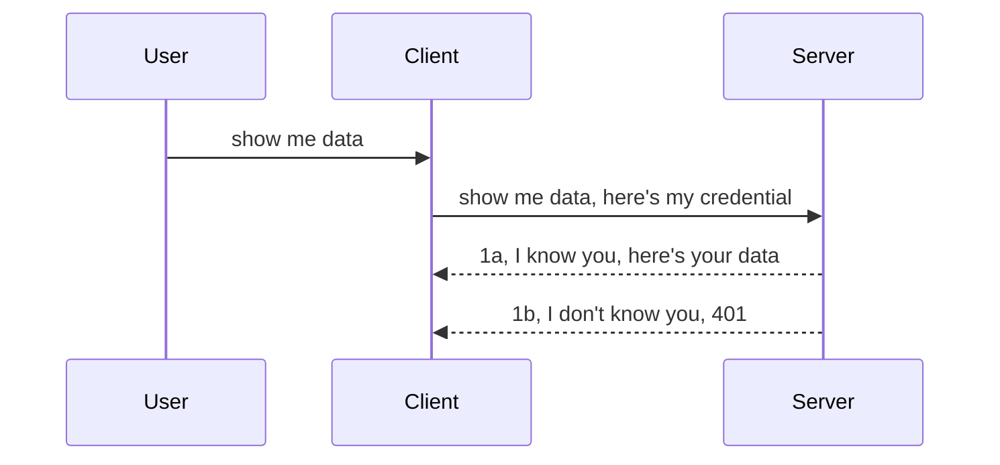

<!--
CO_OP_TRANSLATOR_METADATA:
{
  "original_hash": "5b00b8a8971a07d2d8803be4c9f138f8",
  "translation_date": "2025-10-07T00:53:47+00:00",
  "source_file": "03-GettingStarted/11-simple-auth/README.md",
  "language_code": "no"
}
-->
# Enkel autentisering

MCP SDK-er støtter bruk av OAuth 2.1, som ærlig talt er en ganske omfattende prosess som involverer konsepter som autentiseringsserver, ressursserver, sende inn legitimasjon, få en kode, bytte koden mot en "bearer token" før du endelig kan få tilgang til ressursdataene dine. Hvis du ikke er vant til OAuth, som er en flott ting å implementere, er det en god idé å starte med et grunnleggende nivå av autentisering og gradvis bygge opp til bedre og sikrere løsninger. Det er derfor dette kapittelet eksisterer – for å hjelpe deg med å utvikle mer avansert autentisering.

## Autentisering, hva mener vi?

Autentisering er en forkortelse for autentisering og autorisasjon. Ideen er at vi må gjøre to ting:

- **Autentisering**, som er prosessen med å avgjøre om vi skal la en person komme inn i huset vårt, altså om de har rett til å være "her" – det vil si tilgang til ressursserveren vår der MCP Server-funksjonene ligger.
- **Autorisasjon**, som er prosessen med å finne ut om en bruker skal ha tilgang til de spesifikke ressursene de ber om, for eksempel bestemte ordre eller produkter, eller om de kun har lov til å lese innholdet, men ikke slette det, som et annet eksempel.

## Legitimasjon: hvordan vi forteller systemet hvem vi er

De fleste webutviklere begynner å tenke på å gi en legitimasjon til serveren, vanligvis en hemmelighet som sier om de har lov til å være her ("autentisering"). Denne legitimasjonen er vanligvis en base64-kodet versjon av brukernavn og passord eller en API-nøkkel som unikt identifiserer en spesifikk bruker.

Dette innebærer å sende den via en header kalt "Authorization", slik som dette:

```json
{ "Authorization": "secret123" }
```

Dette kalles vanligvis grunnleggende autentisering. Den generelle flyten fungerer da på følgende måte:



Nå som vi forstår hvordan det fungerer fra et flytperspektiv, hvordan implementerer vi det? Vel, de fleste webservere har et konsept kalt middleware, en kodebit som kjører som en del av forespørselen og kan verifisere legitimasjon. Hvis legitimasjonen er gyldig, kan forespørselen passere gjennom. Hvis forespørselen ikke har gyldig legitimasjon, får du en autentiseringsfeil. La oss se hvordan dette kan implementeres:

**Python**

```python
class AuthMiddleware(BaseHTTPMiddleware):
    async def dispatch(self, request, call_next):

        has_header = request.headers.get("Authorization")
        if not has_header:
            print("-> Missing Authorization header!")
            return Response(status_code=401, content="Unauthorized")

        if not valid_token(has_header):
            print("-> Invalid token!")
            return Response(status_code=403, content="Forbidden")

        print("Valid token, proceeding...")
       
        response = await call_next(request)
        # add any customer headers or change in the response in some way
        return response


starlette_app.add_middleware(CustomHeaderMiddleware)
```

Her har vi:

- Opprettet en middleware kalt `AuthMiddleware` der metoden `dispatch` blir kalt av webserveren.
- Lagt til middleware i webserveren:

    ```python
    starlette_app.add_middleware(AuthMiddleware)
    ```

- Skrevet valideringslogikk som sjekker om Authorization-headeren er til stede og om hemmeligheten som sendes er gyldig:

    ```python
    has_header = request.headers.get("Authorization")
    if not has_header:
        print("-> Missing Authorization header!")
        return Response(status_code=401, content="Unauthorized")

    if not valid_token(has_header):
        print("-> Invalid token!")
        return Response(status_code=403, content="Forbidden")
    ```

    Hvis hemmeligheten er til stede og gyldig, lar vi forespørselen passere gjennom ved å kalle `call_next` og returnere responsen.

    ```python
    response = await call_next(request)
    # add any customer headers or change in the response in some way
    return response
    ```

Hvordan det fungerer er at hvis en webforespørsel blir sendt til serveren, vil middleware bli kalt, og basert på implementeringen vil den enten la forespørselen passere gjennom eller returnere en feil som indikerer at klienten ikke har lov til å fortsette.

**TypeScript**

Her oppretter vi en middleware med det populære rammeverket Express og avskjærer forespørselen før den når MCP Server. Her er koden for det:

```typescript
function isValid(secret) {
    return secret === "secret123";
}

app.use((req, res, next) => {
    // 1. Authorization header present?  
    if(!req.headers["Authorization"]) {
        res.status(401).send('Unauthorized');
    }
    
    let token = req.headers["Authorization"];

    // 2. Check validity.
    if(!isValid(token)) {
        res.status(403).send('Forbidden');
    }

   
    console.log('Middleware executed');
    // 3. Passes request to the next step in the request pipeline.
    next();
});
```

I denne koden gjør vi følgende:

1. Sjekker om Authorization-headeren er til stede i det hele tatt; hvis ikke, sender vi en 401-feil.
2. Sikrer at legitimasjonen/token er gyldig; hvis ikke, sender vi en 403-feil.
3. Lar til slutt forespørselen passere gjennom forespørselsruten og returnerer den etterspurte ressursen.

## Øvelse: Implementer autentisering

La oss ta kunnskapen vår og prøve å implementere den. Her er planen:

Server

- Opprett en webserver og MCP-instans.
- Implementer en middleware for serveren.

Klient 

- Send webforespørsel med legitimasjon via header.

### -1- Opprett en webserver og MCP-instans

I vårt første steg må vi opprette webserverinstansen og MCP Server.

**Python**

Her oppretter vi en MCP Server-instans, lager en Starlette-webapp og hoster den med uvicorn.

```python
# creating MCP Server

app = FastMCP(
    name="MCP Resource Server",
    instructions="Resource Server that validates tokens via Authorization Server introspection",
    host=settings["host"],
    port=settings["port"],
    debug=True
)

# creating starlette web app
starlette_app = app.streamable_http_app()

# serving app via uvicorn
async def run(starlette_app):
    import uvicorn
    config = uvicorn.Config(
            starlette_app,
            host=app.settings.host,
            port=app.settings.port,
            log_level=app.settings.log_level.lower(),
        )
    server = uvicorn.Server(config)
    await server.serve()

run(starlette_app)
```

I denne koden gjør vi følgende:

- Oppretter MCP Server.
- Konstruerer Starlette-webappen fra MCP Server, `app.streamable_http_app()`.
- Hoster og serverer webappen ved hjelp av uvicorn `server.serve()`.

**TypeScript**

Her oppretter vi en MCP Server-instans.

```typescript
const server = new McpServer({
      name: "example-server",
      version: "1.0.0"
    });

    // ... set up server resources, tools, and prompts ...
```

Denne MCP Server-opprettelsen må skje innenfor vår POST /mcp-rutedefinisjon, så la oss ta koden ovenfor og flytte den slik:

```typescript
import express from "express";
import { randomUUID } from "node:crypto";
import { McpServer } from "@modelcontextprotocol/sdk/server/mcp.js";
import { StreamableHTTPServerTransport } from "@modelcontextprotocol/sdk/server/streamableHttp.js";
import { isInitializeRequest } from "@modelcontextprotocol/sdk/types.js"

const app = express();
app.use(express.json());

// Map to store transports by session ID
const transports: { [sessionId: string]: StreamableHTTPServerTransport } = {};

// Handle POST requests for client-to-server communication
app.post('/mcp', async (req, res) => {
  // Check for existing session ID
  const sessionId = req.headers['mcp-session-id'] as string | undefined;
  let transport: StreamableHTTPServerTransport;

  if (sessionId && transports[sessionId]) {
    // Reuse existing transport
    transport = transports[sessionId];
  } else if (!sessionId && isInitializeRequest(req.body)) {
    // New initialization request
    transport = new StreamableHTTPServerTransport({
      sessionIdGenerator: () => randomUUID(),
      onsessioninitialized: (sessionId) => {
        // Store the transport by session ID
        transports[sessionId] = transport;
      },
      // DNS rebinding protection is disabled by default for backwards compatibility. If you are running this server
      // locally, make sure to set:
      // enableDnsRebindingProtection: true,
      // allowedHosts: ['127.0.0.1'],
    });

    // Clean up transport when closed
    transport.onclose = () => {
      if (transport.sessionId) {
        delete transports[transport.sessionId];
      }
    };
    const server = new McpServer({
      name: "example-server",
      version: "1.0.0"
    });

    // ... set up server resources, tools, and prompts ...

    // Connect to the MCP server
    await server.connect(transport);
  } else {
    // Invalid request
    res.status(400).json({
      jsonrpc: '2.0',
      error: {
        code: -32000,
        message: 'Bad Request: No valid session ID provided',
      },
      id: null,
    });
    return;
  }

  // Handle the request
  await transport.handleRequest(req, res, req.body);
});

// Reusable handler for GET and DELETE requests
const handleSessionRequest = async (req: express.Request, res: express.Response) => {
  const sessionId = req.headers['mcp-session-id'] as string | undefined;
  if (!sessionId || !transports[sessionId]) {
    res.status(400).send('Invalid or missing session ID');
    return;
  }
  
  const transport = transports[sessionId];
  await transport.handleRequest(req, res);
};

// Handle GET requests for server-to-client notifications via SSE
app.get('/mcp', handleSessionRequest);

// Handle DELETE requests for session termination
app.delete('/mcp', handleSessionRequest);

app.listen(3000);
```

Nå ser du hvordan MCP Server-opprettelsen ble flyttet innenfor `app.post("/mcp")`.

La oss gå videre til neste steg med å opprette middleware slik at vi kan validere den innkommende legitimasjonen.

### -2- Implementer en middleware for serveren

La oss gå videre til middleware-delen. Her vil vi opprette en middleware som ser etter en legitimasjon i `Authorization`-headeren og validerer den. Hvis den er akseptabel, vil forespørselen fortsette med det den skal (f.eks. liste verktøy, lese en ressurs eller hva enn MCP-funksjonalitet klienten ba om).

**Python**

For å opprette middleware må vi lage en klasse som arver fra `BaseHTTPMiddleware`. Det er to interessante deler:

- Forespørselen `request`, som vi leser header-informasjonen fra.
- `call_next`, callbacken vi må kalle hvis klienten har med en legitimasjon vi aksepterer.

Først må vi håndtere tilfelle der `Authorization`-headeren mangler:

```python
has_header = request.headers.get("Authorization")

# no header present, fail with 401, otherwise move on.
if not has_header:
    print("-> Missing Authorization header!")
    return Response(status_code=401, content="Unauthorized")
```

Her sender vi en 401 Unauthorized-melding siden klienten feiler autentiseringen.

Neste, hvis en legitimasjon ble sendt inn, må vi sjekke gyldigheten slik:

```python
 if not valid_token(has_header):
    print("-> Invalid token!")
    return Response(status_code=403, content="Forbidden")
```

Merk hvordan vi sender en 403 Forbidden-melding ovenfor. La oss se hele middleware nedenfor som implementerer alt vi nevnte ovenfor:

```python
class AuthMiddleware(BaseHTTPMiddleware):
    async def dispatch(self, request, call_next):

        has_header = request.headers.get("Authorization")
        if not has_header:
            print("-> Missing Authorization header!")
            return Response(status_code=401, content="Unauthorized")

        if not valid_token(has_header):
            print("-> Invalid token!")
            return Response(status_code=403, content="Forbidden")

        print("Valid token, proceeding...")
        print(f"-> Received {request.method} {request.url}")
        response = await call_next(request)
        response.headers['Custom'] = 'Example'
        return response

```

Flott, men hva med `valid_token`-funksjonen? Her er den nedenfor:

```python
# DON'T use for production - improve it !!
def valid_token(token: str) -> bool:
    # remove the "Bearer " prefix
    if token.startswith("Bearer "):
        token = token[7:]
        return token == "secret-token"
    return False
```

Dette bør selvfølgelig forbedres.

VIKTIG: Du bør ALDRI ha hemmeligheter som dette i koden. Du bør ideelt sett hente verdien for sammenligning fra en datakilde eller fra en IDP (Identity Service Provider), eller enda bedre, la IDP-en gjøre valideringen.

**TypeScript**

For å implementere dette med Express må vi kalle `use`-metoden som tar middleware-funksjoner.

Vi må:

- Interagere med forespørselsvariabelen for å sjekke den sendte legitimasjonen i `Authorization`-egenskapen.
- Validere legitimasjonen, og hvis den er gyldig, la forespørselen fortsette og la klientens MCP-forespørsel gjøre det den skal (f.eks. liste verktøy, lese ressurs eller MCP-relatert funksjonalitet).

Her sjekker vi om `Authorization`-headeren er til stede, og hvis ikke, stopper vi forespørselen fra å gå videre:

```typescript
if(!req.headers["authorization"]) {
    res.status(401).send('Unauthorized');
    return;
}
```

Hvis headeren ikke er sendt i det hele tatt, får du en 401.

Neste, vi sjekker om legitimasjonen er gyldig; hvis ikke, stopper vi forespørselen igjen, men med en litt annen melding:

```typescript
if(!isValid(token)) {
    res.status(403).send('Forbidden');
    return;
} 
```

Merk hvordan du nå får en 403-feil.

Her er hele koden:

```typescript
app.use((req, res, next) => {
    console.log('Request received:', req.method, req.url, req.headers);
    console.log('Headers:', req.headers["authorization"]);
    if(!req.headers["authorization"]) {
        res.status(401).send('Unauthorized');
        return;
    }
    
    let token = req.headers["authorization"];

    if(!isValid(token)) {
        res.status(403).send('Forbidden');
        return;
    }  

    console.log('Middleware executed');
    next();
});
```

Vi har satt opp webserveren til å akseptere en middleware for å sjekke legitimasjonen klienten forhåpentligvis sender oss. Hva med selve klienten?

### -3- Send webforespørsel med legitimasjon via header

Vi må sørge for at klienten sender legitimasjonen gjennom headeren. Siden vi skal bruke en MCP-klient til dette, må vi finne ut hvordan det gjøres.

**Python**

For klienten må vi sende en header med vår legitimasjon slik:

```python
# DON'T hardcode the value, have it at minimum in an environment variable or a more secure storage
token = "secret-token"

async with streamablehttp_client(
        url = f"http://localhost:{port}/mcp",
        headers = {"Authorization": f"Bearer {token}"}
    ) as (
        read_stream,
        write_stream,
        session_callback,
    ):
        async with ClientSession(
            read_stream,
            write_stream
        ) as session:
            await session.initialize()
      
            # TODO, what you want done in the client, e.g list tools, call tools etc.
```

Merk hvordan vi fyller `headers`-egenskapen slik: `headers = {"Authorization": f"Bearer {token}"}`.

**TypeScript**

Vi kan løse dette i to steg:

1. Fylle en konfigurasjonsobjekt med vår legitimasjon.
2. Sende konfigurasjonsobjektet til transporten.

```typescript

// DON'T hardcode the value like shown here. At minimum have it as a env variable and use something like dotenv (in dev mode).
let token = "secret123"

// define a client transport option object
let options: StreamableHTTPClientTransportOptions = {
  sessionId: sessionId,
  requestInit: {
    headers: {
      "Authorization": "secret123"
    }
  }
};

// pass the options object to the transport
async function main() {
   const transport = new StreamableHTTPClientTransport(
      new URL(serverUrl),
      options
   );
```

Her ser du ovenfor hvordan vi måtte opprette et `options`-objekt og plassere headerne våre under `requestInit`-egenskapen.

VIKTIG: Hvordan kan vi forbedre dette herfra? Vel, den nåværende implementeringen har noen problemer. Først og fremst er det ganske risikabelt å sende en legitimasjon på denne måten med mindre du i det minste har HTTPS. Selv da kan legitimasjonen bli stjålet, så du trenger et system der du enkelt kan tilbakekalle tokenet og legge til ekstra kontroller, som hvor i verden forespørselen kommer fra, om forespørselen skjer altfor ofte (bot-lignende oppførsel), kort sagt, det er en hel rekke bekymringer.

Det bør sies at for veldig enkle API-er der du ikke vil at noen skal kalle API-en din uten å være autentisert, er det vi har her en god start.

Med det sagt, la oss prøve å styrke sikkerheten litt ved å bruke et standardisert format som JSON Web Token, også kjent som JWT eller "JOT"-token.

## JSON Web Tokens, JWT

Så, vi prøver å forbedre ting fra å sende veldig enkle legitimasjoner. Hva er de umiddelbare forbedringene vi får ved å adoptere JWT?

- **Sikkerhetsforbedringer**. I grunnleggende autentisering sender du brukernavn og passord som en base64-kodet token (eller du sender en API-nøkkel) om og om igjen, noe som øker risikoen. Med JWT sender du brukernavn og passord og får en token i retur, og den er også tidsbegrenset, noe som betyr at den vil utløpe. JWT lar deg enkelt bruke finmasket tilgangskontroll ved hjelp av roller, omfang og tillatelser.
- **Statelessness og skalerbarhet**. JWT-er er selvstendige, de bærer all brukerinfo og eliminerer behovet for å lagre server-side sesjonslagring. Token kan også valideres lokalt.
- **Interoperabilitet og føderasjon**. JWT-er er sentrale i Open ID Connect og brukes med kjente identitetsleverandører som Entra ID, Google Identity og Auth0. De gjør det også mulig å bruke single sign-on og mye mer, noe som gjør det enterprise-grade.
- **Modularitet og fleksibilitet**. JWT-er kan også brukes med API Gateways som Azure API Management, NGINX og mer. De støtter også bruk av autentiseringsscenarier og server-til-server-kommunikasjon, inkludert scenarier for impersonasjon og delegasjon.
- **Ytelse og caching**. JWT-er kan caches etter dekoding, noe som reduserer behovet for parsing. Dette hjelper spesielt med høytrafikk-apper, da det forbedrer gjennomstrømning og reduserer belastningen på den valgte infrastrukturen.
- **Avanserte funksjoner**. Det støtter også introspeksjon (sjekke gyldighet på serveren) og tilbakekalling (gjøre en token ugyldig).

Med alle disse fordelene, la oss se hvordan vi kan ta implementeringen vår til neste nivå.

## Gjøre grunnleggende autentisering om til JWT

Så, endringene vi trenger på et høyt nivå er:

- **Lære å konstruere en JWT-token** og gjøre den klar for å bli sendt fra klient til server.
- **Validere en JWT-token**, og hvis den er gyldig, la klienten få tilgang til ressursene våre.
- **Sikker token-lagring**. Hvordan vi lagrer denne tokenen.
- **Beskytte rutene**. Vi må beskytte rutene, i vårt tilfelle må vi beskytte rutene og spesifikke MCP-funksjoner.
- **Legge til refresh tokens**. Sørge for at vi oppretter tokens som er kortvarige, men refresh tokens som er langvarige og kan brukes til å skaffe nye tokens hvis de utløper. Sørge for at det finnes en refresh-endepunkt og en rotasjonsstrategi.

### -1- Konstruere en JWT-token

Først og fremst har en JWT-token følgende deler:

- **Header**, algoritmen som brukes og token-typen.
- **Payload**, krav, som sub (brukeren eller enheten tokenen representerer. I et autentiseringsscenario er dette typisk bruker-ID), exp (når den utløper), role (rollen).
- **Signatur**, signert med en hemmelighet eller privat nøkkel.

For dette må vi konstruere headeren, payloaden og den kodede tokenen.

**Python**

```python

import jwt
import jwt
from jwt.exceptions import ExpiredSignatureError, InvalidTokenError
import datetime

# Secret key used to sign the JWT
secret_key = 'your-secret-key'

header = {
    "alg": "HS256",
    "typ": "JWT"
}

# the user info andits claims and expiry time
payload = {
    "sub": "1234567890",               # Subject (user ID)
    "name": "User Userson",                # Custom claim
    "admin": True,                     # Custom claim
    "iat": datetime.datetime.utcnow(),# Issued at
    "exp": datetime.datetime.utcnow() + datetime.timedelta(hours=1)  # Expiry
}

# encode it
encoded_jwt = jwt.encode(payload, secret_key, algorithm="HS256", headers=header)
```

I koden ovenfor har vi:

- Definert en header som bruker HS256 som algoritme og type som JWT.
- Konstruert en payload som inneholder et subject eller bruker-ID, et brukernavn, en rolle, når den ble utstedt og når den er satt til å utløpe, og dermed implementert den tidsbegrensede aspekten vi nevnte tidligere.

**TypeScript**

Her trenger vi noen avhengigheter som vil hjelpe oss med å konstruere JWT-tokenen.

Avhengigheter

```sh

npm install jsonwebtoken
npm install --save-dev @types/jsonwebtoken
```

Nå som vi har det på plass, la oss opprette headeren, payloaden og gjennom det opprette den kodede tokenen.

```typescript
import jwt from 'jsonwebtoken';

const secretKey = 'your-secret-key'; // Use env vars in production

// Define the payload
const payload = {
  sub: '1234567890',
  name: 'User usersson',
  admin: true,
  iat: Math.floor(Date.now() / 1000), // Issued at
  exp: Math.floor(Date.now() / 1000) + 60 * 60 // Expires in 1 hour
};

// Define the header (optional, jsonwebtoken sets defaults)
const header = {
  alg: 'HS256',
  typ: 'JWT'
};

// Create the token
const token = jwt.sign(payload, secretKey, {
  algorithm: 'HS256',
  header: header
});

console.log('JWT:', token);
```

Denne tokenen er:

Signert ved bruk av HS256
Gyldig i 1 time
Inkluderer krav som sub, name, admin, iat og exp.

### -2- Validere en token

Vi må også validere en token, dette bør gjøres på serveren for å sikre at det klienten sender oss faktisk er gyldig. Det er mange kontroller vi bør gjøre her, fra å validere strukturen til gyldigheten. Du oppfordres også til å legge til andre kontroller for å se om brukeren er i systemet ditt og mer.

For å validere en token må vi dekode den slik at vi kan lese den og deretter begynne å sjekke gyldigheten:

**Python**

```python

# Decode and verify the JWT
try:
    decoded = jwt.decode(token, secret_key, algorithms=["HS256"])
    print("✅ Token is valid.")
    print("Decoded claims:")
    for key, value in decoded.items():
        print(f"  {key}: {value}")
except ExpiredSignatureError:
    print("❌ Token has expired.")
except InvalidTokenError as e:
    print(f"❌ Invalid token: {e}")

```

I denne koden kaller vi `jwt.decode` ved hjelp av tokenen, den hemmelige nøkkelen og den valgte algoritmen som input. Merk hvordan vi bruker en try-catch-konstruksjon, da en mislykket validering fører til at en feil blir kastet.

**TypeScript**

Her må vi kalle `jwt.verify` for å få en dekodet versjon av tokenen som vi kan analysere videre. Hvis denne kallingen mislykkes, betyr det at strukturen til tokenen er feil eller at den ikke lenger er gyldig.

```typescript

try {
  const decoded = jwt.verify(token, secretKey);
  console.log('Decoded Payload:', decoded);
} catch (err) {
  console.error('Token verification failed:', err);
}
```

MERK: Som nevnt tidligere, bør vi utføre ytterligere kontroller for å sikre at denne tokenen peker på en bruker i systemet vårt og sikre at brukeren har de rettighetene den hevder å ha.
Neste skal vi se nærmere på rollebasert tilgangskontroll, også kjent som RBAC.

## Legge til rollebasert tilgangskontroll

Tanken er at vi ønsker å uttrykke at ulike roller har ulike tillatelser. For eksempel antar vi at en administrator kan gjøre alt, at en vanlig bruker kan lese/skrive, og at en gjest kun kan lese. Her er noen mulige tillatelsesnivåer:

- Admin.Write 
- User.Read
- Guest.Read

La oss se hvordan vi kan implementere slik kontroll med middleware. Middleware kan legges til per rute, så vel som for alle ruter.

**Python**

```python
from starlette.middleware.base import BaseHTTPMiddleware
from starlette.responses import JSONResponse
import jwt

# DON'T have the secret in the code like, this is for demonstration purposes only. Read it from a safe place.
SECRET_KEY = "your-secret-key" # put this in env variable
REQUIRED_PERMISSION = "User.Read"

class JWTPermissionMiddleware(BaseHTTPMiddleware):
    async def dispatch(self, request, call_next):
        auth_header = request.headers.get("Authorization")
        if not auth_header or not auth_header.startswith("Bearer "):
            return JSONResponse({"error": "Missing or invalid Authorization header"}, status_code=401)

        token = auth_header.split(" ")[1]
        try:
            decoded = jwt.decode(token, SECRET_KEY, algorithms=["HS256"])
        except jwt.ExpiredSignatureError:
            return JSONResponse({"error": "Token expired"}, status_code=401)
        except jwt.InvalidTokenError:
            return JSONResponse({"error": "Invalid token"}, status_code=401)

        permissions = decoded.get("permissions", [])
        if REQUIRED_PERMISSION not in permissions:
            return JSONResponse({"error": "Permission denied"}, status_code=403)

        request.state.user = decoded
        return await call_next(request)


```

Det finnes flere måter å legge til middleware på, som vist nedenfor:

```python

# Alt 1: add middleware while constructing starlette app
middleware = [
    Middleware(JWTPermissionMiddleware)
]

app = Starlette(routes=routes, middleware=middleware)

# Alt 2: add middleware after starlette app is a already constructed
starlette_app.add_middleware(JWTPermissionMiddleware)

# Alt 3: add middleware per route
routes = [
    Route(
        "/mcp",
        endpoint=..., # handler
        middleware=[Middleware(JWTPermissionMiddleware)]
    )
]
```

**TypeScript**

Vi kan bruke `app.use` og en middleware som vil kjøre for alle forespørsler.

```typescript
app.use((req, res, next) => {
    console.log('Request received:', req.method, req.url, req.headers);
    console.log('Headers:', req.headers["authorization"]);

    // 1. Check if authorization header has been sent

    if(!req.headers["authorization"]) {
        res.status(401).send('Unauthorized');
        return;
    }
    
    let token = req.headers["authorization"];

    // 2. Check if token is valid
    if(!isValid(token)) {
        res.status(403).send('Forbidden');
        return;
    }  

    // 3. Check if token user exist in our system
    if(!isExistingUser(token)) {
        res.status(403).send('Forbidden');
        console.log("User does not exist");
        return;
    }
    console.log("User exists");

    // 4. Verify the token has the right permissions
    if(!hasScopes(token, ["User.Read"])){
        res.status(403).send('Forbidden - insufficient scopes');
    }

    console.log("User has required scopes");

    console.log('Middleware executed');
    next();
});

```

Det er en del ting vi kan la vår middleware gjøre, og som den BØR gjøre, nemlig:

1. Sjekke om autorisasjonsheaderen er til stede.
2. Sjekke om token er gyldig. Vi kaller `isValid`, som er en metode vi har skrevet for å sjekke integriteten og gyldigheten til JWT-token.
3. Verifisere at brukeren eksisterer i systemet vårt. Dette bør vi sjekke.

   ```typescript
    // users in DB
   const users = [
     "user1",
     "User usersson",
   ]

   function isExistingUser(token) {
     let decodedToken = verifyToken(token);

     // TODO, check if user exists in DB
     return users.includes(decodedToken?.name || "");
   }
   ```

   Ovenfor har vi laget en veldig enkel `users`-liste, som selvfølgelig burde ligge i en database.

4. I tillegg bør vi også sjekke at token har de riktige tillatelsene.

   ```typescript
   if(!hasScopes(token, ["User.Read"])){
        res.status(403).send('Forbidden - insufficient scopes');
   }
   ```

   I koden ovenfor fra middleware sjekker vi at token inneholder User.Read-tillatelsen. Hvis ikke, sender vi en 403-feil. Nedenfor er `hasScopes`-hjelpemetoden.

   ```typescript
   function hasScopes(scope: string, requiredScopes: string[]) {
     let decodedToken = verifyToken(scope);
    return requiredScopes.every(scope => decodedToken?.scopes.includes(scope));
  }
   ```

Have a think which additional checks you should be doing, but these are the absolute minimum of checks you should be doing.

Using Express as a web framework is a common choice. There are helpers library when you use JWT so you can write less code.

- `express-jwt`, helper library that provides a middleware that helps decode your token.
- `express-jwt-permissions`, this provides a middleware `guard` that helps check if a certain permission is on the token.

Here's what these libraries can look like when used:

```typescript
const express = require('express');
const jwt = require('express-jwt');
const guard = require('express-jwt-permissions')();

const app = express();
const secretKey = 'your-secret-key'; // put this in env variable

// Decode JWT and attach to req.user
app.use(jwt({ secret: secretKey, algorithms: ['HS256'] }));

// Check for User.Read permission
app.use(guard.check('User.Read'));

// multiple permissions
// app.use(guard.check(['User.Read', 'Admin.Access']));

app.get('/protected', (req, res) => {
  res.json({ message: `Welcome ${req.user.name}` });
});

// Error handler
app.use((err, req, res, next) => {
  if (err.code === 'permission_denied') {
    return res.status(403).send('Forbidden');
  }
  next(err);
});

```

Nå har du sett hvordan middleware kan brukes både for autentisering og autorisasjon. Men hva med MCP? Endrer det hvordan vi gjør autentisering? La oss finne ut av det i neste seksjon.

### -3- Legg til RBAC i MCP

Du har sett hvordan du kan legge til RBAC via middleware, men for MCP finnes det ingen enkel måte å legge til RBAC per MCP-funksjon. Så hva gjør vi? Vel, vi må bare legge til kode som i dette tilfellet sjekker om klienten har rettigheter til å kalle et spesifikt verktøy:

Du har noen forskjellige valg for hvordan du kan oppnå RBAC per funksjon. Her er noen:

- Legg til en sjekk for hvert verktøy, ressurs eller prompt der du trenger å sjekke tillatelsesnivået.

   **Python**

   ```python
   @tool()
   def delete_product(id: int):
      try:
          check_permissions(role="Admin.Write", request)
      catch:
        pass # client failed authorization, raise authorization error
   ```

   **TypeScript**

   ```typescript
   server.registerTool(
    "delete-product",
    {
      title: Delete a product",
      description: "Deletes a product",
      inputSchema: { id: z.number() }
    },
    async ({ id }) => {
      
      try {
        checkPermissions("Admin.Write", request);
        // todo, send id to productService and remote entry
      } catch(Exception e) {
        console.log("Authorization error, you're not allowed");  
      }

      return {
        content: [{ type: "text", text: `Deletected product with id ${id}` }]
      };
    }
   );
   ```


- Bruk en avansert servertilnærming og forespørselshåndterere for å minimere hvor mange steder du trenger å gjøre sjekken.

   **Python**

   ```python
   
   tool_permission = {
      "create_product": ["User.Write", "Admin.Write"],
      "delete_product": ["Admin.Write"]
   }

   def has_permission(user_permissions, required_permissions) -> bool:
      # user_permissions: list of permissions the user has
      # required_permissions: list of permissions required for the tool
      return any(perm in user_permissions for perm in required_permissions)

   @server.call_tool()
   async def handle_call_tool(
     name: str, arguments: dict[str, str] | None
   ) -> list[types.TextContent]:
    # Assume request.user.permissions is a list of permissions for the user
     user_permissions = request.user.permissions
     required_permissions = tool_permission.get(name, [])
     if not has_permission(user_permissions, required_permissions):
        # Raise error "You don't have permission to call tool {name}"
        raise Exception(f"You don't have permission to call tool {name}")
     # carry on and call tool
     # ...
   ```   
   

   **TypeScript**

   ```typescript
   function hasPermission(userPermissions: string[], requiredPermissions: string[]): boolean {
       if (!Array.isArray(userPermissions) || !Array.isArray(requiredPermissions)) return false;
       // Return true if user has at least one required permission
       
       return requiredPermissions.some(perm => userPermissions.includes(perm));
   }
  
   server.setRequestHandler(CallToolRequestSchema, async (request) => {
      const { params: { name } } = request;
  
      let permissions = request.user.permissions;
  
      if (!hasPermission(permissions, toolPermissions[name])) {
         return new Error(`You don't have permission to call ${name}`);
      }
  
      // carry on..
   });
   ```

   Merk at du må sørge for at din middleware tilordner et dekodet token til forespørselens bruker-egenskap, slik at koden ovenfor blir enkel.

### Oppsummering

Nå som vi har diskutert hvordan man legger til støtte for RBAC generelt og for MCP spesielt, er det på tide å prøve å implementere sikkerhet på egen hånd for å sikre at du har forstått konseptene som er presentert.

## Oppgave 1: Bygg en MCP-server og MCP-klient ved hjelp av grunnleggende autentisering

Her skal du bruke det du har lært om å sende legitimasjon gjennom headere.

## Løsning 1

[Løsning 1](./code/basic/README.md)

## Oppgave 2: Oppgrader løsningen fra Oppgave 1 til å bruke JWT

Ta den første løsningen, men denne gangen skal vi forbedre den.

I stedet for å bruke Basic Auth, skal vi bruke JWT.

## Løsning 2

[Løsning 2](./solution/jwt-solution/README.md)

## Utfordring

Legg til RBAC per verktøy som vi beskrev i seksjonen "Legg til RBAC i MCP".

## Oppsummering

Forhåpentligvis har du lært mye i dette kapittelet, fra ingen sikkerhet i det hele tatt, til grunnleggende sikkerhet, til JWT og hvordan det kan legges til i MCP.

Vi har bygget et solid fundament med tilpassede JWT-er, men etter hvert som vi skalerer, beveger vi oss mot en standardbasert identitetsmodell. Å ta i bruk en IdP som Entra eller Keycloak lar oss overføre tokenutstedelse, validering og livssyklusadministrasjon til en pålitelig plattform — slik at vi kan fokusere på applikasjonslogikk og brukeropplevelse.

For dette har vi et mer [avansert kapittel om Entra](../../05-AdvancedTopics/mcp-security-entra/README.md)

---

**Ansvarsfraskrivelse**:  
Dette dokumentet er oversatt ved hjelp av AI-oversettelsestjenesten [Co-op Translator](https://github.com/Azure/co-op-translator). Selv om vi tilstreber nøyaktighet, vær oppmerksom på at automatiserte oversettelser kan inneholde feil eller unøyaktigheter. Det originale dokumentet på sitt opprinnelige språk bør anses som den autoritative kilden. For kritisk informasjon anbefales profesjonell menneskelig oversettelse. Vi er ikke ansvarlige for eventuelle misforståelser eller feiltolkninger som oppstår ved bruk av denne oversettelsen.