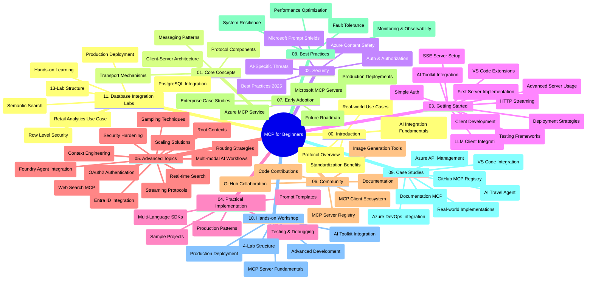

<!--
CO_OP_TRANSLATOR_METADATA:
{
  "original_hash": "af27b0acfae6caa134d9701453884df8",
  "translation_date": "2025-10-06T23:20:41+00:00",
  "source_file": "study_guide.md",
  "language_code": "no"
}
-->
# Model Context Protocol (MCP) for Nybegynnere - Studieveiledning

Denne studieveiledningen gir en oversikt over strukturen og innholdet i "Model Context Protocol (MCP) for Nybegynnere"-pensumet. Bruk denne veiledningen for å navigere effektivt i repositoriet og få mest mulig ut av de tilgjengelige ressursene.

## Oversikt over Repositoriet

Model Context Protocol (MCP) er et standardisert rammeverk for interaksjoner mellom AI-modeller og klientapplikasjoner. Opprinnelig opprettet av Anthropic, vedlikeholdes MCP nå av MCP-samfunnet gjennom den offisielle GitHub-organisasjonen. Dette repositoriet tilbyr et omfattende pensum med praktiske kodeeksempler i C#, Java, JavaScript, Python og TypeScript, designet for AI-utviklere, systemarkitekter og programvareingeniører.

## Visuell Pensumkart

## Struktur i Repositoriet

Repositoriet er organisert i elleve hovedseksjoner, hver med fokus på ulike aspekter av MCP:

1. **Introduksjon (00-Introduction/)**
   - Oversikt over Model Context Protocol
   - Hvorfor standardisering er viktig i AI-pipelines
   - Praktiske bruksområder og fordeler

2. **Kjernekonsepter (01-CoreConcepts/)**
   - Klient-server-arkitektur
   - Viktige protokollkomponenter
   - Meldingsmønstre i MCP

3. **Sikkerhet (02-Security/)**
   - Sikkerhetstrusler i MCP-baserte systemer
   - Beste praksis for å sikre implementasjoner
   - Strategier for autentisering og autorisasjon
   - **Omfattende Sikkerhetsdokumentasjon**:
     - MCP Security Best Practices 2025
     - Azure Content Safety Implementation Guide
     - MCP Security Controls and Techniques
     - MCP Best Practices Quick Reference
   - **Viktige Sikkerhetstemaer**:
     - Prompt injection og verktøyforgiftning
     - Sesjonskapring og "confused deputy"-problemer
     - Token passthrough-sårbarheter
     - Overdrevne tillatelser og tilgangskontroll
     - Forsyningskjede-sikkerhet for AI-komponenter
     - Microsoft Prompt Shields-integrasjon

4. **Kom i gang (03-GettingStarted/)**
   - Oppsett og konfigurasjon av miljø
   - Opprette grunnleggende MCP-servere og klienter
   - Integrasjon med eksisterende applikasjoner
   - Inkluderer seksjoner for:
     - Første serverimplementasjon
     - Klientutvikling
     - LLM-klientintegrasjon
     - VS Code-integrasjon
     - Server-Sent Events (SSE)-server
     - Avansert serverbruk
     - HTTP-streaming
     - AI Toolkit-integrasjon
     - Teststrategier
     - Retningslinjer for utrulling

5. **Praktisk Implementering (04-PracticalImplementation/)**
   - Bruk av SDK-er på tvers av ulike programmeringsspråk
   - Feilsøking, testing og valideringsteknikker
   - Utforming av gjenbrukbare prompt-maler og arbeidsflyter
   - Eksempelprosjekter med implementeringseksempler

6. **Avanserte Emner (05-AdvancedTopics/)**
   - Kontekstingeniørteknikker
   - Foundry-agentintegrasjon
   - Multi-modal AI-arbeidsflyter
   - OAuth2-autentiseringsdemoer
   - Sanntidssøk
   - Sanntidsstreaming
   - Implementering av rotkontekster
   - Rutingsstrategier
   - Utvalgte teknikker
   - Skaleringsmetoder
   - Sikkerhetsbetraktninger
   - Entra ID-sikkerhetsintegrasjon
   - Websøkeintegrasjon

7. **Bidrag fra Samfunnet (06-CommunityContributions/)**
   - Hvordan bidra med kode og dokumentasjon
   - Samarbeid via GitHub
   - Samfunnsdrevne forbedringer og tilbakemeldinger
   - Bruk av ulike MCP-klienter (Claude Desktop, Cline, VSCode)
   - Arbeid med populære MCP-servere inkludert bildegenerering

8. **Lærdom fra Tidlig Adopsjon (07-LessonsfromEarlyAdoption/)**
   - Implementeringer og suksesshistorier fra virkeligheten
   - Bygging og utrulling av MCP-baserte løsninger
   - Trender og fremtidig veikart
   - **Microsoft MCP Servers Guide**: Omfattende guide til 10 produksjonsklare Microsoft MCP-servere inkludert:
     - Microsoft Learn Docs MCP Server
     - Azure MCP Server (15+ spesialiserte koblinger)
     - GitHub MCP Server
     - Azure DevOps MCP Server
     - MarkItDown MCP Server
     - SQL Server MCP Server
     - Playwright MCP Server
     - Dev Box MCP Server
     - Azure AI Foundry MCP Server
     - Microsoft 365 Agents Toolkit MCP Server

9. **Beste Praksis (08-BestPractices/)**
   - Ytelsestuning og optimalisering
   - Design av feiltolerante MCP-systemer
   - Test- og motstandsstrategier

10. **Case-studier (09-CaseStudy/)**
    - **Syv omfattende case-studier** som viser MCPs allsidighet på tvers av ulike scenarier:
    - **Azure AI Travel Agents**: Multi-agent orkestrering med Azure OpenAI og AI Search
    - **Azure DevOps Integrasjon**: Automatisering av arbeidsflytprosesser med YouTube-dataoppdateringer
    - **Sanntidsdokumentasjonsinnhenting**: Python-konsollklient med HTTP-streaming
    - **Interaktiv Studieplan Generator**: Chainlit webapp med samtale-AI
    - **Dokumentasjon i Editor**: VS Code-integrasjon med GitHub Copilot-arbeidsflyter
    - **Azure API Management**: Bedrifts-API-integrasjon med MCP-serveroppretting
    - **GitHub MCP Registry**: Økosystemutvikling og agentisk integrasjonsplattform
    - Implementeringseksempler som spenner over bedriftsintegrasjon, utviklerproduktivitet og økosystemutvikling

11. **Praktisk Workshop (10-StreamliningAIWorkflowsBuildingAnMCPServerWithAIToolkit/)**
    - Omfattende praktisk workshop som kombinerer MCP med AI Toolkit
    - Bygging av intelligente applikasjoner som kobler AI-modeller med virkelige verktøy
    - Praktiske moduler som dekker grunnleggende, tilpasset serverutvikling og produksjonsutrullingsstrategier
    - **Lab-struktur**:
      - Lab 1: MCP Server Grunnleggende
      - Lab 2: Avansert MCP Server Utvikling
      - Lab 3: AI Toolkit Integrasjon
      - Lab 4: Produksjonsutrulling og Skalering
    - Lab-basert læringsmetode med trinnvise instruksjoner

12. **MCP Server Database Integrasjonslaber (11-MCPServerHandsOnLabs/)**
    - **Omfattende 13-lab læringssti** for bygging av produksjonsklare MCP-servere med PostgreSQL-integrasjon
    - **Implementering av detaljhandelsanalyse fra virkeligheten** ved bruk av Zava Retail-case
    - **Mønstre på bedriftsnivå** inkludert Row Level Security (RLS), semantisk søk og multi-tenant datatilgang
    - **Komplett Lab-struktur**:
      - **Lab 00-03: Grunnleggende** - Introduksjon, Arkitektur, Sikkerhet, Miljøoppsett
      - **Lab 04-06: Bygging av MCP Server** - Database Design, MCP Server Implementering, Verktøyutvikling
      - **Lab 07-09: Avanserte Funksjoner** - Semantisk Søk, Testing & Feilsøking, VS Code Integrasjon
      - **Lab 10-12: Produksjon & Beste Praksis** - Utrulling, Overvåking, Optimalisering
    - **Teknologier som dekkes**: FastMCP-rammeverk, PostgreSQL, Azure OpenAI, Azure Container Apps, Application Insights
    - **Læringsutbytte**: Produksjonsklare MCP-servere, databaseintegrasjonsmønstre, AI-drevet analyse, bedriftsikkerhet

## Tilleggsressurser

Repositoriet inkluderer støtteressurser:

- **Bilder-mappe**: Inneholder diagrammer og illustrasjoner brukt gjennom pensumet
- **Oversettelser**: Flerspråklig støtte med automatiserte oversettelser av dokumentasjon
- **Offisielle MCP-ressurser**:
  - [MCP Dokumentasjon](https://modelcontextprotocol.io/)
  - [MCP Spesifikasjon](https://spec.modelcontextprotocol.io/)
  - [MCP GitHub Repository](https://github.com/modelcontextprotocol)

## Hvordan Bruke Dette Repositoriet

1. **Sekvensiell Læring**: Følg kapitlene i rekkefølge (00 til 11) for en strukturert læringsopplevelse.
2. **Språkspesifikt Fokus**: Hvis du er interessert i et bestemt programmeringsspråk, utforsk katalogene med eksempler for implementeringer i ditt foretrukne språk.
3. **Praktisk Implementering**: Start med "Kom i gang"-seksjonen for å sette opp miljøet ditt og opprette din første MCP-server og klient.
4. **Avansert Utforskning**: Når du er komfortabel med det grunnleggende, dykk inn i de avanserte emnene for å utvide kunnskapen din.
5. **Samfunnsengasjement**: Bli med i MCP-samfunnet gjennom GitHub-diskusjoner og Discord-kanaler for å koble deg til eksperter og andre utviklere.

## MCP Klienter og Verktøy

Pensumet dekker ulike MCP-klienter og verktøy:

1. **Offisielle Klienter**:
   - Visual Studio Code 
   - MCP i Visual Studio Code
   - Claude Desktop
   - Claude i VSCode 
   - Claude API

2. **Samfunnsklienter**:
   - Cline (terminalbasert)
   - Cursor (kodeeditor)
   - ChatMCP
   - Windsurf

3. **MCP Administrasjonsverktøy**:
   - MCP CLI
   - MCP Manager
   - MCP Linker
   - MCP Router

## Populære MCP Servere

Repositoriet introduserer ulike MCP-servere, inkludert:

1. **Offisielle Microsoft MCP Servere**:
   - Microsoft Learn Docs MCP Server
   - Azure MCP Server (15+ spesialiserte koblinger)
   - GitHub MCP Server
   - Azure DevOps MCP Server
   - MarkItDown MCP Server
   - SQL Server MCP Server
   - Playwright MCP Server
   - Dev Box MCP Server
   - Azure AI Foundry MCP Server
   - Microsoft 365 Agents Toolkit MCP Server

2. **Offisielle Referanseservere**:
   - Filesystem
   - Fetch
   - Memory
   - Sequential Thinking

3. **Bildegenerering**:
   - Azure OpenAI DALL-E 3
   - Stable Diffusion WebUI
   - Replicate

4. **Utviklingsverktøy**:
   - Git MCP
   - Terminal Control
   - Code Assistant

5. **Spesialiserte Servere**:
   - Salesforce
   - Microsoft Teams
   - Jira & Confluence

## Bidra

Dette repositoriet ønsker bidrag fra samfunnet velkommen. Se seksjonen "Bidrag fra Samfunnet" for veiledning om hvordan du kan bidra effektivt til MCP-økosystemet.

----

*Denne studieveiledningen ble oppdatert 6. oktober 2025 og gir en oversikt over repositoriet per denne datoen. Innholdet i repositoriet kan bli oppdatert etter denne datoen.*

---

**Ansvarsfraskrivelse**:  
Dette dokumentet er oversatt ved hjelp av AI-oversettelsestjenesten [Co-op Translator](https://github.com/Azure/co-op-translator). Selv om vi streber etter nøyaktighet, vær oppmerksom på at automatiske oversettelser kan inneholde feil eller unøyaktigheter. Det originale dokumentet på dets opprinnelige språk bør anses som den autoritative kilden. For kritisk informasjon anbefales profesjonell menneskelig oversettelse. Vi er ikke ansvarlige for misforståelser eller feiltolkninger som oppstår ved bruk av denne oversettelsen.