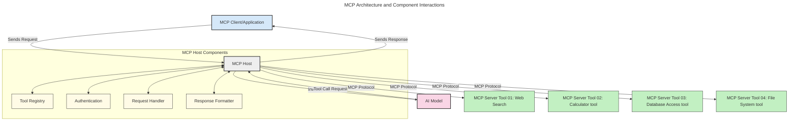
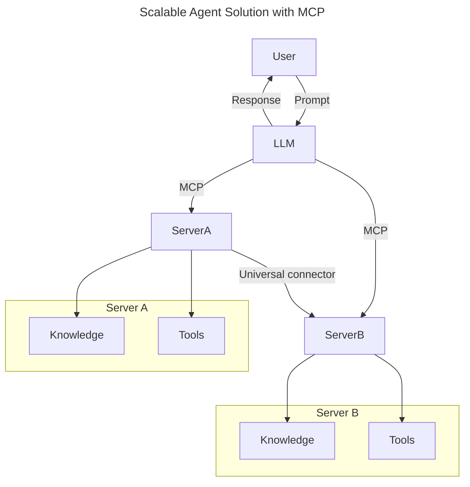

<!--
CO_OP_TRANSLATOR_METADATA:
{
  "original_hash": "9678e0c6945b8e0c23586869b0e26783",
  "translation_date": "2025-10-06T10:58:28+00:00",
  "source_file": "00-Introduction/README.md",
  "language_code": "pa"
}
-->
# ਮਾਡਲ ਕਾਂਟੈਕਸਟ ਪ੍ਰੋਟੋਕੋਲ (MCP) ਦਾ ਪਰਚੇ: ਵੱਡੇ ਪੈਮਾਨੇ ਦੇ AI ਐਪਲੀਕੇਸ਼ਨਾਂ ਲਈ ਇਸਦੀ ਮਹੱਤਤਾ

_(ਉਪਰ ਦਿੱਤੀ ਤਸਵੀਰ 'ਤੇ ਕਲਿਕ ਕਰਕੇ ਇਸ ਪਾਠ ਦਾ ਵੀਡੀਓ ਵੇਖੋ)_

ਜਨਰੇਟਿਵ AI ਐਪਲੀਕੇਸ਼ਨ ਇੱਕ ਵੱਡਾ ਕਦਮ ਅੱਗੇ ਵਧਾਉਂਦੇ ਹਨ ਕਿਉਂਕਿ ਇਹ ਅਕਸਰ ਯੂਜ਼ਰ ਨੂੰ ਕੁਦਰਤੀ ਭਾਸ਼ਾ ਪ੍ਰੋੰਪਟਾਂ ਦੀ ਵਰਤੋਂ ਕਰਕੇ ਐਪ ਨਾਲ ਇੰਟਰੈਕਟ ਕਰਨ ਦੀ ਆਗਿਆ ਦਿੰਦੇ ਹਨ। ਹਾਲਾਂਕਿ, ਜਿਵੇਂ ਜ਼ਿਆਦਾ ਸਮਾਂ ਅਤੇ ਸਰੋਤ ਇਨ੍ਹਾਂ ਐਪਸ ਵਿੱਚ ਲਗਾਏ ਜਾਂਦੇ ਹਨ, ਤੁਸੀਂ ਇਹ ਯਕੀਨੀ ਬਣਾਉਣਾ ਚਾਹੁੰਦੇ ਹੋ ਕਿ ਤੁਸੀਂ ਫੰਕਸ਼ਨਲਿਟੀ ਅਤੇ ਸਰੋਤਾਂ ਨੂੰ ਇਸ ਤਰੀਕੇ ਨਾਲ ਆਸਾਨੀ ਨਾਲ ਸ਼ਾਮਲ ਕਰ ਸਕਦੇ ਹੋ ਕਿ ਇਹ ਵਧਾਉਣ ਯੋਗ ਹੋਵੇ, ਤੁਹਾਡਾ ਐਪ ਇੱਕ ਤੋਂ ਵੱਧ ਮਾਡਲ ਦੀ ਵਰਤੋਂ ਕਰਨ ਦੇ ਯੋਗ ਹੋਵੇ, ਅਤੇ ਵੱਖ-ਵੱਖ ਮਾਡਲਾਂ ਦੀਆਂ ਜਟਿਲਤਾਵਾਂ ਨੂੰ ਸੰਭਾਲ ਸਕੇ। ਸਧਾਰਨ ਸ਼ਬਦਾਂ ਵਿੱਚ, ਜਨਰੇਟਿਵ AI ਐਪਸ ਬਣਾਉਣਾ ਸ਼ੁਰੂ ਕਰਨ ਲਈ ਆਸਾਨ ਹੈ, ਪਰ ਜਿਵੇਂ ਇਹ ਵਧਦੇ ਹਨ ਅਤੇ ਜਟਿਲ ਹੋ ਜਾਂਦੇ ਹਨ, ਤੁਹਾਨੂੰ ਇੱਕ ਆਰਕੀਟੈਕਚਰ ਨੂੰ ਪਰਿਭਾਸ਼ਿਤ ਕਰਨਾ ਸ਼ੁਰੂ ਕਰਨਾ ਪਵੇਗਾ ਅਤੇ ਸੰਭਵ ਹੈ ਕਿ ਤੁਹਾਨੂੰ ਇੱਕ ਮਿਆਰ 'ਤੇ ਨਿਰਭਰ ਕਰਨਾ ਪਵੇਗਾ ਤਾਂ ਜੋ ਤੁਹਾਡੇ ਐਪਸ ਇੱਕ ਸਥਿਰ ਤਰੀਕੇ ਨਾਲ ਬਣੇ ਹੋਣ। ਇਹ MCP ਹੈ ਜੋ ਚੀਜ਼ਾਂ ਨੂੰ ਸੰਗਠਿਤ ਕਰਨ ਅਤੇ ਇੱਕ ਮਿਆਰ ਪ੍ਰਦਾਨ ਕਰਨ ਵਿੱਚ ਮਦਦ ਕਰਦਾ ਹੈ।

---

## **🔍 ਮਾਡਲ ਕਾਂਟੈਕਸਟ ਪ੍ਰੋਟੋਕੋਲ (MCP) ਕੀ ਹੈ?**

**ਮਾਡਲ ਕਾਂਟੈਕਸਟ ਪ੍ਰੋਟੋਕੋਲ (MCP)** ਇੱਕ **ਖੁੱਲ੍ਹਾ, ਮਿਆਰੀਕ੍ਰਿਤ ਇੰਟਰਫੇਸ** ਹੈ ਜੋ ਵੱਡੇ ਭਾਸ਼ਾ ਮਾਡਲਾਂ (LLMs) ਨੂੰ ਬਾਹਰੀ ਟੂਲਾਂ, APIs, ਅਤੇ ਡਾਟਾ ਸਰੋਤਾਂ ਨਾਲ ਬਿਨਾਂ ਕਿਸੇ ਰੁਕਾਵਟ ਦੇ ਇੰਟਰੈਕਟ ਕਰਨ ਦੀ ਆਗਿਆ ਦਿੰਦਾ ਹੈ। ਇਹ ਇੱਕ ਸਥਿਰ ਆਰਕੀਟੈਕਚਰ ਪ੍ਰਦਾਨ ਕਰਦਾ ਹੈ ਜੋ AI ਮਾਡਲ ਦੀ ਕਾਰਗੁਜ਼ਾਰੀ ਨੂੰ ਉਸ ਦੇ ਟ੍ਰੇਨਿੰਗ ਡਾਟਾ ਤੋਂ ਪਰੇ ਵਧਾਉਂਦਾ ਹੈ, ਸਮਾਰਟ, ਵੱਡੇ ਪੈਮਾਨੇ ਦੇ, ਅਤੇ ਜ਼ਿਆਦਾ ਪ੍ਰਤੀਕ੍ਰਿਆਸ਼ੀਲ AI ਸਿਸਟਮ ਬਣਾਉਣ ਲਈ।

---

## **🎯 AI ਵਿੱਚ ਮਿਆਰੀਕਰਨ ਕਿਉਂ ਮਹੱਤਵਪੂਰਨ ਹੈ**

ਜਿਵੇਂ ਜਨਰੇਟਿਵ AI ਐਪਲੀਕੇਸ਼ਨ ਜਟਿਲ ਹੋ ਰਹੇ ਹਨ, ਇਹ ਮਿਆਰਾਂ ਨੂੰ ਅਪਨਾਉਣਾ ਜ਼ਰੂਰੀ ਹੈ ਜੋ **ਵੱਡੇ ਪੈਮਾਨੇ, ਵਧਾਉਣ ਯੋਗਤਾ, ਰੱਖ-ਰਖਾਵ ਯੋਗਤਾ,** ਅਤੇ **ਵੈਂਡਰ ਲਾਕ-ਇਨ ਤੋਂ ਬਚਾਉਣ** ਨੂੰ ਯਕੀਨੀ ਬਣਾਉਂਦੇ ਹਨ। MCP ਇਨ੍ਹਾਂ ਜ਼ਰੂਰਤਾਂ ਨੂੰ ਹੇਠਾਂ ਦਿੱਤੇ ਤਰੀਕੇ ਨਾਲ ਪੂਰਾ ਕਰਦਾ ਹੈ:

- ਮਾਡਲ-ਟੂਲ ਇੰਟੀਗ੍ਰੇਸ਼ਨ ਨੂੰ ਇੱਕਜੁਟ ਕਰਨਾ
- ਨਾਜ਼ੁਕ, ਇੱਕ-ਵਾਰ ਦੇ ਕਸਟਮ ਹੱਲਾਂ ਨੂੰ ਘਟਾਉਣਾ
- ਇੱਕ ਪਰਿਸਥਿਤੀ ਵਿੱਚ ਵੱਖ-ਵੱਖ ਵੈਂਡਰਾਂ ਦੇ ਮਾਡਲਾਂ ਨੂੰ ਸਹਿ-ਅਸਤਿਤਵ ਵਿੱਚ ਆਉਣ ਦੀ ਆਗਿਆ ਦੇਣਾ

**ਨੋਟ:** ਹਾਲਾਂਕਿ MCP ਆਪਣੇ ਆਪ ਨੂੰ ਇੱਕ ਖੁੱਲ੍ਹਾ ਮਿਆਰ ਦੱਸਦਾ ਹੈ, MCP ਨੂੰ IEEE, IETF, W3C, ISO ਜਾਂ ਕਿਸੇ ਹੋਰ ਮਿਆਰ ਸਰੀਰ ਦੁਆਰਾ ਮਿਆਰੀਕ੍ਰਿਤ ਕਰਨ ਦੀ ਕੋਈ ਯੋਜਨਾ ਨਹੀਂ ਹੈ।

---

## **📚 ਸਿੱਖਣ ਦੇ ਉਦੇਸ਼**

ਇਸ ਲੇਖ ਦੇ ਅੰਤ ਤੱਕ, ਤੁਸੀਂ ਇਹ ਕਰਨ ਦੇ ਯੋਗ ਹੋਵੋਗੇ:

- **ਮਾਡਲ ਕਾਂਟੈਕਸਟ ਪ੍ਰੋਟੋਕੋਲ (MCP)** ਅਤੇ ਇਸ ਦੇ ਵਰਤੋਂ ਦੇ ਕੇਸਾਂ ਨੂੰ ਪਰਿਭਾਸ਼ਿਤ ਕਰੋ
- ਸਮਝੋ ਕਿ MCP ਮਾਡਲ-ਟੂ-ਟੂਲ ਸੰਚਾਰ ਨੂੰ ਕਿਵੇਂ ਮਿਆਰੀਕ੍ਰਿਤ ਕਰਦਾ ਹੈ
- MCP ਆਰਕੀਟੈਕਚਰ ਦੇ ਮੁੱਖ ਘਟਕਾਂ ਦੀ ਪਛਾਣ ਕਰੋ
- ਐਨਟਰਪ੍ਰਾਈਜ਼ ਅਤੇ ਵਿਕਾਸ ਸੰਦਰਭਾਂ ਵਿੱਚ MCP ਦੇ ਅਸਲ-ਜਗ੍ਹਾ ਦੇ ਐਪਲੀਕੇਸ਼ਨਾਂ ਦੀ ਖੋਜ ਕਰੋ

---

## **💡 ਮਾਡਲ ਕਾਂਟੈਕਸਟ ਪ੍ਰੋਟੋਕੋਲ (MCP) ਕਿਉਂ ਇੱਕ ਗੇਮ-ਚੇਂਜਰ ਹੈ**

### **🔗 MCP AI ਇੰਟਰੈਕਸ਼ਨ ਵਿੱਚ ਫਰੈਗਮੈਂਟੇਸ਼ਨ ਨੂੰ ਹੱਲ ਕਰਦਾ ਹੈ**

MCP ਤੋਂ ਪਹਿਲਾਂ, ਮਾਡਲਾਂ ਨੂੰ ਟੂਲਾਂ ਨਾਲ ਇੰਟੀਗ੍ਰੇਟ ਕਰਨ ਲਈ ਲੋੜ ਹੁੰਦੀ ਸੀ:

- ਹਰ ਟੂਲ-ਮਾਡਲ ਜੋੜੇ ਲਈ ਕਸਟਮ ਕੋਡ
- ਹਰ ਵੈਂਡਰ ਲਈ ਗੈਰ-ਮਿਆਰੀ APIs
- ਅੱਪਡੇਟਾਂ ਦੇ ਕਾਰਨ ਅਕਸਰ ਟੁੱਟਣਾ
- ਵਧੇਰੇ ਟੂਲਾਂ ਨਾਲ ਖਰਾਬ ਵੱਡੇ ਪੈਮਾਨੇ ਦੀ ਯੋਗਤਾ

### **✅ MCP ਮਿਆਰੀਕਰਨ ਦੇ ਫਾਇਦੇ**

| **ਫਾਇਦਾ**                | **ਵੇਰਵਾ**                                                                      |
|--------------------------|--------------------------------------------------------------------------------|
| ਇੰਟਰਓਪਰੇਬਿਲਿਟੀ         | LLMs ਵੱਖ-ਵੱਖ ਵੈਂਡਰਾਂ ਦੇ ਟੂਲਾਂ ਨਾਲ ਬਿਨਾਂ ਕਿਸੇ ਰੁਕਾਵਟ ਦੇ ਕੰਮ ਕਰਦੇ ਹਨ            |
| ਸਥਿਰਤਾ                  | ਪਲੇਟਫਾਰਮਾਂ ਅਤੇ ਟੂਲਾਂ ਵਿੱਚ ਇੱਕਜੁਟ ਵਿਹਾਰ                                        |
| ਦੁਬਾਰਾ ਵਰਤਣ ਯੋਗਤਾ       | ਇੱਕ ਵਾਰ ਬਣਾਏ ਟੂਲ ਪ੍ਰਾਜੈਕਟਾਂ ਅਤੇ ਸਿਸਟਮਾਂ ਵਿੱਚ ਵਰਤੇ ਜਾ ਸਕਦੇ ਹਨ                  |
| ਤੇਜ਼ ਵਿਕਾਸ                | ਮਿਆਰੀਕ੍ਰਿਤ, ਪਲੱਗ-ਐਂਡ-ਪਲੇ ਇੰਟਰਫੇਸਾਂ ਦੀ ਵਰਤੋਂ ਕਰਕੇ ਵਿਕਾਸ ਸਮਾਂ ਘਟਾਉਣਾ          |

---

## **🧱 ਉੱਚ-ਪੱਧਰੀ MCP ਆਰਕੀਟੈਕਚਰ ਦਾ ਜਾਇਜ਼ਾ**

MCP ਇੱਕ **ਕਲਾਇੰਟ-ਸਰਵਰ ਮਾਡਲ** ਦੀ ਪਾਲਣਾ ਕਰਦਾ ਹੈ, ਜਿੱਥੇ:

- **MCP ਹੋਸਟ** AI ਮਾਡਲ ਚਲਾਉਂਦੇ ਹਨ
- **MCP ਕਲਾਇੰਟ** ਬੇਨਤੀ ਸ਼ੁਰੂ ਕਰਦੇ ਹਨ
- **MCP ਸਰਵਰ** ਸੰਦਰਭ, ਟੂਲ, ਅਤੇ ਯੋਗਤਾਵਾਂ ਪ੍ਰਦਾਨ ਕਰਦੇ ਹਨ

### **ਮੁੱਖ ਘਟਕਾਂ:**

- **ਸਰੋਤ** – ਮਾਡਲਾਂ ਲਈ ਸਥਿਰ ਜਾਂ ਗਤੀਸ਼ੀਲ ਡਾਟਾ  
- **ਪ੍ਰੋੰਪਟ** – ਨਿਰਧਾਰਤ ਵਰਕਫਲੋਜ਼ ਲਈ ਪੂਰਵ-ਨਿਰਧਾਰਿਤ ਪ੍ਰੋੰਪਟ  
- **ਟੂਲ** – ਖੋਜ, ਗਣਨਾਵਾਂ ਵਰਗੇ ਕਾਰਜਕਾਰੀ ਫੰਕਸ਼ਨ  
- **ਸੈਂਪਲਿੰਗ** – ਰਿਕਰਸਿਵ ਇੰਟਰੈਕਸ਼ਨ ਦੁਆਰਾ ਏਜੰਟਿਕ ਵਿਹਾਰ

---

## MCP ਸਰਵਰ ਕਿਵੇਂ ਕੰਮ ਕਰਦੇ ਹਨ

MCP ਸਰਵਰ ਹੇਠਾਂ ਦਿੱਤੇ ਤਰੀਕੇ ਨਾਲ ਕੰਮ ਕਰਦੇ ਹਨ:

- **ਬੇਨਤੀ ਦਾ ਪ੍ਰਵਾਹ**:
    1. ਇੱਕ ਬੇਨਤੀ ਅੰਤਮ ਯੂਜ਼ਰ ਜਾਂ ਉਸ ਦੇ ਵਤੀਰੇ ਕੰਮ ਕਰਨ ਵਾਲੇ ਸੌਫਟਵੇਅਰ ਦੁਆਰਾ ਸ਼ੁਰੂ ਕੀਤੀ ਜਾਂਦੀ ਹੈ।
    2. **MCP ਕਲਾਇੰਟ** ਬੇਨਤੀ ਨੂੰ **MCP ਹੋਸਟ** ਨੂੰ ਭੇਜਦਾ ਹੈ, ਜੋ AI ਮਾਡਲ ਰਨਟਾਈਮ ਦਾ ਪ੍ਰਬੰਧ ਕਰਦਾ ਹੈ।
    3. **AI ਮਾਡਲ** ਯੂਜ਼ਰ ਪ੍ਰੋੰਪਟ ਪ੍ਰਾਪਤ ਕਰਦਾ ਹੈ ਅਤੇ ਬਾਹਰੀ ਟੂਲਾਂ ਜਾਂ ਡਾਟਾ ਤੱਕ ਪਹੁੰਚ ਦੀ ਬੇਨਤੀ ਕਰ ਸਕਦਾ ਹੈ।
    4. **MCP ਹੋਸਟ**, ਮਾਡਲ ਸਿੱਧੇ ਤੌਰ 'ਤੇ ਨਹੀਂ, **MCP ਸਰਵਰ(ਜ਼)** ਨਾਲ ਮਿਆਰੀਕ੍ਰਿਤ ਪ੍ਰੋਟੋਕੋਲ ਦੀ ਵਰਤੋਂ ਕਰਕੇ ਸੰਚਾਰ ਕਰਦਾ ਹੈ।
- **MCP ਹੋਸਟ ਦੀ ਕਾਰਗੁਜ਼ਾਰੀ**:
    - **ਟੂਲ ਰਜਿਸਟਰੀ**: ਉਪਲਬਧ ਟੂਲਾਂ ਅਤੇ ਉਨ੍ਹਾਂ ਦੀਆਂ ਯੋਗਤਾਵਾਂ ਦੀ ਸੂਚੀ ਰੱਖਦਾ ਹੈ।
    - **ਪ੍ਰਮਾਣਿਕਤਾ**: ਟੂਲ ਪਹੁੰਚ ਲਈ ਅਨੁਮਤੀਆਂ ਦੀ ਜਾਂਚ ਕਰਦਾ ਹੈ।
    - **ਬੇਨਤੀ ਸੰਭਾਲਕ**: ਮਾਡਲ ਤੋਂ ਆਉਣ ਵਾਲੀਆਂ ਟੂਲ ਬੇਨਤੀਆਂ ਨੂੰ ਪ੍ਰਕਿਰਿਆ ਕਰਦਾ ਹੈ।
    - **ਜਵਾਬ ਫਾਰਮੈਟਰ**: ਟੂਲ ਆਉਟਪੁੱਟ ਨੂੰ ਇੱਕ ਫਾਰਮੈਟ ਵਿੱਚ ਬਣਾਉਂਦਾ ਹੈ ਜੋ ਮਾਡਲ ਸਮਝ ਸਕਦਾ ਹੈ।
- **MCP ਸਰਵਰ ਦੀ ਕਾਰਗੁਜ਼ਾਰੀ**:
    - **MCP ਹੋਸਟ** ਟੂਲ ਕਾਲਾਂ ਨੂੰ ਇੱਕ ਜਾਂ ਵੱਧ **MCP ਸਰਵਰ(ਜ਼)** ਨੂੰ ਰੂਟ ਕਰਦਾ ਹੈ, ਜੋ ਖੋਜ, ਗਣਨਾਵਾਂ, ਡਾਟਾਬੇਸ ਪੁੱਛਗਿੱਛ ਵਰਗੇ ਵਿਸ਼ੇਸ਼ ਫੰਕਸ਼ਨਾਂ ਨੂੰ ਉਜਾਗਰ ਕਰਦੇ ਹਨ।
    - **MCP ਸਰਵਰ(ਜ਼)** ਆਪਣੇ-ਆਪਣੇ ਕਾਰਜ ਕਰਦੇ ਹਨ ਅਤੇ **MCP ਹੋਸਟ** ਨੂੰ ਨਤੀਜੇ ਇੱਕ ਸਥਿਰ ਫਾਰਮੈਟ ਵਿੱਚ ਵਾਪਸ ਭੇਜਦੇ ਹਨ।
    - **MCP ਹੋਸਟ** ਇਨ੍ਹਾਂ ਨਤੀਜਿਆਂ ਨੂੰ ਫਾਰਮੈਟ ਕਰਦਾ ਹੈ ਅਤੇ **AI ਮਾਡਲ** ਨੂੰ ਵਾਪਸ ਭੇਜਦਾ ਹੈ।
- **ਜਵਾਬ ਪੂਰਾ ਹੋਣਾ**:
    - **AI ਮਾਡਲ** ਟੂਲ ਆਉਟਪੁੱਟ ਨੂੰ ਅੰਤਮ ਜਵਾਬ ਵਿੱਚ ਸ਼ਾਮਲ ਕਰਦਾ ਹੈ।
    - **MCP ਹੋਸਟ** ਇਸ ਜਵਾਬ ਨੂੰ **MCP ਕਲਾਇੰਟ** ਨੂੰ ਭੇਜਦਾ ਹੈ, ਜੋ ਇਸ ਨੂੰ ਅੰਤਮ ਯੂਜ਼ਰ ਜਾਂ ਕਾਲ ਕਰਨ ਵਾਲੇ ਸੌਫਟਵੇਅਰ ਨੂੰ ਪਹੁੰਚਾਉਂਦਾ ਹੈ।

## 👨‍💻 MCP ਸਰਵਰ ਬਣਾਉਣ ਦਾ ਤਰੀਕਾ (ਉਦਾਹਰਣਾਂ ਦੇ ਨਾਲ)

MCP ਸਰਵਰ LLM ਯੋਗਤਾਵਾਂ ਨੂੰ ਡਾਟਾ ਅਤੇ ਕਾਰਗੁਜ਼ਾਰੀ ਪ੍ਰਦਾਨ ਕਰਕੇ ਵਧਾਉਣ ਦੀ ਆਗਿਆ ਦਿੰਦੇ ਹਨ।

ਤਿਆਰ ਹੋ? ਹੇਠਾਂ ਦਿੱਤੇ ਭਾਸ਼ਾ ਜਾਂ ਸਟੈਕ ਵਿਸ਼ੇਸ਼ SDKs ਦੇ ਨਾਲ MCP ਸਰਵਰ ਬਣਾਉਣ ਦੇ ਸਧਾਰਨ ਉਦਾਹਰਣ ਹਨ:

- **Python SDK**: https://github.com/modelcontextprotocol/python-sdk

- **TypeScript SDK**: https://github.com/modelcontextprotocol/typescript-sdk

- **Java SDK**: https://github.com/modelcontextprotocol/java-sdk

- **C#/.NET SDK**: https://github.com/modelcontextprotocol/csharp-sdk

## 🌍 MCP ਦੇ ਅਸਲ-ਜਗ੍ਹਾ ਦੇ ਵਰਤੋਂ ਦੇ ਕੇਸ

MCP AI ਯੋਗਤਾਵਾਂ ਨੂੰ ਵਧਾਉਣ ਦੁਆਰਾ ਵੱਖ-ਵੱਖ ਐਪਲੀਕੇਸ਼ਨਾਂ ਨੂੰ ਯੋਗ ਬਣਾਉਂਦਾ ਹੈ:

| **ਐਪਲੀਕੇਸ਼ਨ**              | **ਵੇਰਵਾ**                                                                      |
|------------------------------|--------------------------------------------------------------------------------|
| ਐਨਟਰਪ੍ਰਾਈਜ਼ ਡਾਟਾ ਇੰਟੀਗ੍ਰੇਸ਼ਨ  | LLMs ਨੂੰ ਡਾਟਾਬੇਸ, CRM, ਜਾਂ ਅੰਦਰੂਨੀ ਟੂਲਾਂ ਨਾਲ ਜੋੜੋ                            |
| ਏਜੰਟਿਕ AI ਸਿਸਟਮ            | ਟੂਲ ਪਹੁੰਚ ਅਤੇ ਫੈਸਲੇ ਲੈਣ ਵਾਲੇ ਵਰਕਫਲੋਜ਼ ਨਾਲ ਸਵੈ-ਚਾਲਤ ਏਜੰਟ ਯੋਗ ਬਣਾਓ             |
| ਮਲਟੀ-ਮੋਡਲ ਐਪਲੀਕੇਸ਼ਨ         | ਇੱਕ ਇਕਜੁਟ AI ਐਪ ਵਿੱਚ ਟੈਕਸਟ, ਚਿੱਤਰ, ਅਤੇ ਆਡੀਓ ਟੂਲਾਂ ਨੂੰ ਜੋੜੋ                    |
| ਰੀਅਲ-ਟਾਈਮ ਡਾਟਾ ਇੰਟੀਗ੍ਰੇਸ਼ਨ   | AI ਇੰਟਰੈਕਸ਼ਨ ਵਿੱਚ ਲਾਈਵ ਡਾਟਾ ਲਿਆਓ ਤਾਂ ਜੋ ਜ਼ਿਆਦਾ ਸਹੀ ਅਤੇ ਮੌਜੂਦਾ ਨਤੀਜੇ ਪ੍ਰਦਾਨ ਕੀਤੇ ਜਾ ਸਕਣ |

### 🧠 MCP = AI ਇੰਟਰੈਕਸ਼ਨ ਲਈ ਯੂਨੀਵਰਸਲ ਮਿਆਰ

ਮਾਡਲ ਕਾਂਟੈਕਸਟ ਪ੍ਰੋਟੋਕੋਲ (MCP) AI ਇੰਟਰੈਕਸ਼ਨ ਲਈ ਇੱਕ ਯੂਨੀਵਰਸਲ ਮਿਆਰ ਵਜੋਂ ਕੰਮ ਕਰਦਾ ਹੈ, ਜਿਵੇਂ USB-C ਡਿਵਾਈਸਾਂ ਲਈ ਭੌਤਿਕ ਕਨੈਕਸ਼ਨਾਂ ਨੂੰ ਮਿਆਰੀਕ੍ਰਿਤ ਕਰਦਾ ਹੈ। AI ਦੀ ਦੁਨੀਆ ਵਿੱਚ, MCP ਇੱਕ ਸਥਿਰ ਇੰਟਰਫੇਸ ਪ੍ਰਦਾਨ ਕਰਦਾ ਹੈ, ਜੋ ਮਾਡਲਾਂ (ਕਲਾਇੰਟ) ਨੂੰ ਬਾਹਰੀ ਟੂਲਾਂ ਅਤੇ ਡਾਟਾ ਪ੍ਰਦਾਤਾਵਾਂ (ਸਰਵਰ) ਨਾਲ ਬਿਨਾਂ ਕਿਸੇ ਰੁਕਾਵਟ ਦੇ ਇੰਟੀਗ੍ਰੇਟ ਕਰਨ ਦੀ ਆਗਿਆ ਦਿੰਦਾ ਹੈ। ਇਹ ਹਰ API ਜਾਂ ਡਾਟਾ ਸਰੋਤ ਲਈ ਵੱਖ-ਵੱਖ, ਕਸਟਮ ਪ੍ਰੋਟੋਕੋਲ ਦੀ ਲੋੜ ਨੂੰ ਖਤਮ ਕਰਦਾ ਹੈ।

MCP ਦੇ ਅਧੀਨ, ਇੱਕ MCP-ਅਨੁਕੂਲ ਟੂਲ (ਜਿਸ ਨੂੰ MCP ਸਰਵਰ ਕਿਹਾ ਜਾਂਦਾ ਹੈ) ਇੱਕ ਸਥਿਰ ਮਿਆਰ ਦੀ ਪਾਲਣਾ ਕਰਦਾ ਹੈ। ਇਹ ਸਰਵਰ ਉਹ ਟੂਲ ਜਾਂ ਕਾਰਜ ਸੂਚੀਬੱਧ ਕਰ ਸਕਦੇ ਹਨ ਜੋ ਉਹ ਪ੍ਰਦਾਨ ਕਰਦੇ ਹਨ ਅਤੇ ਜਦੋਂ AI ਏਜੰਟ ਦੁਆਰਾ ਬੇਨਤੀ ਕੀਤੀ ਜਾਂਦੀ ਹੈ ਤਾਂ ਉਹ ਕਾਰਜ ਕਰਦੇ ਹਨ। MCP ਨੂੰ ਸਹਾਇਕ ਕਰਨ ਵਾਲੇ AI ਏਜੰਟ ਪਲੇਟਫਾਰਮ MCP ਸਰਵਰਾਂ ਤੋਂ ਉਪਲਬਧ ਟੂਲਾਂ ਦੀ ਖੋਜ ਕਰਨ ਅਤੇ ਇਸ ਮਿਆਰੀਕ੍ਰਿਤ ਪ੍ਰੋਟੋਕੋਲ ਦੁਆਰਾ ਉਨ੍ਹਾਂ ਨੂੰ ਕਾਲ ਕਰਨ ਦੇ ਯੋਗ ਹਨ।

### 💡 ਗਿਆਨ ਤੱਕ ਪਹੁੰਚ ਨੂੰ ਸਹਾਇਕ ਬਣਾਉਣਾ

ਟੂਲਾਂ ਦੀ ਪੇਸ਼ਕਸ਼ ਤੋਂ ਇਲਾਵਾ, MCP ਗਿਆਨ ਤੱਕ ਪਹੁੰਚ ਨੂੰ ਵੀ ਸਹਾਇਕ ਬਣਾਉਂਦਾ ਹੈ। ਇਹ ਐਪਲੀਕੇਸ਼ਨਾਂ ਨੂੰ ਵੱਡੇ ਭਾਸ਼ਾ ਮਾਡਲਾਂ (LLMs) ਨੂੰ ਵੱਖ-ਵੱਖ ਡਾਟਾ ਸਰੋਤਾਂ ਨਾਲ ਜੋੜ ਕੇ ਸੰਦਰਭ ਪ੍ਰਦਾਨ ਕਰਨ ਦੀ ਆਗਿਆ ਦਿੰਦਾ ਹੈ। ਉਦਾਹਰਣ ਲਈ, ਇੱਕ MCP ਸਰਵਰ ਇੱਕ ਕੰਪਨੀ ਦੇ ਦਸਤਾਵੇਜ਼ ਰਿਪੋਜ਼ਟਰੀ ਦਾ ਪ੍ਰਤੀਨਿਧਿਤਾ ਕਰ ਸਕਦਾ ਹੈ, ਜੋ ਏਜੰਟਾਂ ਨੂੰ ਮੰਗ 'ਤੇ ਸਬੰਧਤ ਜਾਣਕਾਰੀ ਪ੍ਰਾਪਤ ਕਰਨ ਦੀ ਆਗਿਆ ਦਿੰਦਾ ਹੈ। ਇੱਕ ਹੋਰ ਸਰਵਰ ਵਿਸ਼ੇਸ਼ ਕਾਰਜਾਂ ਨੂੰ ਸੰਭਾਲ ਸਕਦਾ ਹੈ ਜਿਵੇਂ ਈਮੇਲ ਭੇਜਣਾ ਜਾਂ ਰਿਕਾਰਡ ਅਪਡੇਟ ਕਰਨਾ। ਏਜੰਟ ਦੇ ਨਜ਼ਰੀਏ ਤੋਂ, ਇਹ ਸਿਰਫ਼ ਟੂਲ ਹਨ ਜੋ ਇਹ ਵਰਤ ਸਕਦਾ ਹੈ—ਕੁਝ ਟੂਲ ਡਾਟਾ (ਗਿਆਨ ਸੰਦਰਭ) ਵਾਪਸ ਕਰਦੇ ਹਨ, ਜਦਕਿ ਹੋਰ ਕਾਰਜ ਕਰਦੇ ਹਨ। MCP ਦੋਵਾਂ ਨੂੰ ਕੁਸ਼ਲਤਾਪੂਰਵਕ ਸੰਭਾਲਦਾ ਹੈ।

MCP ਸਰਵਰ ਨਾਲ ਜੁੜਨ ਵਾਲਾ ਇੱਕ ਏਜੰਟ ਸਥਿਰ ਫਾਰਮੈਟ ਦੁਆਰਾ ਸਰਵਰ ਦੀਆਂ ਉਪਲਬਧ ਯੋਗਤਾਵਾਂ ਅਤੇ ਪਹੁੰਚਯੋਗ ਡਾਟਾ ਨੂੰ ਆਪਣੇ ਆਪ ਸਿੱਖਦਾ ਹੈ। ਇਹ ਮਿਆਰੀਕ੍ਰਿਤਤਾ ਗਤੀਸ਼ੀਲ ਟੂਲ ਉਪਲਬਧਤਾ ਨੂੰ ਯੋਗ ਬਣਾਉਂਦੀ ਹੈ। ਉਦਾਹਰਣ ਲਈ, ਇੱਕ ਏਜੰਟ ਦੇ ਸਿਸਟਮ ਵਿੱਚ ਇੱਕ ਨਵਾਂ MCP ਸਰਵਰ ਸ਼ਾਮਲ ਕਰਨ ਨਾਲ ਇਸ ਦੇ ਫੰਕਸ਼ਨ ਤੁਰੰਤ ਵਰਤਣ ਯੋਗ ਬਣ ਜਾਂਦੇ ਹਨ ਬਿਨਾਂ ਏਜੰਟ ਦੇ ਨਿਰਦੇਸ਼ਾਂ ਨੂੰ ਹੋਰ ਕਸਟਮਾਈਜ਼ ਕਰਨ ਦੀ ਲੋੜ।

ਇਹ ਸਧਾਰਨ ਇੰਟੀਗ੍ਰੇਸ਼ਨ ਹੇਠਾਂ ਦਿੱਤੇ ਚਿੱਤਰ ਵਿੱਚ ਦਰਸਾਏ ਗਏ ਪ੍ਰਵਾਹ ਦੇ ਨਾਲ ਸੰਗਤ ਹੈ, ਜਿੱਥੇ ਸਰਵਰ ਟੂਲ ਅਤੇ ਗਿਆਨ ਦੋਵਾਂ ਪ੍ਰਦਾਨ ਕਰਦੇ ਹਨ, ਸਿਸਟਮਾਂ ਵਿੱਚ ਬਿਨਾਂ ਕਿਸੇ ਰੁਕਾਵਟ ਦੇ ਸਹਿਕਾਰ ਨੂੰ ਯਕੀਨੀ ਬਣਾਉਂਦੇ ਹਨ।

### 👉 ਉਦਾਹਰਣ: ਵੱਡੇ ਪੈਮਾਨੇ ਦਾ ਏਜੰਟ ਹੱਲ

ਯੂਨੀਵਰਸਲ ਕਨੈਕਟਰ MCP ਸਰਵਰਾਂ ਨੂੰ ਇੱਕ-ਦੂਜੇ ਨਾਲ ਸੰਚਾਰ ਕਰਨ ਅਤੇ

---

**ਅਸਵੀਕਰਤੀ**:  
ਇਹ ਦਸਤਾਵੇਜ਼ AI ਅਨੁਵਾਦ ਸੇਵਾ [Co-op Translator](https://github.com/Azure/co-op-translator) ਦੀ ਵਰਤੋਂ ਕਰਕੇ ਅਨੁਵਾਦ ਕੀਤਾ ਗਿਆ ਹੈ। ਹਾਲਾਂਕਿ ਅਸੀਂ ਸਹੀਤਾ ਲਈ ਯਤਨਸ਼ੀਲ ਹਾਂ, ਕਿਰਪਾ ਕਰਕੇ ਧਿਆਨ ਦਿਓ ਕਿ ਸਵੈਚਾਲਿਤ ਅਨੁਵਾਦਾਂ ਵਿੱਚ ਗਲਤੀਆਂ ਜਾਂ ਅਸੁੱਤੀਆਂ ਹੋ ਸਕਦੀਆਂ ਹਨ। ਇਸ ਦੀ ਮੂਲ ਭਾਸ਼ਾ ਵਿੱਚ ਮੌਜੂਦ ਅਸਲ ਦਸਤਾਵੇਜ਼ ਨੂੰ ਅਧਿਕਾਰਤ ਸਰੋਤ ਮੰਨਿਆ ਜਾਣਾ ਚਾਹੀਦਾ ਹੈ। ਮਹੱਤਵਪੂਰਨ ਜਾਣਕਾਰੀ ਲਈ, ਪੇਸ਼ੇਵਰ ਮਨੁੱਖੀ ਅਨੁਵਾਦ ਦੀ ਸਿਫਾਰਸ਼ ਕੀਤੀ ਜਾਂਦੀ ਹੈ। ਇਸ ਅਨੁਵਾਦ ਦੀ ਵਰਤੋਂ ਤੋਂ ਪੈਦਾ ਹੋਣ ਵਾਲੇ ਕਿਸੇ ਵੀ ਗਲਤਫਹਿਮੀ ਜਾਂ ਗਲਤ ਵਿਆਖਿਆ ਲਈ ਅਸੀਂ ਜ਼ਿੰਮੇਵਾਰ ਨਹੀਂ ਹਾਂ।