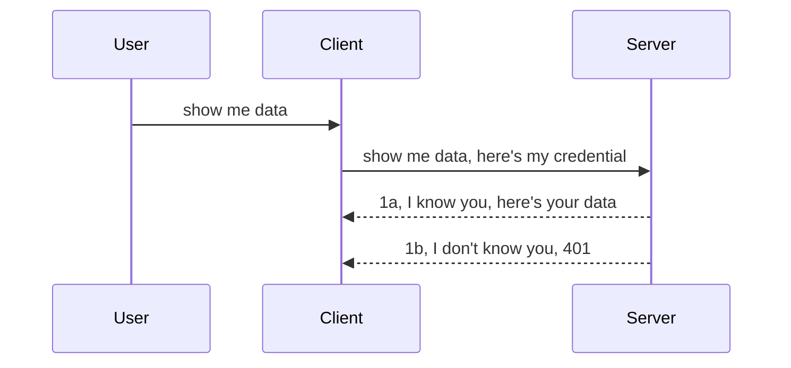

<!--
CO_OP_TRANSLATOR_METADATA:
{
  "original_hash": "5b00b8a8971a07d2d8803be4c9f138f8",
  "translation_date": "2025-10-07T00:44:54+00:00",
  "source_file": "03-GettingStarted/11-simple-auth/README.md",
  "language_code": "pa"
}
-->
# ਸਧਾਰਨ ਔਥ

MCP SDKs OAuth 2.1 ਦੀ ਵਰਤੋਂ ਦਾ ਸਮਰਥਨ ਕਰਦੇ ਹਨ, ਜੋ ਕਿ ਸੱਚਮੁੱਚ ਇੱਕ ਕਾਫ਼ੀ ਜਟਿਲ ਪ੍ਰਕਿਰਿਆ ਹੈ ਜਿਸ ਵਿੱਚ ਔਥ ਸਰਵਰ, ਰਿਸੋਰਸ ਸਰਵਰ, ਪ੍ਰਮਾਣ ਪੱਤਰ ਭੇਜਣ, ਕੋਡ ਪ੍ਰਾਪਤ ਕਰਨ, ਬੇਅਰਰ ਟੋਕਨ ਲਈ ਕੋਡ ਦਾ ਅਦਲ-ਬਦਲ ਕਰਨ ਅਤੇ ਆਖਿਰਕਾਰ ਆਪਣੇ ਰਿਸੋਰਸ ਡਾਟਾ ਨੂੰ ਪ੍ਰਾਪਤ ਕਰਨ ਵਰਗੇ ਧਾਰਨਾਵਾਂ ਸ਼ਾਮਲ ਹਨ। ਜੇ ਤੁਸੀਂ OAuth ਨਾਲ ਅਣਜਾਣ ਹੋ, ਜੋ ਲਾਗੂ ਕਰਨ ਲਈ ਇੱਕ ਸ਼ਾਨਦਾਰ ਚੀਜ਼ ਹੈ, ਤਾਂ ਸਧਾਰਨ ਔਥ ਨਾਲ ਸ਼ੁਰੂ ਕਰਨਾ ਅਤੇ ਬਿਹਤਰ ਸੁਰੱਖਿਆ ਵੱਲ ਅੱਗੇ ਵਧਣਾ ਇੱਕ ਵਧੀਆ ਵਿਚਾਰ ਹੈ। ਇਸੇ ਲਈ ਇਹ ਅਧਿਆਇ ਮੌਜੂਦ ਹੈ, ਤੁਹਾਨੂੰ ਉੱਚਤਮ ਔਥ ਤੱਕ ਪਹੁੰਚਾਉਣ ਲਈ।

## ਔਥ, ਅਸੀਂ ਕੀ ਮਤਲਬ ਲੈਂਦੇ ਹਾਂ?

ਔਥ ਦਾ ਅਰਥ ਹੈ ਪ੍ਰਮਾਣਿਕਤਾ ਅਤੇ ਅਧਿਕਾਰ। ਇਸ ਵਿਚਾਰ ਦਾ ਮਤਲਬ ਹੈ ਕਿ ਸਾਨੂੰ ਦੋ ਚੀਜ਼ਾਂ ਕਰਨ ਦੀ ਲੋੜ ਹੈ:

- **ਪ੍ਰਮਾਣਿਕਤਾ**, ਜੋ ਇਹ ਪਤਾ ਕਰਨ ਦੀ ਪ੍ਰਕਿਰਿਆ ਹੈ ਕਿ ਕੀ ਅਸੀਂ ਕਿਸੇ ਵਿਅਕਤੀ ਨੂੰ ਆਪਣੇ ਘਰ ਵਿੱਚ ਦਾਖਲ ਹੋਣ ਦੇਣਗੇ, ਕਿ ਉਹ "ਇੱਥੇ" ਹੋਣ ਦਾ ਅਧਿਕਾਰ ਰੱਖਦੇ ਹਨ, ਅਰਥਾਤ ਉਹਨਾਂ ਨੂੰ ਸਾਡੇ ਰਿਸੋਰਸ ਸਰਵਰ ਤੱਕ ਪਹੁੰਚ ਹੈ ਜਿੱਥੇ ਸਾਡੇ MCP ਸਰਵਰ ਫੀਚਰ ਹਨ।
- **ਅਧਿਕਾਰ**, ਇਹ ਪਤਾ ਕਰਨ ਦੀ ਪ੍ਰਕਿਰਿਆ ਹੈ ਕਿ ਕੀ ਉਪਭੋਗਤਾ ਨੂੰ ਉਹਨਾਂ ਖਾਸ ਰਿਸੋਰਸਾਂ ਤੱਕ ਪਹੁੰਚ ਹੋਣੀ ਚਾਹੀਦੀ ਹੈ ਜਿਨ੍ਹਾਂ ਦੀ ਉਹ ਮੰਗ ਕਰ ਰਹੇ ਹਨ, ਉਦਾਹਰਣ ਲਈ ਇਹ ਆਰਡਰ ਜਾਂ ਇਹ ਉਤਪਾਦ ਜਾਂ ਕੀ ਉਹ ਸਮੱਗਰੀ ਨੂੰ ਪੜ੍ਹਨ ਦੀ ਇਜਾਜ਼ਤ ਰੱਖਦੇ ਹਨ ਪਰ ਮਿਟਾਉਣ ਦੀ ਨਹੀਂ।

## ਪ੍ਰਮਾਣ ਪੱਤਰ: ਸਿਸਟਮ ਨੂੰ ਕਿਵੇਂ ਦੱਸਿਆ ਜਾਵੇ ਕਿ ਅਸੀਂ ਕੌਣ ਹਾਂ

ਅੱਛਾ, ਜ਼ਿਆਦਾਤਰ ਵੈੱਬ ਡਿਵੈਲਪਰ ਆਮ ਤੌਰ 'ਤੇ ਸਰਵਰ ਨੂੰ ਇੱਕ ਪ੍ਰਮਾਣ ਪੱਤਰ ਪ੍ਰਦਾਨ ਕਰਨ ਦੇ ਵਿਚਾਰ ਵਿੱਚ ਸ਼ੁਰੂ ਕਰਦੇ ਹਨ, ਆਮ ਤੌਰ 'ਤੇ ਇੱਕ ਰਾਜ਼ ਜੋ ਦੱਸਦਾ ਹੈ ਕਿ ਕੀ ਉਹ "ਪ੍ਰਮਾਣਿਕਤਾ" ਲਈ ਇੱਥੇ ਹੋਣ ਦੀ ਇਜਾਜ਼ਤ ਰੱਖਦੇ ਹਨ। ਇਹ ਪ੍ਰਮਾਣ ਪੱਤਰ ਆਮ ਤੌਰ 'ਤੇ ਯੂਜ਼ਰਨੇਮ ਅਤੇ ਪਾਸਵਰਡ ਦਾ ਬੇਸ64 ਕੋਡਿਤ ਸੰਸਕਰਣ ਜਾਂ ਇੱਕ API ਕੁੰਜੀ ਹੁੰਦੀ ਹੈ ਜੋ ਖਾਸ ਉਪਭੋਗਤਾ ਦੀ ਪਛਾਣ ਕਰਦੀ ਹੈ।

ਇਸ ਵਿੱਚ "Authorization" ਨਾਮਕ ਹੈਡਰ ਰਾਹੀਂ ਭੇਜਣਾ ਸ਼ਾਮਲ ਹੈ, ਜਿਵੇਂ:

```json
{ "Authorization": "secret123" }
```

ਇਸਨੂੰ ਆਮ ਤੌਰ 'ਤੇ ਬੇਸਿਕ ਔਥੈਂਟੀਕੇਸ਼ਨ ਕਿਹਾ ਜਾਂਦਾ ਹੈ। ਫਿਰ ਸਮੁੱਚੇ ਫਲੋ ਦਾ ਕੰਮ ਕਰਨ ਦਾ ਤਰੀਕਾ ਹੇਠਾਂ ਦਿੱਤੇ ਤਰੀਕੇ ਵਿੱਚ ਹੈ:



ਹੁਣ ਜਦੋਂ ਅਸੀਂ ਸਮਝ ਗਏ ਕਿ ਇਹ ਫਲੋ ਦੇ ਨਜ਼ਰੀਏ ਤੋਂ ਕਿਵੇਂ ਕੰਮ ਕਰਦਾ ਹੈ, ਤਾਂ ਅਸੀਂ ਇਸਨੂੰ ਕਿਵੇਂ ਲਾਗੂ ਕਰਦੇ ਹਾਂ? ਅੱਛਾ, ਜ਼ਿਆਦਾਤਰ ਵੈੱਬ ਸਰਵਰਾਂ ਵਿੱਚ ਮਿਡਲਵੇਅਰ ਦਾ ਇੱਕ ਧਾਰਨਾ ਹੁੰਦੀ ਹੈ, ਇੱਕ ਕੋਡ ਦਾ ਟੁਕੜਾ ਜੋ ਬੇਨਤੀ ਦੇ ਹਿੱਸੇ ਵਜੋਂ ਚਲਦਾ ਹੈ ਜੋ ਪ੍ਰਮਾਣ ਪੱਤਰਾਂ ਦੀ ਜਾਂਚ ਕਰ ਸਕਦਾ ਹੈ, ਅਤੇ ਜੇ ਪ੍ਰਮਾਣ ਪੱਤਰ ਵੈਧ ਹਨ ਤਾਂ ਬੇਨਤੀ ਨੂੰ ਅੱਗੇ ਵਧਣ ਦੇ ਸਕਦਾ ਹੈ। ਜੇ ਬੇਨਤੀ ਵਿੱਚ ਵੈਧ ਪ੍ਰਮਾਣ ਪੱਤਰ ਨਹੀਂ ਹਨ ਤਾਂ ਤੁਹਾਨੂੰ ਔਥ ਐਰਰ ਮਿਲਦਾ ਹੈ। ਆਓ ਵੇਖੀਏ ਕਿ ਇਹ ਕਿਵੇਂ ਲਾਗੂ ਕੀਤਾ ਜਾ ਸਕਦਾ ਹੈ:

**Python**

```python
class AuthMiddleware(BaseHTTPMiddleware):
    async def dispatch(self, request, call_next):

        has_header = request.headers.get("Authorization")
        if not has_header:
            print("-> Missing Authorization header!")
            return Response(status_code=401, content="Unauthorized")

        if not valid_token(has_header):
            print("-> Invalid token!")
            return Response(status_code=403, content="Forbidden")

        print("Valid token, proceeding...")
       
        response = await call_next(request)
        # add any customer headers or change in the response in some way
        return response


starlette_app.add_middleware(CustomHeaderMiddleware)
```

ਇੱਥੇ ਅਸੀਂ:

- ਇੱਕ ਮਿਡਲਵੇਅਰ ਬਣਾਇਆ ਜਿਸਨੂੰ `AuthMiddleware` ਕਿਹਾ ਜਾਂਦਾ ਹੈ ਜਿਸਦਾ `dispatch` ਮੈਥਡ ਵੈੱਬ ਸਰਵਰ ਦੁਆਰਾ ਚਲਾਇਆ ਜਾ ਰਿਹਾ ਹੈ।
- ਮਿਡਲਵੇਅਰ ਨੂੰ ਵੈੱਬ ਸਰਵਰ ਵਿੱਚ ਸ਼ਾਮਲ ਕੀਤਾ:

    ```python
    starlette_app.add_middleware(AuthMiddleware)
    ```

- ਵੈਧਤਾ ਲਾਜ਼ਿਕ ਲਿਖੀ ਜੋ ਜਾਂਚਦੀ ਹੈ ਕਿ Authorization ਹੈਡਰ ਮੌਜੂਦ ਹੈ ਅਤੇ ਕੀ ਭੇਜਿਆ ਜਾ ਰਿਹਾ ਰਾਜ਼ ਵੈਧ ਹੈ:

    ```python
    has_header = request.headers.get("Authorization")
    if not has_header:
        print("-> Missing Authorization header!")
        return Response(status_code=401, content="Unauthorized")

    if not valid_token(has_header):
        print("-> Invalid token!")
        return Response(status_code=403, content="Forbidden")
    ```

    ਜੇ ਰਾਜ਼ ਮੌਜੂਦ ਹੈ ਅਤੇ ਵੈਧ ਹੈ ਤਾਂ ਅਸੀਂ ਬੇਨਤੀ ਨੂੰ `call_next` ਕਹਿ ਕੇ ਅੱਗੇ ਵਧਣ ਦਿੰਦੇ ਹਾਂ ਅਤੇ ਜਵਾਬ ਵਾਪਸ ਕਰਦੇ ਹਾਂ।

    ```python
    response = await call_next(request)
    # add any customer headers or change in the response in some way
    return response
    ```

ਇਹ ਕਿਵੇਂ ਕੰਮ ਕਰਦਾ ਹੈ ਕਿ ਜੇ ਵੈੱਬ ਬੇਨਤੀ ਸਰਵਰ ਵੱਲ ਕੀਤੀ ਜਾਂਦੀ ਹੈ ਤਾਂ ਮਿਡਲਵੇਅਰ ਚਲਾਇਆ ਜਾਵੇਗਾ ਅਤੇ ਇਸਦੀ ਲਾਗੂ ਕਰਨ ਦੀ ਪ੍ਰਕਿਰਿਆ ਦੇ ਅਨੁਸਾਰ ਇਹ ਜਾਂ ਤਾਂ ਬੇਨਤੀ ਨੂੰ ਅੱਗੇ ਵਧਣ ਦੇਵੇਗਾ ਜਾਂ ਇੱਕ ਐਰਰ ਵਾਪਸ ਕਰੇਗਾ ਜੋ ਦਰਸਾਉਂਦਾ ਹੈ ਕਿ ਕਲਾਇੰਟ ਅੱਗੇ ਵਧਣ ਦੀ ਇਜਾਜ਼ਤ ਨਹੀਂ ਰੱਖਦਾ।

**TypeScript**

ਇੱਥੇ ਅਸੀਂ ਪ੍ਰਸਿੱਧ ਫਰੇਮਵਰਕ Express ਨਾਲ ਇੱਕ ਮਿਡਲਵੇਅਰ ਬਣਾਉਂਦੇ ਹਾਂ ਅਤੇ ਬੇਨਤੀ ਨੂੰ MCP ਸਰਵਰ ਤੱਕ ਪਹੁੰਚਣ ਤੋਂ ਪਹਿਲਾਂ ਰੋਕਦੇ ਹਾਂ। ਇਸ ਲਈ ਕੋਡ ਹੇਠਾਂ ਦਿੱਤਾ ਗਿਆ ਹੈ:

```typescript
function isValid(secret) {
    return secret === "secret123";
}

app.use((req, res, next) => {
    // 1. Authorization header present?  
    if(!req.headers["Authorization"]) {
        res.status(401).send('Unauthorized');
    }
    
    let token = req.headers["Authorization"];

    // 2. Check validity.
    if(!isValid(token)) {
        res.status(403).send('Forbidden');
    }

   
    console.log('Middleware executed');
    // 3. Passes request to the next step in the request pipeline.
    next();
});
```

ਇਸ ਕੋਡ ਵਿੱਚ ਅਸੀਂ:

1. ਜਾਂਚਦੇ ਹਾਂ ਕਿ Authorization ਹੈਡਰ ਮੌਜੂਦ ਹੈ ਜਾਂ ਨਹੀਂ, ਜੇ ਨਹੀਂ, ਤਾਂ ਅਸੀਂ 401 ਐਰਰ ਭੇਜਦੇ ਹਾਂ।
2. ਯਕੀਨੀ ਬਣਾਉਂਦੇ ਹਾਂ ਕਿ ਪ੍ਰਮਾਣ ਪੱਤਰ/ਟੋਕਨ ਵੈਧ ਹੈ, ਜੇ ਨਹੀਂ, ਤਾਂ ਅਸੀਂ 403 ਐਰਰ ਭੇਜਦੇ ਹਾਂ।
3. ਆਖਿਰਕਾਰ ਬੇਨਤੀ ਨੂੰ ਬੇਨਤੀ ਪਾਈਪਲਾਈਨ ਵਿੱਚ ਅੱਗੇ ਵਧਾਉਂਦੇ ਹਾਂ ਅਤੇ ਮੰਗਿਆ ਗਿਆ ਰਿਸੋਰਸ ਵਾਪਸ ਕਰਦੇ ਹਾਂ।

## ਅਭਿਆਸ: ਔਥੈਂਟੀਕੇਸ਼ਨ ਲਾਗੂ ਕਰੋ

ਆਓ ਆਪਣੀ ਜਾਣਕਾਰੀ ਲੈ ਕੇ ਇਸਨੂੰ ਲਾਗੂ ਕਰਨ ਦੀ ਕੋਸ਼ਿਸ਼ ਕਰੀਏ। ਯੋਜਨਾ ਹੇਠਾਂ ਦਿੱਤੀ ਗਈ ਹੈ:

ਸਰਵਰ

- ਇੱਕ ਵੈੱਬ ਸਰਵਰ ਅਤੇ MCP ਇੰਸਟੈਂਸ ਬਣਾਓ।
- ਸਰਵਰ ਲਈ ਇੱਕ ਮਿਡਲਵੇਅਰ ਲਾਗੂ ਕਰੋ।

ਕਲਾਇੰਟ 

- ਹੈਡਰ ਰਾਹੀਂ ਪ੍ਰਮਾਣ ਪੱਤਰ ਦੇ ਨਾਲ ਵੈੱਬ ਬੇਨਤੀ ਭੇਜੋ।

### -1- ਇੱਕ ਵੈੱਬ ਸਰਵਰ ਅਤੇ MCP ਇੰਸਟੈਂਸ ਬਣਾਓ

ਸਾਡੇ ਪਹਿਲੇ ਕਦਮ ਵਿੱਚ, ਸਾਨੂੰ ਵੈੱਬ ਸਰਵਰ ਇੰਸਟੈਂਸ ਅਤੇ MCP ਸਰਵਰ ਬਣਾਉਣ ਦੀ ਲੋੜ ਹੈ।

**Python**

ਇੱਥੇ ਅਸੀਂ ਇੱਕ MCP ਸਰਵਰ ਇੰਸਟੈਂਸ ਬਣਾਉਂਦੇ ਹਾਂ, ਇੱਕ starlette ਵੈੱਬ ਐਪ ਬਣਾਉਂਦੇ ਹਾਂ ਅਤੇ ਇਸਨੂੰ uvicorn ਨਾਲ ਹੋਸਟ ਕਰਦੇ ਹਾਂ।

```python
# creating MCP Server

app = FastMCP(
    name="MCP Resource Server",
    instructions="Resource Server that validates tokens via Authorization Server introspection",
    host=settings["host"],
    port=settings["port"],
    debug=True
)

# creating starlette web app
starlette_app = app.streamable_http_app()

# serving app via uvicorn
async def run(starlette_app):
    import uvicorn
    config = uvicorn.Config(
            starlette_app,
            host=app.settings.host,
            port=app.settings.port,
            log_level=app.settings.log_level.lower(),
        )
    server = uvicorn.Server(config)
    await server.serve()

run(starlette_app)
```

ਇਸ ਕੋਡ ਵਿੱਚ ਅਸੀਂ:

- MCP ਸਰਵਰ ਬਣਾਇਆ।
- MCP ਸਰਵਰ ਤੋਂ starlette ਵੈੱਬ ਐਪ ਬਣਾਈ, `app.streamable_http_app()`।
- uvicorn ਦੀ ਵਰਤੋਂ ਕਰਕੇ ਵੈੱਬ ਐਪ ਨੂੰ ਹੋਸਟ ਅਤੇ ਸਰਵ ਕੀਤਾ `server.serve()`।

**TypeScript**

ਇੱਥੇ ਅਸੀਂ ਇੱਕ MCP ਸਰਵਰ ਇੰਸਟੈਂਸ ਬਣਾਉਂਦੇ ਹਾਂ।

```typescript
const server = new McpServer({
      name: "example-server",
      version: "1.0.0"
    });

    // ... set up server resources, tools, and prompts ...
```

ਇਹ MCP ਸਰਵਰ ਬਣਾਉਣ ਦੀ ਲੋੜ ਸਾਡੇ POST /mcp ਰੂਟ ਪਰਿਭਾਸ਼ਾ ਦੇ ਅੰਦਰ ਹੋਵੇਗੀ, ਇਸ ਲਈ ਆਓ ਉਪਰੋਕਤ ਕੋਡ ਨੂੰ ਹੇਠਾਂ ਦਿੱਤੇ ਤਰੀਕੇ ਨਾਲ ਮੋੜੀਏ:

```typescript
import express from "express";
import { randomUUID } from "node:crypto";
import { McpServer } from "@modelcontextprotocol/sdk/server/mcp.js";
import { StreamableHTTPServerTransport } from "@modelcontextprotocol/sdk/server/streamableHttp.js";
import { isInitializeRequest } from "@modelcontextprotocol/sdk/types.js"

const app = express();
app.use(express.json());

// Map to store transports by session ID
const transports: { [sessionId: string]: StreamableHTTPServerTransport } = {};

// Handle POST requests for client-to-server communication
app.post('/mcp', async (req, res) => {
  // Check for existing session ID
  const sessionId = req.headers['mcp-session-id'] as string | undefined;
  let transport: StreamableHTTPServerTransport;

  if (sessionId && transports[sessionId]) {
    // Reuse existing transport
    transport = transports[sessionId];
  } else if (!sessionId && isInitializeRequest(req.body)) {
    // New initialization request
    transport = new StreamableHTTPServerTransport({
      sessionIdGenerator: () => randomUUID(),
      onsessioninitialized: (sessionId) => {
        // Store the transport by session ID
        transports[sessionId] = transport;
      },
      // DNS rebinding protection is disabled by default for backwards compatibility. If you are running this server
      // locally, make sure to set:
      // enableDnsRebindingProtection: true,
      // allowedHosts: ['127.0.0.1'],
    });

    // Clean up transport when closed
    transport.onclose = () => {
      if (transport.sessionId) {
        delete transports[transport.sessionId];
      }
    };
    const server = new McpServer({
      name: "example-server",
      version: "1.0.0"
    });

    // ... set up server resources, tools, and prompts ...

    // Connect to the MCP server
    await server.connect(transport);
  } else {
    // Invalid request
    res.status(400).json({
      jsonrpc: '2.0',
      error: {
        code: -32000,
        message: 'Bad Request: No valid session ID provided',
      },
      id: null,
    });
    return;
  }

  // Handle the request
  await transport.handleRequest(req, res, req.body);
});

// Reusable handler for GET and DELETE requests
const handleSessionRequest = async (req: express.Request, res: express.Response) => {
  const sessionId = req.headers['mcp-session-id'] as string | undefined;
  if (!sessionId || !transports[sessionId]) {
    res.status(400).send('Invalid or missing session ID');
    return;
  }
  
  const transport = transports[sessionId];
  await transport.handleRequest(req, res);
};

// Handle GET requests for server-to-client notifications via SSE
app.get('/mcp', handleSessionRequest);

// Handle DELETE requests for session termination
app.delete('/mcp', handleSessionRequest);

app.listen(3000);
```

ਹੁਣ ਤੁਸੀਂ ਵੇਖਦੇ ਹੋ ਕਿ MCP ਸਰਵਰ ਬਣਾਉਣ ਨੂੰ `app.post("/mcp")` ਦੇ ਅੰਦਰ ਮੋੜਿਆ ਗਿਆ।

ਆਓ ਮਿਡਲਵੇਅਰ ਬਣਾਉਣ ਦੇ ਅਗਲੇ ਕਦਮ ਵੱਲ ਵਧੀਏ ਤਾਂ ਕਿ ਅਸੀਂ ਆਉਣ ਵਾਲੇ ਪ੍ਰਮਾਣ ਪੱਤਰ ਦੀ ਜਾਂਚ ਕਰ ਸਕੀਏ।

### -2- ਸਰਵਰ ਲਈ ਇੱਕ ਮਿਡਲਵੇਅਰ ਲਾਗੂ ਕਰੋ

ਆਓ ਅਗਲੇ ਹਿੱਸੇ ਵਿੱਚ ਮਿਡਲਵੇਅਰ ਬਣਾਉਣ ਦੀ ਕੋਸ਼ਿਸ਼ ਕਰੀਏ। ਇੱਥੇ ਅਸੀਂ ਇੱਕ ਮਿਡਲਵੇਅਰ ਬਣਾਉਣ ਜਾ ਰਹੇ ਹਾਂ ਜੋ `Authorization` ਹੈਡਰ ਵਿੱਚ ਪ੍ਰਮਾਣ ਪੱਤਰ ਦੀ ਭਾਲ ਕਰਦਾ ਹੈ ਅਤੇ ਇਸਨੂੰ ਵੈਧ ਕਰਦਾ ਹੈ। ਜੇ ਇਹ ਸਵੀਕਾਰਯੋਗ ਹੈ ਤਾਂ ਬੇਨਤੀ ਅੱਗੇ ਵਧੇਗੀ ਅਤੇ ਜੋ ਕੁਝ ਕਰਨ ਦੀ ਲੋੜ ਹੈ (ਉਦਾਹਰਣ ਲਈ ਸੰਦਾਂ ਦੀ ਸੂਚੀ, ਰਿਸੋਰਸ ਪੜ੍ਹੋ ਜਾਂ ਜੋ ਕੁਝ MCP ਫੰਕਸ਼ਨਲਿਟੀ ਕਲਾਇੰਟ ਮੰਗ ਰਿਹਾ ਹੈ)।

**Python**

ਮਿਡਲਵੇਅਰ ਬਣਾਉਣ ਲਈ, ਸਾਨੂੰ ਇੱਕ ਕਲਾਸ ਬਣਾਉਣ ਦੀ ਲੋੜ ਹੈ ਜੋ `BaseHTTPMiddleware` ਤੋਂ ਵਾਰਸ ਹੁੰਦੀ ਹੈ। ਦੋ ਦਿਲਚਸਪ ਹਿੱਸੇ ਹਨ:

- ਬੇਨਤੀ `request`, ਜਿਸ ਤੋਂ ਅਸੀਂ ਹੈਡਰ ਜਾਣਕਾਰੀ ਪੜ੍ਹਦੇ ਹਾਂ।
- `call_next` ਕਾਲਬੈਕ ਜਿਸਨੂੰ ਸੱਦਣ ਦੀ ਲੋੜ ਹੈ ਜੇ ਕਲਾਇੰਟ ਨੇ ਇੱਕ ਪ੍ਰਮਾਣ ਪੱਤਰ ਲਿਆ ਹੈ ਜਿਸਨੂੰ ਅਸੀਂ ਸਵੀਕਾਰ ਕਰਦੇ ਹਾਂ।

ਸਭ ਤੋਂ ਪਹਿਲਾਂ, ਸਾਨੂੰ ਇਸ ਮਾਮਲੇ ਨੂੰ ਸੰਭਾਲਣ ਦੀ ਲੋੜ ਹੈ ਜੇ `Authorization` ਹੈਡਰ ਗੁੰਮ ਹੈ:

```python
has_header = request.headers.get("Authorization")

# no header present, fail with 401, otherwise move on.
if not has_header:
    print("-> Missing Authorization header!")
    return Response(status_code=401, content="Unauthorized")
```

ਇੱਥੇ ਅਸੀਂ 401 ਅਨਅਥਰਾਈਜ਼ਡ ਸੁਨੇਹਾ ਭੇਜਦੇ ਹਾਂ ਕਿਉਂਕਿ ਕਲਾਇੰਟ ਔਥੈਂਟੀਕੇਸ਼ਨ ਵਿੱਚ ਫੇਲ੍ਹ ਹੋ ਰਿਹਾ ਹੈ।

ਅਗਲੇ, ਜੇ ਇੱਕ ਪ੍ਰਮਾਣ ਪੱਤਰ ਪੇਸ਼ ਕੀਤਾ ਗਿਆ ਸੀ, ਤਾਂ ਸਾਨੂੰ ਇਸਦੀ ਵੈਧਤਾ ਦੀ ਜਾਂਚ ਕਰਨ ਦੀ ਲੋੜ ਹੈ:

```python
 if not valid_token(has_header):
    print("-> Invalid token!")
    return Response(status_code=403, content="Forbidden")
```

ਨੋਟ ਕਰੋ ਕਿ ਅਸੀਂ ਉਪਰ 403 ਫੋਰਬਿਡਨ ਸੁਨੇਹਾ ਭੇਜਦੇ ਹਾਂ। ਆਓ ਹੇਠਾਂ ਪੂਰਾ ਮਿਡਲਵੇਅਰ ਵੇਖੀਏ ਜੋ ਉਪਰੋਕਤ ਸਾਰੇ ਹਿੱਸਿਆਂ ਨੂੰ ਲਾਗੂ ਕਰਦਾ ਹੈ:

```python
class AuthMiddleware(BaseHTTPMiddleware):
    async def dispatch(self, request, call_next):

        has_header = request.headers.get("Authorization")
        if not has_header:
            print("-> Missing Authorization header!")
            return Response(status_code=401, content="Unauthorized")

        if not valid_token(has_header):
            print("-> Invalid token!")
            return Response(status_code=403, content="Forbidden")

        print("Valid token, proceeding...")
        print(f"-> Received {request.method} {request.url}")
        response = await call_next(request)
        response.headers['Custom'] = 'Example'
        return response

```

ਵਧੀਆ, ਪਰ `valid_token` ਫੰਕਸ਼ਨ ਬਾਰੇ ਕੀ? ਇਹ ਹੇਠਾਂ ਦਿੱਤਾ ਗਿਆ ਹੈ:

```python
# DON'T use for production - improve it !!
def valid_token(token: str) -> bool:
    # remove the "Bearer " prefix
    if token.startswith("Bearer "):
        token = token[7:]
        return token == "secret-token"
    return False
```

ਇਸਨੂੰ ਸਪਸ਼ਟ ਤੌਰ 'ਤੇ ਸੁਧਾਰਿਆ ਜਾਣਾ ਚਾਹੀਦਾ ਹੈ।

ਮਹੱਤਵਪੂਰਨ: ਤੁਹਾਨੂੰ ਕਦੇ ਵੀ ਕੋਡ ਵਿੱਚ ਰਾਜ਼ ਨਹੀਂ ਰੱਖਣਾ ਚਾਹੀਦਾ। ਤੁਹਾਨੂੰ ਆਦਰਸ਼ ਤੌਰ 'ਤੇ ਮੁਕਾਬਲੇ ਲਈ ਮੁੱਲ ਨੂੰ ਡਾਟਾ ਸਰੋਤ ਜਾਂ IDP (ਪਛਾਣ ਸੇਵਾ ਪ੍ਰਦਾਤਾ) ਤੋਂ ਪ੍ਰਾਪਤ ਕਰਨਾ ਚਾਹੀਦਾ ਹੈ ਜਾਂ ਇਸ ਤੋਂ ਵੀ ਵਧੀਆ, IDP ਨੂੰ ਵੈਧਤਾ ਕਰਨ ਦਿਓ।

**TypeScript**

ਇਸਨੂੰ Express ਨਾਲ ਲਾਗੂ ਕਰਨ ਲਈ, ਸਾਨੂੰ `use` ਮੈਥਡ ਨੂੰ ਕਾਲ ਕਰਨ ਦੀ ਲੋੜ ਹੈ ਜੋ ਮਿਡਲਵੇਅਰ ਫੰਕਸ਼ਨਾਂ ਨੂੰ ਲੈਂਦਾ ਹੈ।

ਸਾਨੂੰ:

- ਬੇਨਤੀ ਵੈਰੀਏਬਲ ਨਾਲ ਸੰਚਾਰ ਕਰਨ ਦੀ ਲੋੜ ਹੈ ਤਾਂ ਕਿ `Authorization` ਪ੍ਰਾਪਰਟੀ ਵਿੱਚ ਭੇਜੇ ਗਏ ਪ੍ਰਮਾਣ ਪੱਤਰ ਦੀ ਜਾਂਚ ਕੀਤੀ ਜਾ ਸਕੇ।
- ਪ੍ਰਮਾਣ ਪੱਤਰ ਦੀ ਵੈਧਤਾ ਕਰੋ, ਅਤੇ ਜੇ ਇਹ ਸਹੀ ਹੈ ਤਾਂ ਬੇਨਤੀ ਨੂੰ ਅੱਗੇ ਵਧਣ ਦਿਓ ਅਤੇ ਕਲਾਇੰਟ ਦੀ MCP ਬੇਨਤੀ ਨੂੰ ਉਹ ਕਰਨ ਦਿਓ ਜੋ ਇਸਨੂੰ ਕਰਨਾ ਚਾਹੀਦਾ ਹੈ (ਉਦਾਹਰਣ ਲਈ ਸੰਦਾਂ ਦੀ ਸੂਚੀ, ਰਿਸੋਰਸ ਪੜ੍ਹੋ ਜਾਂ ਕੋਈ ਹੋਰ MCP ਸੰਬੰਧਿਤ)।

ਇੱਥੇ, ਅਸੀਂ ਜਾਂਚਦੇ ਹਾਂ ਕਿ `Authorization` ਹੈਡਰ ਮੌਜੂਦ ਹੈ ਜਾਂ ਨਹੀਂ ਅਤੇ ਜੇ ਨਹੀਂ, ਤਾਂ ਅਸੀਂ ਬੇਨਤੀ ਨੂੰ ਅੱਗੇ ਵਧਣ ਤੋਂ ਰੋਕਦੇ ਹਾਂ:

```typescript
if(!req.headers["authorization"]) {
    res.status(401).send('Unauthorized');
    return;
}
```

ਜੇ ਹੈਡਰ ਪਹਿਲਾਂ ਭੇਜਿਆ ਨਹੀਂ ਗਿਆ, ਤਾਂ ਤੁਹਾਨੂੰ 401 ਮਿਲਦਾ ਹੈ।

ਅਗਲੇ, ਅਸੀਂ ਜਾਂਚਦੇ ਹਾਂ ਕਿ ਪ੍ਰਮਾਣ ਪੱਤਰ ਵੈਧ ਹੈ ਜਾਂ ਨਹੀਂ, ਜੇ ਨਹੀਂ ਤਾਂ ਅਸੀਂ ਬੇਨਤੀ ਨੂੰ ਰੋਕਦੇ ਹਾਂ ਪਰ ਥੋੜ੍ਹੇ ਵੱਖਰੇ ਸੁਨੇਹੇ ਨਾਲ:

```typescript
if(!isValid(token)) {
    res.status(403).send('Forbidden');
    return;
} 
```

ਨੋਟ ਕਰੋ ਕਿ ਹੁਣ ਤੁਹਾਨੂੰ 403 ਐਰਰ ਮਿਲਦਾ ਹੈ।

ਇੱਥੇ ਪੂਰਾ ਕੋਡ ਹੈ:

```typescript
app.use((req, res, next) => {
    console.log('Request received:', req.method, req.url, req.headers);
    console.log('Headers:', req.headers["authorization"]);
    if(!req.headers["authorization"]) {
        res.status(401).send('Unauthorized');
        return;
    }
    
    let token = req.headers["authorization"];

    if(!isValid(token)) {
        res.status(403).send('Forbidden');
        return;
    }  

    console.log('Middleware executed');
    next();
});
```

ਅਸੀਂ ਵੈੱਬ ਸਰਵਰ ਨੂੰ ਮਿਡਲਵੇਅਰ ਨੂੰ ਸਵੀਕਾਰ ਕਰਨ ਲਈ ਸੈਟ ਕੀਤਾ ਹੈ ਤਾਂ ਕਿ ਕਲਾਇੰਟ ਸਾਨੂੰ ਭੇਜ ਰਹੇ ਪ੍ਰਮਾਣ ਪੱਤਰ ਦੀ ਜਾਂਚ ਕੀਤੀ ਜਾ ਸਕੇ। ਪਰ ਕਲਾਇੰਟ ਬਾਰੇ ਕੀ?

### -3- ਹੈਡਰ ਰਾਹੀਂ ਪ੍ਰਮਾਣ ਪੱਤਰ ਦੇ ਨਾਲ ਵੈੱਬ ਬੇਨਤੀ ਭੇਜੋ

ਸਾਨੂੰ ਯਕੀਨੀ ਬਣਾਉਣ ਦੀ ਲੋੜ ਹੈ ਕਿ ਕਲਾਇੰਟ ਹੈਡਰ ਰਾਹੀਂ ਪ੍ਰਮਾਣ ਪੱਤਰ ਭੇਜ ਰਿਹਾ ਹੈ। ਜਿਵੇਂ ਕਿ ਅਸੀਂ ਇਸਨੂੰ ਕਰਨ ਲਈ ਇੱਕ MCP ਕਲਾਇੰਟ ਦੀ ਵਰਤੋਂ ਕਰਨ ਜਾ ਰਹੇ ਹਾਂ, ਸਾਨੂੰ ਇਹ ਪਤਾ ਕਰਨ ਦੀ ਲੋੜ ਹੈ ਕਿ ਇਹ ਕਿਵੇਂ ਕੀਤਾ ਜਾਂਦਾ ਹੈ।

**Python**

ਕਲਾਇੰਟ ਲਈ, ਸਾਨੂੰ ਹੇਠਾਂ ਦਿੱਤੇ ਤਰੀਕੇ ਨਾਲ ਆਪਣੇ ਪ੍ਰਮਾਣ ਪੱਤਰ ਦੇ ਨਾਲ ਇੱਕ ਹੈਡਰ ਭੇਜਣ ਦੀ ਲੋੜ ਹੈ:

```python
# DON'T hardcode the value, have it at minimum in an environment variable or a more secure storage
token = "secret-token"

async with streamablehttp_client(
        url = f"http://localhost:{port}/mcp",
        headers = {"Authorization": f"Bearer {token}"}
    ) as (
        read_stream,
        write_stream,
        session_callback,
    ):
        async with ClientSession(
            read_stream,
            write_stream
        ) as session:
            await session.initialize()
      
            # TODO, what you want done in the client, e.g list tools, call tools etc.
```

ਨੋਟ ਕਰੋ ਕਿ ਅਸੀਂ `headers` ਪ੍ਰਾਪਰਟੀ ਨੂੰ ਹੇਠਾਂ ਦਿੱਤੇ ਤਰੀਕੇ ਨਾਲ ਪੂਰਾ ਕਰਦੇ ਹਾਂ ` headers = {"Authorization": f"Bearer {token}"}`।

**TypeScript**

ਅਸੀਂ ਇਸਨੂੰ ਦੋ ਕਦਮਾਂ ਵਿੱਚ ਹੱਲ ਕਰ ਸਕਦੇ ਹਾਂ:

1. ਆਪਣੇ ਪ੍ਰਮਾਣ ਪੱਤਰ ਨਾਲ ਇੱਕ ਕਨਫਿਗਰੇਸ਼ਨ ਆਬਜੈਕਟ ਨੂੰ ਪੂਰਾ ਕਰੋ।
2. ਟ੍ਰਾਂਸਪੋਰਟ ਨੂੰ ਕਨਫਿਗਰੇਸ਼ਨ ਆਬਜੈਕਟ ਪਾਸ ਕਰੋ।

```typescript

// DON'T hardcode the value like shown here. At minimum have it as a env variable and use something like dotenv (in dev mode).
let token = "secret123"

// define a client transport option object
let options: StreamableHTTPClientTransportOptions = {
  sessionId: sessionId,
  requestInit: {
    headers: {
      "Authorization": "secret123"
    }
  }
};

// pass the options object to the transport
async function main() {
   const transport = new StreamableHTTPClientTransport(
      new URL(serverUrl),
      options
   );
```

ਇੱਥੇ ਤੁਸੀਂ ਉਪਰ ਵੇਖਦੇ ਹੋ ਕਿ ਅਸੀਂ ਇੱਕ `options` ਆਬਜੈਕਟ ਬਣਾਉਣ ਦੀ ਲੋੜ ਸੀ ਅਤੇ ਆਪਣੇ ਹੈਡਰ ਨੂੰ `requestInit` ਪ੍ਰਾਪਰਟੀ ਦੇ ਅਧੀਨ ਰੱਖਿਆ।

ਮਹੱਤਵਪੂਰਨ: ਅਸੀਂ ਇਸਨੂੰ ਇੱਥੋਂ ਕਿਵੇਂ ਸੁਧਾਰਦੇ ਹਾਂ? ਅੱਛਾ, ਮੌਜੂਦਾ ਲਾਗੂ ਕਰਨ ਵਿੱਚ ਕੁਝ ਸਮੱਸਿਆਵਾਂ ਹਨ। ਸਭ ਤੋਂ ਪਹਿਲਾਂ, ਇਸ ਤਰ੍ਹਾਂ ਪ੍ਰਮਾਣ ਪੱਤਰ ਭੇਜਣਾ ਕਾਫ਼ੀ ਖਤਰਨਾਕ ਹੈ ਜਦੋਂ ਤੱਕ ਤੁਹਾਡੇ ਕੋਲ ਘੱਟੋ-ਘੱਟ HTTPS ਨਹੀਂ ਹੈ। ਇੱਥੇ ਤੱਕ ਕਿ, ਪ੍ਰਮਾਣ ਪੱਤਰ ਚੋਰੀ ਕੀਤਾ ਜਾ ਸਕਦਾ ਹੈ ਇਸ ਲਈ ਤੁਹਾਨੂੰ ਇੱਕ ਸਿਸਟਮ ਦੀ ਲੋੜ ਹੈ ਜਿੱਥੇ ਤੁਸੀਂ ਟੋਕਨ ਨੂੰ ਆਸਾਨੀ ਨਾਲ ਰੱਦ ਕਰ ਸਕਦੇ ਹੋ ਅਤੇ ਵਾਧੂ ਜਾਂਚਾਂ ਸ਼ਾਮਲ ਕਰ ਸਕਦੇ ਹੋ ਜਿਵੇਂ ਕਿ ਇਹ ਦੁਨੀਆ ਵਿੱਚ ਕਿੱਥੋਂ ਆ ਰਿਹਾ ਹੈ, ਕੀ ਬੇਨਤੀ ਬਹੁਤ ਜ਼ਿਆਦਾ ਹੋ ਰਹੀ ਹੈ (ਬੋਟ-ਜਿਵੇਂ ਵਿਹਾਰ), ਸਾਰਾ ਕੁਝ, ਇੱਥੇ ਚਿੰਤਾਵਾਂ ਦਾ ਇੱਕ ਪੂਰਾ ਸੈੱਟ ਹੈ।

ਇਹ ਕਿਹਾ ਜਾਣਾ ਚਾਹੀਦਾ ਹੈ, ਬਹੁਤ ਸਧਾਰਨ APIs ਲਈ ਜਿੱਥੇ ਤੁਸੀਂ ਨਹੀਂ ਚਾਹੁੰਦੇ ਕਿ ਕੋਈ ਵੀ ਤੁਹਾਡੇ API ਨੂੰ ਔਥੈਂਟੀਕੇਸ਼ਨ ਤੋਂ ਬਿਨਾਂ ਕਾਲ ਕਰੇ ਅਤੇ ਜੋ ਕੁਝ ਸਾਡੇ ਕੋਲ ਹੈ ਉਹ ਇੱਕ ਵਧੀਆ ਸ਼ੁਰੂਆਤ ਹੈ।

ਇਸਨੂੰ ਕਿਹਾ ਗਿਆ, ਆਓ JSON Web Token ਵਰਗੇ ਮਿਆਰੀ ਫਾਰਮੈਟ ਦੀ ਵਰਤੋਂ ਕਰਕੇ ਸੁਰੱਖਿਆ ਨੂੰ ਥੋੜ੍ਹਾ ਕਠੋਰ ਬਣਾਉਣ ਦੀ ਕੋਸ਼ਿਸ਼ ਕਰੀਏ, ਜਿਸਨੂੰ JWT ਜਾਂ "JOT" ਟੋਕਨ ਵੀ ਕਿਹਾ ਜਾਂਦਾ ਹੈ।

## JSON Web Tokens, JWT

ਇਸ ਲਈ, ਅਸੀਂ ਬਹੁਤ ਸਧਾਰਨ ਪ੍ਰਮਾਣ ਪੱਤਰ ਭੇਜਣ ਤੋਂ ਸੁਧਾਰ ਕਰਨ ਦੀ ਕੋਸ਼ਿਸ਼ ਕਰ ਰਹੇ ਹਾਂ। JWT ਨੂੰ ਅਪਨਾਉਣ ਨਾਲ ਸਾਨੂੰ ਤੁਰੰਤ ਸੁਧਾਰ ਕੀ ਮਿਲਦੇ ਹਨ?

- **ਸੁਰੱਖਿਆ ਸੁਧਾਰ**। ਬੇਸਿਕ ਔਥ ਵਿੱਚ, ਤੁਸੀਂ ਯੂਜ਼ਰਨੇਮ ਅਤੇ ਪਾਸਵਰਡ ਨੂੰ ਬੇਸ64 ਕੋਡਿਤ ਟੋਕਨ (ਜਾਂ ਤੁਸੀਂ ਇੱਕ API ਕੁੰਜੀ ਭੇ
ਅਗਲੇ, ਆਓ ਰੋਲ ਅਧਾਰਿਤ ਐਕਸੈਸ ਕੰਟਰੋਲ, ਜਿਸਨੂੰ RBAC ਵੀ ਕਿਹਾ ਜਾਂਦਾ ਹੈ, ਦੇ ਬਾਰੇ ਜਾਣਕਾਰੀ ਲੈਂਦੇ ਹਾਂ।

## ਰੋਲ ਅਧਾਰਿਤ ਐਕਸੈਸ ਕੰਟਰੋਲ ਸ਼ਾਮਲ ਕਰਨਾ

ਵਿਚਾਰ ਇਹ ਹੈ ਕਿ ਅਸੀਂ ਦੱਸਣਾ ਚਾਹੁੰਦੇ ਹਾਂ ਕਿ ਵੱਖ-ਵੱਖ ਰੋਲਾਂ ਦੇ ਵੱਖ-ਵੱਖ ਅਧਿਕਾਰ ਹੁੰਦੇ ਹਨ। ਉਦਾਹਰਣ ਲਈ, ਅਸੀਂ ਮੰਨਦੇ ਹਾਂ ਕਿ ਐਡਮਿਨ ਸਭ ਕੁਝ ਕਰ ਸਕਦਾ ਹੈ, ਇੱਕ ਆਮ ਯੂਜ਼ਰ ਪੜ੍ਹ/ਲਿਖ ਸਕਦਾ ਹੈ, ਅਤੇ ਗੈਸਟ ਸਿਰਫ ਪੜ੍ਹ ਸਕਦਾ ਹੈ। ਇਸ ਲਈ, ਇੱਥੇ ਕੁਝ ਸੰਭਾਵਿਤ ਅਧਿਕਾਰ ਪੱਧਰ ਹਨ:

- Admin.Write  
- User.Read  
- Guest.Read  

ਆਓ ਵੇਖੀਏ ਕਿ ਅਸੀਂ ਇਸ ਤਰ੍ਹਾਂ ਦੇ ਕੰਟਰੋਲ ਨੂੰ ਮਿਡਲਵੇਅਰ ਨਾਲ ਕਿਵੇਂ ਲਾਗੂ ਕਰ ਸਕਦੇ ਹਾਂ। ਮਿਡਲਵੇਅਰ ਨੂੰ ਹਰ ਰੂਟ ਲਈ ਅਤੇ ਸਾਰੇ ਰੂਟਾਂ ਲਈ ਸ਼ਾਮਲ ਕੀਤਾ ਜਾ ਸਕਦਾ ਹੈ।

**Python**

```python
from starlette.middleware.base import BaseHTTPMiddleware
from starlette.responses import JSONResponse
import jwt

# DON'T have the secret in the code like, this is for demonstration purposes only. Read it from a safe place.
SECRET_KEY = "your-secret-key" # put this in env variable
REQUIRED_PERMISSION = "User.Read"

class JWTPermissionMiddleware(BaseHTTPMiddleware):
    async def dispatch(self, request, call_next):
        auth_header = request.headers.get("Authorization")
        if not auth_header or not auth_header.startswith("Bearer "):
            return JSONResponse({"error": "Missing or invalid Authorization header"}, status_code=401)

        token = auth_header.split(" ")[1]
        try:
            decoded = jwt.decode(token, SECRET_KEY, algorithms=["HS256"])
        except jwt.ExpiredSignatureError:
            return JSONResponse({"error": "Token expired"}, status_code=401)
        except jwt.InvalidTokenError:
            return JSONResponse({"error": "Invalid token"}, status_code=401)

        permissions = decoded.get("permissions", [])
        if REQUIRED_PERMISSION not in permissions:
            return JSONResponse({"error": "Permission denied"}, status_code=403)

        request.state.user = decoded
        return await call_next(request)


```
  
ਹੇਠਾਂ ਦਿੱਤੇ ਤਰੀਕਿਆਂ ਨਾਲ ਮਿਡਲਵੇਅਰ ਸ਼ਾਮਲ ਕੀਤਾ ਜਾ ਸਕਦਾ ਹੈ:

```python

# Alt 1: add middleware while constructing starlette app
middleware = [
    Middleware(JWTPermissionMiddleware)
]

app = Starlette(routes=routes, middleware=middleware)

# Alt 2: add middleware after starlette app is a already constructed
starlette_app.add_middleware(JWTPermissionMiddleware)

# Alt 3: add middleware per route
routes = [
    Route(
        "/mcp",
        endpoint=..., # handler
        middleware=[Middleware(JWTPermissionMiddleware)]
    )
]
```
  

**TypeScript**

ਅਸੀਂ `app.use` ਅਤੇ ਇੱਕ ਮਿਡਲਵੇਅਰ ਵਰਤ ਸਕਦੇ ਹਾਂ ਜੋ ਸਾਰੇ ਰਿਕਵੈਸਟਾਂ ਲਈ ਚੱਲੇਗਾ।

```typescript
app.use((req, res, next) => {
    console.log('Request received:', req.method, req.url, req.headers);
    console.log('Headers:', req.headers["authorization"]);

    // 1. Check if authorization header has been sent

    if(!req.headers["authorization"]) {
        res.status(401).send('Unauthorized');
        return;
    }
    
    let token = req.headers["authorization"];

    // 2. Check if token is valid
    if(!isValid(token)) {
        res.status(403).send('Forbidden');
        return;
    }  

    // 3. Check if token user exist in our system
    if(!isExistingUser(token)) {
        res.status(403).send('Forbidden');
        console.log("User does not exist");
        return;
    }
    console.log("User exists");

    // 4. Verify the token has the right permissions
    if(!hasScopes(token, ["User.Read"])){
        res.status(403).send('Forbidden - insufficient scopes');
    }

    console.log("User has required scopes");

    console.log('Middleware executed');
    next();
});

```
  
ਮਿਡਲਵੇਅਰ ਨਾਲ ਅਸੀਂ ਕਈ ਕੰਮ ਕਰ ਸਕਦੇ ਹਾਂ ਅਤੇ ਕੁਝ ਕੰਮ ਕਰਨੇ ਚਾਹੀਦੇ ਹਨ, ਜਿਵੇਂ:

1. ਚੈੱਕ ਕਰੋ ਕਿ authorization ਹੈਡਰ ਮੌਜੂਦ ਹੈ।  
2. ਟੋਕਨ ਵੈਧ ਹੈ ਜਾਂ ਨਹੀਂ, ਅਸੀਂ `isValid` ਕਾਲ ਕਰਦੇ ਹਾਂ ਜੋ ਇੱਕ ਮੈਥਡ ਹੈ ਜੋ JWT ਟੋਕਨ ਦੀ integrity ਅਤੇ validity ਦੀ ਜਾਂਚ ਕਰਦਾ ਹੈ।  
3. ਯੂਜ਼ਰ ਸਿਸਟਮ ਵਿੱਚ ਮੌਜੂਦ ਹੈ ਜਾਂ ਨਹੀਂ, ਅਸੀਂ ਇਸ ਦੀ ਜਾਂਚ ਕਰਨੀ ਚਾਹੀਦੀ ਹੈ।  

   ```typescript
    // users in DB
   const users = [
     "user1",
     "User usersson",
   ]

   function isExistingUser(token) {
     let decodedToken = verifyToken(token);

     // TODO, check if user exists in DB
     return users.includes(decodedToken?.name || "");
   }
   ```
  
   ਉੱਪਰ, ਅਸੀਂ ਇੱਕ ਬਹੁਤ ਹੀ ਸਧਾਰਨ `users` ਲਿਸਟ ਬਣਾਈ ਹੈ, ਜੋ ਸਪਸ਼ਟ ਤੌਰ 'ਤੇ ਡਾਟਾਬੇਸ ਵਿੱਚ ਹੋਣੀ ਚਾਹੀਦੀ ਹੈ।

4. ਇਸ ਤੋਂ ਇਲਾਵਾ, ਅਸੀਂ ਇਹ ਵੀ ਜਾਂਚ ਕਰਨੀ ਚਾਹੀਦੀ ਹੈ ਕਿ ਟੋਕਨ ਵਿੱਚ ਸਹੀ permissions ਹਨ।  

   ```typescript
   if(!hasScopes(token, ["User.Read"])){
        res.status(403).send('Forbidden - insufficient scopes');
   }
   ```
  
   ਉੱਪਰ ਦਿੱਤੇ ਕੋਡ ਵਿੱਚ, ਮਿਡਲਵੇਅਰ ਤੋਂ, ਅਸੀਂ ਜਾਂਚ ਕਰਦੇ ਹਾਂ ਕਿ ਟੋਕਨ ਵਿੱਚ User.Read permission ਹੈ ਜਾਂ ਨਹੀਂ। ਜੇ ਨਹੀਂ, ਤਾਂ ਅਸੀਂ 403 error ਭੇਜਦੇ ਹਾਂ। ਹੇਠਾਂ `hasScopes` ਹੇਲਪਰ ਮੈਥਡ ਹੈ।

   ```typescript
   function hasScopes(scope: string, requiredScopes: string[]) {
     let decodedToken = verifyToken(scope);
    return requiredScopes.every(scope => decodedToken?.scopes.includes(scope));
  
   ```

Have a think which additional checks you should be doing, but these are the absolute minimum of checks you should be doing.

Using Express as a web framework is a common choice. There are helpers library when you use JWT so you can write less code.

- `express-jwt`, helper library that provides a middleware that helps decode your token.
- `express-jwt-permissions`, this provides a middleware `guard` that helps check if a certain permission is on the token.

Here's what these libraries can look like when used:

```typescript
const express = require('express');
const jwt = require('express-jwt');
const guard = require('express-jwt-permissions')();

const app = express();
const secretKey = 'your-secret-key'; // put this in env variable

// Decode JWT and attach to req.user
app.use(jwt({ secret: secretKey, algorithms: ['HS256'] }));

// Check for User.Read permission
app.use(guard.check('User.Read'));

// multiple permissions
// app.use(guard.check(['User.Read', 'Admin.Access']));

app.get('/protected', (req, res) => {
  res.json({ message: `Welcome ${req.user.name}` });
});

// Error handler
app.use((err, req, res, next) => {
  if (err.code === 'permission_denied') {
    return res.status(403).send('Forbidden');
  }
  next(err);
});

```
  
ਹੁਣ ਤੁਸੀਂ ਦੇਖਿਆ ਕਿ ਮਿਡਲਵੇਅਰ ਨੂੰ authentication ਅਤੇ authorization ਦੋਵਾਂ ਲਈ ਕਿਵੇਂ ਵਰਤਿਆ ਜਾ ਸਕਦਾ ਹੈ। ਪਰ MCP ਦੇ ਬਾਰੇ ਕੀ? ਕੀ ਇਹ auth ਕਰਨ ਦੇ ਤਰੀਕੇ ਨੂੰ ਬਦਲਦਾ ਹੈ? ਆਓ ਅਗਲੇ ਸੈਕਸ਼ਨ ਵਿੱਚ ਪਤਾ ਲਗਾਈਏ।

### -3- MCP ਵਿੱਚ RBAC ਸ਼ਾਮਲ ਕਰੋ

ਤੁਸੀਂ ਹੁਣ ਤੱਕ ਦੇਖਿਆ ਕਿ ਮਿਡਲਵੇਅਰ ਰਾਹੀਂ RBAC ਕਿਵੇਂ ਸ਼ਾਮਲ ਕੀਤਾ ਜਾ ਸਕਦਾ ਹੈ। ਹਾਲਾਂਕਿ, MCP ਲਈ ਹਰ ਫੀਚਰ ਲਈ RBAC ਸ਼ਾਮਲ ਕਰਨ ਦਾ ਕੋਈ ਆਸਾਨ ਤਰੀਕਾ ਨਹੀਂ ਹੈ। ਤਾਂ ਅਸੀਂ ਕੀ ਕਰੀਏ? ਖੈਰ, ਅਸੀਂ ਸਿਰਫ ਇਸ ਤਰ੍ਹਾਂ ਦਾ ਕੋਡ ਸ਼ਾਮਲ ਕਰਨਾ ਪਵੇਗਾ ਜੋ ਜਾਂਚ ਕਰੇ ਕਿ ਕਲਾਇੰਟ ਨੂੰ ਕਿਸੇ ਵਿਸ਼ੇਸ਼ ਟੂਲ ਨੂੰ ਕਾਲ ਕਰਨ ਦਾ ਅਧਿਕਾਰ ਹੈ ਜਾਂ ਨਹੀਂ:

ਤੁਹਾਡੇ ਕੋਲ ਹਰ ਫੀਚਰ RBAC ਨੂੰ ਪੂਰਾ ਕਰਨ ਦੇ ਕੁਝ ਵੱਖ-ਵੱਖ ਚੋਣਾਂ ਹਨ, ਜਿਵੇਂ:

- ਹਰ ਟੂਲ, ਰਿਸੋਰਸ, ਪ੍ਰੋਮਪਟ ਲਈ ਇੱਕ ਚੈੱਕ ਸ਼ਾਮਲ ਕਰੋ ਜਿੱਥੇ ਤੁਹਾਨੂੰ permission level ਦੀ ਜਾਂਚ ਕਰਨ ਦੀ ਲੋੜ ਹੈ।

   **Python**

   ```python
   @tool()
   def delete_product(id: int):
      try:
          check_permissions(role="Admin.Write", request)
      catch:
        pass # client failed authorization, raise authorization error
   ```
  
   **TypeScript**

   ```typescript
   server.registerTool(
    "delete-product",
    {
      title: Delete a product",
      description: "Deletes a product",
      inputSchema: { id: z.number() }
    },
    async ({ id }) => {
      
      try {
        checkPermissions("Admin.Write", request);
        // todo, send id to productService and remote entry
      } catch(Exception e) {
        console.log("Authorization error, you're not allowed");  
      }

      return {
        content: [{ type: "text", text: `Deletected product with id ${id}` }]
      };
    }
   );
   ```
  

- ਉੱਨਤ ਸਰਵਰ ਪਹੁੰਚ ਅਤੇ ਰਿਕਵੈਸਟ ਹੈਂਡਲਰ ਵਰਤੋ ਤਾਂ ਜੋ ਤੁਹਾਨੂੰ ਚੈੱਕ ਕਰਨ ਵਾਲੇ ਸਥਾਨਾਂ ਦੀ ਗਿਣਤੀ ਘਟਾਈ ਜਾ ਸਕੇ।

   **Python**

   ```python
   
   tool_permission = {
      "create_product": ["User.Write", "Admin.Write"],
      "delete_product": ["Admin.Write"]
   }

   def has_permission(user_permissions, required_permissions) -> bool:
      # user_permissions: list of permissions the user has
      # required_permissions: list of permissions required for the tool
      return any(perm in user_permissions for perm in required_permissions)

   @server.call_tool()
   async def handle_call_tool(
     name: str, arguments: dict[str, str] | None
   ) -> list[types.TextContent]:
    # Assume request.user.permissions is a list of permissions for the user
     user_permissions = request.user.permissions
     required_permissions = tool_permission.get(name, [])
     if not has_permission(user_permissions, required_permissions):
        # Raise error "You don't have permission to call tool {name}"
        raise Exception(f"You don't have permission to call tool {name}")
     # carry on and call tool
     # ...
   ```   
  

   **TypeScript**

   ```typescript
   function hasPermission(userPermissions: string[], requiredPermissions: string[]): boolean {
       if (!Array.isArray(userPermissions) || !Array.isArray(requiredPermissions)) return false;
       // Return true if user has at least one required permission
       
       return requiredPermissions.some(perm => userPermissions.includes(perm));
   }
  
   server.setRequestHandler(CallToolRequestSchema, async (request) => {
      const { params: { name } } = request;
  
      let permissions = request.user.permissions;
  
      if (!hasPermission(permissions, toolPermissions[name])) {
         return new Error(`You don't have permission to call ${name}`);
      }
  
      // carry on..
   });
   ```
  
   ਧਿਆਨ ਦਿਓ, ਤੁਹਾਨੂੰ ਇਹ ਯਕੀਨੀ ਬਣਾਉਣ ਦੀ ਲੋੜ ਹੈ ਕਿ ਤੁਹਾਡਾ ਮਿਡਲਵੇਅਰ ਡਿਕੋਡ ਕੀਤਾ ਟੋਕਨ ਰਿਕਵੈਸਟ ਦੇ ਯੂਜ਼ਰ ਪ੍ਰਾਪਰਟੀ ਵਿੱਚ ਅਸਾਈਨ ਕਰਦਾ ਹੈ ਤਾਂ ਜੋ ਉੱਪਰ ਦਿੱਤਾ ਕੋਡ ਸਧਾਰਨ ਬਣੇ।

### ਸਾਰ

ਹੁਣ ਜਦੋਂ ਅਸੀਂ ਆਮ ਤੌਰ 'ਤੇ RBAC ਅਤੇ ਵਿਸ਼ੇਸ਼ ਤੌਰ 'ਤੇ MCP ਲਈ ਸਹਾਇਤਾ ਸ਼ਾਮਲ ਕਰਨ ਦੇ ਬਾਰੇ ਚਰਚਾ ਕੀਤੀ ਹੈ, ਇਹ ਸਮਾਂ ਹੈ ਕਿ ਤੁਸੀਂ ਆਪਣੇ ਆਪ ਸੁਰੱਖਿਆ ਲਾਗੂ ਕਰਨ ਦੀ ਕੋਸ਼ਿਸ਼ ਕਰੋ ਤਾਂ ਜੋ ਤੁਹਾਨੂੰ ਪੇਸ਼ ਕੀਤੇ ਗਏ ਸੰਕਲਪਾਂ ਦੀ ਸਮਝ ਹੋਵੇ।

## ਅਸਾਈਨਮੈਂਟ 1: ਬੇਸਿਕ authentication ਨਾਲ ਇੱਕ MCP ਸਰਵਰ ਅਤੇ MCP ਕਲਾਇੰਟ ਬਣਾਓ

ਇੱਥੇ ਤੁਸੀਂ ਸਿੱਖਿਆ ਹੈ ਕਿ ਕਿਵੇਂ headers ਰਾਹੀਂ credentials ਭੇਜਣੇ ਹਨ।

## ਹੱਲ 1

[Solution 1](./code/basic/README.md)

## ਅਸਾਈਨਮੈਂਟ 2: ਅਸਾਈਨਮੈਂਟ 1 ਦੇ ਹੱਲ ਨੂੰ JWT ਨਾਲ ਅਪਗਰੇਡ ਕਰੋ

ਪਹਿਲੇ ਹੱਲ ਨੂੰ ਲਓ ਪਰ ਇਸ ਵਾਰ, ਇਸਨੂੰ ਬਿਹਤਰ ਬਣਾਉ।  

ਬੇਸਿਕ Auth ਦੀ ਬਜਾਏ, ਆਓ JWT ਵਰਤਦੇ ਹਾਂ।  

## ਹੱਲ 2

[Solution 2](./solution/jwt-solution/README.md)

## ਚੁਣੌਤੀ

RBAC ਨੂੰ ਹਰ ਟੂਲ ਲਈ ਸ਼ਾਮਲ ਕਰੋ ਜਿਵੇਂ ਕਿ ਅਸੀਂ "Add RBAC to MCP" ਸੈਕਸ਼ਨ ਵਿੱਚ ਵਰਣਨ ਕੀਤਾ ਹੈ।

## ਸਾਰ

ਤੁਹਾਨੂੰ ਇਸ ਅਧਿਆਇ ਵਿੱਚ ਬਹੁਤ ਕੁਝ ਸਿੱਖਣ ਨੂੰ ਮਿਲਿਆ ਹੋਵੇਗਾ, ਜਿਵੇਂ ਕਿ ਬਿਨਾਂ ਸੁਰੱਖਿਆ ਤੋਂ ਬੇਸਿਕ ਸੁਰੱਖਿਆ, JWT ਅਤੇ ਇਹ ਕਿਵੇਂ MCP ਵਿੱਚ ਸ਼ਾਮਲ ਕੀਤਾ ਜਾ ਸਕਦਾ ਹੈ।

ਅਸੀਂ ਕਸਟਮ JWTs ਨਾਲ ਇੱਕ ਮਜ਼ਬੂਤ ਨੀਂਹ ਬਣਾਈ ਹੈ, ਪਰ ਜਿਵੇਂ ਜਿਵੇਂ ਅਸੀਂ ਵਧਦੇ ਹਾਂ, ਅਸੀਂ ਮਿਆਰੀ ਅਧਾਰਿਤ ਪਹਿਚਾਣ ਮਾਡਲ ਵੱਲ ਵਧ ਰਹੇ ਹਾਂ। Entra ਜਾਂ Keycloak ਵਰਗੇ IdP ਨੂੰ ਅਪਨਾਉਣ ਨਾਲ ਸਾਨੂੰ ਟੋਕਨ ਜਾਰੀ ਕਰਨ, ਵੈਰੀਫਿਕੇਸ਼ਨ, ਅਤੇ ਲਾਈਫਸਾਈਕਲ ਮੈਨੇਜਮੈਂਟ ਨੂੰ ਇੱਕ ਭਰੋਸੇਮੰਦ ਪਲੇਟਫਾਰਮ ਨੂੰ ਸੌਂਪਣ ਦੀ ਆਜ਼ਾਦੀ ਮਿਲਦੀ ਹੈ — ਜਿਸ ਨਾਲ ਅਸੀਂ ਐਪ ਲਾਜਿਕ ਅਤੇ ਯੂਜ਼ਰ ਅਨੁਭਵ 'ਤੇ ਧਿਆਨ ਕੇਂਦਰਿਤ ਕਰ ਸਕਦੇ ਹਾਂ।

ਇਸ ਲਈ, ਸਾਡੇ ਕੋਲ [Entra 'ਤੇ ਇੱਕ ਉੱਨਤ ਅਧਿਆਇ](../../05-AdvancedTopics/mcp-security-entra/README.md) ਹੈ।

---

**ਅਸਵੀਕਰਤਾ**:  
ਇਹ ਦਸਤਾਵੇਜ਼ AI ਅਨੁਵਾਦ ਸੇਵਾ [Co-op Translator](https://github.com/Azure/co-op-translator) ਦੀ ਵਰਤੋਂ ਕਰਕੇ ਅਨੁਵਾਦ ਕੀਤਾ ਗਿਆ ਹੈ। ਹਾਲਾਂਕਿ ਅਸੀਂ ਸਹੀ ਹੋਣ ਦਾ ਯਤਨ ਕਰਦੇ ਹਾਂ, ਕਿਰਪਾ ਕਰਕੇ ਧਿਆਨ ਦਿਓ ਕਿ ਸਵੈਚਾਲਿਤ ਅਨੁਵਾਦਾਂ ਵਿੱਚ ਗਲਤੀਆਂ ਜਾਂ ਅਸੁਚੱਜੇਪਣ ਹੋ ਸਕਦੇ ਹਨ। ਇਸ ਦਸਤਾਵੇਜ਼ ਦੀ ਮੂਲ ਭਾਸ਼ਾ ਵਿੱਚ ਮੌਜੂਦ ਅਸਲ ਕਾਪੀ ਨੂੰ ਅਧਿਕਾਰਤ ਸਰੋਤ ਮੰਨਿਆ ਜਾਣਾ ਚਾਹੀਦਾ ਹੈ। ਮਹੱਤਵਪੂਰਨ ਜਾਣਕਾਰੀ ਲਈ, ਪੇਸ਼ੇਵਰ ਮਨੁੱਖੀ ਅਨੁਵਾਦ ਦੀ ਸਿਫਾਰਸ਼ ਕੀਤੀ ਜਾਂਦੀ ਹੈ। ਇਸ ਅਨੁਵਾਦ ਦੀ ਵਰਤੋਂ ਤੋਂ ਪੈਦਾ ਹੋਣ ਵਾਲੇ ਕਿਸੇ ਵੀ ਗਲਤਫਹਿਮੀ ਜਾਂ ਗਲਤ ਵਿਆਖਿਆ ਲਈ ਅਸੀਂ ਜ਼ਿੰਮੇਵਾਰ ਨਹੀਂ ਹਾਂ।