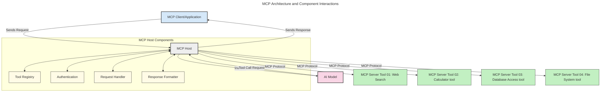
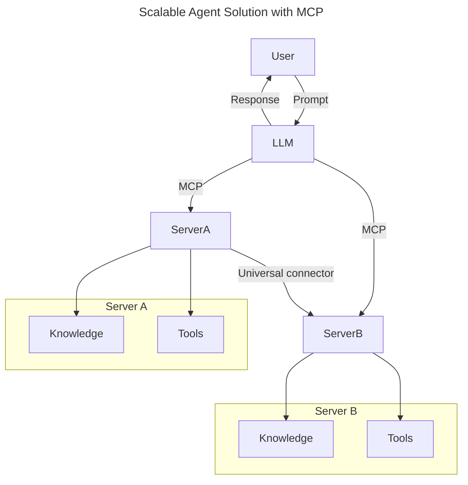
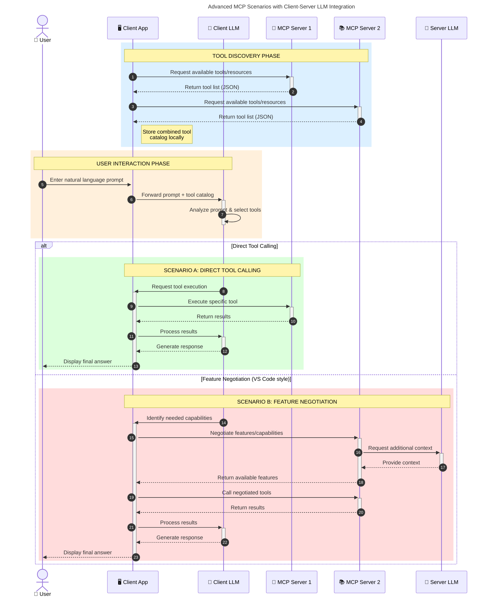

<!--
CO_OP_TRANSLATOR_METADATA:
{
  "original_hash": "9678e0c6945b8e0c23586869b0e26783",
  "translation_date": "2025-10-06T11:00:37+00:00",
  "source_file": "00-Introduction/README.md",
  "language_code": "pl"
}
-->
# Wprowadzenie do Model Context Protocol (MCP): Dlaczego jest ważny dla skalowalnych aplikacji AI

_(Kliknij obrazek powyżej, aby obejrzeć wideo z tej lekcji)_

Aplikacje generatywnej AI to ogromny krok naprzód, ponieważ często pozwalają użytkownikowi na interakcję z aplikacją za pomocą naturalnych językowych poleceń. Jednakże, gdy więcej czasu i zasobów jest inwestowanych w takie aplikacje, warto upewnić się, że można łatwo integrować funkcjonalności i zasoby w sposób umożliwiający ich rozszerzanie, obsługę więcej niż jednego modelu oraz radzenie sobie z różnymi zawiłościami modeli. Krótko mówiąc, budowanie aplikacji generatywnej AI jest łatwe na początku, ale gdy rosną i stają się bardziej złożone, konieczne jest zdefiniowanie architektury, a prawdopodobnie także oparcie się na standardzie, aby zapewnić spójność budowy aplikacji. Tutaj właśnie MCP wchodzi w grę, organizując procesy i dostarczając standard.

---

## **🔍 Co to jest Model Context Protocol (MCP)?**

**Model Context Protocol (MCP)** to **otwarty, standaryzowany interfejs**, który umożliwia płynną interakcję dużych modeli językowych (LLM) z zewnętrznymi narzędziami, API i źródłami danych. Zapewnia spójną architekturę, która rozszerza funkcjonalność modeli AI poza ich dane treningowe, umożliwiając tworzenie inteligentniejszych, skalowalnych i bardziej responsywnych systemów AI.

---

## **🎯 Dlaczego standaryzacja w AI jest ważna**

W miarę jak aplikacje generatywnej AI stają się coraz bardziej złożone, kluczowe jest przyjęcie standardów, które zapewniają **skalowalność, rozszerzalność, łatwość utrzymania** oraz **uniknięcie uzależnienia od jednego dostawcy**. MCP odpowiada na te potrzeby poprzez:

- Ujednolicenie integracji modeli z narzędziami
- Redukcję kruchych, jednorazowych rozwiązań
- Umożliwienie współistnienia wielu modeli od różnych dostawców w jednym ekosystemie

**Uwaga:** Chociaż MCP przedstawia się jako otwarty standard, nie ma planów jego standaryzacji przez istniejące organizacje standaryzacyjne, takie jak IEEE, IETF, W3C, ISO czy inne.

---

## **📚 Cele nauki**

Po przeczytaniu tego artykułu będziesz w stanie:

- Zdefiniować **Model Context Protocol (MCP)** i jego zastosowania
- Zrozumieć, jak MCP standaryzuje komunikację między modelami a narzędziami
- Zidentyfikować kluczowe komponenty architektury MCP
- Poznać rzeczywiste zastosowania MCP w kontekstach biznesowych i deweloperskich

---

## **💡 Dlaczego Model Context Protocol (MCP) zmienia zasady gry**

### **🔗 MCP rozwiązuje problem fragmentacji w interakcjach AI**

Przed MCP integracja modeli z narzędziami wymagała:

- Dedykowanego kodu dla każdej pary narzędzie-model
- Niestandardowych API dla każdego dostawcy
- Częstych awarii z powodu aktualizacji
- Słabej skalowalności przy większej liczbie narzędzi

### **✅ Korzyści ze standaryzacji MCP**

| **Korzyść**               | **Opis**                                                                       |
|---------------------------|-------------------------------------------------------------------------------|
| Interoperacyjność         | LLM płynnie współpracują z narzędziami różnych dostawców                      |
| Spójność                  | Jednolite zachowanie na różnych platformach i narzędziach                     |
| Ponowne wykorzystanie     | Narzędzia stworzone raz mogą być używane w różnych projektach i systemach     |
| Przyspieszenie rozwoju    | Skrócenie czasu tworzenia dzięki standaryzowanym interfejsom plug-and-play    |

---

## **🧱 Przegląd architektury MCP na wysokim poziomie**

MCP opiera się na modelu **klient-serwer**, gdzie:

- **Hosty MCP** uruchamiają modele AI
- **Klienci MCP** inicjują żądania
- **Serwery MCP** dostarczają kontekst, narzędzia i funkcje

### **Kluczowe komponenty:**

- **Zasoby** – Statyczne lub dynamiczne dane dla modeli  
- **Podpowiedzi** – Zdefiniowane wcześniej przepływy pracy dla ukierunkowanego generowania  
- **Narzędzia** – Wykonywalne funkcje, takie jak wyszukiwanie, obliczenia  
- **Próbkowanie** – Zachowanie agentów poprzez rekursywne interakcje  

---

## Jak działają serwery MCP

Serwery MCP działają w następujący sposób:

- **Przepływ żądania**:
    1. Żądanie jest inicjowane przez użytkownika końcowego lub oprogramowanie działające w jego imieniu.
    2. **Klient MCP** wysyła żądanie do **Hosta MCP**, który zarządza środowiskiem uruchomieniowym modelu AI.
    3. **Model AI** otrzymuje polecenie użytkownika i może zażądać dostępu do zewnętrznych narzędzi lub danych poprzez jedno lub więcej wywołań narzędzi.
    4. **Host MCP**, a nie model bezpośrednio, komunikuje się z odpowiednim **Serwerem MCP** za pomocą standaryzowanego protokołu.
- **Funkcjonalność Hostów MCP**:
    - **Rejestr narzędzi**: Utrzymuje katalog dostępnych narzędzi i ich funkcji.
    - **Autoryzacja**: Weryfikuje uprawnienia do dostępu do narzędzi.
    - **Obsługa żądań**: Przetwarza przychodzące żądania narzędzi od modelu.
    - **Formatowanie odpowiedzi**: Strukturyzuje wyniki narzędzi w formacie zrozumiałym dla modelu.
- **Wykonanie Serwera MCP**:
    - **Host MCP** kieruje wywołania narzędzi do jednego lub więcej **Serwerów MCP**, z których każdy udostępnia specjalistyczne funkcje (np. wyszukiwanie, obliczenia, zapytania do bazy danych).
    - **Serwery MCP** wykonują swoje operacje i zwracają wyniki do **Hosta MCP** w spójnym formacie.
    - **Host MCP** formatuje i przekazuje te wyniki do **Modelu AI**.
- **Zakończenie odpowiedzi**:
    - **Model AI** włącza wyniki narzędzi do ostatecznej odpowiedzi.
    - **Host MCP** przesyła tę odpowiedź z powrotem do **Klienta MCP**, który dostarcza ją użytkownikowi końcowemu lub wywołującemu oprogramowaniu.

## 👨‍💻 Jak zbudować serwer MCP (z przykładami)

Serwery MCP pozwalają na rozszerzenie możliwości LLM poprzez dostarczanie danych i funkcji.

Gotowy, aby spróbować? Oto SDK dla różnych języków i/lub stosów technologicznych z przykładami tworzenia prostych serwerów MCP:

- **Python SDK**: https://github.com/modelcontextprotocol/python-sdk

- **TypeScript SDK**: https://github.com/modelcontextprotocol/typescript-sdk

- **Java SDK**: https://github.com/modelcontextprotocol/java-sdk

- **C#/.NET SDK**: https://github.com/modelcontextprotocol/csharp-sdk

## 🌍 Rzeczywiste zastosowania MCP

MCP umożliwia szeroki zakres zastosowań poprzez rozszerzenie możliwości AI:

| **Zastosowanie**              | **Opis**                                                                       |
|-------------------------------|-------------------------------------------------------------------------------|
| Integracja danych w przedsiębiorstwie | Połączenie LLM z bazami danych, CRM lub narzędziami wewnętrznymi            |
| Systemy agentowe AI           | Umożliwienie autonomicznym agentom dostępu do narzędzi i przepływów decyzyjnych |
| Aplikacje multimodalne        | Łączenie tekstu, obrazów i dźwięku w jednej zintegrowanej aplikacji AI         |
| Integracja danych w czasie rzeczywistym | Wprowadzenie danych na żywo do interakcji AI dla bardziej precyzyjnych wyników |

### 🧠 MCP = Uniwersalny standard dla interakcji AI

Model Context Protocol (MCP) działa jako uniwersalny standard dla interakcji AI, podobnie jak USB-C ujednolicił fizyczne połączenia dla urządzeń. W świecie AI MCP zapewnia spójny interfejs, umożliwiając modelom (klientom) płynną integrację z zewnętrznymi narzędziami i dostawcami danych (serwerami). Eliminuje to potrzebę różnorodnych, niestandardowych protokołów dla każdego API czy źródła danych.

W ramach MCP narzędzie kompatybilne z MCP (zwane serwerem MCP) przestrzega jednolitego standardu. Te serwery mogą wymieniać narzędzia lub działania, które oferują, i wykonywać te działania na żądanie agenta AI. Platformy agentów AI obsługujące MCP są w stanie odkrywać dostępne narzędzia z serwerów i wywoływać je za pomocą tego standardowego protokołu.

### 💡 Ułatwia dostęp do wiedzy

Oprócz oferowania narzędzi MCP ułatwia również dostęp do wiedzy. Umożliwia aplikacjom dostarczanie kontekstu dużym modelom językowym (LLM) poprzez łączenie ich z różnymi źródłami danych. Na przykład serwer MCP może reprezentować repozytorium dokumentów firmy, umożliwiając agentom pobieranie odpowiednich informacji na żądanie. Inny serwer może obsługiwać konkretne działania, takie jak wysyłanie e-maili czy aktualizowanie rekordów. Z perspektywy agenta są to po prostu narzędzia, które może używać—niektóre narzędzia zwracają dane (kontekst wiedzy), podczas gdy inne wykonują działania. MCP efektywnie zarządza obiema funkcjami.

Agent łączący się z serwerem MCP automatycznie poznaje dostępne możliwości serwera i dostępne dane w standardowym formacie. Ta standaryzacja umożliwia dynamiczną dostępność narzędzi. Na przykład dodanie nowego serwera MCP do systemu agenta sprawia, że jego funkcje są natychmiast użyteczne bez konieczności dalszej personalizacji instrukcji agenta.

To uproszczone podejście do integracji jest zgodne z przepływem przedstawionym na poniższym diagramie, gdzie serwery dostarczają zarówno narzędzia, jak i wiedzę, zapewniając płynną współpracę między systemami.

### 👉 Przykład: Skalowalne rozwiązanie agentowe

Uniwersalny konektor umożliwia serwerom MCP komunikację i dzielenie się możliwościami między sobą, pozwalając SerwerowiA delegować zadania do SerweraB lub uzyskiwać dostęp do jego narzędzi i wiedzy. To federuje narzędzia i dane między serwerami, wspierając skalowalne i modułowe architektury agentów. Dzięki standaryzacji MCP narzędzia mogą być dynamicznie odkrywane, a żądania kierowane między serwerami bez twardo zakodowanych integracji.

Federacja narzędzi i wiedzy: Narzędzia i dane mogą być dostępne między serwerami, umożliwiając bardziej skalowalne i modułowe architektury agentowe.

### 🔄 Zaawansowane scenariusze MCP z integracją LLM po stronie klienta

Poza podstawową architekturą MCP istnieją zaawansowane scenariusze, w których zarówno klient, jak i serwer zawierają LLM, umożliwiając bardziej wyrafinowane interakcje. Na poniższym diagramie **Aplikacja Klienta** może być IDE z wieloma narzędziami MCP dostępnymi dla użytkownika przez LLM:

## 🔐 Praktyczne korzyści MCP

Oto praktyczne korzyści wynikające z użycia MCP:

- **Aktualność**: Modele mogą uzyskiwać dostęp do aktualnych informacji poza swoimi danymi treningowymi
- **Rozszerzenie możliwości**: Modele mogą korzystać ze specjalistycznych narzędzi do zadań, do których nie były trenowane
- **Zmniejszenie halucynacji**: Zewnętrzne źródła danych zapewniają faktograficzne podstawy
- **Prywatność**: Wrażliwe dane mogą pozostawać w bezpiecznych środowiskach zamiast być osadzane w poleceniach

## 📌 Kluczowe wnioski

Oto kluczowe wnioski dotyczące użycia MCP:

- **MCP** standaryzuje sposób, w jaki modele AI współpracują z narzędziami i danymi
- Promuje **rozszerzalność, spójność i interoperacyjność**
- MCP pomaga **skracać czas rozwoju, poprawiać niezawodność i rozszerzać możliwości modeli**
- Architektura klient-serwer **umożliwia elastyczne, rozszerzalne aplikacje AI**

## 🧠 Ćwiczenie

Pomyśl o aplikacji AI, którą chciałbyś zbudować.

- Jakie **zewnętrzne narzędzia lub dane** mogłyby zwiększyć jej możliwości?
- W jaki sposób MCP może uczynić integrację **prostszą i bardziej niezawodną?**

## Dodatkowe zasoby

- [Repozytorium MCP na GitHub](https://github.com/modelcontextprotocol)

## Co dalej

Dalej: [Rozdział 1: Podstawowe pojęcia](../01-CoreConcepts/README.md)

---

**Zastrzeżenie**:  
Ten dokument został przetłumaczony za pomocą usługi tłumaczenia AI [Co-op Translator](https://github.com/Azure/co-op-translator). Chociaż staramy się zapewnić dokładność, prosimy pamiętać, że automatyczne tłumaczenia mogą zawierać błędy lub nieścisłości. Oryginalny dokument w jego języku źródłowym powinien być uznawany za autorytatywne źródło. W przypadku informacji krytycznych zaleca się skorzystanie z profesjonalnego tłumaczenia przez człowieka. Nie ponosimy odpowiedzialności za jakiekolwiek nieporozumienia lub błędne interpretacje wynikające z użycia tego tłumaczenia.