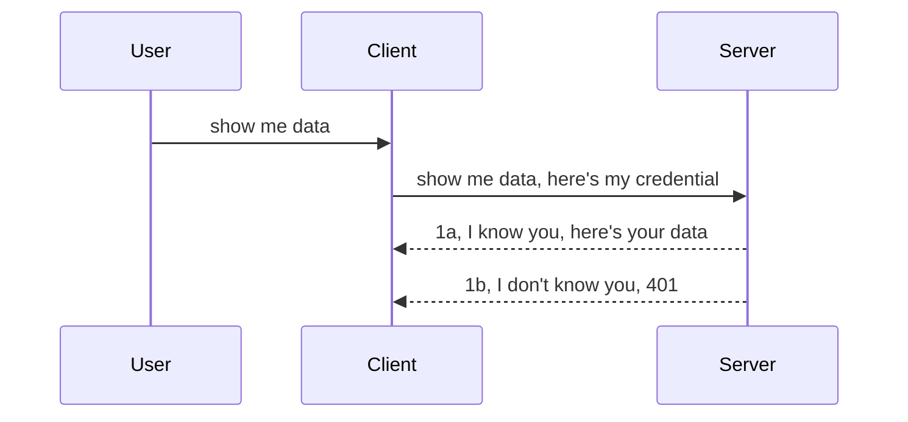

<!--
CO_OP_TRANSLATOR_METADATA:
{
  "original_hash": "5b00b8a8971a07d2d8803be4c9f138f8",
  "translation_date": "2025-10-07T00:48:02+00:00",
  "source_file": "03-GettingStarted/11-simple-auth/README.md",
  "language_code": "pl"
}
-->
# Prosta autoryzacja

SDK MCP obsługują użycie OAuth 2.1, który, szczerze mówiąc, jest dość skomplikowanym procesem obejmującym takie pojęcia jak serwer autoryzacji, serwer zasobów, przesyłanie danych uwierzytelniających, uzyskiwanie kodu, wymiana kodu na token dostępu, aż w końcu można uzyskać dane zasobów. Jeśli nie jesteś zaznajomiony z OAuth, który jest świetnym rozwiązaniem do wdrożenia, warto zacząć od podstawowego poziomu autoryzacji i stopniowo przechodzić do coraz lepszego zabezpieczenia. Dlatego właśnie powstał ten rozdział – aby pomóc Ci przejść do bardziej zaawansowanej autoryzacji.

## Autoryzacja – co mamy na myśli?

Autoryzacja to skrót od uwierzytelniania i autoryzacji. Chodzi o to, że musimy zrobić dwie rzeczy:

- **Uwierzytelnianie**, czyli proces ustalania, czy pozwalamy komuś wejść do naszego „domu”, czy ma prawo być „tutaj”, czyli mieć dostęp do naszego serwera zasobów, gdzie znajdują się funkcje serwera MCP.
- **Autoryzacja**, czyli proces ustalania, czy użytkownik powinien mieć dostęp do konkretnych zasobów, o które prosi, na przykład do tych zamówień lub produktów, albo czy może tylko czytać treść, ale nie usuwać jej, jako inny przykład.

## Dane uwierzytelniające: jak informujemy system, kim jesteśmy

Większość programistów internetowych zaczyna myśleć o dostarczaniu danych uwierzytelniających do serwera, zazwyczaj sekretu, który mówi, czy mają prawo być „tutaj” („Uwierzytelnianie”). Dane uwierzytelniające to zazwyczaj zakodowana w base64 wersja nazwy użytkownika i hasła lub klucz API, który jednoznacznie identyfikuje konkretnego użytkownika.

To wiąże się z przesyłaniem danych za pomocą nagłówka o nazwie „Authorization”, na przykład:

```json
{ "Authorization": "secret123" }
```

To zazwyczaj nazywa się podstawowym uwierzytelnianiem. Ogólny przepływ działa w następujący sposób:



Teraz, gdy rozumiemy, jak to działa z punktu widzenia przepływu, jak to zaimplementować? Większość serwerów internetowych ma koncepcję zwaną middleware, czyli fragment kodu, który działa jako część żądania i może weryfikować dane uwierzytelniające. Jeśli dane uwierzytelniające są poprawne, żądanie może przejść dalej. Jeśli żądanie nie ma poprawnych danych uwierzytelniających, otrzymasz błąd autoryzacji. Zobaczmy, jak można to zaimplementować:

**Python**

```python
class AuthMiddleware(BaseHTTPMiddleware):
    async def dispatch(self, request, call_next):

        has_header = request.headers.get("Authorization")
        if not has_header:
            print("-> Missing Authorization header!")
            return Response(status_code=401, content="Unauthorized")

        if not valid_token(has_header):
            print("-> Invalid token!")
            return Response(status_code=403, content="Forbidden")

        print("Valid token, proceeding...")
       
        response = await call_next(request)
        # add any customer headers or change in the response in some way
        return response


starlette_app.add_middleware(CustomHeaderMiddleware)
```

Tutaj:

- Utworzyliśmy middleware o nazwie `AuthMiddleware`, którego metoda `dispatch` jest wywoływana przez serwer internetowy.
- Dodaliśmy middleware do serwera internetowego:

    ```python
    starlette_app.add_middleware(AuthMiddleware)
    ```

- Napisaliśmy logikę walidacji, która sprawdza, czy nagłówek Authorization jest obecny i czy przesyłany sekret jest poprawny:

    ```python
    has_header = request.headers.get("Authorization")
    if not has_header:
        print("-> Missing Authorization header!")
        return Response(status_code=401, content="Unauthorized")

    if not valid_token(has_header):
        print("-> Invalid token!")
        return Response(status_code=403, content="Forbidden")
    ```

    Jeśli sekret jest obecny i poprawny, pozwalamy żądaniu przejść dalej, wywołując `call_next` i zwracając odpowiedź.

    ```python
    response = await call_next(request)
    # add any customer headers or change in the response in some way
    return response
    ```

Jak to działa? Jeśli żądanie internetowe zostanie skierowane do serwera, middleware zostanie wywołane i na podstawie jego implementacji albo pozwoli żądaniu przejść dalej, albo zwróci błąd wskazujący, że klient nie może kontynuować.

**TypeScript**

Tutaj tworzymy middleware za pomocą popularnego frameworka Express i przechwytujemy żądanie, zanim dotrze do serwera MCP. Oto kod:

```typescript
function isValid(secret) {
    return secret === "secret123";
}

app.use((req, res, next) => {
    // 1. Authorization header present?  
    if(!req.headers["Authorization"]) {
        res.status(401).send('Unauthorized');
    }
    
    let token = req.headers["Authorization"];

    // 2. Check validity.
    if(!isValid(token)) {
        res.status(403).send('Forbidden');
    }

   
    console.log('Middleware executed');
    // 3. Passes request to the next step in the request pipeline.
    next();
});
```

W tym kodzie:

1. Sprawdzamy, czy nagłówek Authorization jest w ogóle obecny. Jeśli nie, wysyłamy błąd 401.
2. Upewniamy się, że dane uwierzytelniające/token są poprawne. Jeśli nie, wysyłamy błąd 403.
3. Na końcu przekazujemy żądanie dalej w pipeline żądań i zwracamy żądany zasób.

## Ćwiczenie: Implementacja uwierzytelniania

Wykorzystajmy naszą wiedzę i spróbujmy ją zaimplementować. Oto plan:

Serwer

- Utwórz serwer internetowy i instancję MCP.
- Zaimplementuj middleware dla serwera.

Klient 

- Wyślij żądanie internetowe z danymi uwierzytelniającymi w nagłówku.

### -1- Utwórz serwer internetowy i instancję MCP

W pierwszym kroku musimy utworzyć instancję serwera internetowego i serwera MCP.

**Python**

Tutaj tworzymy instancję serwera MCP, aplikację internetową Starlette i hostujemy ją za pomocą uvicorn.

```python
# creating MCP Server

app = FastMCP(
    name="MCP Resource Server",
    instructions="Resource Server that validates tokens via Authorization Server introspection",
    host=settings["host"],
    port=settings["port"],
    debug=True
)

# creating starlette web app
starlette_app = app.streamable_http_app()

# serving app via uvicorn
async def run(starlette_app):
    import uvicorn
    config = uvicorn.Config(
            starlette_app,
            host=app.settings.host,
            port=app.settings.port,
            log_level=app.settings.log_level.lower(),
        )
    server = uvicorn.Server(config)
    await server.serve()

run(starlette_app)
```

W tym kodzie:

- Tworzymy serwer MCP.
- Konstruujemy aplikację internetową Starlette z serwera MCP, `app.streamable_http_app()`.
- Hostujemy i serwujemy aplikację internetową za pomocą uvicorn `server.serve()`.

**TypeScript**

Tutaj tworzymy instancję serwera MCP.

```typescript
const server = new McpServer({
      name: "example-server",
      version: "1.0.0"
    });

    // ... set up server resources, tools, and prompts ...
```

Tworzenie serwera MCP musi odbywać się w ramach definicji trasy POST /mcp, więc przenieśmy powyższy kod w następujący sposób:

```typescript
import express from "express";
import { randomUUID } from "node:crypto";
import { McpServer } from "@modelcontextprotocol/sdk/server/mcp.js";
import { StreamableHTTPServerTransport } from "@modelcontextprotocol/sdk/server/streamableHttp.js";
import { isInitializeRequest } from "@modelcontextprotocol/sdk/types.js"

const app = express();
app.use(express.json());

// Map to store transports by session ID
const transports: { [sessionId: string]: StreamableHTTPServerTransport } = {};

// Handle POST requests for client-to-server communication
app.post('/mcp', async (req, res) => {
  // Check for existing session ID
  const sessionId = req.headers['mcp-session-id'] as string | undefined;
  let transport: StreamableHTTPServerTransport;

  if (sessionId && transports[sessionId]) {
    // Reuse existing transport
    transport = transports[sessionId];
  } else if (!sessionId && isInitializeRequest(req.body)) {
    // New initialization request
    transport = new StreamableHTTPServerTransport({
      sessionIdGenerator: () => randomUUID(),
      onsessioninitialized: (sessionId) => {
        // Store the transport by session ID
        transports[sessionId] = transport;
      },
      // DNS rebinding protection is disabled by default for backwards compatibility. If you are running this server
      // locally, make sure to set:
      // enableDnsRebindingProtection: true,
      // allowedHosts: ['127.0.0.1'],
    });

    // Clean up transport when closed
    transport.onclose = () => {
      if (transport.sessionId) {
        delete transports[transport.sessionId];
      }
    };
    const server = new McpServer({
      name: "example-server",
      version: "1.0.0"
    });

    // ... set up server resources, tools, and prompts ...

    // Connect to the MCP server
    await server.connect(transport);
  } else {
    // Invalid request
    res.status(400).json({
      jsonrpc: '2.0',
      error: {
        code: -32000,
        message: 'Bad Request: No valid session ID provided',
      },
      id: null,
    });
    return;
  }

  // Handle the request
  await transport.handleRequest(req, res, req.body);
});

// Reusable handler for GET and DELETE requests
const handleSessionRequest = async (req: express.Request, res: express.Response) => {
  const sessionId = req.headers['mcp-session-id'] as string | undefined;
  if (!sessionId || !transports[sessionId]) {
    res.status(400).send('Invalid or missing session ID');
    return;
  }
  
  const transport = transports[sessionId];
  await transport.handleRequest(req, res);
};

// Handle GET requests for server-to-client notifications via SSE
app.get('/mcp', handleSessionRequest);

// Handle DELETE requests for session termination
app.delete('/mcp', handleSessionRequest);

app.listen(3000);
```

Teraz widzisz, jak tworzenie serwera MCP zostało przeniesione do `app.post("/mcp")`.

Przejdźmy do następnego kroku, czyli tworzenia middleware, aby móc weryfikować przesyłane dane uwierzytelniające.

### -2- Zaimplementuj middleware dla serwera

Przejdźmy teraz do części dotyczącej middleware. Tutaj stworzymy middleware, który będzie szukał danych uwierzytelniających w nagłówku `Authorization` i je weryfikował. Jeśli są akceptowalne, żądanie przejdzie dalej, aby wykonać to, co powinno (np. wyświetlić narzędzia, odczytać zasób lub jakąkolwiek funkcjonalność MCP, o którą prosi klient).

**Python**

Aby stworzyć middleware, musimy utworzyć klasę dziedziczącą po `BaseHTTPMiddleware`. Są dwa interesujące elementy:

- Żądanie `request`, z którego odczytujemy informacje o nagłówku.
- `call_next`, czyli callback, który musimy wywołać, jeśli klient dostarczył akceptowalne dane uwierzytelniające.

Najpierw musimy obsłużyć przypadek, gdy nagłówek `Authorization` jest nieobecny:

```python
has_header = request.headers.get("Authorization")

# no header present, fail with 401, otherwise move on.
if not has_header:
    print("-> Missing Authorization header!")
    return Response(status_code=401, content="Unauthorized")
```

Tutaj wysyłamy wiadomość 401 Unauthorized, ponieważ klient nie przechodzi uwierzytelniania.

Następnie, jeśli przesłano dane uwierzytelniające, musimy sprawdzić ich poprawność w następujący sposób:

```python
 if not valid_token(has_header):
    print("-> Invalid token!")
    return Response(status_code=403, content="Forbidden")
```

Zwróć uwagę, jak powyżej wysyłamy wiadomość 403 Forbidden. Zobaczmy pełne middleware poniżej, implementujące wszystko, o czym wspomnieliśmy wcześniej:

```python
class AuthMiddleware(BaseHTTPMiddleware):
    async def dispatch(self, request, call_next):

        has_header = request.headers.get("Authorization")
        if not has_header:
            print("-> Missing Authorization header!")
            return Response(status_code=401, content="Unauthorized")

        if not valid_token(has_header):
            print("-> Invalid token!")
            return Response(status_code=403, content="Forbidden")

        print("Valid token, proceeding...")
        print(f"-> Received {request.method} {request.url}")
        response = await call_next(request)
        response.headers['Custom'] = 'Example'
        return response

```

Świetnie, ale co z funkcją `valid_token`? Oto ona poniżej:

```python
# DON'T use for production - improve it !!
def valid_token(token: str) -> bool:
    # remove the "Bearer " prefix
    if token.startswith("Bearer "):
        token = token[7:]
        return token == "secret-token"
    return False
```

To oczywiście powinno zostać ulepszone.

WAŻNE: Nigdy nie powinieneś przechowywać sekretów w kodzie. Powinieneś idealnie pobierać wartość do porównania z bazy danych lub z IDP (dostawcy usług tożsamości), a najlepiej pozwolić IDP na przeprowadzenie walidacji.

**TypeScript**

Aby zaimplementować to w Express, musimy wywołać metodę `use`, która przyjmuje funkcje middleware.

Musimy:

- Interakcjonować z zmienną żądania, aby sprawdzić przesłane dane uwierzytelniające w właściwości `Authorization`.
- Zweryfikować dane uwierzytelniające, a jeśli są poprawne, pozwolić żądaniu kontynuować i wykonać żądanie MCP klienta (np. wyświetlić narzędzia, odczytać zasób lub cokolwiek innego związanego z MCP).

Tutaj sprawdzamy, czy nagłówek `Authorization` jest obecny, a jeśli nie, zatrzymujemy żądanie:

```typescript
if(!req.headers["authorization"]) {
    res.status(401).send('Unauthorized');
    return;
}
```

Jeśli nagłówek nie został przesłany, otrzymasz błąd 401.

Następnie sprawdzamy, czy dane uwierzytelniające są poprawne. Jeśli nie, ponownie zatrzymujemy żądanie, ale z nieco innym komunikatem:

```typescript
if(!isValid(token)) {
    res.status(403).send('Forbidden');
    return;
} 
```

Zwróć uwagę, jak teraz otrzymujesz błąd 403.

Oto pełny kod:

```typescript
app.use((req, res, next) => {
    console.log('Request received:', req.method, req.url, req.headers);
    console.log('Headers:', req.headers["authorization"]);
    if(!req.headers["authorization"]) {
        res.status(401).send('Unauthorized');
        return;
    }
    
    let token = req.headers["authorization"];

    if(!isValid(token)) {
        res.status(403).send('Forbidden');
        return;
    }  

    console.log('Middleware executed');
    next();
});
```

Skonfigurowaliśmy serwer internetowy do akceptowania middleware w celu sprawdzenia danych uwierzytelniających, które klient ma nadzieję przesłać. A co z samym klientem?

### -3- Wyślij żądanie internetowe z danymi uwierzytelniającymi w nagłówku

Musimy upewnić się, że klient przesyła dane uwierzytelniające przez nagłówek. Ponieważ zamierzamy użyć klienta MCP, musimy dowiedzieć się, jak to zrobić.

**Python**

Dla klienta musimy przesłać nagłówek z naszymi danymi uwierzytelniającymi w następujący sposób:

```python
# DON'T hardcode the value, have it at minimum in an environment variable or a more secure storage
token = "secret-token"

async with streamablehttp_client(
        url = f"http://localhost:{port}/mcp",
        headers = {"Authorization": f"Bearer {token}"}
    ) as (
        read_stream,
        write_stream,
        session_callback,
    ):
        async with ClientSession(
            read_stream,
            write_stream
        ) as session:
            await session.initialize()
      
            # TODO, what you want done in the client, e.g list tools, call tools etc.
```

Zwróć uwagę, jak wypełniamy właściwość `headers` w następujący sposób: `headers = {"Authorization": f"Bearer {token}"}`.

**TypeScript**

Możemy to rozwiązać w dwóch krokach:

1. Wypełnij obiekt konfiguracji naszymi danymi uwierzytelniającymi.
2. Przekaż obiekt konfiguracji do transportu.

```typescript

// DON'T hardcode the value like shown here. At minimum have it as a env variable and use something like dotenv (in dev mode).
let token = "secret123"

// define a client transport option object
let options: StreamableHTTPClientTransportOptions = {
  sessionId: sessionId,
  requestInit: {
    headers: {
      "Authorization": "secret123"
    }
  }
};

// pass the options object to the transport
async function main() {
   const transport = new StreamableHTTPClientTransport(
      new URL(serverUrl),
      options
   );
```

Tutaj widzisz, jak musieliśmy utworzyć obiekt `options` i umieścić nasze nagłówki w właściwości `requestInit`.

WAŻNE: Jak możemy to ulepszyć? Obecna implementacja ma pewne problemy. Po pierwsze, przesyłanie danych uwierzytelniających w ten sposób jest dość ryzykowne, chyba że masz co najmniej HTTPS. Nawet wtedy dane uwierzytelniające mogą zostać skradzione, więc potrzebujesz systemu, w którym możesz łatwo unieważnić token i dodać dodatkowe kontrole, takie jak miejsce pochodzenia żądania, czy żądanie występuje zbyt często (zachowanie botów) i wiele innych. 

Należy jednak powiedzieć, że dla bardzo prostych API, gdzie nie chcesz, aby ktokolwiek wywoływał Twoje API bez uwierzytelnienia, to, co mamy tutaj, jest dobrym początkiem. 

Mając to na uwadze, spróbujmy trochę wzmocnić bezpieczeństwo, używając standardowego formatu, takiego jak JSON Web Token, znany również jako JWT lub „JOT” tokeny.

## JSON Web Tokens, JWT

Więc próbujemy ulepszyć przesyłanie bardzo prostych danych uwierzytelniających. Jakie natychmiastowe ulepszenia uzyskujemy, przyjmując JWT?

- **Poprawa bezpieczeństwa**. W podstawowym uwierzytelnianiu przesyłasz nazwę użytkownika i hasło jako zakodowany w base64 token (lub przesyłasz klucz API) wielokrotnie, co zwiększa ryzyko. W przypadku JWT przesyłasz nazwę użytkownika i hasło i otrzymujesz token w zamian, który jest również ograniczony czasowo, co oznacza, że wygaśnie. JWT pozwala łatwo używać szczegółowej kontroli dostępu za pomocą ról, zakresów i uprawnień. 
- **Bezstanowość i skalowalność**. JWT są samodzielne, zawierają wszystkie informacje o użytkowniku i eliminują potrzebę przechowywania sesji po stronie serwera. Token może być również weryfikowany lokalnie.
- **Interoperacyjność i federacja**. JWT są centralnym elementem Open ID Connect i są używane z znanymi dostawcami tożsamości, takimi jak Entra ID, Google Identity i Auth0. Umożliwiają również korzystanie z jednokrotnego logowania i wiele więcej, czyniąc je rozwiązaniem na poziomie przedsiębiorstwa.
- **Modularność i elastyczność**. JWT mogą być również używane z bramami API, takimi jak Azure API Management, NGINX i inne. Obsługują również scenariusze uwierzytelniania i komunikacji serwer-serwer, w tym scenariusze impersonacji i delegacji.
- **Wydajność i buforowanie**. JWT mogą być buforowane po dekodowaniu, co zmniejsza potrzebę parsowania. Pomaga to szczególnie w aplikacjach o dużym ruchu, ponieważ poprawia przepustowość i zmniejsza obciążenie wybranej infrastruktury.
- **Zaawansowane funkcje**. Obsługują również introspekcję (sprawdzanie ważności na serwerze) i unieważnianie (czynienie tokena nieważnym).

Mając na uwadze te korzyści, zobaczmy, jak możemy przenieść naszą implementację na wyższy poziom.

## Przekształcenie podstawowego uwierzytelniania w JWT

Zmiany, które musimy wprowadzić na wysokim poziomie, to:

- **Nauczyć się konstruować token JWT** i przygotować go do przesłania z klienta na serwer.
- **Zweryfikować token JWT**, a jeśli jest poprawny, pozwolić klientowi na dostęp do naszych zasobów.
- **Bezpieczne przechowywanie tokena**. Jak przechowywać ten token.
- **Ochrona tras**. Musimy chronić trasy, w naszym przypadku musimy chronić trasy i konkretne funkcje MCP.
- **Dodanie tokenów odświeżania**. Upewnij się, że tworzymy tokeny krótkoterminowe, ale tokeny odświeżania długoterminowe, które mogą być używane do uzyskania nowych tokenów, jeśli wygasną. Upewnij się również, że istnieje punkt końcowy odświeżania i strategia rotacji.

### -1- Konstruowanie tokena JWT

Na początek token JWT ma następujące części:

- **Nagłówek**, algorytm używany i typ tokena.
- **Payload**, roszczenia, takie jak sub (użytkownik lub podmiot, który reprezentuje token. W scenariuszu uwierzytelniania jest to zazwyczaj identyfikator użytkownika), exp (kiedy wygasa), rola (rola).
- **Podpis**, podpisany za pomocą sekretu lub klucza prywatnego.

Do tego będziemy musieli skonstruować nagłówek, payload i zakodowany token.

**Python**

```python

import jwt
import jwt
from jwt.exceptions import ExpiredSignatureError, InvalidTokenError
import datetime

# Secret key used to sign the JWT
secret_key = 'your-secret-key'

header = {
    "alg": "HS256",
    "typ": "JWT"
}

# the user info andits claims and expiry time
payload = {
    "sub": "1234567890",               # Subject (user ID)
    "name": "User Userson",                # Custom claim
    "admin": True,                     # Custom claim
    "iat": datetime.datetime.utcnow(),# Issued at
    "exp": datetime.datetime.utcnow() + datetime.timedelta(hours=1)  # Expiry
}

# encode it
encoded_jwt = jwt.encode(payload, secret_key, algorithm="HS256", headers=header)
```

W powyższym kodzie:

- Zdefiniowaliśmy nagłówek używając HS256 jako algorytmu i typu JWT.
- Skonstruowaliśmy payload, który zawiera podmiot lub identyfikator użytkownika, nazwę użytkownika, rolę, kiedy został wydany i kiedy ma wygasnąć, tym samym implementując aspekt ograniczenia czasowego, o którym wspomnieliśmy wcześniej. 

**TypeScript**

Tutaj będziemy potrzebować kilku zależności, które pomogą nam skonstruować token JWT.

Zależności

```sh

npm install jsonwebtoken
npm install --save-dev @types/jsonwebtoken
```

Teraz, gdy mamy to na miejscu, utwórzmy nagłówek, payload i na ich podstawie zakodowany token.

```typescript
import jwt from 'jsonwebtoken';

const secretKey = 'your-secret-key'; // Use env vars in production

// Define the payload
const payload = {
  sub: '1234567890',
  name: 'User usersson',
  admin: true,
  iat: Math.floor(Date.now() / 1000), // Issued at
  exp: Math.floor(Date.now() / 1000) + 60 * 60 // Expires in 1 hour
};

// Define the header (optional, jsonwebtoken sets defaults)
const header = {
  alg: 'HS256',
  typ: 'JWT'
};

// Create the token
const token = jwt.sign(payload, secretKey, {
  algorithm: 'HS256',
  header: header
});

console.log('JWT:', token);
```

Ten token jest:

Podpisany za pomocą HS256
Ważny przez 1 godzinę
Zawiera roszczenia, takie jak sub, name, admin, iat i exp.

### -2- Walidacja tokena

Musimy również zweryfikować token, co powinniśmy zrobić na serwerze, aby upewnić się, że to, co klient nam przesyła, jest faktycznie poprawne. Istnieje wiele kontroli, które powinniśmy tutaj przeprowadzić, od weryfikacji jego struktury po jego ważność. Zachęcamy również do dodania innych kontroli, aby sprawdzić, czy użytkownik znajduje się w naszym systemie i więcej.

Aby zweryfikować token, musimy go zdekodować, aby móc go odczytać, a następnie rozpocząć sprawdzanie jego ważności:

**Python**

```python

# Decode and verify the JWT
try:
    decoded = jwt.decode(token, secret_key, algorithms=["HS256"])
    print("✅ Token is valid.")
    print("Decoded claims:")
    for key, value in decoded.items():
        print(f"  {key}: {value}")
except ExpiredSignatureError:
    print("❌ Token has expired.")
except InvalidTokenError as e:
    print(f"❌ Invalid token: {e}")

```

W tym kodzie wywołujemy `jwt.decode` używając tokena, klucza sekretnego i wybranego algorytmu jako danych wejściowych. Zwróć uwagę, jak używamy konstrukcji try-catch, ponieważ nieudana walidacja prowadzi do zgłoszenia błędu.

**TypeScript**

Tutaj musimy wywołać `jwt.verify`, aby uzyskać zdekodowaną wersję tokena, którą możemy dalej analizować. Jeśli to wywołanie się nie powiedzie, oznacza to, że struktura tokena jest niepoprawna lub nie jest już ważna. 

```typescript

try {
  const decoded = jwt.verify(token, secretKey);
  console.log('Decoded Payload:', decoded);
} catch (err) {
  console.error('Token verification failed:', err);
}
```

UWAGA: Jak wspomniano
Następnie przyjrzyjmy się kontroli dostępu opartej na rolach, znanej również jako RBAC.

## Dodawanie kontroli dostępu opartej na rolach

Idea polega na tym, że chcemy wyrazić, że różne role mają różne uprawnienia. Na przykład zakładamy, że administrator może robić wszystko, zwykły użytkownik może czytać/pisać, a gość może tylko czytać. Oto możliwe poziomy uprawnień:

- Admin.Write 
- User.Read
- Guest.Read

Przyjrzyjmy się, jak możemy zaimplementować taką kontrolę za pomocą middleware. Middleware można dodawać zarówno dla poszczególnych tras, jak i dla wszystkich tras.

**Python**

```python
from starlette.middleware.base import BaseHTTPMiddleware
from starlette.responses import JSONResponse
import jwt

# DON'T have the secret in the code like, this is for demonstration purposes only. Read it from a safe place.
SECRET_KEY = "your-secret-key" # put this in env variable
REQUIRED_PERMISSION = "User.Read"

class JWTPermissionMiddleware(BaseHTTPMiddleware):
    async def dispatch(self, request, call_next):
        auth_header = request.headers.get("Authorization")
        if not auth_header or not auth_header.startswith("Bearer "):
            return JSONResponse({"error": "Missing or invalid Authorization header"}, status_code=401)

        token = auth_header.split(" ")[1]
        try:
            decoded = jwt.decode(token, SECRET_KEY, algorithms=["HS256"])
        except jwt.ExpiredSignatureError:
            return JSONResponse({"error": "Token expired"}, status_code=401)
        except jwt.InvalidTokenError:
            return JSONResponse({"error": "Invalid token"}, status_code=401)

        permissions = decoded.get("permissions", [])
        if REQUIRED_PERMISSION not in permissions:
            return JSONResponse({"error": "Permission denied"}, status_code=403)

        request.state.user = decoded
        return await call_next(request)


```

Istnieje kilka różnych sposobów dodania middleware, jak poniżej:

```python

# Alt 1: add middleware while constructing starlette app
middleware = [
    Middleware(JWTPermissionMiddleware)
]

app = Starlette(routes=routes, middleware=middleware)

# Alt 2: add middleware after starlette app is a already constructed
starlette_app.add_middleware(JWTPermissionMiddleware)

# Alt 3: add middleware per route
routes = [
    Route(
        "/mcp",
        endpoint=..., # handler
        middleware=[Middleware(JWTPermissionMiddleware)]
    )
]
```

**TypeScript**

Możemy użyć `app.use` i middleware, który będzie uruchamiany dla wszystkich żądań.

```typescript
app.use((req, res, next) => {
    console.log('Request received:', req.method, req.url, req.headers);
    console.log('Headers:', req.headers["authorization"]);

    // 1. Check if authorization header has been sent

    if(!req.headers["authorization"]) {
        res.status(401).send('Unauthorized');
        return;
    }
    
    let token = req.headers["authorization"];

    // 2. Check if token is valid
    if(!isValid(token)) {
        res.status(403).send('Forbidden');
        return;
    }  

    // 3. Check if token user exist in our system
    if(!isExistingUser(token)) {
        res.status(403).send('Forbidden');
        console.log("User does not exist");
        return;
    }
    console.log("User exists");

    // 4. Verify the token has the right permissions
    if(!hasScopes(token, ["User.Read"])){
        res.status(403).send('Forbidden - insufficient scopes');
    }

    console.log("User has required scopes");

    console.log('Middleware executed');
    next();
});

```

Jest kilka rzeczy, które możemy zrobić za pomocą naszego middleware i które POWINNO robić nasze middleware, mianowicie:

1. Sprawdzić, czy nagłówek autoryzacji jest obecny.
2. Sprawdzić, czy token jest ważny, wywołujemy `isValid`, czyli metodę, którą napisaliśmy, aby sprawdzić integralność i ważność tokena JWT.
3. Zweryfikować, czy użytkownik istnieje w naszym systemie, powinniśmy to sprawdzić.

   ```typescript
    // users in DB
   const users = [
     "user1",
     "User usersson",
   ]

   function isExistingUser(token) {
     let decodedToken = verifyToken(token);

     // TODO, check if user exists in DB
     return users.includes(decodedToken?.name || "");
   }
   ```

   Powyżej stworzyliśmy bardzo prostą listę `users`, która oczywiście powinna znajdować się w bazie danych.

4. Dodatkowo powinniśmy również sprawdzić, czy token ma odpowiednie uprawnienia.

   ```typescript
   if(!hasScopes(token, ["User.Read"])){
        res.status(403).send('Forbidden - insufficient scopes');
   }
   ```

   W powyższym kodzie z middleware sprawdzamy, czy token zawiera uprawnienie User.Read, jeśli nie, wysyłamy błąd 403. Poniżej znajduje się pomocnicza metoda `hasScopes`.

   ```typescript
   function hasScopes(scope: string, requiredScopes: string[]) {
     let decodedToken = verifyToken(scope);
    return requiredScopes.every(scope => decodedToken?.scopes.includes(scope));
  }
   ```

Have a think which additional checks you should be doing, but these are the absolute minimum of checks you should be doing.

Using Express as a web framework is a common choice. There are helpers library when you use JWT so you can write less code.

- `express-jwt`, helper library that provides a middleware that helps decode your token.
- `express-jwt-permissions`, this provides a middleware `guard` that helps check if a certain permission is on the token.

Here's what these libraries can look like when used:

```typescript
const express = require('express');
const jwt = require('express-jwt');
const guard = require('express-jwt-permissions')();

const app = express();
const secretKey = 'your-secret-key'; // put this in env variable

// Decode JWT and attach to req.user
app.use(jwt({ secret: secretKey, algorithms: ['HS256'] }));

// Check for User.Read permission
app.use(guard.check('User.Read'));

// multiple permissions
// app.use(guard.check(['User.Read', 'Admin.Access']));

app.get('/protected', (req, res) => {
  res.json({ message: `Welcome ${req.user.name}` });
});

// Error handler
app.use((err, req, res, next) => {
  if (err.code === 'permission_denied') {
    return res.status(403).send('Forbidden');
  }
  next(err);
});

```

Teraz widzieliście, jak middleware może być używane zarówno do uwierzytelniania, jak i autoryzacji. A co z MCP? Czy zmienia sposób, w jaki realizujemy uwierzytelnianie? Dowiedzmy się w następnej sekcji.

### -3- Dodanie RBAC do MCP

Do tej pory widzieliście, jak można dodać RBAC za pomocą middleware, jednak dla MCP nie ma łatwego sposobu na dodanie RBAC dla poszczególnych funkcji MCP. Co więc robimy? Musimy po prostu dodać kod, który w tym przypadku sprawdza, czy klient ma prawa do wywołania konkretnego narzędzia:

Masz kilka różnych opcji, jak osiągnąć RBAC dla poszczególnych funkcji, oto niektóre z nich:

- Dodaj sprawdzenie dla każdego narzędzia, zasobu, promptu, gdzie musisz sprawdzić poziom uprawnień.

   **Python**

   ```python
   @tool()
   def delete_product(id: int):
      try:
          check_permissions(role="Admin.Write", request)
      catch:
        pass # client failed authorization, raise authorization error
   ```

   **TypeScript**

   ```typescript
   server.registerTool(
    "delete-product",
    {
      title: Delete a product",
      description: "Deletes a product",
      inputSchema: { id: z.number() }
    },
    async ({ id }) => {
      
      try {
        checkPermissions("Admin.Write", request);
        // todo, send id to productService and remote entry
      } catch(Exception e) {
        console.log("Authorization error, you're not allowed");  
      }

      return {
        content: [{ type: "text", text: `Deletected product with id ${id}` }]
      };
    }
   );
   ```


- Użyj zaawansowanego podejścia serwerowego i handlerów żądań, aby zminimalizować liczbę miejsc, w których musisz dokonywać sprawdzeń.

   **Python**

   ```python
   
   tool_permission = {
      "create_product": ["User.Write", "Admin.Write"],
      "delete_product": ["Admin.Write"]
   }

   def has_permission(user_permissions, required_permissions) -> bool:
      # user_permissions: list of permissions the user has
      # required_permissions: list of permissions required for the tool
      return any(perm in user_permissions for perm in required_permissions)

   @server.call_tool()
   async def handle_call_tool(
     name: str, arguments: dict[str, str] | None
   ) -> list[types.TextContent]:
    # Assume request.user.permissions is a list of permissions for the user
     user_permissions = request.user.permissions
     required_permissions = tool_permission.get(name, [])
     if not has_permission(user_permissions, required_permissions):
        # Raise error "You don't have permission to call tool {name}"
        raise Exception(f"You don't have permission to call tool {name}")
     # carry on and call tool
     # ...
   ```   
   

   **TypeScript**

   ```typescript
   function hasPermission(userPermissions: string[], requiredPermissions: string[]): boolean {
       if (!Array.isArray(userPermissions) || !Array.isArray(requiredPermissions)) return false;
       // Return true if user has at least one required permission
       
       return requiredPermissions.some(perm => userPermissions.includes(perm));
   }
  
   server.setRequestHandler(CallToolRequestSchema, async (request) => {
      const { params: { name } } = request;
  
      let permissions = request.user.permissions;
  
      if (!hasPermission(permissions, toolPermissions[name])) {
         return new Error(`You don't have permission to call ${name}`);
      }
  
      // carry on..
   });
   ```

   Uwaga: musisz upewnić się, że Twoje middleware przypisuje zdekodowany token do właściwości użytkownika w żądaniu, aby powyższy kod był prostszy.

### Podsumowanie

Omówiliśmy, jak dodać obsługę RBAC w ogóle, a także dla MCP w szczególności. Teraz czas spróbować samodzielnie zaimplementować zabezpieczenia, aby upewnić się, że zrozumiałeś przedstawione koncepcje.

## Zadanie 1: Zbuduj serwer MCP i klienta MCP używając podstawowego uwierzytelniania

Tutaj wykorzystasz to, czego nauczyłeś się w zakresie przesyłania danych uwierzytelniających przez nagłówki.

## Rozwiązanie 1

[Rozwiązanie 1](./code/basic/README.md)

## Zadanie 2: Ulepsz rozwiązanie z Zadania 1, aby używać JWT

Weź pierwsze rozwiązanie, ale tym razem je ulepsz.

Zamiast używać Basic Auth, użyjmy JWT.

## Rozwiązanie 2

[Rozwiązanie 2](./solution/jwt-solution/README.md)

## Wyzwanie

Dodaj RBAC dla poszczególnych narzędzi, jak opisano w sekcji "Dodanie RBAC do MCP".

## Podsumowanie

Mam nadzieję, że nauczyłeś się wiele w tym rozdziale, od braku zabezpieczeń, przez podstawowe zabezpieczenia, po JWT i jak można je dodać do MCP.

Zbudowaliśmy solidne podstawy z niestandardowymi JWT, ale w miarę skalowania przechodzimy na model tożsamości oparty na standardach. Przyjęcie IdP, takiego jak Entra lub Keycloak, pozwala nam przenieść wydawanie tokenów, ich weryfikację i zarządzanie cyklem życia na zaufaną platformę — dzięki czemu możemy skupić się na logice aplikacji i doświadczeniu użytkownika.

W tym celu mamy bardziej [zaawansowany rozdział o Entra](../../05-AdvancedTopics/mcp-security-entra/README.md)

---

**Zastrzeżenie**:  
Ten dokument został przetłumaczony za pomocą usługi tłumaczenia AI [Co-op Translator](https://github.com/Azure/co-op-translator). Chociaż dokładamy wszelkich starań, aby tłumaczenie było precyzyjne, prosimy pamiętać, że automatyczne tłumaczenia mogą zawierać błędy lub nieścisłości. Oryginalny dokument w jego języku źródłowym powinien być uznawany za autorytatywne źródło. W przypadku informacji o kluczowym znaczeniu zaleca się skorzystanie z profesjonalnego tłumaczenia przez człowieka. Nie ponosimy odpowiedzialności za jakiekolwiek nieporozumienia lub błędne interpretacje wynikające z użycia tego tłumaczenia.