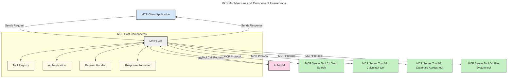
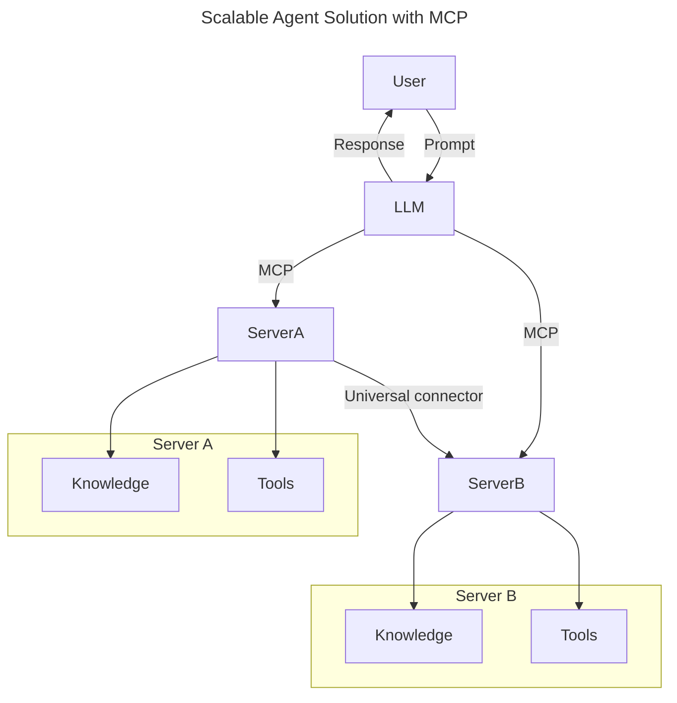

<!--
CO_OP_TRANSLATOR_METADATA:
{
  "original_hash": "9678e0c6945b8e0c23586869b0e26783",
  "translation_date": "2025-10-06T11:10:22+00:00",
  "source_file": "00-Introduction/README.md",
  "language_code": "ro"
}
-->
# Introducere în Protocolul Contextului Modelului (MCP): De ce este important pentru aplicațiile AI scalabile

_(Click pe imaginea de mai sus pentru a viziona videoclipul lecției)_

Aplicațiile AI generative reprezintă un mare pas înainte, deoarece permit utilizatorilor să interacționeze cu aplicația folosind prompturi în limbaj natural. Totuși, pe măsură ce se investesc mai multe resurse și timp în astfel de aplicații, este important să te asiguri că poți integra funcționalități și resurse într-un mod ușor de extins, că aplicația ta poate funcționa cu mai multe modele și să gestioneze diversele complexități ale acestora. Pe scurt, construirea aplicațiilor AI generative este ușoară la început, dar pe măsură ce acestea cresc și devin mai complexe, trebuie să începi să definești o arhitectură și, cel mai probabil, să te bazezi pe un standard pentru a te asigura că aplicațiile tale sunt construite într-un mod consistent. Aici intervine MCP pentru a organiza lucrurile și a oferi un standard.

---

## **🔍 Ce este Protocolul Contextului Modelului (MCP)?**

**Protocolul Contextului Modelului (MCP)** este o **interfață deschisă și standardizată** care permite modelelor de limbaj mare (LLMs) să interacționeze fără probleme cu instrumente externe, API-uri și surse de date. Acesta oferă o arhitectură consistentă pentru a extinde funcționalitatea modelelor AI dincolo de datele lor de antrenament, facilitând sisteme AI mai inteligente, scalabile și mai receptive.

---

## **🎯 De ce este importantă standardizarea în AI**

Pe măsură ce aplicațiile AI generative devin mai complexe, este esențial să adopți standarde care să asigure **scalabilitate, extensibilitate, mentenabilitate** și **evitarea dependenței de un singur furnizor**. MCP răspunde acestor nevoi prin:

- Unificarea integrărilor între modele și instrumente
- Reducerea soluțiilor personalizate fragile
- Permisiunea ca mai multe modele de la furnizori diferiți să coexiste într-un singur ecosistem

**Notă:** Deși MCP se prezintă ca un standard deschis, nu există planuri de a-l standardiza prin organisme de standardizare existente, cum ar fi IEEE, IETF, W3C, ISO sau alte organisme de standardizare.

---

## **📚 Obiective de învățare**

La finalul acestui articol, vei putea:

- Defini **Protocolul Contextului Modelului (MCP)** și cazurile sale de utilizare
- Înțelege cum MCP standardizează comunicarea între modele și instrumente
- Identifica componentele de bază ale arhitecturii MCP
- Explora aplicații reale ale MCP în contexte de întreprindere și dezvoltare

---

## **💡 De ce Protocolul Contextului Modelului (MCP) este revoluționar**

### **🔗 MCP rezolvă fragmentarea în interacțiunile AI**

Înainte de MCP, integrarea modelelor cu instrumente necesita:

- Cod personalizat pentru fiecare pereche model-instrument
- API-uri nestandardizate pentru fiecare furnizor
- Probleme frecvente cauzate de actualizări
- Scalabilitate redusă cu mai multe instrumente

### **✅ Beneficiile standardizării MCP**

| **Beneficiu**              | **Descriere**                                                                |
|----------------------------|-------------------------------------------------------------------------------|
| Interoperabilitate         | LLM-urile funcționează fără probleme cu instrumente de la diferiți furnizori |
| Consistență                | Comportament uniform pe platforme și instrumente                             |
| Reutilizabilitate          | Instrumentele construite o dată pot fi utilizate în mai multe proiecte       |
| Dezvoltare accelerată      | Reducerea timpului de dezvoltare prin utilizarea interfețelor standardizate   |

---

## **🧱 Prezentare generală a arhitecturii MCP la nivel înalt**

MCP urmează un model **client-server**, unde:

- **Gazdele MCP** rulează modelele AI
- **Clienții MCP** inițiază cereri
- **Serverele MCP** furnizează context, instrumente și capabilități

### **Componente cheie:**

- **Resurse** – Date statice sau dinamice pentru modele  
- **Prompturi** – Fluxuri de lucru predefinite pentru generare ghidată  
- **Instrumente** – Funcții executabile precum căutări, calcule  
- **Eșantionare** – Comportament agentic prin interacțiuni recursive  

---

## Cum funcționează serverele MCP

Serverele MCP funcționează astfel:

- **Fluxul cererii**:
    1. O cerere este inițiată de un utilizator final sau de un software care acționează în numele acestuia.
    2. **Clientul MCP** trimite cererea către o **Gazdă MCP**, care gestionează runtime-ul modelului AI.
    3. **Modelul AI** primește promptul utilizatorului și poate solicita acces la instrumente externe sau date prin una sau mai multe apeluri de instrumente.
    4. **Gazda MCP**, nu modelul direct, comunică cu **Serverele MCP** corespunzătoare folosind protocolul standardizat.
- **Funcționalitatea gazdei MCP**:
    - **Registrul de instrumente**: Menține un catalog al instrumentelor disponibile și al capabilităților acestora.
    - **Autentificare**: Verifică permisiunile pentru accesul la instrumente.
    - **Handler de cereri**: Procesează cererile de instrumente primite de la model.
    - **Formatter de răspuns**: Structurează ieșirile instrumentelor într-un format pe care modelul îl poate înțelege.
- **Execuția serverului MCP**:
    - **Gazda MCP** direcționează apelurile de instrumente către unul sau mai multe **Servere MCP**, fiecare expunând funcții specializate (de exemplu, căutări, calcule, interogări de baze de date).
    - **Serverele MCP** își îndeplinesc operațiunile respective și returnează rezultatele către **Gazda MCP** într-un format consistent.
    - **Gazda MCP** formatează și transmite aceste rezultate către **Modelul AI**.
- **Finalizarea răspunsului**:
    - **Modelul AI** încorporează ieșirile instrumentelor într-un răspuns final.
    - **Gazda MCP** trimite acest răspuns înapoi către **Clientul MCP**, care îl livrează utilizatorului final sau software-ului apelant.

## 👨‍💻 Cum să construiești un server MCP (cu exemple)

Serverele MCP îți permit să extinzi capabilitățile LLM prin furnizarea de date și funcționalități.

Ești gata să încerci? Iată SDK-uri specifice limbajului și/sau stack-ului, cu exemple de creare a unor servere MCP simple în diferite limbaje/stack-uri:

- **Python SDK**: https://github.com/modelcontextprotocol/python-sdk

- **TypeScript SDK**: https://github.com/modelcontextprotocol/typescript-sdk

- **Java SDK**: https://github.com/modelcontextprotocol/java-sdk

- **C#/.NET SDK**: https://github.com/modelcontextprotocol/csharp-sdk

## 🌍 Cazuri de utilizare reale pentru MCP

MCP permite o gamă largă de aplicații prin extinderea capabilităților AI:

| **Aplicație**               | **Descriere**                                                                |
|-----------------------------|-------------------------------------------------------------------------------|
| Integrarea datelor de întreprindere | Conectarea LLM-urilor la baze de date, CRM-uri sau instrumente interne         |
| Sisteme AI agentice         | Permite agenților autonomi acces la instrumente și fluxuri de lucru decizionale |
| Aplicații multi-modale      | Combinarea textului, imaginilor și audio într-o singură aplicație AI unificată |
| Integrarea datelor în timp real | Adăugarea datelor live în interacțiunile AI pentru rezultate mai precise și actuale |

### 🧠 MCP = Standard universal pentru interacțiunile AI

Protocolul Contextului Modelului (MCP) acționează ca un standard universal pentru interacțiunile AI, la fel cum USB-C a standardizat conexiunile fizice pentru dispozitive. În lumea AI, MCP oferă o interfață consistentă, permițând modelelor (clienți) să se integreze fără probleme cu instrumente externe și furnizori de date (servere). Acest lucru elimină necesitatea diverselor protocoale personalizate pentru fiecare API sau sursă de date.

Sub MCP, un instrument compatibil MCP (denumit server MCP) urmează un standard unificat. Aceste servere pot lista instrumentele sau acțiunile pe care le oferă și le pot executa atunci când sunt solicitate de un agent AI. Platformele de agenți AI care suportă MCP sunt capabile să descopere instrumentele disponibile de la servere și să le invoce prin acest protocol standard.

### 💡 Facilitează accesul la cunoștințe

Dincolo de oferirea de instrumente, MCP facilitează și accesul la cunoștințe. Acesta permite aplicațiilor să ofere context modelelor de limbaj mare (LLMs) prin conectarea lor la diverse surse de date. De exemplu, un server MCP ar putea reprezenta un depozit de documente al unei companii, permițând agenților să recupereze informații relevante la cerere. Un alt server ar putea gestiona acțiuni specifice, cum ar fi trimiterea de e-mailuri sau actualizarea de înregistrări. Din perspectiva agentului, acestea sunt pur și simplu instrumente pe care le poate utiliza—unele instrumente returnează date (context de cunoștințe), în timp ce altele efectuează acțiuni. MCP gestionează eficient ambele.

Un agent care se conectează la un server MCP învață automat capabilitățile disponibile ale serverului și datele accesibile printr-un format standard. Această standardizare permite disponibilitatea dinamică a instrumentelor. De exemplu, adăugarea unui nou server MCP în sistemul unui agent face ca funcțiile acestuia să fie utilizabile imediat, fără a necesita personalizarea suplimentară a instrucțiunilor agentului.

Această integrare simplificată se aliniază cu fluxul ilustrat în diagrama următoare, unde serverele oferă atât instrumente, cât și cunoștințe, asigurând colaborarea fără probleme între sisteme.

### 👉 Exemplu: Soluție scalabilă pentru agenți

Conectorul Universal permite serverelor MCP să comunice și să împărtășească capabilități între ele, permițând ServerA să delege sarcini către ServerB sau să acceseze instrumentele și cunoștințele acestuia. Acest lucru federază instrumentele și datele între servere, susținând arhitecturi agentice scalabile și modulare.

Federarea instrumentelor și cunoștințelor: Instrumentele și datele pot fi accesate între servere, permițând arhitecturi agentice mai scalabile și modulare.

### 🔄 Scenarii avansate MCP cu integrarea LLM pe partea clientului

Dincolo de arhitectura de bază MCP, există scenarii avansate în care atât clientul, cât și serverul conțin LLM-uri, permițând interacțiuni mai sofisticate. În diagrama următoare, **Aplicația Client** ar putea fi un IDE cu un număr de instrumente MCP disponibile pentru utilizator prin LLM:

```mermaid
---
title: Advanced MCP Scenarios with Client-Server LLM Integration
description: A sequence diagram showing the detailed interaction flow between user, client application, client LLM, multiple MCP servers, and server LLM, illustrating tool discovery, user interaction, direct tool calling, and feature negotiation phases
---
sequenceDiagram
    autonumber
    actor User as 👤 User
    participant ClientApp as 🖥️ Client App
    participant ClientLLM as 🧠 Client LLM
    participant Server1 as 🔧 MCP Server 1
    participant Server2 as 📚 MCP Server 2
    participant ServerLLM as 🤖 Server LLM
    
    %% Discovery Phase
    rect rgb(220, 240, 255)
        Note over ClientApp, Server2: TOOL DISCOVERY PHASE
        ClientApp->>+Server1: Request available tools/resources
        Server1-->>-ClientApp: Return tool list (JSON)
        ClientApp->>+Server2: Request available tools/resources
        Server2-->>-ClientApp: Return tool list (JSON)
        Note right of ClientApp: Store combined tool<br/>catalog locally
    end
    
    %% User Interaction
    rect rgb(255, 240, 220)
        Note over User, ClientLLM: USER INTERACTION PHASE
        User->>+ClientApp: Enter natural language prompt
        ClientApp->>+ClientLLM: Forward prompt + tool catalog
        ClientLLM->>-ClientLLM: Analyze prompt & select tools
    end
    
    %% Scenario A: Direct Tool Calling
    alt Direct Tool Calling
        rect rgb(220, 255, 220)
            Note over ClientApp, Server1: SCENARIO A: DIRECT TOOL CALLING
            ClientLLM->>+ClientApp: Request tool execution
            ClientApp->>+Server1: Execute specific tool
            Server1-->>-ClientApp: Return results
            ClientApp->>+ClientLLM: Process results
            ClientLLM-->>-ClientApp: Generate response
            ClientApp-->>-User: Display final answer
        end
    
    %% Scenario B: Feature Negotiation (VS Code style)
    else Feature Negotiation (VS Code style)
        rect rgb(255, 220, 220)
            Note over ClientApp, ServerLLM: SCENARIO B: FEATURE NEGOTIATION
            ClientLLM->>+ClientApp: Identify needed capabilities
            ClientApp->>+Server2: Negotiate features/capabilities
            Server2->>+ServerLLM: Request additional context
            ServerLLM-->>-Server2: Provide context
            Server2-->>-ClientApp: Return available features
            ClientApp->>+Server2: Call negotiated tools
            Server2-->>-ClientApp: Return results
            ClientApp->>+ClientLLM: Process results
            ClientLLM-->>-ClientApp: Generate response
            ClientApp-->>-User: Display final answer
        end
    end
```

## 🔐 Beneficii practice ale MCP

Iată beneficiile practice ale utilizării MCP:

- **Actualitate**: Modelele pot accesa informații actualizate dincolo de datele lor de antrenament
- **Extinderea capabilităților**: Modelele pot utiliza instrumente specializate pentru sarcini pentru care nu au fost antrenate
- **Reducerea halucinațiilor**: Sursele de date externe oferă o bază factuală
- **Confidențialitate**: Datele sensibile pot rămâne în medii sigure, în loc să fie incluse în prompturi

## 📌 Concluzii cheie

Următoarele sunt concluzii cheie pentru utilizarea MCP:

- **MCP** standardizează modul în care modelele AI interacționează cu instrumentele și datele
- Promovează **extensibilitatea, consistența și interoperabilitatea**
- MCP ajută la **reducerea timpului de dezvoltare, îmbunătățirea fiabilității și extinderea capabilităților modelelor**
- Arhitectura client-server **permite aplicații AI flexibile și extensibile**

## 🧠 Exercițiu

Gândește-te la o aplicație AI pe care ești interesat să o construiești.

- Ce **instrumente sau date externe** ar putea să-i îmbunătățească capabilitățile?
- Cum ar putea MCP să facă integrarea **mai simplă și mai fiabilă?**

## Resurse suplimentare

- [Repository-ul MCP pe GitHub](https://github.com/modelcontextprotocol)

## Ce urmează

Următorul: [Capitolul 1: Concepte de bază](../01-CoreConcepts/README.md)

---

**Declinare de responsabilitate**:  
Acest document a fost tradus folosind serviciul de traducere AI [Co-op Translator](https://github.com/Azure/co-op-translator). Deși ne străduim să asigurăm acuratețea, vă rugăm să fiți conștienți că traducerile automate pot conține erori sau inexactități. Documentul original în limba sa natală ar trebui considerat sursa autoritară. Pentru informații critice, se recomandă traducerea profesională realizată de un specialist uman. Nu ne asumăm responsabilitatea pentru eventualele neînțelegeri sau interpretări greșite care pot apărea din utilizarea acestei traduceri.