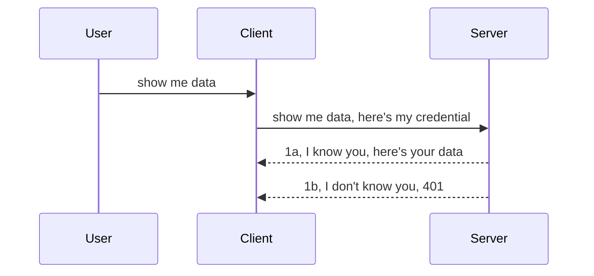

<!--
CO_OP_TRANSLATOR_METADATA:
{
  "original_hash": "5b00b8a8971a07d2d8803be4c9f138f8",
  "translation_date": "2025-10-07T01:03:36+00:00",
  "source_file": "03-GettingStarted/11-simple-auth/README.md",
  "language_code": "ro"
}
-->
# Autentificare simplă

SDK-urile MCP acceptă utilizarea OAuth 2.1, care, să fim sinceri, este un proces destul de complex ce implică concepte precum server de autentificare, server de resurse, trimiterea acreditărilor, obținerea unui cod, schimbarea codului pentru un token de tip bearer, până când în final poți accesa datele resurselor tale. Dacă nu ești familiarizat cu OAuth, care este o soluție excelentă de implementat, este o idee bună să începi cu un nivel de bază de autentificare și să avansezi treptat către o securitate mai bună. De aceea există acest capitol, pentru a te ajuta să evoluezi către metode mai avansate de autentificare.

## Autentificare, ce înseamnă?

Autentificarea (Auth) este prescurtarea pentru autentificare și autorizare. Ideea este că trebuie să facem două lucruri:

- **Autentificare**, care este procesul de a decide dacă permitem unei persoane să intre în „casa” noastră, adică dacă are dreptul să fie „aici” și să acceseze serverul nostru de resurse unde se află funcționalitățile serverului MCP.
- **Autorizare**, care este procesul de a determina dacă un utilizator ar trebui să aibă acces la resursele specifice pe care le solicită, de exemplu, aceste comenzi sau produse, sau dacă are permisiunea de a citi conținutul, dar nu de a-l șterge, ca alt exemplu.

## Acreditive: cum spunem sistemului cine suntem

Majoritatea dezvoltatorilor web încep să se gândească la furnizarea unei acreditive către server, de obicei un secret care indică dacă au permisiunea de a fi „aici” (autentificare). Această acreditivă este de obicei o versiune codificată în base64 a unui nume de utilizator și a unei parole sau o cheie API care identifică în mod unic un utilizator specific.

Aceasta implică trimiterea acreditivei printr-un header numit „Authorization”, astfel:

```json
{ "Authorization": "secret123" }
```

Aceasta este de obicei denumită autentificare de bază. Fluxul general funcționează în felul următor:



Acum că înțelegem cum funcționează din punct de vedere al fluxului, cum îl implementăm? Ei bine, majoritatea serverelor web au un concept numit middleware, un fragment de cod care rulează ca parte a cererii și care poate verifica acreditivele, iar dacă acestea sunt valide, permite cererii să treacă mai departe. Dacă cererea nu are acreditive valide, atunci primești o eroare de autentificare. Să vedem cum poate fi implementat acest lucru:

**Python**

```python
class AuthMiddleware(BaseHTTPMiddleware):
    async def dispatch(self, request, call_next):

        has_header = request.headers.get("Authorization")
        if not has_header:
            print("-> Missing Authorization header!")
            return Response(status_code=401, content="Unauthorized")

        if not valid_token(has_header):
            print("-> Invalid token!")
            return Response(status_code=403, content="Forbidden")

        print("Valid token, proceeding...")
       
        response = await call_next(request)
        # add any customer headers or change in the response in some way
        return response


starlette_app.add_middleware(CustomHeaderMiddleware)
```

Aici am:

- Creat un middleware numit `AuthMiddleware`, unde metoda sa `dispatch` este invocată de serverul web.
- Adăugat middleware-ul la serverul web:

    ```python
    starlette_app.add_middleware(AuthMiddleware)
    ```

- Scris logica de validare care verifică dacă header-ul Authorization este prezent și dacă secretul trimis este valid:

    ```python
    has_header = request.headers.get("Authorization")
    if not has_header:
        print("-> Missing Authorization header!")
        return Response(status_code=401, content="Unauthorized")

    if not valid_token(has_header):
        print("-> Invalid token!")
        return Response(status_code=403, content="Forbidden")
    ```

    Dacă secretul este prezent și valid, atunci permitem cererii să treacă mai departe apelând `call_next` și returnăm răspunsul.

    ```python
    response = await call_next(request)
    # add any customer headers or change in the response in some way
    return response
    ```

Cum funcționează: dacă se face o cerere web către server, middleware-ul va fi invocat, iar în funcție de implementarea sa, va permite cererii să treacă mai departe sau va returna o eroare care indică faptul că clientul nu are permisiunea de a continua.

**TypeScript**

Aici creăm un middleware folosind cadrul popular Express și interceptăm cererea înainte ca aceasta să ajungă la serverul MCP. Iată codul pentru aceasta:

```typescript
function isValid(secret) {
    return secret === "secret123";
}

app.use((req, res, next) => {
    // 1. Authorization header present?  
    if(!req.headers["Authorization"]) {
        res.status(401).send('Unauthorized');
    }
    
    let token = req.headers["Authorization"];

    // 2. Check validity.
    if(!isValid(token)) {
        res.status(403).send('Forbidden');
    }

   
    console.log('Middleware executed');
    // 3. Passes request to the next step in the request pipeline.
    next();
});
```

În acest cod:

1. Verificăm dacă header-ul Authorization este prezent, iar dacă nu, trimitem o eroare 401.
2. Ne asigurăm că acreditiva/token-ul este valid, iar dacă nu, trimitem o eroare 403.
3. În final, cererea este transmisă mai departe în pipeline-ul cererii și returnăm resursa solicitată.

## Exercițiu: Implementarea autentificării

Să ne folosim cunoștințele și să încercăm să implementăm acest lucru. Iată planul:

Server

- Crearea unui server web și a unei instanțe MCP.
- Implementarea unui middleware pentru server.

Client 

- Trimiterea unei cereri web, cu acreditive, prin header.

### -1- Crearea unui server web și a unei instanțe MCP

În primul pas, trebuie să creăm instanța serverului web și serverul MCP.

**Python**

Aici creăm o instanță de server MCP, o aplicație web starlette și o găzduim cu uvicorn.

```python
# creating MCP Server

app = FastMCP(
    name="MCP Resource Server",
    instructions="Resource Server that validates tokens via Authorization Server introspection",
    host=settings["host"],
    port=settings["port"],
    debug=True
)

# creating starlette web app
starlette_app = app.streamable_http_app()

# serving app via uvicorn
async def run(starlette_app):
    import uvicorn
    config = uvicorn.Config(
            starlette_app,
            host=app.settings.host,
            port=app.settings.port,
            log_level=app.settings.log_level.lower(),
        )
    server = uvicorn.Server(config)
    await server.serve()

run(starlette_app)
```

În acest cod:

- Creăm serverul MCP.
- Construim aplicația web starlette din serverul MCP, `app.streamable_http_app()`.
- Găzduim și servim aplicația web folosind uvicorn `server.serve()`.

**TypeScript**

Aici creăm o instanță de server MCP.

```typescript
const server = new McpServer({
      name: "example-server",
      version: "1.0.0"
    });

    // ... set up server resources, tools, and prompts ...
```

Această creare a serverului MCP va trebui să aibă loc în cadrul definiției rutei POST /mcp, așa că să luăm codul de mai sus și să-l mutăm astfel:

```typescript
import express from "express";
import { randomUUID } from "node:crypto";
import { McpServer } from "@modelcontextprotocol/sdk/server/mcp.js";
import { StreamableHTTPServerTransport } from "@modelcontextprotocol/sdk/server/streamableHttp.js";
import { isInitializeRequest } from "@modelcontextprotocol/sdk/types.js"

const app = express();
app.use(express.json());

// Map to store transports by session ID
const transports: { [sessionId: string]: StreamableHTTPServerTransport } = {};

// Handle POST requests for client-to-server communication
app.post('/mcp', async (req, res) => {
  // Check for existing session ID
  const sessionId = req.headers['mcp-session-id'] as string | undefined;
  let transport: StreamableHTTPServerTransport;

  if (sessionId && transports[sessionId]) {
    // Reuse existing transport
    transport = transports[sessionId];
  } else if (!sessionId && isInitializeRequest(req.body)) {
    // New initialization request
    transport = new StreamableHTTPServerTransport({
      sessionIdGenerator: () => randomUUID(),
      onsessioninitialized: (sessionId) => {
        // Store the transport by session ID
        transports[sessionId] = transport;
      },
      // DNS rebinding protection is disabled by default for backwards compatibility. If you are running this server
      // locally, make sure to set:
      // enableDnsRebindingProtection: true,
      // allowedHosts: ['127.0.0.1'],
    });

    // Clean up transport when closed
    transport.onclose = () => {
      if (transport.sessionId) {
        delete transports[transport.sessionId];
      }
    };
    const server = new McpServer({
      name: "example-server",
      version: "1.0.0"
    });

    // ... set up server resources, tools, and prompts ...

    // Connect to the MCP server
    await server.connect(transport);
  } else {
    // Invalid request
    res.status(400).json({
      jsonrpc: '2.0',
      error: {
        code: -32000,
        message: 'Bad Request: No valid session ID provided',
      },
      id: null,
    });
    return;
  }

  // Handle the request
  await transport.handleRequest(req, res, req.body);
});

// Reusable handler for GET and DELETE requests
const handleSessionRequest = async (req: express.Request, res: express.Response) => {
  const sessionId = req.headers['mcp-session-id'] as string | undefined;
  if (!sessionId || !transports[sessionId]) {
    res.status(400).send('Invalid or missing session ID');
    return;
  }
  
  const transport = transports[sessionId];
  await transport.handleRequest(req, res);
};

// Handle GET requests for server-to-client notifications via SSE
app.get('/mcp', handleSessionRequest);

// Handle DELETE requests for session termination
app.delete('/mcp', handleSessionRequest);

app.listen(3000);
```

Acum vezi cum crearea serverului MCP a fost mutată în cadrul `app.post("/mcp")`.

Să trecem la pasul următor, crearea middleware-ului pentru a valida acreditiva primită.

### -2- Implementarea unui middleware pentru server

Să trecem la partea de middleware. Aici vom crea un middleware care caută o acreditivă în header-ul `Authorization` și o validează. Dacă este acceptabilă, cererea va continua să facă ceea ce trebuie (de exemplu, listarea instrumentelor, citirea unei resurse sau orice funcționalitate MCP solicitată de client).

**Python**

Pentru a crea middleware-ul, trebuie să creăm o clasă care moștenește `BaseHTTPMiddleware`. Există două părți interesante:

- Cererea `request`, din care citim informațiile din header.
- `call_next`, callback-ul pe care trebuie să-l invocăm dacă clientul a furnizat o acreditivă pe care o acceptăm.

Mai întâi, trebuie să gestionăm cazul în care header-ul `Authorization` lipsește:

```python
has_header = request.headers.get("Authorization")

# no header present, fail with 401, otherwise move on.
if not has_header:
    print("-> Missing Authorization header!")
    return Response(status_code=401, content="Unauthorized")
```

Aici trimitem un mesaj 401 Unauthorized, deoarece clientul eșuează la autentificare.

Apoi, dacă a fost trimisă o acreditivă, trebuie să verificăm validitatea acesteia astfel:

```python
 if not valid_token(has_header):
    print("-> Invalid token!")
    return Response(status_code=403, content="Forbidden")
```

Observă cum trimitem un mesaj 403 Forbidden mai sus. Să vedem middleware-ul complet mai jos, implementând tot ce am menționat mai sus:

```python
class AuthMiddleware(BaseHTTPMiddleware):
    async def dispatch(self, request, call_next):

        has_header = request.headers.get("Authorization")
        if not has_header:
            print("-> Missing Authorization header!")
            return Response(status_code=401, content="Unauthorized")

        if not valid_token(has_header):
            print("-> Invalid token!")
            return Response(status_code=403, content="Forbidden")

        print("Valid token, proceeding...")
        print(f"-> Received {request.method} {request.url}")
        response = await call_next(request)
        response.headers['Custom'] = 'Example'
        return response

```

Excelent, dar ce se întâmplă cu funcția `valid_token`? Iată mai jos:

```python
# DON'T use for production - improve it !!
def valid_token(token: str) -> bool:
    # remove the "Bearer " prefix
    if token.startswith("Bearer "):
        token = token[7:]
        return token == "secret-token"
    return False
```

Acest lucru ar trebui, evident, îmbunătățit.

IMPORTANT: Nu ar trebui NICIODATĂ să aveți secrete precum acesta în cod. Ar trebui ideal să preluați valoarea pentru comparație dintr-o sursă de date sau de la un IDP (furnizor de servicii de identitate) sau, și mai bine, să lăsați IDP-ul să facă validarea.

**TypeScript**

Pentru a implementa acest lucru cu Express, trebuie să apelăm metoda `use`, care acceptă funcții middleware.

Trebuie să:

- Interacționăm cu variabila cererii pentru a verifica acreditiva transmisă în proprietatea `Authorization`.
- Validăm acreditiva, iar dacă este validă, cererea continuă și cererea MCP a clientului face ceea ce trebuie (de exemplu, listarea instrumentelor, citirea resursei sau orice altceva legat de MCP).

Aici verificăm dacă header-ul `Authorization` este prezent, iar dacă nu, oprim cererea să treacă mai departe:

```typescript
if(!req.headers["authorization"]) {
    res.status(401).send('Unauthorized');
    return;
}
```

Dacă header-ul nu este trimis, primești o eroare 401.

Apoi, verificăm dacă acreditiva este validă, iar dacă nu, oprim din nou cererea, dar cu un mesaj ușor diferit:

```typescript
if(!isValid(token)) {
    res.status(403).send('Forbidden');
    return;
} 
```

Observă cum acum primești o eroare 403.

Iată codul complet:

```typescript
app.use((req, res, next) => {
    console.log('Request received:', req.method, req.url, req.headers);
    console.log('Headers:', req.headers["authorization"]);
    if(!req.headers["authorization"]) {
        res.status(401).send('Unauthorized');
        return;
    }
    
    let token = req.headers["authorization"];

    if(!isValid(token)) {
        res.status(403).send('Forbidden');
        return;
    }  

    console.log('Middleware executed');
    next();
});
```

Am configurat serverul web pentru a accepta un middleware care verifică acreditiva pe care clientul speră să ne-o trimită. Ce se întâmplă cu clientul însuși?

### -3- Trimiterea unei cereri web cu acreditiva prin header

Trebuie să ne asigurăm că clientul transmite acreditiva prin header. Deoarece vom folosi un client MCP pentru aceasta, trebuie să ne dăm seama cum se face acest lucru.

**Python**

Pentru client, trebuie să transmitem un header cu acreditiva noastră astfel:

```python
# DON'T hardcode the value, have it at minimum in an environment variable or a more secure storage
token = "secret-token"

async with streamablehttp_client(
        url = f"http://localhost:{port}/mcp",
        headers = {"Authorization": f"Bearer {token}"}
    ) as (
        read_stream,
        write_stream,
        session_callback,
    ):
        async with ClientSession(
            read_stream,
            write_stream
        ) as session:
            await session.initialize()
      
            # TODO, what you want done in the client, e.g list tools, call tools etc.
```

Observă cum populăm proprietatea `headers` astfel: ` headers = {"Authorization": f"Bearer {token}"}`.

**TypeScript**

Putem rezolva acest lucru în doi pași:

1. Populăm un obiect de configurare cu acreditiva noastră.
2. Transmitem obiectul de configurare către transport.

```typescript

// DON'T hardcode the value like shown here. At minimum have it as a env variable and use something like dotenv (in dev mode).
let token = "secret123"

// define a client transport option object
let options: StreamableHTTPClientTransportOptions = {
  sessionId: sessionId,
  requestInit: {
    headers: {
      "Authorization": "secret123"
    }
  }
};

// pass the options object to the transport
async function main() {
   const transport = new StreamableHTTPClientTransport(
      new URL(serverUrl),
      options
   );
```

Aici vezi cum a trebuit să creăm un obiect `options` și să plasăm header-ele noastre sub proprietatea `requestInit`.

IMPORTANT: Cum putem îmbunătăți acest lucru de aici? Ei bine, implementarea actuală are câteva probleme. În primul rând, transmiterea unei acreditive în acest mod este destul de riscantă, cu excepția cazului în care ai cel puțin HTTPS. Chiar și atunci, acreditiva poate fi furată, așa că ai nevoie de un sistem în care să poți revoca ușor token-ul și să adaugi verificări suplimentare, cum ar fi locația de unde provine cererea, dacă cererea se întâmplă prea des (comportament de tip bot), pe scurt, există o mulțime de preocupări.

Totuși, pentru API-uri foarte simple, unde nu vrei ca nimeni să-ți apeleze API-ul fără a fi autentificat, ceea ce avem aici este un început bun.

Cu toate acestea, să încercăm să întărim puțin securitatea folosind un format standardizat precum JSON Web Token, cunoscut și sub numele de JWT sau token-uri „JOT”.

## JSON Web Tokens, JWT

Așadar, încercăm să îmbunătățim lucrurile față de transmiterea unor acreditive foarte simple. Care sunt îmbunătățirile imediate pe care le obținem adoptând JWT?

- **Îmbunătățiri de securitate**. În autentificarea de bază, trimiți numele de utilizator și parola ca un token codificat în base64 (sau trimiți o cheie API) iar acest lucru se repetă, ceea ce crește riscul. Cu JWT, trimiți numele de utilizator și parola și primești un token în schimb, care este și limitat în timp, ceea ce înseamnă că va expira. JWT îți permite să utilizezi ușor controlul de acces detaliat folosind roluri, scopuri și permisiuni. 
- **Statelessness și scalabilitate**. JWT-urile sunt autonome, transportă toate informațiile utilizatorului și elimină necesitatea stocării sesiunilor pe server. Token-ul poate fi validat local.
- **Interoperabilitate și federare**. JWT-urile sunt centrale în Open ID Connect și sunt utilizate cu furnizori de identitate cunoscuți precum Entra ID, Google Identity și Auth0. Ele permit, de asemenea, utilizarea autentificării unice și multe altele, făcându-le de nivel enterprise.
- **Modularitate și flexibilitate**. JWT-urile pot fi utilizate cu API Gateways precum Azure API Management, NGINX și altele. De asemenea, acceptă scenarii de autentificare și comunicare server-to-service, inclusiv scenarii de impersonare și delegare.
- **Performanță și caching**. JWT-urile pot fi cache-ate după decodare, ceea ce reduce necesitatea de analizare. Acest lucru ajută în special aplicațiile cu trafic intens, deoarece îmbunătățește debitul și reduce încărcarea pe infrastructura aleasă.
- **Funcționalități avansate**. De asemenea, acceptă introspecția (verificarea validității pe server) și revocarea (invalidarea unui token).

Cu toate aceste beneficii, să vedem cum putem duce implementarea noastră la nivelul următor.

## Transformarea autentificării de bază în JWT

Așadar, schimbările pe care trebuie să le facem la un nivel general sunt:

- **Învățarea construirii unui token JWT** și pregătirea acestuia pentru a fi trimis de la client la server.
- **Validarea unui token JWT**, iar dacă este valid, să permitem clientului accesul la resursele noastre.
- **Stocarea securizată a token-ului**. Cum stocăm acest token.
- **Protejarea rutelor**. Trebuie să protejăm rutele, în cazul nostru, trebuie să protejăm rutele și funcționalitățile MCP specifice.
- **Adăugarea token-urilor de reîmprospătare**. Asigurarea creării de token-uri care sunt de scurtă durată, dar token-uri de reîmprospătare care sunt de lungă durată și care pot fi utilizate pentru a obține token-uri noi dacă acestea expiră. De asemenea, asigurarea unui endpoint de reîmprospătare și a unei strategii de rotație.

### -1- Construirea unui token JWT

În primul rând, un token JWT are următoarele părți:

- **header**, algoritmul utilizat și tipul de token.
- **payload**, revendicări, cum ar fi sub (utilizatorul sau entitatea pe care o reprezintă token-ul. Într-un scenariu de autentificare, acesta este de obicei ID-ul utilizatorului), exp (când expiră), rol (rolul).
- **signature**, semnat cu un secret sau o cheie privată.

Pentru aceasta, va trebui să construim header-ul, payload-ul și token-ul codificat.

**Python**

```python

import jwt
import jwt
from jwt.exceptions import ExpiredSignatureError, InvalidTokenError
import datetime

# Secret key used to sign the JWT
secret_key = 'your-secret-key'

header = {
    "alg": "HS256",
    "typ": "JWT"
}

# the user info andits claims and expiry time
payload = {
    "sub": "1234567890",               # Subject (user ID)
    "name": "User Userson",                # Custom claim
    "admin": True,                     # Custom claim
    "iat": datetime.datetime.utcnow(),# Issued at
    "exp": datetime.datetime.utcnow() + datetime.timedelta(hours=1)  # Expiry
}

# encode it
encoded_jwt = jwt.encode(payload, secret_key, algorithm="HS256", headers=header)
```

În codul de mai sus am:

- Definit un header folosind HS256 ca algoritm și tipul să fie JWT.
- Construit un payload care conține un subiect sau ID utilizator, un nume de utilizator, un rol, când a fost emis și când este setat să expire, implementând astfel aspectul limitat în timp pe care l-am menționat mai devreme. 

**TypeScript**

Aici vom avea nevoie de câteva dependențe care ne vor ajuta să construim token-ul JWT.

Dependențe

```sh

npm install jsonwebtoken
npm install --save-dev @types/jsonwebtoken
```

Acum că avem acest lucru în loc, să creăm header-ul, payload-ul și prin aceasta să creăm token-ul codificat.

```typescript
import jwt from 'jsonwebtoken';

const secretKey = 'your-secret-key'; // Use env vars in production

// Define the payload
const payload = {
  sub: '1234567890',
  name: 'User usersson',
  admin: true,
  iat: Math.floor(Date.now() / 1000), // Issued at
  exp: Math.floor(Date.now() / 1000) + 60 * 60 // Expires in 1 hour
};

// Define the header (optional, jsonwebtoken sets defaults)
const header = {
  alg: 'HS256',
  typ: 'JWT'
};

// Create the token
const token = jwt.sign(payload, secretKey, {
  algorithm: 'HS256',
  header: header
});

console.log('JWT:', token);
```

Acest token este:

Semnat folosind HS256  
Valid pentru 1 oră  
Include revendicări precum sub, name, admin, iat și exp.

### -2- Validarea unui token

De asemenea, va trebui să validăm un token, acesta este ceva ce ar trebui să facem pe server pentru a ne asigura că ceea ce ne trimite clientul este într-adevăr valid. Există multe verificări pe care ar trebui să le facem aici, de la validarea structurii sale până la validitatea sa. De asemenea, ești încurajat să adaugi alte verificări pentru a vedea dacă utilizatorul este în sistemul tău și altele.

Pentru a valida un token, trebuie să-l decodăm pentru a-l putea citi și apoi să începem să-i verificăm validitatea:

**Python**

```python

# Decode and verify the JWT
try:
    decoded = jwt.decode(token, secret_key, algorithms=["HS256"])
    print("✅ Token is valid.")
    print("Decoded claims:")
    for key, value in decoded.items():
        print(f"  {key}: {value}")
except ExpiredSignatureError:
    print("❌ Token has expired.")
except InvalidTokenError as e:
    print(f"❌ Invalid token: {e}")

```

În acest cod, apelăm `jwt.decode` folosind token-ul, cheia secretă și algoritmul ales ca intrare. Observă cum folosim o construcție try-catch, deoarece o validare eșuată duce la o eroare.

**TypeScript**

Aici trebuie să apelăm `jwt.verify` pentru a obține o versiune decodificată a token-ului pe care o putem analiza mai departe. Dacă acest apel eșuează, înseamnă că structura token-ului este incorectă sau nu mai este validă.

```typescript

try {
  const decoded = jwt.verify(token, secretKey);
  console.log('Decoded Payload:', decoded);
} catch (err) {
  console.error('Token verification failed:', err);
}
```

NOTĂ: așa cum am menționat anterior, ar trebui să efectuăm verificări suplimentare pentru a ne asigura că acest token indică un utilizator din sistemul nostru și să ne asigurăm că utilizatorul are drepturile pe care pretinde că le are.
Mai departe, să analizăm controlul accesului bazat pe roluri, cunoscut și sub denumirea de RBAC.

## Adăugarea controlului accesului bazat pe roluri

Ideea este că dorim să exprimăm faptul că diferite roluri au permisiuni diferite. De exemplu, presupunem că un administrator poate face totul, un utilizator obișnuit poate citi/scrie, iar un invitat poate doar citi. Prin urmare, iată câteva niveluri posibile de permisiuni:

- Admin.Write 
- User.Read
- Guest.Read

Să vedem cum putem implementa un astfel de control folosind middleware. Middleware-urile pot fi adăugate pe fiecare rută, precum și pentru toate rutele.

**Python**

```python
from starlette.middleware.base import BaseHTTPMiddleware
from starlette.responses import JSONResponse
import jwt

# DON'T have the secret in the code like, this is for demonstration purposes only. Read it from a safe place.
SECRET_KEY = "your-secret-key" # put this in env variable
REQUIRED_PERMISSION = "User.Read"

class JWTPermissionMiddleware(BaseHTTPMiddleware):
    async def dispatch(self, request, call_next):
        auth_header = request.headers.get("Authorization")
        if not auth_header or not auth_header.startswith("Bearer "):
            return JSONResponse({"error": "Missing or invalid Authorization header"}, status_code=401)

        token = auth_header.split(" ")[1]
        try:
            decoded = jwt.decode(token, SECRET_KEY, algorithms=["HS256"])
        except jwt.ExpiredSignatureError:
            return JSONResponse({"error": "Token expired"}, status_code=401)
        except jwt.InvalidTokenError:
            return JSONResponse({"error": "Invalid token"}, status_code=401)

        permissions = decoded.get("permissions", [])
        if REQUIRED_PERMISSION not in permissions:
            return JSONResponse({"error": "Permission denied"}, status_code=403)

        request.state.user = decoded
        return await call_next(request)


```

Există câteva moduri diferite de a adăuga middleware, cum ar fi cele de mai jos:

```python

# Alt 1: add middleware while constructing starlette app
middleware = [
    Middleware(JWTPermissionMiddleware)
]

app = Starlette(routes=routes, middleware=middleware)

# Alt 2: add middleware after starlette app is a already constructed
starlette_app.add_middleware(JWTPermissionMiddleware)

# Alt 3: add middleware per route
routes = [
    Route(
        "/mcp",
        endpoint=..., # handler
        middleware=[Middleware(JWTPermissionMiddleware)]
    )
]
```

**TypeScript**

Putem folosi `app.use` și un middleware care va rula pentru toate cererile.

```typescript
app.use((req, res, next) => {
    console.log('Request received:', req.method, req.url, req.headers);
    console.log('Headers:', req.headers["authorization"]);

    // 1. Check if authorization header has been sent

    if(!req.headers["authorization"]) {
        res.status(401).send('Unauthorized');
        return;
    }
    
    let token = req.headers["authorization"];

    // 2. Check if token is valid
    if(!isValid(token)) {
        res.status(403).send('Forbidden');
        return;
    }  

    // 3. Check if token user exist in our system
    if(!isExistingUser(token)) {
        res.status(403).send('Forbidden');
        console.log("User does not exist");
        return;
    }
    console.log("User exists");

    // 4. Verify the token has the right permissions
    if(!hasScopes(token, ["User.Read"])){
        res.status(403).send('Forbidden - insufficient scopes');
    }

    console.log("User has required scopes");

    console.log('Middleware executed');
    next();
});

```

Există câteva lucruri pe care middleware-ul nostru le poate face și pe care AR TREBUI să le facă, și anume:

1. Verificarea dacă antetul de autorizare este prezent.
2. Verificarea dacă token-ul este valid; apelăm metoda `isValid`, pe care am scris-o pentru a verifica integritatea și validitatea token-ului JWT.
3. Verificarea existenței utilizatorului în sistemul nostru; ar trebui să verificăm acest lucru.

   ```typescript
    // users in DB
   const users = [
     "user1",
     "User usersson",
   ]

   function isExistingUser(token) {
     let decodedToken = verifyToken(token);

     // TODO, check if user exists in DB
     return users.includes(decodedToken?.name || "");
   }
   ```

   Mai sus, am creat o listă foarte simplă de `users`, care ar trebui să fie, evident, într-o bază de date.

4. În plus, ar trebui să verificăm și dacă token-ul are permisiunile corecte.

   ```typescript
   if(!hasScopes(token, ["User.Read"])){
        res.status(403).send('Forbidden - insufficient scopes');
   }
   ```

   În codul de mai sus din middleware, verificăm dacă token-ul conține permisiunea User.Read; dacă nu, trimitem o eroare 403. Mai jos este metoda helper `hasScopes`.

   ```typescript
   function hasScopes(scope: string, requiredScopes: string[]) {
     let decodedToken = verifyToken(scope);
    return requiredScopes.every(scope => decodedToken?.scopes.includes(scope));
  }
   ```

Have a think which additional checks you should be doing, but these are the absolute minimum of checks you should be doing.

Using Express as a web framework is a common choice. There are helpers library when you use JWT so you can write less code.

- `express-jwt`, helper library that provides a middleware that helps decode your token.
- `express-jwt-permissions`, this provides a middleware `guard` that helps check if a certain permission is on the token.

Here's what these libraries can look like when used:

```typescript
const express = require('express');
const jwt = require('express-jwt');
const guard = require('express-jwt-permissions')();

const app = express();
const secretKey = 'your-secret-key'; // put this in env variable

// Decode JWT and attach to req.user
app.use(jwt({ secret: secretKey, algorithms: ['HS256'] }));

// Check for User.Read permission
app.use(guard.check('User.Read'));

// multiple permissions
// app.use(guard.check(['User.Read', 'Admin.Access']));

app.get('/protected', (req, res) => {
  res.json({ message: `Welcome ${req.user.name}` });
});

// Error handler
app.use((err, req, res, next) => {
  if (err.code === 'permission_denied') {
    return res.status(403).send('Forbidden');
  }
  next(err);
});

```

Acum ai văzut cum middleware-ul poate fi utilizat atât pentru autentificare, cât și pentru autorizare. Dar ce se întâmplă cu MCP? Schimbă modul în care facem autentificarea? Să aflăm în secțiunea următoare.

### -3- Adăugarea RBAC la MCP

Până acum ai văzut cum poți adăuga RBAC prin middleware; totuși, pentru MCP nu există o modalitate simplă de a adăuga RBAC pe funcționalitate specifică MCP. Ce facem atunci? Ei bine, trebuie doar să adăugăm cod care verifică, în acest caz, dacă clientul are drepturile de a apela un anumit instrument:

Ai câteva opțiuni diferite pentru a realiza RBAC pe funcționalitate specifică, iată câteva:

- Adăugarea unei verificări pentru fiecare instrument, resursă, prompt unde trebuie să verifici nivelul de permisiune.

   **Python**

   ```python
   @tool()
   def delete_product(id: int):
      try:
          check_permissions(role="Admin.Write", request)
      catch:
        pass # client failed authorization, raise authorization error
   ```

   **TypeScript**

   ```typescript
   server.registerTool(
    "delete-product",
    {
      title: Delete a product",
      description: "Deletes a product",
      inputSchema: { id: z.number() }
    },
    async ({ id }) => {
      
      try {
        checkPermissions("Admin.Write", request);
        // todo, send id to productService and remote entry
      } catch(Exception e) {
        console.log("Authorization error, you're not allowed");  
      }

      return {
        content: [{ type: "text", text: `Deletected product with id ${id}` }]
      };
    }
   );
   ```


- Utilizarea unei abordări avansate pe server și a handler-elor de cereri pentru a minimiza numărul de locuri în care trebuie să faci verificarea.

   **Python**

   ```python
   
   tool_permission = {
      "create_product": ["User.Write", "Admin.Write"],
      "delete_product": ["Admin.Write"]
   }

   def has_permission(user_permissions, required_permissions) -> bool:
      # user_permissions: list of permissions the user has
      # required_permissions: list of permissions required for the tool
      return any(perm in user_permissions for perm in required_permissions)

   @server.call_tool()
   async def handle_call_tool(
     name: str, arguments: dict[str, str] | None
   ) -> list[types.TextContent]:
    # Assume request.user.permissions is a list of permissions for the user
     user_permissions = request.user.permissions
     required_permissions = tool_permission.get(name, [])
     if not has_permission(user_permissions, required_permissions):
        # Raise error "You don't have permission to call tool {name}"
        raise Exception(f"You don't have permission to call tool {name}")
     # carry on and call tool
     # ...
   ```   
   

   **TypeScript**

   ```typescript
   function hasPermission(userPermissions: string[], requiredPermissions: string[]): boolean {
       if (!Array.isArray(userPermissions) || !Array.isArray(requiredPermissions)) return false;
       // Return true if user has at least one required permission
       
       return requiredPermissions.some(perm => userPermissions.includes(perm));
   }
  
   server.setRequestHandler(CallToolRequestSchema, async (request) => {
      const { params: { name } } = request;
  
      let permissions = request.user.permissions;
  
      if (!hasPermission(permissions, toolPermissions[name])) {
         return new Error(`You don't have permission to call ${name}`);
      }
  
      // carry on..
   });
   ```

   Notă: va trebui să te asiguri că middleware-ul atribuie un token decodat proprietății user a cererii, astfel încât codul de mai sus să fie simplificat.

### Rezumat

Acum că am discutat cum să adăugăm suport pentru RBAC în general și pentru MCP în particular, este timpul să încerci să implementezi securitatea pe cont propriu pentru a te asigura că ai înțeles conceptele prezentate.

## Tema 1: Construiește un server MCP și un client MCP folosind autentificare de bază

Aici vei aplica ceea ce ai învățat în ceea ce privește trimiterea acreditărilor prin anteturi.

## Soluția 1

[Soluția 1](./code/basic/README.md)

## Tema 2: Îmbunătățește soluția din Tema 1 pentru a utiliza JWT

Ia prima soluție, dar de data aceasta să o îmbunătățim.

În loc să folosim Basic Auth, să folosim JWT.

## Soluția 2

[Soluția 2](./solution/jwt-solution/README.md)

## Provocare

Adaugă RBAC pe fiecare instrument, așa cum am descris în secțiunea "Adăugarea RBAC la MCP".

## Rezumat

Sperăm că ai învățat multe în acest capitol, de la lipsa totală de securitate, la securitate de bază, la JWT și cum poate fi adăugat la MCP.

Am construit o fundație solidă cu JWT-uri personalizate, dar pe măsură ce scalăm, ne îndreptăm spre un model de identitate bazat pe standarde. Adoptarea unui IdP precum Entra sau Keycloak ne permite să delegăm emiterea, validarea și gestionarea ciclului de viață al token-urilor către o platformă de încredere — eliberându-ne pentru a ne concentra pe logica aplicației și experiența utilizatorului.

Pentru asta, avem un [capitol mai avansat despre Entra](../../05-AdvancedTopics/mcp-security-entra/README.md)

---

**Declinare de responsabilitate**:  
Acest document a fost tradus folosind serviciul de traducere AI [Co-op Translator](https://github.com/Azure/co-op-translator). Deși ne străduim să asigurăm acuratețea, vă rugăm să fiți conștienți că traducerile automate pot conține erori sau inexactități. Documentul original în limba sa natală ar trebui considerat sursa autoritară. Pentru informații critice, se recomandă traducerea profesională realizată de oameni. Nu ne asumăm responsabilitatea pentru neînțelegerile sau interpretările greșite care pot apărea din utilizarea acestei traduceri.