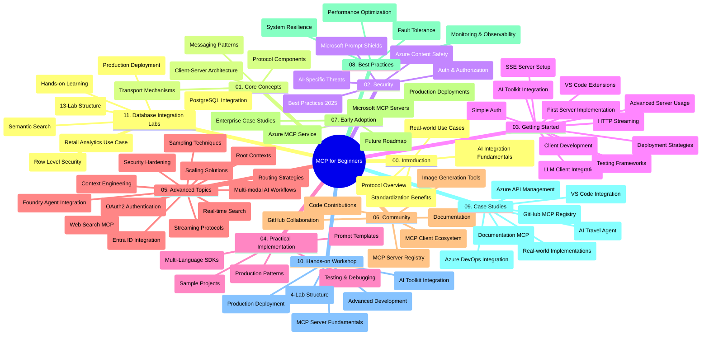

<!--
CO_OP_TRANSLATOR_METADATA:
{
  "original_hash": "af27b0acfae6caa134d9701453884df8",
  "translation_date": "2025-10-06T23:59:45+00:00",
  "source_file": "study_guide.md",
  "language_code": "ro"
}
-->
# Protocolul Model Context (MCP) pentru Începători - Ghid de Studiu

Acest ghid de studiu oferă o prezentare generală a structurii și conținutului depozitului pentru curriculumul "Protocolul Model Context (MCP) pentru Începători". Folosește acest ghid pentru a naviga eficient prin depozit și pentru a profita la maximum de resursele disponibile.

## Prezentare Generală a Depozitului

Protocolul Model Context (MCP) este un cadru standardizat pentru interacțiunile dintre modelele AI și aplicațiile client. Creat inițial de Anthropic, MCP este acum întreținut de comunitatea mai largă MCP prin organizația oficială GitHub. Acest depozit oferă un curriculum cuprinzător, cu exemple practice de cod în C#, Java, JavaScript, Python și TypeScript, conceput pentru dezvoltatori AI, arhitecți de sisteme și ingineri software.

## Harta Vizuală a Curriculumului

## Structura Depozitului

Depozitul este organizat în unsprezece secțiuni principale, fiecare concentrându-se pe diferite aspecte ale MCP:

1. **Introducere (00-Introduction/)**
   - Prezentare generală a Protocolului Model Context
   - De ce este importantă standardizarea în fluxurile de lucru AI
   - Cazuri practice de utilizare și beneficii

2. **Concepte de Bază (01-CoreConcepts/)**
   - Arhitectura client-server
   - Componentele cheie ale protocolului
   - Modele de mesagerie în MCP

3. **Securitate (02-Security/)**
   - Amenințări de securitate în sistemele bazate pe MCP
   - Cele mai bune practici pentru implementări sigure
   - Strategii de autentificare și autorizare
   - **Documentație Cuprinzătoare de Securitate**:
     - Cele mai bune practici de securitate MCP 2025
     - Ghid de implementare Azure Content Safety
     - Controale și tehnici de securitate MCP
     - Referință rapidă pentru cele mai bune practici MCP
   - **Subiecte Cheie de Securitate**:
     - Atacuri de injectare de prompt și otrăvirea uneltelor
     - Deturnarea sesiunii și problemele de confuzie a autorității
     - Vulnerabilități de transmitere a token-urilor
     - Permisiuni excesive și controlul accesului
     - Securitatea lanțului de aprovizionare pentru componentele AI
     - Integrarea Microsoft Prompt Shields

4. **Primii Pași (03-GettingStarted/)**
   - Configurarea și configurarea mediului
   - Crearea de servere și clienți MCP de bază
   - Integrarea cu aplicații existente
   - Include secțiuni pentru:
     - Prima implementare a unui server
     - Dezvoltarea clientului
     - Integrarea clientului LLM
     - Integrarea cu VS Code
     - Server Server-Sent Events (SSE)
     - Utilizarea avansată a serverului
     - Streaming HTTP
     - Integrarea AI Toolkit
     - Strategii de testare
     - Ghiduri de implementare

5. **Implementare Practică (04-PracticalImplementation/)**
   - Utilizarea SDK-urilor în diferite limbaje de programare
   - Tehnici de depanare, testare și validare
   - Crearea de șabloane de prompt reutilizabile și fluxuri de lucru
   - Proiecte exemplu cu implementări practice

6. **Subiecte Avansate (05-AdvancedTopics/)**
   - Tehnici de inginerie a contextului
   - Integrarea agenților Foundry
   - Fluxuri de lucru AI multi-modale
   - Demonstrații de autentificare OAuth2
   - Capacități de căutare în timp real
   - Streaming în timp real
   - Implementarea contextelor rădăcină
   - Strategii de rutare
   - Tehnici de eșantionare
   - Abordări de scalare
   - Considerații de securitate
   - Integrarea securității Entra ID
   - Integrarea căutării web

7. **Contribuții Comunitare (06-CommunityContributions/)**
   - Cum să contribui cu cod și documentație
   - Colaborarea prin GitHub
   - Îmbunătățiri și feedback din partea comunității
   - Utilizarea diferiților clienți MCP (Claude Desktop, Cline, VSCode)
   - Lucrul cu servere MCP populare, inclusiv generarea de imagini

8. **Lecții din Adopția Timpurie (07-LessonsfromEarlyAdoption/)**
   - Implementări reale și povești de succes
   - Construirea și implementarea soluțiilor bazate pe MCP
   - Tendințe și foaie de parcurs viitoare
   - **Ghidul Serverelor MCP Microsoft**: Ghid cuprinzător pentru 10 servere MCP Microsoft gata de producție, inclusiv:
     - Server MCP Microsoft Learn Docs
     - Server MCP Azure (15+ conectori specializați)
     - Server MCP GitHub
     - Server MCP Azure DevOps
     - Server MCP MarkItDown
     - Server MCP SQL Server
     - Server MCP Playwright
     - Server MCP Dev Box
     - Server MCP Azure AI Foundry
     - Server MCP Microsoft 365 Agents Toolkit

9. **Cele Mai Bune Practici (08-BestPractices/)**
   - Optimizarea performanței
   - Proiectarea sistemelor MCP tolerante la erori
   - Strategii de testare și reziliență

10. **Studii de Caz (09-CaseStudy/)**
    - **Șapte studii de caz cuprinzătoare** care demonstrează versatilitatea MCP în diverse scenarii:
    - **Agenți de Călătorie Azure AI**: Orchestrare multi-agent cu Azure OpenAI și AI Search
    - **Integrarea Azure DevOps**: Automatizarea proceselor de lucru cu actualizări de date YouTube
    - **Recuperare de Documentație în Timp Real**: Client Python în consolă cu streaming HTTP
    - **Generator Interactiv de Planuri de Studiu**: Aplicație web Chainlit cu AI conversațional
    - **Documentație în Editor**: Integrare VS Code cu fluxuri de lucru GitHub Copilot
    - **Managementul API-urilor Azure**: Integrare API la nivel de întreprindere cu crearea serverului MCP
    - **Registrul MCP GitHub**: Dezvoltarea ecosistemului și platforma de integrare agentică
    - Exemple de implementare care acoperă integrarea la nivel de întreprindere, productivitatea dezvoltatorilor și dezvoltarea ecosistemului

11. **Atelier Practic (10-StreamliningAIWorkflowsBuildingAnMCPServerWithAIToolkit/)**
    - Atelier practic cuprinzător care combină MCP cu AI Toolkit
    - Construirea de aplicații inteligente care leagă modelele AI de unelte din lumea reală
    - Module practice care acoperă fundamentele, dezvoltarea serverului personalizat și strategiile de implementare în producție
    - **Structura Laboratorului**:
      - Laborator 1: Fundamentele Serverului MCP
      - Laborator 2: Dezvoltarea Avansată a Serverului MCP
      - Laborator 3: Integrarea AI Toolkit
      - Laborator 4: Implementare și Scalare în Producție
    - Abordare bazată pe laboratoare cu instrucțiuni pas cu pas

12. **Laboratoare de Integrare a Serverului MCP cu Baza de Date (11-MCPServerHandsOnLabs/)**
    - **Cale de învățare cuprinzătoare de 13 laboratoare** pentru construirea serverelor MCP gata de producție cu integrare PostgreSQL
    - **Implementare reală de analitică retail** folosind cazul de utilizare Zava Retail
    - **Modele la nivel de întreprindere** incluzând Securitatea la Nivel de Rând (RLS), căutare semantică și acces multi-chiriaș
    - **Structura Completă a Laboratoarelor**:
      - **Laboratoare 00-03: Fundamente** - Introducere, Arhitectură, Securitate, Configurarea Mediului
      - **Laboratoare 04-06: Construirea Serverului MCP** - Proiectarea Bazei de Date, Implementarea Serverului MCP, Dezvoltarea Uneltelor
      - **Laboratoare 07-09: Funcționalități Avansate** - Căutare Semantică, Testare și Depanare, Integrare VS Code
      - **Laboratoare 10-12: Producție și Cele Mai Bune Practici** - Implementare, Monitorizare, Optimizare
    - **Tehnologii Acoperite**: Cadrul FastMCP, PostgreSQL, Azure OpenAI, Azure Container Apps, Application Insights
    - **Rezultate ale Învățării**: Servere MCP gata de producție, modele de integrare a bazelor de date, analitică bazată pe AI, securitate la nivel de întreprindere

## Resurse Suplimentare

Depozitul include resurse de suport:

- **Folderul Images**: Conține diagrame și ilustrații utilizate pe parcursul curriculumului
- **Traduceri**: Suport multilingvistic cu traduceri automate ale documentației
- **Resurse Oficiale MCP**:
  - [Documentația MCP](https://modelcontextprotocol.io/)
  - [Specificația MCP](https://spec.modelcontextprotocol.io/)
  - [Depozitul GitHub MCP](https://github.com/modelcontextprotocol)

## Cum să Folosești Acest Depozit

1. **Învățare Secvențială**: Urmează capitolele în ordine (00 până la 11) pentru o experiență de învățare structurată.
2. **Focalizare pe Limbaj**: Dacă ești interesat de un anumit limbaj de programare, explorează directoarele de exemple pentru implementări în limbajul tău preferat.
3. **Implementare Practică**: Începe cu secțiunea "Primii Pași" pentru a-ți configura mediul și a crea primul tău server și client MCP.
4. **Explorare Avansată**: După ce te familiarizezi cu elementele de bază, aprofundează subiectele avansate pentru a-ți extinde cunoștințele.
5. **Implicare Comunitară**: Alătură-te comunității MCP prin discuțiile de pe GitHub și canalele Discord pentru a te conecta cu experți și alți dezvoltatori.

## Clienți și Unelte MCP

Curriculumul acoperă diferiți clienți și unelte MCP:

1. **Clienți Oficiali**:
   - Visual Studio Code 
   - MCP în Visual Studio Code
   - Claude Desktop
   - Claude în VSCode 
   - Claude API

2. **Clienți Comunitari**:
   - Cline (bazat pe terminal)
   - Cursor (editor de cod)
   - ChatMCP
   - Windsurf

3. **Unelte de Management MCP**:
   - MCP CLI
   - MCP Manager
   - MCP Linker
   - MCP Router

## Servere MCP Populare

Depozitul introduce diverse servere MCP, inclusiv:

1. **Servere Oficiale Microsoft MCP**:
   - Server MCP Microsoft Learn Docs
   - Server MCP Azure (15+ conectori specializați)
   - Server MCP GitHub
   - Server MCP Azure DevOps
   - Server MCP MarkItDown
   - Server MCP SQL Server
   - Server MCP Playwright
   - Server MCP Dev Box
   - Server MCP Azure AI Foundry
   - Server MCP Microsoft 365 Agents Toolkit

2. **Servere de Referință Oficiale**:
   - Filesystem
   - Fetch
   - Memory
   - Sequential Thinking

3. **Generare de Imagini**:
   - Azure OpenAI DALL-E 3
   - Stable Diffusion WebUI
   - Replicate

4. **Unelte de Dezvoltare**:
   - Git MCP
   - Control Terminal
   - Asistent de Cod

5. **Servere Specializate**:
   - Salesforce
   - Microsoft Teams
   - Jira & Confluence

## Contribuții

Acest depozit acceptă contribuții din partea comunității. Vezi secțiunea Contribuții Comunitare pentru îndrumări despre cum să contribui eficient la ecosistemul MCP.

----

*Acest ghid de studiu a fost actualizat pe 6 octombrie 2025 și oferă o prezentare generală a depozitului la acea dată. Conținutul depozitului poate fi actualizat după această dată.*

---

**Declinare de responsabilitate**:  
Acest document a fost tradus folosind serviciul de traducere AI [Co-op Translator](https://github.com/Azure/co-op-translator). Deși ne străduim să asigurăm acuratețea, vă rugăm să fiți conștienți că traducerile automate pot conține erori sau inexactități. Documentul original în limba sa natală ar trebui considerat sursa autoritară. Pentru informații critice, se recomandă traducerea profesională realizată de un specialist. Nu ne asumăm responsabilitatea pentru eventualele neînțelegeri sau interpretări greșite care pot apărea din utilizarea acestei traduceri.