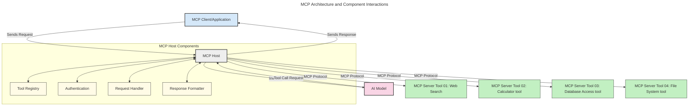
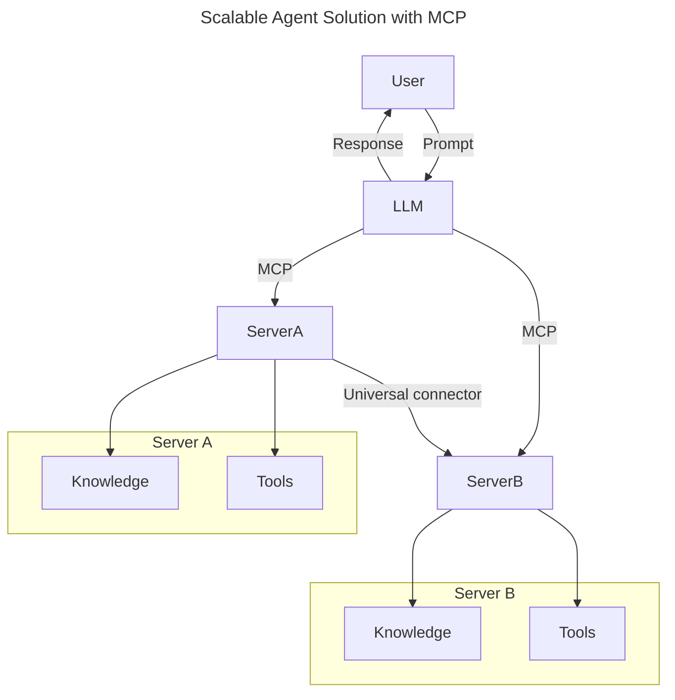
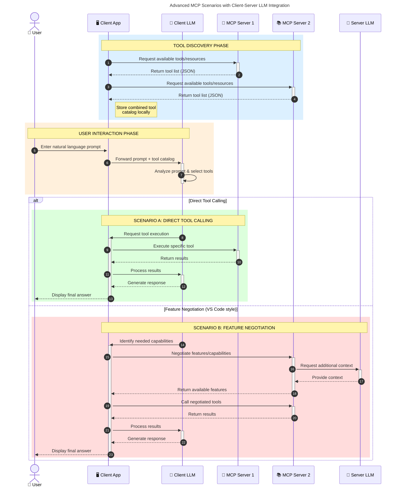

<!--
CO_OP_TRANSLATOR_METADATA:
{
  "original_hash": "9678e0c6945b8e0c23586869b0e26783",
  "translation_date": "2025-10-06T10:49:34+00:00",
  "source_file": "00-Introduction/README.md",
  "language_code": "ru"
}
-->
# Введение в протокол контекста модели (MCP): почему он важен для масштабируемых AI-приложений

_(Нажмите на изображение выше, чтобы посмотреть видео урока)_

Генеративные AI-приложения — это значительный шаг вперед, так как они часто позволяют пользователю взаимодействовать с приложением с помощью естественных языковых запросов. Однако, по мере того как в такие приложения вкладывается больше времени и ресурсов, важно убедиться, что вы можете легко интегрировать функционал и ресурсы так, чтобы их было легко расширять, чтобы ваше приложение могло работать с несколькими моделями и учитывать их особенности. Проще говоря, создание генеративных AI-приложений легко начать, но по мере их роста и усложнения вам нужно будет определить архитектуру и, вероятно, полагаться на стандарт, чтобы обеспечить их последовательное построение. Здесь на помощь приходит MCP, организуя процессы и предоставляя стандарт.

---

## **🔍 Что такое протокол контекста модели (MCP)?**

**Протокол контекста модели (MCP)** — это **открытый стандартизированный интерфейс**, который позволяет большим языковым моделям (LLM) беспрепятственно взаимодействовать с внешними инструментами, API и источниками данных. Он обеспечивает последовательную архитектуру для расширения функциональности AI-моделей за пределы их обучающих данных, создавая более умные, масштабируемые и отзывчивые AI-системы.

---

## **🎯 Почему стандартизация в AI важна**

По мере усложнения генеративных AI-приложений становится необходимо внедрять стандарты, которые обеспечивают **масштабируемость, расширяемость, поддерживаемость** и **избежание зависимости от одного поставщика**. MCP решает эти задачи, предоставляя:

- Унификацию интеграции моделей и инструментов
- Снижение необходимости в нестабильных, разовых кастомных решениях
- Возможность сосуществования нескольких моделей от разных поставщиков в одной экосистеме

**Примечание:** Хотя MCP позиционирует себя как открытый стандарт, нет планов стандартизировать MCP через существующие стандартизирующие организации, такие как IEEE, IETF, W3C, ISO или другие.

---

## **📚 Цели обучения**

К концу этой статьи вы сможете:

- Определить, что такое **протокол контекста модели (MCP)** и его области применения
- Понять, как MCP стандартизирует взаимодействие моделей с инструментами
- Выделить основные компоненты архитектуры MCP
- Исследовать реальные примеры использования MCP в корпоративных и разработческих контекстах

---

## **💡 Почему протокол контекста модели (MCP) меняет правила игры**

### **🔗 MCP решает проблему фрагментации в AI-взаимодействиях**

До появления MCP интеграция моделей с инструментами требовала:

- Кастомного кода для каждой пары инструмент-модель
- Нестандартизированных API для каждого поставщика
- Частых сбоев из-за обновлений
- Плохой масштабируемости при добавлении новых инструментов

### **✅ Преимущества стандартизации MCP**

| **Преимущество**          | **Описание**                                                                   |
|---------------------------|-------------------------------------------------------------------------------|
| Взаимодействие            | LLM беспрепятственно работают с инструментами от разных поставщиков          |
| Последовательность         | Единое поведение на разных платформах и инструментах                         |
| Повторное использование    | Инструменты, созданные один раз, могут использоваться в разных проектах       |
| Ускоренная разработка      | Сокращение времени разработки благодаря стандартизированным интерфейсам       |

---

## **🧱 Обзор архитектуры MCP на высоком уровне**

MCP следует модели **клиент-сервер**, где:

- **Хосты MCP** запускают AI-модели
- **Клиенты MCP** инициируют запросы
- **Серверы MCP** предоставляют контекст, инструменты и возможности

### **Основные компоненты:**

- **Ресурсы** – Статические или динамические данные для моделей  
- **Запросы** – Предопределенные рабочие процессы для направленного генеративного процесса  
- **Инструменты** – Исполняемые функции, такие как поиск, вычисления  
- **Выборка** – Агентное поведение через рекурсивные взаимодействия  

---

## Как работают серверы MCP

Серверы MCP функционируют следующим образом:

- **Поток запросов**:
    1. Запрос инициируется конечным пользователем или программным обеспечением, действующим от его имени.
    2. **Клиент MCP** отправляет запрос **хосту MCP**, который управляет средой выполнения AI-модели.
    3. **AI-модель** получает запрос пользователя и может запросить доступ к внешним инструментам или данным через один или несколько вызовов инструментов.
    4. **Хост MCP**, а не сама модель, взаимодействует с соответствующими **сервером(ами) MCP** с использованием стандартизированного протокола.
- **Функциональность хоста MCP**:
    - **Реестр инструментов**: Поддерживает каталог доступных инструментов и их возможностей.
    - **Аутентификация**: Проверяет разрешения на доступ к инструментам.
    - **Обработчик запросов**: Обрабатывает входящие запросы инструментов от модели.
    - **Форматировщик ответов**: Структурирует выходные данные инструментов в формате, понятном модели.
- **Выполнение сервером MCP**:
    - **Хост MCP** направляет вызовы инструментов одному или нескольким **серверам MCP**, каждый из которых предоставляет специализированные функции (например, поиск, вычисления, запросы к базе данных).
    - **Серверы MCP** выполняют свои операции и возвращают результаты **хосту MCP** в согласованном формате.
    - **Хост MCP** форматирует и передает эти результаты **AI-модели**.
- **Завершение ответа**:
    - **AI-модель** включает выходные данные инструментов в окончательный ответ.
    - **Хост MCP** отправляет этот ответ обратно **клиенту MCP**, который доставляет его конечному пользователю или вызывающему программному обеспечению.

## 👨‍💻 Как создать сервер MCP (с примерами)

Серверы MCP позволяют расширять возможности LLM, предоставляя данные и функционал.

Готовы попробовать? Вот SDK для различных языков и/или стеков с примерами создания простых серверов MCP:

- **Python SDK**: https://github.com/modelcontextprotocol/python-sdk

- **TypeScript SDK**: https://github.com/modelcontextprotocol/typescript-sdk

- **Java SDK**: https://github.com/modelcontextprotocol/java-sdk

- **C#/.NET SDK**: https://github.com/modelcontextprotocol/csharp-sdk

## 🌍 Реальные примеры использования MCP

MCP открывает широкий спектр приложений, расширяя возможности AI:

| **Приложение**             | **Описание**                                                                   |
|----------------------------|-------------------------------------------------------------------------------|
| Интеграция корпоративных данных | Подключение LLM к базам данных, CRM или внутренним инструментам             |
| Агентные AI-системы         | Обеспечение автономных агентов доступом к инструментам и рабочим процессам принятия решений |
| Мультимодальные приложения  | Объединение текстовых, графических и аудио инструментов в одном AI-приложении |
| Интеграция данных в реальном времени | Включение актуальных данных в AI-взаимодействия для более точных и актуальных результатов |

### 🧠 MCP = Универсальный стандарт для AI-взаимодействий

Протокол контекста модели (MCP) выступает в роли универсального стандарта для AI-взаимодействий, подобно тому, как USB-C стандартизировал физические соединения для устройств. В мире AI MCP предоставляет единый интерфейс, позволяя моделям (клиентам) беспрепятственно интегрироваться с внешними инструментами и поставщиками данных (серверами). Это устраняет необходимость в разнообразных, кастомных протоколах для каждого API или источника данных.

В рамках MCP инструмент, совместимый с MCP (называемый сервером MCP), следует унифицированному стандарту. Эти серверы могут перечислять инструменты или действия, которые они предлагают, и выполнять эти действия по запросу AI-агента. Платформы AI-агентов, поддерживающие MCP, способны обнаруживать доступные инструменты от серверов и вызывать их через этот стандартный протокол.

### 💡 Обеспечение доступа к знаниям

Помимо предоставления инструментов, MCP также обеспечивает доступ к знаниям. Он позволяет приложениям предоставлять контекст большим языковым моделям (LLM), связывая их с различными источниками данных. Например, сервер MCP может представлять репозиторий документов компании, позволяя агентам извлекать актуальную информацию по запросу. Другой сервер может обрабатывать конкретные действия, такие как отправка писем или обновление записей. С точки зрения агента, это просто инструменты, которые он может использовать — некоторые инструменты возвращают данные (контекст знаний), а другие выполняют действия. MCP эффективно управляет обоими типами.

Агент, подключающийся к серверу MCP, автоматически узнает доступные возможности и данные сервера через стандартный формат. Эта стандартизация позволяет динамическую доступность инструментов. Например, добавление нового сервера MCP в систему агента делает его функции сразу доступными без необходимости дальнейшей настройки инструкций агента.

Эта упрощенная интеграция соответствует потоку, изображенному на следующей диаграмме, где серверы предоставляют как инструменты, так и знания, обеспечивая беспрепятственное сотрудничество между системами.

### 👉 Пример: Масштабируемое решение для агентов

Универсальный коннектор позволяет серверам MCP взаимодействовать и делиться возможностями друг с другом, позволяя ServerA делегировать задачи ServerB или получать доступ к его инструментам и знаниям. Это объединяет инструменты и данные между серверами, поддерживая масштабируемые и модульные архитектуры агентов. Благодаря стандартизации MCP, агенты могут динамически обнаруживать и маршрутизировать запросы между серверами без жестко закодированных интеграций.

Объединение инструментов и знаний: Инструменты и данные могут быть доступны между серверами, что позволяет создавать более масштабируемые и модульные агентные архитектуры.

### 🔄 Расширенные сценарии MCP с интеграцией LLM на стороне клиента

Помимо базовой архитектуры MCP, существуют расширенные сценарии, где как клиент, так и сервер содержат LLM, обеспечивая более сложные взаимодействия. На следующей диаграмме **Client App** может быть IDE с рядом доступных инструментов MCP для использования LLM:

## 🔐 Практические преимущества MCP

Вот практические преимущества использования MCP:

- **Актуальность**: Модели могут получать доступ к актуальной информации за пределами своих обучающих данных
- **Расширение возможностей**: Модели могут использовать специализированные инструменты для задач, для которых они не были обучены
- **Снижение галлюцинаций**: Внешние источники данных обеспечивают фактическую основу
- **Конфиденциальность**: Чувствительные данные могут оставаться в защищенных средах вместо того, чтобы быть встроенными в запросы

## 📌 Основные выводы

Основные выводы по использованию MCP:

- **MCP** стандартизирует взаимодействие AI-моделей с инструментами и данными
- Способствует **расширяемости, последовательности и взаимодействию**
- MCP помогает **сократить время разработки, повысить надежность и расширить возможности моделей**
- Архитектура клиент-сервер **обеспечивает гибкие, расширяемые AI-приложения**

## 🧠 Упражнение

Подумайте о AI-приложении, которое вы хотите создать.

- Какие **внешние инструменты или данные** могли бы улучшить его возможности?
- Как MCP может сделать интеграцию **проще и надежнее?**

## Дополнительные ресурсы

- [Репозиторий MCP на GitHub](https://github.com/modelcontextprotocol)

## Что дальше

Далее: [Глава 1: Основные концепции](../01-CoreConcepts/README.md)

---

**Отказ от ответственности**:  
Этот документ был переведен с помощью сервиса автоматического перевода [Co-op Translator](https://github.com/Azure/co-op-translator). Несмотря на наши усилия обеспечить точность, автоматические переводы могут содержать ошибки или неточности. Оригинальный документ на его родном языке следует считать авторитетным источником. Для получения критически важной информации рекомендуется профессиональный перевод человеком. Мы не несем ответственности за любые недоразумения или неправильные интерпретации, возникшие в результате использования данного перевода.