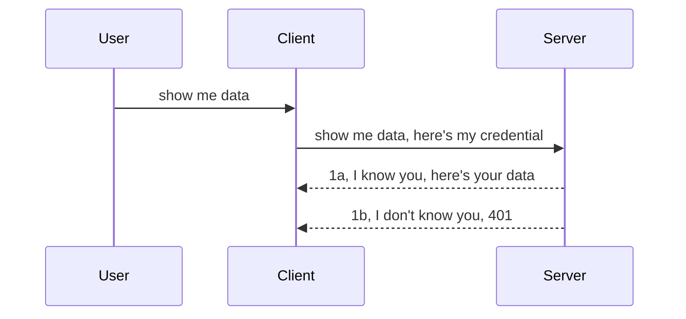

<!--
CO_OP_TRANSLATOR_METADATA:
{
  "original_hash": "5b00b8a8971a07d2d8803be4c9f138f8",
  "translation_date": "2025-10-07T00:31:50+00:00",
  "source_file": "03-GettingStarted/11-simple-auth/README.md",
  "language_code": "ru"
}
-->
# Простая аутентификация

SDK MCP поддерживают использование OAuth 2.1, который, если честно, является довольно сложным процессом, включающим такие понятия, как сервер аутентификации, сервер ресурсов, отправка учетных данных, получение кода, обмен кода на токен до тех пор, пока вы наконец не получите доступ к данным ресурса. Если вы не знакомы с OAuth, который является отличным инструментом для реализации, лучше начать с базового уровня аутентификации и постепенно переходить к более надежной безопасности. Именно поэтому существует эта глава — чтобы помочь вам освоить более продвинутую аутентификацию.

## Что мы имеем в виду под аутентификацией?

Аутентификация — это сокращение от "аутентификация и авторизация". Суть заключается в том, что нам нужно выполнить две задачи:

- **Аутентификация** — процесс определения, можно ли впустить человека в наш "дом", то есть предоставить ему доступ к серверу ресурсов, где находятся функции MCP Server.
- **Авторизация** — процесс определения, должен ли пользователь иметь доступ к конкретным ресурсам, которые он запрашивает, например, к этим заказам или продуктам, или, например, разрешено ли ему читать содержимое, но не удалять его.

## Учетные данные: как мы сообщаем системе, кто мы

Большинство веб-разработчиков начинают с предоставления серверу учетных данных, обычно секретного ключа, который подтверждает их право на доступ ("аутентификация"). Эти учетные данные обычно представляют собой закодированную в base64 версию имени пользователя и пароля или API-ключ, который уникально идентифицирует конкретного пользователя.

Это осуществляется через заголовок "Authorization", например:

```json
{ "Authorization": "secret123" }
```

Обычно это называется базовой аутентификацией. Общий процесс работы выглядит следующим образом:



Теперь, когда мы понимаем, как это работает с точки зрения процесса, как это реализовать? Большинство веб-серверов имеют концепцию middleware — кусок кода, который выполняется в рамках запроса, проверяет учетные данные и, если они действительны, позволяет запросу пройти. Если учетные данные недействительны, вы получите ошибку аутентификации. Давайте посмотрим, как это можно реализовать:

**Python**

```python
class AuthMiddleware(BaseHTTPMiddleware):
    async def dispatch(self, request, call_next):

        has_header = request.headers.get("Authorization")
        if not has_header:
            print("-> Missing Authorization header!")
            return Response(status_code=401, content="Unauthorized")

        if not valid_token(has_header):
            print("-> Invalid token!")
            return Response(status_code=403, content="Forbidden")

        print("Valid token, proceeding...")
       
        response = await call_next(request)
        # add any customer headers or change in the response in some way
        return response


starlette_app.add_middleware(CustomHeaderMiddleware)
```

Здесь мы:

- Создали middleware под названием `AuthMiddleware`, метод `dispatch` которого вызывается веб-сервером.
- Добавили middleware на веб-сервер:

    ```python
    starlette_app.add_middleware(AuthMiddleware)
    ```

- Написали логику проверки, которая проверяет наличие заголовка Authorization и действительность переданного секрета:

    ```python
    has_header = request.headers.get("Authorization")
    if not has_header:
        print("-> Missing Authorization header!")
        return Response(status_code=401, content="Unauthorized")

    if not valid_token(has_header):
        print("-> Invalid token!")
        return Response(status_code=403, content="Forbidden")
    ```

    Если секрет присутствует и действителен, мы позволяем запросу пройти, вызывая `call_next`, и возвращаем ответ.

    ```python
    response = await call_next(request)
    # add any customer headers or change in the response in some way
    return response
    ```

Как это работает: если веб-запрос отправляется на сервер, middleware будет вызван, и в зависимости от его реализации запрос либо пройдет, либо вернется ошибка, указывающая, что клиенту не разрешено продолжать.

**TypeScript**

Здесь мы создаем middleware с использованием популярного фреймворка Express и перехватываем запрос до того, как он достигнет MCP Server. Вот код:

```typescript
function isValid(secret) {
    return secret === "secret123";
}

app.use((req, res, next) => {
    // 1. Authorization header present?  
    if(!req.headers["Authorization"]) {
        res.status(401).send('Unauthorized');
    }
    
    let token = req.headers["Authorization"];

    // 2. Check validity.
    if(!isValid(token)) {
        res.status(403).send('Forbidden');
    }

   
    console.log('Middleware executed');
    // 3. Passes request to the next step in the request pipeline.
    next();
});
```

В этом коде мы:

1. Проверяем наличие заголовка Authorization. Если его нет, отправляем ошибку 401.
2. Убеждаемся, что учетные данные/токен действительны. Если нет, отправляем ошибку 403.
3. Наконец, пропускаем запрос в конвейере запросов и возвращаем запрашиваемый ресурс.

## Упражнение: Реализация аутентификации

Давайте применим наши знания и попробуем реализовать это. Вот план:

Сервер

- Создать веб-сервер и MCP-экземпляр.
- Реализовать middleware для сервера.

Клиент 

- Отправить веб-запрос с учетными данными через заголовок.

### -1- Создать веб-сервер и MCP-экземпляр

На первом этапе нам нужно создать экземпляр веб-сервера и MCP Server.

**Python**

Здесь мы создаем MCP Server, создаем веб-приложение Starlette и размещаем его с помощью uvicorn.

```python
# creating MCP Server

app = FastMCP(
    name="MCP Resource Server",
    instructions="Resource Server that validates tokens via Authorization Server introspection",
    host=settings["host"],
    port=settings["port"],
    debug=True
)

# creating starlette web app
starlette_app = app.streamable_http_app()

# serving app via uvicorn
async def run(starlette_app):
    import uvicorn
    config = uvicorn.Config(
            starlette_app,
            host=app.settings.host,
            port=app.settings.port,
            log_level=app.settings.log_level.lower(),
        )
    server = uvicorn.Server(config)
    await server.serve()

run(starlette_app)
```

В этом коде мы:

- Создаем MCP Server.
- Конструируем веб-приложение Starlette из MCP Server, `app.streamable_http_app()`.
- Размещаем и обслуживаем веб-приложение с помощью uvicorn `server.serve()`.

**TypeScript**

Здесь мы создаем экземпляр MCP Server.

```typescript
const server = new McpServer({
      name: "example-server",
      version: "1.0.0"
    });

    // ... set up server resources, tools, and prompts ...
```

Создание MCP Server должно происходить в рамках определения маршрута POST /mcp, поэтому давайте переместим вышеуказанный код следующим образом:

```typescript
import express from "express";
import { randomUUID } from "node:crypto";
import { McpServer } from "@modelcontextprotocol/sdk/server/mcp.js";
import { StreamableHTTPServerTransport } from "@modelcontextprotocol/sdk/server/streamableHttp.js";
import { isInitializeRequest } from "@modelcontextprotocol/sdk/types.js"

const app = express();
app.use(express.json());

// Map to store transports by session ID
const transports: { [sessionId: string]: StreamableHTTPServerTransport } = {};

// Handle POST requests for client-to-server communication
app.post('/mcp', async (req, res) => {
  // Check for existing session ID
  const sessionId = req.headers['mcp-session-id'] as string | undefined;
  let transport: StreamableHTTPServerTransport;

  if (sessionId && transports[sessionId]) {
    // Reuse existing transport
    transport = transports[sessionId];
  } else if (!sessionId && isInitializeRequest(req.body)) {
    // New initialization request
    transport = new StreamableHTTPServerTransport({
      sessionIdGenerator: () => randomUUID(),
      onsessioninitialized: (sessionId) => {
        // Store the transport by session ID
        transports[sessionId] = transport;
      },
      // DNS rebinding protection is disabled by default for backwards compatibility. If you are running this server
      // locally, make sure to set:
      // enableDnsRebindingProtection: true,
      // allowedHosts: ['127.0.0.1'],
    });

    // Clean up transport when closed
    transport.onclose = () => {
      if (transport.sessionId) {
        delete transports[transport.sessionId];
      }
    };
    const server = new McpServer({
      name: "example-server",
      version: "1.0.0"
    });

    // ... set up server resources, tools, and prompts ...

    // Connect to the MCP server
    await server.connect(transport);
  } else {
    // Invalid request
    res.status(400).json({
      jsonrpc: '2.0',
      error: {
        code: -32000,
        message: 'Bad Request: No valid session ID provided',
      },
      id: null,
    });
    return;
  }

  // Handle the request
  await transport.handleRequest(req, res, req.body);
});

// Reusable handler for GET and DELETE requests
const handleSessionRequest = async (req: express.Request, res: express.Response) => {
  const sessionId = req.headers['mcp-session-id'] as string | undefined;
  if (!sessionId || !transports[sessionId]) {
    res.status(400).send('Invalid or missing session ID');
    return;
  }
  
  const transport = transports[sessionId];
  await transport.handleRequest(req, res);
};

// Handle GET requests for server-to-client notifications via SSE
app.get('/mcp', handleSessionRequest);

// Handle DELETE requests for session termination
app.delete('/mcp', handleSessionRequest);

app.listen(3000);
```

Теперь вы видите, как создание MCP Server было перемещено внутрь `app.post("/mcp")`.

Давайте перейдем к следующему шагу — созданию middleware для проверки входящих учетных данных.

### -2- Реализовать middleware для сервера

Теперь перейдем к части middleware. Здесь мы создадим middleware, который будет искать учетные данные в заголовке `Authorization` и проверять их. Если они приемлемы, запрос будет выполнен (например, список инструментов, чтение ресурса или любая другая функция MCP, которую запрашивает клиент).

**Python**

Чтобы создать middleware, нам нужно создать класс, наследующий от `BaseHTTPMiddleware`. Есть два интересных элемента:

- Запрос `request`, из которого мы читаем информацию заголовка.
- `call_next` — обратный вызов, который мы должны вызвать, если клиент предоставил приемлемые учетные данные.

Сначала нам нужно обработать случай, если заголовок `Authorization` отсутствует:

```python
has_header = request.headers.get("Authorization")

# no header present, fail with 401, otherwise move on.
if not has_header:
    print("-> Missing Authorization header!")
    return Response(status_code=401, content="Unauthorized")
```

Здесь мы отправляем сообщение 401 Unauthorized, так как клиент не прошел аутентификацию.

Далее, если учетные данные были отправлены, нам нужно проверить их действительность следующим образом:

```python
 if not valid_token(has_header):
    print("-> Invalid token!")
    return Response(status_code=403, content="Forbidden")
```

Обратите внимание, как мы отправляем сообщение 403 Forbidden выше. Давайте посмотрим полный middleware, реализующий все, что мы упомянули выше:

```python
class AuthMiddleware(BaseHTTPMiddleware):
    async def dispatch(self, request, call_next):

        has_header = request.headers.get("Authorization")
        if not has_header:
            print("-> Missing Authorization header!")
            return Response(status_code=401, content="Unauthorized")

        if not valid_token(has_header):
            print("-> Invalid token!")
            return Response(status_code=403, content="Forbidden")

        print("Valid token, proceeding...")
        print(f"-> Received {request.method} {request.url}")
        response = await call_next(request)
        response.headers['Custom'] = 'Example'
        return response

```

Отлично, но что насчет функции `valid_token`? Вот она ниже:

```python
# DON'T use for production - improve it !!
def valid_token(token: str) -> bool:
    # remove the "Bearer " prefix
    if token.startswith("Bearer "):
        token = token[7:]
        return token == "secret-token"
    return False
```

Это, конечно, нужно улучшить.

ВАЖНО: Никогда не храните секреты в коде. Лучше получать значение для сравнения из источника данных или IDP (поставщика услуг идентификации), или, что еще лучше, позволить IDP выполнять проверку.

**TypeScript**

Чтобы реализовать это с помощью Express, нам нужно вызвать метод `use`, который принимает функции middleware.

Нам нужно:

- Взаимодействовать с переменной запроса, чтобы проверить переданные учетные данные в свойстве `Authorization`.
- Проверить учетные данные, и если они действительны, позволить запросу продолжить выполнение функций MCP (например, список инструментов, чтение ресурса или что-либо связанное с MCP).

Здесь мы проверяем, присутствует ли заголовок `Authorization`, и если нет, останавливаем запрос:

```typescript
if(!req.headers["authorization"]) {
    res.status(401).send('Unauthorized');
    return;
}
```

Если заголовок не отправлен, вы получите ошибку 401.

Далее мы проверяем, действительны ли учетные данные, и если нет, снова останавливаем запрос, но с немного другим сообщением:

```typescript
if(!isValid(token)) {
    res.status(403).send('Forbidden');
    return;
} 
```

Обратите внимание, как теперь вы получаете ошибку 403.

Вот полный код:

```typescript
app.use((req, res, next) => {
    console.log('Request received:', req.method, req.url, req.headers);
    console.log('Headers:', req.headers["authorization"]);
    if(!req.headers["authorization"]) {
        res.status(401).send('Unauthorized');
        return;
    }
    
    let token = req.headers["authorization"];

    if(!isValid(token)) {
        res.status(403).send('Forbidden');
        return;
    }  

    console.log('Middleware executed');
    next();
});
```

Мы настроили веб-сервер для принятия middleware, который проверяет учетные данные, которые клиент, надеемся, отправляет нам. А что насчет самого клиента?

### -3- Отправить веб-запрос с учетными данными через заголовок

Нам нужно убедиться, что клиент передает учетные данные через заголовок. Так как мы будем использовать MCP-клиент для этого, нам нужно понять, как это сделать.

**Python**

Для клиента нам нужно передать заголовок с нашими учетными данными следующим образом:

```python
# DON'T hardcode the value, have it at minimum in an environment variable or a more secure storage
token = "secret-token"

async with streamablehttp_client(
        url = f"http://localhost:{port}/mcp",
        headers = {"Authorization": f"Bearer {token}"}
    ) as (
        read_stream,
        write_stream,
        session_callback,
    ):
        async with ClientSession(
            read_stream,
            write_stream
        ) as session:
            await session.initialize()
      
            # TODO, what you want done in the client, e.g list tools, call tools etc.
```

Обратите внимание, как мы заполняем свойство `headers` следующим образом: `headers = {"Authorization": f"Bearer {token}"}`.

**TypeScript**

Мы можем решить это в два шага:

1. Заполнить объект конфигурации нашими учетными данными.
2. Передать объект конфигурации в транспорт.

```typescript

// DON'T hardcode the value like shown here. At minimum have it as a env variable and use something like dotenv (in dev mode).
let token = "secret123"

// define a client transport option object
let options: StreamableHTTPClientTransportOptions = {
  sessionId: sessionId,
  requestInit: {
    headers: {
      "Authorization": "secret123"
    }
  }
};

// pass the options object to the transport
async function main() {
   const transport = new StreamableHTTPClientTransport(
      new URL(serverUrl),
      options
   );
```

Здесь вы видите, как мы создали объект `options` и поместили наши заголовки в свойство `requestInit`.

ВАЖНО: Как мы можем улучшить это? Текущая реализация имеет некоторые проблемы. Во-первых, передача учетных данных таким образом довольно рискованна, если у вас нет хотя бы HTTPS. Даже в этом случае учетные данные могут быть украдены, поэтому вам нужна система, где вы можете легко аннулировать токен и добавить дополнительные проверки, такие как местоположение запроса, частота запросов (поведение, похожее на бота) и многое другое.

Тем не менее, для очень простых API, где вы не хотите, чтобы кто-либо вызывал ваш API без аутентификации, то, что мы имеем здесь, — хороший старт.

С учетом сказанного, давайте попробуем усилить безопасность, используя стандартизированный формат, такой как JSON Web Token, также известный как JWT или "JOT" токены.

## JSON Web Tokens, JWT

Итак, мы пытаемся улучшить процесс передачи простых учетных данных. Какие немедленные улучшения мы получаем, используя JWT?

- **Улучшение безопасности**. В базовой аутентификации вы отправляете имя пользователя и пароль как закодированный в base64 токен (или отправляете API-ключ) снова и снова, что увеличивает риск. С JWT вы отправляете имя пользователя и пароль и получаете токен в ответ, который также имеет ограниченный срок действия. JWT позволяет легко использовать тонкую настройку контроля доступа с помощью ролей, областей и разрешений.
- **Бесстабильность и масштабируемость**. JWT являются автономными, они содержат всю информацию о пользователе и устраняют необходимость хранения сеансов на стороне сервера. Токен также может быть проверен локально.
- **Интероперабельность и федерация**. JWT являются центральным элементом Open ID Connect и используются с известными поставщиками идентификации, такими как Entra ID, Google Identity и Auth0. Они также позволяют использовать единый вход и многое другое, делая их корпоративного уровня.
- **Модульность и гибкость**. JWT также могут использоваться с API Gateway, такими как Azure API Management, NGINX и другими. Они поддерживают сценарии аутентификации и взаимодействие сервер-сервер, включая сценарии имперсонации и делегирования.
- **Производительность и кэширование**. JWT могут быть кэшированы после декодирования, что снижает необходимость в парсинге. Это особенно полезно для приложений с высоким трафиком, так как улучшает пропускную способность и снижает нагрузку на вашу инфраструктуру.
- **Расширенные функции**. Они также поддерживают интроспекцию (проверку действительности на сервере) и аннулирование (делая токен недействительным).

С учетом всех этих преимуществ, давайте посмотрим, как мы можем улучшить нашу реализацию.

## Превращение базовой аутентификации в JWT

Итак, изменения, которые нам нужно внести на высоком уровне:

- **Научиться создавать JWT-токен** и подготовить его для отправки от клиента к серверу.
- **Проверить JWT-токен**, и если он действителен, предоставить клиенту доступ к ресурсам.
- **Обеспечить безопасное хранение токена**. Как мы будем хранить этот токен.
- **Защитить маршруты**. Нам нужно защитить маршруты, в нашем случае — маршруты и конкретные функции MCP.
- **Добавить токены обновления**. Убедиться, что мы создаем токены с коротким сроком действия, но токены обновления с длительным сроком действия, которые могут быть использованы для получения новых токенов, если они истекают. Также убедиться, что есть конечная точка обновления и стратегия ротации.

### -1- Создание JWT-токена

Прежде всего, JWT-токен состоит из следующих частей:

- **Заголовок**, алгоритм и тип токена.
- **Полезная нагрузка**, утверждения, такие как sub (пользователь или сущность, которую представляет токен. В сценарии аутентификации это обычно идентификатор пользователя), exp (когда истекает срок действия), role (роль).
- **Подпись**, подписанная секретом или закрытым ключом.

Для этого нам нужно создать заголовок, полезную нагрузку и закодированный токен.

**Python**

```python

import jwt
import jwt
from jwt.exceptions import ExpiredSignatureError, InvalidTokenError
import datetime

# Secret key used to sign the JWT
secret_key = 'your-secret-key'

header = {
    "alg": "HS256",
    "typ": "JWT"
}

# the user info andits claims and expiry time
payload = {
    "sub": "1234567890",               # Subject (user ID)
    "name": "User Userson",                # Custom claim
    "admin": True,                     # Custom claim
    "iat": datetime.datetime.utcnow(),# Issued at
    "exp": datetime.datetime.utcnow() + datetime.timedelta(hours=1)  # Expiry
}

# encode it
encoded_jwt = jwt.encode(payload, secret_key, algorithm="HS256", headers=header)
```

В приведенном выше коде мы:

- Определили заголовок, используя HS256 в качестве алгоритма и тип JWT.
- Создали полезную нагрузку, содержащую субъект или идентификатор пользователя, имя пользователя, роль, время выдачи и время истечения срока действия, тем самым реализовав аспект ограничения времени, который мы упоминали ранее.

**TypeScript**

Здесь нам понадобятся зависимости, которые помогут нам создать JWT-токен.

Зависимости

```sh

npm install jsonwebtoken
npm install --save-dev @types/jsonwebtoken
```

Теперь, когда это настроено, давайте создадим заголовок, полезную нагрузку и через это создадим закодированный токен.

```typescript
import jwt from 'jsonwebtoken';

const secretKey = 'your-secret-key'; // Use env vars in production

// Define the payload
const payload = {
  sub: '1234567890',
  name: 'User usersson',
  admin: true,
  iat: Math.floor(Date.now() / 1000), // Issued at
  exp: Math.floor(Date.now() / 1000) + 60 * 60 // Expires in 1 hour
};

// Define the header (optional, jsonwebtoken sets defaults)
const header = {
  alg: 'HS256',
  typ: 'JWT'
};

// Create the token
const token = jwt.sign(payload, secretKey, {
  algorithm: 'HS256',
  header: header
});

console.log('JWT:', token);
```

Этот токен:

Подписан с использованием HS256.
Действителен в течение 1 часа.
Включает утверждения, такие как sub, name, admin, iat и exp.

### -2- Проверка токена

Нам также нужно проверить токен, это следует делать на сервере, чтобы убедиться, что то, что клиент отправляет нам, действительно. Здесь нужно выполнить множество проверок, от проверки структуры до проверки действительности. Также рекомендуется добавить другие проверки, чтобы убедиться, что пользователь существует в вашей системе и многое другое.

Чтобы проверить токен, нам нужно декодировать его, чтобы мы могли его прочитать, а затем начать проверку его действительности:

**Python**

```python

# Decode and verify the JWT
try:
    decoded = jwt.decode(token, secret_key, algorithms=["HS256"])
    print("✅ Token is valid.")
    print("Decoded claims:")
    for key, value in decoded.items():
        print(f"  {key}: {value}")
except ExpiredSignatureError:
    print("❌ Token has expired.")
except InvalidTokenError as e:
    print(f"❌ Invalid token: {e}")

```

В этом коде мы вызываем `jwt.decode`, используя токен, секретный ключ и выбранный алгоритм в качестве входных данных. Обратите внимание, как мы используем конструкцию try-catch, так как неудачная проверка приводит к возникновению ошибки.

**TypeScript**

Здесь нам нужно вызвать `jwt.verify`, чтобы получить декодированную версию токена, которую мы можем анализировать дальше. Если этот вызов не удается, это означает, что структура токена неверна или он больше не действителен.

```typescript

try {
  const decoded = jwt.verify(token, secretKey);
  console.log('Decoded Payload:', decoded);
} catch (err) {
  console.error('Token verification failed:', err);
}
```

ПРИМЕЧАНИЕ: как упоминалось ранее, мы должны выполнить дополнительные проверки, чтобы убедиться, что этот токен указывает на пользователя в нашей системе и что пользователь имеет права, которые он заявляет.
Далее рассмотрим управление доступом на основе ролей, также известное как RBAC.

## Добавление управления доступом на основе ролей

Идея заключается в том, чтобы выразить, что разные роли имеют разные разрешения. Например, мы предполагаем, что администратор может делать всё, обычный пользователь может читать и записывать, а гость может только читать. Таким образом, возможные уровни разрешений могут быть следующими:

- Admin.Write 
- User.Read
- Guest.Read

Давайте посмотрим, как можно реализовать такой контроль с помощью middleware. Middleware можно добавлять как для отдельных маршрутов, так и для всех маршрутов.

**Python**

```python
from starlette.middleware.base import BaseHTTPMiddleware
from starlette.responses import JSONResponse
import jwt

# DON'T have the secret in the code like, this is for demonstration purposes only. Read it from a safe place.
SECRET_KEY = "your-secret-key" # put this in env variable
REQUIRED_PERMISSION = "User.Read"

class JWTPermissionMiddleware(BaseHTTPMiddleware):
    async def dispatch(self, request, call_next):
        auth_header = request.headers.get("Authorization")
        if not auth_header or not auth_header.startswith("Bearer "):
            return JSONResponse({"error": "Missing or invalid Authorization header"}, status_code=401)

        token = auth_header.split(" ")[1]
        try:
            decoded = jwt.decode(token, SECRET_KEY, algorithms=["HS256"])
        except jwt.ExpiredSignatureError:
            return JSONResponse({"error": "Token expired"}, status_code=401)
        except jwt.InvalidTokenError:
            return JSONResponse({"error": "Invalid token"}, status_code=401)

        permissions = decoded.get("permissions", [])
        if REQUIRED_PERMISSION not in permissions:
            return JSONResponse({"error": "Permission denied"}, status_code=403)

        request.state.user = decoded
        return await call_next(request)


```

Существует несколько способов добавления middleware, например:

```python

# Alt 1: add middleware while constructing starlette app
middleware = [
    Middleware(JWTPermissionMiddleware)
]

app = Starlette(routes=routes, middleware=middleware)

# Alt 2: add middleware after starlette app is a already constructed
starlette_app.add_middleware(JWTPermissionMiddleware)

# Alt 3: add middleware per route
routes = [
    Route(
        "/mcp",
        endpoint=..., # handler
        middleware=[Middleware(JWTPermissionMiddleware)]
    )
]
```

**TypeScript**

Мы можем использовать `app.use` и middleware, который будет запускаться для всех запросов.

```typescript
app.use((req, res, next) => {
    console.log('Request received:', req.method, req.url, req.headers);
    console.log('Headers:', req.headers["authorization"]);

    // 1. Check if authorization header has been sent

    if(!req.headers["authorization"]) {
        res.status(401).send('Unauthorized');
        return;
    }
    
    let token = req.headers["authorization"];

    // 2. Check if token is valid
    if(!isValid(token)) {
        res.status(403).send('Forbidden');
        return;
    }  

    // 3. Check if token user exist in our system
    if(!isExistingUser(token)) {
        res.status(403).send('Forbidden');
        console.log("User does not exist");
        return;
    }
    console.log("User exists");

    // 4. Verify the token has the right permissions
    if(!hasScopes(token, ["User.Read"])){
        res.status(403).send('Forbidden - insufficient scopes');
    }

    console.log("User has required scopes");

    console.log('Middleware executed');
    next();
});

```

Есть несколько вещей, которые наш middleware может и должен делать, а именно:

1. Проверить наличие заголовка авторизации.
2. Проверить, действителен ли токен. Мы вызываем метод `isValid`, который мы написали для проверки целостности и действительности JWT-токена.
3. Убедиться, что пользователь существует в нашей системе. Это необходимо проверить.

   ```typescript
    // users in DB
   const users = [
     "user1",
     "User usersson",
   ]

   function isExistingUser(token) {
     let decodedToken = verifyToken(token);

     // TODO, check if user exists in DB
     return users.includes(decodedToken?.name || "");
   }
   ```

   Здесь мы создали очень простой список `users`, который, конечно, должен находиться в базе данных.

4. Кроме того, мы должны проверить, что токен имеет правильные разрешения.

   ```typescript
   if(!hasScopes(token, ["User.Read"])){
        res.status(403).send('Forbidden - insufficient scopes');
   }
   ```

   В приведённом выше коде middleware мы проверяем, что токен содержит разрешение User.Read. Если нет, мы отправляем ошибку 403. Ниже приведён вспомогательный метод `hasScopes`.

   ```typescript
   function hasScopes(scope: string, requiredScopes: string[]) {
     let decodedToken = verifyToken(scope);
    return requiredScopes.every(scope => decodedToken?.scopes.includes(scope));
  }
   ```

Have a think which additional checks you should be doing, but these are the absolute minimum of checks you should be doing.

Using Express as a web framework is a common choice. There are helpers library when you use JWT so you can write less code.

- `express-jwt`, helper library that provides a middleware that helps decode your token.
- `express-jwt-permissions`, this provides a middleware `guard` that helps check if a certain permission is on the token.

Here's what these libraries can look like when used:

```typescript
const express = require('express');
const jwt = require('express-jwt');
const guard = require('express-jwt-permissions')();

const app = express();
const secretKey = 'your-secret-key'; // put this in env variable

// Decode JWT and attach to req.user
app.use(jwt({ secret: secretKey, algorithms: ['HS256'] }));

// Check for User.Read permission
app.use(guard.check('User.Read'));

// multiple permissions
// app.use(guard.check(['User.Read', 'Admin.Access']));

app.get('/protected', (req, res) => {
  res.json({ message: `Welcome ${req.user.name}` });
});

// Error handler
app.use((err, req, res, next) => {
  if (err.code === 'permission_denied') {
    return res.status(403).send('Forbidden');
  }
  next(err);
});

```

Теперь вы видели, как middleware может использоваться как для аутентификации, так и для авторизации. А как насчёт MCP? Меняет ли он подход к аутентификации? Давайте узнаем в следующем разделе.

### -3- Добавление RBAC в MCP

Вы уже видели, как можно добавить RBAC через middleware. Однако для MCP нет простого способа добавить RBAC для каждой функции MCP. Что же делать? Мы просто добавляем код, который проверяет, имеет ли клиент права на вызов конкретного инструмента:

У вас есть несколько вариантов реализации RBAC для каждой функции, вот некоторые из них:

- Добавить проверку для каждого инструмента, ресурса, запроса, где необходимо проверить уровень разрешений.

   **Python**

   ```python
   @tool()
   def delete_product(id: int):
      try:
          check_permissions(role="Admin.Write", request)
      catch:
        pass # client failed authorization, raise authorization error
   ```

   **TypeScript**

   ```typescript
   server.registerTool(
    "delete-product",
    {
      title: Delete a product",
      description: "Deletes a product",
      inputSchema: { id: z.number() }
    },
    async ({ id }) => {
      
      try {
        checkPermissions("Admin.Write", request);
        // todo, send id to productService and remote entry
      } catch(Exception e) {
        console.log("Authorization error, you're not allowed");  
      }

      return {
        content: [{ type: "text", text: `Deletected product with id ${id}` }]
      };
    }
   );
   ```


- Использовать продвинутый серверный подход и обработчики запросов, чтобы минимизировать количество мест, где нужно выполнять проверку.

   **Python**

   ```python
   
   tool_permission = {
      "create_product": ["User.Write", "Admin.Write"],
      "delete_product": ["Admin.Write"]
   }

   def has_permission(user_permissions, required_permissions) -> bool:
      # user_permissions: list of permissions the user has
      # required_permissions: list of permissions required for the tool
      return any(perm in user_permissions for perm in required_permissions)

   @server.call_tool()
   async def handle_call_tool(
     name: str, arguments: dict[str, str] | None
   ) -> list[types.TextContent]:
    # Assume request.user.permissions is a list of permissions for the user
     user_permissions = request.user.permissions
     required_permissions = tool_permission.get(name, [])
     if not has_permission(user_permissions, required_permissions):
        # Raise error "You don't have permission to call tool {name}"
        raise Exception(f"You don't have permission to call tool {name}")
     # carry on and call tool
     # ...
   ```   
   

   **TypeScript**

   ```typescript
   function hasPermission(userPermissions: string[], requiredPermissions: string[]): boolean {
       if (!Array.isArray(userPermissions) || !Array.isArray(requiredPermissions)) return false;
       // Return true if user has at least one required permission
       
       return requiredPermissions.some(perm => userPermissions.includes(perm));
   }
  
   server.setRequestHandler(CallToolRequestSchema, async (request) => {
      const { params: { name } } = request;
  
      let permissions = request.user.permissions;
  
      if (!hasPermission(permissions, toolPermissions[name])) {
         return new Error(`You don't have permission to call ${name}`);
      }
  
      // carry on..
   });
   ```

   Обратите внимание, что вам нужно убедиться, что ваш middleware назначает декодированный токен свойству пользователя в запросе, чтобы код выше был простым.

### Итоги

Теперь, когда мы обсудили, как добавить поддержку RBAC в общем и для MCP в частности, пришло время попробовать реализовать безопасность самостоятельно, чтобы убедиться, что вы поняли представленные концепции.

## Задание 1: Создайте сервер MCP и клиент MCP с использованием базовой аутентификации

Здесь вы примените полученные знания о передаче учетных данных через заголовки.

## Решение 1

[Решение 1](./code/basic/README.md)

## Задание 2: Улучшите решение из задания 1, используя JWT

Возьмите первое решение, но на этот раз улучшите его. 

Вместо базовой аутентификации используйте JWT.

## Решение 2

[Решение 2](./solution/jwt-solution/README.md)

## Задача

Добавьте RBAC для каждого инструмента, как описано в разделе "Добавление RBAC в MCP".

## Резюме

Надеюсь, вы многому научились в этой главе: от отсутствия безопасности до базовой безопасности, до JWT и того, как его можно добавить в MCP.

Мы создали прочную основу с пользовательскими JWT, но по мере масштабирования мы переходим к модели идентификации, основанной на стандартах. Использование IdP, таких как Entra или Keycloak, позволяет нам передать выпуск токенов, их проверку и управление жизненным циклом на доверенную платформу — освобождая нас для сосредоточения на логике приложения и пользовательском опыте.

Для этого у нас есть более [продвинутая глава о Entra](../../05-AdvancedTopics/mcp-security-entra/README.md)

---

**Отказ от ответственности**:  
Этот документ был переведен с использованием сервиса автоматического перевода [Co-op Translator](https://github.com/Azure/co-op-translator). Несмотря на наши усилия обеспечить точность, автоматический перевод может содержать ошибки или неточности. Оригинальный документ на его исходном языке следует считать авторитетным источником. Для получения критически важной информации рекомендуется профессиональный перевод человеком. Мы не несем ответственности за любые недоразумения или неправильные интерпретации, возникшие в результате использования данного перевода.