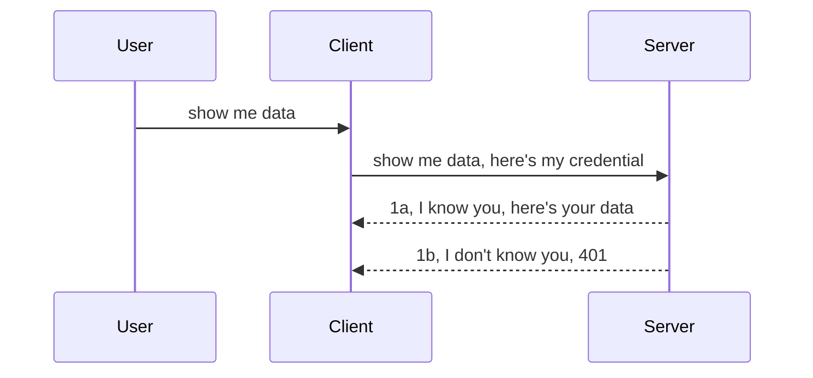

<!--
CO_OP_TRANSLATOR_METADATA:
{
  "original_hash": "5b00b8a8971a07d2d8803be4c9f138f8",
  "translation_date": "2025-10-07T01:02:47+00:00",
  "source_file": "03-GettingStarted/11-simple-auth/README.md",
  "language_code": "sk"
}
-->
# Jednoduché overovanie

MCP SDK podporujú použitie OAuth 2.1, čo je pomerne zložitý proces zahŕňajúci koncepty ako overovací server, server zdrojov, odosielanie prihlasovacích údajov, získanie kódu, výmenu kódu za token nositeľa, až kým nakoniec nezískate údaje o zdroji. Ak nie ste zvyknutí na OAuth, čo je skvelá vec na implementáciu, je dobré začať s jednoduchšou úrovňou overovania a postupne zlepšovať bezpečnosť. Preto existuje táto kapitola – aby vás pripravila na pokročilejšie overovanie.

## Čo myslíme pod pojmom overovanie?

Overovanie zahŕňa autentifikáciu a autorizáciu. Ide o to, že musíme urobiť dve veci:

- **Autentifikácia**, čo je proces zisťovania, či pustíme osobu do nášho domu, či má právo byť „tu“, teda mať prístup k nášmu serveru zdrojov, kde sa nachádzajú funkcie MCP Servera.
- **Autorizácia**, čo je proces zisťovania, či by používateľ mal mať prístup k konkrétnym zdrojom, o ktoré žiada, napríklad k objednávkam alebo produktom, alebo či má povolenie čítať obsah, ale nie ho mazať, ako ďalší príklad.

## Prihlasovacie údaje: ako systému oznámime, kto sme

Väčšina webových vývojárov začne uvažovať o poskytovaní prihlasovacích údajov serveru, zvyčajne tajného kódu, ktorý hovorí, či majú povolenie byť „tu“ (autentifikácia). Tieto prihlasovacie údaje sú zvyčajne base64 kódovaná verzia používateľského mena a hesla alebo API kľúč, ktorý jednoznačne identifikuje konkrétneho používateľa.

Toto zahŕňa odoslanie prostredníctvom hlavičky nazvanej „Authorization“ takto:

```json
{ "Authorization": "secret123" }
```

Toto sa zvyčajne označuje ako základná autentifikácia. Celkový tok funguje nasledovne:



Teraz, keď rozumieme, ako to funguje z pohľadu toku, ako to implementovať? Väčšina webových serverov má koncept nazývaný middleware, čo je časť kódu, ktorá sa spúšťa ako súčasť požiadavky a môže overiť prihlasovacie údaje. Ak sú prihlasovacie údaje platné, požiadavka môže prejsť. Ak požiadavka nemá platné prihlasovacie údaje, dostanete chybu overovania. Pozrime sa, ako to možno implementovať:

**Python**

```python
class AuthMiddleware(BaseHTTPMiddleware):
    async def dispatch(self, request, call_next):

        has_header = request.headers.get("Authorization")
        if not has_header:
            print("-> Missing Authorization header!")
            return Response(status_code=401, content="Unauthorized")

        if not valid_token(has_header):
            print("-> Invalid token!")
            return Response(status_code=403, content="Forbidden")

        print("Valid token, proceeding...")
       
        response = await call_next(request)
        # add any customer headers or change in the response in some way
        return response


starlette_app.add_middleware(CustomHeaderMiddleware)
```

Tu sme:

- Vytvorili middleware nazvaný `AuthMiddleware`, kde jeho metóda `dispatch` je vyvolaná webovým serverom.
- Pridali middleware do webového servera:

    ```python
    starlette_app.add_middleware(AuthMiddleware)
    ```

- Napísali logiku overovania, ktorá kontroluje, či je prítomná hlavička Authorization a či je odoslaný tajný kód platný:

    ```python
    has_header = request.headers.get("Authorization")
    if not has_header:
        print("-> Missing Authorization header!")
        return Response(status_code=401, content="Unauthorized")

    if not valid_token(has_header):
        print("-> Invalid token!")
        return Response(status_code=403, content="Forbidden")
    ```

    Ak je tajný kód prítomný a platný, necháme požiadavku prejsť zavolaním `call_next` a vrátime odpoveď.

    ```python
    response = await call_next(request)
    # add any customer headers or change in the response in some way
    return response
    ```

Ako to funguje: Ak je na server odoslaná webová požiadavka, middleware bude vyvolaný a na základe jeho implementácie buď nechá požiadavku prejsť, alebo vráti chybu, ktorá naznačuje, že klient nemá povolenie pokračovať.

**TypeScript**

Tu vytvoríme middleware pomocou populárneho frameworku Express a zachytíme požiadavku predtým, než dosiahne MCP Server. Tu je kód:

```typescript
function isValid(secret) {
    return secret === "secret123";
}

app.use((req, res, next) => {
    // 1. Authorization header present?  
    if(!req.headers["Authorization"]) {
        res.status(401).send('Unauthorized');
    }
    
    let token = req.headers["Authorization"];

    // 2. Check validity.
    if(!isValid(token)) {
        res.status(403).send('Forbidden');
    }

   
    console.log('Middleware executed');
    // 3. Passes request to the next step in the request pipeline.
    next();
});
```

V tomto kóde:

1. Kontrolujeme, či je hlavička Authorization prítomná, ak nie, posielame chybu 401.
2. Zabezpečujeme, že prihlasovací údaj/token je platný, ak nie, posielame chybu 403.
3. Nakoniec posúvame požiadavku ďalej v pipeline požiadaviek a vraciame požadovaný zdroj.

## Cvičenie: Implementácia autentifikácie

Využime naše znalosti a pokúsme sa to implementovať. Tu je plán:

Server

- Vytvorte webový server a MCP inštanciu.
- Implementujte middleware pre server.

Klient 

- Odosielajte webové požiadavky s prihlasovacími údajmi prostredníctvom hlavičky.

### -1- Vytvorenie webového servera a MCP inštancie

V prvom kroku musíme vytvoriť inštanciu webového servera a MCP Servera.

**Python**

Tu vytvoríme MCP serverovú inštanciu, starlette webovú aplikáciu a hostujeme ju pomocou uvicorn.

```python
# creating MCP Server

app = FastMCP(
    name="MCP Resource Server",
    instructions="Resource Server that validates tokens via Authorization Server introspection",
    host=settings["host"],
    port=settings["port"],
    debug=True
)

# creating starlette web app
starlette_app = app.streamable_http_app()

# serving app via uvicorn
async def run(starlette_app):
    import uvicorn
    config = uvicorn.Config(
            starlette_app,
            host=app.settings.host,
            port=app.settings.port,
            log_level=app.settings.log_level.lower(),
        )
    server = uvicorn.Server(config)
    await server.serve()

run(starlette_app)
```

V tomto kóde sme:

- Vytvorili MCP Server.
- Zostavili starlette webovú aplikáciu z MCP Servera, `app.streamable_http_app()`.
- Hostovali a spustili webovú aplikáciu pomocou uvicorn `server.serve()`.

**TypeScript**

Tu vytvoríme MCP Serverovú inštanciu.

```typescript
const server = new McpServer({
      name: "example-server",
      version: "1.0.0"
    });

    // ... set up server resources, tools, and prompts ...
```

Táto tvorba MCP Servera bude musieť prebiehať v rámci definície našej POST /mcp route, takže vezmeme vyššie uvedený kód a presunieme ho takto:

```typescript
import express from "express";
import { randomUUID } from "node:crypto";
import { McpServer } from "@modelcontextprotocol/sdk/server/mcp.js";
import { StreamableHTTPServerTransport } from "@modelcontextprotocol/sdk/server/streamableHttp.js";
import { isInitializeRequest } from "@modelcontextprotocol/sdk/types.js"

const app = express();
app.use(express.json());

// Map to store transports by session ID
const transports: { [sessionId: string]: StreamableHTTPServerTransport } = {};

// Handle POST requests for client-to-server communication
app.post('/mcp', async (req, res) => {
  // Check for existing session ID
  const sessionId = req.headers['mcp-session-id'] as string | undefined;
  let transport: StreamableHTTPServerTransport;

  if (sessionId && transports[sessionId]) {
    // Reuse existing transport
    transport = transports[sessionId];
  } else if (!sessionId && isInitializeRequest(req.body)) {
    // New initialization request
    transport = new StreamableHTTPServerTransport({
      sessionIdGenerator: () => randomUUID(),
      onsessioninitialized: (sessionId) => {
        // Store the transport by session ID
        transports[sessionId] = transport;
      },
      // DNS rebinding protection is disabled by default for backwards compatibility. If you are running this server
      // locally, make sure to set:
      // enableDnsRebindingProtection: true,
      // allowedHosts: ['127.0.0.1'],
    });

    // Clean up transport when closed
    transport.onclose = () => {
      if (transport.sessionId) {
        delete transports[transport.sessionId];
      }
    };
    const server = new McpServer({
      name: "example-server",
      version: "1.0.0"
    });

    // ... set up server resources, tools, and prompts ...

    // Connect to the MCP server
    await server.connect(transport);
  } else {
    // Invalid request
    res.status(400).json({
      jsonrpc: '2.0',
      error: {
        code: -32000,
        message: 'Bad Request: No valid session ID provided',
      },
      id: null,
    });
    return;
  }

  // Handle the request
  await transport.handleRequest(req, res, req.body);
});

// Reusable handler for GET and DELETE requests
const handleSessionRequest = async (req: express.Request, res: express.Response) => {
  const sessionId = req.headers['mcp-session-id'] as string | undefined;
  if (!sessionId || !transports[sessionId]) {
    res.status(400).send('Invalid or missing session ID');
    return;
  }
  
  const transport = transports[sessionId];
  await transport.handleRequest(req, res);
};

// Handle GET requests for server-to-client notifications via SSE
app.get('/mcp', handleSessionRequest);

// Handle DELETE requests for session termination
app.delete('/mcp', handleSessionRequest);

app.listen(3000);
```

Teraz vidíte, ako bola tvorba MCP Servera presunutá do `app.post("/mcp")`.

Pokračujme na ďalší krok vytvorenia middleware, aby sme mohli overiť prichádzajúce prihlasovacie údaje.

### -2- Implementácia middleware pre server

Poďme na časť middleware. Tu vytvoríme middleware, ktorý hľadá prihlasovací údaj v hlavičke `Authorization` a overí ho. Ak je prijateľný, požiadavka bude pokračovať v tom, čo potrebuje (napr. zoznam nástrojov, čítanie zdroja alebo akákoľvek funkcia MCP, ktorú klient požadoval).

**Python**

Na vytvorenie middleware musíme vytvoriť triedu, ktorá dedí z `BaseHTTPMiddleware`. Existujú dva zaujímavé prvky:

- Požiadavka `request`, z ktorej čítame informácie z hlavičky.
- `call_next`, callback, ktorý musíme vyvolať, ak klient priniesol prihlasovací údaj, ktorý akceptujeme.

Najprv musíme riešiť prípad, keď chýba hlavička `Authorization`:

```python
has_header = request.headers.get("Authorization")

# no header present, fail with 401, otherwise move on.
if not has_header:
    print("-> Missing Authorization header!")
    return Response(status_code=401, content="Unauthorized")
```

Tu posielame správu 401 Unauthorized, pretože klient zlyháva pri autentifikácii.

Ďalej, ak bol odoslaný prihlasovací údaj, musíme overiť jeho platnosť takto:

```python
 if not valid_token(has_header):
    print("-> Invalid token!")
    return Response(status_code=403, content="Forbidden")
```

Všimnite si, ako posielame správu 403 Forbidden vyššie. Pozrime sa na celý middleware nižšie, ktorý implementuje všetko, čo sme spomenuli vyššie:

```python
class AuthMiddleware(BaseHTTPMiddleware):
    async def dispatch(self, request, call_next):

        has_header = request.headers.get("Authorization")
        if not has_header:
            print("-> Missing Authorization header!")
            return Response(status_code=401, content="Unauthorized")

        if not valid_token(has_header):
            print("-> Invalid token!")
            return Response(status_code=403, content="Forbidden")

        print("Valid token, proceeding...")
        print(f"-> Received {request.method} {request.url}")
        response = await call_next(request)
        response.headers['Custom'] = 'Example'
        return response

```

Skvelé, ale čo funkcia `valid_token`? Tu je nižšie:

```python
# DON'T use for production - improve it !!
def valid_token(token: str) -> bool:
    # remove the "Bearer " prefix
    if token.startswith("Bearer "):
        token = token[7:]
        return token == "secret-token"
    return False
```

Toto by sa malo samozrejme zlepšiť.

DÔLEŽITÉ: Nikdy by ste nemali mať tajné údaje ako toto v kóde. Ideálne by ste mali hodnotu na porovnanie získavať z dátového zdroja alebo z IDP (poskytovateľa identitných služieb) alebo ešte lepšie, nechať IDP vykonať overenie.

**TypeScript**

Na implementáciu tohto s Express musíme zavolať metódu `use`, ktorá prijíma funkcie middleware.

Musíme:

- Interagovať s premennou požiadavky na kontrolu odoslaného prihlasovacieho údaja v vlastnosti `Authorization`.
- Overiť prihlasovací údaj, a ak je platný, nechať požiadavku pokračovať a vykonať požadovanú MCP požiadavku (napr. zoznam nástrojov, čítanie zdroja alebo čokoľvek iné súvisiace s MCP).

Tu kontrolujeme, či je hlavička `Authorization` prítomná, a ak nie, zastavíme požiadavku:

```typescript
if(!req.headers["authorization"]) {
    res.status(401).send('Unauthorized');
    return;
}
```

Ak hlavička nie je odoslaná, dostanete chybu 401.

Ďalej kontrolujeme, či je prihlasovací údaj platný, a ak nie, opäť zastavíme požiadavku, ale s mierne odlišnou správou:

```typescript
if(!isValid(token)) {
    res.status(403).send('Forbidden');
    return;
} 
```

Všimnite si, ako teraz dostanete chybu 403.

Tu je celý kód:

```typescript
app.use((req, res, next) => {
    console.log('Request received:', req.method, req.url, req.headers);
    console.log('Headers:', req.headers["authorization"]);
    if(!req.headers["authorization"]) {
        res.status(401).send('Unauthorized');
        return;
    }
    
    let token = req.headers["authorization"];

    if(!isValid(token)) {
        res.status(403).send('Forbidden');
        return;
    }  

    console.log('Middleware executed');
    next();
});
```

Nastavili sme webový server na prijatie middleware na kontrolu prihlasovacieho údaja, ktorý nám klient dúfajme posiela. Čo však samotný klient?

### -3- Odosielanie webovej požiadavky s prihlasovacím údajom prostredníctvom hlavičky

Musíme zabezpečiť, aby klient odosielal prihlasovací údaj prostredníctvom hlavičky. Keďže budeme používať MCP klienta, musíme zistiť, ako sa to robí.

**Python**

Pre klienta musíme odoslať hlavičku s naším prihlasovacím údajom takto:

```python
# DON'T hardcode the value, have it at minimum in an environment variable or a more secure storage
token = "secret-token"

async with streamablehttp_client(
        url = f"http://localhost:{port}/mcp",
        headers = {"Authorization": f"Bearer {token}"}
    ) as (
        read_stream,
        write_stream,
        session_callback,
    ):
        async with ClientSession(
            read_stream,
            write_stream
        ) as session:
            await session.initialize()
      
            # TODO, what you want done in the client, e.g list tools, call tools etc.
```

Všimnite si, ako sme naplnili vlastnosť `headers` takto: `headers = {"Authorization": f"Bearer {token}"}`.

**TypeScript**

Toto môžeme vyriešiť v dvoch krokoch:

1. Naplniť konfiguračný objekt naším prihlasovacím údajom.
2. Odovzdať konfiguračný objekt do transportu.

```typescript

// DON'T hardcode the value like shown here. At minimum have it as a env variable and use something like dotenv (in dev mode).
let token = "secret123"

// define a client transport option object
let options: StreamableHTTPClientTransportOptions = {
  sessionId: sessionId,
  requestInit: {
    headers: {
      "Authorization": "secret123"
    }
  }
};

// pass the options object to the transport
async function main() {
   const transport = new StreamableHTTPClientTransport(
      new URL(serverUrl),
      options
   );
```

Tu vidíte vyššie, ako sme museli vytvoriť objekt `options` a umiestniť naše hlavičky pod vlastnosť `requestInit`.

DÔLEŽITÉ: Ako to odtiaľto zlepšiť? Aktuálna implementácia má niekoľko problémov. Po prvé, odosielanie prihlasovacieho údaja týmto spôsobom je dosť riskantné, pokiaľ nemáte aspoň HTTPS. Aj tak môže byť prihlasovací údaj ukradnutý, takže potrebujete systém, kde môžete ľahko zrušiť token a pridať ďalšie kontroly, ako napríklad odkiaľ na svete pochádza, či sa požiadavka vyskytuje príliš často (správanie podobné botovi), skrátka existuje množstvo obáv.

Treba však povedať, že pre veľmi jednoduché API, kde nechcete, aby vaše API volal niekto bez autentifikácie, je to, čo tu máme, dobrý začiatok.

S tým povedané, pokúsme sa trochu zvýšiť bezpečnosť použitím štandardizovaného formátu, ako je JSON Web Token, známeho ako JWT alebo „JOT“ tokeny.

## JSON Web Tokeny, JWT

Takže sa snažíme zlepšiť veci od odosielania veľmi jednoduchých prihlasovacích údajov. Aké okamžité zlepšenia získame prijatím JWT?

- **Zlepšenie bezpečnosti**. Pri základnej autentifikácii odosielate používateľské meno a heslo ako base64 kódovaný token (alebo odosielate API kľúč) znova a znova, čo zvyšuje riziko. S JWT odosielate svoje používateľské meno a heslo a dostanete token na oplátku, ktorý je tiež časovo obmedzený, čo znamená, že vyprší. JWT vám umožňuje ľahko používať jemne zrnitú kontrolu prístupu pomocou rolí, rozsahov a povolení.
- **Bezstavovosť a škálovateľnosť**. JWT sú samostatné, nesú všetky informácie o používateľovi a eliminujú potrebu ukladania serverových relácií. Token môže byť tiež lokálne overený.
- **Interoperabilita a federácia**. JWT sú centrálnou súčasťou Open ID Connect a používajú sa so známymi poskytovateľmi identít, ako sú Entra ID, Google Identity a Auth0. Umožňujú tiež používať jednotné prihlásenie a oveľa viac, čo ich robí vhodnými pre podnikové prostredie.
- **Modularita a flexibilita**. JWT môžu byť tiež použité s API bránami, ako sú Azure API Management, NGINX a ďalšie. Podporujú tiež scenáre autentifikácie a komunikáciu server-to-service vrátane scenárov impersonácie a delegácie.
- **Výkon a caching**. JWT môžu byť cachované po dekódovaní, čo znižuje potrebu parsovania. To pomáha najmä pri aplikáciách s vysokou návštevnosťou, pretože zlepšuje priepustnosť a znižuje zaťaženie vašej infraštruktúry.
- **Pokročilé funkcie**. Podporujú introspekciu (kontrolu platnosti na serveri) a zrušenie (zneplatnenie tokenu).

S týmito výhodami sa pozrime, ako môžeme posunúť našu implementáciu na vyššiu úroveň.

## Premena základnej autentifikácie na JWT

Takže, zmeny, ktoré musíme urobiť na vysokej úrovni, sú:

- **Naučiť sa vytvoriť JWT token** a pripraviť ho na odoslanie z klienta na server.
- **Overiť JWT token**, a ak je platný, poskytnúť klientovi naše zdroje.
- **Bezpečné ukladanie tokenu**. Ako tento token uložiť.
- **Ochrana ciest**. Musíme chrániť cesty, v našom prípade musíme chrániť cesty a konkrétne funkcie MCP.
- **Pridať obnovovacie tokeny**. Zabezpečiť, že vytvárame tokeny, ktoré sú krátkodobé, ale obnovovacie tokeny, ktoré sú dlhodobé a môžu byť použité na získanie nových tokenov, ak vypršia. Tiež zabezpečiť, že existuje endpoint na obnovu a stratégia rotácie.

### -1- Vytvorenie JWT tokenu

Najprv má JWT token nasledujúce časti:

- **hlavička**, algoritmus použitý a typ tokenu.
- **payload**, tvrdenia, ako sub (používateľ alebo entita, ktorú token reprezentuje. V scenári autentifikácie je to typicky ID používateľa), exp (kedy vyprší), role (rola).
- **podpis**, podpísaný tajným kľúčom alebo súkromným kľúčom.

Na to budeme musieť vytvoriť hlavičku, payload a kódovaný token.

**Python**

```python

import jwt
import jwt
from jwt.exceptions import ExpiredSignatureError, InvalidTokenError
import datetime

# Secret key used to sign the JWT
secret_key = 'your-secret-key'

header = {
    "alg": "HS256",
    "typ": "JWT"
}

# the user info andits claims and expiry time
payload = {
    "sub": "1234567890",               # Subject (user ID)
    "name": "User Userson",                # Custom claim
    "admin": True,                     # Custom claim
    "iat": datetime.datetime.utcnow(),# Issued at
    "exp": datetime.datetime.utcnow() + datetime.timedelta(hours=1)  # Expiry
}

# encode it
encoded_jwt = jwt.encode(payload, secret_key, algorithm="HS256", headers=header)
```

V uvedenom kóde sme:

- Definovali hlavičku pomocou HS256 ako algoritmu a typu JWT.
- Vytvorili payload, ktorý obsahuje subjekt alebo ID používateľa, používateľské meno, rolu, kedy bol vydaný a kedy má vypršať, čím sme implementovali časovo obmedzený aspekt, ktorý sme spomenuli vyššie.

**TypeScript**

Tu budeme potrebovať niektoré závislosti, ktoré nám pomôžu vytvoriť JWT token.

Závislosti

```sh

npm install jsonwebtoken
npm install --save-dev @types/jsonwebtoken
```

Teraz, keď to máme na mieste, vytvorme hlavičku, payload a prostredníctvom toho vytvorme kódovaný token.

```typescript
import jwt from 'jsonwebtoken';

const secretKey = 'your-secret-key'; // Use env vars in production

// Define the payload
const payload = {
  sub: '1234567890',
  name: 'User usersson',
  admin: true,
  iat: Math.floor(Date.now() / 1000), // Issued at
  exp: Math.floor(Date.now() / 1000) + 60 * 60 // Expires in 1 hour
};

// Define the header (optional, jsonwebtoken sets defaults)
const header = {
  alg: 'HS256',
  typ: 'JWT'
};

// Create the token
const token = jwt.sign(payload, secretKey, {
  algorithm: 'HS256',
  header: header
});

console.log('JWT:', token);
```

Tento token je:

Podpísaný pomocou HS256
Platný na 1 hodinu
Obsahuje tvrdenia ako sub, name, admin, iat a exp.

### -2- Overenie tokenu

Budeme tiež musieť overiť token, čo by sme mali robiť na serveri, aby sme zabezpečili, že to, čo nám klient posiela, je skutočne platné. Existuje mnoho kontrol, ktoré by sme tu mali vykonať, od overenia jeho štruktúry až po jeho platnosť. Tiež sa odporúča pridať ďalšie kontroly, aby ste zistili, či je používateľ vo vašom systéme a ďalšie.

Na overenie tokenu ho musíme dekódovať, aby sme ho mohli čítať, a potom začať kontrolovať jeho platnosť:

**Python**

```python

# Decode and verify the JWT
try:
    decoded = jwt.decode(token, secret_key, algorithms=["HS256"])
    print("✅ Token is valid.")
    print("Decoded claims:")
    for key, value in decoded.items():
        print(f"  {key}: {value}")
except ExpiredSignatureError:
    print("❌ Token has expired.")
except InvalidTokenError as e:
    print(f"❌ Invalid token: {e}")

```

V tomto kóde voláme `jwt.decode` pomocou tokenu, tajného kľúča a zvoleného algoritmu ako vstupu. Všimnite si, ako používame konštrukt try-catch, pretože neúspešné overenie vedie k vyvolaniu chyby.

**TypeScript**

Tu musíme zavolať `jwt.verify`, aby sme získali dekódovanú verziu tokenu, ktorú môžeme ďalej analyzovať. Ak toto volanie zlyhá, znamená to, že štruktúra tokenu je nesprávna alebo už nie je platná.

```typescript

try {
  const decoded = jwt.verify(token, secretKey);
  console.log('Decoded Payload:', decoded);
} catch (err) {
  console.error('Token verification failed:', err);
}
```

POZNÁMKA: Ako sme už spomenuli, mali by sme vykonať ďalšie kontroly, aby sme zabezpečili, že tento token poukazuje na používateľa vo vašom systéme a zabezpečili, že používateľ má práva, ktoré tvrdí, že má.
Ďalej sa pozrime na kontrolu prístupu založenú na rolách, známu aj ako RBAC.

## Pridanie kontroly prístupu založenej na rolách

Myšlienka je vyjadriť, že rôzne roly majú rôzne oprávnenia. Napríklad predpokladáme, že administrátor môže robiť všetko, bežný používateľ môže čítať a zapisovať a hosť môže iba čítať. Preto tu sú niektoré možné úrovne oprávnení:

- Admin.Write 
- User.Read
- Guest.Read

Pozrime sa, ako môžeme implementovať takúto kontrolu pomocou middleware. Middleware je možné pridať pre konkrétnu trasu, ako aj pre všetky trasy.

**Python**

```python
from starlette.middleware.base import BaseHTTPMiddleware
from starlette.responses import JSONResponse
import jwt

# DON'T have the secret in the code like, this is for demonstration purposes only. Read it from a safe place.
SECRET_KEY = "your-secret-key" # put this in env variable
REQUIRED_PERMISSION = "User.Read"

class JWTPermissionMiddleware(BaseHTTPMiddleware):
    async def dispatch(self, request, call_next):
        auth_header = request.headers.get("Authorization")
        if not auth_header or not auth_header.startswith("Bearer "):
            return JSONResponse({"error": "Missing or invalid Authorization header"}, status_code=401)

        token = auth_header.split(" ")[1]
        try:
            decoded = jwt.decode(token, SECRET_KEY, algorithms=["HS256"])
        except jwt.ExpiredSignatureError:
            return JSONResponse({"error": "Token expired"}, status_code=401)
        except jwt.InvalidTokenError:
            return JSONResponse({"error": "Invalid token"}, status_code=401)

        permissions = decoded.get("permissions", [])
        if REQUIRED_PERMISSION not in permissions:
            return JSONResponse({"error": "Permission denied"}, status_code=403)

        request.state.user = decoded
        return await call_next(request)


```

Existuje niekoľko rôznych spôsobov, ako pridať middleware, ako je uvedené nižšie:

```python

# Alt 1: add middleware while constructing starlette app
middleware = [
    Middleware(JWTPermissionMiddleware)
]

app = Starlette(routes=routes, middleware=middleware)

# Alt 2: add middleware after starlette app is a already constructed
starlette_app.add_middleware(JWTPermissionMiddleware)

# Alt 3: add middleware per route
routes = [
    Route(
        "/mcp",
        endpoint=..., # handler
        middleware=[Middleware(JWTPermissionMiddleware)]
    )
]
```

**TypeScript**

Môžeme použiť `app.use` a middleware, ktorý sa spustí pre všetky požiadavky.

```typescript
app.use((req, res, next) => {
    console.log('Request received:', req.method, req.url, req.headers);
    console.log('Headers:', req.headers["authorization"]);

    // 1. Check if authorization header has been sent

    if(!req.headers["authorization"]) {
        res.status(401).send('Unauthorized');
        return;
    }
    
    let token = req.headers["authorization"];

    // 2. Check if token is valid
    if(!isValid(token)) {
        res.status(403).send('Forbidden');
        return;
    }  

    // 3. Check if token user exist in our system
    if(!isExistingUser(token)) {
        res.status(403).send('Forbidden');
        console.log("User does not exist");
        return;
    }
    console.log("User exists");

    // 4. Verify the token has the right permissions
    if(!hasScopes(token, ["User.Read"])){
        res.status(403).send('Forbidden - insufficient scopes');
    }

    console.log("User has required scopes");

    console.log('Middleware executed');
    next();
});

```

Middleware môže vykonávať niekoľko vecí, ktoré by mal robiť, konkrétne:

1. Skontrolovať, či je prítomný autorizačný header.
2. Skontrolovať, či je token platný, voláme `isValid`, čo je metóda, ktorú sme napísali na kontrolu integrity a platnosti JWT tokenu.
3. Overiť, či používateľ existuje v našom systéme, toto by sme mali skontrolovať.

   ```typescript
    // users in DB
   const users = [
     "user1",
     "User usersson",
   ]

   function isExistingUser(token) {
     let decodedToken = verifyToken(token);

     // TODO, check if user exists in DB
     return users.includes(decodedToken?.name || "");
   }
   ```

   Vyššie sme vytvorili veľmi jednoduchý zoznam `users`, ktorý by mal byť samozrejme v databáze.

4. Okrem toho by sme mali tiež skontrolovať, či token má správne oprávnenia.

   ```typescript
   if(!hasScopes(token, ["User.Read"])){
        res.status(403).send('Forbidden - insufficient scopes');
   }
   ```

   V kóde vyššie z middleware kontrolujeme, či token obsahuje oprávnenie User.Read, ak nie, posielame chybu 403. Nižšie je pomocná metóda `hasScopes`.

   ```typescript
   function hasScopes(scope: string, requiredScopes: string[]) {
     let decodedToken = verifyToken(scope);
    return requiredScopes.every(scope => decodedToken?.scopes.includes(scope));
  }
   ```

Have a think which additional checks you should be doing, but these are the absolute minimum of checks you should be doing.

Using Express as a web framework is a common choice. There are helpers library when you use JWT so you can write less code.

- `express-jwt`, helper library that provides a middleware that helps decode your token.
- `express-jwt-permissions`, this provides a middleware `guard` that helps check if a certain permission is on the token.

Here's what these libraries can look like when used:

```typescript
const express = require('express');
const jwt = require('express-jwt');
const guard = require('express-jwt-permissions')();

const app = express();
const secretKey = 'your-secret-key'; // put this in env variable

// Decode JWT and attach to req.user
app.use(jwt({ secret: secretKey, algorithms: ['HS256'] }));

// Check for User.Read permission
app.use(guard.check('User.Read'));

// multiple permissions
// app.use(guard.check(['User.Read', 'Admin.Access']));

app.get('/protected', (req, res) => {
  res.json({ message: `Welcome ${req.user.name}` });
});

// Error handler
app.use((err, req, res, next) => {
  if (err.code === 'permission_denied') {
    return res.status(403).send('Forbidden');
  }
  next(err);
});

```

Teraz ste videli, ako môže byť middleware použitý na autentifikáciu aj autorizáciu, ale čo MCP? Mení to spôsob, akým robíme autentifikáciu? Zistime to v ďalšej sekcii.

### -3- Pridanie RBAC do MCP

Doteraz ste videli, ako môžete pridať RBAC cez middleware, avšak pre MCP neexistuje jednoduchý spôsob, ako pridať RBAC pre konkrétnu funkciu MCP. Čo teda robiť? Musíme jednoducho pridať kód, ktorý v tomto prípade kontroluje, či má klient práva na volanie konkrétneho nástroja:

Máte niekoľko rôznych možností, ako dosiahnuť RBAC pre konkrétnu funkciu, tu sú niektoré:

- Pridať kontrolu pre každý nástroj, zdroj, prompt, kde je potrebné skontrolovať úroveň oprávnenia.

   **Python**

   ```python
   @tool()
   def delete_product(id: int):
      try:
          check_permissions(role="Admin.Write", request)
      catch:
        pass # client failed authorization, raise authorization error
   ```

   **TypeScript**

   ```typescript
   server.registerTool(
    "delete-product",
    {
      title: Delete a product",
      description: "Deletes a product",
      inputSchema: { id: z.number() }
    },
    async ({ id }) => {
      
      try {
        checkPermissions("Admin.Write", request);
        // todo, send id to productService and remote entry
      } catch(Exception e) {
        console.log("Authorization error, you're not allowed");  
      }

      return {
        content: [{ type: "text", text: `Deletected product with id ${id}` }]
      };
    }
   );
   ```


- Použiť pokročilý serverový prístup a obslužné rutiny požiadaviek, aby ste minimalizovali počet miest, kde je potrebné vykonať kontrolu.

   **Python**

   ```python
   
   tool_permission = {
      "create_product": ["User.Write", "Admin.Write"],
      "delete_product": ["Admin.Write"]
   }

   def has_permission(user_permissions, required_permissions) -> bool:
      # user_permissions: list of permissions the user has
      # required_permissions: list of permissions required for the tool
      return any(perm in user_permissions for perm in required_permissions)

   @server.call_tool()
   async def handle_call_tool(
     name: str, arguments: dict[str, str] | None
   ) -> list[types.TextContent]:
    # Assume request.user.permissions is a list of permissions for the user
     user_permissions = request.user.permissions
     required_permissions = tool_permission.get(name, [])
     if not has_permission(user_permissions, required_permissions):
        # Raise error "You don't have permission to call tool {name}"
        raise Exception(f"You don't have permission to call tool {name}")
     # carry on and call tool
     # ...
   ```   
   

   **TypeScript**

   ```typescript
   function hasPermission(userPermissions: string[], requiredPermissions: string[]): boolean {
       if (!Array.isArray(userPermissions) || !Array.isArray(requiredPermissions)) return false;
       // Return true if user has at least one required permission
       
       return requiredPermissions.some(perm => userPermissions.includes(perm));
   }
  
   server.setRequestHandler(CallToolRequestSchema, async (request) => {
      const { params: { name } } = request;
  
      let permissions = request.user.permissions;
  
      if (!hasPermission(permissions, toolPermissions[name])) {
         return new Error(`You don't have permission to call ${name}`);
      }
  
      // carry on..
   });
   ```

   Poznámka: Musíte zabezpečiť, aby váš middleware priradil dekódovaný token k vlastnosti používateľa v požiadavke, aby bol vyššie uvedený kód jednoduchý.

### Zhrnutie

Teraz, keď sme diskutovali o tom, ako pridať podporu pre RBAC všeobecne a konkrétne pre MCP, je čas pokúsiť sa implementovať bezpečnosť na vlastnú päsť, aby ste si overili, že ste pochopili prezentované koncepty.

## Úloha 1: Vytvorte MCP server a MCP klient pomocou základnej autentifikácie

Tu využijete to, čo ste sa naučili o posielaní prihlasovacích údajov cez hlavičky.

## Riešenie 1

[Riešenie 1](./code/basic/README.md)

## Úloha 2: Vylepšite riešenie z Úlohy 1 na použitie JWT

Vezmite prvé riešenie, ale tentokrát ho vylepšime. 

Namiesto použitia základnej autentifikácie použijeme JWT.

## Riešenie 2

[Riešenie 2](./solution/jwt-solution/README.md)

## Výzva

Pridajte RBAC pre jednotlivé nástroje, ako sme opísali v sekcii "Pridanie RBAC do MCP".

## Zhrnutie

Dúfame, že ste sa v tejto kapitole veľa naučili, od žiadnej bezpečnosti až po základnú bezpečnosť, JWT a ako ho možno pridať do MCP.

Vybudovali sme pevný základ s vlastnými JWT, ale ako sa rozširujeme, prechádzame na model identity založený na štandardoch. Prijatie IdP, ako je Entra alebo Keycloak, nám umožňuje presunúť vydávanie tokenov, ich validáciu a správu životného cyklu na dôveryhodnú platformu — čím sa môžeme sústrediť na logiku aplikácie a používateľskú skúsenosť.

Na to máme pokročilejšiu [kapitolu o Entra](../../05-AdvancedTopics/mcp-security-entra/README.md)

---

**Upozornenie**:  
Tento dokument bol preložený pomocou služby AI prekladu [Co-op Translator](https://github.com/Azure/co-op-translator). Hoci sa snažíme o presnosť, prosím, berte na vedomie, že automatizované preklady môžu obsahovať chyby alebo nepresnosti. Pôvodný dokument v jeho rodnom jazyku by mal byť považovaný za autoritatívny zdroj. Pre kritické informácie sa odporúča profesionálny ľudský preklad. Nenesieme zodpovednosť za akékoľvek nedorozumenia alebo nesprávne interpretácie vyplývajúce z použitia tohto prekladu.