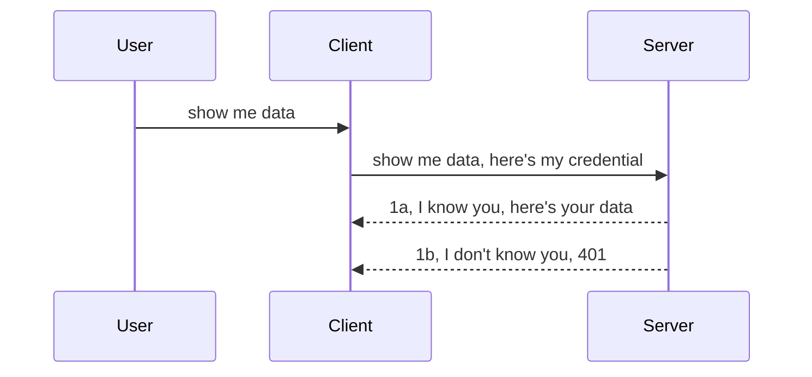

<!--
CO_OP_TRANSLATOR_METADATA:
{
  "original_hash": "5b00b8a8971a07d2d8803be4c9f138f8",
  "translation_date": "2025-10-07T01:07:32+00:00",
  "source_file": "03-GettingStarted/11-simple-auth/README.md",
  "language_code": "sl"
}
-->
# Preprosto preverjanje pristnosti

MCP SDK-ji podpirajo uporabo OAuth 2.1, kar je precej zahteven proces, ki vključuje koncepte, kot so strežnik za preverjanje pristnosti, strežnik virov, pošiljanje poverilnic, pridobivanje kode, zamenjava kode za žeton nosilca, dokler končno ne pridobite podatkov o viru. Če niste vajeni OAuth-a, ki je sicer odličen za implementacijo, je dobra ideja začeti z osnovno ravnjo preverjanja pristnosti in postopoma graditi boljšo varnost. Zato obstaja to poglavje, da vas vodi do naprednejšega preverjanja pristnosti.

## Preverjanje pristnosti, kaj to pomeni?

Preverjanje pristnosti je kratica za avtentikacijo in avtorizacijo. Ideja je, da moramo narediti dve stvari:

- **Avtentikacija**, kar je proces ugotavljanja, ali nekomu dovolimo vstop v našo hišo, da ima pravico biti "tukaj", torej dostopati do našega strežnika virov, kjer se nahajajo funkcije MCP strežnika.
- **Avtorizacija**, je proces ugotavljanja, ali naj uporabnik ima dostop do teh specifičnih virov, ki jih zahteva, na primer do teh naročil ali teh izdelkov, ali pa ali mu je dovoljeno branje vsebine, vendar ne brisanje, kot drug primer.

## Poverilnice: kako sistemu povemo, kdo smo

Večina spletnih razvijalcev začne razmišljati o tem, da strežniku posredujejo poverilnico, običajno skrivnost, ki pove, ali jim je dovoljeno biti tukaj ("Avtentikacija"). Ta poverilnica je običajno base64 kodirana različica uporabniškega imena in gesla ali API ključ, ki edinstveno identificira določenega uporabnika.

To vključuje pošiljanje prek glave, imenovane "Authorization", kot sledi:

```json
{ "Authorization": "secret123" }
```

To se običajno imenuje osnovna avtentikacija. Celoten potek delovanja nato poteka na naslednji način:



Zdaj, ko razumemo, kako deluje s stališča poteka, kako to implementiramo? Večina spletnih strežnikov ima koncept, imenovan middleware, kos kode, ki se izvaja kot del zahteve, ki lahko preveri poverilnice, in če so poverilnice veljavne, lahko zahteva preide. Če zahteva nima veljavnih poverilnic, dobite napako pri preverjanju pristnosti. Poglejmo, kako to lahko implementiramo:

**Python**

```python
class AuthMiddleware(BaseHTTPMiddleware):
    async def dispatch(self, request, call_next):

        has_header = request.headers.get("Authorization")
        if not has_header:
            print("-> Missing Authorization header!")
            return Response(status_code=401, content="Unauthorized")

        if not valid_token(has_header):
            print("-> Invalid token!")
            return Response(status_code=403, content="Forbidden")

        print("Valid token, proceeding...")
       
        response = await call_next(request)
        # add any customer headers or change in the response in some way
        return response


starlette_app.add_middleware(CustomHeaderMiddleware)
```

Tukaj smo:

- Ustvarili middleware, imenovan `AuthMiddleware`, kjer spletni strežnik kliče njegovo metodo `dispatch`.
- Dodali middleware v spletni strežnik:

    ```python
    starlette_app.add_middleware(AuthMiddleware)
    ```

- Napisali logiko za preverjanje, ki preverja, ali je prisotna glava Authorization in ali je poslana skrivnost veljavna:

    ```python
    has_header = request.headers.get("Authorization")
    if not has_header:
        print("-> Missing Authorization header!")
        return Response(status_code=401, content="Unauthorized")

    if not valid_token(has_header):
        print("-> Invalid token!")
        return Response(status_code=403, content="Forbidden")
    ```

    če je skrivnost prisotna in veljavna, pustimo zahtevo naprej z uporabo `call_next` in vrnemo odgovor.

    ```python
    response = await call_next(request)
    # add any customer headers or change in the response in some way
    return response
    ```

Kako deluje: če je spletna zahteva poslana strežniku, se middleware sproži in glede na njegovo implementacijo bodisi pusti zahtevo naprej bodisi vrne napako, ki označuje, da stranki ni dovoljeno nadaljevati.

**TypeScript**

Tukaj ustvarimo middleware s priljubljenim ogrodjem Express in prestrežemo zahtevo, preden doseže MCP strežnik. Tukaj je koda za to:

```typescript
function isValid(secret) {
    return secret === "secret123";
}

app.use((req, res, next) => {
    // 1. Authorization header present?  
    if(!req.headers["Authorization"]) {
        res.status(401).send('Unauthorized');
    }
    
    let token = req.headers["Authorization"];

    // 2. Check validity.
    if(!isValid(token)) {
        res.status(403).send('Forbidden');
    }

   
    console.log('Middleware executed');
    // 3. Passes request to the next step in the request pipeline.
    next();
});
```

V tej kodi:

1. Preverimo, ali je glava Authorization sploh prisotna, če ni, pošljemo napako 401.
2. Zagotovimo, da je poverilnica/žeton veljaven, če ni, pošljemo napako 403.
3. Končno pustimo zahtevo naprej v procesni verigi in vrnemo zahtevani vir.

## Naloga: Implementacija preverjanja pristnosti

Vzemimo naše znanje in poskusimo to implementirati. Tukaj je načrt:

Strežnik

- Ustvarite spletni strežnik in MCP instanco.
- Implementirajte middleware za strežnik.

Odjemalec 

- Pošljite spletno zahtevo s poverilnico prek glave.

### -1- Ustvarite spletni strežnik in MCP instanco

V prvem koraku moramo ustvariti instanco spletnega strežnika in MCP strežnika.

**Python**

Tukaj ustvarimo MCP strežniško instanco, ustvarimo starlette spletno aplikacijo in jo gostimo z uvicorn.

```python
# creating MCP Server

app = FastMCP(
    name="MCP Resource Server",
    instructions="Resource Server that validates tokens via Authorization Server introspection",
    host=settings["host"],
    port=settings["port"],
    debug=True
)

# creating starlette web app
starlette_app = app.streamable_http_app()

# serving app via uvicorn
async def run(starlette_app):
    import uvicorn
    config = uvicorn.Config(
            starlette_app,
            host=app.settings.host,
            port=app.settings.port,
            log_level=app.settings.log_level.lower(),
        )
    server = uvicorn.Server(config)
    await server.serve()

run(starlette_app)
```

V tej kodi smo:

- Ustvarili MCP strežnik.
- Sestavili starlette spletno aplikacijo iz MCP strežnika, `app.streamable_http_app()`.
- Gostili in servirali spletno aplikacijo z uvicorn `server.serve()`.

**TypeScript**

Tukaj ustvarimo MCP strežniško instanco.

```typescript
const server = new McpServer({
      name: "example-server",
      version: "1.0.0"
    });

    // ... set up server resources, tools, and prompts ...
```

To ustvarjanje MCP strežnika bo moralo potekati znotraj naše definicije POST /mcp poti, zato vzemimo zgornjo kodo in jo premaknimo tako:

```typescript
import express from "express";
import { randomUUID } from "node:crypto";
import { McpServer } from "@modelcontextprotocol/sdk/server/mcp.js";
import { StreamableHTTPServerTransport } from "@modelcontextprotocol/sdk/server/streamableHttp.js";
import { isInitializeRequest } from "@modelcontextprotocol/sdk/types.js"

const app = express();
app.use(express.json());

// Map to store transports by session ID
const transports: { [sessionId: string]: StreamableHTTPServerTransport } = {};

// Handle POST requests for client-to-server communication
app.post('/mcp', async (req, res) => {
  // Check for existing session ID
  const sessionId = req.headers['mcp-session-id'] as string | undefined;
  let transport: StreamableHTTPServerTransport;

  if (sessionId && transports[sessionId]) {
    // Reuse existing transport
    transport = transports[sessionId];
  } else if (!sessionId && isInitializeRequest(req.body)) {
    // New initialization request
    transport = new StreamableHTTPServerTransport({
      sessionIdGenerator: () => randomUUID(),
      onsessioninitialized: (sessionId) => {
        // Store the transport by session ID
        transports[sessionId] = transport;
      },
      // DNS rebinding protection is disabled by default for backwards compatibility. If you are running this server
      // locally, make sure to set:
      // enableDnsRebindingProtection: true,
      // allowedHosts: ['127.0.0.1'],
    });

    // Clean up transport when closed
    transport.onclose = () => {
      if (transport.sessionId) {
        delete transports[transport.sessionId];
      }
    };
    const server = new McpServer({
      name: "example-server",
      version: "1.0.0"
    });

    // ... set up server resources, tools, and prompts ...

    // Connect to the MCP server
    await server.connect(transport);
  } else {
    // Invalid request
    res.status(400).json({
      jsonrpc: '2.0',
      error: {
        code: -32000,
        message: 'Bad Request: No valid session ID provided',
      },
      id: null,
    });
    return;
  }

  // Handle the request
  await transport.handleRequest(req, res, req.body);
});

// Reusable handler for GET and DELETE requests
const handleSessionRequest = async (req: express.Request, res: express.Response) => {
  const sessionId = req.headers['mcp-session-id'] as string | undefined;
  if (!sessionId || !transports[sessionId]) {
    res.status(400).send('Invalid or missing session ID');
    return;
  }
  
  const transport = transports[sessionId];
  await transport.handleRequest(req, res);
};

// Handle GET requests for server-to-client notifications via SSE
app.get('/mcp', handleSessionRequest);

// Handle DELETE requests for session termination
app.delete('/mcp', handleSessionRequest);

app.listen(3000);
```

Zdaj vidite, kako je bilo ustvarjanje MCP strežnika premaknjeno znotraj `app.post("/mcp")`.

Pojdimo na naslednji korak ustvarjanja middleware, da lahko preverimo vhodno poverilnico.

### -2- Implementirajte middleware za strežnik

Naslednji korak je ustvarjanje middleware, ki išče poverilnico v glavi `Authorization` in jo preveri. Če je sprejemljiva, se zahteva premakne naprej, da opravi, kar mora (npr. seznam orodij, branje vira ali katera koli funkcionalnost MCP, ki jo je zahteval odjemalec).

**Python**

Za ustvarjanje middleware moramo ustvariti razred, ki podeduje `BaseHTTPMiddleware`. Obstajata dva zanimiva dela:

- Zahteva `request`, iz katere beremo informacije o glavi.
- `call_next`, povratni klic, ki ga moramo sprožiti, če stranka prinese poverilnico, ki jo sprejmemo.

Najprej moramo obravnavati primer, če glava `Authorization` manjka:

```python
has_header = request.headers.get("Authorization")

# no header present, fail with 401, otherwise move on.
if not has_header:
    print("-> Missing Authorization header!")
    return Response(status_code=401, content="Unauthorized")
```

Tukaj pošljemo sporočilo 401 nepooblaščen kot stranka ne uspe pri avtentikaciji.

Nato, če je bila poverilnica poslana, moramo preveriti njeno veljavnost, kot sledi:

```python
 if not valid_token(has_header):
    print("-> Invalid token!")
    return Response(status_code=403, content="Forbidden")
```

Opazite, kako zgoraj pošljemo sporočilo 403 prepovedano. Poglejmo celoten middleware spodaj, ki implementira vse, kar smo omenili zgoraj:

```python
class AuthMiddleware(BaseHTTPMiddleware):
    async def dispatch(self, request, call_next):

        has_header = request.headers.get("Authorization")
        if not has_header:
            print("-> Missing Authorization header!")
            return Response(status_code=401, content="Unauthorized")

        if not valid_token(has_header):
            print("-> Invalid token!")
            return Response(status_code=403, content="Forbidden")

        print("Valid token, proceeding...")
        print(f"-> Received {request.method} {request.url}")
        response = await call_next(request)
        response.headers['Custom'] = 'Example'
        return response

```

Odlično, kaj pa funkcija `valid_token`? Tukaj je spodaj:

```python
# DON'T use for production - improve it !!
def valid_token(token: str) -> bool:
    # remove the "Bearer " prefix
    if token.startswith("Bearer "):
        token = token[7:]
        return token == "secret-token"
    return False
```

To bi seveda moralo biti izboljšano.

POMEMBNO: Nikoli ne smete imeti skrivnosti, kot je ta, v kodi. Idealno bi bilo, da vrednost za primerjavo pridobite iz podatkovnega vira ali iz IDP (ponudnika identitetnih storitev) ali še bolje, pustite, da IDP opravi preverjanje.

**TypeScript**

Za implementacijo tega z Express moramo poklicati metodo `use`, ki sprejema funkcije middleware.

Moramo:

- Interagirati s spremenljivko zahteve, da preverimo posredovano poverilnico v lastnosti `Authorization`.
- Preveriti veljavnost poverilnice, in če je veljavna, pustiti zahtevo naprej, da odjemalčeva zahteva MCP opravi, kar mora (npr. seznam orodij, branje vira ali katera koli druga funkcionalnost MCP).

Tukaj preverjamo, ali je glava `Authorization` prisotna, in če ni, ustavimo zahtevo:

```typescript
if(!req.headers["authorization"]) {
    res.status(401).send('Unauthorized');
    return;
}
```

Če glava ni poslana, prejmete napako 401.

Nato preverimo, ali je poverilnica veljavna, če ni, ponovno ustavimo zahtevo, vendar z nekoliko drugačnim sporočilom:

```typescript
if(!isValid(token)) {
    res.status(403).send('Forbidden');
    return;
} 
```

Opazite, kako zdaj dobite napako 403.

Tukaj je celotna koda:

```typescript
app.use((req, res, next) => {
    console.log('Request received:', req.method, req.url, req.headers);
    console.log('Headers:', req.headers["authorization"]);
    if(!req.headers["authorization"]) {
        res.status(401).send('Unauthorized');
        return;
    }
    
    let token = req.headers["authorization"];

    if(!isValid(token)) {
        res.status(403).send('Forbidden');
        return;
    }  

    console.log('Middleware executed');
    next();
});
```

Nastavili smo spletni strežnik, da sprejme middleware za preverjanje poverilnice, ki jo stranka upa, da nam pošlje. Kaj pa sam odjemalec?

### -3- Pošljite spletno zahtevo s poverilnico prek glave

Moramo zagotoviti, da stranka pošlje poverilnico prek glave. Ker bomo za to uporabili MCP odjemalca, moramo ugotoviti, kako se to naredi.

**Python**

Za odjemalca moramo poslati glavo s svojo poverilnico, kot sledi:

```python
# DON'T hardcode the value, have it at minimum in an environment variable or a more secure storage
token = "secret-token"

async with streamablehttp_client(
        url = f"http://localhost:{port}/mcp",
        headers = {"Authorization": f"Bearer {token}"}
    ) as (
        read_stream,
        write_stream,
        session_callback,
    ):
        async with ClientSession(
            read_stream,
            write_stream
        ) as session:
            await session.initialize()
      
            # TODO, what you want done in the client, e.g list tools, call tools etc.
```

Opazite, kako napolnimo lastnost `headers` kot sledi ` headers = {"Authorization": f"Bearer {token}"}`.

**TypeScript**

To lahko rešimo v dveh korakih:

1. Napolnimo konfiguracijski objekt s svojo poverilnico.
2. Konfiguracijski objekt posredujemo transportu.

```typescript

// DON'T hardcode the value like shown here. At minimum have it as a env variable and use something like dotenv (in dev mode).
let token = "secret123"

// define a client transport option object
let options: StreamableHTTPClientTransportOptions = {
  sessionId: sessionId,
  requestInit: {
    headers: {
      "Authorization": "secret123"
    }
  }
};

// pass the options object to the transport
async function main() {
   const transport = new StreamableHTTPClientTransport(
      new URL(serverUrl),
      options
   );
```

Tukaj zgoraj vidite, kako smo morali ustvariti objekt `options` in postaviti naše glave pod lastnost `requestInit`.

POMEMBNO: Kako to izboljšamo od tukaj naprej? Trenutna implementacija ima nekaj težav. Najprej, posredovanje poverilnice na ta način je precej tvegano, razen če imate vsaj HTTPS. Tudi takrat lahko poverilnico ukradejo, zato potrebujete sistem, kjer lahko žeton enostavno prekličete in dodate dodatne preverjanja, kot so od kod na svetu prihaja zahteva, ali se zahteva dogaja preveč pogosto (bot-like vedenje), skratka, obstaja cela vrsta skrbi.

Vendar pa je treba povedati, da je za zelo preproste API-je, kjer ne želite, da kdorkoli kliče vaš API brez avtentikacije, to, kar imamo tukaj, dober začetek.

S tem rečeno, poskusimo nekoliko izboljšati varnost z uporabo standardiziranega formata, kot je JSON Web Token, znan tudi kot JWT ali "JOT" žetoni.

## JSON Web Tokens, JWT

Torej, poskušamo izboljšati stvari od pošiljanja zelo preprostih poverilnic. Kakšne so takojšnje izboljšave, ki jih dobimo z uporabo JWT?

- **Izboljšave varnosti**. Pri osnovni avtentikaciji pošiljate uporabniško ime in geslo kot base64 kodiran žeton (ali pošiljate API ključ) znova in znova, kar povečuje tveganje. Z JWT pošljete svoje uporabniško ime in geslo ter dobite žeton v zameno, ki je tudi časovno omejen, kar pomeni, da bo potekel. JWT vam omogoča enostavno uporabo natančnega nadzora dostopa z uporabo vlog, obsegov in dovoljenj. 
- **Brezstanje in skalabilnost**. JWT-ji so samostojni, nosijo vse informacije o uporabniku in odpravljajo potrebo po shranjevanju sej na strežniku. Žeton je mogoče tudi lokalno preveriti.
- **Interoperabilnost in federacija**. JWT-ji so osrednji del Open ID Connect in se uporabljajo z znanimi ponudniki identitet, kot so Entra ID, Google Identity in Auth0. Prav tako omogočajo uporabo enotne prijave in še veliko več, kar jih naredi primerne za podjetja.
- **Modularnost in prilagodljivost**. JWT-ji se lahko uporabljajo tudi z API prehodi, kot so Azure API Management, NGINX in drugi. Podpirajo tudi scenarije preverjanja pristnosti in komunikacijo strežnik-strežnik, vključno s scenariji impersonacije in delegacije.
- **Zmogljivost in predpomnjenje**. JWT-ji se lahko predpomnijo po dekodiranju, kar zmanjšuje potrebo po razčlenjevanju. To je posebej koristno pri aplikacijah z velikim prometom, saj izboljša prepustnost in zmanjša obremenitev vaše izbrane infrastrukture.
- **Napredne funkcije**. Podpirajo tudi introspekcijo (preverjanje veljavnosti na strežniku) in preklic (onemogočanje žetona).

Z vsemi temi prednostmi si poglejmo, kako lahko našo implementacijo dvignemo na višjo raven.

## Pretvorba osnovne avtentikacije v JWT

Torej, spremembe, ki jih moramo narediti na visoki ravni, so:

- **Naučiti se sestaviti JWT žeton** in ga pripraviti za pošiljanje od odjemalca do strežnika.
- **Preveriti veljavnost JWT žetona**, in če je veljaven, pustiti odjemalcu dostop do naših virov.
- **Varno shranjevanje žetona**. Kako shranimo ta žeton.
- **Zaščititi poti**. Moramo zaščititi poti, v našem primeru moramo zaščititi poti in specifične funkcije MCP.
- **Dodati osvežitvene žetone**. Zagotoviti moramo, da ustvarimo žetone, ki so kratkotrajni, vendar osvežitvene žetone, ki so dolgotrajni in jih je mogoče uporabiti za pridobitev novih žetonov, če potečejo. Prav tako zagotoviti, da obstaja osvežitvena točka in strategija rotacije.

### -1- Sestavite JWT žeton

Najprej ima JWT žeton naslednje dele:

- **glava**, uporabljeni algoritem in tip žetona.
- **vsebina**, trditve, kot so sub (uporabnik ali entiteta, ki jo žeton predstavlja. V scenariju avtentikacije je to običajno ID uporabnika), exp (kdaj poteče), role (vloga).
- **podpis**, podpisan s skrivnostjo ali zasebnim ključem.

Za to moramo sestaviti glavo, vsebino in kodiran žeton.

**Python**

```python

import jwt
import jwt
from jwt.exceptions import ExpiredSignatureError, InvalidTokenError
import datetime

# Secret key used to sign the JWT
secret_key = 'your-secret-key'

header = {
    "alg": "HS256",
    "typ": "JWT"
}

# the user info andits claims and expiry time
payload = {
    "sub": "1234567890",               # Subject (user ID)
    "name": "User Userson",                # Custom claim
    "admin": True,                     # Custom claim
    "iat": datetime.datetime.utcnow(),# Issued at
    "exp": datetime.datetime.utcnow() + datetime.timedelta(hours=1)  # Expiry
}

# encode it
encoded_jwt = jwt.encode(payload, secret_key, algorithm="HS256", headers=header)
```

V zgornji kodi smo:

- Določili glavo z uporabo HS256 kot algoritem in tip nastavili na JWT.
- Sestavili vsebino, ki vsebuje subjekt ali ID uporabnika, uporabniško ime, vlogo, kdaj je bil izdan in kdaj naj poteče, s čimer smo implementirali časovno omejen vidik, ki smo ga prej omenili.

**TypeScript**

Tukaj bomo potrebovali nekaj odvisnosti, ki nam bodo pomagale sestaviti JWT žeton.

Odvisnosti

```sh

npm install jsonwebtoken
npm install --save-dev @types/jsonwebtoken
```

Zdaj, ko imamo to na mestu, ustvarimo glavo, vsebino in skozi to ustvarimo kodiran žeton.

```typescript
import jwt from 'jsonwebtoken';

const secretKey = 'your-secret-key'; // Use env vars in production

// Define the payload
const payload = {
  sub: '1234567890',
  name: 'User usersson',
  admin: true,
  iat: Math.floor(Date.now() / 1000), // Issued at
  exp: Math.floor(Date.now() / 1000) + 60 * 60 // Expires in 1 hour
};

// Define the header (optional, jsonwebtoken sets defaults)
const header = {
  alg: 'HS256',
  typ: 'JWT'
};

// Create the token
const token = jwt.sign(payload, secretKey, {
  algorithm: 'HS256',
  header: header
});

console.log('JWT:', token);
```

Ta žeton je:

Podpisan z uporabo HS256
Veljaven 1 uro
Vključuje trditve, kot so sub, name, admin, iat in exp.

### -2- Preverite veljavnost žetona

Prav tako moramo preveriti veljavnost žetona, to je nekaj, kar bi morali storiti na strežniku, da zagotovimo, da je tisto, kar nam stranka pošilja, dejansko veljavno. Tukaj je treba opraviti veliko preverjanj, od preverjanja strukture do veljavnosti. Prav tako se spodbuja, da dodate druge preveritve, da vidite, ali je uporabnik v vašem sistemu in ali ima pravice, ki jih trdi, da ima.

Za preverjanje veljavnosti žetona ga moramo dekodirati, da ga lahko preberemo, nato pa začeti preverjati njegovo veljavnost:

**Python**

```python

# Decode and verify the JWT
try:
    decoded = jwt.decode(token, secret_key, algorithms=["HS256"])
    print("✅ Token is valid.")
    print("Decoded claims:")
    for key, value in decoded.items():
        print(f"  {key}: {value}")
except ExpiredSignatureError:
    print("❌ Token has expired.")
except InvalidTokenError as e:
    print(f"❌ Invalid token: {e}")

```

V tej kodi kličemo `jwt.decode` z uporabo žetona, skrivnega ključa in izbranega algoritma kot vhod. Opazite, kako uporabljamo konstrukcijo try-catch, saj neuspešno preverjanje povzroči napako.

**TypeScript**

Tukaj moramo poklicati `jwt.verify`, da dobimo dekodirano različico žetona, ki jo lahko nadalje analiziramo. Če ta klic ne uspe, to pomeni, da je struktura žetona nepravilna ali pa ni več veljaven.

```typescript

try {
  const decoded = jwt.verify(token, secretKey);
  console.log('Decoded Payload:', decoded);
} catch (err) {
  console.error('Token verification failed:', err);
}
```

OPOMBA: kot je bilo že prej omenjeno, bi morali opraviti dodatne preveritve, da zagotovimo, da ta žeton kaže na uporabnika v našem sistemu in da ima uporabnik pravice, za katere trdi, da jih ima.
Nadalje si oglejmo nadzor dostopa na podlagi vlog, znan tudi kot RBAC.

## Dodajanje nadzora dostopa na podlagi vlog

Ideja je, da želimo izraziti, da imajo različne vloge različna dovoljenja. Na primer, predpostavimo, da lahko skrbnik naredi vse, običajni uporabniki lahko berejo/pisajo, gost pa lahko samo bere. Tukaj so nekateri možni nivoji dovoljenj:

- Admin.Write 
- User.Read
- Guest.Read

Poglejmo, kako lahko takšen nadzor implementiramo z uporabo vmesne programske opreme (middleware). Middleware lahko dodamo za posamezne poti ali za vse poti.

**Python**

```python
from starlette.middleware.base import BaseHTTPMiddleware
from starlette.responses import JSONResponse
import jwt

# DON'T have the secret in the code like, this is for demonstration purposes only. Read it from a safe place.
SECRET_KEY = "your-secret-key" # put this in env variable
REQUIRED_PERMISSION = "User.Read"

class JWTPermissionMiddleware(BaseHTTPMiddleware):
    async def dispatch(self, request, call_next):
        auth_header = request.headers.get("Authorization")
        if not auth_header or not auth_header.startswith("Bearer "):
            return JSONResponse({"error": "Missing or invalid Authorization header"}, status_code=401)

        token = auth_header.split(" ")[1]
        try:
            decoded = jwt.decode(token, SECRET_KEY, algorithms=["HS256"])
        except jwt.ExpiredSignatureError:
            return JSONResponse({"error": "Token expired"}, status_code=401)
        except jwt.InvalidTokenError:
            return JSONResponse({"error": "Invalid token"}, status_code=401)

        permissions = decoded.get("permissions", [])
        if REQUIRED_PERMISSION not in permissions:
            return JSONResponse({"error": "Permission denied"}, status_code=403)

        request.state.user = decoded
        return await call_next(request)


```

Obstaja nekaj različnih načinov za dodajanje middleware, kot je prikazano spodaj:

```python

# Alt 1: add middleware while constructing starlette app
middleware = [
    Middleware(JWTPermissionMiddleware)
]

app = Starlette(routes=routes, middleware=middleware)

# Alt 2: add middleware after starlette app is a already constructed
starlette_app.add_middleware(JWTPermissionMiddleware)

# Alt 3: add middleware per route
routes = [
    Route(
        "/mcp",
        endpoint=..., # handler
        middleware=[Middleware(JWTPermissionMiddleware)]
    )
]
```

**TypeScript**

Uporabimo lahko `app.use` in middleware, ki se bo izvajal za vse zahteve.

```typescript
app.use((req, res, next) => {
    console.log('Request received:', req.method, req.url, req.headers);
    console.log('Headers:', req.headers["authorization"]);

    // 1. Check if authorization header has been sent

    if(!req.headers["authorization"]) {
        res.status(401).send('Unauthorized');
        return;
    }
    
    let token = req.headers["authorization"];

    // 2. Check if token is valid
    if(!isValid(token)) {
        res.status(403).send('Forbidden');
        return;
    }  

    // 3. Check if token user exist in our system
    if(!isExistingUser(token)) {
        res.status(403).send('Forbidden');
        console.log("User does not exist");
        return;
    }
    console.log("User exists");

    // 4. Verify the token has the right permissions
    if(!hasScopes(token, ["User.Read"])){
        res.status(403).send('Forbidden - insufficient scopes');
    }

    console.log("User has required scopes");

    console.log('Middleware executed');
    next();
});

```

Obstaja kar nekaj stvari, ki jih lahko omogočimo z našim middleware in ki jih NAŠ middleware MORA narediti, in sicer:

1. Preveriti, ali je prisotna avtorizacijska glava.
2. Preveriti, ali je žeton veljaven; pokličemo `isValid`, kar je metoda, ki smo jo napisali za preverjanje integritete in veljavnosti JWT žetona.
3. Preveriti, ali uporabnik obstaja v našem sistemu; to bi morali preveriti.

   ```typescript
    // users in DB
   const users = [
     "user1",
     "User usersson",
   ]

   function isExistingUser(token) {
     let decodedToken = verifyToken(token);

     // TODO, check if user exists in DB
     return users.includes(decodedToken?.name || "");
   }
   ```

   Zgoraj smo ustvarili zelo preprost seznam `users`, ki bi moral biti v bazi podatkov.

4. Poleg tega bi morali preveriti tudi, ali žeton vsebuje ustrezna dovoljenja.

   ```typescript
   if(!hasScopes(token, ["User.Read"])){
        res.status(403).send('Forbidden - insufficient scopes');
   }
   ```

   V zgornji kodi middleware preverimo, ali žeton vsebuje dovoljenje User.Read; če ne, pošljemo napako 403. Spodaj je pomožna metoda `hasScopes`.

   ```typescript
   function hasScopes(scope: string, requiredScopes: string[]) {
     let decodedToken = verifyToken(scope);
    return requiredScopes.every(scope => decodedToken?.scopes.includes(scope));
  }
   ```

Have a think which additional checks you should be doing, but these are the absolute minimum of checks you should be doing.

Using Express as a web framework is a common choice. There are helpers library when you use JWT so you can write less code.

- `express-jwt`, helper library that provides a middleware that helps decode your token.
- `express-jwt-permissions`, this provides a middleware `guard` that helps check if a certain permission is on the token.

Here's what these libraries can look like when used:

```typescript
const express = require('express');
const jwt = require('express-jwt');
const guard = require('express-jwt-permissions')();

const app = express();
const secretKey = 'your-secret-key'; // put this in env variable

// Decode JWT and attach to req.user
app.use(jwt({ secret: secretKey, algorithms: ['HS256'] }));

// Check for User.Read permission
app.use(guard.check('User.Read'));

// multiple permissions
// app.use(guard.check(['User.Read', 'Admin.Access']));

app.get('/protected', (req, res) => {
  res.json({ message: `Welcome ${req.user.name}` });
});

// Error handler
app.use((err, req, res, next) => {
  if (err.code === 'permission_denied') {
    return res.status(403).send('Forbidden');
  }
  next(err);
});

```

Sedaj ste videli, kako se middleware lahko uporablja za avtentikacijo in avtorizacijo. Kaj pa MCP? Ali to spremeni način izvajanja avtentikacije? Poglejmo v naslednjem razdelku.

### -3- Dodaj RBAC v MCP

Do sedaj ste videli, kako lahko dodate RBAC prek middleware, vendar za MCP ni enostavnega načina za dodajanje RBAC za posamezno funkcijo MCP. Kaj storimo? Preprosto moramo dodati kodo, ki preverja, ali ima odjemalec pravice za klic določenega orodja:

Imate nekaj različnih možnosti za izvedbo RBAC za posamezno funkcijo, tukaj so:

- Dodajte preverjanje za vsako orodje, vir, poziv, kjer morate preveriti nivo dovoljenja.

   **Python**

   ```python
   @tool()
   def delete_product(id: int):
      try:
          check_permissions(role="Admin.Write", request)
      catch:
        pass # client failed authorization, raise authorization error
   ```

   **TypeScript**

   ```typescript
   server.registerTool(
    "delete-product",
    {
      title: Delete a product",
      description: "Deletes a product",
      inputSchema: { id: z.number() }
    },
    async ({ id }) => {
      
      try {
        checkPermissions("Admin.Write", request);
        // todo, send id to productService and remote entry
      } catch(Exception e) {
        console.log("Authorization error, you're not allowed");  
      }

      return {
        content: [{ type: "text", text: `Deletected product with id ${id}` }]
      };
    }
   );
   ```


- Uporabite napreden strežniški pristop in obdelovalce zahtev, da zmanjšate število mest, kjer morate opraviti preverjanje.

   **Python**

   ```python
   
   tool_permission = {
      "create_product": ["User.Write", "Admin.Write"],
      "delete_product": ["Admin.Write"]
   }

   def has_permission(user_permissions, required_permissions) -> bool:
      # user_permissions: list of permissions the user has
      # required_permissions: list of permissions required for the tool
      return any(perm in user_permissions for perm in required_permissions)

   @server.call_tool()
   async def handle_call_tool(
     name: str, arguments: dict[str, str] | None
   ) -> list[types.TextContent]:
    # Assume request.user.permissions is a list of permissions for the user
     user_permissions = request.user.permissions
     required_permissions = tool_permission.get(name, [])
     if not has_permission(user_permissions, required_permissions):
        # Raise error "You don't have permission to call tool {name}"
        raise Exception(f"You don't have permission to call tool {name}")
     # carry on and call tool
     # ...
   ```   
   

   **TypeScript**

   ```typescript
   function hasPermission(userPermissions: string[], requiredPermissions: string[]): boolean {
       if (!Array.isArray(userPermissions) || !Array.isArray(requiredPermissions)) return false;
       // Return true if user has at least one required permission
       
       return requiredPermissions.some(perm => userPermissions.includes(perm));
   }
  
   server.setRequestHandler(CallToolRequestSchema, async (request) => {
      const { params: { name } } = request;
  
      let permissions = request.user.permissions;
  
      if (!hasPermission(permissions, toolPermissions[name])) {
         return new Error(`You don't have permission to call ${name}`);
      }
  
      // carry on..
   });
   ```

   Opomba: Poskrbeti morate, da vaš middleware dodeli dekodiran žeton lastnosti uporabnika v zahtevi, da je zgornja koda preprosta.

### Povzetek

Sedaj, ko smo razpravljali o tem, kako dodati podporo za RBAC na splošno in za MCP posebej, je čas, da poskusite sami implementirati varnost, da preverite, ali ste razumeli predstavljene koncepte.

## Naloga 1: Zgradite MCP strežnik in MCP odjemalca z uporabo osnovne avtentikacije

Tukaj boste uporabili, kar ste se naučili o pošiljanju poverilnic prek glave.

## Rešitev 1

[Rešitev 1](./code/basic/README.md)

## Naloga 2: Nadgradite rešitev iz Naloge 1 za uporabo JWT

Vzemite prvo rešitev, vendar jo tokrat izboljšajte.

Namesto osnovne avtentikacije uporabite JWT.

## Rešitev 2

[Rešitev 2](./solution/jwt-solution/README.md)

## Izziv

Dodajte RBAC za posamezno orodje, kot smo opisali v razdelku "Dodaj RBAC v MCP".

## Povzetek

Upamo, da ste se v tem poglavju veliko naučili, od popolne odsotnosti varnosti do osnovne varnosti, do JWT in kako ga lahko dodate v MCP.

Zgradili smo trdne temelje z uporabo prilagojenih JWT-jev, vendar se ob večjem obsegu premikamo proti modelu identitete, ki temelji na standardih. Sprejetje IdP, kot sta Entra ali Keycloak, nam omogoča, da izdajo žetonov, preverjanje veljavnosti in upravljanje življenjskega cikla prenesemo na zaupanja vredno platformo — kar nam omogoča, da se osredotočimo na logiko aplikacije in uporabniško izkušnjo.

Za to imamo bolj [napredno poglavje o Entra](../../05-AdvancedTopics/mcp-security-entra/README.md)

---

**Omejitev odgovornosti**:  
Ta dokument je bil preveden z uporabo storitve AI za prevajanje [Co-op Translator](https://github.com/Azure/co-op-translator). Čeprav si prizadevamo za natančnost, vas prosimo, da upoštevate, da lahko avtomatizirani prevodi vsebujejo napake ali netočnosti. Izvirni dokument v njegovem maternem jeziku je treba obravnavati kot avtoritativni vir. Za ključne informacije priporočamo profesionalni človeški prevod. Ne prevzemamo odgovornosti za morebitna nesporazumevanja ali napačne razlage, ki izhajajo iz uporabe tega prevoda.