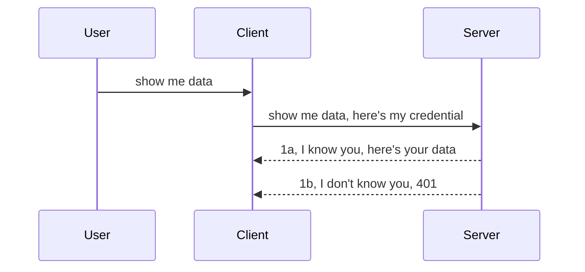

<!--
CO_OP_TRANSLATOR_METADATA:
{
  "original_hash": "5b00b8a8971a07d2d8803be4c9f138f8",
  "translation_date": "2025-10-07T01:05:54+00:00",
  "source_file": "03-GettingStarted/11-simple-auth/README.md",
  "language_code": "sr"
}
-->
# Једноставна аутентификација

MCP SDK-ови подржавају коришћење OAuth 2.1, што је прилично сложен процес који укључује концепте као што су сервер за аутентификацију, сервер ресурса, слање акредитива, добијање кода, размену кода за токен носиоца, све док коначно не добијете податке о ресурсу. Ако нисте упознати са OAuth-ом, који је одличан за имплементацију, добра је идеја да започнете са основним нивоом аутентификације и постепено унапређујете безбедност. Зато овај поглавље постоји – да вас постепено уведе у напреднију аутентификацију.

## Аутентификација, шта подразумевамо?

Аутентификација је скраћеница за аутентификацију и ауторизацију. Идеја је да треба да урадимо две ствари:

- **Аутентификација**, процес утврђивања да ли дозволити особи да уђе у нашу кућу, односно да ли има право да буде "овде", односно да има приступ нашем серверу ресурса где се налазе функције MCP сервера.
- **Ауторизација**, процес утврђивања да ли корисник треба да има приступ одређеним ресурсима које тражи, на пример овим наруџбинама или овим производима, или да ли му је дозвољено да чита садржај, али не и да га брише, као други пример.

## Акредитиви: како кажемо систему ко смо

Већина веб програмера размишља о пружању акредитива серверу, обично тајне која каже да ли им је дозвољено да буду овде ("Аутентификација"). Овај акредитив је обично base64 кодирана верзија корисничког имена и лозинке или API кључ који јединствено идентификује одређеног корисника.

Ово укључује слање преко заглавља под називом "Authorization", овако:

```json
{ "Authorization": "secret123" }
```

Ово се обично назива основна аутентификација. Како онда ради целокупан процес, објашњено је на следећи начин:



Сада када разумемо како функционише са становишта процеса, како то имплементирати? Па, већина веб сервера има концепт који се зове middleware, део кода који се извршава као део захтева и може да провери акредитиве, а ако су акредитиви валидни, може дозволити захтеву да прође. Ако захтев нема валидне акредитиве, добијате грешку аутентификације. Хајде да видимо како се то може имплементирати:

**Python**

```python
class AuthMiddleware(BaseHTTPMiddleware):
    async def dispatch(self, request, call_next):

        has_header = request.headers.get("Authorization")
        if not has_header:
            print("-> Missing Authorization header!")
            return Response(status_code=401, content="Unauthorized")

        if not valid_token(has_header):
            print("-> Invalid token!")
            return Response(status_code=403, content="Forbidden")

        print("Valid token, proceeding...")
       
        response = await call_next(request)
        # add any customer headers or change in the response in some way
        return response


starlette_app.add_middleware(CustomHeaderMiddleware)
```

Овде смо:

- Направили middleware под називом `AuthMiddleware` где се његов метод `dispatch` позива од стране веб сервера.
- Додали middleware веб серверу:

    ```python
    starlette_app.add_middleware(AuthMiddleware)
    ```

- Написали логику за валидацију која проверава да ли је присутно заглавље Authorization и да ли је тајна која се шаље валидна:

    ```python
    has_header = request.headers.get("Authorization")
    if not has_header:
        print("-> Missing Authorization header!")
        return Response(status_code=401, content="Unauthorized")

    if not valid_token(has_header):
        print("-> Invalid token!")
        return Response(status_code=403, content="Forbidden")
    ```

    ако је тајна присутна и валидна, дозвољавамо захтеву да прође позивањем `call_next` и враћамо одговор.

    ```python
    response = await call_next(request)
    # add any customer headers or change in the response in some way
    return response
    ```

Како функционише је да ако се направи веб захтев према серверу, middleware ће бити позван и, на основу своје имплементације, или ће дозволити захтеву да прође или ће вратити грешку која указује да клијенту није дозвољено да настави.

**TypeScript**

Овде креирамо middleware користећи популарни фрејмворк Express и пресрећемо захтев пре него што стигне до MCP сервера. Ево кода за то:

```typescript
function isValid(secret) {
    return secret === "secret123";
}

app.use((req, res, next) => {
    // 1. Authorization header present?  
    if(!req.headers["Authorization"]) {
        res.status(401).send('Unauthorized');
    }
    
    let token = req.headers["Authorization"];

    // 2. Check validity.
    if(!isValid(token)) {
        res.status(403).send('Forbidden');
    }

   
    console.log('Middleware executed');
    // 3. Passes request to the next step in the request pipeline.
    next();
});
```

У овом коду:

1. Проверавамо да ли је заглавље Authorization уопште присутно, ако није, шаљемо грешку 401.
2. Уверимо се да је акредитив/токен валидан, ако није, шаљемо грешку 403.
3. На крају, прослеђујемо захтев у pipeline захтева и враћамо тражени ресурс.

## Вежба: Имплементација аутентификације

Хајде да искористимо наше знање и покушамо да га имплементирамо. Ево плана:

Сервер

- Направите веб сервер и MCP инстанцу.
- Имплементирајте middleware за сервер.

Клијент 

- Пошаљите веб захтев, са акредитивом, преко заглавља.

### -1- Направите веб сервер и MCP инстанцу

У првом кораку, треба да направимо инстанцу веб сервера и MCP сервера.

**Python**

Овде креирамо MCP серверску инстанцу, креирамо starlette веб апликацију и хостујемо је помоћу uvicorn-а.

```python
# creating MCP Server

app = FastMCP(
    name="MCP Resource Server",
    instructions="Resource Server that validates tokens via Authorization Server introspection",
    host=settings["host"],
    port=settings["port"],
    debug=True
)

# creating starlette web app
starlette_app = app.streamable_http_app()

# serving app via uvicorn
async def run(starlette_app):
    import uvicorn
    config = uvicorn.Config(
            starlette_app,
            host=app.settings.host,
            port=app.settings.port,
            log_level=app.settings.log_level.lower(),
        )
    server = uvicorn.Server(config)
    await server.serve()

run(starlette_app)
```

У овом коду смо:

- Направили MCP сервер.
- Конструисали starlette веб апликацију из MCP сервера, `app.streamable_http_app()`.
- Хостовали и сервирали веб апликацију користећи uvicorn `server.serve()`.

**TypeScript**

Овде креирамо MCP серверску инстанцу.

```typescript
const server = new McpServer({
      name: "example-server",
      version: "1.0.0"
    });

    // ... set up server resources, tools, and prompts ...
```

Ова креирање MCP сервера треба да се деси унутар наше дефиниције руте POST /mcp, па хајде да преместимо горњи код овако:

```typescript
import express from "express";
import { randomUUID } from "node:crypto";
import { McpServer } from "@modelcontextprotocol/sdk/server/mcp.js";
import { StreamableHTTPServerTransport } from "@modelcontextprotocol/sdk/server/streamableHttp.js";
import { isInitializeRequest } from "@modelcontextprotocol/sdk/types.js"

const app = express();
app.use(express.json());

// Map to store transports by session ID
const transports: { [sessionId: string]: StreamableHTTPServerTransport } = {};

// Handle POST requests for client-to-server communication
app.post('/mcp', async (req, res) => {
  // Check for existing session ID
  const sessionId = req.headers['mcp-session-id'] as string | undefined;
  let transport: StreamableHTTPServerTransport;

  if (sessionId && transports[sessionId]) {
    // Reuse existing transport
    transport = transports[sessionId];
  } else if (!sessionId && isInitializeRequest(req.body)) {
    // New initialization request
    transport = new StreamableHTTPServerTransport({
      sessionIdGenerator: () => randomUUID(),
      onsessioninitialized: (sessionId) => {
        // Store the transport by session ID
        transports[sessionId] = transport;
      },
      // DNS rebinding protection is disabled by default for backwards compatibility. If you are running this server
      // locally, make sure to set:
      // enableDnsRebindingProtection: true,
      // allowedHosts: ['127.0.0.1'],
    });

    // Clean up transport when closed
    transport.onclose = () => {
      if (transport.sessionId) {
        delete transports[transport.sessionId];
      }
    };
    const server = new McpServer({
      name: "example-server",
      version: "1.0.0"
    });

    // ... set up server resources, tools, and prompts ...

    // Connect to the MCP server
    await server.connect(transport);
  } else {
    // Invalid request
    res.status(400).json({
      jsonrpc: '2.0',
      error: {
        code: -32000,
        message: 'Bad Request: No valid session ID provided',
      },
      id: null,
    });
    return;
  }

  // Handle the request
  await transport.handleRequest(req, res, req.body);
});

// Reusable handler for GET and DELETE requests
const handleSessionRequest = async (req: express.Request, res: express.Response) => {
  const sessionId = req.headers['mcp-session-id'] as string | undefined;
  if (!sessionId || !transports[sessionId]) {
    res.status(400).send('Invalid or missing session ID');
    return;
  }
  
  const transport = transports[sessionId];
  await transport.handleRequest(req, res);
};

// Handle GET requests for server-to-client notifications via SSE
app.get('/mcp', handleSessionRequest);

// Handle DELETE requests for session termination
app.delete('/mcp', handleSessionRequest);

app.listen(3000);
```

Сада видите како је креирање MCP сервера премештено унутар `app.post("/mcp")`.

Хајде да пређемо на следећи корак креирања middleware-а како бисмо могли да валидирамо долазећи акредитив.

### -2- Имплементација middleware-а за сервер

Хајде да пређемо на део middleware-а. Овде ћемо креирати middleware који тражи акредитив у заглављу `Authorization` и валидира га. Ако је прихватљив, захтев ће наставити да ради оно што треба (нпр. листање алата, читање ресурса или било која MCP функционалност коју клијент тражи).

**Python**

Да бисмо креирали middleware, треба да направимо класу која наслеђује `BaseHTTPMiddleware`. Постоје два занимљива дела:

- Захтев `request`, из којег читамо информације о заглављу.
- `call_next`, callback који треба да позовемо ако клијент донесе акредитив који прихватамо.

Прво, треба да обрадимо случај ако недостаје заглавље `Authorization`:

```python
has_header = request.headers.get("Authorization")

# no header present, fail with 401, otherwise move on.
if not has_header:
    print("-> Missing Authorization header!")
    return Response(status_code=401, content="Unauthorized")
```

Овде шаљемо поруку 401 unauthorized јер клијент не успева у аутентификацији.

Затим, ако је акредитив достављен, треба да проверимо његову валидност овако:

```python
 if not valid_token(has_header):
    print("-> Invalid token!")
    return Response(status_code=403, content="Forbidden")
```

Приметите како шаљемо поруку 403 forbidden изнад. Хајде да видимо комплетан middleware испод који имплементира све што смо горе поменули:

```python
class AuthMiddleware(BaseHTTPMiddleware):
    async def dispatch(self, request, call_next):

        has_header = request.headers.get("Authorization")
        if not has_header:
            print("-> Missing Authorization header!")
            return Response(status_code=401, content="Unauthorized")

        if not valid_token(has_header):
            print("-> Invalid token!")
            return Response(status_code=403, content="Forbidden")

        print("Valid token, proceeding...")
        print(f"-> Received {request.method} {request.url}")
        response = await call_next(request)
        response.headers['Custom'] = 'Example'
        return response

```

Одлично, али шта је са функцијом `valid_token`? Ево је испод:

```python
# DON'T use for production - improve it !!
def valid_token(token: str) -> bool:
    # remove the "Bearer " prefix
    if token.startswith("Bearer "):
        token = token[7:]
        return token == "secret-token"
    return False
```

Ово би, наравно, требало побољшати.

ВАЖНО: НИКАДА не треба да имате тајне као што је ова у коду. Идеално би било да вредност за поређење преузмете из базе података или од IDP-а (провајдера услуга идентификације) или, још боље, да дозволите IDP-у да обави валидацију.

**TypeScript**

Да бисмо ово имплементирали са Express-ом, треба да позовемо метод `use` који прихвата функције middleware-а.

Треба да:

- Интерагујемо са променљивом захтева да проверимо прослеђени акредитив у својству `Authorization`.
- Валидирамо акредитив, и ако је валидан, дозволимо захтеву да настави и да MCP захтев клијента ради оно што треба (нпр. листање алата, читање ресурса или било шта друго MCP повезано).

Овде проверавамо да ли је заглавље `Authorization` присутно, а ако није, заустављамо захтев:

```typescript
if(!req.headers["authorization"]) {
    res.status(401).send('Unauthorized');
    return;
}
```

Ако заглавље није послато, добијате грешку 401.

Затим проверавамо да ли је акредитив валидан, ако није, поново заустављамо захтев, али са мало другачијом поруком:

```typescript
if(!isValid(token)) {
    res.status(403).send('Forbidden');
    return;
} 
```

Приметите како сада добијате грешку 403.

Ево комплетног кода:

```typescript
app.use((req, res, next) => {
    console.log('Request received:', req.method, req.url, req.headers);
    console.log('Headers:', req.headers["authorization"]);
    if(!req.headers["authorization"]) {
        res.status(401).send('Unauthorized');
        return;
    }
    
    let token = req.headers["authorization"];

    if(!isValid(token)) {
        res.status(403).send('Forbidden');
        return;
    }  

    console.log('Middleware executed');
    next();
});
```

Подесили смо веб сервер да прихвати middleware за проверу акредитива које нам клијент, надамо се, шаље. Шта је са самим клијентом?

### -3- Слање веб захтева са акредитивом преко заглавља

Треба да осигурамо да клијент прослеђује акредитив преко заглавља. Како ћемо користити MCP клијент за то, треба да схватимо како се то ради.

**Python**

За клијента, треба да проследимо заглавље са нашим акредитивом овако:

```python
# DON'T hardcode the value, have it at minimum in an environment variable or a more secure storage
token = "secret-token"

async with streamablehttp_client(
        url = f"http://localhost:{port}/mcp",
        headers = {"Authorization": f"Bearer {token}"}
    ) as (
        read_stream,
        write_stream,
        session_callback,
    ):
        async with ClientSession(
            read_stream,
            write_stream
        ) as session:
            await session.initialize()
      
            # TODO, what you want done in the client, e.g list tools, call tools etc.
```

Приметите како попуњавамо својство `headers` овако: `headers = {"Authorization": f"Bearer {token}"}`.

**TypeScript**

Ово можемо решити у два корака:

1. Попуњавање конфигурационог објекта нашим акредитивом.
2. Прослеђивање конфигурационог објекта транспорту.

```typescript

// DON'T hardcode the value like shown here. At minimum have it as a env variable and use something like dotenv (in dev mode).
let token = "secret123"

// define a client transport option object
let options: StreamableHTTPClientTransportOptions = {
  sessionId: sessionId,
  requestInit: {
    headers: {
      "Authorization": "secret123"
    }
  }
};

// pass the options object to the transport
async function main() {
   const transport = new StreamableHTTPClientTransport(
      new URL(serverUrl),
      options
   );
```

Овде видите како смо морали да креирамо објекат `options` и поставимо наша заглавља под својство `requestInit`.

ВАЖНО: Како то можемо побољшати? Па, тренутна имплементација има неке проблеме. Пре свега, прослеђивање акредитива на овај начин је прилично ризично, осим ако барем немате HTTPS. Чак и тада, акредитив може бити украден, па вам је потребан систем у којем можете лако опозвати токен и додати додатне провере, као што су одакле у свету долази, да ли се захтев дешава превише често (понашање налик боту), укратко, постоји читав низ забринутости.

Треба рећи, међутим, да је за веома једноставне API-је где не желите да било ко позива ваш API без аутентификације, оно што овде имамо добар почетак.

С тим речима, хајде да покушамо да побољшамо безбедност мало више коришћењем стандардизованог формата као што је JSON Web Token, познат и као JWT или "JOT" токени.

## JSON Web Tokens, JWT

Дакле, покушавамо да побољшамо ствари од слања веома једноставних акредитива. Која су непосредна побољшања која добијамо усвајањем JWT?

- **Побољшање безбедности**. У основној аутентификацији, корисничко име и лозинка се шаљу као base64 кодирани токен (или се шаље API кључ) изнова и изнова, што повећава ризик. Са JWT, шаљете своје корисничко име и лозинку и добијате токен заузврат, који је такође временски ограничен, што значи да ће истећи. JWT вам омогућава лако коришћење детаљне контроле приступа користећи улоге, опсеге и дозволе.
- **Без стања и скалабилност**. JWT-ови су самостални, носе све информације о кориснику и елиминишу потребу за складиштењем сесија на серверу. Токен се такође може валидирати локално.
- **Интероперабилност и федерација**. JWT-ови су централни део Open ID Connect-а и користе се са познатим провајдерима идентитета као што су Entra ID, Google Identity и Auth0. Такође омогућавају коришћење једнократне пријаве и много више, чинећи их погодним за корпоративну употребу.
- **Модуларност и флексибилност**. JWT-ови се такође могу користити са API Gateway-има као што су Azure API Management, NGINX и други. Подржавају сценарије аутентификације и комуникацију сервер-сервис, укључујући сценарије имплементације и делегације.
- **Перформансе и кеширање**. JWT-ови се могу кеширати након декодирања, што смањује потребу за парсирањем. Ово посебно помаже апликацијама са великим прометом јер побољшава проток и смањује оптерећење на вашој инфраструктури.
- **Напредне функције**. Такође подржавају инспекцију (провера валидности на серверу) и опозив (проглашавање токена неважећим).

Са свим овим предностима, хајде да видимо како можемо подићи нашу имплементацију на виши ниво.

## Претварање основне аутентификације у JWT

Дакле, промене које треба да направимо на високом нивоу су:

- **Научити како конструисати JWT токен** и припремити га за слање од клијента до сервера.
- **Валидирати JWT токен**, и ако је валидан, дозволити клијенту приступ ресурсима.
- **Сигурно складиштење токена**. Како чувамо овај токен.
- **Заштита рута**. Треба да заштитимо руте, у нашем случају, треба да заштитимо руте и специфичне MCP функције.
- **Додавање refresh токена**. Осигурати да креирамо токене који су краткотрајни, али refresh токене који су дуготрајни и могу се користити за добијање нових токена ако истекну. Такође осигурати да постоји refresh endpoint и стратегија ротације.

### -1- Конструисање JWT токена

Прво, JWT токен има следеће делове:

- **заглавље**, алгоритам који се користи и тип токена.
- **payload**, тврдње, као што су sub (корисник или ентитет који токен представља. У сценарију аутентификације, ово је обично userid), exp (када истиче), role (улога).
- **потпис**, потписан са тајном или приватним кључем.

За ово, треба да конструишемо заглавље, payload и кодирани токен.

**Python**

```python

import jwt
import jwt
from jwt.exceptions import ExpiredSignatureError, InvalidTokenError
import datetime

# Secret key used to sign the JWT
secret_key = 'your-secret-key'

header = {
    "alg": "HS256",
    "typ": "JWT"
}

# the user info andits claims and expiry time
payload = {
    "sub": "1234567890",               # Subject (user ID)
    "name": "User Userson",                # Custom claim
    "admin": True,                     # Custom claim
    "iat": datetime.datetime.utcnow(),# Issued at
    "exp": datetime.datetime.utcnow() + datetime.timedelta(hours=1)  # Expiry
}

# encode it
encoded_jwt = jwt.encode(payload, secret_key, algorithm="HS256", headers=header)
```

У горњем коду смо:

- Дефинисали заглавље користећи HS256 као алгоритам и тип као JWT.
- Конструисали payload који садржи субјект или кориснички ID, корисничко име, улогу, када је издат и када истиче, чиме смо имплементирали временски ограничен аспект који смо раније поменули.

**TypeScript**

Овде ће нам бити потребне неке зависности које ће нам помоћи да конструишемо JWT токен.

Зависности

```sh

npm install jsonwebtoken
npm install --save-dev @types/jsonwebtoken
```

Сада када смо то поставили, хајде да креирамо заглавље, payload и кроз то креирамо кодирани токен.

```typescript
import jwt from 'jsonwebtoken';

const secretKey = 'your-secret-key'; // Use env vars in production

// Define the payload
const payload = {
  sub: '1234567890',
  name: 'User usersson',
  admin: true,
  iat: Math.floor(Date.now() / 1000), // Issued at
  exp: Math.floor(Date.now() / 1000) + 60 * 60 // Expires in 1 hour
};

// Define the header (optional, jsonwebtoken sets defaults)
const header = {
  alg: 'HS256',
  typ: 'JWT'
};

// Create the token
const token = jwt.sign(payload, secretKey, {
  algorithm: 'HS256',
  header: header
});

console.log('JWT:', token);
```

Овај токен је:

Потписан користећи HS256  
Важи 1 сат  
Укључује тврдње као што су sub, name, admin, iat и exp.

### -2- Валидирање токена

Такође треба да валидирамо токен, ово је нешто што треба да урадимо на серверу како бисмо осигурали да је оно што нам клијент шаље заиста валидно. Постоји много провера које треба да урадимо, од валидације његове структуре до његове валидности. Такође се препоручује да додате друге провере како бисте видели да ли корисник постоји у вашем систему и више.

Да бисмо валидирали токен, треба да га декодирамо како бисмо га прочитали и затим почели да проверавамо његову валидност:

**Python**

```python

# Decode and verify the JWT
try:
    decoded = jwt.decode(token, secret_key, algorithms=["HS256"])
    print("✅ Token is valid.")
    print("Decoded claims:")
    for key, value in decoded.items():
        print(f"  {key}: {value}")
except ExpiredSignatureError:
    print("❌ Token has expired.")
except InvalidTokenError as e:
    print(f"❌ Invalid token: {e}")

```

У
Следеће, хајде да погледамо контролу приступа засновану на улогама, познату као RBAC.

## Додавање контроле приступа засноване на улогама

Идеја је да желимо да изразимо да различите улоге имају различита овлашћења. На пример, претпостављамо да администратор може да ради све, да обични корисници могу да читају/пишу, а да гост може само да чита. Због тога, ево неких могућих нивоа овлашћења:

- Admin.Write 
- User.Read
- Guest.Read

Хајде да погледамо како можемо да имплементирамо такву контролу помоћу middleware-а. Middleware се може додати по рути, као и за све руте.

**Python**

```python
from starlette.middleware.base import BaseHTTPMiddleware
from starlette.responses import JSONResponse
import jwt

# DON'T have the secret in the code like, this is for demonstration purposes only. Read it from a safe place.
SECRET_KEY = "your-secret-key" # put this in env variable
REQUIRED_PERMISSION = "User.Read"

class JWTPermissionMiddleware(BaseHTTPMiddleware):
    async def dispatch(self, request, call_next):
        auth_header = request.headers.get("Authorization")
        if not auth_header or not auth_header.startswith("Bearer "):
            return JSONResponse({"error": "Missing or invalid Authorization header"}, status_code=401)

        token = auth_header.split(" ")[1]
        try:
            decoded = jwt.decode(token, SECRET_KEY, algorithms=["HS256"])
        except jwt.ExpiredSignatureError:
            return JSONResponse({"error": "Token expired"}, status_code=401)
        except jwt.InvalidTokenError:
            return JSONResponse({"error": "Invalid token"}, status_code=401)

        permissions = decoded.get("permissions", [])
        if REQUIRED_PERMISSION not in permissions:
            return JSONResponse({"error": "Permission denied"}, status_code=403)

        request.state.user = decoded
        return await call_next(request)


```

Постоји неколико различитих начина да се дода middleware, као што је приказано испод:

```python

# Alt 1: add middleware while constructing starlette app
middleware = [
    Middleware(JWTPermissionMiddleware)
]

app = Starlette(routes=routes, middleware=middleware)

# Alt 2: add middleware after starlette app is a already constructed
starlette_app.add_middleware(JWTPermissionMiddleware)

# Alt 3: add middleware per route
routes = [
    Route(
        "/mcp",
        endpoint=..., # handler
        middleware=[Middleware(JWTPermissionMiddleware)]
    )
]
```

**TypeScript**

Можемо користити `app.use` и middleware који ће се покренути за све захтеве.

```typescript
app.use((req, res, next) => {
    console.log('Request received:', req.method, req.url, req.headers);
    console.log('Headers:', req.headers["authorization"]);

    // 1. Check if authorization header has been sent

    if(!req.headers["authorization"]) {
        res.status(401).send('Unauthorized');
        return;
    }
    
    let token = req.headers["authorization"];

    // 2. Check if token is valid
    if(!isValid(token)) {
        res.status(403).send('Forbidden');
        return;
    }  

    // 3. Check if token user exist in our system
    if(!isExistingUser(token)) {
        res.status(403).send('Forbidden');
        console.log("User does not exist");
        return;
    }
    console.log("User exists");

    // 4. Verify the token has the right permissions
    if(!hasScopes(token, ["User.Read"])){
        res.status(403).send('Forbidden - insufficient scopes');
    }

    console.log("User has required scopes");

    console.log('Middleware executed');
    next();
});

```

Постоји доста ствари које можемо дозволити нашем middleware-у и које би наш middleware ТРЕБАЛО да ради, а то су:

1. Проверити да ли је присутан заглавље за ауторизацију.
2. Проверити да ли је токен валидан, позивамо `isValid`, што је метода коју смо написали за проверу интегритета и валидности JWT токена.
3. Проверити да ли корисник постоји у нашем систему, то би требало да проверимо.

   ```typescript
    // users in DB
   const users = [
     "user1",
     "User usersson",
   ]

   function isExistingUser(token) {
     let decodedToken = verifyToken(token);

     // TODO, check if user exists in DB
     return users.includes(decodedToken?.name || "");
   }
   ```

   Овде смо направили веома једноставну листу `users`, која би очигледно требало да буде у бази података.

4. Додатно, требало би да проверимо да ли токен има одговарајућа овлашћења.

   ```typescript
   if(!hasScopes(token, ["User.Read"])){
        res.status(403).send('Forbidden - insufficient scopes');
   }
   ```

   У горњем коду из middleware-а, проверавамо да ли токен садржи овлашћење User.Read, ако не, шаљемо грешку 403. Испод је помоћна метода `hasScopes`.

   ```typescript
   function hasScopes(scope: string, requiredScopes: string[]) {
     let decodedToken = verifyToken(scope);
    return requiredScopes.every(scope => decodedToken?.scopes.includes(scope));
  }
   ```

Have a think which additional checks you should be doing, but these are the absolute minimum of checks you should be doing.

Using Express as a web framework is a common choice. There are helpers library when you use JWT so you can write less code.

- `express-jwt`, helper library that provides a middleware that helps decode your token.
- `express-jwt-permissions`, this provides a middleware `guard` that helps check if a certain permission is on the token.

Here's what these libraries can look like when used:

```typescript
const express = require('express');
const jwt = require('express-jwt');
const guard = require('express-jwt-permissions')();

const app = express();
const secretKey = 'your-secret-key'; // put this in env variable

// Decode JWT and attach to req.user
app.use(jwt({ secret: secretKey, algorithms: ['HS256'] }));

// Check for User.Read permission
app.use(guard.check('User.Read'));

// multiple permissions
// app.use(guard.check(['User.Read', 'Admin.Access']));

app.get('/protected', (req, res) => {
  res.json({ message: `Welcome ${req.user.name}` });
});

// Error handler
app.use((err, req, res, next) => {
  if (err.code === 'permission_denied') {
    return res.status(403).send('Forbidden');
  }
  next(err);
});

```

Сада сте видели како middleware може да се користи за аутентификацију и ауторизацију, али шта је са MCP-ом, да ли он мења начин на који радимо аутентификацију? Хајде да сазнамо у следећем одељку.

### -3- Додавање RBAC-а у MCP

До сада сте видели како можете да додате RBAC преко middleware-а, међутим, за MCP не постоји једноставан начин да се дода RBAC за сваку MCP функцију, па шта да радимо? Па, једноставно морамо да додамо код који у овом случају проверава да ли клијент има права да позове одређени алат:

Имате неколико различитих избора како да постигнете RBAC за сваку функцију, ево неких:

- Додајте проверу за сваки алат, ресурс, упит где треба да проверите ниво овлашћења.

   **Python**

   ```python
   @tool()
   def delete_product(id: int):
      try:
          check_permissions(role="Admin.Write", request)
      catch:
        pass # client failed authorization, raise authorization error
   ```

   **TypeScript**

   ```typescript
   server.registerTool(
    "delete-product",
    {
      title: Delete a product",
      description: "Deletes a product",
      inputSchema: { id: z.number() }
    },
    async ({ id }) => {
      
      try {
        checkPermissions("Admin.Write", request);
        // todo, send id to productService and remote entry
      } catch(Exception e) {
        console.log("Authorization error, you're not allowed");  
      }

      return {
        content: [{ type: "text", text: `Deletected product with id ${id}` }]
      };
    }
   );
   ```


- Користите напредни серверски приступ и обрађиваче захтева како бисте минимизовали број места на којима треба да направите проверу.

   **Python**

   ```python
   
   tool_permission = {
      "create_product": ["User.Write", "Admin.Write"],
      "delete_product": ["Admin.Write"]
   }

   def has_permission(user_permissions, required_permissions) -> bool:
      # user_permissions: list of permissions the user has
      # required_permissions: list of permissions required for the tool
      return any(perm in user_permissions for perm in required_permissions)

   @server.call_tool()
   async def handle_call_tool(
     name: str, arguments: dict[str, str] | None
   ) -> list[types.TextContent]:
    # Assume request.user.permissions is a list of permissions for the user
     user_permissions = request.user.permissions
     required_permissions = tool_permission.get(name, [])
     if not has_permission(user_permissions, required_permissions):
        # Raise error "You don't have permission to call tool {name}"
        raise Exception(f"You don't have permission to call tool {name}")
     # carry on and call tool
     # ...
   ```   
   

   **TypeScript**

   ```typescript
   function hasPermission(userPermissions: string[], requiredPermissions: string[]): boolean {
       if (!Array.isArray(userPermissions) || !Array.isArray(requiredPermissions)) return false;
       // Return true if user has at least one required permission
       
       return requiredPermissions.some(perm => userPermissions.includes(perm));
   }
  
   server.setRequestHandler(CallToolRequestSchema, async (request) => {
      const { params: { name } } = request;
  
      let permissions = request.user.permissions;
  
      if (!hasPermission(permissions, toolPermissions[name])) {
         return new Error(`You don't have permission to call ${name}`);
      }
  
      // carry on..
   });
   ```

   Напомена: потребно је да осигурате да ваш middleware додели декодовани токен својству корисника у захтеву како би горњи код био једноставан.

### Резиме

Сада када смо разговарали о томе како да додамо подршку за RBAC уопште и за MCP посебно, време је да покушате да сами имплементирате безбедност како бисте осигурали да сте разумели концепте који су вам представљени.

## Задатак 1: Направите MCP сервер и MCP клијент користећи основну аутентификацију

Овде ћете применити оно што сте научили у погледу слања акредитива кроз заглавља.

## Решение 1

[Решење 1](./code/basic/README.md)

## Задатак 2: Надоградите решење из Задатка 1 да користи JWT

Узмите прво решење, али овог пута га побољшајте.

Уместо основне аутентификације, користимо JWT.

## Решение 2

[Решење 2](./solution/jwt-solution/README.md)

## Изазов

Додајте RBAC за сваки алат који смо описали у одељку "Додавање RBAC-а у MCP".

## Резиме

Надамо се да сте доста научили у овом поглављу, од потпуне одсутности безбедности, до основне безбедности, до JWT-а и како се он може додати MCP-у.

Изградили смо солидну основу са прилагођеним JWT-овима, али како се скалирамо, прелазимо на модел идентитета заснован на стандардима. Усвајање IdP-а као што су Entra или Keycloak омогућава нам да пренесемо издавање токена, њихову валидацију и управљање животним циклусом на поуздану платформу — ослобађајући нас да се фокусирамо на логику апликације и корисничко искуство.

За то имамо [напредно поглавље о Entra](../../05-AdvancedTopics/mcp-security-entra/README.md)

---

**Одрицање од одговорности**:  
Овај документ је преведен помоћу услуге за превођење уз помоћ вештачке интелигенције [Co-op Translator](https://github.com/Azure/co-op-translator). Иако се трудимо да обезбедимо тачност, молимо вас да имате у виду да аутоматски преводи могу садржати грешке или нетачности. Оригинални документ на његовом изворном језику треба сматрати меродавним извором. За критичне информације препоручује се професионални превод од стране људи. Не преузимамо одговорност за било каква погрешна тумачења или неспоразуме који могу настати услед коришћења овог превода.