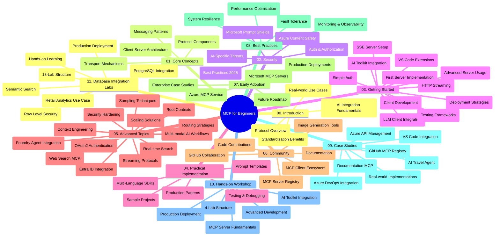

<!--
CO_OP_TRANSLATOR_METADATA:
{
  "original_hash": "af27b0acfae6caa134d9701453884df8",
  "translation_date": "2025-10-07T00:08:44+00:00",
  "source_file": "study_guide.md",
  "language_code": "sr"
}
-->
# Протокол контекста модела (MCP) за почетнике - Водич за учење

Овај водич за учење пружа преглед структуре и садржаја репозиторијума за наставни план "Протокол контекста модела (MCP) за почетнике". Користите овај водич да ефикасно прегледате репозиторијум и искористите доступне ресурсе.

## Преглед репозиторијума

Протокол контекста модела (MCP) је стандардизован оквир за интеракцију између AI модела и клијентских апликација. Првобитно креиран од стране Anthropic-а, MCP сада одржава шира MCP заједница преко званичне GitHub организације. Овај репозиторијум пружа свеобухватан наставни план са практичним примерима кода у C#, Java, JavaScript, Python и TypeScript, намењен AI програмерима, системским архитектама и софтверским инжењерима.

## Визуелна мапа наставног плана

## Структура репозиторијума

Репозиторијум је организован у једанаест главних секција, од којих свака покрива различите аспекте MCP-а:

1. **Увод (00-Introduction/)**
   - Преглед Протокола контекста модела
   - Зашто је стандардизација важна у AI процесима
   - Практични примери употребе и предности

2. **Основни концепти (01-CoreConcepts/)**
   - Клијент-сервер архитектура
   - Кључне компоненте протокола
   - Шаблони за размену порука у MCP-у

3. **Безбедност (02-Security/)**
   - Претње безбедности у системима заснованим на MCP-у
   - Најбоље праксе за обезбеђивање имплементација
   - Стратегије аутентификације и ауторизације
   - **Свеобухватна документација о безбедности**:
     - MCP најбоље праксе за безбедност 2025
     - Водич за имплементацију Azure Content Safety
     - MCP контроле и технике безбедности
     - Брзи референтни водич за MCP безбедност
   - **Кључне теме безбедности**:
     - Напади убацивања упита и тровања алатима
     - Отимање сесије и проблеми са конфузним заступником
     - Ризици преноса токена
     - Прекомерне дозволе и контрола приступа
     - Безбедност ланца снабдевања за AI компоненте
     - Интеграција Microsoft Prompt Shields-а

4. **Почетак рада (03-GettingStarted/)**
   - Подешавање и конфигурација окружења
   - Креирање основних MCP сервера и клијената
   - Интеграција са постојећим апликацијама
   - Укључује секције за:
     - Прву имплементацију сервера
     - Развој клијента
     - Интеграцију LLM клијента
     - Интеграцију са VS Code-ом
     - SSE сервер
     - Напредну употребу сервера
     - HTTP стриминг
     - Интеграцију AI алатки
     - Стратегије тестирања
     - Водич за распоређивање

5. **Практична имплементација (04-PracticalImplementation/)**
   - Коришћење SDK-ова у различитим програмским језицима
   - Технике дебаговања, тестирања и валидације
   - Креирање поново употребљивих шаблона упита и радних токова
   - Пример пројекти са имплементацијама

6. **Напредне теме (05-AdvancedTopics/)**
   - Технике инжењеринга контекста
   - Интеграција Foundry агента
   - Мултимодални AI радни токови
   - Демонстрације аутентификације преко OAuth2
   - Могућности претраге у реалном времену
   - Стриминг у реалном времену
   - Имплементација коренских контекста
   - Стратегије рутирања
   - Технике узорковања
   - Приступи скалирању
   - Разматрања безбедности
   - Интеграција Entra ID безбедности
   - Интеграција веб претраге

7. **Доприноси заједнице (06-CommunityContributions/)**
   - Како допринети коду и документацији
   - Сарадња преко GitHub-а
   - Побољшања и повратне информације вођене заједницом
   - Коришћење различитих MCP клијената (Claude Desktop, Cline, VSCode)
   - Рад са популарним MCP серверима укључујући генерисање слика

8. **Лекције из ране примене (07-LessonsfromEarlyAdoption/)**
   - Имплементације из стварног света и успешне приче
   - Изградња и распоређивање решења заснованих на MCP-у
   - Трендови и будућа мапа пута
   - **Водич за Microsoft MCP сервере**: Свеобухватан водич за 10 производно спремних Microsoft MCP сервера, укључујући:
     - Microsoft Learn Docs MCP сервер
     - Azure MCP сервер (15+ специјализованих конектора)
     - GitHub MCP сервер
     - Azure DevOps MCP сервер
     - MarkItDown MCP сервер
     - SQL Server MCP сервер
     - Playwright MCP сервер
     - Dev Box MCP сервер
     - Azure AI Foundry MCP сервер
     - Microsoft 365 Agents Toolkit MCP сервер

9. **Најбоље праксе (08-BestPractices/)**
   - Подешавање перформанси и оптимизација
   - Дизајнирање отпорних MCP система
   - Стратегије тестирања и отпорности

10. **Студије случаја (09-CaseStudy/)**
    - **Седам свеобухватних студија случаја** које демонстрирају свестраност MCP-а у различитим сценаријима:
    - **Azure AI туристички агенти**: Оркестрација више агената са Azure OpenAI и AI претрагом
    - **Интеграција Azure DevOps-а**: Аутоматизација радних токова са ажурирањима YouTube података
    - **Претраживање документације у реалном времену**: Python конзолни клијент са HTTP стримингом
    - **Интерактивни генератор плана учења**: Chainlit веб апликација са конверзацијским AI-јем
    - **Документација у уређивачу**: Интеграција VS Code-а са GitHub Copilot радним токовима
    - **Azure API менаџмент**: Интеграција предузетничких API-ја са креирањем MCP сервера
    - **GitHub MCP регистар**: Развој екосистема и платформа за интеграцију агената
    - Примери имплементације који обухватају предузетничку интеграцију, продуктивност програмера и развој екосистема

11. **Практична радионица (10-StreamliningAIWorkflowsBuildingAnMCPServerWithAIToolkit/)**
    - Свеобухватна практична радионица која комбинује MCP са AI алатком
    - Изградња интелигентних апликација које повезују AI моделе са стварним алатима
    - Практични модули који покривају основе, развој прилагођених сервера и стратегије распоређивања у производњу
    - **Структура лабораторије**:
      - Лабораторија 1: Основе MCP сервера
      - Лабораторија 2: Напредни развој MCP сервера
      - Лабораторија 3: Интеграција AI алатки
      - Лабораторија 4: Распоређивање у производњу и скалирање
    - Приступ учењу заснован на лабораторијама са упутствима корак по корак

12. **Лабораторије за интеграцију MCP сервера са базама података (11-MCPServerHandsOnLabs/)**
    - **Свеобухватан пут учења са 13 лабораторија** за изградњу производно спремних MCP сервера са PostgreSQL интеграцијом
    - **Имплементација аналитике малопродаје из стварног света** користећи Zava Retail случај
    - **Шаблони предузетничког нивоа** укључујући безбедност на нивоу реда (RLS), семантичку претрагу и приступ подацима за више корисника
    - **Комплетна структура лабораторије**:
      - **Лабораторије 00-03: Основе** - Увод, Архитектура, Безбедност, Подешавање окружења
      - **Лабораторије 04-06: Изградња MCP сервера** - Дизајн базе података, Имплементација MCP сервера, Развој алатки
      - **Лабораторије 07-09: Напредне функције** - Семантичка претрага, Тестирање и дебаговање, Интеграција са VS Code-ом
      - **Лабораторије 10-12: Производња и најбоље праксе** - Распоређивање, Праћење, Оптимизација
    - **Технологије које се покривају**: FastMCP оквир, PostgreSQL, Azure OpenAI, Azure Container Apps, Application Insights
    - **Циљеви учења**: MCP сервери спремни за производњу, шаблони интеграције база података, аналитика заснована на AI-ју, предузетничка безбедност

## Додатни ресурси

Репозиторијум укључује подржавајуће ресурсе:

- **Фолдер са сликама**: Садржи дијаграме и илустрације коришћене кроз наставни план
- **Преводи**: Подршка за више језика са аутоматизованим преводима документације
- **Званични MCP ресурси**:
  - [MCP документација](https://modelcontextprotocol.io/)
  - [MCP спецификација](https://spec.modelcontextprotocol.io/)
  - [MCP GitHub репозиторијум](https://github.com/modelcontextprotocol)

## Како користити овај репозиторијум

1. **Секвенцијално учење**: Пратите поглавља редом (00 до 11) за структурисано учење.
2. **Фокус на одређени језик**: Ако вас интересује одређени програмски језик, истражите директоријуме са примерима имплементације у вашем омиљеном језику.
3. **Практична имплементација**: Почните са секцијом "Почетак рада" да подесите своје окружење и креирате свој први MCP сервер и клијент.
4. **Напредно истраживање**: Када се упознате са основама, истражите напредне теме да проширите своје знање.
5. **Ангажовање заједнице**: Придружите се MCP заједници преко GitHub дискусија и Discord канала да се повежете са стручњацима и другим програмерима.

## MCP клијенти и алатке

Наставни план покрива различите MCP клијенте и алатке:

1. **Званични клијенти**:
   - Visual Studio Code 
   - MCP у Visual Studio Code-у
   - Claude Desktop
   - Claude у VSCode-у 
   - Claude API

2. **Клијенти заједнице**:
   - Cline (заснован на терминалу)
   - Cursor (уређивач кода)
   - ChatMCP
   - Windsurf

3. **Алатке за управљање MCP-ом**:
   - MCP CLI
   - MCP Manager
   - MCP Linker
   - MCP Router

## Популарни MCP сервери

Репозиторијум представља различите MCP сервере, укључујући:

1. **Званични Microsoft MCP сервери**:
   - Microsoft Learn Docs MCP сервер
   - Azure MCP сервер (15+ специјализованих конектора)
   - GitHub MCP сервер
   - Azure DevOps MCP сервер
   - MarkItDown MCP сервер
   - SQL Server MCP сервер
   - Playwright MCP сервер
   - Dev Box MCP сервер
   - Azure AI Foundry MCP сервер
   - Microsoft 365 Agents Toolkit MCP сервер

2. **Званични референтни сервери**:
   - Filesystem
   - Fetch
   - Memory
   - Sequential Thinking

3. **Генерисање слика**:
   - Azure OpenAI DALL-E 3
   - Stable Diffusion WebUI
   - Replicate

4. **Алатке за развој**:
   - Git MCP
   - Terminal Control
   - Code Assistant

5. **Специјализовани сервери**:
   - Salesforce
   - Microsoft Teams
   - Jira & Confluence

## Доприноси

Овај репозиторијум поздравља доприносе заједнице. Погледајте секцију Доприноси заједнице за упутства о томе како ефикасно допринети MCP екосистему.

----

*Овај водич за учење је ажуриран 6. октобра 2025. године и пружа преглед репозиторијума на тај датум. Садржај репозиторијума може бити ажуриран након овог датума.*

---

**Одрицање од одговорности**:  
Овај документ је преведен коришћењем услуге за превођење помоћу вештачке интелигенције [Co-op Translator](https://github.com/Azure/co-op-translator). Иако се трудимо да обезбедимо тачност, молимо вас да имате у виду да аутоматски преводи могу садржати грешке или нетачности. Оригинални документ на његовом изворном језику треба сматрати ауторитативним извором. За критичне информације препоручује се професионални превод од стране људи. Не сносимо одговорност за било каква погрешна тумачења или неспоразуме који могу произаћи из коришћења овог превода.