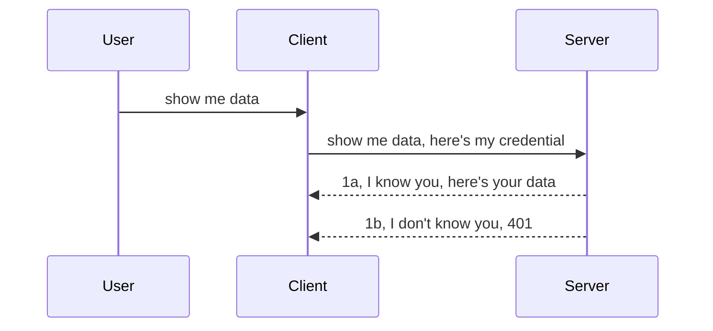

<!--
CO_OP_TRANSLATOR_METADATA:
{
  "original_hash": "5b00b8a8971a07d2d8803be4c9f138f8",
  "translation_date": "2025-10-07T00:52:16+00:00",
  "source_file": "03-GettingStarted/11-simple-auth/README.md",
  "language_code": "sv"
}
-->
# Enkel autentisering

MCP SDK:er stödjer användningen av OAuth 2.1, vilket är en ganska omfattande process som involverar koncept som autentiseringsserver, resursserver, skicka inloggningsuppgifter, få en kod, byta koden mot en "bearer token" tills du slutligen kan hämta dina resursdata. Om du inte är van vid OAuth, vilket är en fantastisk lösning att implementera, kan det vara en bra idé att börja med en grundläggande nivå av autentisering och sedan bygga upp till bättre och bättre säkerhet. Det är därför detta kapitel finns, för att hjälpa dig att utvecklas till mer avancerad autentisering.

## Autentisering, vad menar vi?

Autentisering är en förkortning för autentisering och auktorisering. Idén är att vi behöver göra två saker:

- **Autentisering**, processen att avgöra om vi ska låta en person komma in i vårt hus, att de har rätt att vara "här", det vill säga ha tillgång till vår resursserver där våra MCP Server-funktioner finns.
- **Auktorisering**, processen att avgöra om en användare ska ha tillgång till de specifika resurser de begär, till exempel dessa beställningar eller dessa produkter, eller om de får läsa innehållet men inte ta bort det, som ett annat exempel.

## Inloggningsuppgifter: hur vi berättar för systemet vem vi är

De flesta webbutvecklare börjar tänka i termer av att tillhandahålla en inloggningsuppgift till servern, vanligtvis en hemlighet som säger om de har rätt att vara här ("autentisering"). Denna inloggningsuppgift är vanligtvis en base64-kodad version av användarnamn och lösenord eller en API-nyckel som unikt identifierar en specifik användare.

Detta innebär att man skickar det via en header som heter "Authorization" så här:

```json
{ "Authorization": "secret123" }
```

Detta kallas vanligtvis grundläggande autentisering. Hur det övergripande flödet fungerar är enligt följande:



Nu när vi förstår hur det fungerar ur ett flödesperspektiv, hur implementerar vi det? De flesta webbservrar har ett koncept som kallas middleware, en kodbit som körs som en del av begäran och kan verifiera inloggningsuppgifter. Om inloggningsuppgifterna är giltiga kan begäran passera igenom. Om begäran inte har giltiga inloggningsuppgifter får du ett autentiseringsfel. Låt oss se hur detta kan implementeras:

**Python**

```python
class AuthMiddleware(BaseHTTPMiddleware):
    async def dispatch(self, request, call_next):

        has_header = request.headers.get("Authorization")
        if not has_header:
            print("-> Missing Authorization header!")
            return Response(status_code=401, content="Unauthorized")

        if not valid_token(has_header):
            print("-> Invalid token!")
            return Response(status_code=403, content="Forbidden")

        print("Valid token, proceeding...")
       
        response = await call_next(request)
        # add any customer headers or change in the response in some way
        return response


starlette_app.add_middleware(CustomHeaderMiddleware)
```

Här har vi:

- Skapat en middleware kallad `AuthMiddleware` där dess `dispatch`-metod anropas av webbservern.
- Lagt till middleware i webbservern:

    ```python
    starlette_app.add_middleware(AuthMiddleware)
    ```

- Skrivit valideringslogik som kontrollerar om Authorization-headern finns och om den skickade hemligheten är giltig:

    ```python
    has_header = request.headers.get("Authorization")
    if not has_header:
        print("-> Missing Authorization header!")
        return Response(status_code=401, content="Unauthorized")

    if not valid_token(has_header):
        print("-> Invalid token!")
        return Response(status_code=403, content="Forbidden")
    ```

    Om hemligheten finns och är giltig låter vi begäran passera genom att anropa `call_next` och returnera svaret.

    ```python
    response = await call_next(request)
    # add any customer headers or change in the response in some way
    return response
    ```

Hur det fungerar är att om en webbförfrågan görs mot servern kommer middleware att anropas och baserat på dess implementering kommer den antingen att låta begäran passera eller returnera ett fel som indikerar att klienten inte får fortsätta.

**TypeScript**

Här skapar vi en middleware med det populära ramverket Express och avlyssnar begäran innan den når MCP Server. Här är koden för det:

```typescript
function isValid(secret) {
    return secret === "secret123";
}

app.use((req, res, next) => {
    // 1. Authorization header present?  
    if(!req.headers["Authorization"]) {
        res.status(401).send('Unauthorized');
    }
    
    let token = req.headers["Authorization"];

    // 2. Check validity.
    if(!isValid(token)) {
        res.status(403).send('Forbidden');
    }

   
    console.log('Middleware executed');
    // 3. Passes request to the next step in the request pipeline.
    next();
});
```

I denna kod gör vi:

1. Kontrollerar om Authorization-headern finns överhuvudtaget, om inte, skickar vi ett 401-fel.
2. Säkerställer att inloggningsuppgiften/token är giltig, om inte, skickar vi ett 403-fel.
3. Slutligen skickar vi vidare begäran i begärans pipeline och returnerar den begärda resursen.

## Övning: Implementera autentisering

Låt oss ta vår kunskap och försöka implementera den. Här är planen:

Server

- Skapa en webbserver och MCP-instans.
- Implementera en middleware för servern.

Klient 

- Skicka webbförfrågan, med inloggningsuppgift, via header.

### -1- Skapa en webbserver och MCP-instans

I vårt första steg behöver vi skapa webbserverinstansen och MCP Server.

**Python**

Här skapar vi en MCP-serverinstans, skapar en starlette-webbapp och hostar den med uvicorn.

```python
# creating MCP Server

app = FastMCP(
    name="MCP Resource Server",
    instructions="Resource Server that validates tokens via Authorization Server introspection",
    host=settings["host"],
    port=settings["port"],
    debug=True
)

# creating starlette web app
starlette_app = app.streamable_http_app()

# serving app via uvicorn
async def run(starlette_app):
    import uvicorn
    config = uvicorn.Config(
            starlette_app,
            host=app.settings.host,
            port=app.settings.port,
            log_level=app.settings.log_level.lower(),
        )
    server = uvicorn.Server(config)
    await server.serve()

run(starlette_app)
```

I denna kod gör vi:

- Skapar MCP Server.
- Konstruerar starlette-webbappen från MCP Server, `app.streamable_http_app()`.
- Hostar och serverar webbappen med uvicorn `server.serve()`.

**TypeScript**

Här skapar vi en MCP Server-instans.

```typescript
const server = new McpServer({
      name: "example-server",
      version: "1.0.0"
    });

    // ... set up server resources, tools, and prompts ...
```

Denna MCP Server-skapande behöver ske inom vår POST /mcp-routedefinition, så låt oss ta ovanstående kod och flytta den så här:

```typescript
import express from "express";
import { randomUUID } from "node:crypto";
import { McpServer } from "@modelcontextprotocol/sdk/server/mcp.js";
import { StreamableHTTPServerTransport } from "@modelcontextprotocol/sdk/server/streamableHttp.js";
import { isInitializeRequest } from "@modelcontextprotocol/sdk/types.js"

const app = express();
app.use(express.json());

// Map to store transports by session ID
const transports: { [sessionId: string]: StreamableHTTPServerTransport } = {};

// Handle POST requests for client-to-server communication
app.post('/mcp', async (req, res) => {
  // Check for existing session ID
  const sessionId = req.headers['mcp-session-id'] as string | undefined;
  let transport: StreamableHTTPServerTransport;

  if (sessionId && transports[sessionId]) {
    // Reuse existing transport
    transport = transports[sessionId];
  } else if (!sessionId && isInitializeRequest(req.body)) {
    // New initialization request
    transport = new StreamableHTTPServerTransport({
      sessionIdGenerator: () => randomUUID(),
      onsessioninitialized: (sessionId) => {
        // Store the transport by session ID
        transports[sessionId] = transport;
      },
      // DNS rebinding protection is disabled by default for backwards compatibility. If you are running this server
      // locally, make sure to set:
      // enableDnsRebindingProtection: true,
      // allowedHosts: ['127.0.0.1'],
    });

    // Clean up transport when closed
    transport.onclose = () => {
      if (transport.sessionId) {
        delete transports[transport.sessionId];
      }
    };
    const server = new McpServer({
      name: "example-server",
      version: "1.0.0"
    });

    // ... set up server resources, tools, and prompts ...

    // Connect to the MCP server
    await server.connect(transport);
  } else {
    // Invalid request
    res.status(400).json({
      jsonrpc: '2.0',
      error: {
        code: -32000,
        message: 'Bad Request: No valid session ID provided',
      },
      id: null,
    });
    return;
  }

  // Handle the request
  await transport.handleRequest(req, res, req.body);
});

// Reusable handler for GET and DELETE requests
const handleSessionRequest = async (req: express.Request, res: express.Response) => {
  const sessionId = req.headers['mcp-session-id'] as string | undefined;
  if (!sessionId || !transports[sessionId]) {
    res.status(400).send('Invalid or missing session ID');
    return;
  }
  
  const transport = transports[sessionId];
  await transport.handleRequest(req, res);
};

// Handle GET requests for server-to-client notifications via SSE
app.get('/mcp', handleSessionRequest);

// Handle DELETE requests for session termination
app.delete('/mcp', handleSessionRequest);

app.listen(3000);
```

Nu ser du hur MCP Server-skapandet flyttades inom `app.post("/mcp")`.

Låt oss gå vidare till nästa steg att skapa middleware så vi kan validera den inkommande inloggningsuppgiften.

### -2- Implementera en middleware för servern

Låt oss gå vidare till middleware-delen. Här kommer vi att skapa en middleware som letar efter en inloggningsuppgift i `Authorization`-headern och validerar den. Om den är acceptabel kommer begäran att gå vidare för att göra vad den behöver (t.ex. lista verktyg, läsa en resurs eller vilken MCP-funktionalitet klienten än begärde).

**Python**

För att skapa middleware behöver vi skapa en klass som ärver från `BaseHTTPMiddleware`. Det finns två intressanta delar:

- Begäran `request`, som vi läser headerinformationen från.
- `call_next`, callbacken vi behöver anropa om klienten har med sig en inloggningsuppgift vi accepterar.

Först behöver vi hantera fallet om `Authorization`-headern saknas:

```python
has_header = request.headers.get("Authorization")

# no header present, fail with 401, otherwise move on.
if not has_header:
    print("-> Missing Authorization header!")
    return Response(status_code=401, content="Unauthorized")
```

Här skickar vi ett 401 Unauthorized-meddelande eftersom klienten misslyckas med autentiseringen.

Nästa, om en inloggningsuppgift skickades, behöver vi kontrollera dess giltighet så här:

```python
 if not valid_token(has_header):
    print("-> Invalid token!")
    return Response(status_code=403, content="Forbidden")
```

Observera hur vi skickar ett 403 Forbidden-meddelande ovan. Låt oss se hela middleware nedan som implementerar allt vi nämnde ovan:

```python
class AuthMiddleware(BaseHTTPMiddleware):
    async def dispatch(self, request, call_next):

        has_header = request.headers.get("Authorization")
        if not has_header:
            print("-> Missing Authorization header!")
            return Response(status_code=401, content="Unauthorized")

        if not valid_token(has_header):
            print("-> Invalid token!")
            return Response(status_code=403, content="Forbidden")

        print("Valid token, proceeding...")
        print(f"-> Received {request.method} {request.url}")
        response = await call_next(request)
        response.headers['Custom'] = 'Example'
        return response

```

Bra, men vad gäller `valid_token`-funktionen? Här är den nedan:

```python
# DON'T use for production - improve it !!
def valid_token(token: str) -> bool:
    # remove the "Bearer " prefix
    if token.startswith("Bearer "):
        token = token[7:]
        return token == "secret-token"
    return False
```

Detta bör naturligtvis förbättras.

VIKTIGT: Du bör ALDRIG ha hemligheter som detta i koden. Du bör helst hämta värdet att jämföra med från en datakälla eller från en IDP (Identity Service Provider) eller ännu bättre, låta IDP:n göra valideringen.

**TypeScript**

För att implementera detta med Express behöver vi anropa `use`-metoden som tar middleware-funktioner.

Vi behöver:

- Interagera med begäransvariabeln för att kontrollera den skickade inloggningsuppgiften i `Authorization`-egenskapen.
- Validera inloggningsuppgiften, och om den är giltig låta begäran fortsätta och låta klientens MCP-begäran göra vad den ska (t.ex. lista verktyg, läsa resurs eller något annat MCP-relaterat).

Här kontrollerar vi om `Authorization`-headern finns och om inte, stoppar vi begäran från att gå vidare:

```typescript
if(!req.headers["authorization"]) {
    res.status(401).send('Unauthorized');
    return;
}
```

Om headern inte skickas överhuvudtaget får du ett 401-fel.

Nästa, vi kontrollerar om inloggningsuppgiften är giltig, om inte stoppar vi begäran igen men med ett något annorlunda meddelande:

```typescript
if(!isValid(token)) {
    res.status(403).send('Forbidden');
    return;
} 
```

Observera hur du nu får ett 403-fel.

Här är hela koden:

```typescript
app.use((req, res, next) => {
    console.log('Request received:', req.method, req.url, req.headers);
    console.log('Headers:', req.headers["authorization"]);
    if(!req.headers["authorization"]) {
        res.status(401).send('Unauthorized');
        return;
    }
    
    let token = req.headers["authorization"];

    if(!isValid(token)) {
        res.status(403).send('Forbidden');
        return;
    }  

    console.log('Middleware executed');
    next();
});
```

Vi har ställt in webbservern att acceptera en middleware för att kontrollera inloggningsuppgiften som klienten förhoppningsvis skickar oss. Vad gäller själva klienten?

### -3- Skicka webbförfrågan med inloggningsuppgift via header

Vi behöver säkerställa att klienten skickar inloggningsuppgiften via headern. Eftersom vi ska använda en MCP-klient för att göra detta behöver vi lista ut hur det görs.

**Python**

För klienten behöver vi skicka en header med vår inloggningsuppgift så här:

```python
# DON'T hardcode the value, have it at minimum in an environment variable or a more secure storage
token = "secret-token"

async with streamablehttp_client(
        url = f"http://localhost:{port}/mcp",
        headers = {"Authorization": f"Bearer {token}"}
    ) as (
        read_stream,
        write_stream,
        session_callback,
    ):
        async with ClientSession(
            read_stream,
            write_stream
        ) as session:
            await session.initialize()
      
            # TODO, what you want done in the client, e.g list tools, call tools etc.
```

Observera hur vi fyller `headers`-egenskapen så här: `headers = {"Authorization": f"Bearer {token}"}`.

**TypeScript**

Vi kan lösa detta i två steg:

1. Fylla en konfigurationsobjekt med vår inloggningsuppgift.
2. Skicka konfigurationsobjektet till transporten.

```typescript

// DON'T hardcode the value like shown here. At minimum have it as a env variable and use something like dotenv (in dev mode).
let token = "secret123"

// define a client transport option object
let options: StreamableHTTPClientTransportOptions = {
  sessionId: sessionId,
  requestInit: {
    headers: {
      "Authorization": "secret123"
    }
  }
};

// pass the options object to the transport
async function main() {
   const transport = new StreamableHTTPClientTransport(
      new URL(serverUrl),
      options
   );
```

Här ser du ovan hur vi var tvungna att skapa ett `options`-objekt och placera våra headers under `requestInit`-egenskapen.

VIKTIGT: Hur förbättrar vi detta härifrån? Den nuvarande implementeringen har några problem. För det första, att skicka en inloggningsuppgift på detta sätt är ganska riskabelt om du inte åtminstone har HTTPS. Även då kan inloggningsuppgiften stjälas, så du behöver ett system där du enkelt kan återkalla token och lägga till ytterligare kontroller som var i världen den kommer ifrån, om begäran sker alldeles för ofta (bot-liknande beteende), kort sagt, det finns en hel rad bekymmer.

Det bör dock sägas att för mycket enkla API:er där du inte vill att någon ska anropa ditt API utan att vara autentiserad är vad vi har här en bra start.

Med det sagt, låt oss försöka stärka säkerheten lite genom att använda ett standardiserat format som JSON Web Token, även känt som JWT eller "JOT"-token.

## JSON Web Tokens, JWT

Så, vi försöker förbättra saker från att skicka mycket enkla inloggningsuppgifter. Vilka omedelbara förbättringar får vi genom att anta JWT?

- **Säkerhetsförbättringar**. I grundläggande autentisering skickar du användarnamn och lösenord som en base64-kodad token (eller du skickar en API-nyckel) om och om igen vilket ökar risken. Med JWT skickar du ditt användarnamn och lösenord och får en token i retur som också är tidsbegränsad, vilket innebär att den kommer att löpa ut. JWT låter dig enkelt använda finfördelad åtkomstkontroll med roller, scopes och behörigheter.
- **Statelessness och skalbarhet**. JWT:er är självständiga, de bär all användarinformation och eliminerar behovet av att lagra server-sidans sessionslagring. Token kan också valideras lokalt.
- **Interoperabilitet och federation**. JWT:er är centrala för Open ID Connect och används med kända identitetsleverantörer som Entra ID, Google Identity och Auth0. De gör det också möjligt att använda single sign-on och mycket mer, vilket gör det företagsklassat.
- **Modularitet och flexibilitet**. JWT:er kan också användas med API Gateways som Azure API Management, NGINX och mer. Det stöder också användningsautentiseringsscenarier och server-till-server-kommunikation inklusive impersonation och delegation-scenarier.
- **Prestanda och caching**. JWT:er kan cachas efter dekodning vilket minskar behovet av parsing. Detta hjälper särskilt med högtrafik-appar eftersom det förbättrar genomströmningen och minskar belastningen på din valda infrastruktur.
- **Avancerade funktioner**. Det stöder också introspektion (kontroll av giltighet på servern) och återkallande (göra en token ogiltig).

Med alla dessa fördelar, låt oss se hur vi kan ta vår implementering till nästa nivå.

## Förvandla grundläggande autentisering till JWT

Så, de förändringar vi behöver på hög nivå är att:

- **Lära oss att konstruera en JWT-token** och göra den redo att skickas från klient till server.
- **Validera en JWT-token**, och om den är giltig, låta klienten få våra resurser.
- **Säker tokenlagring**. Hur vi lagrar denna token.
- **Skydda rutterna**. Vi behöver skydda rutterna, i vårt fall, vi behöver skydda rutterna och specifika MCP-funktioner.
- **Lägga till uppfriskningstoken**. Säkerställa att vi skapar tokens som är kortlivade men uppfriskningstokens som är långlivade som kan användas för att skaffa nya tokens om de löper ut. Säkerställa att det finns en uppfriskningsendpoint och en rotationsstrategi.

### -1- Konstruera en JWT-token

Först och främst har en JWT-token följande delar:

- **Header**, algoritmen som används och typ av token.
- **Payload**, claims, som sub (användaren eller enheten som token representerar. I ett autentiseringsscenario är detta vanligtvis användar-ID), exp (när den löper ut), role (rollen).
- **Signatur**, signerad med en hemlighet eller privat nyckel.

För detta behöver vi konstruera headern, payloaden och den kodade token.

**Python**

```python

import jwt
import jwt
from jwt.exceptions import ExpiredSignatureError, InvalidTokenError
import datetime

# Secret key used to sign the JWT
secret_key = 'your-secret-key'

header = {
    "alg": "HS256",
    "typ": "JWT"
}

# the user info andits claims and expiry time
payload = {
    "sub": "1234567890",               # Subject (user ID)
    "name": "User Userson",                # Custom claim
    "admin": True,                     # Custom claim
    "iat": datetime.datetime.utcnow(),# Issued at
    "exp": datetime.datetime.utcnow() + datetime.timedelta(hours=1)  # Expiry
}

# encode it
encoded_jwt = jwt.encode(payload, secret_key, algorithm="HS256", headers=header)
```

I koden ovan har vi:

- Definierat en header med HS256 som algoritm och typ som JWT.
- Konstruerat en payload som innehåller en subject eller användar-ID, ett användarnamn, en roll, när den utfärdades och när den är inställd att löpa ut, vilket implementerar den tidsbegränsade aspekten vi nämnde tidigare.

**TypeScript**

Här behöver vi några beroenden som hjälper oss att konstruera JWT-token.

Beroenden

```sh

npm install jsonwebtoken
npm install --save-dev @types/jsonwebtoken
```

Nu när vi har det på plats, låt oss skapa headern, payloaden och genom det skapa den kodade token.

```typescript
import jwt from 'jsonwebtoken';

const secretKey = 'your-secret-key'; // Use env vars in production

// Define the payload
const payload = {
  sub: '1234567890',
  name: 'User usersson',
  admin: true,
  iat: Math.floor(Date.now() / 1000), // Issued at
  exp: Math.floor(Date.now() / 1000) + 60 * 60 // Expires in 1 hour
};

// Define the header (optional, jsonwebtoken sets defaults)
const header = {
  alg: 'HS256',
  typ: 'JWT'
};

// Create the token
const token = jwt.sign(payload, secretKey, {
  algorithm: 'HS256',
  header: header
});

console.log('JWT:', token);
```

Denna token är:

Signerad med HS256
Giltig i 1 timme
Innehåller claims som sub, name, admin, iat och exp.

### -2- Validera en token

Vi behöver också validera en token, detta är något vi bör göra på servern för att säkerställa att det klienten skickar oss faktiskt är giltigt. Det finns många kontroller vi bör göra här, från att validera dess struktur till dess giltighet. Du uppmuntras också att lägga till andra kontroller för att se om användaren finns i ditt system och mer.

För att validera en token behöver vi dekoda den så vi kan läsa den och sedan börja kontrollera dess giltighet:

**Python**

```python

# Decode and verify the JWT
try:
    decoded = jwt.decode(token, secret_key, algorithms=["HS256"])
    print("✅ Token is valid.")
    print("Decoded claims:")
    for key, value in decoded.items():
        print(f"  {key}: {value}")
except ExpiredSignatureError:
    print("❌ Token has expired.")
except InvalidTokenError as e:
    print(f"❌ Invalid token: {e}")

```

I denna kod anropar vi `jwt.decode` med token, hemlighetsnyckeln och den valda algoritmen som input. Observera hur vi använder en try-catch-konstruktion eftersom en misslyckad validering leder till att ett fel uppstår.

**TypeScript**

Här behöver vi anropa `jwt.verify` för att få en dekodad version av token som vi kan analysera vidare. Om detta anrop misslyckas betyder det att tokenens struktur är felaktig eller att den inte längre är giltig.

```typescript

try {
  const decoded = jwt.verify(token, secretKey);
  console.log('Decoded Payload:', decoded);
} catch (err) {
  console.error('Token verification failed:', err);
}
```

OBS: som nämnts tidigare bör vi utföra ytterligare kontroller för att säkerställa att denna token pekar på en användare i vårt system och säkerställa att användaren har de rättigheter den påstår sig ha.
Nästa steg är att titta på rollbaserad åtkomstkontroll, även kallad RBAC.

## Lägga till rollbaserad åtkomstkontroll

Tanken är att vi vill uttrycka att olika roller har olika behörigheter. Till exempel antar vi att en administratör kan göra allt, att vanliga användare kan läsa/skriva och att en gäst endast kan läsa. Här är några möjliga behörighetsnivåer:

- Admin.Write 
- User.Read
- Guest.Read

Låt oss se hur vi kan implementera en sådan kontroll med middleware. Middleware kan läggas till per route såväl som för alla routes.

**Python**

```python
from starlette.middleware.base import BaseHTTPMiddleware
from starlette.responses import JSONResponse
import jwt

# DON'T have the secret in the code like, this is for demonstration purposes only. Read it from a safe place.
SECRET_KEY = "your-secret-key" # put this in env variable
REQUIRED_PERMISSION = "User.Read"

class JWTPermissionMiddleware(BaseHTTPMiddleware):
    async def dispatch(self, request, call_next):
        auth_header = request.headers.get("Authorization")
        if not auth_header or not auth_header.startswith("Bearer "):
            return JSONResponse({"error": "Missing or invalid Authorization header"}, status_code=401)

        token = auth_header.split(" ")[1]
        try:
            decoded = jwt.decode(token, SECRET_KEY, algorithms=["HS256"])
        except jwt.ExpiredSignatureError:
            return JSONResponse({"error": "Token expired"}, status_code=401)
        except jwt.InvalidTokenError:
            return JSONResponse({"error": "Invalid token"}, status_code=401)

        permissions = decoded.get("permissions", [])
        if REQUIRED_PERMISSION not in permissions:
            return JSONResponse({"error": "Permission denied"}, status_code=403)

        request.state.user = decoded
        return await call_next(request)


```

Det finns några olika sätt att lägga till middleware, som nedan:

```python

# Alt 1: add middleware while constructing starlette app
middleware = [
    Middleware(JWTPermissionMiddleware)
]

app = Starlette(routes=routes, middleware=middleware)

# Alt 2: add middleware after starlette app is a already constructed
starlette_app.add_middleware(JWTPermissionMiddleware)

# Alt 3: add middleware per route
routes = [
    Route(
        "/mcp",
        endpoint=..., # handler
        middleware=[Middleware(JWTPermissionMiddleware)]
    )
]
```

**TypeScript**

Vi kan använda `app.use` och en middleware som körs för alla förfrågningar.

```typescript
app.use((req, res, next) => {
    console.log('Request received:', req.method, req.url, req.headers);
    console.log('Headers:', req.headers["authorization"]);

    // 1. Check if authorization header has been sent

    if(!req.headers["authorization"]) {
        res.status(401).send('Unauthorized');
        return;
    }
    
    let token = req.headers["authorization"];

    // 2. Check if token is valid
    if(!isValid(token)) {
        res.status(403).send('Forbidden');
        return;
    }  

    // 3. Check if token user exist in our system
    if(!isExistingUser(token)) {
        res.status(403).send('Forbidden');
        console.log("User does not exist");
        return;
    }
    console.log("User exists");

    // 4. Verify the token has the right permissions
    if(!hasScopes(token, ["User.Read"])){
        res.status(403).send('Forbidden - insufficient scopes');
    }

    console.log("User has required scopes");

    console.log('Middleware executed');
    next();
});

```

Det finns en hel del saker vi kan låta vår middleware göra och som vår middleware BÖR göra, nämligen:

1. Kontrollera om en auktoriseringsheader finns.
2. Kontrollera om token är giltig, vi anropar `isValid`, som är en metod vi skrev för att kontrollera integriteten och giltigheten av JWT-token.
3. Verifiera att användaren finns i vårt system, detta bör vi kontrollera.

   ```typescript
    // users in DB
   const users = [
     "user1",
     "User usersson",
   ]

   function isExistingUser(token) {
     let decodedToken = verifyToken(token);

     // TODO, check if user exists in DB
     return users.includes(decodedToken?.name || "");
   }
   ```

   Ovan har vi skapat en mycket enkel `users`-lista, som självklart borde finnas i en databas.

4. Dessutom bör vi också kontrollera att token har rätt behörigheter.

   ```typescript
   if(!hasScopes(token, ["User.Read"])){
        res.status(403).send('Forbidden - insufficient scopes');
   }
   ```

   I koden ovan från middleware kontrollerar vi att token innehåller behörigheten User.Read, om inte skickar vi ett 403-fel. Nedan finns hjälpfunktionen `hasScopes`.

   ```typescript
   function hasScopes(scope: string, requiredScopes: string[]) {
     let decodedToken = verifyToken(scope);
    return requiredScopes.every(scope => decodedToken?.scopes.includes(scope));
  }
   ```

Have a think which additional checks you should be doing, but these are the absolute minimum of checks you should be doing.

Using Express as a web framework is a common choice. There are helpers library when you use JWT so you can write less code.

- `express-jwt`, helper library that provides a middleware that helps decode your token.
- `express-jwt-permissions`, this provides a middleware `guard` that helps check if a certain permission is on the token.

Here's what these libraries can look like when used:

```typescript
const express = require('express');
const jwt = require('express-jwt');
const guard = require('express-jwt-permissions')();

const app = express();
const secretKey = 'your-secret-key'; // put this in env variable

// Decode JWT and attach to req.user
app.use(jwt({ secret: secretKey, algorithms: ['HS256'] }));

// Check for User.Read permission
app.use(guard.check('User.Read'));

// multiple permissions
// app.use(guard.check(['User.Read', 'Admin.Access']));

app.get('/protected', (req, res) => {
  res.json({ message: `Welcome ${req.user.name}` });
});

// Error handler
app.use((err, req, res, next) => {
  if (err.code === 'permission_denied') {
    return res.status(403).send('Forbidden');
  }
  next(err);
});

```

Nu har du sett hur middleware kan användas för både autentisering och auktorisering, men vad händer med MCP? Ändrar det hur vi gör autentisering? Låt oss ta reda på det i nästa avsnitt.

### -3- Lägg till RBAC till MCP

Du har hittills sett hur du kan lägga till RBAC via middleware, men för MCP finns det inget enkelt sätt att lägga till RBAC per MCP-funktion, så vad gör vi? Jo, vi måste helt enkelt lägga till kod som i detta fall kontrollerar om klienten har rättigheter att anropa ett specifikt verktyg:

Du har några olika valmöjligheter för hur du kan uppnå RBAC per funktion, här är några:

- Lägg till en kontroll för varje verktyg, resurs eller prompt där du behöver kontrollera behörighetsnivån.

   **Python**

   ```python
   @tool()
   def delete_product(id: int):
      try:
          check_permissions(role="Admin.Write", request)
      catch:
        pass # client failed authorization, raise authorization error
   ```

   **TypeScript**

   ```typescript
   server.registerTool(
    "delete-product",
    {
      title: Delete a product",
      description: "Deletes a product",
      inputSchema: { id: z.number() }
    },
    async ({ id }) => {
      
      try {
        checkPermissions("Admin.Write", request);
        // todo, send id to productService and remote entry
      } catch(Exception e) {
        console.log("Authorization error, you're not allowed");  
      }

      return {
        content: [{ type: "text", text: `Deletected product with id ${id}` }]
      };
    }
   );
   ```


- Använd en avancerad servermetod och request handlers för att minimera antalet platser där du behöver göra kontrollen.

   **Python**

   ```python
   
   tool_permission = {
      "create_product": ["User.Write", "Admin.Write"],
      "delete_product": ["Admin.Write"]
   }

   def has_permission(user_permissions, required_permissions) -> bool:
      # user_permissions: list of permissions the user has
      # required_permissions: list of permissions required for the tool
      return any(perm in user_permissions for perm in required_permissions)

   @server.call_tool()
   async def handle_call_tool(
     name: str, arguments: dict[str, str] | None
   ) -> list[types.TextContent]:
    # Assume request.user.permissions is a list of permissions for the user
     user_permissions = request.user.permissions
     required_permissions = tool_permission.get(name, [])
     if not has_permission(user_permissions, required_permissions):
        # Raise error "You don't have permission to call tool {name}"
        raise Exception(f"You don't have permission to call tool {name}")
     # carry on and call tool
     # ...
   ```   
   

   **TypeScript**

   ```typescript
   function hasPermission(userPermissions: string[], requiredPermissions: string[]): boolean {
       if (!Array.isArray(userPermissions) || !Array.isArray(requiredPermissions)) return false;
       // Return true if user has at least one required permission
       
       return requiredPermissions.some(perm => userPermissions.includes(perm));
   }
  
   server.setRequestHandler(CallToolRequestSchema, async (request) => {
      const { params: { name } } = request;
  
      let permissions = request.user.permissions;
  
      if (!hasPermission(permissions, toolPermissions[name])) {
         return new Error(`You don't have permission to call ${name}`);
      }
  
      // carry on..
   });
   ```

   Observera att du måste säkerställa att din middleware tilldelar en dekrypterad token till förfrågningens user-egenskap så att koden ovan blir enkel.

### Sammanfattning

Nu när vi har diskuterat hur man lägger till stöd för RBAC i allmänhet och för MCP i synnerhet, är det dags att försöka implementera säkerhet på egen hand för att säkerställa att du har förstått de koncept som presenterats för dig.

## Uppgift 1: Bygg en MCP-server och MCP-klient med grundläggande autentisering

Här ska du använda det du har lärt dig om att skicka inloggningsuppgifter via headers.

## Lösning 1

[Lösning 1](./code/basic/README.md)

## Uppgift 2: Uppgradera lösningen från Uppgift 1 till att använda JWT

Ta den första lösningen, men denna gång ska vi förbättra den.

Istället för att använda Basic Auth, ska vi använda JWT.

## Lösning 2

[Lösning 2](./solution/jwt-solution/README.md)

## Utmaning

Lägg till RBAC per verktyg som vi beskriver i avsnittet "Lägg till RBAC till MCP".

## Sammanfattning

Förhoppningsvis har du lärt dig mycket i detta kapitel, från ingen säkerhet alls, till grundläggande säkerhet, till JWT och hur det kan läggas till i MCP.

Vi har byggt en solid grund med anpassade JWT, men när vi skalar upp går vi mot en standardbaserad identitetsmodell. Att använda en IdP som Entra eller Keycloak låter oss överlåta tokenutgivning, validering och livscykelhantering till en betrodd plattform — vilket frigör oss att fokusera på applikationslogik och användarupplevelse.

För detta har vi ett mer [avancerat kapitel om Entra](../../05-AdvancedTopics/mcp-security-entra/README.md)

---

**Ansvarsfriskrivning**:  
Detta dokument har översatts med hjälp av AI-översättningstjänsten [Co-op Translator](https://github.com/Azure/co-op-translator). Även om vi strävar efter noggrannhet, bör det noteras att automatiska översättningar kan innehålla fel eller felaktigheter. Det ursprungliga dokumentet på dess originalspråk bör betraktas som den auktoritativa källan. För kritisk information rekommenderas professionell mänsklig översättning. Vi ansvarar inte för eventuella missförstånd eller feltolkningar som uppstår vid användning av denna översättning.