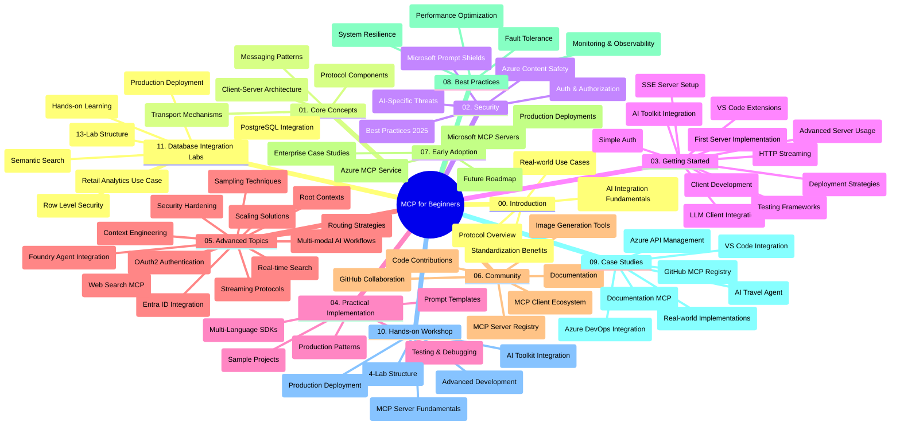

<!--
CO_OP_TRANSLATOR_METADATA:
{
  "original_hash": "af27b0acfae6caa134d9701453884df8",
  "translation_date": "2025-10-06T23:15:05+00:00",
  "source_file": "study_guide.md",
  "language_code": "sv"
}
-->
# Model Context Protocol (MCP) för Nybörjare - Studievägledning

Denna studievägledning ger en översikt över struktur och innehåll i "Model Context Protocol (MCP) för Nybörjare"-läroplanen. Använd denna guide för att navigera i repositoryn effektivt och dra nytta av de tillgängliga resurserna.

## Översikt över Repositoryn

Model Context Protocol (MCP) är ett standardiserat ramverk för interaktioner mellan AI-modeller och klientapplikationer. MCP skapades ursprungligen av Anthropic och underhålls nu av MCP-communityn via den officiella GitHub-organisationen. Denna repository erbjuder en omfattande läroplan med praktiska kodexempel i C#, Java, JavaScript, Python och TypeScript, utformad för AI-utvecklare, systemarkitekter och mjukvaruingenjörer.

## Visuell Läroplansöversikt

## Repositoryns Struktur

Repositoryn är organiserad i elva huvudsektioner, var och en fokuserad på olika aspekter av MCP:

1. **Introduktion (00-Introduction/)**
   - Översikt över Model Context Protocol
   - Varför standardisering är viktigt i AI-pipelines
   - Praktiska användningsområden och fördelar

2. **Grundläggande Koncept (01-CoreConcepts/)**
   - Klient-server-arkitektur
   - Viktiga protokollkomponenter
   - Meddelandemönster i MCP

3. **Säkerhet (02-Security/)**
   - Säkerhetshot i MCP-baserade system
   - Bästa praxis för att säkra implementationer
   - Strategier för autentisering och auktorisering
   - **Omfattande Säkerhetsdokumentation**:
     - MCP Security Best Practices 2025
     - Azure Content Safety Implementation Guide
     - MCP Security Controls and Techniques
     - MCP Best Practices Quick Reference
   - **Viktiga Säkerhetsämnen**:
     - Prompt injection och verktygsförgiftningsattacker
     - Sessionkapning och confused deputy-problem
     - Token passthrough-sårbarheter
     - Överdrivna behörigheter och åtkomstkontroll
     - Leverantörskedjesäkerhet för AI-komponenter
     - Microsoft Prompt Shields-integration

4. **Komma Igång (03-GettingStarted/)**
   - Miljöinställning och konfiguration
   - Skapa grundläggande MCP-servrar och klienter
   - Integration med befintliga applikationer
   - Innehåller sektioner för:
     - Första serverimplementationen
     - Klientutveckling
     - LLM-klientintegration
     - VS Code-integration
     - Server-Sent Events (SSE)-server
     - Avancerad serveranvändning
     - HTTP-streaming
     - AI Toolkit-integration
     - Teststrategier
     - Implementeringsriktlinjer

5. **Praktisk Implementation (04-PracticalImplementation/)**
   - Användning av SDK:er i olika programmeringsspråk
   - Debugging, testning och valideringstekniker
   - Skapa återanvändbara promptmallar och arbetsflöden
   - Exempelprojekt med implementationsfall

6. **Avancerade Ämnen (05-AdvancedTopics/)**
   - Tekniker för kontextingenjörskonst
   - Foundry-agentintegration
   - Multimodala AI-arbetsflöden
   - OAuth2-autentiseringsdemonstrationer
   - Realtidssökning
   - Realtidsstreaming
   - Implementering av root contexts
   - Routingstrategier
   - Samplingtekniker
   - Skalningsmetoder
   - Säkerhetsöverväganden
   - Entra ID-säkerhetsintegration
   - Webbsökningsintegration

7. **Communitybidrag (06-CommunityContributions/)**
   - Hur man bidrar med kod och dokumentation
   - Samarbeta via GitHub
   - Community-drivna förbättringar och feedback
   - Användning av olika MCP-klienter (Claude Desktop, Cline, VSCode)
   - Arbeta med populära MCP-servrar inklusive bildgenerering

8. **Lärdomar från Tidig Användning (07-LessonsfromEarlyAdoption/)**
   - Implementeringar och framgångshistorier från verkligheten
   - Bygga och distribuera MCP-baserade lösningar
   - Trender och framtida vägkartor
   - **Microsoft MCP Servers Guide**: Omfattande guide till 10 produktionsklara Microsoft MCP-servrar inklusive:
     - Microsoft Learn Docs MCP Server
     - Azure MCP Server (15+ specialiserade anslutningar)
     - GitHub MCP Server
     - Azure DevOps MCP Server
     - MarkItDown MCP Server
     - SQL Server MCP Server
     - Playwright MCP Server
     - Dev Box MCP Server
     - Azure AI Foundry MCP Server
     - Microsoft 365 Agents Toolkit MCP Server

9. **Bästa Praxis (08-BestPractices/)**
   - Prestandajustering och optimering
   - Designa fel-toleranta MCP-system
   - Testning och motståndsstrategier

10. **Fallstudier (09-CaseStudy/)**
    - **Sju omfattande fallstudier** som visar MCP:s mångsidighet i olika scenarier:
    - **Azure AI Travel Agents**: Multi-agent orkestrering med Azure OpenAI och AI Search
    - **Azure DevOps Integration**: Automatisering av arbetsflödesprocesser med YouTube-datauppdateringar
    - **Realtidsdokumentationshämtning**: Python-konsolklient med HTTP-streaming
    - **Interaktiv Studieplansgenerator**: Chainlit-webbapp med konversations-AI
    - **Dokumentation i Editor**: VS Code-integration med GitHub Copilot-arbetsflöden
    - **Azure API Management**: Företagsintegration med MCP-serverutveckling
    - **GitHub MCP Registry**: Ekosystemutveckling och agentisk integrationsplattform
    - Implementeringsexempel som sträcker sig över företagsintegration, utvecklarproduktivitet och ekosystemutveckling

11. **Praktisk Workshop (10-StreamliningAIWorkflowsBuildingAnMCPServerWithAIToolkit/)**
    - Omfattande praktisk workshop som kombinerar MCP med AI Toolkit
    - Bygga intelligenta applikationer som kopplar AI-modeller med verkliga verktyg
    - Praktiska moduler som täcker grunder, utveckling av anpassade servrar och produktionsimplementeringsstrategier
    - **Labstruktur**:
      - Lab 1: MCP Server Fundamentals
      - Lab 2: Avancerad MCP Server-utveckling
      - Lab 3: AI Toolkit-integration
      - Lab 4: Produktionsimplementering och skalning
    - Lab-baserat lärande med steg-för-steg-instruktioner

12. **MCP Server Databasintegrationslabbar (11-MCPServerHandsOnLabs/)**
    - **Omfattande 13-labs lärandebana** för att bygga produktionsklara MCP-servrar med PostgreSQL-integration
    - **Implementering av detaljhandelsanalys från verkligheten** med Zava Retail-användningsfall
    - **Mönster på företagsnivå** inklusive Row Level Security (RLS), semantisk sökning och multi-tenant dataåtkomst
    - **Komplett Labstruktur**:
      - **Labs 00-03: Grunder** - Introduktion, Arkitektur, Säkerhet, Miljöinställning
      - **Labs 04-06: Bygga MCP-servern** - Databasedesign, MCP-serverimplementation, Verktygsutveckling
      - **Labs 07-09: Avancerade Funktioner** - Semantisk sökning, Testning & Debugging, VS Code-integration
      - **Labs 10-12: Produktion & Bästa Praxis** - Implementering, Övervakning, Optimering
    - **Teknologier som täcks**: FastMCP-ramverk, PostgreSQL, Azure OpenAI, Azure Container Apps, Application Insights
    - **Lärandemål**: Produktionsklara MCP-servrar, databasintegrationsmönster, AI-drivna analyser, företagsäkerhet

## Ytterligare Resurser

Repositoryn innehåller stödjande resurser:

- **Bilder-mapp**: Innehåller diagram och illustrationer som används i hela läroplanen
- **Översättningar**: Flerspråkigt stöd med automatiserade översättningar av dokumentation
- **Officiella MCP-resurser**:
  - [MCP Dokumentation](https://modelcontextprotocol.io/)
  - [MCP Specifikation](https://spec.modelcontextprotocol.io/)
  - [MCP GitHub Repository](https://github.com/modelcontextprotocol)

## Hur Man Använder Denna Repository

1. **Sekventiellt Lärande**: Följ kapitlen i ordning (00 till 11) för en strukturerad lärandeupplevelse.
2. **Språkspecifik Fokus**: Om du är intresserad av ett visst programmeringsspråk, utforska katalogerna med exempel för implementationer i ditt föredragna språk.
3. **Praktisk Implementation**: Börja med sektionen "Komma Igång" för att ställa in din miljö och skapa din första MCP-server och klient.
4. **Avancerad Utforskning**: När du är bekväm med grunderna, fördjupa dig i de avancerade ämnena för att utöka din kunskap.
5. **Community-engagemang**: Gå med i MCP-communityn via GitHub-diskussioner och Discord-kanaler för att ansluta med experter och andra utvecklare.

## MCP-klienter och Verktyg

Läroplanen täcker olika MCP-klienter och verktyg:

1. **Officiella Klienter**:
   - Visual Studio Code 
   - MCP i Visual Studio Code
   - Claude Desktop
   - Claude i VSCode 
   - Claude API

2. **Community-klienter**:
   - Cline (terminalbaserad)
   - Cursor (kodredigerare)
   - ChatMCP
   - Windsurf

3. **MCP-hanteringsverktyg**:
   - MCP CLI
   - MCP Manager
   - MCP Linker
   - MCP Router

## Populära MCP-servrar

Repositoryn introducerar olika MCP-servrar, inklusive:

1. **Officiella Microsoft MCP-servrar**:
   - Microsoft Learn Docs MCP Server
   - Azure MCP Server (15+ specialiserade anslutningar)
   - GitHub MCP Server
   - Azure DevOps MCP Server
   - MarkItDown MCP Server
   - SQL Server MCP Server
   - Playwright MCP Server
   - Dev Box MCP Server
   - Azure AI Foundry MCP Server
   - Microsoft 365 Agents Toolkit MCP Server

2. **Officiella Referensservrar**:
   - Filesystem
   - Fetch
   - Memory
   - Sequential Thinking

3. **Bildgenerering**:
   - Azure OpenAI DALL-E 3
   - Stable Diffusion WebUI
   - Replicate

4. **Utvecklingsverktyg**:
   - Git MCP
   - Terminal Control
   - Code Assistant

5. **Specialiserade Servrar**:
   - Salesforce
   - Microsoft Teams
   - Jira & Confluence

## Bidra

Denna repository välkomnar bidrag från communityn. Se sektionen Communitybidrag för vägledning om hur du effektivt kan bidra till MCP-ekosystemet.

----

*Denna studievägledning uppdaterades den 6 oktober 2025 och ger en översikt över repositoryn per detta datum. Innehållet i repositoryn kan uppdateras efter detta datum.*

---

**Ansvarsfriskrivning**:  
Detta dokument har översatts med hjälp av AI-översättningstjänsten [Co-op Translator](https://github.com/Azure/co-op-translator). Även om vi strävar efter noggrannhet, bör det noteras att automatiserade översättningar kan innehålla fel eller felaktigheter. Det ursprungliga dokumentet på dess originalspråk bör betraktas som den auktoritativa källan. För kritisk information rekommenderas professionell mänsklig översättning. Vi ansvarar inte för eventuella missförstånd eller feltolkningar som uppstår vid användning av denna översättning.