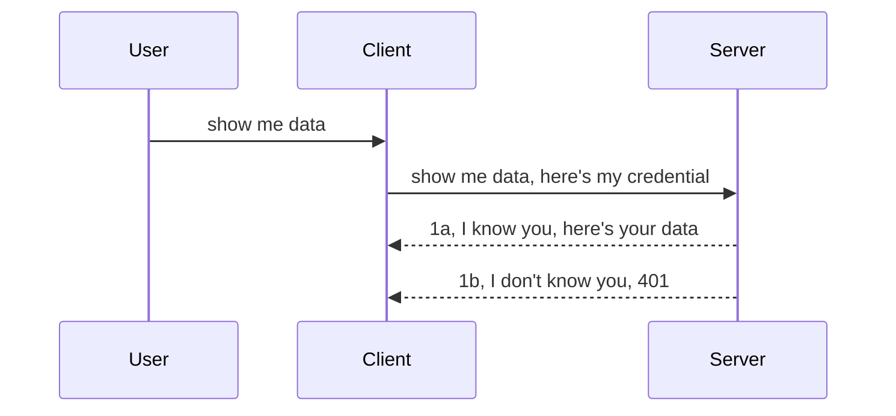

<!--
CO_OP_TRANSLATOR_METADATA:
{
  "original_hash": "5b00b8a8971a07d2d8803be4c9f138f8",
  "translation_date": "2025-10-07T00:59:24+00:00",
  "source_file": "03-GettingStarted/11-simple-auth/README.md",
  "language_code": "sw"
}
-->
# Uthibitisho Rahisi

SDK za MCP zinaunga mkono matumizi ya OAuth 2.1, ambayo kwa kweli ni mchakato wa kina unaohusisha dhana kama seva ya uthibitisho, seva ya rasilimali, kutuma hati za kuingia, kupata msimbo, kubadilisha msimbo kwa tokeni ya kubeba hadi hatimaye uweze kupata data ya rasilimali yako. Ikiwa hujazoea OAuth, ambayo ni jambo zuri kutekeleza, ni wazo zuri kuanza na kiwango cha msingi cha uthibitisho na kujenga usalama bora na bora zaidi. Ndiyo sababu sura hii ipo, ili kukusaidia kuelekea uthibitisho wa hali ya juu zaidi.

## Uthibitisho, tunamaanisha nini?

Uthibitisho ni kifupi cha uthibitishaji na idhini. Wazo ni kwamba tunahitaji kufanya mambo mawili:

- **Uthibitishaji**, ambao ni mchakato wa kuamua ikiwa tunamruhusu mtu kuingia nyumbani kwetu, kwamba ana haki ya kuwa "hapa," yaani, anaweza kufikia seva yetu ya rasilimali ambapo vipengele vya seva ya MCP vinaishi.
- **Idhini**, ni mchakato wa kuamua ikiwa mtumiaji anapaswa kuwa na ufikiaji wa rasilimali maalum wanazoomba, kwa mfano, maagizo haya au bidhaa hizi, au ikiwa wanaruhusiwa kusoma maudhui lakini si kufuta, kama mfano mwingine.

## Hati za kuingia: jinsi tunavyoiambia mfumo sisi ni nani

Kwa kawaida, watengenezaji wa wavuti huanza kufikiria kwa kutoa hati ya kuingia kwa seva, kwa kawaida siri inayosema ikiwa wanaruhusiwa kuwa hapa "Uthibitishaji." Hati hii kwa kawaida ni toleo lililokodolewa kwa base64 la jina la mtumiaji na nenosiri au funguo ya API inayotambulisha mtumiaji maalum.

Hii inahusisha kuituma kupitia kichwa kinachoitwa "Authorization" kama ifuatavyo:

```json
{ "Authorization": "secret123" }
```

Hii kwa kawaida hujulikana kama uthibitisho wa msingi. Jinsi mtiririko wa jumla unavyofanya kazi ni kama ifuatavyo:



Sasa kwa kuwa tunaelewa jinsi inavyofanya kazi kutoka mtazamo wa mtiririko, tunawezaje kuitekeleza? Naam, seva nyingi za wavuti zina dhana inayoitwa middleware, kipande cha msimbo kinachotumika kama sehemu ya ombi ambalo linaweza kuthibitisha hati za kuingia, na ikiwa hati za kuingia ni sahihi linaweza kuruhusu ombi kupita. Ikiwa ombi halina hati za kuingia sahihi basi unapata hitilafu ya uthibitisho. Hebu tuone jinsi hii inaweza kutekelezwa:

**Python**

```python
class AuthMiddleware(BaseHTTPMiddleware):
    async def dispatch(self, request, call_next):

        has_header = request.headers.get("Authorization")
        if not has_header:
            print("-> Missing Authorization header!")
            return Response(status_code=401, content="Unauthorized")

        if not valid_token(has_header):
            print("-> Invalid token!")
            return Response(status_code=403, content="Forbidden")

        print("Valid token, proceeding...")
       
        response = await call_next(request)
        # add any customer headers or change in the response in some way
        return response


starlette_app.add_middleware(CustomHeaderMiddleware)
```

Hapa tuna:

- Kuunda middleware inayoitwa `AuthMiddleware` ambapo njia yake ya `dispatch` inaitwa na seva ya wavuti.
- Kuongeza middleware kwenye seva ya wavuti:

    ```python
    starlette_app.add_middleware(AuthMiddleware)
    ```

- Kuandika mantiki ya uthibitishaji inayochunguza ikiwa kichwa cha Authorization kipo na ikiwa siri inayotumwa ni sahihi:

    ```python
    has_header = request.headers.get("Authorization")
    if not has_header:
        print("-> Missing Authorization header!")
        return Response(status_code=401, content="Unauthorized")

    if not valid_token(has_header):
        print("-> Invalid token!")
        return Response(status_code=403, content="Forbidden")
    ```

    ikiwa siri ipo na ni sahihi basi tunaruhusu ombi kupita kwa kuita `call_next` na kurudisha majibu.

    ```python
    response = await call_next(request)
    # add any customer headers or change in the response in some way
    return response
    ```

Jinsi inavyofanya kazi ni kwamba ikiwa ombi la wavuti linatolewa kuelekea seva, middleware itaitwa na kwa utekelezaji wake itaruhusu ombi kupita au kuishia kurudisha hitilafu inayonyesha mteja haruhusiwi kuendelea.

**TypeScript**

Hapa tunaunda middleware kwa kutumia mfumo maarufu wa Express na kuingilia ombi kabla halijafika kwenye Seva ya MCP. Hapa kuna msimbo wa kufanya hivyo:

```typescript
function isValid(secret) {
    return secret === "secret123";
}

app.use((req, res, next) => {
    // 1. Authorization header present?  
    if(!req.headers["Authorization"]) {
        res.status(401).send('Unauthorized');
    }
    
    let token = req.headers["Authorization"];

    // 2. Check validity.
    if(!isValid(token)) {
        res.status(403).send('Forbidden');
    }

   
    console.log('Middleware executed');
    // 3. Passes request to the next step in the request pipeline.
    next();
});
```

Katika msimbo huu tunafanya:

1. Kuangalia ikiwa kichwa cha Authorization kipo, ikiwa hakipo, tunatuma hitilafu ya 401.
2. Kuhakikisha hati/tokeni ni sahihi, ikiwa si sahihi, tunatuma hitilafu ya 403.
3. Hatimaye tunapitisha ombi kwenye mtiririko wa ombi na kurudisha rasilimali iliyoulizwa.

## Zoezi: Tekeleza uthibitishaji

Hebu tuchukue maarifa yetu na kujaribu kuyatekeleza. Hapa kuna mpango:

Seva

- Unda seva ya wavuti na mfano wa MCP.
- Tekeleza middleware kwa seva.

Mteja 

- Tuma ombi la wavuti, na hati ya kuingia, kupitia kichwa.

### -1- Unda seva ya wavuti na mfano wa MCP

Katika hatua yetu ya kwanza, tunahitaji kuunda mfano wa seva ya wavuti na Seva ya MCP.

**Python**

Hapa tunaunda mfano wa seva ya MCP, kuunda programu ya wavuti ya starlette na kuikaribisha kwa uvicorn.

```python
# creating MCP Server

app = FastMCP(
    name="MCP Resource Server",
    instructions="Resource Server that validates tokens via Authorization Server introspection",
    host=settings["host"],
    port=settings["port"],
    debug=True
)

# creating starlette web app
starlette_app = app.streamable_http_app()

# serving app via uvicorn
async def run(starlette_app):
    import uvicorn
    config = uvicorn.Config(
            starlette_app,
            host=app.settings.host,
            port=app.settings.port,
            log_level=app.settings.log_level.lower(),
        )
    server = uvicorn.Server(config)
    await server.serve()

run(starlette_app)
```

Katika msimbo huu tunafanya:

- Kuunda Seva ya MCP.
- Kuunda programu ya wavuti ya starlette kutoka kwa Seva ya MCP, `app.streamable_http_app()`.
- Kukaribisha na kuhudumia programu ya wavuti kwa kutumia uvicorn `server.serve()`.

**TypeScript**

Hapa tunaunda mfano wa Seva ya MCP.

```typescript
const server = new McpServer({
      name: "example-server",
      version: "1.0.0"
    });

    // ... set up server resources, tools, and prompts ...
```

Uundaji huu wa Seva ya MCP utahitaji kufanyika ndani ya ufafanuzi wa njia ya POST /mcp, kwa hivyo hebu tuchukue msimbo hapo juu na kuuhamisha kama ifuatavyo:

```typescript
import express from "express";
import { randomUUID } from "node:crypto";
import { McpServer } from "@modelcontextprotocol/sdk/server/mcp.js";
import { StreamableHTTPServerTransport } from "@modelcontextprotocol/sdk/server/streamableHttp.js";
import { isInitializeRequest } from "@modelcontextprotocol/sdk/types.js"

const app = express();
app.use(express.json());

// Map to store transports by session ID
const transports: { [sessionId: string]: StreamableHTTPServerTransport } = {};

// Handle POST requests for client-to-server communication
app.post('/mcp', async (req, res) => {
  // Check for existing session ID
  const sessionId = req.headers['mcp-session-id'] as string | undefined;
  let transport: StreamableHTTPServerTransport;

  if (sessionId && transports[sessionId]) {
    // Reuse existing transport
    transport = transports[sessionId];
  } else if (!sessionId && isInitializeRequest(req.body)) {
    // New initialization request
    transport = new StreamableHTTPServerTransport({
      sessionIdGenerator: () => randomUUID(),
      onsessioninitialized: (sessionId) => {
        // Store the transport by session ID
        transports[sessionId] = transport;
      },
      // DNS rebinding protection is disabled by default for backwards compatibility. If you are running this server
      // locally, make sure to set:
      // enableDnsRebindingProtection: true,
      // allowedHosts: ['127.0.0.1'],
    });

    // Clean up transport when closed
    transport.onclose = () => {
      if (transport.sessionId) {
        delete transports[transport.sessionId];
      }
    };
    const server = new McpServer({
      name: "example-server",
      version: "1.0.0"
    });

    // ... set up server resources, tools, and prompts ...

    // Connect to the MCP server
    await server.connect(transport);
  } else {
    // Invalid request
    res.status(400).json({
      jsonrpc: '2.0',
      error: {
        code: -32000,
        message: 'Bad Request: No valid session ID provided',
      },
      id: null,
    });
    return;
  }

  // Handle the request
  await transport.handleRequest(req, res, req.body);
});

// Reusable handler for GET and DELETE requests
const handleSessionRequest = async (req: express.Request, res: express.Response) => {
  const sessionId = req.headers['mcp-session-id'] as string | undefined;
  if (!sessionId || !transports[sessionId]) {
    res.status(400).send('Invalid or missing session ID');
    return;
  }
  
  const transport = transports[sessionId];
  await transport.handleRequest(req, res);
};

// Handle GET requests for server-to-client notifications via SSE
app.get('/mcp', handleSessionRequest);

// Handle DELETE requests for session termination
app.delete('/mcp', handleSessionRequest);

app.listen(3000);
```

Sasa unaona jinsi uundaji wa Seva ya MCP ulivyohamishwa ndani ya `app.post("/mcp")`.

Hebu tuendelee na hatua inayofuata ya kuunda middleware ili tuweze kuthibitisha hati ya kuingia inayokuja.

### -2- Tekeleza middleware kwa seva

Hebu tuingie kwenye sehemu ya middleware. Hapa tutaunda middleware inayotafuta hati ya kuingia katika kichwa cha `Authorization` na kuithibitisha. Ikiwa inakubalika basi ombi litaendelea kufanya kile kinachohitajika (mfano, orodhesha zana, soma rasilimali au chochote mteja wa MCP alikuwa akiuliza).

**Python**

Ili kuunda middleware, tunahitaji kuunda darasa linalorithi kutoka `BaseHTTPMiddleware`. Kuna vipande viwili vya kuvutia:

- Ombi `request`, ambalo tunasoma taarifa ya kichwa kutoka.
- `call_next` callback tunahitaji kuita ikiwa mteja ameleta hati ya kuingia tunayoikubali.

Kwanza, tunahitaji kushughulikia kesi ikiwa kichwa cha `Authorization` hakipo:

```python
has_header = request.headers.get("Authorization")

# no header present, fail with 401, otherwise move on.
if not has_header:
    print("-> Missing Authorization header!")
    return Response(status_code=401, content="Unauthorized")
```

Hapa tunatuma ujumbe wa 401 unaosema mteja ameshindwa uthibitishaji.

Kisha, ikiwa hati ya kuingia imetumwa, tunahitaji kuangalia uhalali wake kama ifuatavyo:

```python
 if not valid_token(has_header):
    print("-> Invalid token!")
    return Response(status_code=403, content="Forbidden")
```

Angalia jinsi tunavyotuma ujumbe wa 403 unaosema marufuku hapo juu. Hebu tuone middleware kamili hapa chini ikitekeleza kila kitu tulichotaja hapo juu:

```python
class AuthMiddleware(BaseHTTPMiddleware):
    async def dispatch(self, request, call_next):

        has_header = request.headers.get("Authorization")
        if not has_header:
            print("-> Missing Authorization header!")
            return Response(status_code=401, content="Unauthorized")

        if not valid_token(has_header):
            print("-> Invalid token!")
            return Response(status_code=403, content="Forbidden")

        print("Valid token, proceeding...")
        print(f"-> Received {request.method} {request.url}")
        response = await call_next(request)
        response.headers['Custom'] = 'Example'
        return response

```

Nzuri, lakini vipi kuhusu kazi ya `valid_token`? Hapa ipo hapa chini:

```python
# DON'T use for production - improve it !!
def valid_token(token: str) -> bool:
    # remove the "Bearer " prefix
    if token.startswith("Bearer "):
        token = token[7:]
        return token == "secret-token"
    return False
```

Hii inapaswa kuboreshwa wazi.

MUHIMU: Haupaswi KAMWE kuwa na siri kama hizi kwenye msimbo. Unapaswa kwa kawaida kupata thamani ya kulinganisha kutoka kwa chanzo cha data au kutoka kwa IDP (mtoa huduma wa utambulisho) au bora zaidi, ruhusu IDP kufanya uthibitishaji.

**TypeScript**

Ili kutekeleza hili na Express, tunahitaji kuita njia ya `use` inayochukua kazi za middleware.

Tunahitaji:

- Kuingiliana na variable ya ombi ili kuangalia hati ya kuingia iliyopitishwa katika mali ya `Authorization`.
- Thibitisha hati ya kuingia, na ikiwa ni sahihi ruhusu ombi kuendelea na ombi la MCP la mteja kufanya kile linachopaswa (mfano, orodhesha zana, soma rasilimali au chochote kinachohusiana na MCP).

Hapa, tunachunguza ikiwa kichwa cha `Authorization` kipo na ikiwa hakipo, tunazuia ombi kupita:

```typescript
if(!req.headers["authorization"]) {
    res.status(401).send('Unauthorized');
    return;
}
```

Ikiwa kichwa hakikutumwa, unapata hitilafu ya 401.

Kisha, tunachunguza ikiwa hati ya kuingia ni sahihi, ikiwa si sahihi tunazuia ombi tena lakini kwa ujumbe tofauti kidogo:

```typescript
if(!isValid(token)) {
    res.status(403).send('Forbidden');
    return;
} 
```

Angalia jinsi unavyopata hitilafu ya 403 sasa.

Hapa kuna msimbo kamili:

```typescript
app.use((req, res, next) => {
    console.log('Request received:', req.method, req.url, req.headers);
    console.log('Headers:', req.headers["authorization"]);
    if(!req.headers["authorization"]) {
        res.status(401).send('Unauthorized');
        return;
    }
    
    let token = req.headers["authorization"];

    if(!isValid(token)) {
        res.status(403).send('Forbidden');
        return;
    }  

    console.log('Middleware executed');
    next();
});
```

Tumetayarisha seva ya wavuti kukubali middleware ya kuangalia hati ya kuingia ambayo mteja anatumai kututumia. Vipi kuhusu mteja mwenyewe?

### -3- Tuma ombi la wavuti na hati ya kuingia kupitia kichwa

Tunahitaji kuhakikisha mteja anapitisha hati ya kuingia kupitia kichwa. Kwa kuwa tutatumia mteja wa MCP kufanya hivyo, tunahitaji kujua jinsi hilo linavyofanyika.

**Python**

Kwa mteja, tunahitaji kupitisha kichwa na hati yetu ya kuingia kama ifuatavyo:

```python
# DON'T hardcode the value, have it at minimum in an environment variable or a more secure storage
token = "secret-token"

async with streamablehttp_client(
        url = f"http://localhost:{port}/mcp",
        headers = {"Authorization": f"Bearer {token}"}
    ) as (
        read_stream,
        write_stream,
        session_callback,
    ):
        async with ClientSession(
            read_stream,
            write_stream
        ) as session:
            await session.initialize()
      
            # TODO, what you want done in the client, e.g list tools, call tools etc.
```

Angalia jinsi tunavyoweka mali ya `headers` kama ifuatavyo `headers = {"Authorization": f"Bearer {token}"}`.

**TypeScript**

Tunaweza kutatua hili kwa hatua mbili:

1. Kujaza object ya usanidi na hati yetu ya kuingia.
2. Kupitisha object ya usanidi kwa usafirishaji.

```typescript

// DON'T hardcode the value like shown here. At minimum have it as a env variable and use something like dotenv (in dev mode).
let token = "secret123"

// define a client transport option object
let options: StreamableHTTPClientTransportOptions = {
  sessionId: sessionId,
  requestInit: {
    headers: {
      "Authorization": "secret123"
    }
  }
};

// pass the options object to the transport
async function main() {
   const transport = new StreamableHTTPClientTransport(
      new URL(serverUrl),
      options
   );
```

Hapa unaona jinsi tulivyohitaji kuunda object ya `options` na kuweka vichwa vyetu chini ya mali ya `requestInit`.

MUHIMU: Tunawezaje kuboresha kutoka hapa? Naam, utekelezaji wa sasa una masuala kadhaa. Kwanza kabisa, kupitisha hati ya kuingia kama hii ni hatari sana isipokuwa angalau una HTTPS. Hata hivyo, hati ya kuingia inaweza kuibiwa kwa hivyo unahitaji mfumo ambapo unaweza kwa urahisi kubatilisha tokeni na kuongeza ukaguzi wa ziada kama wapi duniani inatoka, je, ombi linatokea mara nyingi sana (tabia ya bot), kwa kifupi, kuna masuala mengi ya kuzingatia.

Inapaswa kusemwa, hata hivyo, kwa API rahisi sana ambapo hutaki mtu yeyote kupiga API yako bila kuthibitishwa, kile tulicho nacho hapa ni mwanzo mzuri.

Kwa kusema hivyo, hebu jaribu kuimarisha usalama kidogo kwa kutumia muundo wa kawaida kama JSON Web Token, inayojulikana pia kama JWT au tokeni za "JOT".

## JSON Web Tokens, JWT

Kwa hivyo, tunajaribu kuboresha mambo kutoka kwa kutuma hati rahisi sana. Je, ni maboresho ya haraka tunayopata kwa kutumia JWT?

- **Maboresho ya usalama**. Katika uthibitisho wa msingi, unatumia jina la mtumiaji na nenosiri kama tokeni iliyokodolewa kwa base64 (au unatumia funguo ya API) mara kwa mara, jambo ambalo linaongeza hatari. Kwa JWT, unatumia jina la mtumiaji na nenosiri na unapata tokeni badala yake, na pia ni ya muda mfupi ikimaanisha itakwisha muda wake. JWT inakuwezesha kutumia udhibiti wa ufikiaji wa kina kwa kutumia majukumu, mawanda, na ruhusa.
- **Kutokuwa na hali na uwezo wa kupanuka**. JWT ni huru, hubeba taarifa zote za mtumiaji na huondoa hitaji la kuhifadhi hifadhi ya kikao upande wa seva. Tokeni pia inaweza kuthibitishwa kwa ndani.
- **Uingiliano na muungano**. JWT ni msingi wa Open ID Connect na hutumiwa na watoa huduma wa utambulisho wanaojulikana kama Entra ID, Google Identity, na Auth0. Pia hufanya iwezekane kutumia kuingia mara moja na mengi zaidi, na kuifanya iwe ya daraja la biashara.
- **Modularity na kubadilika**. JWT inaweza pia kutumika na API Gateways kama Azure API Management, NGINX, na zaidi. Pia inasaidia hali za uthibitishaji wa mtumiaji na mawasiliano ya seva kwa seva ikiwa ni pamoja na hali za kuiga na kuwakilisha.
- **Utendaji na kuhifadhi**. JWT inaweza kuhifadhiwa baada ya kufafanuliwa, jambo ambalo hupunguza hitaji la kuchanganua. Hii husaidia hasa kwa programu zenye trafiki kubwa kwani inaboresha mtiririko na kupunguza mzigo kwenye miundombinu yako iliyochaguliwa.
- **Vipengele vya hali ya juu**. Pia inasaidia introspection (kuangalia uhalali kwenye seva) na revocation (kufanya tokeni kuwa batili).

Kwa faida hizi zote, hebu tuone jinsi tunavyoweza kuchukua utekelezaji wetu hadi kiwango kingine.

## Kubadilisha uthibitisho wa msingi kuwa JWT

Kwa hivyo, mabadiliko tunayohitaji kwa kiwango cha juu ni:

- **Jifunze kuunda tokeni ya JWT** na kuifanya iwe tayari kutumwa kutoka kwa mteja hadi seva.
- **Thibitisha tokeni ya JWT**, na ikiwa ni sahihi, ruhusu mteja kupata rasilimali zetu.
- **Hifadhi salama ya tokeni**. Jinsi tunavyohifadhi tokeni hii.
- **Linda njia**. Tunahitaji kulinda njia, katika kesi yetu, tunahitaji kulinda njia na vipengele maalum vya MCP.
- **Ongeza tokeni za upya**. Hakikisha tunaunda tokeni ambazo ni za muda mfupi lakini tokeni za upya ambazo ni za muda mrefu ambazo zinaweza kutumika kupata tokeni mpya ikiwa zitakwisha muda wake. Pia hakikisha kuna njia ya upya na mkakati wa mzunguko.

### -1- Unda tokeni ya JWT

Kwanza kabisa, tokeni ya JWT ina sehemu zifuatazo:

- **Kichwa**, algorithm inayotumika na aina ya tokeni.
- **Payload**, madai, kama sub (mtumiaji au chombo ambacho tokeni inawakilisha. Katika hali ya uthibitishaji hii kwa kawaida ni id ya mtumiaji), exp (wakati itakwisha muda wake), role (jukumu).
- **Saini**, imesainiwa na siri au funguo ya kibinafsi.

Kwa hili, tutahitaji kuunda kichwa, payload, na tokeni iliyokodolewa.

**Python**

```python

import jwt
import jwt
from jwt.exceptions import ExpiredSignatureError, InvalidTokenError
import datetime

# Secret key used to sign the JWT
secret_key = 'your-secret-key'

header = {
    "alg": "HS256",
    "typ": "JWT"
}

# the user info andits claims and expiry time
payload = {
    "sub": "1234567890",               # Subject (user ID)
    "name": "User Userson",                # Custom claim
    "admin": True,                     # Custom claim
    "iat": datetime.datetime.utcnow(),# Issued at
    "exp": datetime.datetime.utcnow() + datetime.timedelta(hours=1)  # Expiry
}

# encode it
encoded_jwt = jwt.encode(payload, secret_key, algorithm="HS256", headers=header)
```

Katika msimbo hapo juu tumefanya:

- Kufafanua kichwa kwa kutumia HS256 kama algorithm na aina kuwa JWT.
- Kuunda payload inayojumuisha mada au id ya mtumiaji, jina la mtumiaji, jukumu, wakati ilipotolewa, na wakati imewekwa kumalizika muda wake, hivyo kutekeleza kipengele cha muda mfupi tulichotaja awali.

**TypeScript**

Hapa tutahitaji utegemezi fulani ambao utatusaidia kuunda tokeni ya JWT.

Utegemezi

```sh

npm install jsonwebtoken
npm install --save-dev @types/jsonwebtoken
```

Sasa kwa kuwa tuna hilo mahali, hebu tuunde kichwa, payload, na kupitia hilo tuunde tokeni iliyokodolewa.

```typescript
import jwt from 'jsonwebtoken';

const secretKey = 'your-secret-key'; // Use env vars in production

// Define the payload
const payload = {
  sub: '1234567890',
  name: 'User usersson',
  admin: true,
  iat: Math.floor(Date.now() / 1000), // Issued at
  exp: Math.floor(Date.now() / 1000) + 60 * 60 // Expires in 1 hour
};

// Define the header (optional, jsonwebtoken sets defaults)
const header = {
  alg: 'HS256',
  typ: 'JWT'
};

// Create the token
const token = jwt.sign(payload, secretKey, {
  algorithm: 'HS256',
  header: header
});

console.log('JWT:', token);
```

Tokeni hii ni:

Imesainiwa kwa kutumia HS256  
Inatumika kwa saa 1  
Inajumuisha madai kama sub, name, admin, iat, na exp.

### -2- Thibitisha tokeni

Tutahitaji pia kuthibitisha tokeni, hili ni jambo tunalopaswa kufanya kwenye seva ili kuhakikisha kile mteja anatuma kwetu ni halali. Kuna ukaguzi mwingi tunapaswa kufanya hapa kutoka kuthibitisha muundo wake hadi uhalali wake. Unahimizwa pia kuongeza ukaguzi mwingine ili kuona ikiwa mtumiaji yupo kwenye mfumo wako na zaidi.

Ili kuthibitisha tokeni, tunahitaji kuifafanua ili tuweze kuisoma na kisha kuanza kuangalia uhalali wake:

**Python**

```python

# Decode and verify the JWT
try:
    decoded = jwt.decode(token, secret_key, algorithms=["HS256"])
    print("✅ Token is valid.")
    print("Decoded claims:")
    for key, value in decoded.items():
        print(f"  {key}: {value}")
except ExpiredSignatureError:
    print("❌ Token has expired.")
except InvalidTokenError as e:
    print(f"❌ Invalid token: {e}")

```

Katika msimbo huu, tunaita `jwt.decode` kwa kutumia tokeni, funguo ya siri, na algorithm iliyochaguliwa kama pembejeo. Angalia jinsi tunavyotumia muundo wa jaribu-kamata kwani uthibitishaji ulioshindwa husababisha hitilafu kutolewa.

**TypeScript**

Hapa tunahitaji kuita `jwt.verify` ili kupata toleo lililofafanuliwa la tokeni ambalo tunaweza kuchanganua zaidi. Ikiwa simu hii itashindwa, hiyo inamaanisha muundo wa tokeni si sahihi au haifai tena.

```typescript

try {
  const decoded = jwt.verify(token, secretKey);
  console.log('Decoded Payload:', decoded);
} catch (err) {
  console.error('Token verification failed:', err);
}
```

KUMBUKA: kama ilivyotajwa hapo awali, tunapaswa kufanya ukaguzi wa ziada ili kuhakikisha tokeni hii inaelekeza kwa mtumiaji katika mfumo wetu na kuhakikisha mtumiaji ana haki anazodai kuwa nazo.
Sasa, hebu tuangalie udhibiti wa ufikiaji kulingana na majukumu, unaojulikana pia kama RBAC.

## Kuongeza udhibiti wa ufikiaji kulingana na majukumu

Wazo ni kwamba tunataka kuonyesha kuwa majukumu tofauti yana ruhusa tofauti. Kwa mfano, tunadhani msimamizi anaweza kufanya kila kitu, mtumiaji wa kawaida anaweza kusoma/kuandika, na mgeni anaweza kusoma tu. Kwa hivyo, hapa kuna viwango vya ruhusa vinavyowezekana:

- Admin.Write 
- User.Read
- Guest.Read

Hebu tuangalie jinsi tunavyoweza kutekeleza udhibiti kama huo kwa kutumia middleware. Middleware inaweza kuongezwa kwa kila njia au kwa njia zote.

**Python**

```python
from starlette.middleware.base import BaseHTTPMiddleware
from starlette.responses import JSONResponse
import jwt

# DON'T have the secret in the code like, this is for demonstration purposes only. Read it from a safe place.
SECRET_KEY = "your-secret-key" # put this in env variable
REQUIRED_PERMISSION = "User.Read"

class JWTPermissionMiddleware(BaseHTTPMiddleware):
    async def dispatch(self, request, call_next):
        auth_header = request.headers.get("Authorization")
        if not auth_header or not auth_header.startswith("Bearer "):
            return JSONResponse({"error": "Missing or invalid Authorization header"}, status_code=401)

        token = auth_header.split(" ")[1]
        try:
            decoded = jwt.decode(token, SECRET_KEY, algorithms=["HS256"])
        except jwt.ExpiredSignatureError:
            return JSONResponse({"error": "Token expired"}, status_code=401)
        except jwt.InvalidTokenError:
            return JSONResponse({"error": "Invalid token"}, status_code=401)

        permissions = decoded.get("permissions", [])
        if REQUIRED_PERMISSION not in permissions:
            return JSONResponse({"error": "Permission denied"}, status_code=403)

        request.state.user = decoded
        return await call_next(request)


```

Kuna njia kadhaa za kuongeza middleware kama ilivyo hapa chini:

```python

# Alt 1: add middleware while constructing starlette app
middleware = [
    Middleware(JWTPermissionMiddleware)
]

app = Starlette(routes=routes, middleware=middleware)

# Alt 2: add middleware after starlette app is a already constructed
starlette_app.add_middleware(JWTPermissionMiddleware)

# Alt 3: add middleware per route
routes = [
    Route(
        "/mcp",
        endpoint=..., # handler
        middleware=[Middleware(JWTPermissionMiddleware)]
    )
]
```

**TypeScript**

Tunaweza kutumia `app.use` na middleware ambayo itakimbia kwa maombi yote.

```typescript
app.use((req, res, next) => {
    console.log('Request received:', req.method, req.url, req.headers);
    console.log('Headers:', req.headers["authorization"]);

    // 1. Check if authorization header has been sent

    if(!req.headers["authorization"]) {
        res.status(401).send('Unauthorized');
        return;
    }
    
    let token = req.headers["authorization"];

    // 2. Check if token is valid
    if(!isValid(token)) {
        res.status(403).send('Forbidden');
        return;
    }  

    // 3. Check if token user exist in our system
    if(!isExistingUser(token)) {
        res.status(403).send('Forbidden');
        console.log("User does not exist");
        return;
    }
    console.log("User exists");

    // 4. Verify the token has the right permissions
    if(!hasScopes(token, ["User.Read"])){
        res.status(403).send('Forbidden - insufficient scopes');
    }

    console.log("User has required scopes");

    console.log('Middleware executed');
    next();
});

```

Kuna mambo kadhaa ambayo tunaweza kuruhusu middleware yetu ifanye na ambayo middleware yetu INAPASWA kufanya, yaani:

1. Angalia kama kichwa cha idhini kipo.
2. Angalia kama tokeni ni halali, tunaita `isValid` ambayo ni mbinu tuliyoandika ili kuangalia uadilifu na uhalali wa tokeni ya JWT.
3. Thibitisha mtumiaji yupo kwenye mfumo wetu, tunapaswa kuangalia hili.

   ```typescript
    // users in DB
   const users = [
     "user1",
     "User usersson",
   ]

   function isExistingUser(token) {
     let decodedToken = verifyToken(token);

     // TODO, check if user exists in DB
     return users.includes(decodedToken?.name || "");
   }
   ```

   Hapo juu, tumeunda orodha rahisi ya `users`, ambayo inapaswa kuwa kwenye hifadhidata bila shaka.

4. Zaidi ya hayo, tunapaswa pia kuangalia kama tokeni ina ruhusa sahihi.

   ```typescript
   if(!hasScopes(token, ["User.Read"])){
        res.status(403).send('Forbidden - insufficient scopes');
   }
   ```

   Katika msimbo hapo juu kutoka kwa middleware, tunaangalia kama tokeni ina ruhusa ya User.Read, ikiwa sivyo tunatuma kosa la 403. Hapo chini kuna mbinu ya msaidizi `hasScopes`.

   ```typescript
   function hasScopes(scope: string, requiredScopes: string[]) {
     let decodedToken = verifyToken(scope);
    return requiredScopes.every(scope => decodedToken?.scopes.includes(scope));
  }
   ```

Have a think which additional checks you should be doing, but these are the absolute minimum of checks you should be doing.

Using Express as a web framework is a common choice. There are helpers library when you use JWT so you can write less code.

- `express-jwt`, helper library that provides a middleware that helps decode your token.
- `express-jwt-permissions`, this provides a middleware `guard` that helps check if a certain permission is on the token.

Here's what these libraries can look like when used:

```typescript
const express = require('express');
const jwt = require('express-jwt');
const guard = require('express-jwt-permissions')();

const app = express();
const secretKey = 'your-secret-key'; // put this in env variable

// Decode JWT and attach to req.user
app.use(jwt({ secret: secretKey, algorithms: ['HS256'] }));

// Check for User.Read permission
app.use(guard.check('User.Read'));

// multiple permissions
// app.use(guard.check(['User.Read', 'Admin.Access']));

app.get('/protected', (req, res) => {
  res.json({ message: `Welcome ${req.user.name}` });
});

// Error handler
app.use((err, req, res, next) => {
  if (err.code === 'permission_denied') {
    return res.status(403).send('Forbidden');
  }
  next(err);
});

```

Sasa umeona jinsi middleware inaweza kutumika kwa uthibitishaji na idhini, vipi kuhusu MCP basi, je, inabadilisha jinsi tunavyofanya uthibitishaji? Hebu tujue katika sehemu inayofuata.

### -3- Ongeza RBAC kwa MCP

Umeona hadi sasa jinsi unavyoweza kuongeza RBAC kupitia middleware, hata hivyo, kwa MCP hakuna njia rahisi ya kuongeza RBAC kwa kila kipengele cha MCP, kwa hivyo tunafanya nini? Naam, tunapaswa tu kuongeza msimbo kama huu unaoangalia ikiwa mteja ana haki za kuita zana maalum:

Una chaguo kadhaa za jinsi ya kutekeleza RBAC kwa kila kipengele, hapa kuna baadhi:

- Ongeza ukaguzi kwa kila zana, rasilimali, au maelezo unayohitaji kuangalia kiwango cha ruhusa.

   **Python**

   ```python
   @tool()
   def delete_product(id: int):
      try:
          check_permissions(role="Admin.Write", request)
      catch:
        pass # client failed authorization, raise authorization error
   ```

   **TypeScript**

   ```typescript
   server.registerTool(
    "delete-product",
    {
      title: Delete a product",
      description: "Deletes a product",
      inputSchema: { id: z.number() }
    },
    async ({ id }) => {
      
      try {
        checkPermissions("Admin.Write", request);
        // todo, send id to productService and remote entry
      } catch(Exception e) {
        console.log("Authorization error, you're not allowed");  
      }

      return {
        content: [{ type: "text", text: `Deletected product with id ${id}` }]
      };
    }
   );
   ```


- Tumia mbinu ya seva ya hali ya juu na watunzaji wa maombi ili kupunguza idadi ya maeneo unayohitaji kufanya ukaguzi.

   **Python**

   ```python
   
   tool_permission = {
      "create_product": ["User.Write", "Admin.Write"],
      "delete_product": ["Admin.Write"]
   }

   def has_permission(user_permissions, required_permissions) -> bool:
      # user_permissions: list of permissions the user has
      # required_permissions: list of permissions required for the tool
      return any(perm in user_permissions for perm in required_permissions)

   @server.call_tool()
   async def handle_call_tool(
     name: str, arguments: dict[str, str] | None
   ) -> list[types.TextContent]:
    # Assume request.user.permissions is a list of permissions for the user
     user_permissions = request.user.permissions
     required_permissions = tool_permission.get(name, [])
     if not has_permission(user_permissions, required_permissions):
        # Raise error "You don't have permission to call tool {name}"
        raise Exception(f"You don't have permission to call tool {name}")
     # carry on and call tool
     # ...
   ```   
   

   **TypeScript**

   ```typescript
   function hasPermission(userPermissions: string[], requiredPermissions: string[]): boolean {
       if (!Array.isArray(userPermissions) || !Array.isArray(requiredPermissions)) return false;
       // Return true if user has at least one required permission
       
       return requiredPermissions.some(perm => userPermissions.includes(perm));
   }
  
   server.setRequestHandler(CallToolRequestSchema, async (request) => {
      const { params: { name } } = request;
  
      let permissions = request.user.permissions;
  
      if (!hasPermission(permissions, toolPermissions[name])) {
         return new Error(`You don't have permission to call ${name}`);
      }
  
      // carry on..
   });
   ```

   Kumbuka, utahitaji kuhakikisha middleware yako inapeleka tokeni iliyotafsiriwa kwenye mali ya mtumiaji ya ombi ili msimbo hapo juu uwe rahisi.

### Muhtasari

Sasa kwamba tumeelezea jinsi ya kuongeza msaada wa RBAC kwa ujumla na kwa MCP hasa, ni wakati wa kujaribu kutekeleza usalama peke yako ili kuhakikisha umeelewa dhana zilizowasilishwa kwako.

## Kazi ya 1: Jenga seva ya MCP na mteja wa MCP kwa kutumia uthibitishaji wa msingi

Hapa utatumia kile ulichojifunza kuhusu kutuma hati kupitia vichwa.

## Suluhisho 1

[Solution 1](./code/basic/README.md)

## Kazi ya 2: Boresha suluhisho kutoka Kazi ya 1 ili kutumia JWT

Chukua suluhisho la kwanza lakini wakati huu, hebu tuliboreshe.

Badala ya kutumia Basic Auth, tumia JWT.

## Suluhisho 2

[Solution 2](./solution/jwt-solution/README.md)

## Changamoto

Ongeza RBAC kwa kila zana kama tulivyoelezea katika sehemu "Ongeza RBAC kwa MCP".

## Muhtasari

Kwa matumaini umejifunza mengi katika sura hii, kutoka kutokuwa na usalama kabisa, hadi usalama wa msingi, hadi JWT na jinsi inavyoweza kuongezwa kwa MCP.

Tumetengeneza msingi thabiti na JWT za kawaida, lakini tunapopanuka, tunahamia kwenye modeli ya utambulisho inayotegemea viwango. Kupitisha IdP kama Entra au Keycloak kunatuwezesha kuhamisha utoaji wa tokeni, uthibitishaji, na usimamizi wa mzunguko wa maisha kwa jukwaa linaloaminika — kutuwezesha kuzingatia mantiki ya programu na uzoefu wa mtumiaji.

Kwa hilo, tuna [sura ya hali ya juu kuhusu Entra](../../05-AdvancedTopics/mcp-security-entra/README.md)

---

**Kanusho**:  
Hati hii imetafsiriwa kwa kutumia huduma ya tafsiri ya AI [Co-op Translator](https://github.com/Azure/co-op-translator). Ingawa tunajitahidi kuhakikisha usahihi, tafsiri za kiotomatiki zinaweza kuwa na makosa au kutokuwa sahihi. Hati ya asili katika lugha yake ya awali inapaswa kuchukuliwa kama chanzo cha mamlaka. Kwa taarifa muhimu, tafsiri ya kitaalamu ya binadamu inapendekezwa. Hatutawajibika kwa kutoelewana au tafsiri zisizo sahihi zinazotokana na matumizi ya tafsiri hii.