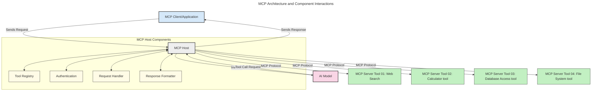
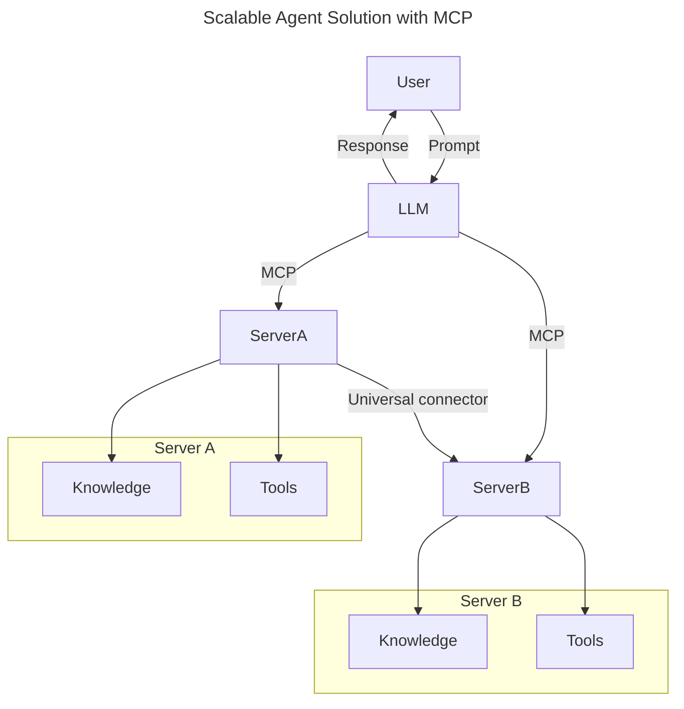
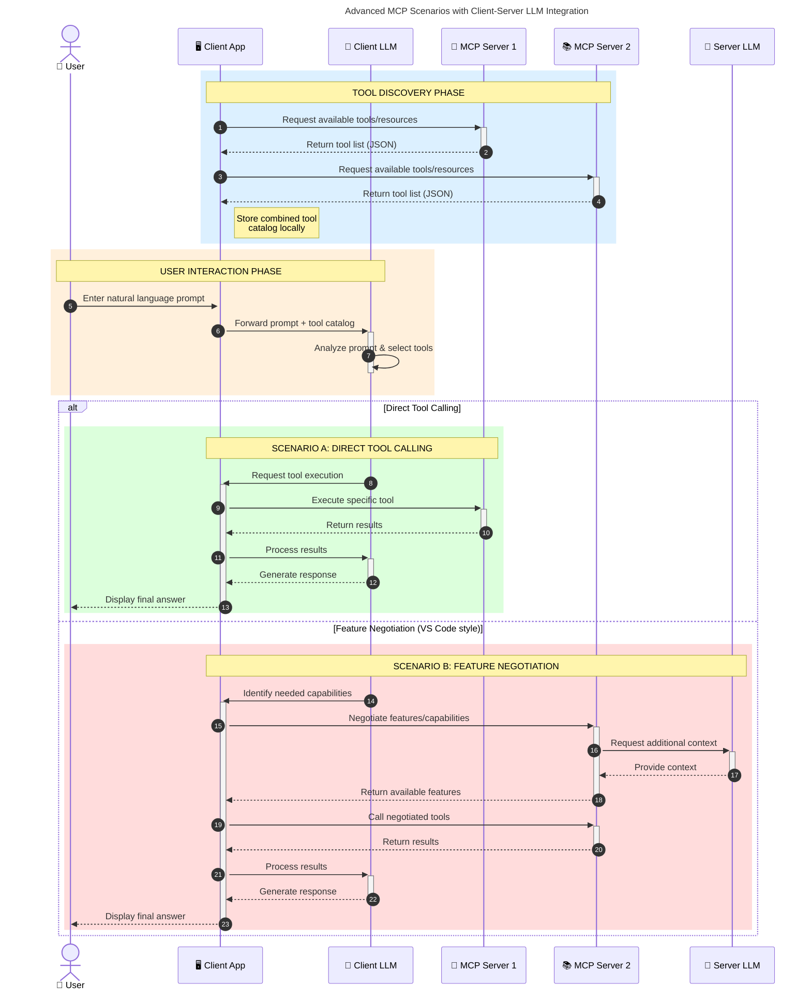

<!--
CO_OP_TRANSLATOR_METADATA:
{
  "original_hash": "9678e0c6945b8e0c23586869b0e26783",
  "translation_date": "2025-10-11T12:33:47+00:00",
  "source_file": "00-Introduction/README.md",
  "language_code": "ta"
}
-->
# மாடல் சூழல் நெறிமுறை (MCP) அறிமுகம்: விரிவாக்கக்கூடிய AI பயன்பாடுகளுக்கான முக்கியத்துவம்

_(மேலே உள்ள படத்தை கிளிக் செய்து இந்த பாடத்தின் வீடியோவைப் பாருங்கள்)_

உருவாக்க AI பயன்பாடுகள் ஒரு பெரிய முன்னேற்றமாகும், ஏனெனில் அவை இயல்பான மொழி உந்துதல்களைப் பயன்படுத்தி பயன்பாட்டுடன் பயனரை தொடர்பு கொள்ள அனுமதிக்கின்றன. ஆனால், இவ்வகை பயன்பாடுகளில் அதிக நேரமும் வளங்களும் முதலீடு செய்யப்படும் போது, செயல்பாடுகள் மற்றும் வளங்களை எளிதாக ஒருங்கிணைக்க முடியும் என்பதை உறுதிப்படுத்த வேண்டும், மேலும் உங்கள் பயன்பாடு பல மாடல்களைப் பயன்படுத்துவதற்கும், பல்வேறு மாடல் சிக்கல்களைச் சமாளிக்கவும் தகுதியானதாக இருக்க வேண்டும். சுருக்கமாக, Gen AI பயன்பாடுகளை உருவாக்குவது தொடங்க எளிதாக இருக்கலாம், ஆனால் அவை வளர்ந்து மேலும் சிக்கலானதாக மாறும்போது, ஒரு கட்டமைப்பை வரையறுக்கத் தொடங்க வேண்டும், மேலும் உங்கள் பயன்பாடுகள் ஒரே மாதிரியான முறையில் உருவாக்கப்படுவதை உறுதிப்படுத்த ஒரு தரநிலையை நம்ப வேண்டும். இதுதான் MCP அமைப்பைச் சீரமைக்கவும், ஒரு தரநிலையை வழங்கவும் உதவுகிறது.

---

## **🔍 மாடல் சூழல் நெறிமுறை (MCP) என்றால் என்ன?**

**மாடல் சூழல் நெறிமுறை (MCP)** என்பது **திறந்த, தரநிலைமயமான இடைமுகம்** ஆகும், இது பெரிய மொழி மாடல்களுக்கு (LLMs) வெளிப்புற கருவிகள், APIகள் மற்றும் தரவுத் தரவுகளுடன் சீராக தொடர்பு கொள்ள அனுமதிக்கிறது. இது AI மாடல்களின் செயல்பாடுகளை அவற்றின் பயிற்சி தரவுக்கு அப்பால் மேம்படுத்துவதற்கான ஒரே மாதிரியான கட்டமைப்பை வழங்குகிறது, மேலும் புத்திசாலி, விரிவாக்கக்கூடிய மற்றும் பதிலளிக்கக்கூடிய AI அமைப்புகளை உருவாக்க உதவுகிறது.

---

## **🎯 AIயில் தரநிலைப்படுத்தல் ஏன் முக்கியம்**

உருவாக்க AI பயன்பாடுகள் மேலும் சிக்கலானதாக மாறும்போது, **விரிவாக்கத்தன்மை, பராமரிப்பு,** மற்றும் **விற்பனையாளர்-தொலைவு தவிர்க்குதல்** ஆகியவற்றை உறுதிப்படுத்தும் தரநிலைகளை ஏற்க வேண்டும். MCP இந்த தேவைகளை பின்வருமாறு தீர்க்கிறது:

- மாடல்-கருவி ஒருங்கிணைப்புகளை ஒரே மாதிரியானதாக மாற்றுகிறது
- மெல்லிய, தனிப்பட்ட தீர்வுகளை குறைக்கிறது
- பல்வேறு விற்பனையாளர்களின் பல மாடல்கள் ஒரே சூழலில் இணைந்து செயல்பட அனுமதிக்கிறது

**குறிப்பு:** MCP தன்னை ஒரு திறந்த தரநிலையாக விளம்பரப்படுத்தினாலும், IEEE, IETF, W3C, ISO அல்லது பிற தரநிலை அமைப்புகள் போன்ற ஏதேனும் உள்ள தரநிலை அமைப்புகள் மூலம் MCPயை தரநிலைப்படுத்த எந்த திட்டங்களும் இல்லை.

---

## **📚 கற்றல் நோக்கங்கள்**

இந்த கட்டுரையின் முடிவில், நீங்கள்:

- **மாடல் சூழல் நெறிமுறை (MCP)** மற்றும் அதன் பயன்பாடுகளை வரையறுக்க முடியும்
- MCP மாடல்-கருவி தொடர்புகளை எப்படி தரநிலைப்படுத்துகிறது என்பதைப் புரிந்துகொள்ள முடியும்
- MCP கட்டமைப்பின் முக்கிய கூறுகளை அடையாளம் காண முடியும்
- MCPயின் வணிக மற்றும் மேம்பாட்டு சூழல்களில் உண்மையான பயன்பாடுகளை ஆராய முடியும்

---

## **💡 மாடல் சூழல் நெறிமுறை (MCP) ஏன் ஒரு மாற்றத்தை உருவாக்குகிறது**

### **🔗 MCP AI தொடர்புகளில் பிளவுகளை தீர்க்கிறது**

MCPக்கு முன், மாடல்களை கருவிகளுடன் ஒருங்கிணைப்பது:

- ஒவ்வொரு கருவி-மாடல் ஜோடிக்கும் தனிப்பட்ட குறியீடு
- ஒவ்வொரு விற்பனையாளருக்கும் தரநிலைமற்ற APIகள்
- புதுப்பிப்புகளால் அடிக்கடி முறைகேடுகள்
- மேலும் கருவிகளுடன்Poor scalability

### **✅ MCP தரநிலைப்படுத்தலின் நன்மைகள்**

| **நன்மை**                | **விளக்கம்**                                                                 |
|--------------------------|-----------------------------------------------------------------------------|
| இடையூறு இல்லாமல் செயல்பாடு | LLMகள் பல்வேறு விற்பனையாளர்களின் கருவிகளுடன் சீராக செயல்படுகின்றன                  |
| ஒரே மாதிரியான செயல்பாடு    | தளங்கள் மற்றும் கருவிகளுக்கு இடையே ஒரே மாதிரியான நடத்தை                              |
| மீண்டும் பயன்படுத்தக்கூடியது | ஒருமுறை உருவாக்கப்பட்ட கருவிகள் திட்டங்கள் மற்றும் அமைப்புகளில் மீண்டும் பயன்படுத்தப்படலாம்       |
| விரைவான மேம்பாடு          | தரநிலைமயமான, plug-and-play இடைமுகங்களைப் பயன்படுத்த dev நேரத்தை குறைக்கிறது         |

---

## **🧱 MCP கட்டமைப்பின் உயர் நிலை கண்ணோட்டம்**

MCP ஒரு **client-server மாடலை** பின்பற்றுகிறது, இதில்:

- **MCP Hosts** AI மாடல்களை இயக்குகிறது
- **MCP Clients** கோரிக்கைகளை தொடங்குகிறது
- **MCP Servers** சூழல், கருவிகள் மற்றும் திறன்களை வழங்குகிறது

### **முக்கிய கூறுகள்:**

- **வளங்கள்** – மாடல்களுக்கு நிலையான அல்லது மாறும் தரவுகள்  
- **உந்துதல்கள்** – வழிகாட்டும் உருவாக்கத்திற்கான முன்கூட்டிய workflows  
- **கருவிகள்** – தேடல், கணக்கீடுகள் போன்ற செயல்படுத்தக்கூடிய செயல்பாடுகள்  
- **Sampling** – recursive தொடர்புகளின் மூலம் agentic நடத்தை  

---

## MCP Servers எப்படி செயல்படுகிறது

MCP servers பின்வருமாறு செயல்படுகிறது:

- **கோரிக்கை ஓட்டம்**:
    1. இறுதி பயனர் அல்லது அவர்களுக்காக செயல்படும் மென்பொருள் மூலம் ஒரு கோரிக்கை தொடங்கப்படுகிறது.
    2. **MCP Client** கோரிக்கையை **MCP Host**க்கு அனுப்புகிறது, இது AI மாடல் runtimeஐ நிர்வகிக்கிறது.
    3. **AI மாடல்** பயனர் உந்துதலைப் பெறுகிறது மற்றும் ஒரு அல்லது அதற்கு மேற்பட்ட கருவி அழைப்புகள் மூலம் வெளிப்புற கருவிகள் அல்லது தரவுகளுக்கு அணுகலை கோரலாம்.
    4. **MCP Host**, மாடல் நேரடியாக அல்லாமல், தரநிலைமயமான நெறிமுறையைப் பயன்படுத்தி பொருத்தமான **MCP Server(s)** உடன் தொடர்பு கொள்ளுகிறது.
- **MCP Host செயல்பாடு**:
    - **Tool Registry**: கிடைக்கக்கூடிய கருவிகள் மற்றும் அவற்றின் திறன்களின் பட்டியலை பராமரிக்கிறது.
    - **Authentication**: கருவி அணுகலுக்கான அனுமதிகளை சரிபார்க்கிறது.
    - **Request Handler**: மாடலிலிருந்து வரும் கருவி கோரிக்கைகளை செயல்படுத்துகிறது.
    - **Response Formatter**: கருவி வெளியீடுகளை மாடல் புரிந்துகொள்ளக்கூடிய வடிவத்தில் அமைக்கிறது.
- **MCP Server செயல்பாடு**:
    - **MCP Host** கருவி அழைப்புகளை ஒரு அல்லது அதற்கு மேற்பட்ட **MCP Servers**க்கு வழிமாற்றுகிறது, ஒவ்வொன்றும் தனிப்பட்ட செயல்பாடுகளை வெளிப்படுத்துகிறது (எ.கா., தேடல், கணக்கீடுகள், தரவுத்தொகுப்பு கேள்விகள்).
    - **MCP Servers** தங்களது தொடர்புடைய செயல்பாடுகளைச் செயல்படுத்தி, **MCP Host**க்கு ஒரு சீரான வடிவத்தில் முடிவுகளைத் திருப்பி அனுப்புகிறது.
    - **MCP Host** இந்த முடிவுகளை வடிவமைத்து **AI மாடல்**க்கு அனுப்புகிறது.
- **பதில் முடிவு**:
    - **AI மாடல்** கருவி வெளியீடுகளை இறுதி பதிலில் இணைக்கிறது.
    - **MCP Host** இந்த பதிலை **MCP Client**க்கு அனுப்புகிறது, இது இறுதி பயனர் அல்லது அழைக்கும் மென்பொருளுக்கு வழங்குகிறது.

## 👨‍💻 MCP Server உருவாக்குவது எப்படி (உதாரணங்களுடன்)

MCP servers LLM திறன்களை விரிவாக்குவதற்கு தரவுகள் மற்றும் செயல்பாடுகளை வழங்க அனுமதிக்கிறது.

தயார்? கீழே dil/stack-specific SDKகள் மற்றும் MCP servers உருவாக்குவதற்கான எளிய உதாரணங்கள் உள்ளன:

- **Python SDK**: https://github.com/modelcontextprotocol/python-sdk

- **TypeScript SDK**: https://github.com/modelcontextprotocol/typescript-sdk

- **Java SDK**: https://github.com/modelcontextprotocol/java-sdk

- **C#/.NET SDK**: https://github.com/modelcontextprotocol/csharp-sdk

## 🌍 MCPயின் உண்மையான பயன்பாடுகள்

MCP AI திறன்களை விரிவாக்குவதன் மூலம் பல்வேறு பயன்பாடுகளை இயக்குகிறது:

| **பயன்பாடு**                  | **விளக்கம்**                                                                 |
|------------------------------|-----------------------------------------------------------------------------|
| நிறுவன தரவின் ஒருங்கிணைப்பு   | LLMக்களை தரவுத்தொகுப்புகள், CRMகள் அல்லது உள்துறை கருவிகளுடன் இணைக்கிறது       |
| Agentic AI அமைப்புகள்         | கருவி அணுகல் மற்றும் முடிவெடுக்கும் workflows உடன் தானியங்க செயல்பாடுகளை இயக்குகிறது |
| பல்வேறு முறை பயன்பாடுகள்      | ஒரே AI பயன்பாட்டில் உரை, படம் மற்றும் ஒலி கருவிகளை இணைக்கிறது                  |
| நேரடி தரவின் ஒருங்கிணைப்பு     | AI தொடர்புகளில் நேரடி தரவை கொண்டு வந்து மேலும் துல்லியமான, தற்போதைய வெளியீடுகளை வழங்குகிறது |

### 🧠 MCP = AI தொடர்புகளுக்கான உலகளாவிய தரநிலை

மாடல் சூழல் நெறிமுறை (MCP) AI தொடர்புகளுக்கான உலகளாவிய தரநிலையாக செயல்படுகிறது, USB-C சாதனங்களுக்கான உட்புற இணைப்புகளை தரநிலைப்படுத்தியது போல. AI உலகில், MCP ஒரு ஒரே மாதிரியான இடைமுகத்தை வழங்குகிறது, இது மாடல்களை (clients) வெளிப்புற கருவிகள் மற்றும் தரவுத் தரவுகளுடன் (servers) சீராக ஒருங்கிணைக்க அனுமதிக்கிறது. ஒவ்வொரு API அல்லது தரவுத் தரவுக்கான தனிப்பட்ட, தனித்துவமான நெறிமுறைகளைத் தேவையற்றதாக MCP நீக்குகிறது.

MCPயின் கீழ், MCP-இணக்கமான கருவி (MCP server என்று குறிப்பிடப்படுகிறது) ஒரு ஒரே மாதிரியான தரநிலையை பின்பற்றுகிறது. இந்த servers தங்களது கருவிகள் அல்லது செயல்பாடுகளை பட்டியலிட முடியும் மற்றும் AI agent கோரும்போது அந்த செயல்பாடுகளைச் செயல்படுத்த முடியும். MCPயை ஆதரிக்கும் AI agent தளங்கள் serversகளில் கிடைக்கக்கூடிய கருவிகளை கண்டறிந்து, இந்த தரநிலையான நெறிமுறையின் மூலம் அவற்றை அழைக்க முடியும்.

### 💡 அறிவுக்கான அணுகலை எளிதாக்குகிறது

கருவிகளை வழங்குவதற்கு அப்பால், MCP அறிவுக்கான அணுகலை எளிதாக்குகிறது. இது பெரிய மொழி மாடல்களுக்கு (LLMs) பல்வேறு தரவுத் தரவுகளுடன் இணைப்பதன் மூலம் பயன்பாடுகளை சூழல் வழங்க அனுமதிக்கிறது. உதாரணமாக, MCP server ஒரு நிறுவனத்தின் ஆவணக் களஞ்சியத்தை பிரதிநிதித்துவப்படுத்தலாம், இது agentsக்கு தேவையான தகவல்களை உடனடியாக பெற அனுமதிக்கிறது. மற்றொரு server மின்னஞ்சல்கள் அனுப்புதல் அல்லது பதிவுகளைப் புதுப்பித்தல் போன்ற குறிப்பிட்ட செயல்பாடுகளை நிர்வகிக்கலாம். Agent பார்வையில், இவை அது பயன்படுத்தக்கூடிய கருவிகள் மட்டுமே—சில கருவிகள் தரவை (அறிவு சூழல்) திருப்பி வழங்கும், மற்றவை செயல்பாடுகளைச் செயல்படுத்தும். MCP இரண்டையும் திறமையாக நிர்வகிக்கிறது.

MCP serverக்கு இணைக்கும் agent, server-இன் கிடைக்கக்கூடிய திறன்கள் மற்றும் அணுகக்கூடிய தரவுகளை ஒரு தரநிலை வடிவத்தின் மூலம் தானாகவே கற்றுக்கொள்கிறது. இந்த தரநிலைப்படுத்தல் dinamic tool availabilityயை சாத்தியமாக்குகிறது. உதாரணமாக, agent அமைப்பில் புதிய MCP serverஐச் சேர்ப்பது அதன் செயல்பாடுகளை உடனடியாக பயன்படுத்தக்கூடியதாக மாற்றுகிறது, agent உத்தரவுகளை மேலும் தனிப்பயனாக்க தேவையில்லை.

இந்த ஒழுங்கமைக்கப்பட்ட ஒருங்கிணைப்பு கீழே உள்ள வரைபடத்தில் காட்டப்பட்டுள்ள ஓட்டத்துடன் ஒத்துப்போகிறது, இதில் servers கருவிகள் மற்றும் அறிவை வழங்குகிறது, அமைப்புகளுக்கு இடையே சீரான ஒத்துழைப்பை உறுதிப்படுத்துகிறது.

### 👉 உதாரணம்: விரிவாக்கக்கூடிய Agent தீர்வு

Universal Connector MCP servers ServerAக்கு ServerBக்கு பணிகளை ஒப்படைக்க அல்லது அதன் கருவிகள் மற்றும் அறிவை அணுக அனுமதிக்கிறது. இது கருவிகள் மற்றும் தரவுகளை serversகளுக்கு இடையே பகிர்வதன் மூலம் விரிவாக்கக்கூடிய மற்றும் தொகுப்புக்கூடிய agent கட்டமைப்புகளை ஆதரிக்கிறது. MCP கருவி வெளிப்பாட்டை தரநிலைப்படுத்துவதால், agents serversகளுக்கு இடையே கோரிக்கைகளை தானாகவே கண்டறிந்து வழிமாற்ற முடியும், கடினமாக குறியீடு செய்யப்பட்ட ஒருங்கிணைப்புகள் இல்லாமல்.

கருவி மற்றும் அறிவு கூட்டமைப்பு: கருவிகள் மற்றும் தரவுகள் serversகளுக்கு இடையே அணுகக்கூடியதாக இருக்கும், மேலும் விரிவாக்கக்கூடிய மற்றும் தொகுப்புக்கூடிய agentic கட்டமைப்புகளை இயக்குகிறது.

### 🔄 Client-Side LLM ஒருங்கிணைப்புடன் மேம்பட்ட MCP சூழல்கள்

அடிப்படை MCP கட்டமைப்புக்கு அப்பால், client மற்றும் server இரண்டிலும் LLMகள் உள்ள மேம்பட்ட சூழல்கள் உள்ளன, மேலும் சிக்கலான தொடர்புகளை இயக்குகிறது. கீழே உள்ள வரைபடத்தில், **Client App** IDE ஆக இருக்கலாம், இதில் பயனர் LLM மூலம் MCP கருவிகளைப் பயன்படுத்த முடியும்:

## 🔐 MCPயின் நடைமுறை நன்மைகள்

MCP பயன்படுத்துவதன் மூலம் கிடைக்கும் நடைமுறை நன்மைகள்:

- **புதுமை**: மாடல்கள் பயிற்சி தரவுக்கு அப்பால் புதுப்பிக்கப்பட்ட தகவல்களை அணுக முடியும்
- **திறன்களின் விரிவாக்கம்**: மாடல்கள் தாங்கள் பயிற்சி பெறாத பணிகளுக்கு சிறப்பு கருவிகளைப் பயன்படுத்த முடியும்
- **தவறான தகவல்களை குறைத்தல்**: வெளிப்புற தரவுத் தரவுகள் உண்மையான அடிப்படை வழங்குகிறது
- **தனியுரிமை**: உணர்வுபூர்வமான தரவுகள் பாதுகாப்பான சூழல்களில் இருக்க முடியும், உந்துதல்களில் உள்ளடக்கப்படாமல்

## 📌 முக்கியக் குறிப்புகள்

MCP பயன்படுத்துவதற்கான முக்கியக் குறிப்புகள்:

- **MCP** AI மாடல்கள் கருவிகள் மற்றும் தரவுடன் தொடர்பு கொள்ளும் முறையை தரநிலைப்படுத்துகிறது
- **விரிவாக்கத்தன்மை, ஒரே மாதிரியான செயல்பாடு மற்றும் இடையூறு இல்லாமல் செயல்பாடு** ஆகியவற்றை ஊக்குவிக்கிறது
- MCP **மேம்பாட்டு நேரத்தை குறைக்க, நம்பகத்தன்மையை மேம்படுத்த, மற்றும் மாடல் திறன்களை விரிவாக்க** உதவுகிறது
- client-server கட்டமைப்பு **நெகிழ்வான, விரிவாக்கக்கூடிய AI பயன்பாடுகளை** இயக்குகிறது

## 🧠 பயிற்சி

நீங்கள் உருவாக்க ஆர்வமாக உள்ள AI பயன்பாட்டைப் பற்றி யோசிக்கவும்.

- எந்த **வெளிப்புற கருவிகள் அல்லது தரவுகள்** அதன் திறன்களை மேம்படுத்த உதவலாம்?
- MCP ஒருங்கிணைப்பை **எளிதாக்கவும், மேலும் நம்பகமானதாகவும்** எப்படி மாற்றும்?

## கூடுதல் வளங்கள்

- [MCP GitHub Repository](https://github.com/modelcontextprotocol)

## அடுத்தது

அடுத்தது: [அத்தியாயம் 1: முக்கிய கருத்துக்கள்](../01-CoreConcepts/README.md)

---

**குறிப்பு**:  
இந்த ஆவணம் [Co-op Translator](https://github.com/Azure/co-op-translator) என்ற AI மொழிபெயர்ப்பு சேவையைப் பயன்படுத்தி மொழிபெயர்க்கப்பட்டுள்ளது. நாங்கள் துல்லியத்திற்காக முயற்சிக்கின்றோம், ஆனால் தானியங்கி மொழிபெயர்ப்புகளில் பிழைகள் அல்லது தவறான தகவல்கள் இருக்கக்கூடும் என்பதை தயவுசெய்து கவனத்தில் கொள்ளவும். அதன் தாய்மொழியில் உள்ள மூல ஆவணம் அதிகாரப்பூர்வ ஆதாரமாக கருதப்பட வேண்டும். முக்கியமான தகவல்களுக்கு, தொழில்முறை மனித மொழிபெயர்ப்பு பரிந்துரைக்கப்படுகிறது. இந்த மொழிபெயர்ப்பைப் பயன்படுத்துவதால் ஏற்படும் எந்த தவறான புரிதல்கள் அல்லது தவறான விளக்கங்களுக்கு நாங்கள் பொறுப்பல்ல.