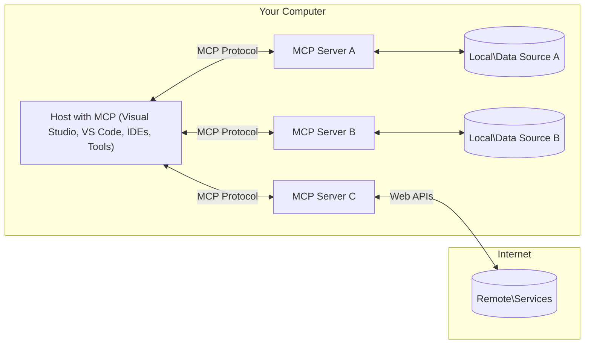

<!--
CO_OP_TRANSLATOR_METADATA:
{
  "original_hash": "904b59de1de9264801242d90a42cdd9d",
  "translation_date": "2025-10-11T12:31:34+00:00",
  "source_file": "01-CoreConcepts/README.md",
  "language_code": "ta"
}
-->
# MCP முக்கிய கருத்துக்கள்: AI ஒருங்கிணைப்புக்கான மாடல் சூழல் நெறிமுறையை கற்றல்

[](https://youtu.be/earDzWGtE84)

_(மேலே உள்ள படத்தை கிளிக் செய்து இந்த பாடத்தின் வீடியோவைப் பாருங்கள்)_

[Model Context Protocol (MCP)](https://github.com/modelcontextprotocol) என்பது பெரிய மொழி மாடல்கள் (LLMs) மற்றும் வெளிப்புற கருவிகள், பயன்பாடுகள், மற்றும் தரவுத் தரவுகளுக்கு இடையிலான தொடர்பை மேம்படுத்தும் ஒரு சக்திவாய்ந்த, நிலையான கட்டமைப்பாகும். 
இந்த வழிகாட்டி MCP-யின் முக்கிய கருத்துக்களை உங்களுக்கு விளக்குகிறது. இதன் கிளையன்ட்-சர்வர் கட்டமைப்பு, முக்கிய கூறுகள், தொடர்பு இயந்திரங்கள், மற்றும் செயல்படுத்தல் சிறந்த நடைமுறைகள் பற்றிய தகவல்களை நீங்கள் கற்றுக்கொள்வீர்கள்.

- **பயனர் ஒப்புதல்**: அனைத்து தரவுகளின் அணுகல் மற்றும் செயல்பாடுகளுக்கும் செயல்படுத்துவதற்கு முன் பயனர் ஒப்புதல் தேவை. எந்த தரவுகள் அணுகப்படும் மற்றும் எந்த நடவடிக்கைகள் மேற்கொள்ளப்படும் என்பதை பயனர்கள் தெளிவாக புரிந்துகொள்ள வேண்டும், அனுமதிகள் மற்றும் அங்கீகாரங்களில் நுணுக்கமான கட்டுப்பாட்டுடன்.

- **தரவு தனியுரிமை பாதுகாப்பு**: பயனர் தரவுகள் தெளிவான ஒப்புதலுடன் மட்டுமே வெளிப்படுத்தப்பட வேண்டும், மேலும் முழு தொடர்பு வாழ்க்கைச்சுழற்சியில் வலுவான அணுகல் கட்டுப்பாடுகளால் பாதுகாக்கப்பட வேண்டும். அனுமதியில்லாத தரவுப் பரிமாற்றத்தைத் தடுக்கவும், கடுமையான தனியுரிமை எல்லைகளை பராமரிக்கவும் செயல்பாடுகள் வேண்டும்.

- **கருவி செயல்பாட்டு பாதுகாப்பு**: ஒவ்வொரு கருவி அழைப்பிற்கும் அதன் செயல்பாடு, அளவுருக்கள், மற்றும் சாத்தியமான தாக்கத்தை தெளிவாக புரிந்துகொண்டு பயனர் ஒப்புதல் தேவை. எதிர்பாராத, பாதுகாப்பற்ற அல்லது தீவிரமான கருவி செயல்பாட்டைத் தடுக்க வலுவான பாதுகாப்பு எல்லைகள் இருக்க வேண்டும்.

- **பரிமாற்ற அடுக்கு பாதுகாப்பு**: அனைத்து தொடர்பு சேனல்களும் பொருத்தமான குறியாக்கம் மற்றும் அங்கீகார முறைகளைப் பயன்படுத்த வேண்டும். தொலைதூர இணைப்புகள் பாதுகாப்பான பரிமாற்ற நெறிமுறைகளை செயல்படுத்த வேண்டும் மற்றும் சரியான சான்றிதழ் மேலாண்மையை கொண்டிருக்க வேண்டும்.

#### செயல்படுத்தல் வழிகாட்டுதல்கள்:

- **அனுமதி மேலாண்மை**: பயனர்கள் எந்த சர்வர்கள், கருவிகள், மற்றும் வளங்கள் அணுகக்கூடியவை என்பதை கட்டுப்படுத்த நுணுக்கமான அனுமதி அமைப்புகளை செயல்படுத்தவும்  
- **அங்கீகாரம் மற்றும் அங்கீகாரமளித்தல்**: பாதுகாப்பான அங்கீகார முறைகளை (OAuth, API கீக்கள்) சரியான டோக்கன் மேலாண்மை மற்றும் காலாவதியாக்கலுடன் பயன்படுத்தவும்  
- **உள்ளீடு சரிபார்ப்பு**: உள்ளீட்டு தாக்குதல்களைத் தடுக்க வரையறுக்கப்பட்ட ஸ்கீமாக்கள் படி அனைத்து அளவுருக்கள் மற்றும் தரவுகளை சரிபார்க்கவும்  
- **ஆடிட் பதிவு**: பாதுகாப்பு கண்காணிப்பு மற்றும் இணக்கத்திற்காக அனைத்து செயல்பாடுகளின் விரிவான பதிவுகளை பராமரிக்கவும்  

## கண்ணோட்டம்

இந்த பாடம் Model Context Protocol (MCP) சூழலின் அடிப்படை கட்டமைப்பு மற்றும் கூறுகளை ஆராய்கிறது. MCP தொடர்புகளை இயக்கும் கிளையன்ட்-சர்வர் கட்டமைப்பு, முக்கிய கூறுகள், மற்றும் தொடர்பு இயந்திரங்கள் பற்றிய தகவல்களை நீங்கள் கற்றுக்கொள்வீர்கள்.

## முக்கிய கற்றல் நோக்கங்கள்

இந்த பாடத்தின் முடிவில், நீங்கள்:

- MCP கிளையன்ட்-சர்வர் கட்டமைப்பை புரிந்துகொள்வீர்கள்.
- Hosts, Clients, மற்றும் Servers-ன் பங்கு மற்றும் பொறுப்புகளை அடையாளம் காண்பீர்கள்.
- MCP-யை ஒரு நெகிழ்வான ஒருங்கிணைப்பு அடுக்கு ஆக்கும் முக்கிய அம்சங்களை பகுப்பாய்வு செய்வீர்கள்.
- MCP சூழலில் தகவல் எப்படி பாய்கிறது என்பதை கற்றுக்கொள்வீர்கள்.
- .NET, Java, Python, மற்றும் JavaScript-ல் உள்ள குறியீட்டு உதாரணங்கள் மூலம் நடைமுறை அறிவைப் பெறுவீர்கள்.

## MCP கட்டமைப்பு: ஆழமான பார்வை

MCP சூழல் ஒரு கிளையன்ட்-சர்வர் மாடலில் கட்டமைக்கப்பட்டுள்ளது. இந்த தொகுதி அமைப்பு AI பயன்பாடுகள் கருவிகள், தரவுத்தொகுப்புகள், APIக்கள், மற்றும் சூழல் வளங்களுடன் திறமையாக தொடர்பு கொள்ள உதவுகிறது. இந்த கட்டமைப்பை அதன் முக்கிய கூறுகளாக பிரிக்கலாம்.

MCP அதன் மையத்தில் ஒரு கிளையன்ட்-சர்வர் கட்டமைப்பைப் பின்பற்றுகிறது, இதில் ஒரு ஹோஸ்ட் பயன்பாடு பல சர்வர்களுடன் இணைக்க முடியும்:



- **MCP Hosts**: VSCode, Claude Desktop, IDEs, அல்லது MCP மூலம் தரவுகளை அணுக விரும்பும் AI கருவிகள் போன்ற செயலிகள்
- **MCP Clients**: சர்வர்களுடன் 1:1 இணைப்புகளை பராமரிக்கும் நெறிமுறை கிளையன்ட்கள்
- **MCP Servers**: ஒவ்வொன்றும் நிலையான Model Context Protocol மூலம் குறிப்பிட்ட திறன்களை வெளிப்படுத்தும் இலகு செயலிகள்
- **உள்ளூர் தரவுத் தரவுகள்**: MCP சர்வர்கள் பாதுகாப்பாக அணுகக்கூடிய உங்கள் கணினியின் கோப்புகள், தரவுத்தொகுப்புகள், மற்றும் சேவைகள்
- **தொலை சேவைகள்**: APIக்கள் மூலம் MCP சர்வர்கள் இணைக்கக்கூடிய இணையத்தில் கிடைக்கும் வெளிப்புற அமைப்புகள்

MCP நெறிமுறை YYYY-MM-DD வடிவத்தில் தேதியை அடிப்படையாகக் கொண்ட பதிப்பு முறையைப் பயன்படுத்தும் ஒரு வளர்ந்து வரும் நிலையானது. தற்போதைய நெறிமுறை பதிப்பு **2025-06-18**. [நெறிமுறை விவரக்குறிப்பு](https://modelcontextprotocol.io/specification/2025-06-18/) பற்றிய சமீபத்திய புதுப்பிப்புகளை நீங்கள் காணலாம்.

### 1. Hosts

Model Context Protocol (MCP)-இல், **Hosts** என்பது பயனர்கள் MCP நெறிமுறையுடன் தொடர்பு கொள்ளும் முதன்மை இடைமுகமாக செயல்படும் AI பயன்பாடுகள். Hosts பல MCP சர்வர்களுடன் இணைப்புகளை ஒருங்கிணைத்து நிர்வகிக்க MCP கிளையன்ட்களை உருவாக்குகின்றன. Hosts-ன் உதாரணங்கள்:

- **AI பயன்பாடுகள்**: Claude Desktop, Visual Studio Code, Claude Code
- **வளர்ச்சி சூழல்கள்**: MCP ஒருங்கிணைப்புடன் IDEக்கள் மற்றும் குறியீட்டு திருத்திகள்  
- **தனிப்பயன் பயன்பாடுகள்**: குறிப்பிட்ட நோக்கத்திற்காக உருவாக்கப்பட்ட AI முகவர்கள் மற்றும் கருவிகள்

**Hosts** என்பது AI மாடல் தொடர்புகளை ஒருங்கிணைக்கும் செயலிகள். அவை:

- **AI மாடல்களை ஒருங்கிணைப்பு**: பதில்களை உருவாக்க அல்லது AI வேலைகளை ஒருங்கிணைக்க LLMகளுடன் தொடர்பு கொள்ளுதல்
- **கிளையன்ட் இணைப்புகளை நிர்வகித்தல்**: ஒவ்வொரு MCP சர்வர் இணைப்பிற்கும் ஒரு MCP கிளையன்ட்டை உருவாக்கி பராமரித்தல்
- **பயனர் இடைமுகத்தை கட்டுப்படுத்துதல்**: உரையாடல் ஓட்டம், பயனர் தொடர்புகள், மற்றும் பதில்களை வழங்குதல்  
- **பாதுகாப்பை அமல்படுத்துதல்**: அனுமதிகள், பாதுகாப்பு கட்டுப்பாடுகள், மற்றும் அங்கீகாரத்தை கட்டுப்படுத்துதல்
- **பயனர் ஒப்புதலை நிர்வகித்தல்**: தரவுப் பகிர்வு மற்றும் கருவி செயல்பாட்டிற்கான பயனர் ஒப்புதலை நிர்வகித்தல்

### 2. Clients

**Clients** என்பது Hosts மற்றும் MCP சர்வர்களுக்கு இடையிலான ஒற்றை-ஒற்றை இணைப்புகளை பராமரிக்கும் முக்கிய கூறுகள். ஒவ்வொரு MCP கிளையன்ட்டும் ஒரு MCP சர்வருடன் இணைக்க ஹோஸ்ட் மூலம் உருவாக்கப்படுகிறது, ஒழுங்கமைக்கப்பட்ட மற்றும் பாதுகாப்பான தொடர்பு சேனல்களை உறுதிப்படுத்துகிறது. பல கிளையன்ட்கள் Hosts-க்கு ஒரே நேரத்தில் பல சர்வர்களுடன் இணைக்க அனுமதிக்கின்றன.

**Clients** என்பது ஹோஸ்ட் செயலியின் உள்ளே உள்ள இணைப்புக் கூறுகள். அவை:

- **நெறிமுறை தொடர்பு**: JSON-RPC 2.0 கோரிக்கைகளை சர்வர்களுக்கு அனுப்புதல்
- **திறன் பேச்சுவார்த்தை**: தொடக்கத்தில் சர்வர்களுடன் ஆதரிக்கப்படும் அம்சங்கள் மற்றும் நெறிமுறை பதிப்புகளை பேச்சுவார்த்தை செய்தல்
- **கருவி செயல்பாடு**: மாடல்களிடமிருந்து கருவி செயல்பாட்டு கோரிக்கைகளை நிர்வகித்தல் மற்றும் பதில்களை செயல்படுத்துதல்
- **நேரடி புதுப்பிப்புகள்**: சர்வர்களிடமிருந்து அறிவிப்புகள் மற்றும் நேரடி புதுப்பிப்புகளை நிர்வகித்தல்
- **பதில்களை செயல்படுத்துதல்**: பயனர்களுக்கு காட்ட சர்வர் பதில்களை செயல்படுத்துதல்

### 3. Servers

**Servers** என்பது MCP கிளையன்ட்களுக்கு சூழல், கருவிகள், மற்றும் திறன்களை வழங்கும் செயலிகள். அவை உள்ளூரில் (ஹோஸ்டுடன் ஒரே கணினியில்) அல்லது தொலைதூரமாக (வெளிப்புற தளங்களில்) செயல்பட முடியும், மேலும் கிளையன்ட் கோரிக்கைகளை நிர்வகித்து அமைப்பான பதில்களை வழங்க பொறுப்பாக இருக்கும். Servers MCP மூலம் குறிப்பிட்ட செயல்பாடுகளை வெளிப்படுத்துகிறது.

**Servers** என்பது சூழல் மற்றும் திறன்களை வழங்கும் சேவைகள். அவை:

- **அம்ச பதிவு**: கிடைக்கக்கூடிய மூலப்பொருட்கள் (வளங்கள், உந்துதல்கள், கருவிகள்) ஆகியவற்றை கிளையன்ட்களுக்கு பதிவு செய்து வெளிப்படுத்துதல்
- **கோரிக்கை செயல்பாடு**: கிளையன்ட்களிடமிருந்து கருவி அழைப்புகள், வள கோரிக்கைகள், மற்றும் உந்துதல் கோரிக்கைகளைப் பெறுதல் மற்றும் செயல்படுத்துதல்
- **சூழல் வழங்கல்**: மாடல் பதில்களை மேம்படுத்த சூழல் தகவல் மற்றும் தரவுகளை வழங்குதல்
- **நிலை மேலாண்மை**: அமர்வு நிலையை பராமரித்து தேவையான போது நிலையான தொடர்புகளை நிர்வகித்தல்
- **நேரடி அறிவிப்புகள்**: இணைக்கப்பட்ட கிளையன்ட்களுக்கு திறன் மாற்றங்கள் மற்றும் புதுப்பிப்புகள் பற்றிய அறிவிப்புகளை அனுப்புதல்

Servers யாராலும் உருவாக்கப்பட்டு மாடல் திறன்களை சிறப்பு செயல்பாடுகளுடன் விரிவாக்க முடியும், மேலும் அவை உள்ளூர் மற்றும் தொலைதூர இடைமுக அமைப்புகளை ஆதரிக்கின்றன.

### 4. Server Primitives

Model Context Protocol (MCP)-இல் Servers மூன்று முக்கிய **primitives**-களை வழங்குகிறது, இது கிளையன்ட்கள், ஹோஸ்ட்கள், மற்றும் மொழி மாடல்களுக்கு இடையிலான செறிவான தொடர்புகளுக்கான அடிப்படை கட்டமைப்புகளை வரையறுக்கிறது. இந்த primitives MCP மூலம் கிடைக்கும் தகவல் மற்றும் செயல்பாடுகளின் வகைகளை வரையறுக்கின்றன.

MCP Servers கீழே உள்ள மூன்று முக்கிய primitives-களின் எந்த கலவையையும் வெளிப்படுத்த முடியும்:

#### Resources 

**Resources** என்பது AI பயன்பாடுகளுக்கு சூழல் தகவலை வழங்கும் தரவுத் தரவுகள். அவை மாடல் புரிதல் மற்றும் முடிவெடுப்பை மேம்படுத்த நிலையான அல்லது மாறும் உள்ளடக்கத்தை பிரதிநிதித்துவப்படுத்துகின்றன:

- **சூழல் தரவுகள்**: AI மாடல் பயன்பாட்டிற்கான அமைப்பான தகவல் மற்றும் சூழல்
- **அறிவுத் தரவுத்தொகுப்புகள்**: ஆவணக் களஞ்சியங்கள், கட்டுரைகள், கையேடுகள், மற்றும் ஆராய்ச்சி ஆவணங்கள்
- **உள்ளூர் தரவுத் தரவுகள்**: கோப்புகள், தரவுத்தொகுப்புகள், மற்றும் உள்ளூர் அமைப்பு தகவல்  
- **வெளிப்புற தரவுகள்**: API பதில்கள், வலை சேவைகள், மற்றும் தொலை அமைப்பு தரவுகள்
- **மாறும் உள்ளடக்கம்**: வெளிப்புற நிலைகளின் அடிப்படையில் புதுப்பிக்கப்படும் நேரடி தரவுகள்

Resources URIக்களால் அடையாளம் காணப்படுகின்றன மற்றும் `resources/list` மற்றும் `resources/read` முறைகள் மூலம் கண்டறியப்படுகின்றன:

```text
file://documents/project-spec.md
database://production/users/schema
api://weather/current
```

#### Prompts

**Prompts** என்பது மொழி மாடல்களுடன் தொடர்புகளை அமைக்க உதவும் மறுபயன்பாட்டு வார்ப்புருக்கள். அவை நிலையான தொடர்பு முறைமைகள் மற்றும் வார்ப்புரு வேலைகளை வழங்குகின்றன:

- **வார்ப்புரு அடிப்படையிலான தொடர்புகள்**: முன்கூட்டியே அமைக்கப்பட்ட செய்திகள் மற்றும் உரையாடல் தொடக்கங்கள்
- **வேலைவழி வார்ப்புருக்கள்**: பொதுவான பணிகள் மற்றும் தொடர்புகளுக்கான நிலையான வரிசைகள்
- **Few-shot உதாரணங்கள்**: மாடல் வழிகாட்டுதலுக்கான உதாரண அடிப்படையிலான வார்ப்புருக்கள்
- **System Prompts**: மாடல் நடத்தை மற்றும் சூழலை வரையறுக்கும் அடிப்படை prompts
- **மாறும் வார்ப்புருக்கள்**: குறிப்பிட்ட சூழல்களுக்கு ஏற்ப மாறும் prompts

Prompts மாறிலி மாற்றத்தை ஆதரிக்கின்றன மற்றும் `prompts/list` மூலம் கண்டறியப்படுகின்றன மற்றும் `prompts/get` மூலம் பெறப்படுகின்றன:

```markdown
Generate a {{task_type}} for {{product}} targeting {{audience}} with the following requirements: {{requirements}}
```

#### Tools

**Tools** என்பது AI மாடல்கள் குறிப்பிட்ட செயல்பாடுகளைச் செய்ய அழைக்கக்கூடிய செயல்படுத்தக்கூடிய செயல்பாடுகள். MCP சூழலின் "verbs" ஆக கருதப்படும் Tools மாடல்களுக்கு வெளிப்புற அமைப்புகளுடன் தொடர்பு கொள்ள உதவுகின்றன:

- **செயல்படுத்தக்கூடிய செயல்பாடுகள்**: குறிப்பிட்ட அளவுருக்களுடன் மாடல்கள் அழைக்கக்கூடிய தனித்த செயல்பாடுகள்
- **வெளிப்புற அமைப்பு ஒருங்கிணைப்பு**: API அழைப்புகள், தரவுத்தொகுப்பு விசாரணைகள், கோப்பு செயல்பாடுகள், கணக்கீடுகள்
- **தனித்துவமான அடையாளம்**: ஒவ்வொரு கருவிக்கும் தனித்த பெயர், விளக்கம், மற்றும் அளவுரு ஸ்கீமா உள்ளது
- **அமைப்பான I/O**: Tools சரிபார்க்கப்பட்ட அளவுருக்களை ஏற்கின்றன மற்றும் அமைப்பான, வகைப்படுத்தப்பட்ட பதில்களை வழங்குகின்றன
- **செயல் திறன்கள்**: மாடல்களுக்கு உண்மையான உலக செயல்பாடுகளைச் செய்ய மற்றும் நேரடி தரவுகளைப் பெற அனுமதிக்கின்றன

Tools JSON Schema மூலம் அளவுரு சரிபார்ப்புடன் வரையறுக்கப்படுகின்றன மற்றும் `tools/list` மூலம் கண்டறியப்படுகின்றன மற்றும் `tools/call` மூலம் செயல்படுத்தப்படுகின்றன:

```typescript
server.tool(
  "search_products", 
  {
    query: z.string().describe("Search query for products"),
    category: z.string().optional().describe("Product category filter"),
    max_results: z.number().default(10).describe("Maximum results to return")
  }, 
  async (params) => {
    // Execute search and return structured results
    return await productService.search(params);
  }
);
```

## Client Primitives

Model Context Protocol (MCP)-இல், **clients** primitives-களை வெளிப்படுத்த முடியும், இது சர்வர்களுக்கு ஹோஸ்ட் செயலியில் இருந்து கூடுதல் திறன்களை கோர அனுமதிக்கிறது. இந்த client-வழி primitives சர்வர்களுக்கு AI மாடல் திறன்கள் மற்றும் பயனர் தொடர்புகளை அணுக அனுமதிக்கின்றன.

### Sampling

**Sampling** சர்வர்களுக்கு கிளையன்ட்டின் AI செயலியில் இருந்து மொழி மாடல் முடிவுகளை கோர அனுமதிக்கிறது. இந்த primitive சர்வர்களுக்கு தங்கள் சொந்த மாடல் சார்புகளை உள்ளடக்காமல் LLM திறன்களை அணுக அனுமதிக்கிறது:

- **மாடல் சார்பற்ற அணுகல்**: சர்வர்கள் LLM SDKகளை உள்ளடக்காமல் அல்லது மாடல் அணுகலை நிர்வகிக்காமல் முடிவுகளை கோர முடியும்
- **சர்வர் தொடங்கிய AI**: சர்வர்கள் கிளையன்ட்டின் AI மாடலைப் பயன்படுத்தி தன்னாட்சி உள்ளடக்கத்தை உருவாக்க அனுமதிக்கிறது
- **Recursive LLM தொடர்புகள்**: செயலாக்கத்திற்கு AI உதவி தேவைப்படும் சிக்கலான சூழல்களை ஆதரிக்கிறது
- **மாறும் உள்ளடக்க உருவாக்கம்**: ஹோஸ்டின் மாடலைப் பயன்படுத்தி சூழல் பதில்களை உருவாக்க சர்வர்களுக்கு அனுமதிக்கிறது

Sampling `sampling/complete` முறையின் மூலம் தொடங்கப்படுகிறது, இதில் சர்வர்கள் கிளையன்ட்டுக்கு முடிவு கோரிக்கைகளை அனுப்புகின்றன.

### Elicitation  

**Elicitation** சர்வர்களுக்கு கிளையன்ட்டின் இடைமுகத்தின் மூலம் பயனர்களிடமிருந்து கூடுதல் தகவல் அல்லது உறுதிப்படுத்தலை கோர அனுமதிக்கிறது:

- **பயனர் உள்ளீட்டு கோரிக்கைகள்**: கருவி செயல்பாட்டிற்கு தேவையான போது சர்வர்கள் கூடுதல் தகவலை கேட்க முடியும்
- **உறுதிப்படுத்தல் உரையாடல்கள்**: உணர்திறன் வாய்ந்த அல்லது தாக்கம் உள்ள செயல்பாடுகளுக்கு பயனர் ஒப்புதலை கோருங்கள்
- **தொடர்ச்சியான வேலைவழிகள்**: பயனர் தொடர்புகளை படிப்படியாக உருவாக்க சர்வர்களுக்கு அனுமதிக்கிறது
- **மாறும் அளவுரு சேகரிப்பு**: கருவி செயல்பாட்டின் போது காணாமல் போன அல்லது விருப்பமான அளவுருக்களை சேகரிக்கவும்

Elicitation கோரிக்கைகள் `elicitation/request` முறையைப் பயன்படுத்தி கிளையன்ட்டின் இடைமுகத்தின் மூலம் பயனர் உள்ளீட்டை சேகரிக்க செய்யப்படுகின்றன.

### Logging

**Logging** சர்வர்களுக்கு கிளையன்ட்டுக்கு அமைப்பான பதிவு செய்திகளை அனுப்ப
- **வாழ்க்கைச் சுழற்சி மேலாண்மை**: கிளையன்ட்கள் மற்றும் சர்வர்களுக்கு இடையிலான இணைப்பு தொடக்கம், திறன்கள் பேச்சுவார்த்தை மற்றும் அமர்வு முடிவை நிர்வகிக்கிறது  
- **சர்வர் அடிப்படை அம்சங்கள்**: கருவிகள், வளங்கள் மற்றும் உந்துதல்கள் மூலம் முக்கிய செயல்பாடுகளை வழங்க சர்வர்களுக்கு உதவுகிறது  
- **கிளையன்ட் அடிப்படை அம்சங்கள்**: LLM-களில் மாதிரிகளை கோருதல், பயனர் உள்ளீட்டை பெறுதல் மற்றும் பதிவு செய்திகளை அனுப்புதல் போன்ற செயல்பாடுகளை சர்வர்களுக்கு அனுமதிக்கிறது  
- **உடனடி அறிவிப்புகள்**: மாறும் புதுப்பிப்புகளுக்கான அசிங்கக்ரோனஸ் அறிவிப்புகளை ஆதரிக்கிறது, பPolling இல்லாமல்  

#### முக்கிய அம்சங்கள்:

- **நெறிமுறை பதிப்பு பேச்சுவார்த்தை**: இணக்கத்தன்மையை உறுதிப்படுத்த YYYY-MM-DD (தேதி அடிப்படையிலான) பதிப்புகளைப் பயன்படுத்துகிறது  
- **திறன் கண்டறிதல்**: தொடக்கத்தில் கிளையன்ட்கள் மற்றும் சர்வர்கள் ஆதரிக்கப்படும் அம்சங்களை பரிமாற்றம் செய்கின்றன  
- **நிலையான அமர்வுகள்**: பல தொடர்புகளுக்கு இடையில் இணைப்பு நிலையை பராமரிக்கிறது, சூழல் தொடர்ச்சியை உறுதிப்படுத்த  

### போக்குவரத்து அடுக்கு

**போக்குவரத்து அடுக்கு** MCP பங்கேற்பாளர்களுக்கு இடையிலான தொடர்பு சேனல்கள், செய்தி அமைப்பு மற்றும் அங்கீகாரம் ஆகியவற்றை நிர்வகிக்கிறது:

#### ஆதரிக்கப்படும் போக்குவரத்து முறைகள்:

1. **STDIO போக்குவரத்து**:
   - நேரடி செயல்முறை தொடர்புக்கு நிலையான உள்ளீடு/வெளியீட்டு ஓடைகளைப் பயன்படுத்துகிறது  
   - அதே இயந்திரத்தில் உள்ள உள்ளூர் செயல்முறைகளுக்கு சிறந்தது, நெட்வொர்க் சுமை இல்லாமல்  
   - உள்ளூர் MCP சர்வர் செயல்பாடுகளுக்கு பொதுவாக பயன்படுத்தப்படுகிறது  

2. **ஸ்ட்ரீமபிள் HTTP போக்குவரத்து**:
   - கிளையன்ட்-சர்வர் செய்திகளுக்கு HTTP POST-ஐப் பயன்படுத்துகிறது  
   - சர்வர்-கிளையன்ட் ஸ்ட்ரீமிங்கிற்கான விருப்பமான Server-Sent Events (SSE)  
   - நெட்வொர்க்குகள் முழுவதும் தொலைதூர சர்வர் தொடர்பை இயக்குகிறது  
   - நிலையான HTTP அங்கீகாரத்தை ஆதரிக்கிறது (bearer tokens, API keys, custom headers)  
   - பாதுகாப்பான டோக்கன் அடிப்படையிலான அங்கீகாரத்திற்காக MCP OAuth-ஐ பரிந்துரைக்கிறது  

#### போக்குவரத்து சுருக்கம்:

போக்குவரத்து அடுக்கு தகவல் அடுக்கிலிருந்து தொடர்பு விவரங்களை சுருக்குகிறது, அனைத்து போக்குவரத்து முறைகளிலும் ஒரே JSON-RPC 2.0 செய்தி வடிவத்தை இயக்குகிறது. இந்த சுருக்கம் பயன்பாடுகளை உள்ளூர் மற்றும் தொலைதூர சர்வர்களுக்கு இடையே எளிதாக மாற அனுமதிக்கிறது.

### பாதுகாப்பு கருத்துக்கள்

MCP செயல்பாடுகள் அனைத்து நெறிமுறை செயல்பாடுகளிலும் பாதுகாப்பான, நம்பகமான மற்றும் பாதுகாப்பான தொடர்புகளை உறுதிப்படுத்த பல முக்கிய பாதுகாப்பு கொள்கைகளை பின்பற்ற வேண்டும்:

- **பயனர் ஒப்புதல் மற்றும் கட்டுப்பாடு**: எந்த தரவையும் அணுகுவதற்கு முன் அல்லது செயல்பாடுகள் செய்யப்படும் முன் பயனர்கள் தெளிவான ஒப்புதலை வழங்க வேண்டும். பகிரப்படும் தரவுகள் மற்றும் அனுமதிக்கப்பட்ட செயல்பாடுகள் குறித்து தெளிவான கட்டுப்பாட்டை அவர்கள் கொண்டிருக்க வேண்டும், செயல்பாடுகளை மதிப்பாய்வு மற்றும் ஒப்புதல் அளிக்க எளிதான பயனர் இடைமுகங்கள் மூலம் ஆதரிக்க வேண்டும்.

- **தரவு தனியுரிமை**: பயனர் தரவுகள் தெளிவான ஒப்புதலுடன் மட்டுமே வெளிப்படுத்தப்பட வேண்டும் மற்றும் பொருத்தமான அணுகல் கட்டுப்பாடுகளால் பாதுகாக்கப்பட வேண்டும். MCP செயல்பாடுகள் அனுமதியில்லாத தரவுப் பரிமாற்றத்திலிருந்து பாதுகாக்க வேண்டும் மற்றும் அனைத்து தொடர்புகளிலும் தனியுரிமை பராமரிக்கப்படுவதை உறுதிப்படுத்த வேண்டும்.

- **கருவி பாதுகாப்பு**: எந்த கருவியையும் இயக்குவதற்கு முன் தெளிவான பயனர் ஒப்புதல் தேவை. ஒவ்வொரு கருவியின் செயல்பாடு குறித்து பயனர்கள் தெளிவாக புரிந்துகொள்ள வேண்டும், மற்றும் எதிர்பாராத அல்லது பாதுகாப்பற்ற கருவி செயல்பாட்டைத் தடுக்க வலுவான பாதுகாப்பு எல்லைகள் அமல்படுத்தப்பட வேண்டும்.

இந்த பாதுகாப்பு கொள்கைகளை பின்பற்றுவதன் மூலம், MCP அனைத்து நெறிமுறை தொடர்புகளிலும் பயனர் நம்பகத்தன்மை, தனியுரிமை மற்றும் பாதுகாப்பு பராமரிக்கப்படுவதை உறுதிப்படுத்துகிறது, அதே நேரத்தில் சக்திவாய்ந்த AI ஒருங்கிணைப்புகளை இயக்குகிறது.

## குறியீட்டு உதாரணங்கள்: முக்கிய கூறுகள்

கீழே பல பிரபலமான நிரலாக்க மொழிகளில் முக்கிய MCP சர்வர் கூறுகள் மற்றும் கருவிகளை செயல்படுத்த எப்படி என்பதை விளக்கும் குறியீட்டு உதாரணங்கள் உள்ளன.

### .NET உதாரணம்: கருவிகளுடன் எளிய MCP சர்வர் உருவாக்குதல்

இது தனிப்பயன் கருவிகளுடன் எளிய MCP சர்வரை செயல்படுத்த எப்படி என்பதை விளக்கும் ஒரு நடைமுறை .NET குறியீட்டு உதாரணம். இந்த உதாரணம் கருவிகளை வரையறுத்து பதிவு செய்வது, கோரிக்கைகளை நிர்வகிப்பது மற்றும் Model Context Protocol-ஐப் பயன்படுத்தி சர்வரை இணைப்பது ஆகியவற்றை காட்டுகிறது.

```csharp
using System;
using System.Threading.Tasks;
using ModelContextProtocol.Server;
using ModelContextProtocol.Server.Transport;
using ModelContextProtocol.Server.Tools;

public class WeatherServer
{
    public static async Task Main(string[] args)
    {
        // Create an MCP server
        var server = new McpServer(
            name: "Weather MCP Server",
            version: "1.0.0"
        );
        
        // Register our custom weather tool
        server.AddTool<string, WeatherData>("weatherTool", 
            description: "Gets current weather for a location",
            execute: async (location) => {
                // Call weather API (simplified)
                var weatherData = await GetWeatherDataAsync(location);
                return weatherData;
            });
        
        // Connect the server using stdio transport
        var transport = new StdioServerTransport();
        await server.ConnectAsync(transport);
        
        Console.WriteLine("Weather MCP Server started");
        
        // Keep the server running until process is terminated
        await Task.Delay(-1);
    }
    
    private static async Task<WeatherData> GetWeatherDataAsync(string location)
    {
        // This would normally call a weather API
        // Simplified for demonstration
        await Task.Delay(100); // Simulate API call
        return new WeatherData { 
            Temperature = 72.5,
            Conditions = "Sunny",
            Location = location
        };
    }
}

public class WeatherData
{
    public double Temperature { get; set; }
    public string Conditions { get; set; }
    public string Location { get; set; }
}
```
  
### ஜாவா உதாரணம்: MCP சர்வர் கூறுகள்

.NET உதாரணத்தில் உள்ள அதே MCP சர்வர் மற்றும் கருவி பதிவை ஜாவாவில் செயல்படுத்துவது எப்படி என்பதை இந்த உதாரணம் விளக்குகிறது.

```java
import io.modelcontextprotocol.server.McpServer;
import io.modelcontextprotocol.server.McpToolDefinition;
import io.modelcontextprotocol.server.transport.StdioServerTransport;
import io.modelcontextprotocol.server.tool.ToolExecutionContext;
import io.modelcontextprotocol.server.tool.ToolResponse;

public class WeatherMcpServer {
    public static void main(String[] args) throws Exception {
        // Create an MCP server
        McpServer server = McpServer.builder()
            .name("Weather MCP Server")
            .version("1.0.0")
            .build();
            
        // Register a weather tool
        server.registerTool(McpToolDefinition.builder("weatherTool")
            .description("Gets current weather for a location")
            .parameter("location", String.class)
            .execute((ToolExecutionContext ctx) -> {
                String location = ctx.getParameter("location", String.class);
                
                // Get weather data (simplified)
                WeatherData data = getWeatherData(location);
                
                // Return formatted response
                return ToolResponse.content(
                    String.format("Temperature: %.1f°F, Conditions: %s, Location: %s", 
                    data.getTemperature(), 
                    data.getConditions(), 
                    data.getLocation())
                );
            })
            .build());
        
        // Connect the server using stdio transport
        try (StdioServerTransport transport = new StdioServerTransport()) {
            server.connect(transport);
            System.out.println("Weather MCP Server started");
            // Keep server running until process is terminated
            Thread.currentThread().join();
        }
    }
    
    private static WeatherData getWeatherData(String location) {
        // Implementation would call a weather API
        // Simplified for example purposes
        return new WeatherData(72.5, "Sunny", location);
    }
}

class WeatherData {
    private double temperature;
    private String conditions;
    private String location;
    
    public WeatherData(double temperature, String conditions, String location) {
        this.temperature = temperature;
        this.conditions = conditions;
        this.location = location;
    }
    
    public double getTemperature() {
        return temperature;
    }
    
    public String getConditions() {
        return conditions;
    }
    
    public String getLocation() {
        return location;
    }
}
```
  
### பைதான் உதாரணம்: MCP சர்வர் உருவாக்குதல்

இந்த உதாரணம் fastmcp-ஐப் பயன்படுத்துகிறது, எனவே முதலில் அதை நிறுவுவதை உறுதிப்படுத்தவும்:

```python
pip install fastmcp
```
  
குறியீட்டு மாதிரி:

```python
#!/usr/bin/env python3
import asyncio
from fastmcp import FastMCP
from fastmcp.transports.stdio import serve_stdio

# Create a FastMCP server
mcp = FastMCP(
    name="Weather MCP Server",
    version="1.0.0"
)

@mcp.tool()
def get_weather(location: str) -> dict:
    """Gets current weather for a location."""
    return {
        "temperature": 72.5,
        "conditions": "Sunny",
        "location": location
    }

# Alternative approach using a class
class WeatherTools:
    @mcp.tool()
    def forecast(self, location: str, days: int = 1) -> dict:
        """Gets weather forecast for a location for the specified number of days."""
        return {
            "location": location,
            "forecast": [
                {"day": i+1, "temperature": 70 + i, "conditions": "Partly Cloudy"}
                for i in range(days)
            ]
        }

# Register class tools
weather_tools = WeatherTools()

# Start the server
if __name__ == "__main__":
    asyncio.run(serve_stdio(mcp))
```
  
### ஜாவாஸ்கிரிப்ட் உதாரணம்: MCP சர்வர் உருவாக்குதல்

இந்த உதாரணம் ஜாவாஸ்கிரிப்டில் MCP சர்வரை உருவாக்குவது மற்றும் இரண்டு வானிலை தொடர்பான கருவிகளை பதிவு செய்வது எப்படி என்பதை காட்டுகிறது.

```javascript
// Using the official Model Context Protocol SDK
import { McpServer } from "@modelcontextprotocol/sdk/server/mcp.js";
import { StdioServerTransport } from "@modelcontextprotocol/sdk/server/stdio.js";
import { z } from "zod"; // For parameter validation

// Create an MCP server
const server = new McpServer({
  name: "Weather MCP Server",
  version: "1.0.0"
});

// Define a weather tool
server.tool(
  "weatherTool",
  {
    location: z.string().describe("The location to get weather for")
  },
  async ({ location }) => {
    // This would normally call a weather API
    // Simplified for demonstration
    const weatherData = await getWeatherData(location);
    
    return {
      content: [
        { 
          type: "text", 
          text: `Temperature: ${weatherData.temperature}°F, Conditions: ${weatherData.conditions}, Location: ${weatherData.location}` 
        }
      ]
    };
  }
);

// Define a forecast tool
server.tool(
  "forecastTool",
  {
    location: z.string(),
    days: z.number().default(3).describe("Number of days for forecast")
  },
  async ({ location, days }) => {
    // This would normally call a weather API
    // Simplified for demonstration
    const forecast = await getForecastData(location, days);
    
    return {
      content: [
        { 
          type: "text", 
          text: `${days}-day forecast for ${location}: ${JSON.stringify(forecast)}` 
        }
      ]
    };
  }
);

// Helper functions
async function getWeatherData(location) {
  // Simulate API call
  return {
    temperature: 72.5,
    conditions: "Sunny",
    location: location
  };
}

async function getForecastData(location, days) {
  // Simulate API call
  return Array.from({ length: days }, (_, i) => ({
    day: i + 1,
    temperature: 70 + Math.floor(Math.random() * 10),
    conditions: i % 2 === 0 ? "Sunny" : "Partly Cloudy"
  }));
}

// Connect the server using stdio transport
const transport = new StdioServerTransport();
server.connect(transport).catch(console.error);

console.log("Weather MCP Server started");
```
  
இந்த ஜாவாஸ்கிரிப்ட் உதாரணம் ஒரு MCP கிளையன்டை உருவாக்குவது, சர்வருடன் இணைப்பது, ஒரு உந்துதலை அனுப்புவது மற்றும் பதிலை செயல்படுத்துவது (செய்யப்பட்ட எந்த கருவி அழைப்புகளையும் உட்படுத்தி) எப்படி என்பதை விளக்குகிறது.

## பாதுகாப்பு மற்றும் அங்கீகாரம்

MCP நெறிமுறையின் முழுவதும் பாதுகாப்பு மற்றும் அங்கீகாரத்தை நிர்வகிக்க பல உள்ளமைக்கப்பட்ட கருத்துகள் மற்றும் முறைகளை உள்ளடக்கியுள்ளது:

1. **கருவி அனுமதி கட்டுப்பாடு**:  
   கிளையன்ட்கள் ஒரு அமர்வின் போது ஒரு மாடல் எந்த கருவிகளைப் பயன்படுத்த அனுமதிக்கப்பட வேண்டும் என்பதை குறிப்பிடலாம். இது தெளிவாக அங்கீகரிக்கப்பட்ட கருவிகள் மட்டுமே அணுகக்கூடியதாக இருப்பதை உறுதிப்படுத்துகிறது, எதிர்பாராத அல்லது பாதுகாப்பற்ற செயல்பாடுகளின் அபாயத்தை குறைக்கிறது. அனுமதிகள் பயனர் விருப்பங்கள், நிறுவன கொள்கைகள் அல்லது தொடர்பின் சூழல் அடிப்படையில் மாறுபடக்கூடியதாக உள்ளன.

2. **அங்கீகாரம்**:  
   கருவிகள், வளங்கள் அல்லது நுணுக்கமான செயல்பாடுகளுக்கு அணுகுவதற்கு முன் சர்வர்கள் அங்கீகாரத்தை தேவைப்படுத்தலாம். இது API keys, OAuth tokens அல்லது பிற அங்கீகார திட்டங்களை உள்ளடக்கலாம். சரியான அங்கீகாரம் நம்பகமான கிளையன்ட்கள் மற்றும் பயனர்கள் மட்டுமே சர்வர்-பக்கம் திறன்களை அழைக்க அனுமதிக்கிறது.

3. **சரிபார்ப்பு**:  
   அனைத்து கருவி அழைப்புகளுக்கும் அளவுரு சரிபார்ப்பு அமல்படுத்தப்படுகிறது. ஒவ்வொரு கருவியும் அதன் அளவுருக்களுக்கு எதிர்பார்க்கப்படும் வகைகள், வடிவங்கள் மற்றும் கட்டுப்பாடுகளை வரையறுக்கிறது, மற்றும் சர்வர் வரும் கோரிக்கைகளை அதன்படி சரிபார்க்கிறது. இது தவறான அல்லது தீங்கிழைக்கும் உள்ளீடுகள் கருவி செயல்பாடுகளுக்கு சென்றடைவதைத் தடுக்கிறது மற்றும் செயல்பாடுகளின் முழுமையை பராமரிக்க உதவுகிறது.

4. **விகித வரையறை**:  
   MCP சர்வர்கள் கருவி அழைப்புகள் மற்றும் வள அணுகலுக்கு விகித வரையறையை செயல்படுத்தலாம், சர்வர் வளங்களை தவறாக பயன்படுத்துவதைத் தடுக்க மற்றும் நியாயமான பயன்பாட்டை உறுதிப்படுத்த. விகித வரையறைகள் பயனர், அமர்வு அல்லது உலகளாவிய அடிப்படையில் அமல்படுத்தப்படலாம், மற்றும் சேவை மறுப்பு தாக்குதல் அல்லது அதிகமான வள நுகர்வு ஆகியவற்றிலிருந்து பாதுகாக்க உதவுகிறது.

இந்த முறைகளை இணைப்பதன் மூலம், MCP மொழி மாடல்களை வெளிப்புற கருவிகள் மற்றும் தரவுப் மூலங்களுடன் ஒருங்கிணைக்க ஒரு பாதுகாப்பான அடிப்படையை வழங்குகிறது, அதே நேரத்தில் பயனர்கள் மற்றும் டெவலப்பர்களுக்கு அணுகல் மற்றும் பயன்பாட்டில் நுணுக்கமான கட்டுப்பாட்டை வழங்குகிறது.

## நெறிமுறை செய்திகள் & தொடர்பு ஓட்டம்

MCP தொடர்பு JSON-RPC 2.0 அமைப்பை பயன்படுத்தி, ஹோஸ்ட்கள், கிளையன்ட்கள் மற்றும் சர்வர்களுக்கு இடையிலான தெளிவான மற்றும் நம்பகமான தொடர்புகளை எளிதாக்குகிறது. நெறிமுறை பல்வேறு வகையான செயல்பாடுகளுக்கு குறிப்பிட்ட செய்தி முறைமைகளை வரையறுக்கிறது:

### முக்கிய செய்தி வகைகள்:

#### **தொடக்க செய்திகள்**
- **`initialize` கோரிக்கை**: இணைப்பை நிறுவுகிறது மற்றும் நெறிமுறை பதிப்பு மற்றும் திறன்களை பேச்சுவார்த்தை செய்கிறது  
- **`initialize` பதில்**: ஆதரிக்கப்படும் அம்சங்கள் மற்றும் சர்வர் தகவலை உறுதிப்படுத்துகிறது  
- **`notifications/initialized`**: தொடக்கம் முடிந்தது மற்றும் அமர்வு தயாராக உள்ளது என்பதை சுட்டிக்காட்டுகிறது  

#### **கண்டறிதல் செய்திகள்**
- **`tools/list` கோரிக்கை**: சர்வரிலிருந்து கிடைக்கக்கூடிய கருவிகளை கண்டறிகிறது  
- **`resources/list` கோரிக்கை**: கிடைக்கக்கூடிய வளங்களை (தரவு மூலங்கள்) பட்டியலிடுகிறது  
- **`prompts/list` கோரிக்கை**: கிடைக்கக்கூடிய உந்துதலை வார்ப்புருக்களை பெறுகிறது  

#### **செயல்பாட்டு செய்திகள்**  
- **`tools/call` கோரிக்கை**: வழங்கப்பட்ட அளவுருக்களுடன் குறிப்பிட்ட கருவியை செயல்படுத்துகிறது  
- **`resources/read` கோரிக்கை**: குறிப்பிட்ட வளத்திலிருந்து உள்ளடக்கத்தை பெறுகிறது  
- **`prompts/get` கோரிக்கை**: விருப்பமான அளவுருக்களுடன் உந்துதலை வார்ப்புருவை பெறுகிறது  

#### **கிளையன்ட்-பக்கம் செய்திகள்**
- **`sampling/complete` கோரிக்கை**: கிளையன்டிலிருந்து LLM முடிவை சர்வர் கோருகிறது  
- **`elicitation/request`**: கிளையன்ட் இடைமுகத்தின் மூலம் பயனர் உள்ளீட்டை சர்வர் கோருகிறது  
- **பதிவு செய்திகள்**: சர்வர் கிளையன்டுக்கு அமைக்கப்பட்ட பதிவு செய்திகளை அனுப்புகிறது  

#### **அறிவிப்பு செய்திகள்**
- **`notifications/tools/list_changed`**: கருவி மாற்றங்களை சர்வர் கிளையன்டுக்கு அறிவிக்கிறது  
- **`notifications/resources/list_changed`**: வள மாற்றங்களை சர்வர் கிளையன்டுக்கு அறிவிக்கிறது  
- **`notifications/prompts/list_changed`**: உந்துதல் மாற்றங்களை சர்வர் கிளையன்டுக்கு அறிவிக்கிறது  

### செய்தி அமைப்பு:

அனைத்து MCP செய்திகள் JSON-RPC 2.0 வடிவத்தை பின்பற்றுகின்றன:
- **கோரிக்கை செய்திகள்**: `id`, `method` மற்றும் விருப்பமான `params` ஆகியவற்றை உள்ளடக்கியது  
- **பதில்கள்**: `id` மற்றும் `result` அல்லது `error` ஆகியவற்றை உள்ளடக்கியது  
- **அறிவிப்பு செய்திகள்**: `method` மற்றும் விருப்பமான `params` (எந்த `id` அல்லது பதில் எதிர்பார்க்கப்படவில்லை)  

இந்த அமைக்கப்பட்ட தொடர்பு நம்பகமான, கண்காணிக்கக்கூடிய மற்றும் விரிவாக்கக்கூடிய தொடர்புகளை உறுதிப்படுத்துகிறது, நேரடி புதுப்பிப்புகள், கருவி சங்கிலிகள் மற்றும் வலுவான பிழை கையாளுதல் போன்ற மேம்பட்ட சூழல்களை ஆதரிக்கிறது.

## முக்கிய எடுத்துக்காட்டுகள்

- **கட்டமைப்பு**: MCP ஒரு கிளையன்ட்-சர்வர் கட்டமைப்பைப் பயன்படுத்துகிறது, இதில் ஹோஸ்ட்கள் பல கிளையன்ட் இணைப்புகளை சர்வர்களுக்கு நிர்வகிக்கின்றன  
- **பங்கேற்பாளர்கள்**: சூழல் ஹோஸ்ட்கள் (AI பயன்பாடுகள்), கிளையன்ட்கள் (நெறிமுறை இணைப்புகள்) மற்றும் சர்வர்கள் (திறன் வழங்குநர்கள்) ஆகியவற்றை உள்ளடக்கியது  
- **போக்குவரத்து முறைகள்**: தொடர்பு STDIO (உள்ளூர்) மற்றும் Streamable HTTP (தொலை) ஆகியவற்றை ஆதரிக்கிறது  
- **முக்கிய அம்சங்கள்**: சர்வர்கள் கருவிகள் (செயல்படுத்தக்கூடிய செயல்பாடுகள்), வளங்கள் (தரவு மூலங்கள்) மற்றும் உந்துதல்கள் (வார்ப்புருக்கள்) ஆகியவற்றை வெளிப்படுத்துகின்றன  
- **கிளையன்ட் அம்சங்கள்**: சர்வர்கள் மாதிரிகளை (LLM முடிவுகள்), elicitation (பயனர் உள்ளீடு) மற்றும் பதிவு செய்திகளை கிளையன்ட்களிடமிருந்து கோரலாம்  
- **நெறிமுறை அடிப்படை**: JSON-RPC 2.0-ல் கட்டமைக்கப்பட்டுள்ளது, தேதியை அடிப்படையாகக் கொண்ட பதிப்புகளை (தற்போது: 2025-06-18) கொண்டுள்ளது  
- **நேரடி திறன்கள்**: மாறும் புதுப்பிப்புகள் மற்றும் நேரடி ஒத்திசைவை ஆதரிக்க அறிவிப்புகளை ஆதரிக்கிறது  
- **முதலில் பாதுகாப்பு**: தெளிவான பயனர் ஒப்புதல், தரவு தனியுரிமை பாதுகாப்பு மற்றும் பாதுகாப்பான போக்குவரத்து முக்கிய தேவைகள்  

## பயிற்சி

உங்கள் துறையில் பயனுள்ளதாக இருக்கும் ஒரு எளிய MCP கருவியை வடிவமைக்கவும். வரையறுக்கவும்:
1. கருவி பெயர் என்னவாக இருக்கும்  
2. அது எந்த அளவுருக்களை ஏற்கும்  
3. அது எந்த வெளியீட்டை திருப்பும்  
4. பயனர் பிரச்சனைகளைத் தீர்க்க ஒரு மாடல் இந்த கருவியை எப்படி பயன்படுத்தும்  

---

## அடுத்தது

அடுத்தது: [அத்தியாயம் 2: பாதுகாப்பு](../02-Security/README.md)  

---

**குறிப்பு**:  
இந்த ஆவணம் [Co-op Translator](https://github.com/Azure/co-op-translator) என்ற AI மொழிபெயர்ப்பு சேவையைப் பயன்படுத்தி மொழிபெயர்க்கப்பட்டுள்ளது. எங்கள் தரச்செயல்முறையை உறுதிப்படுத்த முயற்சிக்கிறோம், ஆனால் தானியங்கி மொழிபெயர்ப்புகளில் பிழைகள் அல்லது தவறான தகவல்கள் இருக்கக்கூடும் என்பதை தயவுசெய்து கவனத்தில் கொள்ளுங்கள். அதன் தாய்மொழியில் உள்ள மூல ஆவணம் அதிகாரப்பூர்வ ஆதாரமாக கருதப்பட வேண்டும். முக்கியமான தகவல்களுக்கு, தொழில்முறை மனித மொழிபெயர்ப்பு பரிந்துரைக்கப்படுகிறது. இந்த மொழிபெயர்ப்பைப் பயன்படுத்துவதால் ஏற்படும் எந்த தவறான புரிதல்கள் அல்லது தவறான விளக்கங்களுக்கு நாங்கள் பொறுப்பல்ல.