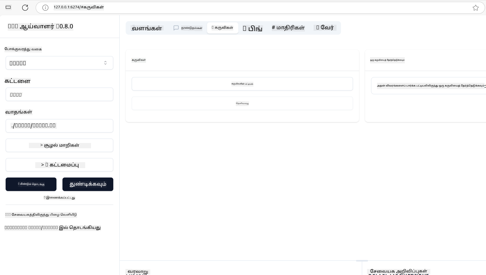
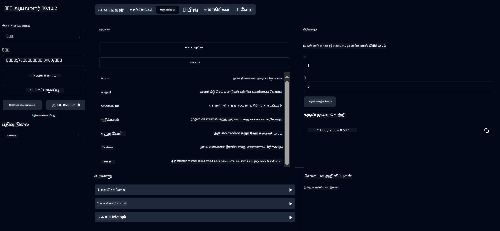
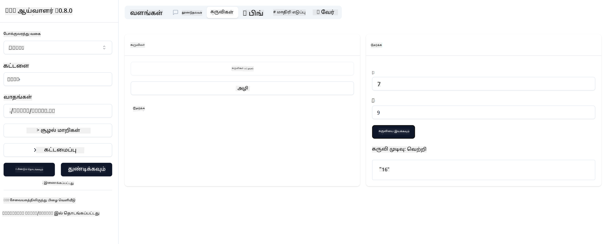

<!--
CO_OP_TRANSLATOR_METADATA:
{
  "original_hash": "ec11ee93f31fdadd94facd3e3d22f9e6",
  "translation_date": "2025-10-11T11:42:58+00:00",
  "source_file": "03-GettingStarted/01-first-server/README.md",
  "language_code": "ta"
}
-->
# MCP தொடங்குதல்

Model Context Protocol (MCP) உடன் உங்கள் முதல் படிகளை வரவேற்கிறோம்! MCP-இல் புதியவராக இருந்தாலும் அல்லது உங்கள் புரிதலை ஆழமாக்க விரும்பினாலும், இந்த வழிகாட்டி முக்கிய அமைப்பு மற்றும் மேம்பாட்டு செயல்முறையை உங்களுக்குக் காட்டும். MCP AI மாதிரிகள் மற்றும் பயன்பாடுகளுக்கு இடையே எளிதான ஒருங்கிணைப்பை எப்படி செயல்படுத்துகிறது என்பதை நீங்கள் கண்டறிந்து, MCP-இல் இயங்கும் தீர்வுகளை உருவாக்க மற்றும் சோதிக்க உங்கள் சூழலை விரைவாக தயாரிக்க எப்படி என்பதைப் படிப்பீர்கள்.

> TLDR; நீங்கள் AI பயன்பாடுகளை உருவாக்கினால், LLM (பெரிய மொழி மாதிரி) க்கு கருவிகள் மற்றும் பிற வளங்களைச் சேர்க்கலாம், இதனால் LLM மேலும் அறிவார்ந்ததாக இருக்கும். ஆனால் அந்த கருவிகள் மற்றும் வளங்களை ஒரு சர்வரில் வைத்தால், அந்த பயன்பாடு மற்றும் சர்வர் திறன்களை LLM உடன்/இல்லாமல் எந்தவொரு கிளையன்டும் பயன்படுத்த முடியும்.

## மேற்பார்வை

இந்த பாடம் MCP சூழல்களை அமைப்பதற்கும் உங்கள் முதல் MCP பயன்பாடுகளை உருவாக்குவதற்கும் நடைமுறை வழிகாட்டுதலை வழங்குகிறது. தேவையான கருவிகள் மற்றும் கட்டமைப்புகளை அமைப்பது, அடிப்படை MCP சர்வர்களை உருவாக்குவது, ஹோஸ்ட் பயன்பாடுகளை உருவாக்குவது மற்றும் உங்கள் செயல்பாடுகளை சோதிப்பது ஆகியவற்றை நீங்கள் கற்றுக்கொள்வீர்கள்.

Model Context Protocol (MCP) என்பது LLM க்கு பயன்பாடுகள் சூழலை வழங்கும் முறையை மையமாக்கும் ஒரு திறந்த நெறிமுறை. MCP ஐ AI பயன்பாடுகளுக்கான USB-C போர்ட் போல நினைக்கவும் - இது AI மாதிரிகளை பல்வேறு தரவூட்டங்கள் மற்றும் கருவிகளுடன் இணைக்க ஒரு மையமயமான வழியை வழங்குகிறது.

## கற்றல் நோக்கங்கள்

இந்த பாடத்தின் முடிவில், நீங்கள்:

- C#, Java, Python, TypeScript, மற்றும் Rust ஆகியவற்றில் MCP க்கான மேம்பாட்டு சூழல்களை அமைக்க
- தனிப்பயன் அம்சங்களுடன் (வளங்கள், உந்துதல்கள், மற்றும் கருவிகள்) அடிப்படை MCP சர்வர்களை உருவாக்க மற்றும் பிரசுரிக்க
- MCP சர்வர்களுடன் இணைக்கும் ஹோஸ்ட் பயன்பாடுகளை உருவாக்க
- MCP செயல்பாடுகளை சோதிக்க மற்றும் பிழைகளை சரிசெய்ய

## MCP சூழலை அமைத்தல்

MCP உடன் வேலை செய்யத் தொடங்குவதற்கு முன், உங்கள் மேம்பாட்டு சூழலைத் தயாரித்து அடிப்படை வேலைப்பாட்டை புரிந்துகொள்வது முக்கியம். MCP உடன் எளிதாக தொடங்குவதற்கான ஆரம்ப அமைப்பு படிகளை இந்த பிரிவு உங்களுக்கு வழிகாட்டும்.

### முன் தேவைகள்

MCP மேம்பாட்டில் இறங்குவதற்கு முன், உங்களிடம் இருக்க வேண்டும்:

- **மேம்பாட்டு சூழல்**: நீங்கள் தேர்ந்தெடுத்த மொழிக்கான (C#, Java, Python, TypeScript, அல்லது Rust)
- **IDE/தொகுப்பி**: Visual Studio, Visual Studio Code, IntelliJ, Eclipse, PyCharm, அல்லது எந்தவொரு நவீன குறியீட்டு தொகுப்பி
- **பேக்கேஜ் மேலாளர்கள்**: NuGet, Maven/Gradle, pip, npm/yarn, அல்லது Cargo
- **API விசைகள்**: உங்கள் ஹோஸ்ட் பயன்பாடுகளில் பயன்படுத்த திட்டமிட்ட AI சேவைகளுக்கான

## அடிப்படை MCP சர்வர் அமைப்பு

ஒரு MCP சர்வர் பொதுவாக அடங்கும்:

- **சர்வர் கட்டமைப்பு**: போர்ட், அங்கீகாரம் மற்றும் பிற அமைப்புகளை அமைத்தல்
- **வளங்கள்**: LLM க்கு கிடைக்க கூடிய தரவுகள் மற்றும் சூழல்
- **கருவிகள்**: மாதிரிகள் அழைக்கக்கூடிய செயல்பாடுகள்
- **உந்துதல்கள்**: உரை உருவாக்க அல்லது அமைப்பதற்கான வார்ப்புருக்கள்

TypeScript இல் ஒரு எளிய எடுத்துக்காட்டை இங்கே காணலாம்:

```typescript
import { McpServer, ResourceTemplate } from "@modelcontextprotocol/sdk/server/mcp.js";
import { StdioServerTransport } from "@modelcontextprotocol/sdk/server/stdio.js";
import { z } from "zod";

// Create an MCP server
const server = new McpServer({
  name: "Demo",
  version: "1.0.0"
});

// Add an addition tool
server.tool("add",
  { a: z.number(), b: z.number() },
  async ({ a, b }) => ({
    content: [{ type: "text", text: String(a + b) }]
  })
);

// Add a dynamic greeting resource
server.resource(
  "file",
  // The 'list' parameter controls how the resource lists available files. Setting it to undefined disables listing for this resource.
  new ResourceTemplate("file://{path}", { list: undefined }),
  async (uri, { path }) => ({
    contents: [{
      uri: uri.href,
      text: `File, ${path}!`
    }]
  })
);

// Add a file resource that reads the file contents
server.resource(
  "file",
  new ResourceTemplate("file://{path}", { list: undefined }),
  async (uri, { path }) => {
    let text;
    try {
      text = await fs.readFile(path, "utf8");
    } catch (err) {
      text = `Error reading file: ${err.message}`;
    }
    return {
      contents: [{
        uri: uri.href,
        text
      }]
    };
  }
);

server.prompt(
  "review-code",
  { code: z.string() },
  ({ code }) => ({
    messages: [{
      role: "user",
      content: {
        type: "text",
        text: `Please review this code:\n\n${code}`
      }
    }]
  })
);

// Start receiving messages on stdin and sending messages on stdout
const transport = new StdioServerTransport();
await server.connect(transport);
```

மேலே உள்ள குறியீட்டில் நாம்:

- MCP TypeScript SDK இல் இருந்து தேவையான வகுப்புகளை இறக்குமதி செய்கிறோம்.
- புதிய MCP சர்வர் நிகழ்வை உருவாக்கி அமைக்கிறோம்.
- ஒரு தனிப்பயன் கருவியை (`calculator`) ஒரு கைப்பிடி செயல்பாட்டுடன் பதிவு செய்கிறோம்.
- MCP கோரிக்கைகளை வரவேற்க சர்வரை தொடங்குகிறோம்.

## சோதனை மற்றும் பிழைதிருத்தம்

MCP சர்வரை சோதனை செய்யத் தொடங்குவதற்கு முன், கிடைக்கக்கூடிய கருவிகள் மற்றும் பிழைதிருத்தத்திற்கான சிறந்த நடைமுறைகளைப் புரிந்துகொள்வது முக்கியம். பயனுள்ள சோதனை உங்கள் சர்வர் எதிர்பார்த்தபடி செயல்படுவதை உறுதிப்படுத்துகிறது மற்றும் பிரச்சினைகளை விரைவாக அடையாளம் காண உதவுகிறது. MCP செயல்பாட்டை சரிபார்ப்பதற்கான பரிந்துரைக்கப்பட்ட அணுகுமுறைகளை பின்வரும் பிரிவு விளக்குகிறது.

MCP உங்கள் சர்வர்களை சோதிக்க மற்றும் பிழைதிருத்த உதவும் கருவிகளை வழங்குகிறது:

- **Inspector tool**, இந்த கிராஃபிகல் இடைமுகம் உங்கள் சர்வருடன் இணைந்து உங்கள் கருவிகள், உந்துதல்கள் மற்றும் வளங்களை சோதிக்க அனுமதிக்கிறது.
- **curl**, நீங்கள் curl போன்ற கட்டளைகள் அல்லது HTTP கட்டளைகளை உருவாக்க மற்றும் இயக்கக்கூடிய பிற கிளையன்ட்களைப் பயன்படுத்தி உங்கள் சர்வருடன் இணைக்கலாம்.

### MCP Inspector ஐ பயன்படுத்துதல்

[MCP Inspector](https://github.com/modelcontextprotocol/inspector) என்பது உங்கள் MCP சர்வர்களை சோதிக்க உதவும் ஒரு காட்சிப்படுத்தல் சோதனை கருவி:

1. **சர்வர் திறன்களை கண்டறிதல்**: கிடைக்கக்கூடிய வளங்கள், கருவிகள் மற்றும் உந்துதல்களை தானாகவே கண்டறிய
2. **கருவி செயல்பாட்டை சோதிக்க**: பல்வேறு அளவுருக்களை முயற்சித்து நேரடி பதில்களைப் பார்க்க
3. **சர்வர் மெட்டாடேட்டாவை பார்க்க**: சர்வர் தகவல், ஸ்கீமாக்கள் மற்றும் கட்டமைப்புகளை ஆய்வு செய்ய

```bash
# ex TypeScript, installing and running MCP Inspector
npx @modelcontextprotocol/inspector node build/index.js
```

மேலே உள்ள கட்டளைகளை இயக்கும்போது, MCP Inspector உங்கள் உலாவியில் உள்ளூர் வலை இடைமுகத்தைத் தொடங்கும். MCP சர்வர்கள், அவற்றின் கிடைக்கக்கூடிய கருவிகள், வளங்கள் மற்றும் உந்துதல்கள் ஆகியவற்றை காட்டும் ஒரு டாஷ்போர்டை நீங்கள் எதிர்பார்க்கலாம். இந்த இடைமுகம் கருவி செயல்பாட்டை இடைமுகமாக சோதிக்க, சர்வர் மெட்டாடேட்டாவை ஆய்வு செய்ய மற்றும் நேரடி பதில்களைப் பார்க்க அனுமதிக்கிறது, இது உங்கள் MCP சர்வர் செயல்பாடுகளை சரிபார்க்க மற்றும் பிழைதிருத்த எளிதாக்குகிறது.

இது எப்படி தோன்றும் என்பதை காட்டும் ஒரு ஸ்கிரீன்ஷாட் இங்கே:



## பொதுவான அமைப்பு பிரச்சினைகள் மற்றும் தீர்வுகள்

| பிரச்சினை | சாத்தியமான தீர்வு |
|-------|-------------------|
| இணைப்பு மறுக்கப்பட்டது | சர்வர் இயங்குகிறதா மற்றும் போர்ட் சரியானதா என்பதை சரிபார்க்கவும் |
| கருவி செயல்பாட்டு பிழைகள் | அளவுரு சரிபார்ப்பு மற்றும் பிழை கையாளுதலை ஆய்வு செய்யவும் |
| அங்கீகாரம் தோல்வி | API விசைகள் மற்றும் அனுமதிகளை சரிபார்க்கவும் |
| ஸ்கீமா சரிபார்ப்பு பிழைகள் | அளவுருக்கள் வரையறுக்கப்பட்ட ஸ்கீமாவுடன் பொருந்துகிறதா என்பதை உறுதிப்படுத்தவும் |
| சர்வர் தொடங்கவில்லை | போர்ட் மோதல்கள் அல்லது காணாமல் போன சார்புகளைச் சரிபார்க்கவும் |
| CORS பிழைகள் | குறுக்குவழி கோரிக்கைகளுக்கான சரியான CORS தலைப்புகளை அமைக்கவும் |
| அங்கீகாரம் பிரச்சினைகள் | டோக்கன் செல்லுபடியாகும் மற்றும் அனுமதிகளை சரிபார்க்கவும் |

## உள்ளூர் மேம்பாடு

உள்ளூர் மேம்பாடு மற்றும் சோதனைக்காக, MCP சர்வர்களை உங்கள் கணினியில் நேரடியாக இயக்கலாம்:

1. **சர்வர் செயல்முறையை தொடங்கவும்**: உங்கள் MCP சர்வர் பயன்பாட்டை இயக்கவும்
2. **நெட்வொர்க்கிங் அமைக்கவும்**: சர்வர் எதிர்பார்க்கப்பட்ட போர்டில் அணுகக்கூடியதாக இருக்குமா என்பதை உறுதிப்படுத்தவும்
3. **கிளையன்ட்களை இணைக்கவும்**: `http://localhost:3000` போன்ற உள்ளூர் இணைப்பு URL களைப் பயன்படுத்தவும்

```bash
# Example: Running a TypeScript MCP server locally
npm run start
# Server running at http://localhost:3000
```

## உங்கள் முதல் MCP சர்வரை உருவாக்குதல்

நாம் [முக்கிய கருத்துக்கள்](/01-CoreConcepts/README.md) பற்றி முந்தைய பாடத்தில் கற்றுக்கொண்டோம், இப்போது அந்த அறிவை செயல்படுத்த நேரம்.

### சர்வர் என்ன செய்ய முடியும்

குறியீடு எழுதத் தொடங்குவதற்கு முன், சர்வர் என்ன செய்ய முடியும் என்பதை நினைவில் கொள்வோம்:

ஒரு MCP சர்வர் உதாரணமாக:

- உள்ளூர் கோப்புகள் மற்றும் தரவுத்தொகுப்புகளை அணுக
- தொலை API களை இணைக்க
- கணக்கீடுகளைச் செய்ய
- பிற கருவிகள் மற்றும் சேவைகளுடன் ஒருங்கிணைக்க
- தொடர்பு கொள்ள ஒரு பயனர் இடைமுகத்தை வழங்க

சரி, இப்போது நாம் இதற்கு என்ன செய்ய முடியும் என்பதை தெரிந்துகொண்டோம், குறியீடு எழுதத் தொடங்குவோம்.

## பயிற்சி: ஒரு சர்வரை உருவாக்குதல்

ஒரு சர்வரை உருவாக்க, நீங்கள் இந்த படிகளை பின்பற்ற வேண்டும்:

- MCP SDK ஐ நிறுவவும்.
- ஒரு திட்டத்தை உருவாக்கி திட்ட அமைப்பை அமைக்கவும்.
- சர்வர் குறியீட்டை எழுதவும்.
- சர்வரை சோதிக்கவும்.

### -1- திட்டத்தை உருவாக்குதல்

#### TypeScript

```sh
# Create project directory and initialize npm project
mkdir calculator-server
cd calculator-server
npm init -y
```

#### Python

```sh
# Create project dir
mkdir calculator-server
cd calculator-server
# Open the folder in Visual Studio Code - Skip this if you are using a different IDE
code .
```

#### .NET

```sh
dotnet new console -n McpCalculatorServer
cd McpCalculatorServer
```

#### Java

Java க்கான Spring Boot திட்டத்தை உருவாக்கவும்:

```bash
curl https://start.spring.io/starter.zip \
  -d dependencies=web \
  -d javaVersion=21 \
  -d type=maven-project \
  -d groupId=com.example \
  -d artifactId=calculator-server \
  -d name=McpServer \
  -d packageName=com.microsoft.mcp.sample.server \
  -o calculator-server.zip
```

ZIP கோப்பை வெளியேற்றவும்:

```bash
unzip calculator-server.zip -d calculator-server
cd calculator-server
# optional remove the unused test
rm -rf src/test/java
```

உங்கள் *pom.xml* கோப்பில் பின்வரும் முழுமையான கட்டமைப்பைச் சேர்க்கவும்:

```xml
<?xml version="1.0" encoding="UTF-8"?>
<project xmlns="http://maven.apache.org/POM/4.0.0"
    xmlns:xsi="http://www.w3.org/2001/XMLSchema-instance"
    xsi:schemaLocation="http://maven.apache.org/POM/4.0.0 http://maven.apache.org/xsd/maven-4.0.0.xsd">
    <modelVersion>4.0.0</modelVersion>
    
    <!-- Spring Boot parent for dependency management -->
    <parent>
        <groupId>org.springframework.boot</groupId>
        <artifactId>spring-boot-starter-parent</artifactId>
        <version>3.5.0</version>
        <relativePath />
    </parent>

    <!-- Project coordinates -->
    <groupId>com.example</groupId>
    <artifactId>calculator-server</artifactId>
    <version>0.0.1-SNAPSHOT</version>
    <name>Calculator Server</name>
    <description>Basic calculator MCP service for beginners</description>

    <!-- Properties -->
    <properties>
        <java.version>21</java.version>
        <maven.compiler.source>21</maven.compiler.source>
        <maven.compiler.target>21</maven.compiler.target>
    </properties>

    <!-- Spring AI BOM for version management -->
    <dependencyManagement>
        <dependencies>
            <dependency>
                <groupId>org.springframework.ai</groupId>
                <artifactId>spring-ai-bom</artifactId>
                <version>1.0.0-SNAPSHOT</version>
                <type>pom</type>
                <scope>import</scope>
            </dependency>
        </dependencies>
    </dependencyManagement>

    <!-- Dependencies -->
    <dependencies>
        <dependency>
            <groupId>org.springframework.ai</groupId>
            <artifactId>spring-ai-starter-mcp-server-webflux</artifactId>
        </dependency>
        <dependency>
            <groupId>org.springframework.boot</groupId>
            <artifactId>spring-boot-starter-actuator</artifactId>
        </dependency>
        <dependency>
         <groupId>org.springframework.boot</groupId>
         <artifactId>spring-boot-starter-test</artifactId>
         <scope>test</scope>
      </dependency>
    </dependencies>

    <!-- Build configuration -->
    <build>
        <plugins>
            <plugin>
                <groupId>org.springframework.boot</groupId>
                <artifactId>spring-boot-maven-plugin</artifactId>
            </plugin>
            <plugin>
                <groupId>org.apache.maven.plugins</groupId>
                <artifactId>maven-compiler-plugin</artifactId>
                <configuration>
                    <release>21</release>
                </configuration>
            </plugin>
        </plugins>
    </build>

    <!-- Repositories for Spring AI snapshots -->
    <repositories>
        <repository>
            <id>spring-milestones</id>
            <name>Spring Milestones</name>
            <url>https://repo.spring.io/milestone</url>
            <snapshots>
                <enabled>false</enabled>
            </snapshots>
        </repository>
        <repository>
            <id>spring-snapshots</id>
            <name>Spring Snapshots</name>
            <url>https://repo.spring.io/snapshot</url>
            <releases>
                <enabled>false</enabled>
            </releases>
        </repository>
    </repositories>
</project>
```

#### Rust

```sh
mkdir calculator-server
cd calculator-server
cargo init
```

### -2- சார்புகளைச் சேர்க்கவும்

இப்போது உங்கள் திட்டம் உருவாக்கப்பட்டுள்ளது, அடுத்ததாக சார்புகளைச் சேர்ப்போம்:

#### TypeScript

```sh
# If not already installed, install TypeScript globally
npm install typescript -g

# Install the MCP SDK and Zod for schema validation
npm install @modelcontextprotocol/sdk zod
npm install -D @types/node typescript
```

#### Python

```sh
# Create a virtual env and install dependencies
python -m venv venv
venv\Scripts\activate
pip install "mcp[cli]"
```

#### Java

```bash
cd calculator-server
./mvnw clean install -DskipTests
```

#### Rust

```sh
cargo add rmcp --features server,transport-io
cargo add serde
cargo add tokio --features rt-multi-thread
```

### -3- திட்ட கோப்புகளை உருவாக்குதல்

#### TypeScript

*package.json* கோப்பைத் திறந்து, சர்வரை உருவாக்க மற்றும் இயக்க நீங்கள் உறுதிப்படுத்த, பின்வரும் உள்ளடக்கத்துடன் உள்ளடக்கத்தை மாற்றவும்:

```json
{
  "name": "calculator-server",
  "version": "1.0.0",
  "main": "index.js",
  "type": "module",
  "scripts": {
    "start": "tsc && node ./build/index.js",
    "build": "tsc && node ./build/index.js"
  },
  "keywords": [],
  "author": "",
  "license": "ISC",
  "description": "A simple calculator server using Model Context Protocol",
  "dependencies": {
    "@modelcontextprotocol/sdk": "^1.16.0",
    "zod": "^3.25.76"
  },
  "devDependencies": {
    "@types/node": "^24.0.14",
    "typescript": "^5.8.3"
  }
}
```

பின்வரும் உள்ளடக்கத்துடன் *tsconfig.json* ஐ உருவாக்கவும்:

```json
{
  "compilerOptions": {
    "target": "ES2022",
    "module": "Node16",
    "moduleResolution": "Node16",
    "outDir": "./build",
    "rootDir": "./src",
    "strict": true,
    "esModuleInterop": true,
    "skipLibCheck": true,
    "forceConsistentCasingInFileNames": true
  },
  "include": ["src/**/*"],
  "exclude": ["node_modules"]
}
```

உங்கள் மூல குறியீட்டிற்கான ஒரு அடைவை உருவாக்கவும்:

```sh
mkdir src
touch src/index.ts
```

#### Python

*server.py* என்ற ஒரு கோப்பை உருவாக்கவும்

```sh
touch server.py
```

#### .NET

தேவையான NuGet பேக்கேஜ்களை நிறுவவும்:

```sh
dotnet add package ModelContextProtocol --prerelease
dotnet add package Microsoft.Extensions.Hosting
```

#### Java

Java Spring Boot திட்டங்களுக்கு, திட்ட அமைப்பு தானாகவே உருவாக்கப்படுகிறது.

#### Rust

Rust க்காக, `cargo init` இயக்கும்போது *src/main.rs* கோப்பு இயல்பாக உருவாக்கப்படுகிறது. கோப்பைத் திறந்து இயல்பான குறியீட்டை நீக்கவும்.

### -4- சர்வர் குறியீட்டை உருவாக்குதல்

#### TypeScript

*index.ts* என்ற ஒரு கோப்பை உருவாக்கி பின்வரும் குறியீட்டைச் சேர்க்கவும்:

```typescript
import { McpServer, ResourceTemplate } from "@modelcontextprotocol/sdk/server/mcp.js";
import { StdioServerTransport } from "@modelcontextprotocol/sdk/server/stdio.js";
import { z } from "zod";
 
// Create an MCP server
const server = new McpServer({
  name: "Calculator MCP Server",
  version: "1.0.0"
});
```

இப்போது உங்களிடம் ஒரு சர்வர் உள்ளது, ஆனால் இது அதிகம் செய்யவில்லை, அதை சரிசெய்வோம்.

#### Python

```python
# server.py
from mcp.server.fastmcp import FastMCP

# Create an MCP server
mcp = FastMCP("Demo")
```

#### .NET

```csharp
using Microsoft.Extensions.DependencyInjection;
using Microsoft.Extensions.Hosting;
using Microsoft.Extensions.Logging;
using ModelContextProtocol.Server;
using System.ComponentModel;

var builder = Host.CreateApplicationBuilder(args);
builder.Logging.AddConsole(consoleLogOptions =>
{
    // Configure all logs to go to stderr
    consoleLogOptions.LogToStandardErrorThreshold = LogLevel.Trace;
});

builder.Services
    .AddMcpServer()
    .WithStdioServerTransport()
    .WithToolsFromAssembly();
await builder.Build().RunAsync();

// add features
```

#### Java

Java க்காக, முக்கிய சர்வர் கூறுகளை உருவாக்கவும். முதலில், முக்கிய பயன்பாட்டு வகையை மாற்றவும்:

*src/main/java/com/microsoft/mcp/sample/server/McpServerApplication.java*:

```java
package com.microsoft.mcp.sample.server;

import org.springframework.ai.tool.ToolCallbackProvider;
import org.springframework.ai.tool.method.MethodToolCallbackProvider;
import org.springframework.boot.SpringApplication;
import org.springframework.boot.autoconfigure.SpringBootApplication;
import org.springframework.context.annotation.Bean;
import com.microsoft.mcp.sample.server.service.CalculatorService;

@SpringBootApplication
public class McpServerApplication {

    public static void main(String[] args) {
        SpringApplication.run(McpServerApplication.class, args);
    }
    
    @Bean
    public ToolCallbackProvider calculatorTools(CalculatorService calculator) {
        return MethodToolCallbackProvider.builder().toolObjects(calculator).build();
    }
}
```

கணக்கீடு சேவையை உருவாக்கவும் *src/main/java/com/microsoft/mcp/sample/server/service/CalculatorService.java*:

```java
package com.microsoft.mcp.sample.server.service;

import org.springframework.ai.tool.annotation.Tool;
import org.springframework.stereotype.Service;

/**
 * Service for basic calculator operations.
 * This service provides simple calculator functionality through MCP.
 */
@Service
public class CalculatorService {

    /**
     * Add two numbers
     * @param a The first number
     * @param b The second number
     * @return The sum of the two numbers
     */
    @Tool(description = "Add two numbers together")
    public String add(double a, double b) {
        double result = a + b;
        return formatResult(a, "+", b, result);
    }

    /**
     * Subtract one number from another
     * @param a The number to subtract from
     * @param b The number to subtract
     * @return The result of the subtraction
     */
    @Tool(description = "Subtract the second number from the first number")
    public String subtract(double a, double b) {
        double result = a - b;
        return formatResult(a, "-", b, result);
    }

    /**
     * Multiply two numbers
     * @param a The first number
     * @param b The second number
     * @return The product of the two numbers
     */
    @Tool(description = "Multiply two numbers together")
    public String multiply(double a, double b) {
        double result = a * b;
        return formatResult(a, "*", b, result);
    }

    /**
     * Divide one number by another
     * @param a The numerator
     * @param b The denominator
     * @return The result of the division
     */
    @Tool(description = "Divide the first number by the second number")
    public String divide(double a, double b) {
        if (b == 0) {
            return "Error: Cannot divide by zero";
        }
        double result = a / b;
        return formatResult(a, "/", b, result);
    }

    /**
     * Calculate the power of a number
     * @param base The base number
     * @param exponent The exponent
     * @return The result of raising the base to the exponent
     */
    @Tool(description = "Calculate the power of a number (base raised to an exponent)")
    public String power(double base, double exponent) {
        double result = Math.pow(base, exponent);
        return formatResult(base, "^", exponent, result);
    }

    /**
     * Calculate the square root of a number
     * @param number The number to find the square root of
     * @return The square root of the number
     */
    @Tool(description = "Calculate the square root of a number")
    public String squareRoot(double number) {
        if (number < 0) {
            return "Error: Cannot calculate square root of a negative number";
        }
        double result = Math.sqrt(number);
        return String.format("√%.2f = %.2f", number, result);
    }

    /**
     * Calculate the modulus (remainder) of division
     * @param a The dividend
     * @param b The divisor
     * @return The remainder of the division
     */
    @Tool(description = "Calculate the remainder when one number is divided by another")
    public String modulus(double a, double b) {
        if (b == 0) {
            return "Error: Cannot divide by zero";
        }
        double result = a % b;
        return formatResult(a, "%", b, result);
    }

    /**
     * Calculate the absolute value of a number
     * @param number The number to find the absolute value of
     * @return The absolute value of the number
     */
    @Tool(description = "Calculate the absolute value of a number")
    public String absolute(double number) {
        double result = Math.abs(number);
        return String.format("|%.2f| = %.2f", number, result);
    }

    /**
     * Get help about available calculator operations
     * @return Information about available operations
     */
    @Tool(description = "Get help about available calculator operations")
    public String help() {
        return "Basic Calculator MCP Service\n\n" +
               "Available operations:\n" +
               "1. add(a, b) - Adds two numbers\n" +
               "2. subtract(a, b) - Subtracts the second number from the first\n" +
               "3. multiply(a, b) - Multiplies two numbers\n" +
               "4. divide(a, b) - Divides the first number by the second\n" +
               "5. power(base, exponent) - Raises a number to a power\n" +
               "6. squareRoot(number) - Calculates the square root\n" + 
               "7. modulus(a, b) - Calculates the remainder of division\n" +
               "8. absolute(number) - Calculates the absolute value\n\n" +
               "Example usage: add(5, 3) will return 5 + 3 = 8";
    }

    /**
     * Format the result of a calculation
     */
    private String formatResult(double a, String operator, double b, double result) {
        return String.format("%.2f %s %.2f = %.2f", a, operator, b, result);
    }
}
```

**தயாரிப்பு-தயார் சேவைக்கான விருப்ப கூறுகள்:**

தொடக்க கட்டமைப்பை உருவாக்கவும் *src/main/java/com/microsoft/mcp/sample/server/config/StartupConfig.java*:

```java
package com.microsoft.mcp.sample.server.config;

import org.springframework.boot.CommandLineRunner;
import org.springframework.context.annotation.Bean;
import org.springframework.context.annotation.Configuration;

@Configuration
public class StartupConfig {
    
    @Bean
    public CommandLineRunner startupInfo() {
        return args -> {
            System.out.println("\n" + "=".repeat(60));
            System.out.println("Calculator MCP Server is starting...");
            System.out.println("SSE endpoint: http://localhost:8080/sse");
            System.out.println("Health check: http://localhost:8080/actuator/health");
            System.out.println("=".repeat(60) + "\n");
        };
    }
}
```

சுகாதார கட்டுப்பாட்டாளரை உருவாக்கவும் *src/main/java/com/microsoft/mcp/sample/server/controller/HealthController.java*:

```java
package com.microsoft.mcp.sample.server.controller;

import org.springframework.http.ResponseEntity;
import org.springframework.web.bind.annotation.GetMapping;
import org.springframework.web.bind.annotation.RestController;
import java.time.LocalDateTime;
import java.util.HashMap;
import java.util.Map;

@RestController
public class HealthController {
    
    @GetMapping("/health")
    public ResponseEntity<Map<String, Object>> healthCheck() {
        Map<String, Object> response = new HashMap<>();
        response.put("status", "UP");
        response.put("timestamp", LocalDateTime.now().toString());
        response.put("service", "Calculator MCP Server");
        return ResponseEntity.ok(response);
    }
}
```

விலக்கு கையாளுநரை உருவாக்கவும் *src/main/java/com/microsoft/mcp/sample/server/exception/GlobalExceptionHandler.java*:

```java
package com.microsoft.mcp.sample.server.exception;

import org.springframework.http.HttpStatus;
import org.springframework.http.ResponseEntity;
import org.springframework.web.bind.annotation.ExceptionHandler;
import org.springframework.web.bind.annotation.RestControllerAdvice;

@RestControllerAdvice
public class GlobalExceptionHandler {

    @ExceptionHandler(IllegalArgumentException.class)
    public ResponseEntity<ErrorResponse> handleIllegalArgumentException(IllegalArgumentException ex) {
        ErrorResponse error = new ErrorResponse(
            "Invalid_Input", 
            "Invalid input parameter: " + ex.getMessage());
        return new ResponseEntity<>(error, HttpStatus.BAD_REQUEST);
    }

    public static class ErrorResponse {
        private String code;
        private String message;

        public ErrorResponse(String code, String message) {
            this.code = code;
            this.message = message;
        }

        // Getters
        public String getCode() { return code; }
        public String getMessage() { return message; }
    }
}
```

தனிப்பயன் பேனர் உருவாக்கவும் *src/main/resources/banner.txt*:

```text
_____      _            _       _             
 / ____|    | |          | |     | |            
| |     __ _| | ___ _   _| | __ _| |_ ___  _ __ 
| |    / _` | |/ __| | | | |/ _` | __/ _ \| '__|
| |___| (_| | | (__| |_| | | (_| | || (_) | |   
 \_____\__,_|_|\___|\__,_|_|\__,_|\__\___/|_|   
                                                
Calculator MCP Server v1.0
Spring Boot MCP Application
```

</details>

#### Rust

*src/main.rs* கோப்பின் மேல் பின்வரும் குறியீட்டைச் சேர்க்கவும். இது உங்கள் MCP சர்வருக்கான தேவையான நூலகங்கள் மற்றும் தொகுதிகளை இறக்குமதி செய்கிறது.

```rust
use rmcp::{
    handler::server::{router::tool::ToolRouter, tool::Parameters},
    model::{ServerCapabilities, ServerInfo},
    schemars, tool, tool_handler, tool_router,
    transport::stdio,
    ServerHandler, ServiceExt,
};
use std::error::Error;
```

கணக்கீடு கோரிக்கையை பிரதிநிதித்துவப்படுத்த ஒரு struct ஐ உருவாக்குவோம்.

```rust
#[derive(Debug, serde::Deserialize, schemars::JsonSchema)]
pub struct CalculatorRequest {
    pub a: f64,
    pub b: f64,
}
```

அடுத்ததாக, கணக்கீடு சர்வரை பிரதிநிதித்துவப்படுத்த ஒரு struct ஐ உருவாக்கவும். இந்த struct கருவி ரவுடரை வைத்திருக்கும், இது கருவிகளை பதிவு செய்ய பயன்படுத்தப்படுகிறது.

```rust
#[derive(Debug, Clone)]
pub struct Calculator {
    tool_router: ToolRouter<Self>,
}
```

இப்போது, சர்வர் தகவலை வழங்க சர்வர் கைப்பிடியை செயல்படுத்த `Calculator` struct ஐ செயல்படுத்தலாம்.

```rust
#[tool_router]
impl Calculator {
    pub fn new() -> Self {
        Self {
            tool_router: Self::tool_router(),
        }
    }
}

#[tool_handler]
impl ServerHandler for Calculator {
    fn get_info(&self) -> ServerInfo {
        ServerInfo {
            instructions: Some("A simple calculator tool".into()),
            capabilities: ServerCapabilities::builder().enable_tools().build(),
            ..Default::default()
        }
    }
}
```

இறுதியாக, சர்வரை தொடங்க முக்கிய செயல்பாட்டை செயல்படுத்த வேண்டும். இந்த செயல்பாடு `Calculator` struct இன் ஒரு நிகழ்வை உருவாக்கி அதை நிலையான உள்ளீடு/வெளியீட்டில் வழங்கும்.

```rust
#[tokio::main]
async fn main() -> Result<(), Box<dyn Error>> {
    let service = Calculator::new().serve(stdio()).await?;
    service.waiting().await?;
    Ok(())
}
```

சர்வர் தற்போது தன்னுடைய அடிப்படை தகவலை வழங்க அமைக்கப்பட்டுள்ளது. அடுத்ததாக, கூட்டைச் செய்ய ஒரு கருவியைச் சேர்ப்போம்.

### -5- ஒரு கருவி மற்றும் ஒரு வளத்தைச் சேர்க்க

ஒரு கருவி மற்றும் ஒரு வளத்தை பின்வரும் குறியீட்டைச் சேர்த்து சேர்க்கவும்:

#### TypeScript

```typescript
server.tool(
  "add",
  { a: z.number(), b: z.number() },
  async ({ a, b }) => ({
    content: [{ type: "text", text: String(a + b) }]
  })
);

server.resource(
  "greeting",
  new ResourceTemplate("greeting://{name}", { list: undefined }),
  async (uri, { name }) => ({
    contents: [{
      uri: uri.href,
      text: `Hello, ${name}!`
    }]
  })
);
```

உங்கள் கருவி `a` மற்றும் `b` என்ற அளவுருக்களை எடுத்துக்கொள்கிறது மற்றும் பின்வரும் வடிவத்தில் பதிலை உருவாக்கும் ஒரு செயல்பாட்டை இயக்குகிறது:

```typescript
{
  contents: [{
    type: "text", content: "some content"
  }]
}
```

உங்கள் வளம் "greeting" என்ற ஒரு string மூலம் அணுகப்படுகிறது மற்றும் `name` என்ற அளவுருவை எடுத்துக்கொள்கிறது மற்றும் கருவிக்கு ஒத்த பதிலை உருவாக்குகிறது:

```typescript
{
  uri: "<href>",
  text: "a text"
}
```

#### Python

```python
# Add an addition tool
@mcp.tool()
def add(a: int, b: int) -> int:
    """Add two numbers"""
    return a + b


# Add a dynamic greeting resource
@mcp.resource("greeting://{name}")
def get_greeting(name: str) -> str:
    """Get a personalized greeting"""
    return f"Hello, {name}!"
```

மேலே உள்ள குறியீட்டில் நாம்:

- `add` என்ற ஒரு கருவியை வரையறுத்துள்ளோம், இது இரண்டு integer அளவுருக்களை (`a` மற்றும் `p`) எடுத்துக்கொள்கிறது.
- `greeting` என்ற ஒரு வளத்தை உருவாக்கியுள்ளோம், இது `name` என்ற அளவுருவை எடுத்துக்கொள்கிறது.

#### .NET

உங்கள் Program.cs கோப்பில் இதைச் சேர்க்கவும்:

```csharp
[McpServerToolType]
public static class CalculatorTool
{
    [McpServerTool, Description("Adds two numbers")]
    public static string Add(int a, int b) => $"Sum {a + b}";
}
```

#### Java

கருவிகள் முந்தைய படியில் ஏற்கனவே உருவாக்கப்பட்டுள்ளன.

#### Rust

`impl Calculator` தொகுதிக்குள் ஒரு புதிய கருவியைச் சேர்க்கவும்:

```rust
#[tool(description = "Adds a and b")]
async fn add(
    &self,
    Parameters(CalculatorRequest { a, b }): Parameters<CalculatorRequest>,
) -> String {
    (a + b).to_string()
}
```

### -6- இறுதி குறியீடு

சர்வர் தொடங்க முடியும் வகையில் கடைசி குறியீட்டைச் சேர்ப்போம்:

#### TypeScript

```typescript
// Start receiving messages on stdin and sending messages on stdout
const transport = new StdioServerTransport();
await server.connect(transport);
```

முழு குறியீடு இங்கே:

```typescript
// index.ts
import { McpServer, ResourceTemplate } from "@modelcontextprotocol/sdk/server/mcp.js";
import { StdioServerTransport } from "@modelcontextprotocol/sdk/server/stdio.js";
import { z } from "zod";

// Create an MCP server
const server = new McpServer({
  name: "Calculator MCP Server",
  version: "1.0.0"
});

// Add an addition tool
server.tool(
  "add",
  { a: z.number(), b: z.number() },
  async ({ a, b }) => ({
    content: [{ type: "text", text: String(a + b) }]
  })
);

// Add a dynamic greeting resource
server.resource(
  "greeting",
  new ResourceTemplate("greeting://{name}", { list: undefined }),
  async (uri, { name }) => ({
    contents: [{
      uri: uri.href,
      text: `Hello, ${name}!`
    }]
  })
);

// Start receiving messages on stdin and sending messages on stdout
const transport = new StdioServerTransport();
server.connect(transport);
```

#### Python

```python
# server.py
from mcp.server.fastmcp import FastMCP

# Create an MCP server
mcp = FastMCP("Demo")


# Add an addition tool
@mcp.tool()
def add(a: int, b: int) -> int:
    """Add two numbers"""
    return a + b


# Add a dynamic greeting resource
@mcp.resource("greeting://{name}")
def get_greeting(name: str) -> str:
    """Get a personalized greeting"""
    return f"Hello, {name}!"

# Main execution block - this is required to run the server
if __name__ == "__main__":
    mcp.run()
```

#### .NET

பின்வரும் உள்ளடக்கத்துடன் Program.cs கோப்பை உருவாக்கவும்:

```csharp
using Microsoft.Extensions.DependencyInjection;
using Microsoft.Extensions.Hosting;
using Microsoft.Extensions.Logging;
using ModelContextProtocol.Server;
using System.ComponentModel;

var builder = Host.CreateApplicationBuilder(args);
builder.Logging.AddConsole(consoleLogOptions =>
{
    // Configure all logs to go to stderr
    consoleLogOptions.LogToStandardErrorThreshold = LogLevel.Trace;
});

builder.Services
    .AddMcpServer()
    .WithStdioServerTransport()
    .WithToolsFromAssembly();
await builder.Build().RunAsync();

[McpServerToolType]
public static class CalculatorTool
{
    [McpServerTool, Description("Adds two numbers")]
    public static string Add(int a, int b) => $"Sum {a + b}";
}
```

#### Java

உங்கள் முழுமையான முக்கிய பயன்பாட்டு வகை இவ்வாறு இருக்க வேண்டும்:

```java
// McpServerApplication.java
package com.microsoft.mcp.sample.server;

import org.springframework.ai.tool.ToolCallbackProvider;
import org.springframework.ai.tool.method.MethodToolCallbackProvider;
import org.springframework.boot.SpringApplication;
import org.springframework.boot.autoconfigure.SpringBootApplication;
import org.springframework.context.annotation.Bean;
import com.microsoft.mcp.sample.server.service.CalculatorService;

@SpringBootApplication
public class McpServerApplication {

    public static void main(String[] args) {
        SpringApplication.run(McpServerApplication.class, args);
    }
    
    @Bean
    public ToolCallbackProvider calculatorTools(CalculatorService calculator) {
        return MethodToolCallbackProvider.builder().toolObjects(calculator).build();
    }
}
```

#### Rust

Rust சர்வருக்கான இறுதி குறியீடு இவ்வாறு இருக்க வேண்டும்:

```rust
use rmcp::{
    ServerHandler, ServiceExt,
    handler::server::{router::tool::ToolRouter, tool::Parameters},
    model::{ServerCapabilities, ServerInfo},
    schemars, tool, tool_handler, tool_router,
    transport::stdio,
};
use std::error::Error;

#[derive(Debug, serde::Deserialize, schemars::JsonSchema)]
pub struct CalculatorRequest {
    pub a: f64,
    pub b: f64,
}

#[derive(Debug, Clone)]
pub struct Calculator {
    tool_router: ToolRouter<Self>,
}

#[tool_router]
impl Calculator {
    pub fn new() -> Self {
        Self {
            tool_router: Self::tool_router(),
        }
    }
    
    #[tool(description = "Adds a and b")]
    async fn add(
        &self,
        Parameters(CalculatorRequest { a, b }): Parameters<CalculatorRequest>,
    ) -> String {
        (a + b).to_string()
    }
}

#[tool_handler]
impl ServerHandler for Calculator {
    fn get_info(&self) -> ServerInfo {
        ServerInfo {
            instructions: Some("A simple calculator tool".into()),
            capabilities: ServerCapabilities::builder().enable_tools().build(),
            ..Default::default()
        }
    }
}

#[tokio::main]
async fn main() -> Result<(), Box<dyn Error>> {
    let service = Calculator::new().serve(stdio()).await?;
    service.waiting().await?;
    Ok(())
}
```

### -7- சர்வரை சோதிக்க

பின்வரும் கட்டளையைப் பயன்படுத்தி சர்வரை தொடங்கவும்:

#### TypeScript

```sh
npm run build
```

#### Python

```sh
mcp run server.py
```

> MCP Inspector ஐ பயன்படுத்த, `mcp dev server.py` ஐ பயன்படுத்தவும், இது தானாகவே Inspector ஐ தொடங்கி தேவையான proxy session token ஐ வழங்குகிறது. `mcp run server.py` ஐ பயன்படுத்தும்போது, நீங்கள் Inspector ஐ கையேடு முறையில் தொடங்கி இணைப்பை அமைக்க வேண்டும்.

#### .NET

உங்கள் திட்ட அடைவை உறுதிப்படுத்தவும்:

```sh
cd McpCalculatorServer
dotnet run
```

#### Java

```bash
./mvnw clean install -DskipTests
java -jar target/calculator-server-0.0.1-SNAPSHOT.jar
```

#### Rust

சர்வரை வடிவமைத்து இயக்க பின்வரும் கட்டளைகளை இயக்கவும்:

```sh
cargo fmt
cargo run
```

### -8- Inspector ஐ பயன்படுத்தி இயக்குதல்

Inspector என்பது உங்கள் சர்வரை தொடங்கி அதைச் செயல்படுத்த உங்களுக்கு உதவக்கூடிய ஒரு சிறந்த கருவி. அதைத் தொடங்குவோம்:

> [!NOTE]
> "command" புலத்தில் உங்கள் runtime உடன் சர்வரை இயக்குவதற்கான கட்டளையை உள்ளடக்கியதால் இது வேறுபடலாம்.

#### TypeScript

```sh
npx @modelcontextprotocol/inspector node build/index.js
```

அல்லது உங்கள் *package.json* இல் இதைச் சேர்க்கவும்: `"inspector": "npx @modelcontextprotocol/inspector node build/index.js"` மற்றும் `npm run inspector
`Command` புலத்தில் `python` மற்றும் `Arguments` புலத்தில் `server.py` அமைக்கவும். இது ஸ்கிரிப்ட் சரியாக இயங்குவதை உறுதிப்படுத்தும்.

#### .NET

உங்கள் திட்ட கோப்பகத்தில் இருப்பதை உறுதிப்படுத்தவும்:

```sh
cd McpCalculatorServer
npx @modelcontextprotocol/inspector dotnet run
```

#### Java

உங்கள் கணக்கீடு சர்வர் இயங்குவதை உறுதிப்படுத்தவும். 
பின்னர் இன்ஸ்பெக்டரை இயக்கவும்:

```cmd
npx @modelcontextprotocol/inspector
```

இன்ஸ்பெக்டர் வலை இடைமுகத்தில்:

1. "SSE" என்பதை போக்குவரத்து வகையாகத் தேர்ந்தெடுக்கவும்
2. URL ஐ `http://localhost:8080/sse` என அமைக்கவும்
3. "Connect" என்பதைக் கிளிக் செய்யவும்



**நீங்கள் சர்வருடன் இணைக்கப்பட்டுள்ளீர்கள்**
**Java சர்வர் சோதனை பிரிவு இப்போது முடிந்தது**

அடுத்த பிரிவு சர்வருடன் தொடர்பு கொள்ளுவது பற்றியது.

நீங்கள் பின்வரும் பயனர் இடைமுகத்தை காண வேண்டும்:


1. "Connect" பொத்தானைத் தேர்ந்தெடுத்து சர்வருடன் இணைக்கவும்.
   சர்வருடன் இணைந்தவுடன், நீங்கள் பின்வருவதை காண வேண்டும்:

   

1. "Tools" மற்றும் "listTools" என்பவற்றைத் தேர்ந்தெடுக்கவும், "Add" தோன்றும், அதைத் தேர்ந்தெடுத்து அளவுரு மதிப்புகளை நிரப்பவும்.

   நீங்கள் பின்வரும் பதிலை காண வேண்டும், அதாவது "add" கருவியின் முடிவு:

   

வாழ்த்துக்கள், நீங்கள் உங்கள் முதல் சர்வரை உருவாக்கி இயக்க முடிந்தது!

#### Rust

MCP Inspector CLI உடன் Rust சர்வரை இயக்க, பின்வரும் கட்டளையைப் பயன்படுத்தவும்:

```sh
npx @modelcontextprotocol/inspector cargo run --cli --method tools/call --tool-name add --tool-arg a=1 b=2
```

### அதிகாரப்பூர்வ SDKகள்

MCP பல மொழிகளுக்கான அதிகாரப்பூர்வ SDKகளை வழங்குகிறது:

- [C# SDK](https://github.com/modelcontextprotocol/csharp-sdk) - Microsoft உடன் இணைந்து பராமரிக்கப்படுகிறது
- [Java SDK](https://github.com/modelcontextprotocol/java-sdk) - Spring AI உடன் இணைந்து பராமரிக்கப்படுகிறது
- [TypeScript SDK](https://github.com/modelcontextprotocol/typescript-sdk) - அதிகாரப்பூர்வ TypeScript செயல்பாடு
- [Python SDK](https://github.com/modelcontextprotocol/python-sdk) - அதிகாரப்பூர்வ Python செயல்பாடு
- [Kotlin SDK](https://github.com/modelcontextprotocol/kotlin-sdk) - அதிகாரப்பூர்வ Kotlin செயல்பாடு
- [Swift SDK](https://github.com/modelcontextprotocol/swift-sdk) - Loopwork AI உடன் இணைந்து பராமரிக்கப்படுகிறது
- [Rust SDK](https://github.com/modelcontextprotocol/rust-sdk) - அதிகாரப்பூர்வ Rust செயல்பாடு

## முக்கிய குறிப்புகள்

- MCP மேம்பாட்டு சூழலை அமைப்பது மொழி-சிறப்பு SDKகளுடன் எளிதாக உள்ளது
- MCP சர்வர்களை உருவாக்குவது தெளிவான ஸ்கீமாக்களுடன் கருவிகளை உருவாக்கி பதிவு செய்வதை உள்ளடக்கியது
- நம்பகமான MCP செயல்பாடுகளுக்கு சோதனை மற்றும் பிழைதிருத்தம் அவசியம்

## மாதிரிகள்

- [Java Calculator](../samples/java/calculator/README.md)
- [.Net Calculator](../../../../03-GettingStarted/samples/csharp)
- [JavaScript Calculator](../samples/javascript/README.md)
- [TypeScript Calculator](../samples/typescript/README.md)
- [Python Calculator](../../../../03-GettingStarted/samples/python)
- [Rust Calculator](../../../../03-GettingStarted/samples/rust)

## பணிக்குறிப்பு

உங்கள் விருப்பமான கருவியுடன் ஒரு எளிய MCP சர்வரை உருவாக்கவும்:

1. உங்கள் விருப்பமான மொழியில் (.NET, Java, Python, TypeScript, அல்லது Rust) கருவியை செயல்படுத்தவும்.
2. உள்ளீட்டு அளவுருக்கள் மற்றும் திரும்பும் மதிப்புகளை வரையறுக்கவும்.
3. சர்வர் எதிர்பார்த்தபடி செயல்படுவதை உறுதிப்படுத்த இன்ஸ்பெக்டர் கருவியை இயக்கவும்.
4. பல்வேறு உள்ளீடுகளுடன் செயல்பாட்டை சோதிக்கவும்.

## தீர்வு

[Solution](./solution/README.md)

## கூடுதல் வளங்கள்

- [Azure-ல் Model Context Protocol பயன்படுத்தி ஏஜென்டுகளை உருவாக்கவும்](https://learn.microsoft.com/azure/developer/ai/intro-agents-mcp)
- [Azure Container Apps உடன் தொலை MCP (Node.js/TypeScript/JavaScript)](https://learn.microsoft.com/samples/azure-samples/mcp-container-ts/mcp-container-ts/)
- [.NET OpenAI MCP Agent](https://learn.microsoft.com/samples/azure-samples/openai-mcp-agent-dotnet/openai-mcp-agent-dotnet/)

## அடுத்தது என்ன

அடுத்தது: [MCP கிளையன்ட்களுடன் தொடங்குதல்](../02-client/README.md)

---

**அறிவிப்பு**:  
இந்த ஆவணம் [Co-op Translator](https://github.com/Azure/co-op-translator) என்ற AI மொழிபெயர்ப்பு சேவையை பயன்படுத்தி மொழிபெயர்க்கப்பட்டுள்ளது. நாங்கள் துல்லியத்திற்காக முயற்சிக்கிறோம், ஆனால் தானியங்கி மொழிபெயர்ப்புகளில் பிழைகள் அல்லது தவறுகள் இருக்கக்கூடும் என்பதை கவனத்தில் கொள்ளவும். அதன் சொந்த மொழியில் உள்ள மூல ஆவணம் அதிகாரப்பூர்வ ஆதாரமாக கருதப்பட வேண்டும். முக்கியமான தகவல்களுக்கு, தொழில்முறை மனித மொழிபெயர்ப்பு பரிந்துரைக்கப்படுகிறது. இந்த மொழிபெயர்ப்பைப் பயன்படுத்துவதால் ஏற்படும் எந்த தவறான புரிதல்களுக்கும் அல்லது தவறான விளக்கங்களுக்கும் நாங்கள் பொறுப்பல்ல.