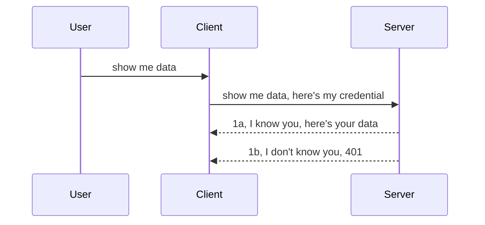

<!--
CO_OP_TRANSLATOR_METADATA:
{
  "original_hash": "5b00b8a8971a07d2d8803be4c9f138f8",
  "translation_date": "2025-10-11T11:53:22+00:00",
  "source_file": "03-GettingStarted/11-simple-auth/README.md",
  "language_code": "ta"
}
-->
# எளிய அங்கீகாரம்

MCP SDKகள் OAuth 2.1 ஐ ஆதரிக்கின்றன, இது உண்மையில் மிகவும் சிக்கலான செயல்முறையாகும், இதில் அங்கீகார சேவையகம், வள சேவையகம், சான்றுகளை அனுப்புதல், ஒரு குறியீட்டை பெறுதல், அந்த குறியீட்டை ஒரு பேயர் டோக்கனாக மாற்றுதல் போன்ற கருத்துகள் அடங்கும், இதன் மூலம் நீங்கள் உங்கள் வள தரவுகளை இறுதியாகப் பெற முடியும். OAuth ஐப் பயன்படுத்துவதில் நீங்கள் பழக்கமில்லாதவராக இருந்தால், இது செயல்படுத்துவதற்கு சிறந்தது, சில அடிப்படை நிலை அங்கீகாரத்துடன் தொடங்கி, பாதுகாப்பை மேம்படுத்துவது நல்லது. அதற்காகவே இந்த அத்தியாயம் உள்ளது, உங்களை மேம்பட்ட அங்கீகாரத்திற்கு உருவாக்க.

## அங்கீகாரம், அதனால் என்ன?

அங்கீகாரம் என்பது Authentication மற்றும் Authorization என்பதற்கான சுருக்கமாகும். இதன் நோக்கம் இரண்டு விஷயங்களைச் செய்ய வேண்டும்:

- **Authentication**, இது ஒரு நபரை நம் வீட்டிற்குள் அனுமதிக்கிறோமா என்பதை அறிய முயற்சிக்கும் செயல்முறையாகும், அதாவது அவர்கள் "இங்கு" இருக்க உரிமை பெற்றவர்களா என்பதை உறுதிப்படுத்துவது, அதாவது MCP சேவையக அம்சங்கள் உள்ள நம் வள சேவையகத்திற்குச் செல்ல அனுமதிக்கிறோம்.
- **Authorization**, இது ஒரு பயனர் அவர்கள் கேட்கும் குறிப்பிட்ட வளங்களுக்கு அணுகல் இருக்க வேண்டுமா என்பதை அறிய முயற்சிக்கும் செயல்முறையாகும், உதாரணமாக இந்த ஆர்டர்கள் அல்லது இந்த தயாரிப்புகள் அல்லது மற்றொரு உதாரணமாக உள்ளடக்கத்தைப் படிக்க அனுமதிக்கிறோம் ஆனால் நீக்க அனுமதிக்கிறோம்.

## சான்றுகள்: நாம் யார் என்பதைச் சொல்லும் முறை

சாதாரணமாக, பெரும்பாலான வலை மேம்பாட்டாளர்கள் ஒரு சான்றை வழங்குவதற்கான வழியில் சிந்திக்கத் தொடங்குகிறார்கள், பொதுவாக ஒரு ரகசியம், இது அவர்கள் "Authentication" இல் இருக்க அனுமதிக்கப்படுகிறார்கள் என்பதைச் சொல்கிறது. இந்த சான்று பொதுவாக ஒரு username மற்றும் password அல்லது ஒரு API key ஐ base64 என்கோடு செய்யப்பட்ட பதிப்பாக இருக்கும், இது ஒரு குறிப்பிட்ட பயனரை தனித்துவமாக அடையாளம் காண்கிறது.

இது "Authorization" எனப்படும் தலைப்பின் மூலம் அனுப்பப்படுகிறது, இதைப் போல:

```json
{ "Authorization": "secret123" }
```

இது பொதுவாக அடிப்படை அங்கீகாரம் என அழைக்கப்படுகிறது. அதன் பிறகு, முழு செயல்முறை கீழே உள்ளபடி செயல்படுகிறது:



இப்போது இது செயல்முறை நோக்கில் எப்படி செயல்படுகிறது என்பதை நாங்கள் புரிந்துகொண்டோம், அதை எப்படி செயல்படுத்துவது? பெரும்பாலான வலை சேவையகங்களில் "middleware" எனப்படும் ஒரு கருத்து உள்ளது, இது கோரிக்கையின் ஒரு பகுதியாக இயங்கும் ஒரு குறியீடு, இது சான்றுகளை சரிபார்க்க முடியும், மேலும் சான்றுகள் செல்லுபடியாக இருந்தால் கோரிக்கையை அனுமதிக்க முடியும். கோரிக்கையில் செல்லுபடியாகாத சான்றுகள் இல்லையெனில், நீங்கள் ஒரு அங்கீகார பிழையைப் பெறுகிறீர்கள். இதை எப்படி செயல்படுத்துவது என்பதைப் பார்ப்போம்:

**Python**

```python
class AuthMiddleware(BaseHTTPMiddleware):
    async def dispatch(self, request, call_next):

        has_header = request.headers.get("Authorization")
        if not has_header:
            print("-> Missing Authorization header!")
            return Response(status_code=401, content="Unauthorized")

        if not valid_token(has_header):
            print("-> Invalid token!")
            return Response(status_code=403, content="Forbidden")

        print("Valid token, proceeding...")
       
        response = await call_next(request)
        # add any customer headers or change in the response in some way
        return response


starlette_app.add_middleware(CustomHeaderMiddleware)
```

இங்கே நாங்கள்:

- `AuthMiddleware` எனப்படும் ஒரு middleware ஐ உருவாக்கியுள்ளோம், அதன் `dispatch` முறை வலை சேவையகத்தால் அழைக்கப்படுகிறது.
- இந்த middleware ஐ வலை சேவையகத்தில் சேர்த்துள்ளோம்:

    ```python
    starlette_app.add_middleware(AuthMiddleware)
    ```

- Authorization header உள்ளது மற்றும் அனுப்பப்படும் ரகசியம் செல்லுபடியாக இருக்கிறதா என்பதைச் சரிபார்க்கும் சரிபார்ப்பு தர்க்கத்தை எழுதியுள்ளோம்:

    ```python
    has_header = request.headers.get("Authorization")
    if not has_header:
        print("-> Missing Authorization header!")
        return Response(status_code=401, content="Unauthorized")

    if not valid_token(has_header):
        print("-> Invalid token!")
        return Response(status_code=403, content="Forbidden")
    ```

    ரகசியம் உள்ளதா மற்றும் செல்லுபடியாக இருக்கிறதா என்பதைச் சரிபார்க்கிறோம், அதன் பிறகு `call_next` ஐ அழைத்து பதிலைத் திருப்புகிறோம்.

    ```python
    response = await call_next(request)
    # add any customer headers or change in the response in some way
    return response
    ```

இது செயல்படுவது எப்படி என்றால், ஒரு வலை கோரிக்கை சேவையகத்தை நோக்கி செய்யப்படும் போது, middleware அழைக்கப்படும், மேலும் அதன் செயல்பாட்டின் அடிப்படையில், கோரிக்கையை அனுமதிக்க அல்லது வாடிக்கையாளர் தொடர அனுமதிக்கப்படவில்லை என்பதை குறிக்கும் பிழையைத் திருப்ப முடியும்.

**TypeScript**

இங்கே, பிரபலமான Express framework ஐப் பயன்படுத்தி ஒரு middleware ஐ உருவாக்கி, MCP சேவையகத்தை அடைவதற்கு முன் கோரிக்கையை தடை செய்கிறோம். இதற்கான குறியீடு இதோ:

```typescript
function isValid(secret) {
    return secret === "secret123";
}

app.use((req, res, next) => {
    // 1. Authorization header present?  
    if(!req.headers["Authorization"]) {
        res.status(401).send('Unauthorized');
    }
    
    let token = req.headers["Authorization"];

    // 2. Check validity.
    if(!isValid(token)) {
        res.status(403).send('Forbidden');
    }

   
    console.log('Middleware executed');
    // 3. Passes request to the next step in the request pipeline.
    next();
});
```

இந்த குறியீட்டில், நாங்கள்:

1. Authorization header முதலில் உள்ளதா என்பதைச் சரிபார்க்கிறோம், இல்லையெனில், 401 பிழையை அனுப்புகிறோம்.
2. சான்று/டோக்கன் செல்லுபடியாக இருக்கிறதா என்பதை உறுதிப்படுத்துகிறோம், இல்லையெனில், 403 பிழையை அனுப்புகிறோம்.
3. இறுதியாக கோரிக்கையை கோரிக்கை குழாயில் அனுப்பி கேட்கப்பட்ட வளத்தைத் திருப்புகிறோம்.

## பயிற்சி: அங்கீகாரத்தை செயல்படுத்துங்கள்

நாம் கற்றறிந்ததை எடுத்து அதை செயல்படுத்த முயற்சிக்கலாம். திட்டம் இதோ:

சேவையகம்

- ஒரு வலை சேவையகம் மற்றும் MCP instance ஐ உருவாக்குங்கள்.
- சேவையகத்திற்கான ஒரு middleware ஐ செயல்படுத்துங்கள்.

வாடிக்கையாளர் 

- தலைப்பின் மூலம் சான்றுடன் வலை கோரிக்கையை அனுப்புங்கள்.

### -1- ஒரு வலை சேவையகம் மற்றும் MCP instance ஐ உருவாக்குங்கள்

முதல் படியில், வலை சேவையக instance ஐ உருவாக்கி MCP சேவையகத்தை உருவாக்க வேண்டும்.

**Python**

இங்கே, MCP சேவையக instance ஐ உருவாக்கி, starlette வலை பயன்பாட்டை உருவாக்கி, uvicorn மூலம் host செய்கிறோம்.

```python
# creating MCP Server

app = FastMCP(
    name="MCP Resource Server",
    instructions="Resource Server that validates tokens via Authorization Server introspection",
    host=settings["host"],
    port=settings["port"],
    debug=True
)

# creating starlette web app
starlette_app = app.streamable_http_app()

# serving app via uvicorn
async def run(starlette_app):
    import uvicorn
    config = uvicorn.Config(
            starlette_app,
            host=app.settings.host,
            port=app.settings.port,
            log_level=app.settings.log_level.lower(),
        )
    server = uvicorn.Server(config)
    await server.serve()

run(starlette_app)
```

இந்த குறியீட்டில், நாங்கள்:

- MCP சேவையகத்தை உருவாக்குகிறோம்.
- MCP சேவையகத்திலிருந்து starlette வலை பயன்பாட்டை உருவாக்குகிறோம், `app.streamable_http_app()`.
- uvicorn ஐப் பயன்படுத்தி வலை பயன்பாட்டை host செய்கிறோம் `server.serve()`.

**TypeScript**

இங்கே, MCP சேவையக instance ஐ உருவாக்குகிறோம்.

```typescript
const server = new McpServer({
      name: "example-server",
      version: "1.0.0"
    });

    // ... set up server resources, tools, and prompts ...
```

இந்த MCP சேவையக உருவாக்கம் நம் POST /mcp வழிமுறையின் வரையறைக்குள் நடக்க வேண்டும், எனவே மேலே உள்ள குறியீட்டை எடுத்துக் கொண்டு அதை இவ்வாறு நகர்த்துகிறோம்:

```typescript
import express from "express";
import { randomUUID } from "node:crypto";
import { McpServer } from "@modelcontextprotocol/sdk/server/mcp.js";
import { StreamableHTTPServerTransport } from "@modelcontextprotocol/sdk/server/streamableHttp.js";
import { isInitializeRequest } from "@modelcontextprotocol/sdk/types.js"

const app = express();
app.use(express.json());

// Map to store transports by session ID
const transports: { [sessionId: string]: StreamableHTTPServerTransport } = {};

// Handle POST requests for client-to-server communication
app.post('/mcp', async (req, res) => {
  // Check for existing session ID
  const sessionId = req.headers['mcp-session-id'] as string | undefined;
  let transport: StreamableHTTPServerTransport;

  if (sessionId && transports[sessionId]) {
    // Reuse existing transport
    transport = transports[sessionId];
  } else if (!sessionId && isInitializeRequest(req.body)) {
    // New initialization request
    transport = new StreamableHTTPServerTransport({
      sessionIdGenerator: () => randomUUID(),
      onsessioninitialized: (sessionId) => {
        // Store the transport by session ID
        transports[sessionId] = transport;
      },
      // DNS rebinding protection is disabled by default for backwards compatibility. If you are running this server
      // locally, make sure to set:
      // enableDnsRebindingProtection: true,
      // allowedHosts: ['127.0.0.1'],
    });

    // Clean up transport when closed
    transport.onclose = () => {
      if (transport.sessionId) {
        delete transports[transport.sessionId];
      }
    };
    const server = new McpServer({
      name: "example-server",
      version: "1.0.0"
    });

    // ... set up server resources, tools, and prompts ...

    // Connect to the MCP server
    await server.connect(transport);
  } else {
    // Invalid request
    res.status(400).json({
      jsonrpc: '2.0',
      error: {
        code: -32000,
        message: 'Bad Request: No valid session ID provided',
      },
      id: null,
    });
    return;
  }

  // Handle the request
  await transport.handleRequest(req, res, req.body);
});

// Reusable handler for GET and DELETE requests
const handleSessionRequest = async (req: express.Request, res: express.Response) => {
  const sessionId = req.headers['mcp-session-id'] as string | undefined;
  if (!sessionId || !transports[sessionId]) {
    res.status(400).send('Invalid or missing session ID');
    return;
  }
  
  const transport = transports[sessionId];
  await transport.handleRequest(req, res);
};

// Handle GET requests for server-to-client notifications via SSE
app.get('/mcp', handleSessionRequest);

// Handle DELETE requests for session termination
app.delete('/mcp', handleSessionRequest);

app.listen(3000);
```

இப்போது, MCP சேவையக உருவாக்கம் `app.post("/mcp")` இல் எப்படி நகர்த்தப்பட்டது என்பதை நீங்கள் காண்கிறீர்கள்.

வந்துவிட்டோம், சேவையகத்திற்கான middleware ஐ உருவாக்கும் அடுத்த படிக்கு.

### -2- சேவையகத்திற்கான middleware ஐ செயல்படுத்துங்கள்

அடுத்ததாக, middleware பகுதியை உருவாக்குவோம். இங்கே, `Authorization` header இல் சான்றைத் தேடி அதைச் சரிபார்க்கும் middleware ஐ உருவாக்குவோம். இது ஏற்றுக்கொள்ளத்தக்கதாக இருந்தால், கோரிக்கை அதன் தேவையைச் செய்ய (உதாரணமாக கருவிகளை பட்டியலிடுதல், ஒரு வளத்தைப் படித்தல் அல்லது வாடிக்கையாளர் கேட்கும் MCP செயல்பாடு) தொடரும்.

**Python**

middleware ஐ உருவாக்க, `BaseHTTPMiddleware` ஐப் பெறும் ஒரு வகுப்பை உருவாக்க வேண்டும். இரண்டு முக்கியமான பகுதிகள் உள்ளன:

- கோரிக்கை `request`, அதிலிருந்து header தகவலை வாசிக்கிறோம்.
- `call_next` callback, வாடிக்கையாளர் ஏற்றுக்கொள்ளத்தக்க சான்றை கொண்டு வந்தால் அழைக்க வேண்டும்.

முதலில், `Authorization` header இல்லை என்ற நிலையை கையாள வேண்டும்:

```python
has_header = request.headers.get("Authorization")

# no header present, fail with 401, otherwise move on.
if not has_header:
    print("-> Missing Authorization header!")
    return Response(status_code=401, content="Unauthorized")
```

இங்கே, வாடிக்கையாளர் authentication இல் தோல்வியடைவதால், 401 unauthorized செய்தியை அனுப்புகிறோம்.

அடுத்ததாக, ஒரு சான்று சமர்ப்பிக்கப்பட்டால், அதன் செல்லுபடியாக்கத்தை இவ்வாறு சரிபார்க்க வேண்டும்:

```python
 if not valid_token(has_header):
    print("-> Invalid token!")
    return Response(status_code=403, content="Forbidden")
```

மேலே, 403 forbidden செய்தியை அனுப்புகிறோம் என்பதை கவனிக்கவும். கீழே முழு middleware ஐப் பார்ப்போம்:

```python
class AuthMiddleware(BaseHTTPMiddleware):
    async def dispatch(self, request, call_next):

        has_header = request.headers.get("Authorization")
        if not has_header:
            print("-> Missing Authorization header!")
            return Response(status_code=401, content="Unauthorized")

        if not valid_token(has_header):
            print("-> Invalid token!")
            return Response(status_code=403, content="Forbidden")

        print("Valid token, proceeding...")
        print(f"-> Received {request.method} {request.url}")
        response = await call_next(request)
        response.headers['Custom'] = 'Example'
        return response

```

சரி, ஆனால் `valid_token` செயல்பாடு என்ன? இதோ கீழே:

```python
# DON'T use for production - improve it !!
def valid_token(token: str) -> bool:
    # remove the "Bearer " prefix
    if token.startswith("Bearer "):
        token = token[7:]
        return token == "secret-token"
    return False
```

இது தெளிவாக மேம்படுத்தப்பட வேண்டும்.

முக்கியம்: நீங்கள் இதுபோன்ற ரகசியங்களை குறியீட்டில் வைத்திருக்கக் கூடாது. நீங்கள் ஒப்பிட வேண்டிய மதிப்பை தரவுத்தொகுப்பிலிருந்து அல்லது IDP (identity service provider) இல் இருந்து பெற வேண்டும் அல்லது மேலும் சிறந்த முறையில், IDP சரிபார்ப்பைச் செய்ய அனுமதிக்க வேண்டும்.

**TypeScript**

Express உடன் இதை செயல்படுத்த, middleware functions ஐப் பெறும் `use` முறையை அழைக்க வேண்டும்.

நாம்:

- கோரிக்கை மாறியுடன் தொடர்பு கொண்டு `Authorization` சொத்தில் அனுப்பப்பட்ட சான்றைச் சரிபார்க்க வேண்டும்.
- சான்றைச் சரிபார்க்க வேண்டும், மேலும் வாடிக்கையாளர் MCP கோரிக்கையைச் செய்ய அனுமதிக்க வேண்டும் (உதாரணமாக கருவிகளை பட்டியலிடுதல், வளத்தைப் படித்தல் அல்லது MCP தொடர்பான ஏதாவது).

இங்கே, `Authorization` header உள்ளது என்பதைச் சரிபார்க்கிறோம், இல்லையெனில், கோரிக்கையைத் தடுக்கிறோம்:

```typescript
if(!req.headers["authorization"]) {
    res.status(401).send('Unauthorized');
    return;
}
```

header முதலில் அனுப்பப்படவில்லை என்றால், நீங்கள் 401 ஐப் பெறுகிறீர்கள்.

அடுத்ததாக, சான்று செல்லுபடியாக இருக்கிறதா என்பதைச் சரிபார்க்கிறோம், இல்லையெனில், மீண்டும் கோரிக்கையை நிறுத்துகிறோம், ஆனால் சற்று வேறுபட்ட செய்தியுடன்:

```typescript
if(!isValid(token)) {
    res.status(403).send('Forbidden');
    return;
} 
```

இப்போது நீங்கள் 403 பிழையைப் பெறுகிறீர்கள் என்பதை கவனிக்கவும்.

முழு குறியீடு இதோ:

```typescript
app.use((req, res, next) => {
    console.log('Request received:', req.method, req.url, req.headers);
    console.log('Headers:', req.headers["authorization"]);
    if(!req.headers["authorization"]) {
        res.status(401).send('Unauthorized');
        return;
    }
    
    let token = req.headers["authorization"];

    if(!isValid(token)) {
        res.status(403).send('Forbidden');
        return;
    }  

    console.log('Middleware executed');
    next();
});
```

வலை சேவையகத்தை வாடிக்கையாளர் அனுப்பும் சான்றைச் சரிபார்க்கும் middleware ஐ ஏற்க அமைத்துள்ளோம். வாடிக்கையாளர் என்ன?

### -3- தலைப்பின் மூலம் சான்றுடன் வலை கோரிக்கையை அனுப்புங்கள்

வாடிக்கையாளர் தலைப்பின் மூலம் சான்றை அனுப்புவதை உறுதிப்படுத்த வேண்டும். MCP வாடிக்கையாளரைப் பயன்படுத்தவுள்ளதால், அது எப்படி செய்யப்படுகிறது என்பதை கண்டறிய வேண்டும்.

**Python**

வாடிக்கையாளருக்காக, தலைப்புடன் சான்றை இவ்வாறு அனுப்ப வேண்டும்:

```python
# DON'T hardcode the value, have it at minimum in an environment variable or a more secure storage
token = "secret-token"

async with streamablehttp_client(
        url = f"http://localhost:{port}/mcp",
        headers = {"Authorization": f"Bearer {token}"}
    ) as (
        read_stream,
        write_stream,
        session_callback,
    ):
        async with ClientSession(
            read_stream,
            write_stream
        ) as session:
            await session.initialize()
      
            # TODO, what you want done in the client, e.g list tools, call tools etc.
```

`headers` சொத்தை இவ்வாறு நிரப்புகிறோம் என்பதை கவனிக்கவும்: ` headers = {"Authorization": f"Bearer {token}"}`.

**TypeScript**

இதை இரண்டு படிகளில் தீர்க்கலாம்:

1. சான்றுடன் ஒரு configuration object ஐ நிரப்புங்கள்.
2. configuration object ஐ transport க்கு அனுப்புங்கள்.

```typescript

// DON'T hardcode the value like shown here. At minimum have it as a env variable and use something like dotenv (in dev mode).
let token = "secret123"

// define a client transport option object
let options: StreamableHTTPClientTransportOptions = {
  sessionId: sessionId,
  requestInit: {
    headers: {
      "Authorization": "secret123"
    }
  }
};

// pass the options object to the transport
async function main() {
   const transport = new StreamableHTTPClientTransport(
      new URL(serverUrl),
      options
   );
```

மேலே, `options` object ஐ உருவாக்கி, `requestInit` சொத்தின் கீழ் தலைப்புகளை வைத்திருக்க வேண்டும் என்பதை நீங்கள் காண்கிறீர்கள்.

முக்கியம்: இதிலிருந்து அதை எப்படி மேம்படுத்துவது? தற்போதைய செயல்பாட்டில் சில பிரச்சினைகள் உள்ளன. முதலில், HTTPS இல்லாமல் சான்றை இவ்வாறு அனுப்புவது மிகவும் ஆபத்தானது. HTTPS இருந்தாலும், credential திருடப்படலாம், எனவே நீங்கள் டோக்கனை எளிதாக ரத்து செய்யும் மற்றும் கூடுதல் சரிபார்ப்புகளைச் சேர்க்கும் ஒரு அமைப்பைத் தேவை. 

இது கூறப்பட வேண்டும், மிகவும் எளிய APIகளுக்கு, உங்கள் API ஐ அங்கீகாரம் இல்லாமல் யாரும் அழைக்க விரும்பாத இடங்களில், நாங்கள் இங்கே கொண்டுள்ளது ஒரு நல்ல தொடக்கம். 

அதன் பிறகு, JSON Web Token (JWT) எனப்படும் ஒரு தரநிலை வடிவத்தைப் பயன்படுத்துவதன் மூலம் பாதுகாப்பை சிறிது கடினமாக்க முயற்சிக்கலாம்.

## JSON Web Tokens, JWT

எளிய சான்றுகளை அனுப்புவதிலிருந்து மேம்படுத்த முயற்சிக்கிறோம். JWT ஐ ஏற்றுக்கொள்வதன் மூலம் உடனடியாக கிடைக்கும் மேம்பாடுகள் என்ன?

- **பாதுகாப்பு மேம்பாடுகள்**. அடிப்படை அங்கீகாரத்தில், நீங்கள் username மற்றும் password ஐ base64 என்கோடு செய்யப்பட்ட டோக்கனாக (அல்லது API key ஐ) மீண்டும் மீண்டும் அனுப்புகிறீர்கள், இது ஆபத்தை அதிகரிக்கிறது. JWT உடன், username மற்றும் password ஐ அனுப்பி டோக்கனைப் பெறுகிறீர்கள், மேலும் இது காலவரையறை கொண்டது, அதாவது இது காலாவதியாகும். JWT மூலம் roles, scopes மற்றும் permissions ஐப் பயன்படுத்தி நுணுக்கமான அணுகல் கட்டுப்பாட்டை எளிதாகச் செய்யலாம்.
- **Statelessness மற்றும் scalability**. JWTகள் சுய-கட்டுப்பாட்டுடன் இருக்கும், அவை அனைத்து பயனர் தகவல்களையும் கொண்டிருக்கும், மேலும் சேவையக பக்கம் session storage ஐ சேமிக்க தேவையற்றது. டோக்கனை உள்ளடகமாகச் சரிபார்க்கவும் முடியும்.
- **Interoperability மற்றும் federation**. JWTகள் Open ID Connect இன் மையமாகும், மேலும் Entra ID, Google Identity மற்றும் Auth0 போன்ற அடையாள வழங்குநர்களுடன் பயன்படுத்தப்படுகிறது. அவை single sign-on மற்றும் பலவற்றைச் செய்யவும் enterprise-grade ஆகவும் பயன்படுத்தப்படுகின்றன.
- **Modularity மற்றும் flexibility**. JWTகள் Azure API Management, NGINX போன்ற API Gateways உடன் பயன்படுத்தப்படலாம். இது authentication scenarios மற்றும் server-to-service தொடர்பு உட்பட impersonation மற்றும் delegation scenarios ஐ ஆதரிக்கிறது.
- **Performance மற்றும் caching**. JWTகள் decoding பிறகு cache செய்யப்படலாம், இது parsing தேவையை குறைக்கிறது. இது குறிப்பாக அதிக traffic உள்ள பயன்பாடுகளுக்கு throughput ஐ மேம்படுத்துகிறது மற்றும் உங்கள் தேர்ந்தெடுத்த infrastructure மீது சுமையை குறைக்கிறது.
- **Advanced features**. இது introspection (சரிபார்ப்பு சேவையகத்தில்) மற்றும் revocation (டோக்கனை செல்லுபடியாகாதது) ஆகியவற்றையும் ஆதரிக்கிறது.

இந்த அனைத்து நன்மைகளுடன், நம் செயல்பாட்டை அடுத்த நிலைக்கு எடுப்பது எப்படி என்பதைப் பார்ப்போம்.

## அடிப்படை அங்கீகாரத்தை JWT ஆக மாற்றுதல்

நாம் செய்ய வேண்டிய மாற்றங்கள்:

- **JWT டோக்கனை உருவாக்க கற்றுக்கொள்ளுங்கள்** மற்றும் வாடிக்கையாளர் இருந்து சேவையகத்திற்கு அனுப்ப தயாராக இருக்க வேண்டும்.
- **JWT டோக்கனைச் சரிபார்க்கவும்**, மேலும் வாடிக்கையாளர் நம் வளங்களைப் பெற அனுமதிக்கவும்.
- **டோக்கன் சேமிப்பை பாதுகாக்கவும்**. இந்த டோக்கனை எவ்வாறு சேமிக்க வேண்டும்.
- **வழிகளைப் பாதுகாக்கவும்**. வழிகளை, குறிப்பாக MCP அம்சங்களைப் பாதுகாக்க வேண்டும்.
- **Refresh tokens ஐச் சேர்க்கவும்**. குறுகிய காலத்திற்கான டோக்கன்களை உருவாக்கவும், ஆனால் நீண்ட காலத்திற்கான refresh tokens ஐ உருவாக்கவும், அவை காலாவதியாக இருந்தால் புதிய டோக்கன்களைப் பெற பயன்படுத்தப்படலாம். மேலும் refresh endpoint மற்றும் rotation strategy ஐ உறுதிப்படுத்தவும்.

### -1- JWT டோக்கனை உருவாக்குதல்

முதலில், JWT டோக்கனில் பின்வரும் பகுதிகள் உள்ளன:

- **header**, பயன்படுத்தப்படும் algorithm மற்றும் டோக்கன் வகை.
- **payload**, claims, உதாரணமாக sub (டோக்கன் பிரதிநிதித்துவம் செய்யும் பயனர் அல்லது entity. ஒரு அங்கீகார சூழலில் இது பொதுவாக userid), exp (இது எப்போது காலாவதியாகும்) role (பங்கு).
- **signature**, ஒரு ரகசியம் அல்லது தனிப்பட்ட விசையுடன் கையொப்பமிடப்பட்டது.

இதற்காக, header, payload மற்றும் encode செய்யப்பட்ட டோக்கனை உருவாக்க வேண்டும்.

**Python**

```python

import jwt
import jwt
from jwt.exceptions import ExpiredSignatureError, InvalidTokenError
import datetime

# Secret key used to sign the JWT
secret_key = 'your-secret-key'

header = {
    "alg": "HS256",
    "typ": "JWT"
}

# the user info andits claims and expiry time
payload = {
    "sub": "1234567890",               # Subject (user ID)
    "name": "User Userson",                # Custom claim
    "admin": True,                     # Custom claim
    "iat": datetime.datetime.utcnow(),# Issued at
    "exp": datetime.datetime.utcnow() + datetime.timedelta(hours=1)  # Expiry
}

# encode it
encoded_jwt = jwt.encode(payload, secret_key, algorithm="HS256", headers=header)
```

மேலே உள்ள குறியீட்டில், நாங்கள்:

- HS256 ஐ algorithm ஆகவும், வகையை JWT ஆகவும் பயன்படுத்தி header ஐ வரையறுத்துள்ளோம்.
- ஒரு payload ஐ உருவாக்கியுள்ளோம், இது ஒரு subject அல்லது user id, username, role, இது எப்போது issue செய்யப்பட்டது மற்றும் இது எப்போது காலாவதியாகும் என்பதைக் கொண்டுள்ளது, இதன் மூலம் நாம் முன்பு குறிப்பிட்ட time bound அம்சத்தை செயல்படுத்துகிறோம்.

**TypeScript**

இங்கே, JWT டோக்கனை உருவாக்க உதவும் சில dependencies தேவைப்படும்.

Dependencies

```sh

npm install jsonwebtoken
npm install --save-dev @types/jsonwebtoken
```

இப்போது, header, payload ஐ உருவாக்கி encode செய்யப்பட்ட டோக்கனை உருவாக்குவோம்.

```typescript
import jwt from 'jsonwebtoken';

const secretKey = 'your-secret-key'; // Use env vars in production

// Define the payload
const payload = {
  sub: '1234567890',
  name: 'User usersson',
  admin: true,
  iat: Math.floor(Date.now() / 1000), // Issued at
  exp: Math.floor(Date.now() / 1000) + 60 * 60 // Expires in 1 hour
};

// Define the header (optional, jsonwebtoken sets defaults)
const header = {
  alg: 'HS256',
  typ: 'JWT'
};

// Create the token
const token = jwt.sign(payload, secretKey, {
  algorithm: 'HS256',
  header: header
});

console.log('JWT:', token);
```

இந்த டோக்கன்:

HS256 ஐப் பயன்படுத்தி கையொப்பமிடப்பட்டது.
1 மணி நேரத்திற்கு செல்லுபடியாகும்.
sub, name, admin, iat மற்றும் exp போன்ற claims ஐ உள்ளடக்கியது.

### -2- டோக்கனைச் சரிபார்க்கவும்

டோக்கனைச் சரிபார்க்க வேண்டும், இது வாடிக்கையாளர் அனுப்பும் டோக்கன் உண்மையில் செல்லுபடியாக இருக்கிறதா என்பதை உறுதிப்படுத்த சேவையகத்தில் செய்ய வேண்டும். இங்கே, அதன் அமைப்பைச் சரிபார்ப்பதிலிருந்து அதன் செல்லுபடியாக்கத்தைச் சரிபார்ப்பதற்கு பல சரிபார்ப்புகளைச் செய்ய வேண்டும். மேலும், பயனர் உங்கள் அமைப்பில் உள்ளவரா என்பதை உறுதிப்படுத்தவும்.

டோக்கனைச் சரிபார்க்க, அதை decode செய்ய வேண்டும், அதன் மூலம் அதை வாசிக்க முடியும், அதன் பிறகு அதன் செல்லுபடியாக்கத்தைச் சரிபார்க்க வேண்டும்:

**Python**

```python

# Decode and verify the JWT
try:
    decoded = jwt.decode(token, secret_key, algorithms=["HS256"])
    print("✅ Token is valid.")
    print("Decoded claims:")
    for key, value in decoded.items():
        print(f"  {key}: {value}")
except ExpiredSignatureError:
    print("❌ Token has expired.")
except InvalidTokenError as e:
    print(f"❌ Invalid token: {e}")

```

இந்த குறியீட்டில், `jwt.decode` ஐ டோக்கன், ரகசிய விசை மற்றும் தேர்ந்தெடுக்கப்பட்ட algorithm ஐ உள்ளீடாக அழைக்கிறோம். ஒரு try-catch கட்டமைப்பைப் பயன்படுத்துகிறோம், ஏனெனில் தோல்வியடைந்த சரிபார்ப்பு ஒரு பிழையை எழுப்புகிறது.

**TypeScript**

இங்கே, `jwt.verify` ஐ அழைக்க வேண்டும், அதன் மூலம் டோக்கனின் decode செய்யப்பட்ட பதிப்பை பெற முடியும், மேலும் அதை மேலும் பக
அடுத்ததாக, பங்கு அடிப்படையிலான அணுகல் கட்டுப்பாட்டைப் பற்றி, RBAC என அழைக்கப்படும் ஒன்றைப் பார்ப்போம்.

## பங்கு அடிப்படையிலான அணுகல் கட்டுப்பாட்டைச் சேர்த்தல்

குறிக்கோள் என்னவென்றால், வெவ்வேறு பங்குகளுக்கு வெவ்வேறு அனுமதிகள் உள்ளன என்பதை வெளிப்படுத்த வேண்டும். உதாரணமாக, ஒரு நிர்வாகி (admin) எல்லாவற்றையும் செய்ய முடியும், ஒரு சாதாரண பயனர் (user) படிக்க/எழுத முடியும், மற்றும் ஒரு விருந்தினர் (guest) படிக்க மட்டுமே முடியும் என்று நாம் கருதுகிறோம். எனவே, சில சாத்தியமான அனுமதி நிலைகள் இவை:

- Admin.Write 
- User.Read
- Guest.Read

இவ்வாறு ஒரு கட்டுப்பாட்டை மிடில்வேருடன் எப்படி செயல்படுத்தலாம் என்பதை பார்ப்போம். மிடில்வேர்களை தனிப்பட்ட வழிகளுக்கு மட்டுமல்ல, அனைத்து வழிகளுக்கும் சேர்க்கலாம்.

**Python**

```python
from starlette.middleware.base import BaseHTTPMiddleware
from starlette.responses import JSONResponse
import jwt

# DON'T have the secret in the code like, this is for demonstration purposes only. Read it from a safe place.
SECRET_KEY = "your-secret-key" # put this in env variable
REQUIRED_PERMISSION = "User.Read"

class JWTPermissionMiddleware(BaseHTTPMiddleware):
    async def dispatch(self, request, call_next):
        auth_header = request.headers.get("Authorization")
        if not auth_header or not auth_header.startswith("Bearer "):
            return JSONResponse({"error": "Missing or invalid Authorization header"}, status_code=401)

        token = auth_header.split(" ")[1]
        try:
            decoded = jwt.decode(token, SECRET_KEY, algorithms=["HS256"])
        except jwt.ExpiredSignatureError:
            return JSONResponse({"error": "Token expired"}, status_code=401)
        except jwt.InvalidTokenError:
            return JSONResponse({"error": "Invalid token"}, status_code=401)

        permissions = decoded.get("permissions", [])
        if REQUIRED_PERMISSION not in permissions:
            return JSONResponse({"error": "Permission denied"}, status_code=403)

        request.state.user = decoded
        return await call_next(request)


```

கீழே உள்ளபடி மிடில்வேரைச் சேர்க்க பல்வேறு வழிகள் உள்ளன:

```python

# Alt 1: add middleware while constructing starlette app
middleware = [
    Middleware(JWTPermissionMiddleware)
]

app = Starlette(routes=routes, middleware=middleware)

# Alt 2: add middleware after starlette app is a already constructed
starlette_app.add_middleware(JWTPermissionMiddleware)

# Alt 3: add middleware per route
routes = [
    Route(
        "/mcp",
        endpoint=..., # handler
        middleware=[Middleware(JWTPermissionMiddleware)]
    )
]
```

**TypeScript**

நாம் `app.use` மற்றும் அனைத்து கோரிக்கைகளுக்கும் இயங்கும் மிடில்வேரைப் பயன்படுத்தலாம்.

```typescript
app.use((req, res, next) => {
    console.log('Request received:', req.method, req.url, req.headers);
    console.log('Headers:', req.headers["authorization"]);

    // 1. Check if authorization header has been sent

    if(!req.headers["authorization"]) {
        res.status(401).send('Unauthorized');
        return;
    }
    
    let token = req.headers["authorization"];

    // 2. Check if token is valid
    if(!isValid(token)) {
        res.status(403).send('Forbidden');
        return;
    }  

    // 3. Check if token user exist in our system
    if(!isExistingUser(token)) {
        res.status(403).send('Forbidden');
        console.log("User does not exist");
        return;
    }
    console.log("User exists");

    // 4. Verify the token has the right permissions
    if(!hasScopes(token, ["User.Read"])){
        res.status(403).send('Forbidden - insufficient scopes');
    }

    console.log("User has required scopes");

    console.log('Middleware executed');
    next();
});

```

மிடில்வேரில் செய்ய வேண்டிய சில முக்கிய விஷயங்கள் உள்ளன, அவற்றை செய்ய வேண்டும், அதாவது:

1. Authorization header உள்ளது என்பதைச் சரிபார்க்கவும்
2. Token செல்லுபடியாகிறதா என்பதைச் சரிபார்க்கவும், இது JWT token இன் முழுமை மற்றும் செல்லுபடியாகும் தன்மையைச் சரிபார்க்கும் `isValid` எனும் முறை.
3. பயனர் எங்கள் அமைப்பில் உள்ளாரா என்பதை உறுதிப்படுத்தவும்.

   ```typescript
    // users in DB
   const users = [
     "user1",
     "User usersson",
   ]

   function isExistingUser(token) {
     let decodedToken = verifyToken(token);

     // TODO, check if user exists in DB
     return users.includes(decodedToken?.name || "");
   }
   ```

   மேலே, நாம் ஒரு எளிய `users` பட்டியலை உருவாக்கியுள்ளோம், இது தெளிவாக ஒரு தரவுத்தொகுப்பில் இருக்க வேண்டும்.

4. கூடுதலாக, token சரியான அனுமதிகளை கொண்டுள்ளதா என்பதைச் சரிபார்க்க வேண்டும்.

   ```typescript
   if(!hasScopes(token, ["User.Read"])){
        res.status(403).send('Forbidden - insufficient scopes');
   }
   ```

   மேலே உள்ள மிடில்வேரில், token User.Read அனுமதியை கொண்டுள்ளதா என்பதைச் சரிபார்க்கிறோம், இல்லையெனில் 403 பிழை அனுப்புகிறோம். கீழே `hasScopes` உதவியாளர் முறை உள்ளது.

   ```typescript
   function hasScopes(scope: string, requiredScopes: string[]) {
     let decodedToken = verifyToken(scope);
    return requiredScopes.every(scope => decodedToken?.scopes.includes(scope));
  }
   ```

Have a think which additional checks you should be doing, but these are the absolute minimum of checks you should be doing.

Using Express as a web framework is a common choice. There are helpers library when you use JWT so you can write less code.

- `express-jwt`, helper library that provides a middleware that helps decode your token.
- `express-jwt-permissions`, this provides a middleware `guard` that helps check if a certain permission is on the token.

Here's what these libraries can look like when used:

```typescript
const express = require('express');
const jwt = require('express-jwt');
const guard = require('express-jwt-permissions')();

const app = express();
const secretKey = 'your-secret-key'; // put this in env variable

// Decode JWT and attach to req.user
app.use(jwt({ secret: secretKey, algorithms: ['HS256'] }));

// Check for User.Read permission
app.use(guard.check('User.Read'));

// multiple permissions
// app.use(guard.check(['User.Read', 'Admin.Access']));

app.get('/protected', (req, res) => {
  res.json({ message: `Welcome ${req.user.name}` });
});

// Error handler
app.use((err, req, res, next) => {
  if (err.code === 'permission_denied') {
    return res.status(403).send('Forbidden');
  }
  next(err);
});

```

இப்போது நீங்கள் மிடில்வேரை authentication மற்றும் authorization க்காக எப்படி பயன்படுத்தலாம் என்பதைப் பார்த்தீர்கள், MCP பற்றி என்ன? அது authentication செய்யும் முறையை மாற்றுமா? அடுத்த பகுதியில் கண்டுபிடிப்போம்.

### -3- MCP க்கு RBAC சேர்க்கவும்

நீங்கள் இதுவரை RBAC ஐ மிடில்வேர மூலம் எப்படி சேர்க்கலாம் என்பதைப் பார்த்தீர்கள், ஆனால் MCP க்கான தனிப்பட்ட அம்ச RBAC ஐச் சேர்க்க எளிய வழி இல்லை, எனவே நாம் என்ன செய்வோம்? நன்றாக, நாம் இந்தக் குறியீட்டைச் சேர்க்க வேண்டும், இது இந்தச் சூழலில் client க்கு ஒரு குறிப்பிட்ட கருவியை அழைக்க உரிமைகள் உள்ளதா என்பதைச் சரிபார்க்கிறது:

தனிப்பட்ட அம்ச RBAC ஐச் செயல்படுத்த பல்வேறு தேர்வுகள் உள்ளன, இவை சில:

- ஒவ்வொரு கருவி, வளம், prompt க்கும் அனுமதி நிலையைச் சரிபார்க்க ஒரு சரிபார்ப்பு சேர்க்கவும்.

   **Python**

   ```python
   @tool()
   def delete_product(id: int):
      try:
          check_permissions(role="Admin.Write", request)
      catch:
        pass # client failed authorization, raise authorization error
   ```

   **TypeScript**

   ```typescript
   server.registerTool(
    "delete-product",
    {
      title: Delete a product",
      description: "Deletes a product",
      inputSchema: { id: z.number() }
    },
    async ({ id }) => {
      
      try {
        checkPermissions("Admin.Write", request);
        // todo, send id to productService and remote entry
      } catch(Exception e) {
        console.log("Authorization error, you're not allowed");  
      }

      return {
        content: [{ type: "text", text: `Deletected product with id ${id}` }]
      };
    }
   );
   ```


- மேம்பட்ட சர்வர் அணுகுமுறை மற்றும் கோரிக்கை கையாளுபவர்களைப் பயன்படுத்தவும், நீங்கள் சரிபார்ப்புகளைச் செய்ய வேண்டிய இடங்களின் எண்ணிக்கையை குறைக்க.

   **Python**

   ```python
   
   tool_permission = {
      "create_product": ["User.Write", "Admin.Write"],
      "delete_product": ["Admin.Write"]
   }

   def has_permission(user_permissions, required_permissions) -> bool:
      # user_permissions: list of permissions the user has
      # required_permissions: list of permissions required for the tool
      return any(perm in user_permissions for perm in required_permissions)

   @server.call_tool()
   async def handle_call_tool(
     name: str, arguments: dict[str, str] | None
   ) -> list[types.TextContent]:
    # Assume request.user.permissions is a list of permissions for the user
     user_permissions = request.user.permissions
     required_permissions = tool_permission.get(name, [])
     if not has_permission(user_permissions, required_permissions):
        # Raise error "You don't have permission to call tool {name}"
        raise Exception(f"You don't have permission to call tool {name}")
     # carry on and call tool
     # ...
   ```   
   

   **TypeScript**

   ```typescript
   function hasPermission(userPermissions: string[], requiredPermissions: string[]): boolean {
       if (!Array.isArray(userPermissions) || !Array.isArray(requiredPermissions)) return false;
       // Return true if user has at least one required permission
       
       return requiredPermissions.some(perm => userPermissions.includes(perm));
   }
  
   server.setRequestHandler(CallToolRequestSchema, async (request) => {
      const { params: { name } } = request;
  
      let permissions = request.user.permissions;
  
      if (!hasPermission(permissions, toolPermissions[name])) {
         return new Error(`You don't have permission to call ${name}`);
      }
  
      // carry on..
   });
   ```

   கவனிக்கவும், உங்கள் மிடில்வேரம் கோரிக்கையின் user property க்கு ஒரு decoded token ஐ ஒதுக்க வேண்டும், எனவே மேலே உள்ள குறியீடு எளிமையாக செய்யப்படுகிறது.

### சுருக்கமாக

இப்போது நாம் பொதுவாக RBAC க்கு ஆதரவைச் சேர்க்கும் முறையைப் பற்றி மற்றும் MCP க்கு குறிப்பாக RBAC க்கு ஆதரவைச் சேர்க்கும் முறையைப் பற்றி விவாதித்தோம், நீங்கள் புரிந்துகொண்ட கருத்துக்களை உறுதிப்படுத்த உங்கள் சொந்த பாதுகாப்பைச் செயல்படுத்த முயற்சிக்க நேரம்.

## பணிக்கூற்று 1: அடிப்படை authentication ஐப் பயன்படுத்தி MCP சர்வர் மற்றும் MCP client ஐ உருவாக்கவும்

இங்கே நீங்கள் header க்குள் சான்றுகளை அனுப்புவதற்கான உங்கள் அறிவை பயன்படுத்துவீர்கள்.

## தீர்வு 1

[Solution 1](./code/basic/README.md)

## பணிக்கூற்று 2: JWT ஐப் பயன்படுத்த Assignment 1 இன் தீர்வை மேம்படுத்தவும்

முதல் தீர்வை எடுத்துக்கொண்டு, இப்போது அதை மேம்படுத்துவோம்.

Basic Auth ஐப் பயன்படுத்துவதற்குப் பதிலாக, JWT ஐப் பயன்படுத்துவோம்.

## தீர்வு 2

[Solution 2](./solution/jwt-solution/README.md)

## சவால்

"Add RBAC to MCP" பகுதியில் விவரித்தபடி கருவி ஒன்றுக்கு RBAC ஐச் சேர்க்கவும்.

## சுருக்கம்

இந்த அத்தியாயத்தில் நீங்கள் பலவற்றை கற்றிருக்க வேண்டும், எந்த பாதுகாப்பும் இல்லாமல் இருந்து, அடிப்படை பாதுகாப்பு, JWT மற்றும் MCP க்கு அதை எப்படி சேர்க்கலாம் என்பதைப் பார்த்தோம்.

நாம் தனிப்பயன் JWT களுடன் ஒரு வலுவான அடித்தளத்தை உருவாக்கியுள்ளோம், ஆனால் நாம் அளவீட்டில் முன்னேறும்போது, தரநிலை அடிப்படையிலான அடையாள மாடலுக்கு நகர்கிறோம். Entra அல்லது Keycloak போன்ற IdP ஐ ஏற்றுக்கொள்வது token வெளியீடு, சரிபார்ப்பு மற்றும் வாழ்க்கைச்சுழற்சி மேலாண்மையை ஒரு நம்பகமான தளத்திற்கு ஒப்படைக்க அனுமதிக்கிறது — இது பயன்பாட்டு தர்க்கம் மற்றும் பயனர் அனுபவத்தில் கவனம் செலுத்துவதற்கு எங்களை விடுவிக்கிறது.

அதற்காக, [Entra பற்றிய மேம்பட்ட அத்தியாயம்](../../05-AdvancedTopics/mcp-security-entra/README.md) உள்ளது.

---

**அறிவிப்பு**:  
இந்த ஆவணம் [Co-op Translator](https://github.com/Azure/co-op-translator) என்ற AI மொழிபெயர்ப்பு சேவையை பயன்படுத்தி மொழிபெயர்க்கப்பட்டுள்ளது. நாங்கள் துல்லியத்திற்காக முயற்சிக்கிறோம், ஆனால் தானியங்கி மொழிபெயர்ப்புகளில் பிழைகள் அல்லது தவறுகள் இருக்கக்கூடும் என்பதை கவனத்தில் கொள்ளவும். அதன் சொந்த மொழியில் உள்ள மூல ஆவணம் அதிகாரப்பூர்வ ஆதாரமாக கருதப்பட வேண்டும். முக்கியமான தகவல்களுக்கு, தொழில்முறை மனித மொழிபெயர்ப்பு பரிந்துரைக்கப்படுகிறது. இந்த மொழிபெயர்ப்பைப் பயன்படுத்துவதால் ஏற்படும் எந்த தவறான புரிதல்களுக்கும் அல்லது தவறான விளக்கங்களுக்கும் நாங்கள் பொறுப்பல்ல.