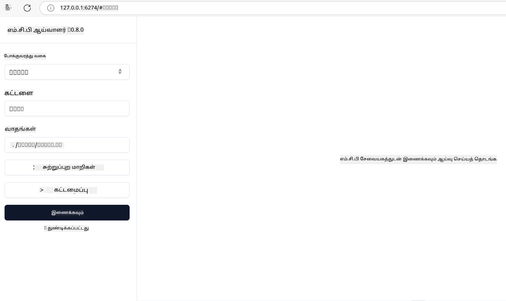

<!--
CO_OP_TRANSLATOR_METADATA:
{
  "original_hash": "83efa75a69bc831277263a6f1ae53669",
  "translation_date": "2025-10-11T13:00:34+00:00",
  "source_file": "04-PracticalImplementation/README.md",
  "language_code": "ta"
}
-->
# நடைமுறை செயல்பாடு

[](https://youtu.be/vCN9-mKBDfQ)

_(இந்த பாடத்தின் வீடியோவைப் பார்க்க மேலே உள்ள படத்தை கிளிக் செய்யவும்)_

நடைமுறை செயல்பாட்டில் தான் மாடல் சூழல் நெறிமுறை (MCP) தனது முழு சக்தியையும் வெளிப்படுத்துகிறது. MCP பற்றிய கோட்பாடு மற்றும் கட்டமைப்பை புரிந்துகொள்வது முக்கியமானது, ஆனால் உண்மையான மதிப்பு நீங்கள் இந்த கருத்துக்களை பயன்படுத்தி நிஜ உலக பிரச்சனைகளை தீர்க்கும் தீர்வுகளை உருவாக்கும்போது வெளிப்படுகிறது. இந்த அத்தியாயம் கருத்து அறிவுக்கும், கைகூலி வளர்ச்சிக்கும் இடையே உள்ள இடைவெளியை நிரப்புகிறது, MCP அடிப்படையிலான பயன்பாடுகளை உருவாக்கும் செயல்முறையில் உங்களை வழிநடத்துகிறது.

நீங்கள் புத்திசாலி உதவியாளர்களை உருவாக்குகிறீர்களா, தொழில்துறை வேலைப்பாடுகளில் AI ஐ ஒருங்கிணைக்கிறீர்களா அல்லது தரவுகளை செயலாக்க தனிப்பயன் கருவிகளை உருவாக்குகிறீர்களா என்பதை பொருட்படுத்தாமல், MCP ஒரு நெகிழ்வான அடித்தளத்தை வழங்குகிறது. அதன் மொழி சார்பற்ற வடிவமைப்பு மற்றும் பிரபலமான நிரலாக்க மொழிகளுக்கான அதிகாரப்பூர்வ SDKகள் பல்வேறு டெவலப்பர்களுக்கும் அணுகக்கூடியதாக இருக்கிறது. இந்த SDKகளைப் பயன்படுத்துவதன் மூலம், நீங்கள் விரைவாக மாதிரிகளை உருவாக்கி, திருத்தி, பல்வேறு தளங்கள் மற்றும் சூழல்களில் உங்கள் தீர்வுகளை விரிவாக்கலாம்.

அடுத்த பகுதிகளில், MCP ஐ C#, Java with Spring, TypeScript, JavaScript மற்றும் Python ஆகியவற்றில் செயல்படுத்துவதற்கான நடைமுறை உதாரணங்கள், மாதிரி குறியீடுகள் மற்றும் வெளியீட்டு உத்திகள் கொடுக்கப்பட்டுள்ளன. மேலும், MCP சர்வர்களை சோதித்து பிழைதிருத்துவது, APIகளை நிர்வகிப்பது மற்றும் Azure ஐப் பயன்படுத்தி தீர்வுகளை மேகத்துக்கு வெளியிடுவது பற்றியும் நீங்கள் கற்றுக்கொள்வீர்கள். இந்த கைகூலி வளங்கள் உங்கள் கற்றலை விரைவுபடுத்தவும், வலுவான, உற்பத்தி-தயார் MCP பயன்பாடுகளை நம்பிக்கையுடன் உருவாக்கவும் உதவும்.

## மேலோட்டம்

இந்த பாடம் பல்வேறு நிரலாக்க மொழிகளில் MCP செயல்பாட்டின் நடைமுறை அம்சங்களை மையமாகக் கொண்டுள்ளது. C#, Java with Spring, TypeScript, JavaScript மற்றும் Python ஆகியவற்றில் MCP SDKகளை எவ்வாறு பயன்படுத்தி வலுவான பயன்பாடுகளை உருவாக்குவது, MCP சர்வர்களை சோதித்து பிழைதிருத்துவது மற்றும் மீண்டும் பயன்படுத்தக்கூடிய வளங்கள், உத்தேசங்கள் மற்றும் கருவிகளை உருவாக்குவது என்பதையும் நாம் ஆராய்வோம்.

## கற்றல் நோக்கங்கள்

இந்த பாடத்தின் முடிவில், நீங்கள்:

- பல்வேறு நிரலாக்க மொழிகளில் அதிகாரப்பூர்வ SDKகளைப் பயன்படுத்தி MCP தீர்வுகளை செயல்படுத்த முடியும்
- MCP சர்வர்களை முறையாக சோதித்து பிழைதிருத்த முடியும்
- சர்வர் அம்சங்களை உருவாக்கி பயன்படுத்த முடியும் (வளங்கள், உத்தேசங்கள் மற்றும் கருவிகள்)
- சிக்கலான பணிகளுக்கான பயனுள்ள MCP வேலைப்பாடுகளை வடிவமைக்க முடியும்
- செயல்திறன் மற்றும் நம்பகத்தன்மைக்காக MCP செயல்பாடுகளை மேம்படுத்த முடியும்

## அதிகாரப்பூர்வ SDK வளங்கள்

மாடல் சூழல் நெறிமுறைக்கு பல்வேறு மொழிகளுக்கான அதிகாரப்பூர்வ SDKகள் உள்ளன:

- [C# SDK](https://github.com/modelcontextprotocol/csharp-sdk)
- [Java with Spring SDK](https://github.com/modelcontextprotocol/java-sdk) **குறிப்பு:** [Project Reactor](https://projectreactor.io) மீது சார்ந்துள்ளது. (பார்க்கவும் [discussion issue 246](https://github.com/orgs/modelcontextprotocol/discussions/246).)
- [TypeScript SDK](https://github.com/modelcontextprotocol/typescript-sdk)
- [Python SDK](https://github.com/modelcontextprotocol/python-sdk)
- [Kotlin SDK](https://github.com/modelcontextprotocol/kotlin-sdk)

## MCP SDKகளுடன் வேலை செய்வது

இந்த பகுதி பல்வேறு நிரலாக்க மொழிகளில் MCP ஐ செயல்படுத்துவதற்கான நடைமுறை உதாரணங்களை வழங்குகிறது. நீங்கள் `samples` கோப்பகத்தில் மொழி அடிப்படையில் ஒழுங்குபடுத்தப்பட்ட மாதிரி குறியீடுகளை காணலாம்.

### கிடைக்கும் மாதிரிகள்

களஞ்சியத்தில் பின்வரும் மொழிகளில் [மாதிரி செயல்பாடுகள்](../../../04-PracticalImplementation/samples) உள்ளன:

- [C#](./samples/csharp/README.md)
- [Java with Spring](./samples/java/containerapp/README.md)
- [TypeScript](./samples/typescript/README.md)
- [JavaScript](./samples/javascript/README.md)
- [Python](./samples/python/README.md)

ஒவ்வொரு மாதிரியும் அந்த குறிப்பிட்ட மொழி மற்றும் சூழலுக்கான முக்கிய MCP கருத்துக்களையும் செயல்பாட்டு முறைமைகளையும் விளக்குகிறது.

## முக்கிய சர்வர் அம்சங்கள்

MCP சர்வர்கள் பின்வரும் அம்சங்களில் ஏதேனும் ஒன்றையாவது செயல்படுத்த முடியும்:

### வளங்கள்

வளங்கள் பயனர் அல்லது AI மாடலுக்கு பயன்படுத்த சூழல் மற்றும் தரவுகளை வழங்குகின்றன:

- ஆவண களஞ்சியங்கள்
- அறிவு அடுக்குகள்
- கட்டமைக்கப்பட்ட தரவுத் தரவுத்தொகுப்புகள்
- கோப்பு முறைமைகள்

### உத்தேசங்கள்

உத்தேசங்கள் பயனர்களுக்கான வார்ப்புரு செய்திகளும் வேலைப்பாடுகளும் ஆகும்:

- முன்கூட்டியே வரையறுக்கப்பட்ட உரையாடல் வார்ப்புருக்கள்
- வழிகாட்டும் தொடர்பு முறைமைகள்
- சிறப்பு உரையாடல் அமைப்புகள்

### கருவிகள்

கருவிகள் AI மாடல் செயல்படுத்தும் செயல்பாடுகள் ஆகும்:

- தரவு செயலாக்க உதவிகள்
- வெளிப்புற API ஒருங்கிணைப்புகள்
- கணக்கீட்டு திறன்கள்
- தேடல் செயல்பாடு

## மாதிரி செயல்பாடுகள்: C# செயல்பாடு

அதிகாரப்பூர்வ C# SDK களஞ்சியம் MCP இன் பல்வேறு அம்சங்களை விளக்கும் பல மாதிரி செயல்பாடுகளை கொண்டுள்ளது:

- **அடிப்படை MCP கிளையண்ட்**: MCP கிளையண்ட் ஒன்றை உருவாக்கி கருவிகளை அழைக்கும் எளிய உதாரணம்
- **அடிப்படை MCP சர்வர்**: அடிப்படை கருவி பதிவு கொண்ட குறைந்தபட்ச சர்வர் செயல்பாடு
- **மேம்பட்ட MCP சர்வர்**: கருவி பதிவு, அங்கீகாரம் மற்றும் பிழை கையாளுதல் கொண்ட முழுமையான சர்வர்
- **ASP.NET ஒருங்கிணைப்பு**: ASP.NET Core உடன் ஒருங்கிணைப்பை விளக்கும் உதாரணங்கள்
- **கருவி செயல்பாட்டு முறைமைகள்**: பல்வேறு சிக்கலான நிலைகளுக்கு கருவிகளை செயல்படுத்துவதற்கான முறைமைகள்

C# MCP SDK முன்னோட்ட நிலையில் உள்ளது மற்றும் APIகள் மாறக்கூடும். SDK மேம்படுத்தப்படும் போது இந்த வலைப்பதிவு தொடர்ந்து புதுப்பிக்கப்படும்.

### முக்கிய அம்சங்கள்

- [C# MCP Nuget ModelContextProtocol](https://www.nuget.org/packages/ModelContextProtocol)
- உங்கள் [முதல் MCP சர்வரை உருவாக்குதல்](https://devblogs.microsoft.com/dotnet/build-a-model-context-protocol-mcp-server-in-csharp/).

முழுமையான C# செயல்பாட்டு மாதிரிகளுக்கு, [அதிகாரப்பூர்வ C# SDK மாதிரி களஞ்சியத்தை](https://github.com/modelcontextprotocol/csharp-sdk) பார்வையிடவும்.

## மாதிரி செயல்பாடு: Java with Spring செயல்பாடு

Java with Spring SDK நிறுவன தரமான அம்சங்களுடன் வலுவான MCP செயல்பாட்டு விருப்பங்களை வழங்குகிறது.

### முக்கிய அம்சங்கள்

- ஸ்பிரிங் ஃபிரேம்வொர்க் ஒருங்கிணைப்பு
- வலுவான வகை பாதுகாப்பு
- எதிர்வினை நிரலாக்க ஆதரவு
- விரிவான பிழை கையாளுதல்

முழுமையான Java with Spring செயல்பாட்டு மாதிரிக்கான உதாரணத்திற்காக, மாதிரி கோப்பகத்தில் உள்ள [Java with Spring sample](samples/java/containerapp/README.md) ஐப் பார்க்கவும்.

## மாதிரி செயல்பாடு: JavaScript செயல்பாடு

JavaScript SDK MCP செயல்பாட்டிற்கான எளிய மற்றும் நெகிழ்வான அணுகுமுறையை வழங்குகிறது.

### முக்கிய அம்சங்கள்

- Node.js மற்றும் உலாவி ஆதரவு
- வாக்குறுதி அடிப்படையிலான API
- Express மற்றும் பிற ஃபிரேம்வொர்க்குகளுடன் எளிய ஒருங்கிணைப்பு
- ஸ்ட்ரீமிங் க்கான WebSocket ஆதரவு

முழுமையான JavaScript செயல்பாட்டு மாதிரிக்கான உதாரணத்திற்காக, மாதிரி கோப்பகத்தில் உள்ள [JavaScript sample](samples/javascript/README.md) ஐப் பார்க்கவும்.

## மாதிரி செயல்பாடு: Python செயல்பாடு

Python SDK சிறந்த இயந்திர கற்றல் (ML) கட்டமைப்பு ஒருங்கிணைப்புகளுடன் Python முறைப்படி MCP செயல்பாட்டை வழங்குகிறது.

### முக்கிய அம்சங்கள்

- asyncio உடன் Async/await ஆதரவு
- FastAPI ஒருங்கிணைப்பு
- எளிய கருவி பதிவு
- பிரபலமான ML நூலகங்களுடன் உள்ளூர் ஒருங்கிணைப்பு

முழுமையான Python செயல்பாட்டு மாதிரிக்கான உதாரணத்திற்காக, மாதிரி கோப்பகத்தில் உள்ள [Python sample](samples/python/README.md) ஐப் பார்க்கவும்.

## API மேலாண்மை

Azure API மேலாண்மை MCP சர்வர்களை பாதுகாப்பதற்கான சிறந்த தீர்வாகும். உங்கள் MCP சர்வரின் முன் ஒரு Azure API மேலாண்மை நிகழ்வை அமைத்து, நீங்கள் விரும்பக்கூடிய அம்சங்களை அது கையாள அனுமதிக்கலாம், உதாரணமாக:

- விகித வரம்பு
- டோக்கன் மேலாண்மை
- கண்காணிப்பு
- சுமை சமநிலை
- பாதுகாப்பு

### Azure மாதிரி

இங்கே ஒரு Azure மாதிரி உள்ளது, அதாவது [MCP சர்வரை உருவாக்கி அதை Azure API மேலாண்மையுடன் பாதுகாப்பது](https://github.com/Azure-Samples/remote-mcp-apim-functions-python).

கீழே உள்ள படத்தில் அங்கீகார ஓட்டம் எப்படி நடக்கிறது என்பதைப் பாருங்கள்:


மேலே உள்ள படத்தில், பின்வரும் நிகழ்கிறது:

- Microsoft Entra ஐப் பயன்படுத்தி அங்கீகாரம்/அங்கீகாரமளிப்பு நடக்கிறது.
- Azure API மேலாண்மை ஒரு நுழைவாயிலாக செயல்பட்டு போக்குவரத்தை வழிநடத்த மற்றும் நிர்வகிக்க கொள்கைகளைப் பயன்படுத்துகிறது.
- Azure Monitor அனைத்து கோரிக்கைகளையும் பதிவு செய்து மேலதிகமாக பகுப்பாய்வு செய்கிறது.

#### அங்கீகார ஓட்டம்

அங்கீகார ஓட்டத்தை மேலும் விரிவாகப் பார்ப்போம்:


#### MCP அங்கீகார விவரக்குறிப்பு

[MCP அங்கீகார விவரக்குறிப்பை](https://modelcontextprotocol.io/specification/2025-03-26/basic/authorization#2-10-third-party-authorization-flow) பற்றி மேலும் அறிக.

## Azure க்கு தொலைதூர MCP சர்வரை வெளியிடுதல்

முந்தைய மாதிரியை வெளியிட முயற்சிப்போம்:

1. களஞ்சியத்தை கிளோன் செய்யவும்

    ```bash
    git clone https://github.com/Azure-Samples/remote-mcp-apim-functions-python.git
    cd remote-mcp-apim-functions-python
    ```

1. `Microsoft.App` வள வழங்குநரை பதிவு செய்யவும்.

   - நீங்கள் Azure CLI ஐப் பயன்படுத்தினால், `az provider register --namespace Microsoft.App --wait` ஐ இயக்கவும்.
   - நீங்கள் Azure PowerShell ஐப் பயன்படுத்தினால், `Register-AzResourceProvider -ProviderNamespace Microsoft.App` ஐ இயக்கவும். பின்னர் சில நேரம் கழித்து பதிவு முடிந்ததா என்பதைச் சரிபார்க்க `Get-AzResourceProvider -ProviderNamespace Microsoft.App).RegistrationState` ஐ இயக்கவும்.

1. இந்த [azd](https://aka.ms/azd) கட்டளையை இயக்கி API மேலாண்மை சேவை, செயல்பாட்டு பயன்பாடு (குறியீடு உடன்) மற்றும் அனைத்து தேவையான Azure வளங்களையும் ஏற்பாடு செய்யவும்

    ```shell
    azd up
    ```

    இந்த கட்டளைகள் அனைத்து மேக வளங்களையும் Azure இல் வெளியிட வேண்டும்

### MCP இன்ஸ்பெக்டருடன் உங்கள் சர்வரை சோதித்தல்

1. **புதிய டெர்மினல் சாளரத்தில்**, MCP இன்ஸ்பெக்டரை நிறுவி இயக்கவும்

    ```shell
    npx @modelcontextprotocol/inspector
    ```

    நீங்கள் பின்வரும் போன்ற ஒரு இடைமுகத்தை காணலாம்:

    

1. MCP இன்ஸ்பெக்டர் வலை பயன்பாட்டை, பயன்பாட்டால் காட்டப்படும் URL இல் இருந்து (e.g. [http://127.0.0.1:6274/#resources](http://127.0.0.1:6274/#resources)) CTRL கிளிக் செய்து ஏற்றவும்.
1. போக்குவரத்து வகையை `SSE` ஆக அமைக்கவும்
1. `azd up` க்கு பிறகு காட்டப்படும் உங்கள் இயங்கும் API மேலாண்மை SSE இறுதிப்புள்ளிக்கு URL ஐ அமைத்து **Connect** செய்யவும்:

    ```shell
    https://<apim-servicename-from-azd-output>.azure-api.net/mcp/sse
    ```

1. **கருவிகளை பட்டியலிடவும்**. ஒரு கருவியை கிளிக் செய்து **கருவியை இயக்கவும்**.

மேலே உள்ள அனைத்து படிகளும் சரியாக செயல்பட்டால், நீங்கள் MCP சர்வருடன் இணைக்கப்பட்டு, ஒரு கருவியை அழைக்க முடிந்திருக்க வேண்டும்.

## Azure க்கான MCP சர்வர்கள்

[Remote-mcp-functions](https://github.com/Azure-Samples/remote-mcp-functions-dotnet): இந்த களஞ்சியங்கள் Python, C# .NET அல்லது Node/TypeScript உடன் Azure Functions ஐப் பயன்படுத்தி தனிப்பயன் தொலைதூர MCP (Model Context Protocol) சர்வர்களை உருவாக்கவும் வெளியிடவும் விரைவான மாதிரி தீர்வுகளை வழங்குகின்றன.

இந்த மாதிரிகள் டெவலப்பர்களுக்கு பின்வரும் செயல்பாடுகளை வழங்குகின்றன:

- உள்ளூரில் உருவாக்கி இயக்குதல்: உள்ளூர் கணினியில் MCP சர்வரை உருவாக்கி பிழைதிருத்துதல்
- Azure க்கு வெளியிடுதல்: ஒரு எளிய azd up கட்டளையுடன் மேகத்திற்கு எளிதாக வெளியிடுதல்
- கிளையண்ட்களிலிருந்து இணைதல்: VS Code இன் Copilot முகமூடி முறை மற்றும் MCP இன்ஸ்பெக்டர் கருவி உட்பட பல கிளையண்ட்களிலிருந்து MCP சர்வருடன் இணைதல்

### முக்கிய அம்சங்கள்

- வடிவமைப்பில் பாதுகாப்பு: MCP சர்வர் விசைகள் மற்றும் HTTPS ஐப் பயன்படுத்தி பாதுகாக்கப்பட்டுள்ளது
- அங்கீகார விருப்பங்கள்: உட்பொதிக்கப்பட்ட அங்கீகாரத்துடன் மற்றும்/அல்லது API மேலாண்மையுடன் OAuth ஐ ஆதரிக்கிறது
- நெட்வொர்க் தனிமைப்படுத்தல்: Azure மெய்நிகர் நெட்வொர்க்கள் (VNET) ஐப் பயன்படுத்தி நெட்வொர்க் தனிமைப்படுத்தலை அனுமதிக்கிறது
- சர்வர் இல்லாத கட்டமைப்பு: அளவீடு செய்யக்கூடிய, நிகழ்வை இயக்கும் செயல்பாட்டிற்கான Azure Functions ஐ பயன்படுத்துகிறது
- உள்ளூர் மேம்பாடு: விரிவான உள்ளூர் மேம்பாடு மற்றும் பிழைதிருத்த ஆதரவு
- எளிய வெளியீடு: Azure க்கு நேர்த்தியான வெளியீட்டு செயல்முறை

களஞ்சியம் உற்பத்தி-தயார் MCP சர்வர் செயல்பாட்டை விரைவாகத் தொடங்க தேவையான அனைத்து கட்டமைப்பு கோப்புகள், மூலக் குறியீடு மற்றும் உள்கட்டமைப்பு வரையறைகளை உள்ளடக்கியது.

- [Azure Remote MCP Functions Python](https://github.com/Azure-Samples/remote-mcp-functions-python) - Python உடன் Azure Functions ஐப் பயன்படுத்தி MCP செயல்பாட்டின் மாதிரி செயல்பாடு

- [Azure Remote MCP Functions .NET](https://github.com/Azure-Samples/remote-mcp-functions-dotnet) - C# .NET உடன் Azure Functions ஐப் பயன்படுத்தி MCP செயல்பாட்டின் மாதிரி செயல்பாடு

- [Azure Remote MCP Functions Node/Typescript](https://github.com/Azure-Samples/remote-mcp-functions-typescript) - Node/TypeScript உடன் Azure Functions ஐப் பயன்படுத்தி MCP செயல்பாட்டின் மாதிரி செயல்பாடு.

## முக்கிய குறிப்புகள்

- MCP SDKகள் வலுவான MCP தீர்வுகளை செயல்படுத்த மொழி சார்ந்த கருவிகளை வழங்குகின்றன
- MCP பயன்பாடுகளின் நம்பகத்தன்மைக்காக பிழைதிருத்தல் மற்றும் சோதனை செயல்முறை முக்கியமானது
- மீண்டும் பயன்படுத்தக்கூடிய உத்தேச வார்ப்புருக்கள் AI தொடர்புகளை சீராகச் செய்ய உதவுகின்றன
- நன்கு வடிவமைக்கப்பட்ட வேலைப்பாடுகள் பல்வேறு கருவிகளைப் பயன்படுத்தி சிக்கலான பணிகளை ஒருங்கிணைக்க முடியும்
- MCP தீர்வுகளை செயல்படுத்த பாதுகாப்பு, செயல்திறன் மற்றும் பிழை கையாளுதல் ஆகியவற்றை கருத்தில் கொள்ள வேண்டும்

## பயிற்சி

உங்கள் துறையில் ஒரு நிஜ உலக பிரச்சனையை தீர்க்கும் ஒரு நடைமுறை MCP வேலைப்பாடுகளை வடிவமைக்கவும்:

1. இந்த பிரச்சனையைத் தீர்க்க 3-4 கருவிகளை அடையாளம் காணவும்
2. இந்த கருவிகள் எப்படி ஒருவருக்கொருவர் தொடர்பு கொள்கின்றன என்பதை காட்டும் ஒரு வேலைப்பாடு வரைபடத்தை உருவாக்கவும்
3. இந்த கருவிகளில் ஒன்றின் அடிப்படை பதிப்பை உங்கள் விருப்ப மொழியைப் பயன்படுத்தி செயல்படுத்தவும்
4. உங்கள் கருவியை

---

**குறிப்பு**:  
இந்த ஆவணம் [Co-op Translator](https://github.com/Azure/co-op-translator) என்ற AI மொழிபெயர்ப்பு சேவையைப் பயன்படுத்தி மொழிபெயர்க்கப்பட்டுள்ளது. நாங்கள் துல்லியத்திற்காக முயற்சிக்கின்றோம், ஆனால் தானியங்கி மொழிபெயர்ப்புகளில் பிழைகள் அல்லது தவறான தகவல்கள் இருக்கக்கூடும் என்பதை கவனத்தில் கொள்ளவும். அதன் தாய்மொழியில் உள்ள மூல ஆவணம் அதிகாரப்பூர்வ ஆதாரமாக கருதப்பட வேண்டும். முக்கியமான தகவல்களுக்கு, தொழில்முறை மனித மொழிபெயர்ப்பு பரிந்துரைக்கப்படுகிறது. இந்த மொழிபெயர்ப்பைப் பயன்படுத்துவதால் ஏற்படும் எந்த தவறான புரிதல்கள் அல்லது தவறான விளக்கங்களுக்கு நாங்கள் பொறுப்பல்ல.