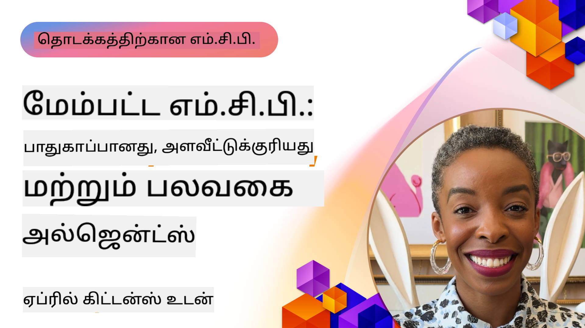

<!--
CO_OP_TRANSLATOR_METADATA:
{
  "original_hash": "d204bc94ea6027d06a703b21b711ca57",
  "translation_date": "2025-10-11T12:09:01+00:00",
  "source_file": "05-AdvancedTopics/README.md",
  "language_code": "ta"
}
-->
# MCP இல் மேம்பட்ட தலைப்புகள்

_(மேலே உள்ள படத்தை கிளிக் செய்து இந்த பாடத்தின் வீடியோவைப் பாருங்கள்)_

இந்த அத்தியாயம் Model Context Protocol (MCP) செயல்பாட்டில் பலவகை ஒருங்கிணைப்பு, அளவளாவுதல், பாதுகாப்பு சிறந்த நடைமுறைகள் மற்றும் நிறுவன ஒருங்கிணைப்பு போன்ற மேம்பட்ட தலைப்புகளை உள்ளடக்கியது. இவை நவீன AI அமைப்புகளின் தேவைகளை பூர்த்தி செய்யும் வலுவான மற்றும் உற்பத்தி தயார MCP பயன்பாடுகளை உருவாக்க முக்கியமானவை.

## கண்ணோட்டம்

இந்த பாடம் Model Context Protocol செயல்பாட்டில் மேம்பட்ட கருத்துக்களை ஆராய்கிறது, குறிப்பாக பலவகை ஒருங்கிணைப்பு, அளவளாவுதல், பாதுகாப்பு சிறந்த நடைமுறைகள் மற்றும் நிறுவன ஒருங்கிணைப்பு. இவை நிறுவன சூழல்களில் சிக்கலான தேவைகளை கையாளும் உற்பத்தி தர MCP பயன்பாடுகளை உருவாக்க முக்கியமானவை.

## கற்றல் நோக்கங்கள்

இந்த பாடத்தின் முடிவில், நீங்கள்:

- MCP கட்டமைப்புகளில் பலவகை திறன்களை செயல்படுத்த முடியும்
- அதிக தேவைக்கான MCP கட்டமைப்புகளை வடிவமைக்க முடியும்
- MCP பாதுகாப்பு கொள்கைகளுடன் இணைந்த பாதுகாப்பு சிறந்த நடைமுறைகளைப் பயன்படுத்த முடியும்
- MCP ஐ நிறுவன AI அமைப்புகள் மற்றும் கட்டமைப்புகளுடன் ஒருங்கிணைக்க முடியும்
- உற்பத்தி சூழல்களில் செயல்திறன் மற்றும் நம்பகத்தன்மையை மேம்படுத்த முடியும்

## பாடங்கள் மற்றும் மாதிரி திட்டங்கள்

| இணைப்பு | தலைப்பு | விளக்கம் |
|------|-------|-------------|
| [5.1 Azure உடன் ஒருங்கிணைப்பு](./mcp-integration/README.md) | Azure உடன் ஒருங்கிணைப்பு | உங்கள் MCP சர்வரை Azure இல் ஒருங்கிணைப்பது எப்படி என்பதை அறிக. |
| [5.2 பலவகை மாதிரி](./mcp-multi-modality/README.md) | MCP பலவகை மாதிரிகள் | ஒலி, படம் மற்றும் பலவகை பதில்களுக்கான மாதிரிகள். |
| [5.3 MCP OAuth2 மாதிரி](../../../05-AdvancedTopics/mcp-oauth2-demo) | MCP OAuth2 டெமோ | MCP உடன் Authorization மற்றும் Resource Server ஆக செயல்படும் குறைந்தபட்ச Spring Boot பயன்பாடு. பாதுகாப்பான டோக்கன் வெளியீடு, பாதுகாக்கப்பட்ட முடுக்கங்கள், Azure Container Apps பிரசுரம் மற்றும் API மேலாண்மை ஒருங்கிணைப்பை விளக்குகிறது. |
| [5.4 Root Contexts](./mcp-root-contexts/README.md) | Root Contexts | Root Context பற்றி மேலும் அறிந்து, அவற்றை செயல்படுத்துவது எப்படி என்பதை கற்றுக்கொள்ளுங்கள். |
| [5.5 வழிமாற்றம்](./mcp-routing/README.md) | வழிமாற்றம் | பல்வேறு வகையான வழிமாற்றங்களை கற்றுக்கொள்ளுங்கள். |
| [5.6 மாதிரிகள்](./mcp-sampling/README.md) | மாதிரிகள் | மாதிரிகளுடன் வேலை செய்வது எப்படி என்பதை கற்றுக்கொள்ளுங்கள். |
| [5.7 அளவளாவுதல்](./mcp-scaling/README.md) | அளவளாவுதல் | அளவளாவுதல் பற்றி அறிக. |
| [5.8 பாதுகாப்பு](./mcp-security/README.md) | பாதுகாப்பு | உங்கள் MCP சர்வரை பாதுகாக்கவும். |
| [5.9 வலை தேடல் மாதிரி](./web-search-mcp/README.md) | வலை தேடல் MCP | Python MCP சர்வர் மற்றும் SerpAPI உடன் ஒருங்கிணைந்த வாடிக்கையாளர், நேரடி வலை, செய்தி, பொருள் தேடல் மற்றும் கேள்வி-பதில். பல கருவி ஒருங்கிணைப்பு, வெளிப்புற API ஒருங்கிணைப்பு மற்றும் வலுவான பிழை கையாளுதலை விளக்குகிறது. |
| [5.10 நேரடி ஸ்ட்ரீமிங்](./mcp-realtimestreaming/README.md) | ஸ்ட்ரீமிங் | நேரடி தரவுப் பரிமாற்றம் இன்று தரவின் அடிப்படையிலான உலகில் முக்கியமானதாக மாறியுள்ளது, எங்கு தொழில்கள் மற்றும் பயன்பாடுகள் உடனடி தகவல்களைப் பெற வேண்டும். |
| [5.11 நேரடி வலை தேடல்](./mcp-realtimesearch/README.md) | வலை தேடல் | MCP எப்படி AI மாதிரிகள், தேடல் இயந்திரங்கள் மற்றும் பயன்பாடுகளுக்கு இடையே தரவுப் பரிமாற்றத்தை ஒருங்கிணைத்து நேரடி வலை தேடலை மாற்றுகிறது என்பதை அறிக. |
| [5.12 Model Context Protocol சர்வர்களுக்கான Entra ID அங்கீகாரம்](./mcp-security-entra/README.md) | Entra ID அங்கீகாரம் | Microsoft Entra ID ஒரு வலுவான மேக அடிப்படையிலான அடையாள மற்றும் அணுகல் மேலாண்மை தீர்வை வழங்குகிறது, உங்கள் MCP சர்வருடன் தொடர்பு கொள்ள அனுமதிக்கப்பட்ட பயனர்கள் மற்றும் பயன்பாடுகள் மட்டுமே உறுதிப்படுத்த உதவுகிறது. |
| [5.13 Azure AI Foundry முகவர் ஒருங்கிணைப்பு](./mcp-foundry-agent-integration/README.md) | Azure AI Foundry ஒருங்கிணைப்பு | Model Context Protocol சர்வர்களை Azure AI Foundry முகவர்களுடன் ஒருங்கிணைப்பது எப்படி என்பதை கற்றுக்கொள்ளுங்கள், வலுவான கருவி ஒருங்கிணைப்பு மற்றும் நிறுவன AI திறன்களை வெளிப்புற தரவுப் பிரிவுகளுடன் ஒருங்கிணைக்க உதவுகிறது. |
| [5.14 Context Engineering](./mcp-contextengineering/README.md) | Context Engineering | MCP சர்வர்களுக்கான Context Engineering தொழில்நுட்பங்களின் எதிர்கால வாய்ப்புகள், Context Optimization, Dynamic Context Management மற்றும் MCP கட்டமைப்புகளில் Prompt Engineering க்கான செயல்திறன் உத்திகள். |

## கூடுதல் குறிப்புகள்

மேம்பட்ட MCP தலைப்புகள் பற்றிய சமீபத்திய தகவலுக்கு, கீழே உள்ளவற்றை பார்க்கவும்:
- [MCP ஆவணங்கள்](https://modelcontextprotocol.io/)
- [MCP விவரக்குறிப்பு](https://spec.modelcontextprotocol.io/)
- [GitHub Repository](https://github.com/modelcontextprotocol)

## முக்கிய குறிப்புகள்

- பலவகை MCP செயல்பாடுகள் AI திறன்களை உரை செயலாக்கத்திற்கு அப்பால் விரிவாக்குகிறது
- நிறுவன பயன்பாடுகளுக்கு அளவளாவுதல் முக்கியமானது, இது கிடைமட்ட மற்றும் செங்குத்து அளவளாவுதலின் மூலம் தீர்க்கப்படலாம்
- விரிவான பாதுகாப்பு நடவடிக்கைகள் தரவுகளை பாதுகாக்கவும், சரியான அணுகல் கட்டுப்பாட்டை உறுதிப்படுத்தவும் உதவுகிறது
- Azure OpenAI மற்றும் Microsoft AI Foundry போன்ற தளங்களுடன் நிறுவன ஒருங்கிணைப்பு MCP திறன்களை மேம்படுத்துகிறது
- மேம்பட்ட MCP செயல்பாடுகள் மேம்படுத்தப்பட்ட கட்டமைப்புகள் மற்றும் கவனமாக வள மேலாண்மையால் பயனடைகின்றன

## பயிற்சி

ஒரு குறிப்பிட்ட பயன்பாட்டிற்கான நிறுவன தர MCP செயல்பாட்டை வடிவமைக்கவும்:

1. உங்கள் பயன்பாட்டிற்கான பலவகை தேவைகளை அடையாளம் காணவும்
2. நுண்ணறிவு தரவுகளை பாதுகாக்க தேவையான பாதுகாப்பு கட்டுப்பாடுகளை வரையறுக்கவும்
3. மாறும் சுமையை கையாளக்கூடிய அளவளாவலான கட்டமைப்பை வடிவமைக்கவும்
4. நிறுவன AI அமைப்புகளுடன் ஒருங்கிணைப்பு புள்ளிகளை திட்டமிடவும்
5. செயல்திறன் குறைபாடுகள் மற்றும் தீர்வு உத்திகளை ஆவணப்படுத்தவும்

## கூடுதல் வளங்கள்

- [Azure OpenAI ஆவணங்கள்](https://learn.microsoft.com/en-us/azure/ai-services/openai/)
- [Microsoft AI Foundry ஆவணங்கள்](https://learn.microsoft.com/en-us/ai-services/)

---

## அடுத்தது என்ன

- [5.1 MCP ஒருங்கிணைப்பு](./mcp-integration/README.md)

---

**குறிப்பு**:  
இந்த ஆவணம் [Co-op Translator](https://github.com/Azure/co-op-translator) என்ற AI மொழிபெயர்ப்பு சேவையை பயன்படுத்தி மொழிபெயர்க்கப்பட்டுள்ளது. நாங்கள் துல்லியத்திற்காக முயற்சிக்கின்றோம், ஆனால் தானியங்கி மொழிபெயர்ப்புகளில் பிழைகள் அல்லது துல்லியக்குறைவுகள் இருக்கக்கூடும் என்பதை கவனத்தில் கொள்ளவும். அதன் தாய்மொழியில் உள்ள மூல ஆவணம் அதிகாரப்பூர்வ ஆதாரமாக கருதப்பட வேண்டும். முக்கியமான தகவல்களுக்கு, தொழில்முறை மனித மொழிபெயர்ப்பு பரிந்துரைக்கப்படுகிறது. இந்த மொழிபெயர்ப்பைப் பயன்படுத்துவதால் ஏற்படும் தவறான புரிதல்கள் அல்லது தவறான விளக்கங்களுக்கு நாங்கள் பொறுப்பல்ல.