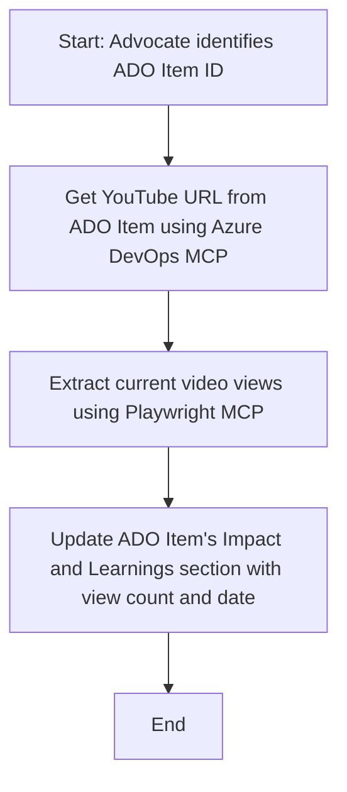

<!--
CO_OP_TRANSLATOR_METADATA:
{
  "original_hash": "14a2dfbea55ef735660a06bd6bdfe5f3",
  "translation_date": "2025-10-11T12:37:41+00:00",
  "source_file": "09-CaseStudy/UpdateADOItemsFromYT.md",
  "language_code": "ta"
}
-->
# வழக்குக் கதை: MCP மூலம் YouTube தரவுகளை Azure DevOps உருப்படிகளில் புதுப்பித்தல்

> **மறுப்பு:** YouTube போன்ற தளங்களிலிருந்து Azure DevOps உருப்படிகளை புதுப்பிக்க தானியக்கமாக செயல்படும் ஆன்லைன் கருவிகள் மற்றும் அறிக்கைகள் ஏற்கனவே உள்ளன. MCP கருவிகளை தானியக்கம் மற்றும் ஒருங்கிணைப்பு பணிகளுக்கு பயன்படுத்துவதற்கான மாதிரி பயன்பாட்டை விளக்குவதற்காக கீழே உள்ள சூழ்நிலை வழங்கப்பட்டுள்ளது.

## கண்ணோட்டம்

இந்த வழக்குக் கதை, ஆன்லைன் தளங்களிலிருந்து (உதாரணமாக YouTube) பெறப்பட்ட தகவல்களை Azure DevOps (ADO) பணியிடங்களில் தானியக்கமாக புதுப்பிக்க Model Context Protocol (MCP) மற்றும் அதன் கருவிகளை எப்படி பயன்படுத்தலாம் என்பதை ஒரு உதாரணமாகக் காட்டுகிறது. இந்த விளக்கம் MCP கருவிகளின் பரந்த திறன்களை விளக்குவதற்கான ஒரு மாதிரி மட்டுமே, இது பல தானியக்க தேவைகளுக்கு ஏற்றவாறு மாற்றப்படலாம்.

இந்த உதாரணத்தில், ஒரு Advocate ஆன்லைன் அமர்வுகளை ADO உருப்படிகள் மூலம் கண்காணிக்கிறார், ஒவ்வொரு உருப்படியும் YouTube வீடியோ URL ஐ உள்ளடக்கியது. MCP கருவிகளை பயன்படுத்தி, Advocate வீடியோ பார்வை எண்ணிக்கை போன்ற சமீபத்திய அளவுகோல்களுடன் ADO உருப்படிகளை தானியக்கமாகவும் மீண்டும் பயன்படுத்தக்கூடிய முறையில் புதுப்பிக்க முடிகிறது. இந்த அணுகுமுறை, ஆன்லைன் மூலங்களிலிருந்து பெறப்பட்ட தகவல்களை ADO அல்லது பிற அமைப்புகளில் ஒருங்கிணைக்க வேண்டிய பிற பயன்பாடுகளுக்கு பொதுவாக பயன்படுத்தப்படலாம்.

## சூழ்நிலை

ஒரு Advocate ஆன்லைன் அமர்வுகள் மற்றும் சமூக ஈடுபாடுகளின் தாக்கத்தை கண்காணிக்க பொறுப்பாக உள்ளார். ஒவ்வொரு அமர்வும் 'DevRel' திட்டத்தில் ADO பணியிடமாக பதிவு செய்யப்படுகிறது, மேலும் பணியிடத்தில் YouTube வீடியோ URL க்கான ஒரு புலம் உள்ளது. அமர்வின் தாக்கத்தை துல்லியமாக அறிக்கையிட, Advocate வீடியோ பார்வைகளின் தற்போதைய எண்ணிக்கையையும் இந்த தகவல் பெறப்பட்ட தேதியையும் ADO உருப்படியில் புதுப்பிக்க வேண்டும்.

## பயன்படுத்தப்படும் கருவிகள்

- [Azure DevOps MCP](https://github.com/microsoft/azure-devops-mcp): MCP மூலம் ADO பணியிடங்களை நிரலாக்கமாக அணுகவும் புதுப்பிக்கவும் உதவுகிறது.
- [Playwright MCP](https://github.com/microsoft/playwright-mcp): YouTube வீடியோ புள்ளிவிவரங்கள் போன்ற நேரடி தரவுகளை வலைப்பக்கங்களில் இருந்து எடுக்க உலாவி செயல்பாடுகளை தானியக்கமாக செய்கிறது.

## படிப்படியாக செயல்முறை

1. **ADO உருப்படியை அடையாளம் காண்க**: 'DevRel' திட்டத்தில் ADO பணியிட ID (உதாரணமாக, 1234) உடன் தொடங்கவும்.
2. **YouTube URL ஐ பெறுக**: ADO பணியிடத்திலிருந்து YouTube URL ஐ பெற Azure DevOps MCP கருவியைப் பயன்படுத்தவும்.
3. **வீடியோ பார்வைகளை எடுக்கவும்**: YouTube URL க்கு செல்ல Playwright MCP கருவியைப் பயன்படுத்தி தற்போதைய பார்வை எண்ணிக்கையை எடுக்கவும்.
4. **ADO உருப்படியை புதுப்பிக்கவும்**: Azure DevOps MCP கருவியைப் பயன்படுத்தி 'Impact and Learnings' பிரிவில் சமீபத்திய பார்வை எண்ணிக்கையையும் பெறப்பட்ட தேதியையும் எழுதவும்.

## உதாரண உத்தரவு

```bash
- Work with the ADO Item ID: 1234
- The project is '2025-Awesome'
- Get the YouTube URL for the ADO item
- Use Playwright to get the current views from the YouTube video
- Update the ADO item with the current video views and the updated date of the information
```

## Mermaid ஓட்டப்படம்



## தொழில்நுட்ப செயல்பாடு

- **MCP ஒருங்கிணைப்பு**: MCP சர்வர் மூலம் பணியகம் ஒருங்கிணைக்கப்படுகிறது, இது Azure DevOps MCP மற்றும் Playwright MCP கருவிகளை ஒருங்கிணைக்கிறது.
- **தானியக்கம்**: இந்த செயல்முறை கையேடாக அல்லது ADO உருப்படிகளை புதுப்பிக்க முறைமையாக இயக்கப்படக்கூடியதாக திட்டமிடப்படலாம்.
- **விரிவாக்கம்**: இதே முறைமையை பிற ஆன்லைன் அளவுகோல்கள் (உதாரணமாக, விருப்பங்கள், கருத்துகள்) அல்லது பிற தளங்களிலிருந்து ADO உருப்படிகளை புதுப்பிக்க விரிவாக்கலாம்.

## முடிவுகள் மற்றும் தாக்கம்

- **திறன்**: Advocate களுக்கான கையேடு முயற்சியை குறைத்து வீடியோ அளவுகோலங்களை பெறவும் புதுப்பிக்கவும் தானியக்கமாக செய்கிறது.
- **துல்லியம்**: ADO உருப்படிகள் ஆன்லைன் மூலங்களில் இருந்து கிடைக்கும் சமீபத்திய தரவுகளை பிரதிபலிக்க உறுதிசெய்கிறது.
- **மீண்டும் பயன்படுத்தக்கூடியது**: பிற தரவூட்டங்கள் அல்லது அளவுகோல்கள் தொடர்பான இதே போன்ற சூழ்நிலைகளுக்கு மீண்டும் பயன்படுத்தக்கூடிய செயல்முறையை வழங்குகிறது.

## குறிப்புகள்

- [Azure DevOps MCP](https://github.com/microsoft/azure-devops-mcp)
- [Playwright MCP](https://github.com/microsoft/playwright-mcp)
- [Model Context Protocol (MCP)](https://modelcontextprotocol.io/)

---

**அறிவிப்பு**:  
இந்த ஆவணம் [Co-op Translator](https://github.com/Azure/co-op-translator) என்ற AI மொழிபெயர்ப்பு சேவையை பயன்படுத்தி மொழிபெயர்க்கப்பட்டுள்ளது. நாங்கள் துல்லியத்திற்காக முயற்சிக்கிறோம், ஆனால் தானியங்கி மொழிபெயர்ப்புகளில் பிழைகள் அல்லது தவறுகள் இருக்கக்கூடும் என்பதை கவனத்தில் கொள்ளவும். அதன் சொந்த மொழியில் உள்ள மூல ஆவணம் அதிகாரப்பூர்வ ஆதாரமாக கருதப்பட வேண்டும். முக்கியமான தகவல்களுக்கு, தொழில்முறை மனித மொழிபெயர்ப்பு பரிந்துரைக்கப்படுகிறது. இந்த மொழிபெயர்ப்பைப் பயன்படுத்துவதால் ஏற்படும் எந்த தவறான புரிதல்களுக்கும் அல்லது தவறான விளக்கங்களுக்கும் நாங்கள் பொறுப்பல்ல.