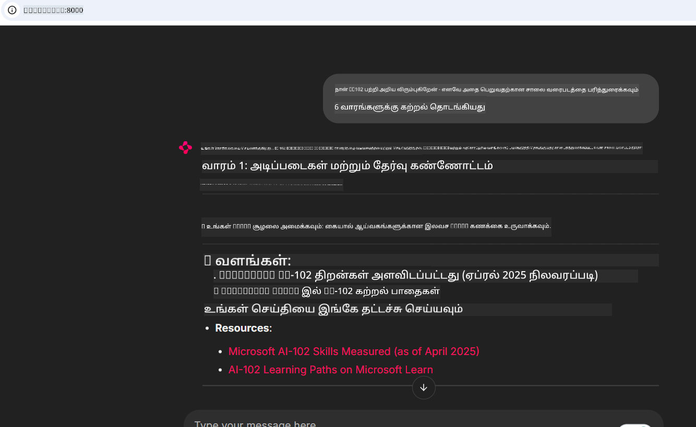
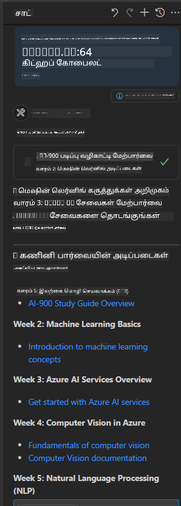

<!--
CO_OP_TRANSLATOR_METADATA:
{
  "original_hash": "4319d291c9d124ecafea52b3d04bfa0e",
  "translation_date": "2025-10-11T12:38:08+00:00",
  "source_file": "09-CaseStudy/docs-mcp/README.md",
  "language_code": "ta"
}
-->
# வழக்குக் கதை: Microsoft Learn Docs MCP சர்வருடன் ஒரு கிளையண்ட் மூலம் இணைப்பு

நீங்கள் ஒருபோதும் ஆவணங்கள் தளங்கள், Stack Overflow, மற்றும் முடிவில்லாத தேடல் இயந்திர டேப்கள் ஆகியவற்றுக்கு இடையில் சிக்கித் தவித்ததுண்டா? உங்கள் குறியீட்டில் ஒரு பிரச்சினையைத் தீர்க்க முயற்சிக்கும்போது, நீங்கள் ஒரு இரண்டாவது மானிட்டரை ஆவணங்களுக்கு மட்டும் வைத்திருக்கிறீர்களா அல்லது IDE மற்றும் உலாவி இடையே தொடர்ந்து alt-tabbing செய்கிறீர்களா? ஆவணங்களை உங்கள் செயல்பாட்டில் நேரடியாக கொண்டு வர முடியுமானால்—உங்கள் பயன்பாடுகள், IDE, அல்லது உங்கள் சொந்த தனிப்பயன் கருவிகளில் ஒருங்கிணைக்க முடியுமானால்—அது சிறந்ததல்லவா? இந்த வழக்குக் கதையில், Microsoft Learn Docs MCP சர்வருடன் உங்கள் சொந்த கிளையண்ட் பயன்பாட்டின் மூலம் நேரடியாக இணைப்பது எப்படி என்பதை ஆராய்வோம்.

## மேற்பார்வை

நவீன வளர்ச்சி என்பது குறியீடு எழுதுவதற்கும் மேலானது—அது சரியான தகவலை சரியான நேரத்தில் கண்டுபிடிப்பது பற்றியது. ஆவணங்கள் எங்கும் உள்ளன, ஆனால் அவை உங்களுக்கு மிகவும் தேவையான இடத்தில் இல்லை: உங்கள் கருவிகள் மற்றும் செயல்பாடுகளில். ஆவணங்களை பெறுவதற்கான செயல்பாட்டை உங்கள் பயன்பாடுகளில் நேரடியாக ஒருங்கிணைப்பதன் மூலம், நீங்கள் நேரத்தைச் சேமிக்கலாம், சூழல் மாறுதலைக் குறைக்கலாம், மற்றும் உற்பத்தித்திறனை அதிகரிக்கலாம். இந்த பிரிவில், Microsoft Learn Docs MCP சர்வருடன் ஒரு கிளையண்டை இணைப்பது எப்படி என்பதை நாங்கள் காட்டுவோம், இதனால் நீங்கள் உங்கள் பயன்பாட்டை விட்டு வெளியேறாமல் நேரடி, சூழல்-அறிந்த ஆவணங்களை அணுக முடியும்.

நாங்கள் இணைப்பை நிறுவுவது, கோரிக்கையை அனுப்புவது, மற்றும் ஸ்ட்ரீமிங் பதில்களை திறமையாக கையாள்வது ஆகிய செயல்முறைகளைப் பார்ப்போம். இந்த அணுகுமுறை உங்கள் செயல்பாட்டை எளிமையாக்குவதுடன், புத்திசாலி மற்றும் பயனுள்ள டெவலப்பர் கருவிகளை உருவாக்குவதற்கான வாய்ப்பையும் திறக்கிறது.

## கற்றல் நோக்கங்கள்

நாம் இதை ஏன் செய்கிறோம்? ஏனெனில் சிறந்த டெவலப்பர் அனுபவங்கள் என்பது தடைகளை அகற்றுவதாகும். உங்கள் குறியீட்டு எடிட்டர், chatbot, அல்லது வலை பயன்பாடு Microsoft Learn இன் சமீபத்திய உள்ளடக்கத்தைப் பயன்படுத்தி உங்கள் ஆவண கேள்விகளுக்கு உடனடியாக பதிலளிக்க முடியும் உலகத்தை கற்பனை செய்யுங்கள். இந்த அத்தியாயத்தின் முடிவில், நீங்கள் எப்படி:

- ஆவணங்களுக்கு MCP சர்வர்-கிளையண்ட் தொடர்பு அடிப்படைகளைப் புரிந்துகொள்வது
- Microsoft Learn Docs MCP சர்வருடன் இணைக்க ஒரு கன்சோல் அல்லது வலை பயன்பாட்டை செயல்படுத்துவது
- நேரடி ஆவணங்களைப் பெற ஸ்ட்ரீமிங் HTTP கிளையண்டுகளைப் பயன்படுத்துவது
- உங்கள் பயன்பாட்டில் ஆவண பதில்களை பதிவு செய்து விளக்குவது

இந்த திறன்கள் உங்களை எதிர்வினை அளிக்கக்கூடியதல்ல, உண்மையில் தொடர்புடைய மற்றும் சூழல்-அறிந்த கருவிகளை உருவாக்க உதவும்.

## சூழல் 1 - MCP மூலம் நேரடி ஆவணங்களைப் பெறுதல்

இந்த சூழலில், Microsoft Learn Docs MCP சர்வருடன் ஒரு கிளையண்டை இணைப்பது எப்படி என்பதை நாங்கள் காட்டுவோம், இதனால் நீங்கள் உங்கள் பயன்பாட்டை விட்டு வெளியேறாமல் நேரடி, சூழல்-அறிந்த ஆவணங்களை அணுக முடியும்.

இதை நடைமுறைப்படுத்துவோம். உங்கள் பணியாக Microsoft Learn Docs MCP சர்வருடன் இணைக்கும் ஒரு பயன்பாட்டை எழுதுவது, `microsoft_docs_search` கருவியை அழைப்பது, மற்றும் ஸ்ட்ரீமிங் பதிலை கன்சோலில் பதிவு செய்வது.

### ஏன் இந்த அணுகுமுறை?
ஏனெனில் இது மேலும் மேம்பட்ட ஒருங்கிணைப்புகளை உருவாக்குவதற்கான அடிப்படையாகும்—நீங்கள் chatbot, IDE விரிவாக்கம், அல்லது வலை டாஷ்போர்டை இயக்க விரும்பினாலும்.

இந்த வழக்குக் கதையின் [`solution`](./solution/README.md) கோப்பகத்தில் நீங்கள் குறியீடு மற்றும் வழிமுறைகளைப் பெறுவீர்கள். இணைப்பை அமைப்பதற்கான படிகள் உங்களை வழிநடத்தும்:
- இணைப்புக்கு அதிகாரப்பூர்வ MCP SDK மற்றும் ஸ்ட்ரீமிங் HTTP கிளையண்டைப் பயன்படுத்தவும்
- ஆவணங்களைப் பெற ஒரு கேள்வி அளவுருவுடன் `microsoft_docs_search` கருவியை அழைக்கவும்
- சரியான பதிவு மற்றும் பிழை கையாளுதலை செயல்படுத்தவும்
- பல தேடல் கேள்விகளை உள்ளிட பயனர்களுக்கு அனுமதிக்க ஒரு தொடர்புடைய கன்சோல் இடைமுகத்தை உருவாக்கவும்

இந்த சூழல் எப்படி:
- Docs MCP சர்வருடன் இணைக்க
- ஒரு கேள்வியை அனுப்ப
- முடிவுகளைப் பாகுபடுத்தி அச்சிட

இது எப்படி செயல்படுகிறது என்பதை கீழே காணலாம்:

```
Prompt> What is Azure Key Vault?
Answer> Azure Key Vault is a cloud service for securely storing and accessing secrets. ...
```

கீழே ஒரு குறைந்தபட்ச மாதிரி தீர்வு உள்ளது. முழு குறியீடு மற்றும் விவரங்கள் தீர்வு கோப்பகத்தில் கிடைக்கின்றன.

<details>
<summary>Python</summary>

```python
import asyncio
from mcp.client.streamable_http import streamablehttp_client
from mcp import ClientSession

async def main():
    async with streamablehttp_client("https://learn.microsoft.com/api/mcp") as (read_stream, write_stream, _):
        async with ClientSession(read_stream, write_stream) as session:
            await session.initialize()
            result = await session.call_tool("microsoft_docs_search", {"query": "Azure Functions best practices"})
            print(result.content)

if __name__ == "__main__":
    asyncio.run(main())
```

- முழுமையான செயல்பாடு மற்றும் பதிவு செய்ய [`scenario1.py`](../../../../09-CaseStudy/docs-mcp/solution/python/scenario1.py) ஐப் பார்க்கவும்.
- நிறுவல் மற்றும் பயன்பாட்டு வழிமுறைகளுக்கு, அதே கோப்பகத்தில் உள்ள [`README.md`](./solution/python/README.md) கோப்பைப் பார்க்கவும்.
</details>


## சூழல் 2 - MCP உடன் தொடர்புடைய படிப்பு திட்டம் உருவாக்கும் வலை பயன்பாடு

இந்த சூழலில், Docs MCP ஐ ஒரு வலை வளர்ச்சி திட்டத்தில் ஒருங்கிணைப்பது எப்படி என்பதை நீங்கள் கற்றுக்கொள்வீர்கள். Microsoft Learn ஆவணங்களை நேரடியாக ஒரு வலை இடைமுகத்திலிருந்து தேட பயனர்களுக்கு அனுமதிக்க, ஆவணங்களை உங்கள் பயன்பாடு அல்லது தளத்தில் உடனடியாக அணுகக்கூடியதாக மாற்றுவது நோக்கம்.

நீங்கள் எப்படி:
- ஒரு வலை பயன்பாட்டை அமைக்க
- Docs MCP சர்வருடன் இணைக்க
- பயனர் உள்ளீட்டை கையாளவும் மற்றும் முடிவுகளை காட்டவும்

இது எப்படி செயல்படுகிறது என்பதை கீழே காணலாம்:

```
User> I want to learn about AI102 - so suggest the roadmap to get it started from learn for 6 weeks

Assistant> Here’s a detailed 6-week roadmap to start your preparation for the AI-102: Designing and Implementing a Microsoft Azure AI Solution certification, using official Microsoft resources and focusing on exam skills areas:

---
## Week 1: Introduction & Fundamentals
- **Understand the Exam**: Review the [AI-102 exam skills outline](https://learn.microsoft.com/en-us/credentials/certifications/exams/ai-102/).
- **Set up Azure**: Sign up for a free Azure account if you don't have one.
- **Learning Path**: [Introduction to Azure AI services](https://learn.microsoft.com/en-us/training/modules/intro-to-azure-ai/)
- **Focus**: Get familiar with Azure portal, AI capabilities, and necessary tools.

....more weeks of the roadmap...

Let me know if you want module-specific recommendations or need more customized weekly tasks!
```

கீழே ஒரு குறைந்தபட்ச மாதிரி தீர்வு உள்ளது. முழு குறியீடு மற்றும் விவரங்கள் தீர்வு கோப்பகத்தில் கிடைக்கின்றன.



<details>
<summary>Python (Chainlit)</summary>

Chainlit என்பது உரையாடல் AI வலை பயன்பாடுகளை உருவாக்க ஒரு கட்டமைப்பாகும். MCP கருவிகளை அழைக்க மற்றும் முடிவுகளை நேரடியாக காட்ட உரையாடல் chatbot மற்றும் உதவிகளை உருவாக்க எளிதாக்குகிறது. இது விரைவான மாதிரி வடிவமைப்பு மற்றும் பயனர் நட்பு இடைமுகங்களுக்கு சிறந்தது.

```python
import chainlit as cl
import requests

MCP_URL = "https://learn.microsoft.com/api/mcp"

@cl.on_message
def handle_message(message):
    query = {"question": message}
    response = requests.post(MCP_URL, json=query)
    if response.ok:
        result = response.json()
        cl.Message(content=result.get("answer", "No answer found.")).send()
    else:
        cl.Message(content="Error: " + response.text).send()
```

- முழுமையான செயல்பாட்டிற்காக, [`scenario2.py`](../../../../09-CaseStudy/docs-mcp/solution/python/scenario2.py) ஐப் பார்க்கவும்.
- அமைப்பு மற்றும் இயக்க வழிமுறைகளுக்கு, [`README.md`](./solution/python/README.md) ஐப் பார்க்கவும்.
</details>


## சூழல் 3: VS Code இல் MCP சர்வருடன் உள்ளே ஆவணங்கள்

Microsoft Learn Docs ஐ நேரடியாக உங்கள் VS Code இல் பெற விரும்பினால் (உலாவி டேப்களை மாற்றுவதற்கு பதிலாக), MCP சர்வரை உங்கள் எடிட்டரில் பயன்படுத்தலாம். இது உங்களுக்கு:
- உங்கள் குறியீட்டு சூழலில் இருந்து வெளியேறாமல் VS Code இல் ஆவணங்களை தேடவும் மற்றும் படிக்கவும்.
- ஆவணங்களை மேற்கோள் காட்டவும் மற்றும் இணைப்புகளை நேரடியாக உங்கள் README அல்லது பாட கோப்புகளில் சேர்க்கவும்.
- GitHub Copilot மற்றும் MCP ஐ ஒருங்கிணைத்து ஒரு சீரற்ற, AI-இயக்க ஆவண செயல்பாட்டை அனுபவிக்கவும்.

**நீங்கள் எப்படி:**
- உங்கள் வேலைப்பகுதி அடியில் ஒரு செல்லுபடியாகும் `.vscode/mcp.json` கோப்பைச் சேர்க்க (கீழே எடுத்துக்காட்டு காண்க).
- MCP குழு அல்லது VS Code இல் கட்டளைத் தொகுப்பைப் பயன்படுத்தி ஆவணங்களை தேடவும் மற்றும் சேர்க்கவும்.
- Markdown கோப்புகளில் நீங்கள் வேலை செய்யும் போது ஆவணங்களை நேரடியாக மேற்கோள் காட்டவும்.
- இந்த செயல்பாட்டை GitHub Copilot உடன் இணைத்து மேலும் உற்பத்தித்திறனை பெறவும்.

VS Code இல் MCP சர்வரை அமைப்பது எப்படி என்பதை இங்கே காணலாம்:

```json
{
  "servers": {
    "LearnDocsMCP": {
      "url": "https://learn.microsoft.com/api/mcp"
    }
  }
}
```

</details>

> ஸ்கிரீன்ஷாட்கள் மற்றும் படி-படி வழிகாட்டியுடன் விரிவான நடைமுறைக்கான [`README.md`](./solution/scenario3/README.md) ஐப் பார்க்கவும்.



இந்த அணுகுமுறை தொழில்நுட்ப பாடங்கள் உருவாக்கும், ஆவணங்களை எழுதும், அல்லது குறியீடு உருவாக்கும் போது அடிக்கடி மேற்கோள் தேவைகளுடன் வேலை செய்யும் அனைவருக்கும் சிறந்தது.

## முக்கியக் குறிப்புகள்

ஆவணங்களை உங்கள் கருவிகளில் நேரடியாக ஒருங்கிணைப்பது என்பது ஒரு வசதியாக மட்டுமல்ல—அது உற்பத்தித்திறனுக்கான ஒரு மாற்றம். உங்கள் கிளையண்ட் மூலம் Microsoft Learn Docs MCP சர்வருடன் இணைப்பதன் மூலம், நீங்கள்:

- உங்கள் குறியீடு மற்றும் ஆவணங்களுக்கு இடையிலான சூழல் மாறுதலை அகற்றவும்
- நேரடி, சூழல்-அறிந்த ஆவணங்களைப் பெறவும்
- புத்திசாலி மற்றும் தொடர்புடைய டெவலப்பர் கருவிகளை உருவாக்கவும்

இந்த திறன்கள் உங்களை திறமையானதுடன், பயன்படுத்துவதற்கு மகிழ்ச்சியான தீர்வுகளை உருவாக்க உதவும்.

## கூடுதல் வளங்கள்

உங்கள் புரிதலை ஆழமாக்க, இந்த அதிகாரப்பூர்வ வளங்களை ஆராயவும்:

- [Microsoft Learn Docs MCP Server (GitHub)](https://github.com/MicrosoftDocs/mcp)
- [Azure MCP Server (mcp-python) உடன் தொடங்குங்கள்](https://learn.microsoft.com/en-us/azure/developer/azure-mcp-server/get-started#create-the-python-app)
- [Azure MCP Server என்றால் என்ன?](https://learn.microsoft.com/en-us/azure/developer/azure-mcp-server/)
- [மாதிரி சூழல் நெறிமுறை (MCP) அறிமுகம்](https://modelcontextprotocol.io/introduction)
- [MCP Server (Python) இலிருந்து பிளகின்களைச் சேர்க்கவும்](https://learn.microsoft.com/en-us/semantic-kernel/concepts/plugins/adding-mcp-plugins)

---

**குறிப்பு**:  
இந்த ஆவணம் [Co-op Translator](https://github.com/Azure/co-op-translator) என்ற AI மொழிபெயர்ப்பு சேவையை பயன்படுத்தி மொழிபெயர்க்கப்பட்டுள்ளது. எங்கள் நோக்கம் துல்லியமாக இருக்க வேண்டும் என்றாலும், தானியக்க மொழிபெயர்ப்புகளில் பிழைகள் அல்லது தவறுகள் இருக்கக்கூடும் என்பதை கவனத்தில் கொள்ளவும். அதன் தாய்மொழியில் உள்ள மூல ஆவணம் அதிகாரப்பூர்வ ஆதாரமாக கருதப்பட வேண்டும். முக்கியமான தகவல்களுக்கு, தொழில்முறை மனித மொழிபெயர்ப்பு பரிந்துரைக்கப்படுகிறது. இந்த மொழிபெயர்ப்பைப் பயன்படுத்துவதால் ஏற்படும் எந்த தவறான புரிதல்கள் அல்லது தவறான விளக்கங்களுக்கு நாங்கள் பொறுப்பல்ல.