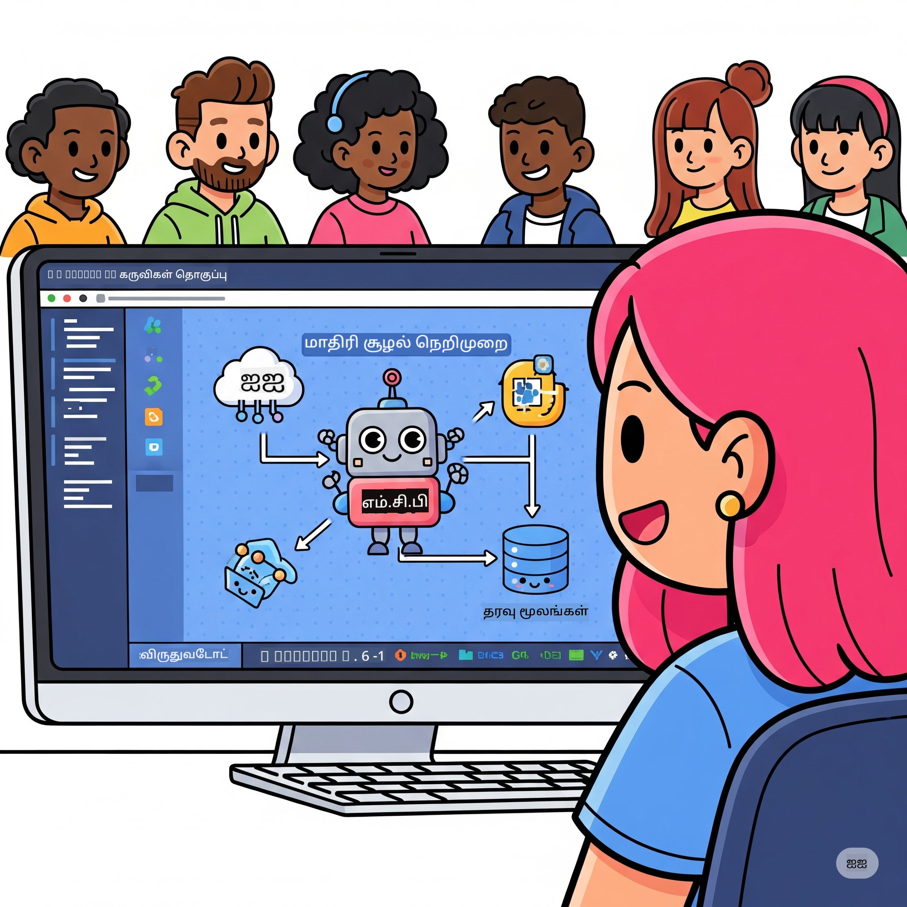

<!--
CO_OP_TRANSLATOR_METADATA:
{
  "original_hash": "1b000fd6e1b04c047578bfc5d07d54eb",
  "translation_date": "2025-10-11T11:21:23+00:00",
  "source_file": "10-StreamliningAIWorkflowsBuildingAnMCPServerWithAIToolkit/README.md",
  "language_code": "ta"
}
-->
# AI வேலைகளை எளிமைப்படுத்துதல்: AI Toolkit உடன் MCP சர்வர் உருவாக்குதல்

## 🎯  மேலோட்டம்

_(மேலே உள்ள படத்தை கிளிக் செய்து இந்த பாடத்தின் வீடியோவைப் பாருங்கள்)_

**மாடல் கான்டெக்ஸ்ட் புரோட்டோகால் (MCP) வேலைகள்** வரவேற்கிறோம்! இந்த விரிவான செயல்முறை பயிற்சி இரண்டு முன்னணி தொழில்நுட்பங்களை இணைத்து AI பயன்பாடுகளை உருவாக்குவதில் புரட்சியை ஏற்படுத்துகிறது:

- **🔗 மாடல் கான்டெக்ஸ்ட் புரோட்டோகால் (MCP)**: AI கருவிகளை எளிதாக இணைக்க ஒரு திறந்த தரநிலை
- **🛠️ Visual Studio Code (AITK) க்கான AI Toolkit**: மைக்ரோசாஃப்டின் சக்திவாய்ந்த AI மேம்பாட்டு நீட்டிப்பு

### 🎓 நீங்கள் கற்றுக்கொள்ளும் விஷயங்கள்

இந்த பயிற்சியின் முடிவில், AI மாடல்களை நிஜ உலக கருவிகள் மற்றும் சேவைகளுடன் இணைக்கும் புத்திசாலி பயன்பாடுகளை உருவாக்குவதில் நீங்கள் வல்லுநராக மாறுவீர்கள். தானியங்கிய சோதனை முதல் தனிப்பயன் API ஒருங்கிணைப்புகள் வரை, சிக்கலான வணிக சவால்களை தீர்க்க நடைமுறை திறன்களை நீங்கள் பெறுவீர்கள்.

## 🏗️ தொழில்நுட்ப அடுக்குகள்

### 🔌 மாடல் கான்டெக்ஸ்ட் புரோட்டோகால் (MCP)

MCP என்பது AI க்கான **"USB-C"** - AI மாடல்களை வெளிப்புற கருவிகள் மற்றும் தரவுகளுடன் இணைக்கும் ஒரு உலகளாவிய தரநிலை.

**✨ முக்கிய அம்சங்கள்:**

- 🔄 **தரநிலைப்பட்ட ஒருங்கிணைப்பு**: AI கருவி இணைப்புகளுக்கான உலகளாவிய இடைமுகம்
- 🏛️ **நெகிழ்வான கட்டமைப்பு**: stdio/SSE போக்குவரத்து மூலம் உள்ளூர் மற்றும் தொலைதூர சர்வர்கள்
- 🧰 **பெரிய சூழல்**: கருவிகள், உந்துதல்கள் மற்றும் வளங்கள் ஒரே புரோட்டோகாலில்
- 🔒 **நிறுவனத்திற்கான தயாரிப்பு**: பாதுகாப்பு மற்றும் நம்பகத்தன்மை உட்பொதிக்கப்பட்டது

**🎯 MCP ஏன் முக்கியம்:**
USB-C கேபிள் குழப்பத்தை நீக்கியது போல, MCP AI ஒருங்கிணைப்புகளின் சிக்கல்களை நீக்குகிறது. ஒரு புரோட்டோகால், முடிவில்லா சாத்தியங்கள்.

### 🤖 Visual Studio Code க்கான AI Toolkit (AITK)

Visual Studio Code ஐ AI சக்தி மையமாக மாற்றும் மைக்ரோசாஃப்டின் முன்னணி AI மேம்பாட்டு நீட்டிப்பு.

**🚀 முக்கிய திறன்கள்:**

- 📦 **மாடல் பட்டியல்**: Azure AI, GitHub, Hugging Face, Ollama ஆகியவற்றிலிருந்து மாடல்களை அணுகவும்
- ⚡ **உள்ளூர் தீர்வு**: ONNX-ஆக மேம்படுத்தப்பட்ட CPU/GPU/NPU செயல்பாடு
- 🏗️ **Agent Builder**: MCP ஒருங்கிணைப்புடன் காட்சிப்பட AI முகவர் மேம்பாடு
- 🎭 **பலவகை முறை**: உரை, காட்சி மற்றும் அமைந்த வெளியீடு ஆதரவு

**💡 மேம்பாட்டு நன்மைகள்:**

- மாடல் பராமரிப்பு தேவையற்றது
- காட்சிப்பட உந்துதல் பொறியியல்
- நேரடி சோதனை விளையாட்டு மைதானம்
- MCP சர்வர் ஒருங்கிணைப்பை எளிதாக்குதல்

## 📚 கற்றல் பயணம்

### [🚀 தொகுதி 1: AI Toolkit அடிப்படைகள்](./lab1/README.md)

**கால அளவு**: 15 நிமிடங்கள்

- 🛠️ Visual Studio Code க்கான AI Toolkit ஐ நிறுவி அமைக்கவும்
- 🗂️ மாடல் பட்டியலை ஆராயவும் (GitHub, ONNX, OpenAI, Anthropic, Google ஆகியவற்றிலிருந்து 100+ மாடல்கள்)
- 🎮 நேரடி மாடல் சோதனைக்கான இன்டர்ஆக்டிவ் விளையாட்டு மைதானத்தை கையாளவும்
- 🤖 Agent Builder மூலம் உங்கள் முதல் AI முகவரை உருவாக்கவும்
- 📊 F1, தொடர்பு, ஒத்திசைவு, இணக்கம் ஆகியவற்றின் உள்ளமைந்த அளவுகோல்களுடன் மாடல் செயல்திறனை மதிப்பீடு செய்யவும்
- ⚡ தொகுதி செயலாக்கம் மற்றும் பலவகை முறை ஆதரவு திறன்களை கற்றுக்கொள்ளவும்

**🎯 கற்றல் முடிவு**: AITK திறன்களை முழுமையாக புரிந்துகொண்டு செயல்படும் AI முகவரை உருவாக்கவும்

### [🌐 தொகுதி 2: MCP உடன் AI Toolkit அடிப்படைகள்](./lab2/README.md)

**கால அளவு**: 20 நிமிடங்கள்

- 🧠 மாடல் கான்டெக்ஸ்ட் புரோட்டோகால் (MCP) கட்டமைப்பு மற்றும் கருத்துக்களை கையாளவும்
- 🌐 மைக்ரோசாஃப்டின் MCP சர்வர் சூழலை ஆராயவும்
- 🤖 Playwright MCP சர்வரைப் பயன்படுத்தி ஒரு உலாவி தானியங்க முகவரை உருவாக்கவும்
- 🔧 MCP சர்வர்களை AI Toolkit Agent Builder உடன் ஒருங்கிணைக்கவும்
- 📊 உங்கள் முகவர்களில் MCP கருவிகளை அமைத்து சோதிக்கவும்
- 🚀 MCP சக்திவாய்ந்த முகவர்களை உற்பத்தி பயன்பாட்டிற்காக ஏற்றுமதி செய்து பரப்பவும்

**🎯 கற்றல் முடிவு**: வெளிப்புற கருவிகளுடன் MCP மூலம் மேம்படுத்தப்பட்ட AI முகவரை வெளியிடவும்

### [🔧 தொகுதி 3: AI Toolkit உடன் மேம்பட்ட MCP மேம்பாடு](./lab3/README.md)

**கால அளவு**: 20 நிமிடங்கள்

- 💻 AI Toolkit ஐப் பயன்படுத்தி தனிப்பயன் MCP சர்வர்களை உருவாக்கவும்
- 🐍 MCP Python SDK (v1.9.3) ஐ அமைத்து பயன்படுத்தவும்
- 🔍 பிழைதிருத்தத்திற்கான MCP Inspector ஐ அமைத்து பயன்படுத்தவும்
- 🛠️ தொழில்முறை பிழைதிருத்த வேலைகளுடன் ஒரு வானிலை MCP சர்வரை உருவாக்கவும்
- 🧪 Agent Builder மற்றும் Inspector சூழல்களில் MCP சர்வர்களை பிழைதிருத்தவும்

**🎯 கற்றல் முடிவு**: நவீன கருவிகளைப் பயன்படுத்தி தனிப்பயன் MCP சர்வர்களை உருவாக்கவும் மற்றும் பிழைதிருத்தவும்

### [🐙 தொகுதி 4: நடைமுறை MCP மேம்பாடு - தனிப்பயன் GitHub Clone Server](./lab4/README.md)

**கால அளவு**: 30 நிமிடங்கள்

- 🏗️ மேம்பாட்டு வேலைகளுக்கான ஒரு உண்மையான GitHub Clone MCP Server ஐ உருவாக்கவும்
- 🔄 சரிபார்ப்பு மற்றும் பிழை கையாளுதலுடன் புத்திசாலி ரெப்போசிடரி கிளோனிங்கை செயல்படுத்தவும்
- 📁 புத்திசாலி கோப்புறை மேலாண்மை மற்றும் VS Code ஒருங்கிணைப்பை உருவாக்கவும்
- 🤖 தனிப்பயன் MCP கருவிகளுடன் GitHub Copilot Agent Mode ஐப் பயன்படுத்தவும்
- 🛡️ உற்பத்தி-தயாரான நம்பகத்தன்மை மற்றும் பல்வேறு தள இணக்கத்தன்மையைப் பயன்படுத்தவும்

**🎯 கற்றல் முடிவு**: உண்மையான மேம்பாட்டு வேலைகளை எளிதாக்கும் உற்பத்தி-தயார MCP சர்வரை வெளியிடவும்

## 💡 நிஜ உலக பயன்பாடுகள் மற்றும் தாக்கம்

### 🏢 நிறுவன பயன்பாடுகள்

#### 🔄 DevOps தானியங்கம்

உங்கள் மேம்பாட்டு வேலைகளை புத்திசாலி தானியங்கத்துடன் மாற்றவும்:

- **புத்திசாலி ரெப்போசிடரி மேலாண்மை**: AI-ஆல் இயக்கப்படும் குறியீட்டு மதிப்பீடு மற்றும் இணைப்பு முடிவுகள்
- **புத்திசாலி CI/CD**: குறியீட்டு மாற்றங்களை அடிப்படையாகக் கொண்ட தானியங்க குழாய் மேம்பாடு
- **Issue Triage**: தானியங்க பிழை வகைப்படுத்தல் மற்றும் ஒதுக்கீடு

#### 🧪 தர உறுதிப்படுத்தல் புரட்சிகள்

AI-ஆல் இயக்கப்படும் தானியங்கத்துடன் சோதனையை உயர்த்தவும்:

- **புத்திசாலி சோதனை உருவாக்கம்**: விரிவான சோதனை தொகுப்புகளை தானாக உருவாக்கவும்
- **காட்சிப்பட மாற்ற சோதனை**: AI-ஆல் இயக்கப்படும் UI மாற்ற கண்டறிதல்
- **செயல்திறன் கண்காணிப்பு**: முன்னோடியாக சிக்கல்களை அடையாளம் காணவும் மற்றும் தீர்க்கவும்

#### 📊 தரவுப் குழாய் புத்திசாலைகள்

சிறந்த தரவுப் செயலாக்க வேலைகளை உருவாக்கவும்:

- **தனிவழி ETL செயல்முறைகள்**: தானாகவே மேம்படும் தரவுப் மாற்றங்கள்
- **அசாதாரணம் கண்டறிதல்**: நேரடி தரவுத் தரம் கண்காணிப்பு
- **புத்திசாலி வழிமாற்றம்**: புத்திசாலி தரவுப் போக்கு மேலாண்மை

#### 🎧 வாடிக்கையாளர் அனுபவ மேம்பாடு

சிறந்த வாடிக்கையாளர் தொடர்புகளை உருவாக்கவும்:

- **கான்டெக்ஸ்ட்-அறிந்த ஆதரவு**: வாடிக்கையாளர் வரலாற்றை அணுகும் AI முகவர்கள்
- **முன்கூட்டிய சிக்கல் தீர்வு**: முன்னோடியாக வாடிக்கையாளர் சேவை
- **பல சேனல் ஒருங்கிணைப்பு**: தளங்களில் ஒருங்கிணைந்த AI அனுபவம்

## 🛠️ முன்பதிவுகள் மற்றும் அமைப்பு

### 💻 அமைப்பு தேவைகள்

| கூறு | தேவைகள் | குறிப்புகள் |
|-----------|-------------|-------|
| **இயங்குதளம்** | Windows 10+, macOS 10.15+, Linux | எந்த நவீன OS |
| **Visual Studio Code** | சமீபத்திய நிலையான பதிப்பு | AITK க்கான தேவை |
| **Node.js** | v18.0+ மற்றும் npm | MCP சர்வர் மேம்பாட்டிற்காக |
| **Python** | 3.10+ | Python MCP சர்வர்களுக்கு விருப்பமானது |
| **மெமரி** | குறைந்தபட்சம் 8GB RAM | உள்ளூர் மாடல்களுக்கு 16GB பரிந்துரைக்கப்படுகிறது |

### 🔧 மேம்பாட்டு சூழல்

#### பரிந்துரைக்கப்பட்ட VS Code நீட்டிப்புகள்

- **AI Toolkit** (ms-windows-ai-studio.windows-ai-studio)
- **Python** (ms-python.python)
- **Python Debugger** (ms-python.debugpy)
- **GitHub Copilot** (GitHub.copilot) - விருப்பமானது ஆனால் பயனுள்ளதாக இருக்கும்

#### விருப்பமான கருவிகள்

- **uv**: நவீன Python தொகுப்பு மேலாளர்
- **MCP Inspector**: MCP சர்வர்களுக்கான காட்சிப்பட பிழைதிருத்த கருவி
- **Playwright**: வலை தானியங்க உதாரணங்களுக்காக

## 🎖️ கற்றல் முடிவுகள் மற்றும் சான்றிதழ் பாதை

### 🏆 திறன் கையாளுதல் சோதனை பட்டியல்

இந்த பயிற்சியை முடிக்கும்போது, நீங்கள் கீழே உள்ளவற்றில் வல்லுநராக மாறுவீர்கள்:

#### 🎯 முக்கிய திறன்கள்

- [ ] **MCP புரோட்டோகால் கையாளுதல்**: கட்டமைப்பு மற்றும் செயல்பாட்டு முறைமைகள் பற்றிய ஆழமான புரிதல்
- [ ] **AITK திறமை**: விரைவான மேம்பாட்டிற்கான AI Toolkit ஐ நிபுணத்துவமாக பயன்படுத்துதல்
- [ ] **தனிப்பயன் சர்வர் மேம்பாடு**: MCP சர்வர்களை உருவாக்கி, வெளியிட்டு, பராமரிக்கவும்
- [ ] **கருவி ஒருங்கிணைப்பு திறமை**: AI ஐ தற்போதைய மேம்பாட்டு வேலைகளுடன் எளிதாக இணைக்கவும்
- [ ] **சிக்கல் தீர்வு பயன்பாடு**: கற்றுக்கொண்ட திறன்களை நிஜ வணிக சவால்களுக்கு பயன்படுத்தவும்

#### 🔧 தொழில்நுட்ப திறன்கள்

- [ ] Visual Studio Code இல் AI Toolkit ஐ அமைத்து கையாளவும்
- [ ] தனிப்பயன் MCP சர்வர்களை வடிவமைத்து செயல்படுத்தவும்
- [ ] MCP கட்டமைப்புடன் GitHub மாடல்களை ஒருங்கிணைக்கவும்
- [ ] Playwright உடன் தானியங்க சோதனை வேலைகளை உருவாக்கவும்
- [ ] உற்பத்தி பயன்பாட்டிற்காக AI முகவர்களை வெளியிடவும்
- [ ] MCP சர்வர் செயல்திறனை பிழைதிருத்தி மேம்படுத்தவும்

#### 🚀 மேம்பட்ட திறன்கள்

- [ ] நிறுவன அளவிலான AI ஒருங்கிணைப்புகளை வடிவமைக்கவும்
- [ ] AI பயன்பாடுகளுக்கான பாதுகாப்பு சிறந்த நடைமுறைகளை செயல்படுத்தவும்
- [ ] அளவளாவிய MCP சர்வர் கட்டமைப்புகளை வடிவமைக்கவும்
- [ ] குறிப்பிட்ட துறைகளுக்கான தனிப்பயன் கருவி சங்கிலிகளை உருவாக்கவும்
- [ ] AI-நேசமான மேம்பாட்டில் மற்றவர்களுக்கு வழிகாட்டவும்

## 📖 கூடுதல் வளங்கள்

- [MCP Specification](https://modelcontextprotocol.io/docs)
- [AI Toolkit GitHub Repository](https://github.com/microsoft/vscode-ai-toolkit)
- [Sample MCP Servers Collection](https://github.com/modelcontextprotocol/servers)
- [Best Practices Guide](https://modelcontextprotocol.io/docs/best-practices)

---

**🚀 உங்கள் AI மேம்பாட்டு வேலைகளை புரட்சிகரமாக மாற்ற தயாரா?**

MCP மற்றும் AI Toolkit உடன் புத்திசாலி பயன்பாடுகளின் எதிர்காலத்தை ஒன்றாக உருவாக்குவோம்!

---

**குறிப்பு**:  
இந்த ஆவணம் [Co-op Translator](https://github.com/Azure/co-op-translator) என்ற AI மொழிபெயர்ப்பு சேவையை பயன்படுத்தி மொழிபெயர்க்கப்பட்டுள்ளது. எங்கள் தரச்செயல்முறையை உறுதிப்படுத்த முயற்சிக்கிறோம், ஆனால் தானியக்க மொழிபெயர்ப்புகளில் பிழைகள் அல்லது தவறுகள் இருக்கக்கூடும் என்பதை கவனத்தில் கொள்ளவும். அதன் தாய்மொழியில் உள்ள மூல ஆவணம் அதிகாரப்பூர்வ ஆதாரமாக கருதப்பட வேண்டும். முக்கியமான தகவல்களுக்கு, தொழில்முறை மனித மொழிபெயர்ப்பு பரிந்துரைக்கப்படுகிறது. இந்த மொழிபெயர்ப்பைப் பயன்படுத்துவதால் ஏற்படும் எந்த தவறான புரிதல்கள் அல்லது தவறான விளக்கங்களுக்கு நாங்கள் பொறுப்பல்ல.