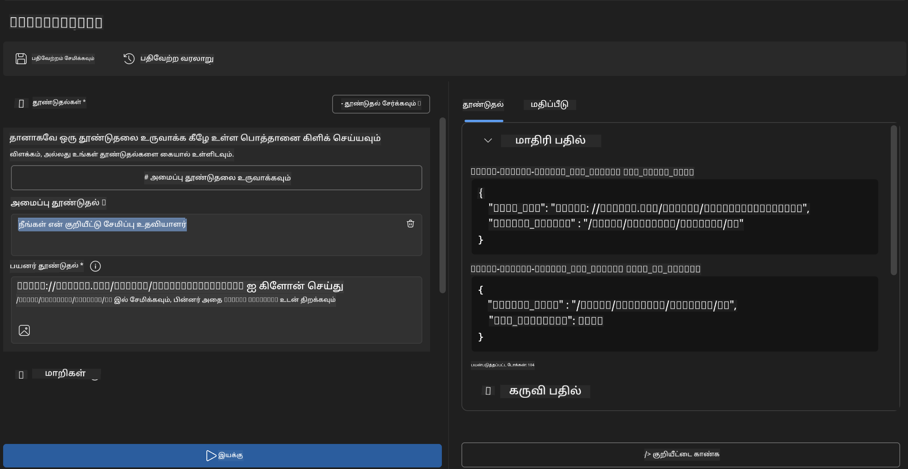
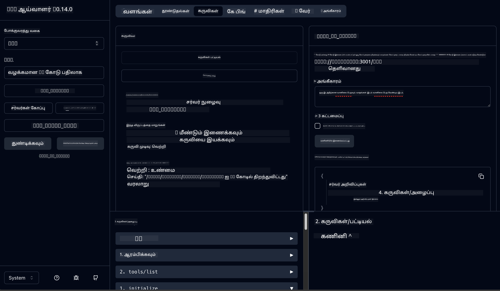

<!--
CO_OP_TRANSLATOR_METADATA:
{
  "original_hash": "f83bc722dc758efffd68667d6a1db470",
  "translation_date": "2025-10-11T11:24:41+00:00",
  "source_file": "10-StreamliningAIWorkflowsBuildingAnMCPServerWithAIToolkit/lab4/README.md",
  "language_code": "ta"
}
-->
# 🐙 Module 4: நடைமுறை MCP மேம்பாடு - தனிப்பயன் GitHub Clone Server


> **⚡ விரைவான தொடக்கம்:** GitHub repository களை clone செய்யவும், VS Code உடன் ஒருங்கிணைக்கவும் 30 நிமிடங்களில் தயாராக இருக்கும் MCP server ஐ உருவாக்குங்கள்!

## 🎯 கற்றல் நோக்கங்கள்

இந்த பயிலரங்கத்தின் முடிவில், நீங்கள்:

- ✅ உண்மையான உலக மேம்பாட்டு பண்பாட்டிற்கான தனிப்பயன் MCP server உருவாக்க
- ✅ MCP மூலம் GitHub repository களை clone செய்யும் செயல்பாட்டை செயல்படுத்த
- ✅ VS Code மற்றும் Agent Builder உடன் தனிப்பயன் MCP server களை ஒருங்கிணைக்க
- ✅ GitHub Copilot Agent Mode ஐ MCP கருவிகளுடன் பயன்படுத்த
- ✅ MCP server களை சோதித்து உற்பத்தி சூழலில் deploy செய்ய

## 📋 முன் தேவைகள்

- Lab 1-3 (MCP அடிப்படைகள் மற்றும் மேம்பட்ட மேம்பாடு) முடித்தல்
- GitHub Copilot சந்தா ([இலவச பதிவு](https://github.com/github-copilot/signup))
- AI Toolkit மற்றும் GitHub Copilot extensions உடன் VS Code
- Git CLI நிறுவப்பட்டு அமைக்கப்பட்டிருக்க வேண்டும்

## 🏗️ திட்டத்தின் மேற்பார்வை

### **உண்மையான உலக மேம்பாட்டு சவால்**
மேம்படுத்துபவர்கள், GitHub ஐ பயன்படுத்தி repository களை clone செய்து, அவற்றை VS Code அல்லது VS Code Insiders இல் திறக்க வேண்டும். இந்த கையேடு செயல்முறை:

1. Terminal/Command Prompt ஐ திறக்க
2. தேவையான கோப்பகத்திற்கு செல்ல
3. `git clone` கட்டளையை இயக்க
4. Clone செய்யப்பட்ட கோப்பகத்தில் VS Code ஐ திறக்க

**எங்கள் MCP தீர்வு இதை ஒரு சிக்கலற்ற புத்திசாலி கட்டளையாக மாற்றுகிறது!**

### **நீங்கள் உருவாக்கப்போகிறீர்கள்**
ஒரு **GitHub Clone MCP Server** (`git_mcp_server`) இது வழங்குகிறது:

| அம்சம் | விளக்கம் | நன்மை |
|-------|----------|-------|
| 🔄 **Smart Repository Cloning** | GitHub repos ஐ சரிபார்ப்புடன் clone செய்ய | தானியங்கி பிழை சரிபார்ப்பு |
| 📁 **Intelligent Directory Management** | கோப்பகங்களை பாதுகாப்பாக சரிபார்த்து உருவாக்க | மீண்டும் எழுதுவதைத் தவிர்க்கிறது |
| 🚀 **Cross-Platform VS Code Integration** | VS Code/Insiders இல் திட்டங்களை திறக்க | சிக்கலற்ற பண்பாட்டு மாற்றம் |
| 🛡️ **Robust Error Handling** | நெட்வொர்க், அனுமதி, மற்றும் பாதை பிரச்சினைகளை கையாள | உற்பத்தி-தயார் நம்பகத்தன்மை |

---

## 📖 படிப்படியாக செயல்படுத்தல்

### Step 1: Agent Builder இல் GitHub Agent ஐ உருவாக்கவும்

1. **Agent Builder ஐ AI Toolkit extension மூலம் தொடங்கவும்**
2. **புதிய agent ஐ உருவாக்கவும்** கீழே உள்ள அமைப்புடன்:
   ```
   Agent Name: GitHubAgent
   ```

3. **தனிப்பயன் MCP server ஐ ஆரம்பிக்கவும்:**
   - **Tools** → **Add Tool** → **MCP Server** க்கு செல்லவும்
   - **"Create A new MCP Server"** ஐ தேர்ந்தெடுக்கவும்
   - அதிகபட்ச நெகிழ்வுத்தன்மைக்காக **Python template** ஐ தேர்ந்தெடுக்கவும்
   - **Server Name:** `git_mcp_server`

### Step 2: GitHub Copilot Agent Mode ஐ அமைக்கவும்

1. **GitHub Copilot ஐ VS Code இல் திறக்கவும்** (Ctrl/Cmd + Shift + P → "GitHub Copilot: Open")
2. **Copilot இடைமுகத்தில் Agent Model ஐ தேர்ந்தெடுக்கவும்**
3. **Claude 3.7 model** ஐ தேர்ந்தெடுக்கவும் reasoning திறன்களை மேம்படுத்த
4. **MCP integration ஐ இயக்கவும்** கருவி அணுகலுக்காக

> **💡 சிறந்த ஆலோசனை:** Claude 3.7 மேம்பட்ட மேம்பாட்டு பண்பாட்டு மற்றும் பிழை கையாளும் முறைகளை வழங்குகிறது.

### Step 3: MCP Server இன் முக்கிய செயல்பாட்டை செயல்படுத்தவும்

**GitHub Copilot Agent Mode உடன் கீழே உள்ள விரிவான prompt ஐ பயன்படுத்தவும்:**

```
Create two MCP tools with the following comprehensive requirements:

🔧 TOOL A: clone_repository
Requirements:
- Clone any GitHub repository to a specified local folder
- Return the absolute path of the successfully cloned project
- Implement comprehensive validation:
  ✓ Check if target directory already exists (return error if exists)
  ✓ Validate GitHub URL format (https://github.com/user/repo)
  ✓ Verify git command availability (prompt installation if missing)
  ✓ Handle network connectivity issues
  ✓ Provide clear error messages for all failure scenarios

🚀 TOOL B: open_in_vscode
Requirements:
- Open specified folder in VS Code or VS Code Insiders
- Cross-platform compatibility (Windows/Linux/macOS)
- Use direct application launch (not terminal commands)
- Auto-detect available VS Code installations
- Handle cases where VS Code is not installed
- Provide user-friendly error messages

Additional Requirements:
- Follow MCP 1.9.3 best practices
- Include proper type hints and documentation
- Implement logging for debugging purposes
- Add input validation for all parameters
- Include comprehensive error handling
```

### Step 4: MCP Server ஐ சோதிக்கவும்

#### 4a. Agent Builder இல் சோதிக்கவும்

1. **Agent Builder இல் debug configuration ஐ தொடங்கவும்**
2. **இந்த system prompt உடன் உங்கள் agent ஐ அமைக்கவும்:**

```
SYSTEM_PROMPT:
You are my intelligent coding repository assistant. You help developers efficiently clone GitHub repositories and set up their development environment. Always provide clear feedback about operations and handle errors gracefully.
```

3. **உண்மையான பயனர் சூழல்களுடன் சோதிக்கவும்:**

```
USER_PROMPT EXAMPLES:

Scenario : Basic Clone and Open
"Clone {Your GitHub Repo link such as https://github.com/kinfey/GHCAgentWorkshop
 } and save to {The global path you specify}, then open it with VS Code Insiders"
```



**எதிர்பார்க்கப்படும் முடிவுகள்:**
- ✅ பாதை உறுதிப்படுத்தலுடன் வெற்றிகரமான cloning
- ✅ தானியங்கி VS Code தொடக்கம்
- ✅ தவறான சூழல்களுக்கு தெளிவான பிழை செய்திகள்
- ✅ எல்லை வழக்குகளை சரியாக கையாளுதல்

#### 4b. MCP Inspector இல் சோதிக்கவும்




---


**🎉 வாழ்த்துக்கள்!** நீங்கள் உண்மையான மேம்பாட்டு பண்பாட்டு சவால்களை தீர்க்கும் நடைமுறை MCP server ஐ வெற்றிகரமாக உருவாக்கியுள்ளீர்கள். உங்கள் தனிப்பயன் GitHub clone server MCP இன் சக்தியை நிரூபிக்கிறது, இது மேம்படுத்துபவர்களின் உற்பத்தியை தானியக்கமாக்கி மேம்படுத்துகிறது.

### 🏆 சாதனை திறக்கப்பட்டது:
- ✅ **MCP Developer** - தனிப்பயன் MCP server உருவாக்கப்பட்டது
- ✅ **Workflow Automator** - மேம்பாட்டு செயல்முறைகளை சிக்கலற்றதாக்கியது  
- ✅ **Integration Expert** - பல மேம்பாட்டு கருவிகளை இணைத்தது
- ✅ **Production Ready** - deploy செய்யக்கூடிய தீர்வுகளை உருவாக்கியது

---

## 🎓 பயிலரங்க முடிவு: Model Context Protocol உடன் உங்கள் பயணம்

**அன்புள்ள பயிலரங்க பங்கேற்பாளருக்கு,**

Model Context Protocol பயிலரங்கத்தின் நான்கு module களையும் முடித்ததற்கு வாழ்த்துக்கள்! AI Toolkit அடிப்படைகளைப் புரிந்து கொள்ளுதல் முதல் உண்மையான உலக மேம்பாட்டு சவால்களை தீர்க்கும் உற்பத்தி-தயார் MCP server களை உருவாக்குதல் வரை நீண்ட பயணத்தை நீங்கள் மேற்கொண்டுள்ளீர்கள்.

### 🚀 உங்கள் கற்றல் பாதை மீளாய்வு:

**[Module 1](../lab1/README.md)**: AI Toolkit அடிப்படைகளை, மாடல் சோதனையை, மற்றும் உங்கள் முதல் AI agent ஐ உருவாக்குதல்.

**[Module 2](../lab2/README.md)**: MCP கட்டமைப்பை கற்றல், Playwright MCP ஐ ஒருங்கிணைத்தல், மற்றும் உங்கள் முதல் browser automation agent ஐ உருவாக்குதல்.

**[Module 3](../lab3/README.md)**: Weather MCP server உடன் தனிப்பயன் MCP server மேம்பாட்டை மேம்படுத்துதல் மற்றும் debugging கருவிகளை கற்றல்.

**[Module 4](../lab4/README.md)**: GitHub repository workflow automation கருவியை உருவாக்குவதற்கான அனைத்தையும் பயன்படுத்துதல்.

### 🌟 நீங்கள் கற்றதன் சுருக்கம்:

- ✅ **AI Toolkit Ecosystem**: மாடல்கள், agent கள், மற்றும் ஒருங்கிணைப்பு முறைகள்
- ✅ **MCP Architecture**: Client-server வடிவமைப்பு, போக்குவரத்து நெறிமுறைகள், மற்றும் பாதுகாப்பு
- ✅ **Developer Tools**: Playground, Inspector, மற்றும் உற்பத்தி deploy வரை
- ✅ **Custom Development**: MCP server களை உருவாக்குதல், சோதித்தல், மற்றும் deploy செய்தல்
- ✅ **Practical Applications**: AI மூலம் உண்மையான உலக செயல்முறைகளைத் தீர்க்கும்

### 🔮 உங்கள் அடுத்த படிகள்:

1. **உங்கள் MCP Server ஐ உருவாக்கவும்**: உங்கள் தனிப்பட்ட செயல்முறைகளை தானியக்கமாக்க இந்த திறன்களைப் பயன்படுத்தவும்
2. **MCP சமூகத்தில் சேரவும்**: உங்கள் படைப்புகளைப் பகிர்ந்து, மற்றவர்களிடமிருந்து கற்றுக்கொள்ளவும்
3. **மேம்பட்ட ஒருங்கிணைப்பை ஆராயவும்**: MCP server களை நிறுவன அமைப்புகளுடன் இணைக்கவும்
4. **Open Source இல் பங்களிக்கவும்**: MCP கருவிகள் மற்றும் ஆவணங்களை மேம்படுத்த உதவவும்

இந்த பயிலரங்கம் தொடக்கமே. Model Context Protocol சூழல் வேகமாக வளர்ந்து வருகிறது, மற்றும் AI-இயக்கமான மேம்பாட்டு கருவிகளின் முன்னணியில் நீங்கள் இருக்க தயாராக உள்ளீர்கள்.

**உங்கள் பங்கேற்புக்கும் கற்றலுக்கான அர்ப்பணிப்புக்கும் நன்றி!**

இந்த பயிலரங்கம் உங்கள் மேம்பாட்டு பயணத்தில் AI கருவிகளை உருவாக்கவும், பயன்படுத்தவும் புதிய யோசனைகளைத் தூண்டியிருக்குமென நம்புகிறோம்.

**சந்தோஷமாக coding செய்யுங்கள்!**

---

---

**குறிப்பு**:  
இந்த ஆவணம் [Co-op Translator](https://github.com/Azure/co-op-translator) என்ற AI மொழிபெயர்ப்பு சேவையை பயன்படுத்தி மொழிபெயர்க்கப்பட்டுள்ளது. எங்கள் நோக்கம் துல்லியமாக இருக்க வேண்டும் என்பதுதான், ஆனால் தானியங்கி மொழிபெயர்ப்புகளில் பிழைகள் அல்லது துல்லியமின்மைகள் இருக்கக்கூடும் என்பதை தயவுசெய்து கவனத்தில் கொள்ளவும். அதன் தாய்மொழியில் உள்ள மூல ஆவணம் அதிகாரப்பூர்வ ஆதாரமாக கருதப்பட வேண்டும். முக்கியமான தகவல்களுக்கு, தொழில்முறை மனித மொழிபெயர்ப்பு பரிந்துரைக்கப்படுகிறது. இந்த மொழிபெயர்ப்பைப் பயன்படுத்துவதால் ஏற்படும் எந்த தவறான புரிதல்கள் அல்லது தவறான விளக்கங்களுக்கு நாங்கள் பொறுப்பல்ல.