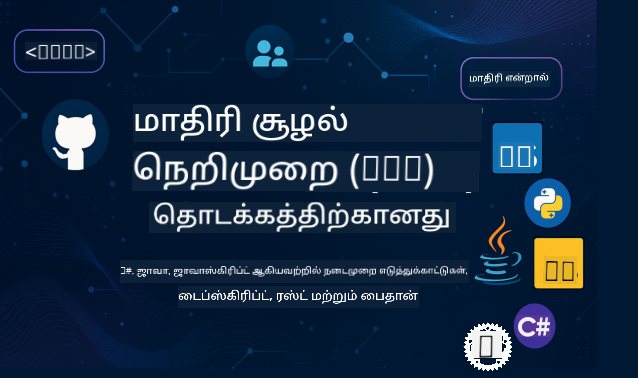

<!--
CO_OP_TRANSLATOR_METADATA:
{
  "original_hash": "0bb2a83ef33c1506d42d73902a95aa0b",
  "translation_date": "2025-10-11T11:13:43+00:00",
  "source_file": "README.md",
  "language_code": "ta"
}
-->
 

இந்த வளங்களை பயன்படுத்த தொடங்க கீழே உள்ள படிகளை பின்பற்றவும்:
1. **Repository-ஐ Fork செய்யவும்**: கிளிக் செய்யவும் 
2. **Repository-ஐ Clone செய்யவும்**:   `git clone https://github.com/microsoft/mcp-for-beginners.git`
3. [**Azure AI Foundry Discord-ஐ சேர்ந்து நிபுணர்களையும் மற்ற டெவலப்பர்களையும் சந்திக்கவும்**](https://discord.com/invite/ByRwuEEgH4)

### 🌐 பல மொழி ஆதரவு

#### GitHub Action மூலம் ஆதரவு (தானியங்கி மற்றும் எப்போதும் புதுப்பிக்கப்பட்டது)

<!-- CO-OP TRANSLATOR LANGUAGES TABLE START -->
[Arabic](../ar/README.md) | [Bengali](../bn/README.md) | [Bulgarian](../bg/README.md) | [Burmese (Myanmar)](../my/README.md) | [Chinese (Simplified)](../zh/README.md) | [Chinese (Traditional, Hong Kong)](../hk/README.md) | [Chinese (Traditional, Macau)](../mo/README.md) | [Chinese (Traditional, Taiwan)](../tw/README.md) | [Croatian](../hr/README.md) | [Czech](../cs/README.md) | [Danish](../da/README.md) | [Dutch](../nl/README.md) | [Estonian](../et/README.md) | [Finnish](../fi/README.md) | [French](../fr/README.md) | [German](../de/README.md) | [Greek](../el/README.md) | [Hebrew](../he/README.md) | [Hindi](../hi/README.md) | [Hungarian](../hu/README.md) | [Indonesian](../id/README.md) | [Italian](../it/README.md) | [Japanese](../ja/README.md) | [Korean](../ko/README.md) | [Lithuanian](../lt/README.md) | [Malay](../ms/README.md) | [Marathi](../mr/README.md) | [Nepali](../ne/README.md) | [Norwegian](../no/README.md) | [Persian (Farsi)](../fa/README.md) | [Polish](../pl/README.md) | [Portuguese (Brazil)](../br/README.md) | [Portuguese (Portugal)](../pt/README.md) | [Punjabi (Gurmukhi)](../pa/README.md) | [Romanian](../ro/README.md) | [Russian](../ru/README.md) | [Serbian (Cyrillic)](../sr/README.md) | [Slovak](../sk/README.md) | [Slovenian](../sl/README.md) | [Spanish](../es/README.md) | [Swahili](../sw/README.md) | [Swedish](../sv/README.md) | [Tagalog (Filipino)](../tl/README.md) | [Tamil](./README.md) | [Thai](../th/README.md) | [Turkish](../tr/README.md) | [Ukrainian](../uk/README.md) | [Urdu](../ur/README.md) | [Vietnamese](../vi/README.md)
<!-- CO-OP TRANSLATOR LANGUAGES TABLE END -->

# 🚀 Model Context Protocol (MCP) ஆரம்பக்கட்ட பாடத்திட்டம்

## **C#, Java, JavaScript, Rust, Python, மற்றும் TypeScript ஆகியவற்றில் செயல்பாடுகளுடன் MCP கற்றுக்கொள்ளுங்கள்**

## 🧠 Model Context Protocol பாடத்திட்டத்தின் மேற்பார்வை

**Model Context Protocol (MCP)** என்பது AI மாடல்கள் மற்றும் கிளையன்ட் பயன்பாடுகளுக்கு இடையிலான தொடர்புகளை முறைப்படுத்த உருவாக்கப்பட்ட ஒரு முன்னணி கட்டமைப்பாகும். இந்த திறந்த மூல பாடத்திட்டம், C#, Java, JavaScript, TypeScript, மற்றும் Python போன்ற பிரபலமான நிரலாக்க மொழிகளில் செயல்பாடுகளுடன் கூடிய கட்டமைக்கப்பட்ட கற்றல் பாதையை வழங்குகிறது.

நீங்கள் AI டெவலப்பர், சிஸ்டம் ஆர்கிடெக்ட் அல்லது மென்பொருள் பொறியாளர் ஆகியவராக இருந்தாலும், MCP அடிப்படைகள் மற்றும் செயல்படுத்தும் உத்திகள் கற்றுக்கொள்ள இந்த வழிகாட்டி முழுமையான வளமாக இருக்கும்.

## 🔗 MCP அதிகாரப்பூர்வ வளங்கள்

- 📘 [MCP Documentation](https://modelcontextprotocol.io/) – விரிவான டுடோரியல்கள் மற்றும் பயனர் வழிகாட்டிகள்  
- 📜 [MCP Specification](https://modelcontextprotocol.io/docs/) – புரோட்டோகால் கட்டமைப்பு மற்றும் தொழில்நுட்ப குறிப்புகள்  
- 📜 [Original MCP Specification](https://spec.modelcontextprotocol.io/) – பழைய தொழில்நுட்ப குறிப்புகள் (கூடுதல் விவரங்களை கொண்டிருக்கலாம்)  
- 🧑‍💻 [MCP GitHub Repository](https://github.com/modelcontextprotocol) – திறந்த மூல SDKகள், கருவிகள், மற்றும் குறியீட்டு மாதிரிகள்
- 🌐 [MCP Community](https://github.com/orgs/modelcontextprotocol/discussions) – விவாதங்களில் பங்கேற்கவும் மற்றும் சமூகத்தில் பங்களிக்கவும்

## 🧭 MCP பாடத்திட்டத்தின் மேற்பார்வை

### 📚 முழுமையான பாடத்திட்ட அமைப்பு

| Module | தலைப்பு | விளக்கம் | இணைப்பு |
|--------|-------|-------------|------|
| **Module 1-3: அடிப்படைகள்** | | | |
| 00 | MCP அறிமுகம் | Model Context Protocol மற்றும் AI பைப்பிலைகளில் அதன் முக்கியத்துவத்தின் மேற்பார்வை | [மேலும் படிக்க](./00-Introduction/README.md) |
| 01 | முக்கிய கருத்துக்கள் விளக்கம் | MCP முக்கிய கருத்துக்களின் ஆழமான ஆராய்ச்சி | [மேலும் படிக்க](./01-CoreConcepts/README.md) |
| 02 | MCP-இல் பாதுகாப்பு | பாதுகாப்பு அச்சுறுத்தல்கள் மற்றும் சிறந்த நடைமுறைகள் | [மேலும் படிக்க](./02-Security/README.md) |
| 03 | MCP-இல் தொடங்குதல் | சூழல் அமைப்பு, அடிப்படை சர்வர்கள்/கிளையன்ட்கள், ஒருங்கிணைப்பு | [மேலும் படிக்க](./03-GettingStarted/README.md) |
| **Module 3: உங்கள் முதல் சர்வர் மற்றும் கிளையன்டை உருவாக்குதல்** | | | |
| 3.1 | முதல் சர்வர் | உங்கள் முதல் MCP சர்வரை உருவாக்குங்கள் | [வழிகாட்டி](./03-GettingStarted/01-first-server/README.md) |
| 3.2 | முதல் கிளையன்ட் | அடிப்படை MCP கிளையன்டை உருவாக்குங்கள் | [வழிகாட்டி](./03-GettingStarted/02-client/README.md) |
| 3.3 | LLM உடன் கிளையன்ட் | பெரிய மொழி மாடல்களை ஒருங்கிணைப்பு | [வழிகாட்டி](./03-GettingStarted/03-llm-client/README.md) |
| 3.4 | VS Code ஒருங்கிணைப்பு | MCP சர்வர்களை VS Code-இல் பயன்படுத்துங்கள் | [வழிகாட்டி](./03-GettingStarted/04-vscode/README.md) |
| 3.5 | stdio சர்வர் | stdio போக்குவரத்து பயன்படுத்தி சர்வர்களை உருவாக்குங்கள் | [வழிகாட்டி](./03-GettingStarted/05-stdio-server/README.md) |
| 3.6 | HTTP ஸ்ட்ரீமிங் | MCP-இல் HTTP ஸ்ட்ரீமிங்கை செயல்படுத்துங்கள் | [வழிகாட்டி](./03-GettingStarted/06-http-streaming/README.md) |
| 3.7 | AI கருவி தொகுப்பு | MCP உடன் AI கருவி தொகுப்பைப் பயன்படுத்துங்கள் | [வழிகாட்டி](./03-GettingStarted/07-aitk/README.md) |
| 3.8 | சோதனை | உங்கள் MCP சர்வர் செயல்பாட்டை சோதிக்கவும் | [வழிகாட்டி](./03-GettingStarted/08-testing/README.md) |
| 3.9 | வெளியீடு | MCP சர்வர்களை தயாரிப்பில் வெளியிடுங்கள் | [வழிகாட்டி](./03-GettingStarted/09-deployment/README.md) |
| 3.10 | மேம்பட்ட சர்வர் பயன்பாடு | மேம்பட்ட அம்சங்களைப் பயன்படுத்த மேம்பட்ட சர்வர்களை பயன்படுத்துங்கள் | [வழிகாட்டி](./03-GettingStarted/10-advanced/README.md) |
| 3.11 | எளிய அங்கீகாரம் | ஆரம்பத்திலிருந்து அங்கீகாரம் மற்றும் RBAC கற்றுக்கொள்ளும் அத்தியாயம் | [வழிகாட்டி](./03-GettingStarted/11-simple-auth/README.md) |
| **Module 4-5: நடைமுறை மற்றும் மேம்பட்டது** | | | |
| 04 | நடைமுறை செயல்பாடு | SDKகள், பிழைதிருத்தம், சோதனை, மீண்டும் பயன்படுத்தக்கூடிய ப்ராம்ட் டெம்ப்ளேட்கள் | [மேலும் படிக்க](./04-PracticalImplementation/README.md) |
| 05 | MCP-இல் மேம்பட்ட தலைப்புகள் | பல்வேறு AI, அளவீடு, நிறுவன பயன்பாடு | [மேலும் படிக்க](./05-AdvancedTopics/README.md) |
| 5.1 | Azure ஒருங்கிணைப்பு | MCP மற்றும் Azure ஒருங்கிணைப்பு | [வழிகாட்டி](./05-AdvancedTopics/mcp-integration/README.md) |
| 5.2 | பல்வேறு முறை | பல Modalities உடன் வேலை செய்ய | [வழிகாட்டி](./05-AdvancedTopics/mcp-multi-modality/README.md) |
| 5.3 | OAuth2 டெமோ | OAuth2 அங்கீகாரத்தை செயல்படுத்துங்கள் | [வழிகாட்டி](./05-AdvancedTopics/mcp-oauth2-demo/README.md) |
| 5.4 | Root Contexts | Root Contexts-ஐ புரிந்து கொண்டு செயல்படுத்துங்கள் | [வழிகாட்டி](./05-AdvancedTopics/mcp-root-contexts/README.md) |
| 5.5 | வழிமுறைகள் | MCP வழிமுறைகள் | [வழிகாட்டி](./05-AdvancedTopics/mcp-routing/README.md) |
| 5.6 | மாதிரிகள் | MCP-இல் மாதிரி முறைகள் | [வழிகாட்டி](./05-AdvancedTopics/mcp-sampling/README.md) |
| 5.7 | அளவீடு | MCP செயல்பாடுகளை அளவீடு செய்யுங்கள் | [வழிகாட்டி](./05-AdvancedTopics/mcp-scaling/README.md) |
| 5.8 | பாதுகாப்பு | மேம்பட்ட பாதுகாப்பு கருத்துக்கள் | [வழிகாட்டி](./05-AdvancedTopics/mcp-security/README.md) |
| 5.9 | வலை தேடல் | வலை தேடல் திறன்களை செயல்படுத்துங்கள் | [வழிகாட்டி](./05-AdvancedTopics/web-search-mcp/README.md) |
| 5.10 | நேரடி ஸ்ட்ரீமிங் | நேரடி ஸ்ட்ரீமிங் செயல்பாட்டை உருவாக்குங்கள் | [வழிகாட்டி](./05-AdvancedTopics/mcp-realtimestreaming/README.md) |
| 5.11 | நேரடி தேடல் | நேரடி தேடலை செயல்படுத்துங்கள் | [வழிகாட்டி](./05-AdvancedTopics/mcp-realtimesearch/README.md) |
| 5.12 | Entra ID Auth | Microsoft Entra ID உடன் அங்கீகாரம் | [வழிகாட்டி](./05-AdvancedTopics/mcp-security-entra/README.md) |
| 5.13 | Foundry ஒருங்கிணைப்பு | Azure AI Foundry உடன் ஒருங்கிணைப்பு | [வழிகாட்டி](./05-AdvancedTopics/mcp-foundry-agent-integration/README.md) |
| 5.14 | Context Engineering | பயனுள்ள Context Engineering உத்திகள் | [வழிகாட்டி](./05-AdvancedTopics/mcp-contextengineering/README.md) |
| 5.15 | MCP Custom Transport | தனிப்பயன் போக்குவரத்து செயல்பாடுகள் | [வழிகாட்டி](./05-AdvancedTopics/mcp-transport/README.md) |
| **Module 6-10: சமூக மற்றும் சிறந்த நடைமுறைகள்** | | | |
| 06 | சமூக பங்களிப்புகள் | MCP சூழலுக்கு பங்களிக்க எப்படி | [வழிகாட்டி](./06-CommunityContributions/README.md) |
| 07 | ஆரம்பகால பயன்பாட்டிலிருந்து அனுபவங்கள் | உண்மையான செயல்பாட்டு கதைகள் | [வழிகாட்டி](./07-LessonsFromEarlyAdoption/README.md) |
| 08 | MCP-இல் சிறந்த நடைமுறைகள் | செயல்திறன், பிழை-தாங்குதல், மறு-சீரமைப்பு | [வழிகாட்டி](./08-BestPractices/README.md) |
| 09 | MCP வழக்குக் களங்கள் | நடைமுறை செயல்பாட்டு உதாரணங்கள் | [வழிகாட்டி](./09-CaseStudy/README.md) |
| 10 | MCP Server உருவாக்கும் பயிற்சி | AI கருவி தொகுப்புடன் MCP Server உருவாக்குதல் | [Lab](./10-StreamliningAIWorkflowsBuildingAnMCPServerWithAIToolkit/README.md) |
| **Module 11: MCP Server Hands On Lab** | | | |
| 11 | MCP சர்வர் தரவுத்தொகுப்பு ஒருங்கிணைப்பு | PostgreSQL ஒருங்கிணைப்புக்கான முழுமையான 13-லேப்கள் கைக்கூலி கற்றல் பாதை | [Labs](./11-MCPServerHandsOnLabs/README.md) |
| 11.1 | அறிமுகம் | MCP மற்றும் தரவுத்தொகுப்பு ஒருங்கிணைப்பு மற்றும் சில்லறை பகுப்பாய்வு பயன்பாட்டின் மேற்பார்வை | [Lab 00](./11-MCPServerHandsOnLabs/00-Introduction/README.md) |
| 11.2 | மையக் கட்டமைப்பு | MCP சர்வர் கட்டமைப்பு, தரவுத்தொகுப்பு அடுக்குகள் மற்றும் பாதுகாப்பு முறைகளைப் புரிந்துகொள்வது | [Lab 01](./11-MCPServerHandsOnLabs/01-Architecture/README.md) |
| 11.3 | பாதுகாப்பு மற்றும் பன்முக-பயன்பாடு | வரிசை நிலை பாதுகாப்பு, அங்கீகாரம் மற்றும் பன்முக பயனர் தரவினை அணுகுதல் | [Lab 02](./11-MCPServerHandsOnLabs/02-Security/README.md) |
| 11.4 | சூழல் அமைப்பு | மேம்பாட்டு சூழலை அமைத்தல், Docker, Azure வளங்கள் | [Lab 03](./11-MCPServerHandsOnLabs/03-Setup/README.md) |
| 11.5 | தரவுத்தொகுப்பு வடிவமைப்பு | PostgreSQL அமைப்பு, சில்லறை ஸ்கீமா வடிவமைப்பு மற்றும் மாதிரி தரவுகள் | [Lab 04](./11-MCPServerHandsOnLabs/04-Database/README.md) |
| 11.6 | MCP சர்வர் செயல்படுத்தல் | தரவுத்தொகுப்பு ஒருங்கிணைப்புடன் FastMCP சர்வரை உருவாக்குதல் | [Lab 05](./11-MCPServerHandsOnLabs/05-MCP-Server/README.md) |
| 11.7 | கருவி மேம்பாடு | தரவுத்தொகுப்பு கேள்வி கருவிகள் மற்றும் ஸ்கீமா ஆய்வு உருவாக்குதல் | [Lab 06](./11-MCPServerHandsOnLabs/06-Tools/README.md) |
| 11.8 | அர்த்தமுள்ள தேடல் | Azure OpenAI மற்றும் pgvector உடன் வெக்டர் எம்பெடிங்குகளை செயல்படுத்துதல் | [Lab 07](./11-MCPServerHandsOnLabs/07-Semantic-Search/README.md) |
| 11.9 | சோதனை மற்றும் பிழைதிருத்தம் | சோதனை உத்திகள், பிழைதிருத்த கருவிகள் மற்றும் சரிபார்ப்பு அணுகுமுறைகள் | [Lab 08](./11-MCPServerHandsOnLabs/08-Testing/README.md) |
| 11.10 | VS Code ஒருங்கிணைப்பு | VS Code MCP ஒருங்கிணைப்பு மற்றும் AI Chat பயன்பாட்டை அமைத்தல் | [Lab 09](./11-MCPServerHandsOnLabs/09-VS-Code/README.md) |
| 11.11 | பிரச்சார உத்திகள் | Docker பிரச்சாரம், Azure Container Apps மற்றும் அளவீட்டு கருத்துக்கள் | [Lab 10](./11-MCPServerHandsOnLabs/10-Deployment/README.md) |
| 11.12 | கண்காணிப்பு | Application Insights, பதிவு, செயல்திறன் கண்காணிப்பு | [Lab 11](./11-MCPServerHandsOnLabs/11-Monitoring/README.md) |
| 11.13 | சிறந்த நடைமுறைகள் | செயல்திறன் மேம்பாடு, பாதுகாப்பு உறுதிப்படுத்தல் மற்றும் உற்பத்தி குறிப்புகள் | [Lab 12](./11-MCPServerHandsOnLabs/12-Best-Practices/README.md) |

### 💻 மாதிரி குறியீட்டு திட்டங்கள்

#### அடிப்படை MCP கால்குலேட்டர் மாதிரிகள்

| மொழி | விளக்கம் | இணைப்பு |
|----------|-------------|------|
| C# | MCP சர்வர் உதாரணம் | [View Code](./03-GettingStarted/samples/csharp/README.md) |
| Java | MCP கால்குலேட்டர் | [View Code](./03-GettingStarted/samples/java/calculator/README.md) |
| JavaScript | MCP டெமோ | [View Code](./03-GettingStarted/samples/javascript/README.md) |
| Python | MCP சர்வர் | [View Code](../../03-GettingStarted/samples/python/mcp_calculator_server.py) |
| TypeScript | MCP உதாரணம் | [View Code](./03-GettingStarted/samples/typescript/README.md) |
| Rust | MCP உதாரணம் | [View Code](./03-GettingStarted/samples/rust/README.md) |

#### மேம்பட்ட MCP செயல்பாடுகள்

| மொழி | விளக்கம் | இணைப்பு |
|----------|-------------|------|
| C# | மேம்பட்ட மாதிரி | [View Code](./04-PracticalImplementation/samples/csharp/README.md) |
| Java with Spring | Container App உதாரணம் | [View Code](./04-PracticalImplementation/samples/java/containerapp/README.md) |
| JavaScript | மேம்பட்ட மாதிரி | [View Code](./04-PracticalImplementation/samples/javascript/README.md) |
| Python | சிக்கலான செயல்பாடு | [View Code](../../04-PracticalImplementation/samples/python/READMEmd) |
| TypeScript | Container மாதிரி | [View Code](./04-PracticalImplementation/samples/typescript/README.md) |

## 🎯 MCP கற்றலுக்கான முன்னோட்டங்கள்

இந்த பாடத்திட்டத்திலிருந்து அதிகம் பெற, நீங்கள் பின்வரும் திறன்களை கொண்டிருக்க வேண்டும்:

- C#, Java, JavaScript, Python, அல்லது TypeScript போன்ற மொழிகளில் குறைந்தபட்சமாக ஒரு மொழியில் அடிப்படை அறிவு  
- கிளையன்ட்-சர்வர் மாடல் மற்றும் APIக்கள் பற்றிய புரிதல்  
- REST மற்றும் HTTP கருத்துக்களை அறிதல்  
- (விருப்பம்) AI/ML கருத்துக்களில் பின்னணி  

- ஆதரவுக்கான எங்கள் சமூக விவாதங்களில் சேருங்கள்  

## 📚 கற்றல் வழிகாட்டி மற்றும் வளங்கள்

இந்த களஞ்சியத்தில் உள்ள பல்வேறு வளங்கள் உங்களை வழிநடத்த உதவுகின்றன:

### கற்றல் வழிகாட்டி

ஒரு விரிவான [கற்றல் வழிகாட்டி](./study_guide.md) இந்த களஞ்சியத்தை எளிதாக வழிநடத்த உதவுகிறது. இதில் அடங்கும்:

- கற்றல் பாடத்திட்டத்தின் பார்வை வரைபடம்  
- ஒவ்வொரு பகுதியின் விரிவான விளக்கம்  
- மாதிரி திட்டங்களை எவ்வாறு பயன்படுத்துவது என்பதற்கான வழிகாட்டுதல்  
- பல்வேறு திறன் நிலைகளுக்கான பரிந்துரைக்கப்பட்ட கற்றல் பாதைகள்  
- உங்கள் கற்றல் பயணத்தை மேம்படுத்த கூடுதல் வளங்கள்  

### மாற்றங்கள் பதிவு

பாடத்திட்டப் பொருட்களில் முக்கியமான புதுப்பிப்புகளைப் பதிவு செய்யும் [மாற்றங்கள் பதிவு](./changelog.md) பராமரிக்கப்படுகிறது:

- புதிய உள்ளடக்க சேர்க்கைகள்  
- கட்டமைப்பு மாற்றங்கள்  
- அம்ச மேம்பாடுகள்  
- ஆவணங்கள் புதுப்பிப்பு  

## 🛠️ இந்த பாடத்திட்டத்தை பயனுள்ளதாக பயன்படுத்துவது எப்படி

இந்த வழிகாட்டியில் உள்ள ஒவ்வொரு பாடமும்:

1. MCP கருத்துக்களின் தெளிவான விளக்கங்கள்  
2. பல மொழிகளில் நேரடி குறியீட்டு உதாரணங்கள்  
3. உண்மையான MCP பயன்பாடுகளை உருவாக்க பயிற்சிகள்  
4. மேம்பட்ட கற்றலுக்கான கூடுதல் வளங்கள்  

## நிகழ்வுகள் 

### [MCP Dev Days ஜூலை 2025](https://developer.microsoft.com/en-us/reactor/series/S-1563/)
#### [➡️தற்போது பார்க்க - MCP Dev Days](https://developer.microsoft.com/en-us/reactor/series/S-1563/)
MCP Dev Days, AI மாடல்கள் மற்றும் அவற்றின் கருவிகளை இணைக்கும் Model Context Protocol (MCP) பற்றிய இரண்டு நாட்கள் ஆழமான தொழில்நுட்ப பார்வை, சமூக இணைப்பு மற்றும் கைக்கூலி கற்றலுக்கான ஒரு மெய்நிகர் நிகழ்வுக்கு தயாராகுங்கள்.  
நிகழ்வைப் பார்க்க பதிவு செய்ய: https://aka.ms/mcpdevdays.  

#### [நாள் 1: MCP உற்பத்தி, DevTools, & சமூகம்:](https://developer.microsoft.com/en-us/reactor/series/S-1563/)

MCP ஐ உங்கள் மேம்பாட்டு வேலைப்பாடுகளில் பயன்படுத்துவதற்கான வழிகாட்டுதல் மற்றும் MCP சமூகத்தை கொண்டாடுவது பற்றியது.  
Microsoft உடன் இணைந்து திறந்த, விரிவாக்கக்கூடிய MCP சூழலமைப்பை உருவாக்க Arcade, Block, Okta, Neon போன்ற சமூக உறுப்பினர்கள் மற்றும் கூட்டாளர்களுடன் இணைந்து செயல்பாடுகளைப் பார்க்கலாம்.  
உண்மையான உலக டெமோக்கள் VS Code, Visual Studio, GitHub Copilot மற்றும் பிரபலமான சமூக கருவிகளில்  
நடைமுறை, சூழல் சார்ந்த மேம்பாட்டு வேலைப்பாடுகள்  
சமூக வழிநடத்தப்பட்ட அமர்வுகள் மற்றும் பார்வைகள்  
MCP-ஐப் பயன்படுத்தத் தொடங்கியவர்களாக இருந்தாலும் அல்லது அதில் ஏற்கனவே உருவாக்கியவர்களாக இருந்தாலும், நாள் 1 உங்களுக்கு ஊக்கமும் செயல்படக்கூடிய எடுத்துக்காட்டுகளையும் வழங்கும்.  

#### [நாள் 2: MCP சர்வர்களை நம்பிக்கையுடன் உருவாக்குங்கள்](https://developer.microsoft.com/en-us/reactor/series/S-1563/)

MCP உருவாக்குபவர்களுக்கானது. MCP சர்வர்களை உருவாக்குவதற்கான செயல்பாட்டு உத்திகள் மற்றும் சிறந்த நடைமுறைகள் பற்றிய ஆழமான பார்வை.  

#### தலைப்புகள்:

- MCP சர்வர்களை உருவாக்குதல் மற்றும் அவற்றை ஏஜென்ட் அனுபவங்களில் ஒருங்கிணைத்தல்  
- கேள்வி சார்ந்த மேம்பாடு  
- பாதுகாப்பு சிறந்த நடைமுறைகள்  
- Functions, ACA, மற்றும் API மேலாண்மை போன்ற கட்டமைப்புகளைப் பயன்படுத்துதல்  
- பதிவேடு ஒழுங்கமைப்பு மற்றும் கருவிகள் (1P + 3P)  

மேம்பாட்டாளர், கருவி உருவாக்குபவர் அல்லது AI தயாரிப்பு உத்தி நிபுணராக இருந்தால், இந்த நாள் MCP தீர்வுகளை அளவீட்டு, பாதுகாப்பான மற்றும் எதிர்காலத்திற்கான தயாராக உருவாக்க தேவையான பார்வைகளை வழங்குகிறது.  

### MCP Boot Camp ஆகஸ்ட் 2025
MCP சர்வர்களை உருவாக்குவது, VS Code உடன் ஒருங்கிணைப்பது மற்றும் Azure-ல் தொழில்முறை முறையில் பிரச்சாரம் செய்வது பற்றிய வீடியோ அமர்வுகளில் கற்றல். MCP ஆரம்பக்காரர்களுக்கான பாடத்திட்டத்தின் உள்ளடக்கத்தின் அடிப்படையில் தொழில்முறை திறன்களைப் பெறுங்கள்.  

#### [➡️தற்போது பார்க்க MCP Bootcamp | ஆங்கிலம்](https://developer.microsoft.com/en-us/reactor/series/s-1568/)
#### [➡️தற்போது பார்க்க MCP Bootcamp | பிரேசில்](https://developer.microsoft.com/en-us/reactor/series/S-1566/)
#### [➡️தற்போது பார்க்க MCP Bootcamp | ஸ்பானிஷ்](https://developer.microsoft.com/en-us/reactor/series/S-1567/)

### C# உடன் MCP கற்றல் - டுடோரியல் தொடர்
Model Context Protocol (MCP) பற்றி கற்றுக்கொள்வோம், AI மாடல்கள் மற்றும் கிளையன்ட் பயன்பாடுகளுக்கு இடையிலான தொடர்புகளை மையமாக்க வடிவமைக்கப்பட்ட ஒரு முன்னணி கட்டமைப்பு. இந்த ஆரம்பநிலை நட்பு அமர்வின் மூலம், MCP-ஐ உங்களுக்கு அறிமுகப்படுத்தி உங்கள் முதல் MCP சர்வரை உருவாக்க வழிகாட்டுவோம்.  
#### C#: [https://aka.ms/letslearnmcp-csharp](https://aka.ms/letslearnmcp-csharp)  
#### Java: [https://aka.ms/letslearnmcp-java](https://aka.ms/letslearnmcp-java)  
#### JavaScript: [https://aka.ms/letslearnmcp-javascript](https://aka.ms/letslearnmcp-javascript)  
#### Python: [https://aka.ms/letslearnmcp-python](https://aka.ms/letslearnmcp-python)  

## 🌟 சமூக நன்றி

முக்கிய குறியீட்டு மாதிரிகளை வழங்க Microsoft Valued Professional [Shivam Goyal](https://www.linkedin.com/in/shivam2003/) அவர்களுக்கு நன்றி.  

## 📜 உரிமம் தகவல்

இந்த உள்ளடக்கம் **MIT உரிமம்** கீழ் உரிமம் பெற்றது. விதிமுறைகள் மற்றும் நிபந்தனைகளுக்கு, [LICENSE](../../LICENSE) ஐப் பார்க்கவும்.  

## 🤝 பங்களிப்பு வழிகாட்டுதல்கள்

இந்த திட்டம் பங்களிப்புகளையும் பரிந்துரைகளையும் வரவேற்கிறது.  
பெரும்பாலான பங்களிப்புகள் Contributor License Agreement (CLA) உடன் ஒப்புதல் அளிக்க வேண்டும், இது உங்கள் பங்களிப்பை பயன்படுத்துவதற்கான உரிமையை நமக்கு வழங்குவதற்கான உரிமை உங்களிடம் உள்ளது என்பதை உறுதிப்படுத்துகிறது. மேலும் விவரங்களுக்கு <https://cla.opensource.microsoft.com> ஐப் பார்க்கவும்.  

நீங்கள் ஒரு pull request சமர்ப்பிக்கும்போது, CLA bot தானாகவே நீங்கள் CLA வழங்க வேண்டியதா என்பதைத் தீர்மானித்து PR ஐச் சரியாக அலங்கரிக்கும் (எ.கா., நிலைச் சரிபார்ப்பு, கருத்து).  
bot வழங்கிய வழிகாட்டுதல்களைப் பின்பற்றவும்.  
CLA பயன்படுத்தும் அனைத்து களஞ்சியங்களில் இது ஒருமுறை மட்டுமே செய்ய வேண்டும்.  

இந்த திட்டம் [Microsoft Open Source Code of Conduct](https://opensource.microsoft.com/codeofconduct/) ஐ ஏற்றுக்கொண்டுள்ளது.  
மேலும் தகவலுக்கு [Code of Conduct FAQ](https://opensource.microsoft.com/codeofconduct/faq/) ஐப் பார்க்கவும் அல்லது [opencode@microsoft.com](mailto:opencode@microsoft.com) ஐ தொடர்பு கொள்ளவும்.  

## 📂 களஞ்சிய அமைப்பு

களஞ்சியம் பின்வருமாறு அமைக்கப்பட்டுள்ளது:

- **மைய பாடத்திட்டம் (00-11)**: PostgreSQL ஒருங்கிணைப்புடன் உற்பத்தி MCP சர்வர்களை உருவாக்க 11 தொடர்ச்சியான தொகுதிகளில் அமைக்கப்பட்ட முக்கிய உள்ளடக்கம்  
- **11-MCPServerHandsOnLabs/**: PostgreSQL ஒருங்கிணைப்புடன் MCP சர்வர்களை உருவாக்க 13-லேப கற்றல் பாதை  
- **images/**: பாடத்திட்டத்தில் பயன்படுத்தப்படும் வரைபடங்கள் மற்றும் விளக்கங்கள்  
- **translations/**: பல மொழி ஆதரவு  
- **translated_images/**: உள்ளூர் மொழிகளில் வரைபடங்கள் மற்றும் விளக்கங்கள்  
- **study_guide.md**: களஞ்சியத்தை வழிநடத்த விரிவான வழிகாட்டி  
- **changelog.md**: பாடத்திட்டப் பொருட்களில் முக்கியமான மாற்றங்களின் பதிவு  
- **mcp.json**: MCP விவரக்குறிப்பு கான்பிகரேஷன் கோப்பு  
- **CODE_OF_CONDUCT.md, LICENSE, SECURITY.md, SUPPORT.md**: திட்ட ஆளுமை ஆவணங்கள்  

## 🎒 பிற பாடங்கள்
எங்கள் குழு பிற பாடங்களை உருவாக்குகிறது! பாருங்கள்:

- [**புதியது** Edge AI For Beginners](https://github.com/microsoft/edgeai-for-beginners?WT.mc_id=academic-105485-koreyst)  
- [AI Agents For Beginners](https://github.com/microsoft/ai-agents-for-beginners?WT.mc_id=academic-105485-koreyst)  
- [Generative AI for Beginners using .NET](https://github.com/microsoft/Generative-AI-for-beginners-dotnet?WT.mc_id=academic-105485-koreyst)  
- [Generative AI for Beginners using JavaScript](https://github.com/microsoft/generative-ai-with-javascript?WT.mc_id=academic-105485-koreyst)  
- [Generative AI for Beginners](https://github.com/microsoft/generative-ai-for-beginners?WT.mc_id=academic-105485-koreyst)  
- [Generative AI for Beginners using Java](https://github.com/microsoft/generative-ai-for-beginners-java?WT.mc_id=academic-105485-koreyst)  
- [ML for Beginners](https://aka.ms/ml-beginners?WT.mc_id=academic-105485-koreyst)  
- [Data Science for Beginners](https://aka.ms/datascience-beginners?WT.mc_id=academic-105485-koreyst)  
- [AI for Beginners](https://aka.ms/ai-beginners?WT.mc_id=academic-105485-koreyst)  
- [Cybersecurity for Beginners](https://github.com/microsoft/Security-101?WT.mc_id=academic-96948-sayoung)  
- [Web Dev for Beginners](https://aka.ms/webdev-beginners?WT.mc_id=academic-105485-koreyst)  
- [IoT for Beginners](https://aka.ms/iot-beginners?WT.mc_id=academic-105485-koreyst)  
- [XR Development for Beginners](https://github.com/microsoft/xr-development-for-beginners?WT.mc_id=academic-105485-koreyst)  
- [GitHub Copilot-ஐ AI இணை நிரலாக்கத்திற்காக கையாளுதல்](https://aka.ms/GitHubCopilotAI?WT.mc_id=academic-105485-koreyst)
- [C#/.NET டெவலப்பர்களுக்கான GitHub Copilot-ஐ கையாளுதல்](https://github.com/microsoft/mastering-github-copilot-for-dotnet-csharp-developers?WT.mc_id=academic-105485-koreyst)
- [உங்கள் சொந்த Copilot சாகசத்தை தேர்ந்தெடுக்கவும்](https://github.com/microsoft/CopilotAdventures?WT.mc_id=academic-105485-koreyst)

## ™️ வர்த்தக முத்திரை அறிவிப்பு

இந்த திட்டத்தில் திட்டங்கள், தயாரிப்புகள் அல்லது சேவைகளுக்கான வர்த்தக முத்திரைகள் அல்லது லோகோக்கள் இருக்கலாம். Microsoft 
வர்த்தக முத்திரைகள் அல்லது லோகோக்களை அங்கீகரிக்கப்பட்ட முறையில் பயன்படுத்துவது [Microsoft-இன் Trademark & Brand Guidelines](https://www.microsoft.com/legal/intellectualproperty/trademarks/usage/general) வழிகாட்டுதல்களை பின்பற்ற வேண்டும். 
இந்த திட்டத்தின் மாற்றப்பட்ட பதிப்புகளில் Microsoft வர்த்தக முத்திரைகள் அல்லது லோகோக்களை பயன்படுத்துவது குழப்பத்தை ஏற்படுத்தக்கூடாது அல்லது Microsoft ஆதரவை குறிக்கக்கூடாது. 
மூன்றாம் தரப்பின் வர்த்தக முத்திரைகள் அல்லது லோகோக்களை பயன்படுத்துவது அந்த மூன்றாம் தரப்பின் கொள்கைகளுக்கு உட்பட்டது.

## உதவி பெறுதல்

AI பயன்பாடுகளை உருவாக்குவதில் சிக்கல் ஏற்பட்டால் அல்லது கேள்விகள் இருந்தால், இணைந்திடுங்கள்:

தயாரிப்பு கருத்துகள் அல்லது பிழைகள் இருந்தால், பார்வையிடவும்:

---

**குறிப்பு**:  
இந்த ஆவணம் [Co-op Translator](https://github.com/Azure/co-op-translator) என்ற AI மொழிபெயர்ப்பு சேவையைப் பயன்படுத்தி மொழிபெயர்க்கப்பட்டுள்ளது. எங்கள் தரச்சிறப்பிற்காக முயற்சி செய்தாலும், தானியங்கி மொழிபெயர்ப்புகளில் பிழைகள் அல்லது தவறுகள் இருக்கக்கூடும் என்பதை தயவுசெய்து கவனத்தில் கொள்ளவும். அதன் தாய்மொழியில் உள்ள மூல ஆவணம் அதிகாரப்பூர்வ ஆதாரமாக கருதப்பட வேண்டும். முக்கியமான தகவல்களுக்கு, தொழில்முறை மனித மொழிபெயர்ப்பு பரிந்துரைக்கப்படுகிறது. இந்த மொழிபெயர்ப்பைப் பயன்படுத்துவதால் ஏற்படும் எந்த தவறான புரிதல்கள் அல்லது தவறான விளக்கங்களுக்கு நாங்கள் பொறுப்பல்ல.