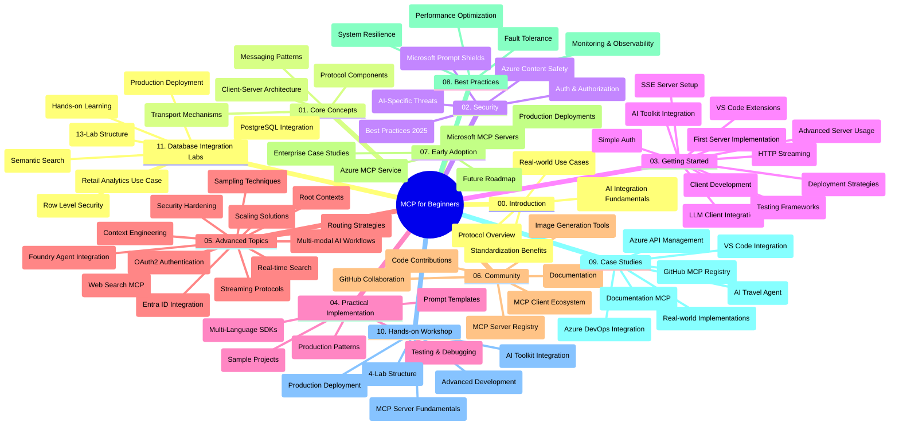

<!--
CO_OP_TRANSLATOR_METADATA:
{
  "original_hash": "af27b0acfae6caa134d9701453884df8",
  "translation_date": "2025-10-11T11:20:07+00:00",
  "source_file": "study_guide.md",
  "language_code": "ta"
}
-->
# தொடக்கத்திற்கான மாடல் சூழல் நெறிமுறை (MCP) - படிப்புக்கான வழிகாட்டி

இந்த படிப்புக்கான வழிகாட்டி "மாடல் சூழல் நெறிமுறை (MCP) தொடக்கத்திற்கான" பாடத்திட்டத்தின் சேமிப்பக அமைப்பு மற்றும் உள்ளடக்கத்தின் மேல் பார்வையை வழங்குகிறது. இந்த வழிகாட்டியை பயன்படுத்தி சேமிப்பகத்தை திறம்பட வழிநடத்தவும் மற்றும் கிடைக்கும் வளங்களை முழுமையாகப் பயன்படுத்தவும்.

## சேமிப்பகத்தின் மேல் பார்வை

மாடல் சூழல் நெறிமுறை (MCP) என்பது AI மாடல்கள் மற்றும் கிளையன்ட் பயன்பாடுகளுக்கு இடையிலான தொடர்புகளுக்கான ஒரு நிலையான கட்டமைப்பாகும். ஆரம்பத்தில் Anthropic ஆல் உருவாக்கப்பட்ட MCP, தற்போது அதிகாரப்பூர்வ GitHub அமைப்பின் மூலம் பரந்த MCP சமூகத்தால் பராமரிக்கப்படுகிறது. இந்த சேமிப்பகம் C#, Java, JavaScript, Python மற்றும் TypeScript ஆகியவற்றில் கைக்கூலி குறியீட்டு உதாரணங்களுடன் விரிவான பாடத்திட்டத்தை வழங்குகிறது, இது AI டெவலப்பர்கள், அமைப்பு வடிவமைப்பாளர்கள் மற்றும் மென்பொருள் பொறியாளர்களுக்காக வடிவமைக்கப்பட்டுள்ளது.

## காட்சி பாடத்திட்ட வரைபடம்

## சேமிப்பக அமைப்பு

சேமிப்பகம் மொத்தம் பதினொன்று முக்கிய பிரிவுகளாக அமைக்கப்பட்டுள்ளது, ஒவ்வொன்றும் MCP இன் வெவ்வேறு அம்சங்களை மையமாகக் கொண்டுள்ளது:

1. **அறிமுகம் (00-Introduction/)**
   - மாடல் சூழல் நெறிமுறையின் மேல் பார்வை
   - AI குழாய்களில் நிலையான முறையின் முக்கியத்துவம்
   - நடைமுறை பயன்பாடுகள் மற்றும் நன்மைகள்

2. **முக்கிய கருத்துக்கள் (01-CoreConcepts/)**
   - கிளையன்ட்-சர்வர் கட்டமைப்பு
   - முக்கிய நெறிமுறை கூறுகள்
   - MCP இல் செய்தி பரிமாற்ற முறைகள்

3. **பாதுகாப்பு (02-Security/)**
   - MCP அடிப்படையிலான அமைப்புகளில் பாதுகாப்பு அச்சுறுத்தல்கள்
   - செயல்படுத்தல் பாதுகாப்புக்கான சிறந்த நடைமுறைகள்
   - அங்கீகாரம் மற்றும் அனுமதி உத்திகள்
   - **விரிவான பாதுகாப்பு ஆவணங்கள்**:
     - MCP பாதுகாப்பு சிறந்த நடைமுறைகள் 2025
     - Azure உள்ளடக்க பாதுகாப்பு செயல்படுத்தல் வழிகாட்டி
     - MCP பாதுகாப்பு கட்டுப்பாடுகள் மற்றும் உத்திகள்
     - MCP சிறந்த நடைமுறைகள் விரைவான குறிப்புகள்
   - **முக்கிய பாதுகாப்பு தலைப்புகள்**:
     - ப்ராம்ப்ட் இன்ஜெக்ஷன் மற்றும் கருவி விஷமமடையும் தாக்குதல்கள்
     - அமர்வு கடத்தல் மற்றும் குழப்பமான பிரதிநிதி பிரச்சினைகள்
     - டோக்கன் பாஸ்த்ரூ பாதிப்புகள்
     - அதிகமான அனுமதிகள் மற்றும் அணுகல் கட்டுப்பாடு
     - AI கூறுகளுக்கான வழங்கல் சங்கிலி பாதுகாப்பு
     - Microsoft Prompt Shields ஒருங்கிணைப்பு

4. **தொடக்கம் (03-GettingStarted/)**
   - சூழல் அமைப்பு மற்றும் கட்டமைப்பு
   - அடிப்படை MCP சர்வர்கள் மற்றும் கிளையன்ட்களை உருவாக்குதல்
   - உள்ளமைக்கப்பட்ட பயன்பாடுகளுடன் ஒருங்கிணைவு
   - பின்வரும் பிரிவுகளை உள்ளடக்கியது:
     - முதல் சர்வர் செயல்படுத்தல்
     - கிளையன்ட் மேம்பாடு
     - LLM கிளையன்ட் ஒருங்கிணைவு
     - VS Code ஒருங்கிணைவு
     - Server-Sent Events (SSE) சர்வர்
     - மேம்பட்ட சர்வர் பயன்பாடு
     - HTTP ஸ்ட்ரீமிங்
     - AI கருவி ஒருங்கிணைவு
     - சோதனை உத்திகள்
     - பிரசாரம் வழிகாட்டுதல்கள்

5. **நடைமுறை செயல்படுத்தல் (04-PracticalImplementation/)**
   - வெவ்வேறு நிரலாக்க மொழிகளில் SDKகளைப் பயன்படுத்துதல்
   - பிழைதிருத்தம், சோதனை மற்றும் சரிபார்ப்பு உத்திகள்
   - மீண்டும் பயன்படுத்தக்கூடிய ப்ராம்ப்ட் டெம்ப்ளேட்கள் மற்றும் பணியிடங்களை உருவாக்குதல்
   - செயல்படுத்தல் உதாரணங்களுடன் மாதிரி திட்டங்கள்

6. **மேம்பட்ட தலைப்புகள் (05-AdvancedTopics/)**
   - சூழல் பொறியியல் உத்திகள்
   - Foundry முகவர் ஒருங்கிணைவு
   - பலவகை முறை AI பணியிடங்கள்
   - OAuth2 அங்கீகார டெமோக்கள்
   - நேரடி தேடல் திறன்கள்
   - நேரடி ஸ்ட்ரீமிங்
   - மூல சூழல் செயல்படுத்தல்
   - வழிமுறைகள்
   - மாதிரிகள் உத்திகள்
   - அளவீட்டு அணுகுமுறைகள்
   - பாதுகாப்பு கருத்துக்கள்
   - Entra ID பாதுகாப்பு ஒருங்கிணைவு
   - வலை தேடல் ஒருங்கிணைவு

7. **சமூக பங்களிப்புகள் (06-CommunityContributions/)**
   - குறியீடு மற்றும் ஆவணங்களை எவ்வாறு பங்களிக்க வேண்டும்
   - GitHub வழியாக ஒத்துழைப்பு
   - சமூகத்தால் இயக்கப்படும் மேம்பாடுகள் மற்றும் கருத்துகள்
   - பல்வேறு MCP கிளையன்ட்களைப் பயன்படுத்துதல் (Claude Desktop, Cline, VSCode)
   - புகழ்பெற்ற MCP சர்வர்களுடன் வேலை செய்வது, படங்களை உருவாக்குதல் உட்பட

8. **ஆரம்பக் கட்ட அனுபவங்களிலிருந்து பாடங்கள் (07-LessonsfromEarlyAdoption/)**
   - உண்மையான உலக செயல்பாடுகள் மற்றும் வெற்றிக் கதைகள்
   - MCP அடிப்படையிலான தீர்வுகளை உருவாக்குதல் மற்றும் பிரசாரம் செய்தல்
   - போக்குகள் மற்றும் எதிர்கால சாலை வரைபடம்
   - **Microsoft MCP Servers Guide**: 10 தயாரிப்பு-தயார் Microsoft MCP சர்வர்களுக்கான விரிவான வழிகாட்டி

9. **சிறந்த நடைமுறைகள் (08-BestPractices/)**
   - செயல்திறன் சீரமைப்பு மற்றும் மேம்பாடு
   - பிழை-தாங்கும் MCP அமைப்புகளை வடிவமைத்தல்
   - சோதனை மற்றும் நிலைத்தன்மை உத்திகள்

10. **கேஸ் ஸ்டடிகள் (09-CaseStudy/)**
    - MCP இன் பல்துறை நிலைப்பாட்டை விளக்கும் **ஏழு விரிவான கேஸ் ஸ்டடிகள்**:
    - **Azure AI Travel Agents**: Azure OpenAI மற்றும் AI தேடலுடன் பல முகவர் ஒருங்கிணைவு
    - **Azure DevOps Integration**: YouTube தரவுப் புதுப்பிப்புகளுடன் பணியிடங்களை தானியங்கி செய்யுதல்
    - **நேரடி ஆவண மீட்பு**: Python கமாண்டு லைன் கிளையன்ட் மற்றும் ஸ்ட்ரீமிங் HTTP
    - **இணையதளத்தில் படிப்புத் திட்டம் உருவாக்குதல்**: Chainlit வலை பயன்பாடு மற்றும் உரையாடல் AI
    - **தொகுப்பியில் உள்ள ஆவணங்கள்**: VS Code ஒருங்கிணைவு மற்றும் GitHub Copilot பணியிடங்கள்
    - **Azure API மேலாண்மை**: MCP சர்வர் உருவாக்கத்துடன் நிறுவன API ஒருங்கிணைவு
    - **GitHub MCP Registry**: சூழல் மேம்பாடு மற்றும் முகவர் ஒருங்கிணைவு தளம்

11. **கைக்கூலி பணிமனை (10-StreamliningAIWorkflowsBuildingAnMCPServerWithAIToolkit/)**
    - MCP மற்றும் AI கருவி தொகுப்புடன் இணைந்த விரிவான கைக்கூலி பணிமனை
    - உண்மையான உலக கருவிகளுடன் AI மாடல்களை இணைக்கும் புத்திசாலி பயன்பாடுகளை உருவாக்குதல்
    - அடிப்படைகள், தனிப்பயன் சர்வர் மேம்பாடு மற்றும் தயாரிப்பு பிரசாரம் உத்திகள் ஆகியவற்றை உள்ளடக்கிய நடைமுறை தொகுதிகள்
    - **பணிமனை அமைப்பு**:
      - பணிமனை 1: MCP சர்வர் அடிப்படைகள்
      - பணிமனை 2: மேம்பட்ட MCP சர்வர் மேம்பாடு
      - பணிமனை 3: AI கருவி தொகுப்பு ஒருங்கிணைவு
      - பணிமனை 4: தயாரிப்பு பிரசாரம் மற்றும் அளவீடு
    - படிப்படியாக வழிகாட்டும் கற்றல் அணுகுமுறை

12. **MCP சர்வர் தரவுத்தொகுப்பு ஒருங்கிணைவு பணிமனைகள் (11-MCPServerHandsOnLabs/)**
    - PostgreSQL ஒருங்கிணைப்புடன் தயாரிப்பு-தயார் MCP சர்வர்களை உருவாக்குவதற்கான **விரிவான 13-பணிமனை கற்றல் பாதை**
    - Zava Retail பயன்பாட்டை பயன்படுத்தி **உண்மையான உலக சில்லறை பகுப்பாய்வு செயல்படுத்தல்**
    - **நிறுவன தரமான மாதிரிகள்**: வரிசை நிலை பாதுகாப்பு (RLS), அர்த்தமுள்ள தேடல் மற்றும் பல பயனர் தரவுகளுக்கான அணுகல்
    - **முழுமையான பணிமனை அமைப்பு**:
      - **பணிமனைகள் 00-03: அடித்தளங்கள்** - அறிமுகம், கட்டமைப்பு, பாதுகாப்பு, சூழல் அமைப்பு
      - **பணிமனைகள் 04-06: MCP சர்வர் உருவாக்கம்** - தரவுத்தொகுப்பு வடிவமைப்பு, MCP சர்வர் செயல்படுத்தல், கருவி மேம்பாடு
      - **பணிமனைகள் 07-09: மேம்பட்ட அம்சங்கள்** - அர்த்தமுள்ள தேடல், சோதனை மற்றும் பிழைதிருத்தம், VS Code ஒருங்கிணைவு
      - **பணிமனைகள் 10-12: தயாரிப்பு மற்றும் சிறந்த நடைமுறைகள்** - பிரசாரம், கண்காணிப்பு, சீரமைப்பு
    - **கற்றல் முடிவுகள்**: தயாரிப்பு-தயார் MCP சர்வர்கள், தரவுத்தொகுப்பு ஒருங்கிணைவு மாதிரிகள், AI-ஆதாரமுள்ள பகுப்பாய்வு, நிறுவன பாதுகாப்பு

## கூடுதல் வளங்கள்

சேமிப்பகம் ஆதரவு வளங்களை உள்ளடக்கியது:

- **படங்கள் கோப்புறை**: பாடத்திட்டம் முழுவதும் பயன்படுத்தப்படும் வரைபடங்கள் மற்றும் விளக்கப்படங்களை கொண்டுள்ளது
- **மொழிபெயர்ப்புகள்**: ஆவணங்களின் தானியங்கி மொழிபெயர்ப்பு மூலம் பல மொழி ஆதரவு
- **அதிகாரப்பூர்வ MCP வளங்கள்**:
  - [MCP ஆவணங்கள்](https://modelcontextprotocol.io/)
  - [MCP விவரக்குறிப்பு](https://spec.modelcontextprotocol.io/)
  - [MCP GitHub சேமிப்பகம்](https://github.com/modelcontextprotocol)

## இந்த சேமிப்பகத்தை எவ்வாறு பயன்படுத்துவது

1. **தொடர்ச்சியான கற்றல்**: கட்டமைக்கப்பட்ட கற்றல் அனுபவத்திற்காக அத்தியாயங்களை வரிசைப்படி (00 முதல் 11 வரை) பின்பற்றவும்.
2. **மொழி-சிறப்பு கவனம்**: நீங்கள் ஒரு குறிப்பிட்ட நிரலாக்க மொழியில் ஆர்வமாக இருந்தால், உங்கள் விருப்ப மொழியில் செயல்பாடுகளுக்கான மாதிரிகள் கோப்புறைகளை ஆராயவும்.
3. **நடைமுறை செயல்படுத்தல்**: உங்கள் சூழலை அமைத்து உங்கள் முதல் MCP சர்வர் மற்றும் கிளையன்ட்டை உருவாக்க "தொடக்கம்" பிரிவில் தொடங்கவும்.
4. **மேம்பட்ட ஆராய்ச்சி**: அடிப்படைகளைப் பற்றிய நம்பிக்கையுடன், உங்கள் அறிவை விரிவுபடுத்த மேம்பட்ட தலைப்புகளில் ஆழமாக சென்று பாருங்கள்.
5. **சமூக ஈடுபாடு**: MCP சமூகத்தில் GitHub விவாதங்கள் மற்றும் Discord சேனல்களின் மூலம் நிபுணர்கள் மற்றும் சக டெவலப்பர்களுடன் இணைந்திருங்கள்.

## MCP கிளையன்ட்கள் மற்றும் கருவிகள்

பாடத்திட்டம் பல MCP கிளையன்ட்கள் மற்றும் கருவிகளை உள்ளடக்கியது:

1. **அதிகாரப்பூர்வ கிளையன்ட்கள்**:
   - Visual Studio Code 
   - MCP in Visual Studio Code
   - Claude Desktop
   - Claude in VSCode 
   - Claude API

2. **சமூக கிளையன்ட்கள்**:
   - Cline (terminal-based)
   - Cursor (code editor)
   - ChatMCP
   - Windsurf

3. **MCP மேலாண்மை கருவிகள்**:
   - MCP CLI
   - MCP Manager
   - MCP Linker
   - MCP Router

## பிரபலமான MCP சர்வர்கள்

சேமிப்பகம் பல MCP சர்வர்களை அறிமுகப்படுத்துகிறது, அவற்றில் சில:

1. **அதிகாரப்பூர்வ Microsoft MCP சர்வர்கள்**:
   - Microsoft Learn Docs MCP Server
   - Azure MCP Server (15+ சிறப்பு இணைப்பிகள்)
   - GitHub MCP Server
   - Azure DevOps MCP Server
   - MarkItDown MCP Server
   - SQL Server MCP Server
   - Playwright MCP Server
   - Dev Box MCP Server
   - Azure AI Foundry MCP Server
   - Microsoft 365 Agents Toolkit MCP Server

2. **அதிகாரப்பூர்வ குறிப்பு சர்வர்கள்**:
   - Filesystem
   - Fetch
   - Memory
   - Sequential Thinking

3. **பட உருவாக்கம்**:
   - Azure OpenAI DALL-E 3
   - Stable Diffusion WebUI
   - Replicate

4. **மேம்பாட்டு கருவிகள்**:
   - Git MCP
   - Terminal Control
   - Code Assistant

5. **சிறப்பு சர்வர்கள்**:
   - Salesforce
   - Microsoft Teams
   - Jira & Confluence

## பங்களிப்பு

இந்த சேமிப்பகம் சமூகத்திலிருந்து பங்களிப்புகளை வரவேற்கிறது. MCP சூழலுக்கான பங்களிப்புகளை எவ்வாறு திறம்பட செய்ய வேண்டும் என்பதைப் பற்றிய வழிகாட்டலுக்கு சமூக பங்களிப்பு பிரிவைப் பார்க்கவும்.

----

*இந்த படிப்புக்கான வழிகாட்டி அக்டோபர் 6, 2025 அன்று புதுப்பிக்கப்பட்டது, மற்றும் அந்த தேதியின் நிலவரப்படி சேமிப்பகத்தின் மேல் பார்வையை வழங்குகிறது. இந்த தேதிக்குப் பிறகு சேமிப்பக உள்ளடக்கம் புதுப்பிக்கப்படலாம்.*

---

**குறிப்பு**:  
இந்த ஆவணம் [Co-op Translator](https://github.com/Azure/co-op-translator) என்ற AI மொழிபெயர்ப்பு சேவையைப் பயன்படுத்தி மொழிபெயர்க்கப்பட்டுள்ளது. நாங்கள் துல்லியத்திற்காக முயற்சிக்கின்றோம், ஆனால் தானியங்கி மொழிபெயர்ப்புகளில் பிழைகள் அல்லது தவறான தகவல்கள் இருக்கக்கூடும் என்பதை கவனத்தில் கொள்ளவும். அதன் தாய்மொழியில் உள்ள மூல ஆவணம் அதிகாரப்பூர்வ ஆதாரமாக கருதப்பட வேண்டும். முக்கியமான தகவல்களுக்கு, தொழில்முறை மனித மொழிபெயர்ப்பு பரிந்துரைக்கப்படுகிறது. இந்த மொழிபெயர்ப்பைப் பயன்படுத்துவதால் ஏற்படும் எந்த தவறான புரிதல்கள் அல்லது தவறான விளக்கங்களுக்கு நாங்கள் பொறுப்பல்ல.