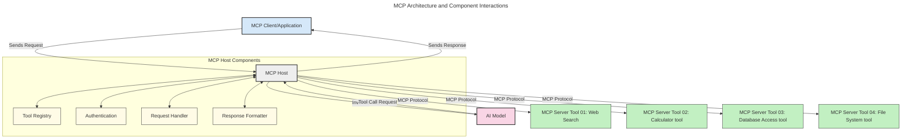
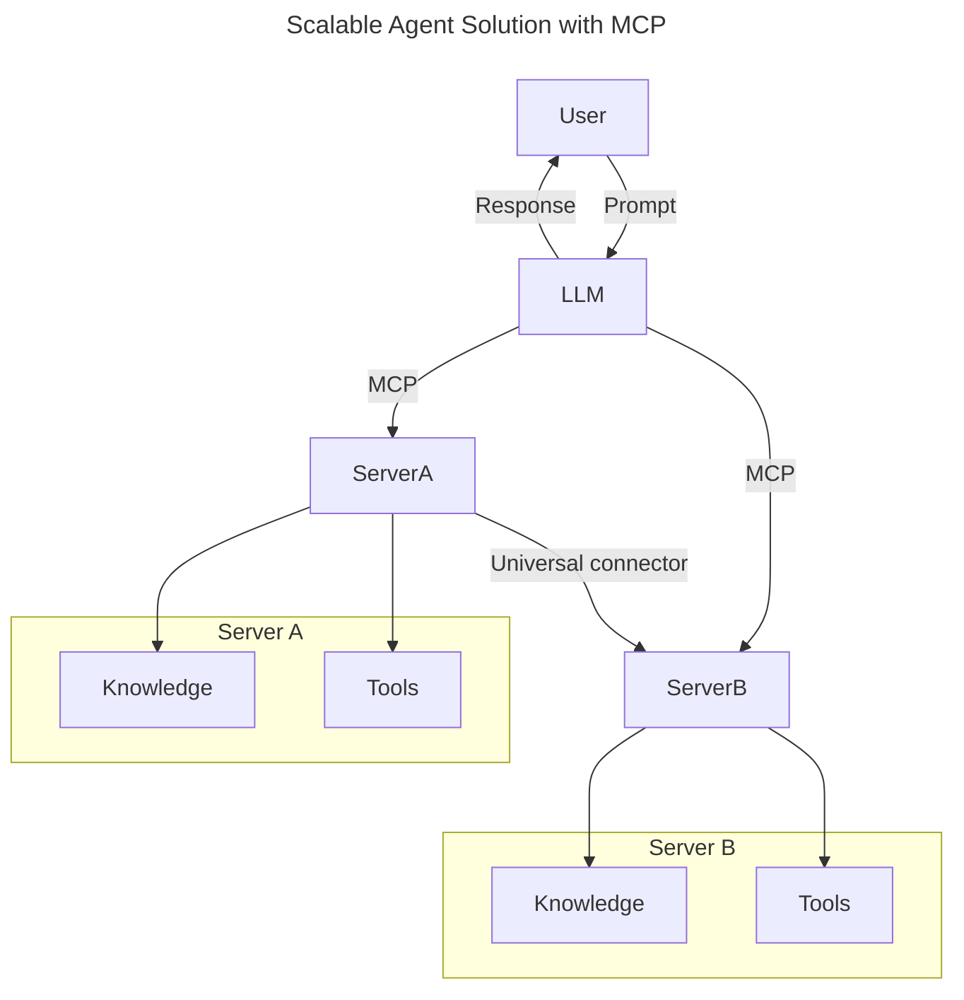
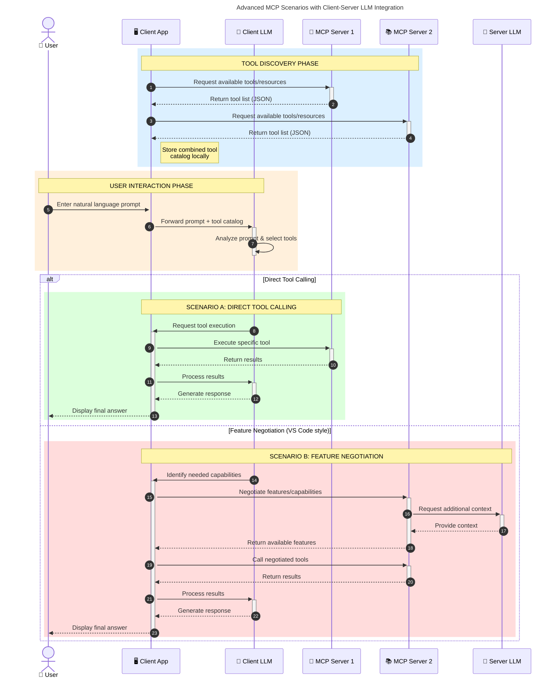

<!--
CO_OP_TRANSLATOR_METADATA:
{
  "original_hash": "9678e0c6945b8e0c23586869b0e26783",
  "translation_date": "2025-10-06T11:02:24+00:00",
  "source_file": "00-Introduction/README.md",
  "language_code": "th"
}
-->
# บทนำสู่ Model Context Protocol (MCP): ทำไมถึงสำคัญสำหรับแอปพลิเคชัน AI ที่ขยายตัวได้

_(คลิกที่ภาพด้านบนเพื่อดูวิดีโอของบทเรียนนี้)_

แอปพลิเคชัน Generative AI เป็นก้าวสำคัญที่ช่วยให้ผู้ใช้สามารถโต้ตอบกับแอปผ่านคำสั่งภาษาธรรมชาติได้อย่างง่ายดาย อย่างไรก็ตาม เมื่อมีการลงทุนเวลาและทรัพยากรมากขึ้นในแอปเหล่านี้ คุณต้องมั่นใจว่าแอปสามารถรวมฟังก์ชันและทรัพยากรต่างๆ ได้อย่างง่ายดายเพื่อให้สามารถขยายตัวได้ แอปของคุณควรรองรับการใช้งานโมเดลมากกว่าหนึ่งตัว และจัดการกับความซับซ้อนของโมเดลต่างๆ ได้ กล่าวคือ การสร้างแอป Gen AI อาจเริ่มต้นได้ง่าย แต่เมื่อแอปเติบโตและซับซ้อนมากขึ้น คุณจำเป็นต้องกำหนดสถาปัตยกรรมและอาจต้องพึ่งพามาตรฐานเพื่อให้แอปของคุณถูกสร้างขึ้นอย่างสม่ำเสมอ นี่คือจุดที่ MCP เข้ามาช่วยจัดระเบียบและให้มาตรฐาน

---

## **🔍 Model Context Protocol (MCP) คืออะไร?**

**Model Context Protocol (MCP)** คือ **อินเทอร์เฟซมาตรฐานแบบเปิด** ที่ช่วยให้ Large Language Models (LLMs) สามารถโต้ตอบกับเครื่องมือภายนอก, APIs และแหล่งข้อมูลได้อย่างไร้รอยต่อ MCP มอบสถาปัตยกรรมที่สม่ำเสมอเพื่อเพิ่มประสิทธิภาพของโมเดล AI ให้เกินกว่าข้อมูลการฝึกอบรม ช่วยให้ระบบ AI ฉลาดขึ้น, ขยายตัวได้ และตอบสนองได้ดีขึ้น

---

## **🎯 ทำไมมาตรฐานใน AI ถึงสำคัญ**

เมื่อแอปพลิเคชัน Generative AI มีความซับซ้อนมากขึ้น การนำมาตรฐานมาใช้เป็นสิ่งสำคัญเพื่อให้มั่นใจว่าแอปสามารถ **ขยายตัว, เพิ่มฟังก์ชัน, บำรุงรักษาได้ง่าย** และ **หลีกเลี่ยงการล็อกอินกับผู้ขายรายเดียว** MCP ตอบสนองความต้องการเหล่านี้โดย:

- รวมการเชื่อมต่อระหว่างโมเดลและเครื่องมือ
- ลดการแก้ปัญหาแบบเฉพาะกิจที่เปราะบาง
- อนุญาตให้โมเดลหลายตัวจากผู้ขายต่างๆ อยู่ร่วมกันในระบบเดียว

**หมายเหตุ:** แม้ว่า MCP จะเรียกตัวเองว่าเป็นมาตรฐานแบบเปิด แต่ยังไม่มีแผนที่จะทำให้ MCP เป็นมาตรฐานผ่านองค์กรมาตรฐานที่มีอยู่ เช่น IEEE, IETF, W3C, ISO หรือองค์กรมาตรฐานอื่นๆ

---

## **📚 วัตถุประสงค์การเรียนรู้**

เมื่ออ่านบทความนี้จบ คุณจะสามารถ:

- อธิบาย **Model Context Protocol (MCP)** และกรณีการใช้งาน
- เข้าใจว่า MCP ช่วยสร้างมาตรฐานการสื่อสารระหว่างโมเดลและเครื่องมืออย่างไร
- ระบุองค์ประกอบหลักของสถาปัตยกรรม MCP
- สำรวจการใช้งาน MCP ในโลกจริงในบริบทขององค์กรและการพัฒนา

---

## **💡 ทำไม Model Context Protocol (MCP) ถึงเป็นตัวเปลี่ยนเกม**

### **🔗 MCP แก้ปัญหาการกระจัดกระจายใน AI**

ก่อน MCP การรวมโมเดลกับเครื่องมือจำเป็นต้อง:

- เขียนโค้ดเฉพาะสำหรับแต่ละคู่เครื่องมือ-โมเดล
- ใช้ API ที่ไม่เป็นมาตรฐานสำหรับแต่ละผู้ขาย
- เกิดปัญหาบ่อยครั้งเมื่อมีการอัปเดต
- ขยายตัวได้ยากเมื่อเพิ่มเครื่องมือ

### **✅ ประโยชน์ของการสร้างมาตรฐาน MCP**

| **ประโยชน์**              | **คำอธิบาย**                                                                |
|--------------------------|--------------------------------------------------------------------------------|
| การทำงานร่วมกัน         | LLMs ทำงานร่วมกับเครื่องมือจากผู้ขายต่างๆ ได้อย่างไร้รอยต่อ                       |
| ความสม่ำเสมอ              | พฤติกรรมที่เป็นมาตรฐานในทุกแพลตฟอร์มและเครื่องมือ                                    |
| การนำกลับมาใช้ใหม่         | เครื่องมือที่สร้างครั้งเดียวสามารถใช้ได้ในหลายโปรเจกต์และระบบ                       |
| การพัฒนาเร็วขึ้น          | ลดเวลาการพัฒนาโดยใช้อินเทอร์เฟซแบบปลั๊กแอนด์เพลย์ที่เป็นมาตรฐาน                |

---

## **🧱 ภาพรวมสถาปัตยกรรม MCP ระดับสูง**

MCP ใช้ **โมเดลไคลเอนต์-เซิร์ฟเวอร์** โดย:

- **MCP Hosts** รันโมเดล AI
- **MCP Clients** เริ่มต้นคำขอ
- **MCP Servers** ให้บริการบริบท, เครื่องมือ และความสามารถ

### **องค์ประกอบสำคัญ:**

- **Resources** – ข้อมูลแบบคงที่หรือแบบไดนามิกสำหรับโมเดล  
- **Prompts** – เวิร์กโฟลว์ที่กำหนดไว้ล่วงหน้าสำหรับการสร้างคำตอบ  
- **Tools** – ฟังก์ชันที่สามารถดำเนินการได้ เช่น การค้นหา, การคำนวณ  
- **Sampling** – พฤติกรรมแบบตัวแทนผ่านการโต้ตอบแบบวนซ้ำ

---

## วิธีการทำงานของ MCP Servers

เซิร์ฟเวอร์ MCP ทำงานดังนี้:

- **กระบวนการคำขอ**:
    1. ผู้ใช้หรือซอฟต์แวร์ที่ทำหน้าที่แทนผู้ใช้เริ่มต้นคำขอ
    2. **MCP Client** ส่งคำขอไปยัง **MCP Host** ซึ่งจัดการการทำงานของโมเดล AI
    3. **AI Model** รับคำสั่งจากผู้ใช้และอาจร้องขอการเข้าถึงเครื่องมือหรือข้อมูลภายนอกผ่านการเรียกใช้เครื่องมือหนึ่งหรือหลายตัว
    4. **MCP Host** ไม่ใช่โมเดลโดยตรง สื่อสารกับ **MCP Server(s)** ที่เหมาะสมโดยใช้โปรโตคอลที่เป็นมาตรฐาน
- **ฟังก์ชันของ MCP Host**:
    - **Tool Registry**: รักษารายการเครื่องมือที่มีอยู่และความสามารถของเครื่องมือ
    - **Authentication**: ตรวจสอบสิทธิ์การเข้าถึงเครื่องมือ
    - **Request Handler**: ประมวลผลคำขอเครื่องมือที่เข้ามาจากโมเดล
    - **Response Formatter**: จัดรูปแบบผลลัพธ์ของเครื่องมือในรูปแบบที่โมเดลสามารถเข้าใจได้
- **การดำเนินการของ MCP Server**:
    - **MCP Host** ส่งคำขอเครื่องมือไปยัง **MCP Server(s)** ซึ่งแต่ละเซิร์ฟเวอร์มีฟังก์ชันเฉพาะ (เช่น การค้นหา, การคำนวณ, การสืบค้นฐานข้อมูล)
    - **MCP Servers** ดำเนินการตามคำขอและส่งผลลัพธ์กลับไปยัง **MCP Host** ในรูปแบบที่สม่ำเสมอ
    - **MCP Host** จัดรูปแบบและส่งผลลัพธ์เหล่านี้ไปยัง **AI Model**
- **การตอบสนองคำขอ**:
    - **AI Model** รวมผลลัพธ์ของเครื่องมือเข้ากับคำตอบสุดท้าย
    - **MCP Host** ส่งคำตอบนี้กลับไปยัง **MCP Client** ซึ่งส่งต่อไปยังผู้ใช้หรือซอฟต์แวร์ที่เรียกใช้

## 👨‍💻 วิธีสร้าง MCP Server (พร้อมตัวอย่าง)

เซิร์ฟเวอร์ MCP ช่วยให้คุณสามารถขยายความสามารถของ LLM โดยการให้ข้อมูลและฟังก์ชัน

พร้อมที่จะลองหรือยัง? นี่คือตัวอย่าง SDK เฉพาะภาษาและ/หรือสแต็กสำหรับการสร้างเซิร์ฟเวอร์ MCP แบบง่ายในภาษาหรือสแต็กต่างๆ:

- **Python SDK**: https://github.com/modelcontextprotocol/python-sdk

- **TypeScript SDK**: https://github.com/modelcontextprotocol/typescript-sdk

- **Java SDK**: https://github.com/modelcontextprotocol/java-sdk

- **C#/.NET SDK**: https://github.com/modelcontextprotocol/csharp-sdk

## 🌍 กรณีการใช้งาน MCP ในโลกจริง

MCP ช่วยให้เกิดแอปพลิเคชันหลากหลายโดยการขยายความสามารถของ AI:

| **แอปพลิเคชัน**              | **คำอธิบาย**                                                                |
|------------------------------|--------------------------------------------------------------------------------|
| การรวมข้อมูลในองค์กร         | เชื่อมต่อ LLMs กับฐานข้อมูล, CRM หรือเครื่องมือภายในองค์กร                             |
| ระบบ AI แบบตัวแทน            | เปิดใช้งานตัวแทนอัตโนมัติที่มีการเข้าถึงเครื่องมือและเวิร์กโฟลว์การตัดสินใจ        |
| แอปพลิเคชันหลายรูปแบบ        | รวมข้อความ, รูปภาพ และเสียงในแอป AI เดียวที่เป็นหนึ่งเดียว                          |
| การรวมข้อมูลแบบเรียลไทม์      | นำข้อมูลสดเข้าสู่การโต้ตอบ AI เพื่อให้ผลลัพธ์ที่แม่นยำและทันสมัยมากขึ้น              |

### 🧠 MCP = มาตรฐานสากลสำหรับการโต้ตอบ AI

Model Context Protocol (MCP) ทำหน้าที่เป็นมาตรฐานสากลสำหรับการโต้ตอบ AI เช่นเดียวกับที่ USB-C สร้างมาตรฐานการเชื่อมต่อทางกายภาพสำหรับอุปกรณ์ ในโลกของ AI MCP มอบอินเทอร์เฟซที่สม่ำเสมอ ช่วยให้โมเดล (ไคลเอนต์) รวมเข้ากับเครื่องมือและผู้ให้บริการข้อมูลภายนอก (เซิร์ฟเวอร์) ได้อย่างไร้รอยต่อ สิ่งนี้ช่วยลดความจำเป็นในการใช้โปรโตคอลเฉพาะสำหรับแต่ละ API หรือแหล่งข้อมูล

ภายใต้ MCP เครื่องมือที่รองรับ MCP (เรียกว่า MCP server) จะปฏิบัติตามมาตรฐานที่เป็นหนึ่งเดียว เซิร์ฟเวอร์เหล่านี้สามารถแสดงรายการเครื่องมือหรือการดำเนินการที่พวกเขาเสนอและดำเนินการตามคำขอเมื่อได้รับการร้องขอจากตัวแทน AI แพลตฟอร์มตัวแทน AI ที่รองรับ MCP สามารถค้นพบเครื่องมือที่มีอยู่จากเซิร์ฟเวอร์และเรียกใช้เครื่องมือเหล่านั้นผ่านโปรโตคอลมาตรฐานนี้

### 💡 อำนวยความสะดวกในการเข้าถึงความรู้

นอกเหนือจากการเสนอเครื่องมือ MCP ยังอำนวยความสะดวกในการเข้าถึงความรู้ โดยช่วยให้แอปพลิเคชันสามารถให้บริบทแก่โมเดลภาษาใหญ่ (LLMs) โดยการเชื่อมโยงกับแหล่งข้อมูลต่างๆ ตัวอย่างเช่น MCP server อาจแสดงถึงคลังเอกสารของบริษัท ช่วยให้ตัวแทนสามารถดึงข้อมูลที่เกี่ยวข้องได้ตามต้องการ เซิร์ฟเวอร์อื่นอาจจัดการการดำเนินการเฉพาะ เช่น การส่งอีเมลหรือการอัปเดตบันทึก จากมุมมองของตัวแทน สิ่งเหล่านี้เป็นเพียงเครื่องมือที่สามารถใช้ได้—บางเครื่องมือส่งคืนข้อมูล (บริบทความรู้) ในขณะที่บางเครื่องมือดำเนินการ MCP จัดการทั้งสองอย่างได้อย่างมีประสิทธิภาพ

ตัวแทนที่เชื่อมต่อกับ MCP server จะเรียนรู้ความสามารถและข้อมูลที่เข้าถึงได้ของเซิร์ฟเวอร์โดยอัตโนมัติผ่านรูปแบบมาตรฐาน การสร้างมาตรฐานนี้ช่วยให้เครื่องมือพร้อมใช้งานแบบไดนามิก ตัวอย่างเช่น การเพิ่ม MCP server ใหม่ในระบบของตัวแทนทำให้ฟังก์ชันของเซิร์ฟเวอร์นั้นสามารถใช้งานได้ทันทีโดยไม่ต้องปรับแต่งคำสั่งของตัวแทนเพิ่มเติม

การรวมเข้าด้วยกันอย่างราบรื่นนี้สอดคล้องกับการไหลที่แสดงในแผนภาพต่อไปนี้ ซึ่งเซิร์ฟเวอร์ให้ทั้งเครื่องมือและความรู้ เพื่อให้เกิดความร่วมมือที่ไร้รอยต่อระหว่างระบบต่างๆ 

### 👉 ตัวอย่าง: โซลูชันตัวแทนที่ขยายตัวได้

Universal Connector ช่วยให้ MCP servers สามารถสื่อสารและแบ่งปันความสามารถระหว่างกันได้ โดยอนุญาตให้ ServerA มอบหมายงานให้ ServerB หรือเข้าถึงเครื่องมือและความรู้ของ ServerB สิ่งนี้ช่วยให้เกิดการรวมเครื่องมือและข้อมูลระหว่างเซิร์ฟเวอร์ สนับสนุนสถาปัตยกรรมตัวแทนที่ขยายตัวและเป็นโมดูล เพราะ MCP สร้างมาตรฐานการเปิดเผยเครื่องมือ ตัวแทนสามารถค้นพบและกำหนดเส้นทางคำขอระหว่างเซิร์ฟเวอร์ได้แบบไดนามิกโดยไม่ต้องมีการรวมแบบฮาร์ดโค้ด

การรวมเครื่องมือและความรู้: เครื่องมือและข้อมูลสามารถเข้าถึงได้ระหว่างเซิร์ฟเวอร์ ช่วยให้เกิดสถาปัตยกรรมตัวแทนที่ขยายตัวและเป็นโมดูลมากขึ้น

### 🔄 สถานการณ์ MCP ขั้นสูงกับการรวม LLM ฝั่งไคลเอนต์

นอกเหนือจากสถาปัตยกรรม MCP พื้นฐาน ยังมีสถานการณ์ขั้นสูงที่ทั้งไคลเอนต์และเซิร์ฟเวอร์มี LLMs ซึ่งช่วยให้เกิดการโต้ตอบที่ซับซ้อนมากขึ้น ในแผนภาพต่อไปนี้ **Client App** อาจเป็น IDE ที่มีเครื่องมือ MCP จำนวนหนึ่งพร้อมใช้งานสำหรับ LLM:

## 🔐 ประโยชน์เชิงปฏิบัติของ MCP

นี่คือประโยชน์เชิงปฏิบัติของการใช้ MCP:

- **ความสดใหม่**: โมเดลสามารถเข้าถึงข้อมูลที่ทันสมัยเกินกว่าข้อมูลการฝึกอบรม
- **การขยายความสามารถ**: โมเดลสามารถใช้เครื่องมือเฉพาะสำหรับงานที่ไม่ได้รับการฝึกอบรม
- **ลดการสร้างข้อมูลผิดพลาด**: แหล่งข้อมูลภายนอกให้การยึดโยงกับข้อเท็จจริง
- **ความเป็นส่วนตัว**: ข้อมูลที่ละเอียดอ่อนสามารถอยู่ในสภาพแวดล้อมที่ปลอดภัยแทนที่จะถูกฝังในคำสั่ง

## 📌 ประเด็นสำคัญ

ประเด็นสำคัญสำหรับการใช้ MCP มีดังนี้:

- **MCP** สร้างมาตรฐานวิธีที่โมเดล AI โต้ตอบกับเครื่องมือและข้อมูล
- ส่งเสริม **การขยายตัว, ความสม่ำเสมอ และการทำงานร่วมกัน**
- MCP ช่วย **ลดเวลาการพัฒนา, เพิ่มความน่าเชื่อถือ และขยายความสามารถของโมเดล**
- สถาปัตยกรรมไคลเอนต์-เซิร์ฟเวอร์ **ช่วยให้แอปพลิเคชัน AI มีความยืดหยุ่นและขยายตัวได้**

## 🧠 แบบฝึกหัด

ลองคิดถึงแอปพลิเคชัน AI ที่คุณสนใจจะสร้าง

- เครื่องมือหรือข้อมูล **ภายนอก** ใดที่สามารถเพิ่มความสามารถของแอปพลิเคชันได้?
- MCP จะช่วยให้การรวม **ง่ายขึ้นและน่าเชื่อถือมากขึ้น** ได้อย่างไร?

## แหล่งข้อมูลเพิ่มเติม

- [MCP GitHub Repository](https://github.com/modelcontextprotocol)

## สิ่งที่จะเกิดขึ้นต่อไป

ถัดไป: [บทที่ 1: แนวคิดหลัก](../01-CoreConcepts/README.md)

---

**ข้อจำกัดความรับผิดชอบ**:  
เอกสารนี้ได้รับการแปลโดยใช้บริการแปลภาษา AI [Co-op Translator](https://github.com/Azure/co-op-translator) แม้ว่าเราจะพยายามให้การแปลมีความถูกต้องมากที่สุด แต่โปรดทราบว่าการแปลอัตโนมัติอาจมีข้อผิดพลาดหรือความไม่ถูกต้อง เอกสารต้นฉบับในภาษาดั้งเดิมควรถือเป็นแหล่งข้อมูลที่เชื่อถือได้ สำหรับข้อมูลที่สำคัญ ขอแนะนำให้ใช้บริการแปลภาษามนุษย์ที่มีความเชี่ยวชาญ เราไม่รับผิดชอบต่อความเข้าใจผิดหรือการตีความผิดที่เกิดจากการใช้การแปลนี้