<!--
CO_OP_TRANSLATOR_METADATA:
{
  "original_hash": "9678e0c6945b8e0c23586869b0e26783",
  "translation_date": "2025-10-06T11:02:24+00:00",
  "source_file": "00-Introduction/README.md",
  "language_code": "th"
}
-->
# บทนำสู่ Model Context Protocol (MCP): ทำไมถึงสำคัญสำหรับแอปพลิเคชัน AI ที่ขยายตัวได้

_(คลิกที่ภาพด้านบนเพื่อดูวิดีโอของบทเรียนนี้)_

แอปพลิเคชัน Generative AI เป็นก้าวสำคัญที่ช่วยให้ผู้ใช้สามารถโต้ตอบกับแอปผ่านคำสั่งภาษาธรรมชาติได้อย่างง่ายดาย อย่างไรก็ตาม เมื่อมีการลงทุนเวลาและทรัพยากรมากขึ้นในแอปเหล่านี้ คุณต้องมั่นใจว่าแอปสามารถรวมฟังก์ชันและทรัพยากรต่างๆ ได้อย่างง่ายดายเพื่อให้สามารถขยายตัวได้ แอปของคุณควรรองรับการใช้งานโมเดลมากกว่าหนึ่งตัว และจัดการกับความซับซ้อนของโมเดลต่างๆ ได้ กล่าวคือ การสร้างแอป Gen AI อาจเริ่มต้นได้ง่าย แต่เมื่อแอปเติบโตและซับซ้อนมากขึ้น คุณจำเป็นต้องกำหนดสถาปัตยกรรมและอาจต้องพึ่งพามาตรฐานเพื่อให้แอปของคุณถูกสร้างขึ้นอย่างสม่ำเสมอ นี่คือจุดที่ MCP เข้ามาช่วยจัดระเบียบและให้มาตรฐาน

---

## **🔍 Model Context Protocol (MCP) คืออะไร?**

**Model Context Protocol (MCP)** คือ **อินเทอร์เฟซมาตรฐานแบบเปิด** ที่ช่วยให้ Large Language Models (LLMs) สามารถโต้ตอบกับเครื่องมือภายนอก, APIs และแหล่งข้อมูลได้อย่างไร้รอยต่อ MCP มอบสถาปัตยกรรมที่สม่ำเสมอเพื่อเพิ่มประสิทธิภาพของโมเดล AI ให้เกินกว่าข้อมูลการฝึกอบรม ช่วยให้ระบบ AI ฉลาดขึ้น, ขยายตัวได้ และตอบสนองได้ดีขึ้น

---

## **🎯 ทำไมมาตรฐานใน AI ถึงสำคัญ**

เมื่อแอปพลิเคชัน Generative AI มีความซับซ้อนมากขึ้น การนำมาตรฐานมาใช้เป็นสิ่งสำคัญเพื่อให้มั่นใจว่าแอปสามารถ **ขยายตัว, เพิ่มฟังก์ชัน, บำรุงรักษาได้ง่าย** และ **หลีกเลี่ยงการล็อกอินกับผู้ขายรายเดียว** MCP ตอบสนองความต้องการเหล่านี้โดย:

- รวมการเชื่อมต่อระหว่างโมเดลและเครื่องมือ
- ลดการแก้ปัญหาแบบเฉพาะกิจที่เปราะบาง
- อนุญาตให้โมเดลหลายตัวจากผู้ขายต่างๆ อยู่ร่วมกันในระบบเดียว

**หมายเหตุ:** แม้ว่า MCP จะเรียกตัวเองว่าเป็นมาตรฐานแบบเปิด แต่ยังไม่มีแผนที่จะทำให้ MCP เป็นมาตรฐานผ่านองค์กรมาตรฐานที่มีอยู่ เช่น IEEE, IETF, W3C, ISO หรือองค์กรมาตรฐานอื่นๆ

---

## **📚 วัตถุประสงค์การเรียนรู้**

เมื่ออ่านบทความนี้จบ คุณจะสามารถ:

- อธิบาย **Model Context Protocol (MCP)** และกรณีการใช้งาน
- เข้าใจว่า MCP ช่วยสร้างมาตรฐานการสื่อสารระหว่างโมเดลและเครื่องมืออย่างไร
- ระบุองค์ประกอบหลักของสถาปัตยกรรม MCP
- สำรวจการใช้งาน MCP ในโลกจริงในบริบทขององค์กรและการพัฒนา

---

## **💡 ทำไม Model Context Protocol (MCP) ถึงเป็นตัวเปลี่ยนเกม**

### **🔗 MCP แก้ปัญหาการกระจัดกระจายใน AI**

ก่อน MCP การรวมโมเดลกับเครื่องมือจำเป็นต้อง:

- เขียนโค้ดเฉพาะสำหรับแต่ละคู่เครื่องมือ-โมเดล
- ใช้ API ที่ไม่เป็นมาตรฐานสำหรับแต่ละผู้ขาย
- เกิดปัญหาบ่อยครั้งเมื่อมีการอัปเดต
- ขยายตัวได้ยากเมื่อเพิ่มเครื่องมือ

### **✅ ประโยชน์ของการสร้างมาตรฐาน MCP**

| **ประโยชน์**              | **คำอธิบาย**                                                                |
|--------------------------|--------------------------------------------------------------------------------|
| การทำงานร่วมกัน         | LLMs ทำงานร่วมกับเครื่องมือจากผู้ขายต่างๆ ได้อย่างไร้รอยต่อ                       |
| ความสม่ำเสมอ              | พฤติกรรมที่เป็นมาตรฐานในทุกแพลตฟอร์มและเครื่องมือ                                    |
| การนำกลับมาใช้ใหม่         | เครื่องมือที่สร้างครั้งเดียวสามารถใช้ได้ในหลายโปรเจกต์และระบบ                       |
| การพัฒนาเร็วขึ้น          | ลดเวลาการพัฒนาโดยใช้อินเทอร์เฟซแบบปลั๊กแอนด์เพลย์ที่เป็นมาตรฐาน                |

---

## **🧱 ภาพรวมสถาปัตยกรรม MCP ระดับสูง**

MCP ใช้ **โมเดลไคลเอนต์-เซิร์ฟเวอร์** โดย:

- **MCP Hosts** รันโมเดล AI
- **MCP Clients** เริ่มต้นคำขอ
- **MCP Servers** ให้บริการบริบท, เครื่องมือ และความสามารถ

### **องค์ประกอบสำคัญ:**

- **Resources** – ข้อมูลแบบคงที่หรือแบบไดนามิกสำหรับโมเดล  
- **Prompts** – เวิร์กโฟลว์ที่กำหนดไว้ล่วงหน้าสำหรับการสร้างคำตอบ  
- **Tools** – ฟังก์ชันที่สามารถดำเนินการได้ เช่น การค้นหา, การคำนวณ  
- **Sampling** – พฤติกรรมแบบตัวแทนผ่านการโต้ตอบแบบวนซ้ำ

---

## วิธีการทำงานของ MCP Servers

เซิร์ฟเวอร์ MCP ทำงานดังนี้:

- **กระบวนการคำขอ**:
    1. ผู้ใช้หรือซอฟต์แวร์ที่ทำหน้าที่แทนผู้ใช้เริ่มต้นคำขอ
    2. **MCP Client** ส่งคำขอไปยัง **MCP Host** ซึ่งจัดการการทำงานของโมเดล AI
    3. **AI Model** รับคำสั่งจากผู้ใช้และอาจร้องขอการเข้าถึงเครื่องมือหรือข้อมูลภายนอกผ่านการเรียกใช้เครื่องมือหนึ่งหรือหลายตัว
    4. **MCP Host** ไม่ใช่โมเดลโดยตรง สื่อสารกับ **MCP Server(s)** ที่เหมาะสมโดยใช้โปรโตคอลที่เป็นมาตรฐาน
- **ฟังก์ชันของ MCP Host**:
    - **Tool Registry**: รักษารายการเครื่องมือที่มีอยู่และความสามารถของเครื่องมือ
    - **Authentication**: ตรวจสอบสิทธิ์การเข้าถึงเครื่องมือ
    - **Request Handler**: ประมวลผลคำขอเครื่องมือที่เข้ามาจากโมเดล
    - **Response Formatter**: จัดรูปแบบผลลัพธ์ของเครื่องมือในรูปแบบที่โมเดลสามารถเข้าใจได้
- **การดำเนินการของ MCP Server**:
    - **MCP Host** ส่งคำขอเครื่องมือไปยัง **MCP Server(s)** ซึ่งแต่ละเซิร์ฟเวอร์มีฟังก์ชันเฉพาะ (เช่น การค้นหา, การคำนวณ, การสืบค้นฐานข้อมูล)
    - **MCP Servers** ดำเนินการตามคำขอและส่งผลลัพธ์กลับไปยัง **MCP Host** ในรูปแบบที่สม่ำเสมอ
    - **MCP Host** จัดรูปแบบและส่งผลลัพธ์เหล่านี้ไปยัง **AI Model**
- **การตอบสนองคำขอ**:
    - **AI Model** รวมผลลัพธ์ของเครื่องมือเข้ากับคำตอบสุดท้าย
    - **MCP Host** ส่งคำตอบนี้กลับไปยัง **MCP Client** ซึ่งส่งต่อไปยังผู้ใช้หรือซอฟต์แวร์ที่เรียกใช้

## 👨‍💻 วิธีสร้าง MCP Server (พร้อมตัวอย่าง)

เซิร์ฟเวอร์ MCP ช่วยให้คุณสามารถขยายความสามารถของ LLM โดยการให้ข้อมูลและฟังก์ชัน

พร้อมที่จะลองหรือยัง? นี่คือตัวอย่าง SDK เฉพาะภาษาและ/หรือสแต็กสำหรับการสร้างเซิร์ฟเวอร์ MCP แบบง่ายในภาษาหรือสแต็กต่างๆ:

- **Python SDK**: https://github.com/modelcontextprotocol/python-sdk

- **TypeScript SDK**: https://github.com/modelcontextprotocol/typescript-sdk

- **Java SDK**: https://github.com/modelcontextprotocol/java-sdk

- **C#/.NET SDK**: https://github.com/modelcontextprotocol/csharp-sdk

## 🌍 กรณีการใช้งาน MCP ในโลกจริง

MCP ช่วยให้เกิดแอปพลิเคชันหลากหลายโดยการขยายความสามารถของ AI:

| **แอปพลิเคชัน**              | **คำอธิบาย**                                                                |
|------------------------------|--------------------------------------------------------------------------------|
| การรวมข้อมูลในองค์กร         | เชื่อมต่อ LLMs กับฐานข้อมูล, CRM หรือเครื่องมือภายในองค์กร                             |
| ระบบ AI แบบตัวแทน            | เปิดใช้งานตัวแทนอัตโนมัติที่มีการเข้าถึงเครื่องมือและเวิร์กโฟลว์การตัดสินใจ        |
| แอปพลิเคชันหลายรูปแบบ        | รวมข้อความ, รูปภาพ และเสียงในแอป AI เดียวที่เป็นหนึ่งเดียว                          |
| การรวมข้อมูลแบบเรียลไทม์      | นำข้อมูลสดเข้าสู่การโต้ตอบ AI เพื่อให้ผลลัพธ์ที่แม่นยำและทันสมัยมากขึ้น              |

### 🧠 MCP = มาตรฐานสากลสำหรับการโต้ตอบ AI

Model Context Protocol (MCP) ทำหน้าที่เป็นมาตรฐานสากลสำหรับการโต้ตอบ AI เช่นเดียวกับที่ USB-C สร้างมาตรฐานการเชื่อมต่อทางกายภาพสำหรับอุปกรณ์ ในโลกของ AI MCP มอบอินเทอร์เฟซที่สม่ำเสมอ ช่วยให้โมเดล (ไคลเอนต์) รวมเข้ากับเครื่องมือและผู้ให้บริการข้อมูลภายนอก (เซิร์ฟเวอร์) ได้อย่างไร้รอยต่อ สิ่งนี้ช่วยลดความจำเป็นในการใช้โปรโตคอลเฉพาะสำหรับแต่ละ API หรือแหล่งข้อมูล

ภายใต้ MCP เครื่องมือที่รองรับ MCP (เรียกว่า MCP server) จะปฏิบัติตามมาตรฐานที่เป็นหนึ่งเดียว เซิร์ฟเวอร์เหล่านี้สามารถแสดงรายการเครื่องมือหรือการดำเนินการที่พวกเขาเสนอและดำเนินการตามคำขอเมื่อได้รับการร้องขอจากตัวแทน AI แพลตฟอร์มตัวแทน AI ที่รองรับ MCP สามารถค้นพบเครื่องมือที่มีอยู่จากเซิร์ฟเวอร์และเรียกใช้เครื่องมือเหล่านั้นผ่านโปรโตคอลมาตรฐานนี้

### 💡 อำนวยความสะดวกในการเข้าถึงความรู้

นอกเหนือจากการเสนอเครื่องมือ MCP ยังอำนวยความสะดวกในการเข้าถึงความรู้ โดยช่วยให้แอปพลิเคชันสามารถให้บริบทแก่โมเดลภาษาใหญ่ (LLMs) โดยการเชื่อมโยงกับแหล่งข้อมูลต่างๆ ตัวอย่างเช่น MCP server อาจแสดงถึงคลังเอกสารของบริษัท ช่วยให้ตัวแทนสามารถดึงข้อมูลที่เกี่ยวข้องได้ตามต้องการ เซิร์ฟเวอร์อื่นอาจจัดการการดำเนินการเฉพาะ เช่น การส่งอีเมลหรือการอัปเดตบันทึก จากมุมมองของตัวแทน สิ่งเหล่านี้เป็นเพียงเครื่องมือที่สามารถใช้ได้—บางเครื่องมือส่งคืนข้อมูล (บริบทความรู้) ในขณะที่บางเครื่องมือดำเนินการ MCP จัดการทั้งสองอย่างได้อย่างมีประสิทธิภาพ

ตัวแทนที่เชื่อมต่อกับ MCP server จะเรียนรู้ความสามารถและข้อมูลที่เข้าถึงได้ของเซิร์ฟเวอร์โดยอัตโนมัติผ่านรูปแบบมาตรฐาน การสร้างมาตรฐานนี้ช่วยให้เครื่องมือพร้อมใช้งานแบบไดนามิก ตัวอย่างเช่น การเพิ่ม MCP server ใหม่ในระบบของตัวแทนทำให้ฟังก์ชันของเซิร์ฟเวอร์นั้นสามารถใช้งานได้ทันทีโดยไม่ต้องปรับแต่งคำสั่งของตัวแทนเพิ่มเติม

การรวมเข้าด้วยกันอย่างราบรื่นนี้สอดคล้องกับการไหลที่แสดงในแผนภาพต่อไปนี้ ซึ่งเซิร์ฟเวอร์ให้ทั้งเครื่องมือและความรู้ เพื่อให้เกิดความร่วมมือที่ไร้รอยต่อระหว่างระบบต่างๆ 

### 👉 ตัวอย่าง: โซลูชันตัวแทนที่ขยายตัวได้

Universal Connector ช่วยให้ MCP servers สามารถสื่อสารและแบ่งปันความสามารถระหว่างกันได้ โดยอนุญาตให้ ServerA มอบหมายงานให้ ServerB หรือเข้าถึงเครื่องมือและความรู้ของ ServerB สิ่งนี้ช่วยให้เกิดการรวมเครื่องมือและข้อมูลระหว่างเซิร์ฟเวอร์ สนับสนุนสถาปัตยกรรมตัวแทนที่ขยายตัวและเป็นโมดูล เพราะ MCP สร้างมาตรฐานการเปิดเผยเครื่องมือ ตัวแทนสามารถค้นพบและกำหนดเส้นทางคำขอระหว่างเซิร์ฟเวอร์ได้แบบไดนามิกโดยไม่ต้องมีการรวมแบบฮาร์ดโค้ด

การรวมเครื่องมือและความรู้: เครื่องมือและข้อมูลสามารถเข้าถึงได้ระหว่างเซิร์ฟเวอร์ ช่วยให้เกิดสถาปัตยกรรมตัวแทนที่ขยายตัวและเป็นโมดูลมากขึ้น

### 🔄 สถานการณ์ MCP ขั้นสูงกับการรวม LLM ฝั่งไคลเอนต์

นอกเหนือจากสถาปัตยกรรม MCP พื้นฐาน ยังมีสถานการณ์ขั้นสูงที่ทั้งไคลเอนต์และเซิร์ฟเวอร์มี LLMs ซึ่งช่วยให้เกิดการโต้ตอบที่ซับซ้อนมากขึ้น ในแผนภาพต่อไปนี้ **Client App** อาจเป็น IDE ที่มีเครื่องมือ MCP จำนวนหนึ่งพร้อมใช้งานสำหรับ LLM:

```mermaid
---
title: Advanced MCP Scenarios with Client-Server LLM Integration
description: A sequence diagram showing the detailed interaction flow between user, client application, client LLM, multiple MCP servers, and server LLM, illustrating tool discovery, user interaction, direct tool calling, and feature negotiation phases
---
sequenceDiagram
    autonumber
    actor User as 👤 User
    participant ClientApp as 🖥️ Client App
    participant ClientLLM as 🧠 Client LLM
    participant Server1 as 🔧 MCP Server 1
    participant Server2 as 📚 MCP Server 2
    participant ServerLLM as 🤖 Server LLM
    
    %% Discovery Phase
    rect rgb(220, 240, 255)
        Note over ClientApp, Server2: TOOL DISCOVERY PHASE
        ClientApp->>+Server1: Request available tools/resources
        Server1-->>-ClientApp: Return tool list (JSON)
        ClientApp->>+Server2: Request available tools/resources
        Server2-->>-ClientApp: Return tool list (JSON)
        Note right of ClientApp: Store combined tool<br/>catalog locally
    end
    
    %% User Interaction
    rect rgb(255, 240, 220)
        Note over User, ClientLLM: USER INTERACTION PHASE
        User->>+ClientApp: Enter natural language prompt
        ClientApp->>+ClientLLM: Forward prompt + tool catalog
        ClientLLM->>-ClientLLM: Analyze prompt & select tools
    end
    
    %% Scenario A: Direct Tool Calling
    alt Direct Tool Calling
        rect rgb(220, 255, 220)
            Note over ClientApp, Server1: SCENARIO A: DIRECT TOOL CALLING
            ClientLLM->>+ClientApp: Request tool execution
            ClientApp->>+Server1: Execute specific tool
            Server1-->>-ClientApp: Return results
            ClientApp->>+ClientLLM: Process results
            ClientLLM-->>-ClientApp: Generate response
            ClientApp-->>-User: Display final answer
        end
    
    %% Scenario B: Feature Negotiation (VS Code style)
    else Feature Negotiation (VS Code style)
        rect rgb(255, 220, 220)
            Note over ClientApp, ServerLLM: SCENARIO B: FEATURE NEGOTIATION
            ClientLLM->>+ClientApp: Identify needed capabilities
            ClientApp->>+Server2: Negotiate features/capabilities
            Server2->>+ServerLLM: Request additional context
            ServerLLM-->>-Server2: Provide context
            Server2-->>-ClientApp: Return available features
            ClientApp->>+Server2: Call negotiated tools
            Server2-->>-ClientApp: Return results
            ClientApp->>+ClientLLM: Process results
            ClientLLM-->>-ClientApp: Generate response
            ClientApp-->>-User: Display final answer
        end
    end
```

## 🔐 ประโยชน์เชิงปฏิบัติของ MCP

นี่คือประโยชน์เชิงปฏิบัติของการใช้ MCP:

- **ความสดใหม่**: โมเดลสามารถเข้าถึงข้อมูลที่ทันสมัยเกินกว่าข้อมูลการฝึกอบรม
- **การขยายความสามารถ**: โมเดลสามารถใช้เครื่องมือเฉพาะสำหรับงานที่ไม่ได้รับการฝึกอบรม
- **ลดการสร้างข้อมูลผิดพลาด**: แหล่งข้อมูลภายนอกให้การยึดโยงกับข้อเท็จจริง
- **ความเป็นส่วนตัว**: ข้อมูลที่ละเอียดอ่อนสามารถอยู่ในสภาพแวดล้อมที่ปลอดภัยแทนที่จะถูกฝังในคำสั่ง

## 📌 ประเด็นสำคัญ

ประเด็นสำคัญสำหรับการใช้ MCP มีดังนี้:

- **MCP** สร้างมาตรฐานวิธีที่โมเดล AI โต้ตอบกับเครื่องมือและข้อมูล
- ส่งเสริม **การขยายตัว, ความสม่ำเสมอ และการทำงานร่วมกัน**
- MCP ช่วย **ลดเวลาการพัฒนา, เพิ่มความน่าเชื่อถือ และขยายความสามารถของโมเดล**
- สถาปัตยกรรมไคลเอนต์-เซิร์ฟเวอร์ **ช่วยให้แอปพลิเคชัน AI มีความยืดหยุ่นและขยายตัวได้**

## 🧠 แบบฝึกหัด

ลองคิดถึงแอปพลิเคชัน AI ที่คุณสนใจจะสร้าง

- เครื่องมือหรือข้อมูล **ภายนอก** ใดที่สามารถเพิ่มความสามารถของแอปพลิเคชันได้?
- MCP จะช่วยให้การรวม **ง่ายขึ้นและน่าเชื่อถือมากขึ้น** ได้อย่างไร?

## แหล่งข้อมูลเพิ่มเติม

- [MCP GitHub Repository](https://github.com/modelcontextprotocol)

## สิ่งที่จะเกิดขึ้นต่อไป

ถัดไป: [บทที่ 1: แนวคิดหลัก](../01-CoreConcepts/README.md)

---

**ข้อจำกัดความรับผิดชอบ**:  
เอกสารนี้ได้รับการแปลโดยใช้บริการแปลภาษา AI [Co-op Translator](https://github.com/Azure/co-op-translator) แม้ว่าเราจะพยายามให้การแปลมีความถูกต้องมากที่สุด แต่โปรดทราบว่าการแปลอัตโนมัติอาจมีข้อผิดพลาดหรือความไม่ถูกต้อง เอกสารต้นฉบับในภาษาดั้งเดิมควรถือเป็นแหล่งข้อมูลที่เชื่อถือได้ สำหรับข้อมูลที่สำคัญ ขอแนะนำให้ใช้บริการแปลภาษามนุษย์ที่มีความเชี่ยวชาญ เราไม่รับผิดชอบต่อความเข้าใจผิดหรือการตีความผิดที่เกิดจากการใช้การแปลนี้