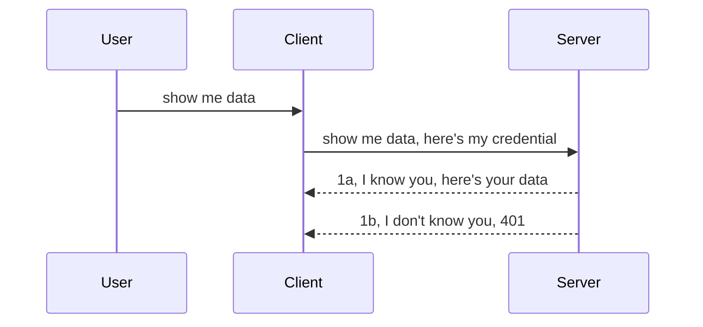

<!--
CO_OP_TRANSLATOR_METADATA:
{
  "original_hash": "5b00b8a8971a07d2d8803be4c9f138f8",
  "translation_date": "2025-10-07T00:51:25+00:00",
  "source_file": "03-GettingStarted/11-simple-auth/README.md",
  "language_code": "th"
}
-->
# การยืนยันตัวตนแบบง่าย

MCP SDKs รองรับการใช้งาน OAuth 2.1 ซึ่งเป็นกระบวนการที่ค่อนข้างซับซ้อน โดยเกี่ยวข้องกับแนวคิดต่างๆ เช่น เซิร์ฟเวอร์ยืนยันตัวตน เซิร์ฟเวอร์ทรัพยากร การส่งข้อมูลรับรอง การรับโค้ด การแลกเปลี่ยนโค้ดเพื่อรับโทเค็นแบบ Bearer จนกระทั่งคุณสามารถเข้าถึงข้อมูลทรัพยากรของคุณได้ หากคุณไม่คุ้นเคยกับ OAuth ซึ่งเป็นสิ่งที่ดีในการนำไปใช้ การเริ่มต้นด้วยการยืนยันตัวตนแบบพื้นฐานและค่อยๆ พัฒนาไปสู่ความปลอดภัยที่ดียิ่งขึ้นเป็นความคิดที่ดี นั่นคือเหตุผลที่บทนี้มีอยู่ เพื่อช่วยให้คุณพัฒนาสู่การยืนยันตัวตนที่ซับซ้อนมากขึ้น

## การยืนยันตัวตน หมายถึงอะไร?

การยืนยันตัวตน (Auth) เป็นคำย่อของ Authentication และ Authorization แนวคิดคือเราต้องทำสองสิ่ง:

- **Authentication** คือกระบวนการตรวจสอบว่าเราจะอนุญาตให้บุคคลเข้ามาในบ้านของเราหรือไม่ ว่าพวกเขามีสิทธิ์ที่จะ "อยู่ที่นี่" หรือไม่ ซึ่งหมายถึงการเข้าถึงเซิร์ฟเวอร์ทรัพยากรของเราที่มีฟีเจอร์ MCP Server อยู่
- **Authorization** คือกระบวนการตรวจสอบว่าผู้ใช้ควรมีสิทธิ์เข้าถึงทรัพยากรเฉพาะที่พวกเขาร้องขอหรือไม่ เช่น คำสั่งซื้อหรือผลิตภัณฑ์เหล่านี้ หรือว่าพวกเขาได้รับอนุญาตให้อ่านเนื้อหาแต่ไม่สามารถลบได้ เป็นต้น

## ข้อมูลรับรอง: วิธีที่เราบอกระบบว่าเราเป็นใคร

นักพัฒนาเว็บส่วนใหญ่เริ่มคิดในแง่ของการให้ข้อมูลรับรองแก่เซิร์ฟเวอร์ โดยปกติจะเป็นความลับที่บอกว่าพวกเขาได้รับอนุญาตให้ "อยู่ที่นี่" หรือไม่ ซึ่งก็คือ "Authentication" ข้อมูลรับรองนี้มักจะเป็นเวอร์ชันที่เข้ารหัสแบบ base64 ของชื่อผู้ใช้และรหัสผ่าน หรือคีย์ API ที่ระบุผู้ใช้เฉพาะอย่างชัดเจน

สิ่งนี้เกี่ยวข้องกับการส่งข้อมูลผ่านส่วนหัวที่เรียกว่า "Authorization" ดังนี้:

```json
{ "Authorization": "secret123" }
```

สิ่งนี้มักเรียกว่าการยืนยันตัวตนแบบพื้นฐาน (Basic Authentication) วิธีการทำงานโดยรวมมีดังนี้:



เมื่อเราเข้าใจวิธีการทำงานจากมุมมองของกระบวนการแล้ว เราจะนำไปใช้ได้อย่างไร? เซิร์ฟเวอร์เว็บส่วนใหญ่มีแนวคิดที่เรียกว่า middleware ซึ่งเป็นโค้ดที่ทำงานเป็นส่วนหนึ่งของคำขอที่สามารถตรวจสอบข้อมูลรับรอง และหากข้อมูลรับรองถูกต้องก็จะอนุญาตให้คำขอผ่านไปได้ หากคำขอไม่มีข้อมูลรับรองที่ถูกต้อง คุณจะได้รับข้อผิดพลาดเกี่ยวกับการยืนยันตัวตน ลองดูวิธีการนำไปใช้:

**Python**

```python
class AuthMiddleware(BaseHTTPMiddleware):
    async def dispatch(self, request, call_next):

        has_header = request.headers.get("Authorization")
        if not has_header:
            print("-> Missing Authorization header!")
            return Response(status_code=401, content="Unauthorized")

        if not valid_token(has_header):
            print("-> Invalid token!")
            return Response(status_code=403, content="Forbidden")

        print("Valid token, proceeding...")
       
        response = await call_next(request)
        # add any customer headers or change in the response in some way
        return response


starlette_app.add_middleware(CustomHeaderMiddleware)
```

ในที่นี้เราได้:

- สร้าง middleware ที่ชื่อ `AuthMiddleware` ซึ่งเมธอด `dispatch` ของมันจะถูกเรียกใช้โดยเซิร์ฟเวอร์เว็บ
- เพิ่ม middleware ลงในเซิร์ฟเวอร์เว็บ:

    ```python
    starlette_app.add_middleware(AuthMiddleware)
    ```

- เขียนตรรกะการตรวจสอบที่ตรวจสอบว่ามีส่วนหัว Authorization อยู่หรือไม่ และความลับที่ส่งมานั้นถูกต้องหรือไม่:

    ```python
    has_header = request.headers.get("Authorization")
    if not has_header:
        print("-> Missing Authorization header!")
        return Response(status_code=401, content="Unauthorized")

    if not valid_token(has_header):
        print("-> Invalid token!")
        return Response(status_code=403, content="Forbidden")
    ```

    หากความลับนั้นมีอยู่และถูกต้อง เราจะอนุญาตให้คำขอผ่านไปโดยเรียก `call_next` และส่งคืนการตอบกลับ

    ```python
    response = await call_next(request)
    # add any customer headers or change in the response in some way
    return response
    ```

วิธีการทำงานคือ หากมีคำขอเว็บที่ส่งมายังเซิร์ฟเวอร์ middleware จะถูกเรียกใช้ และด้วยการนำไปใช้ของมัน คำขอจะถูกอนุญาตให้ผ่านไปหรือส่งคืนข้อผิดพลาดที่ระบุว่าลูกค้าไม่ได้รับอนุญาตให้ดำเนินการต่อ

**TypeScript**

ในที่นี้เราสร้าง middleware ด้วยเฟรมเวิร์กยอดนิยมอย่าง Express และสกัดกั้นคำขอก่อนที่จะถึง MCP Server นี่คือโค้ดสำหรับสิ่งนั้น:

```typescript
function isValid(secret) {
    return secret === "secret123";
}

app.use((req, res, next) => {
    // 1. Authorization header present?  
    if(!req.headers["Authorization"]) {
        res.status(401).send('Unauthorized');
    }
    
    let token = req.headers["Authorization"];

    // 2. Check validity.
    if(!isValid(token)) {
        res.status(403).send('Forbidden');
    }

   
    console.log('Middleware executed');
    // 3. Passes request to the next step in the request pipeline.
    next();
});
```

ในโค้ดนี้เรา:

1. ตรวจสอบว่ามีส่วนหัว Authorization อยู่หรือไม่ หากไม่มี เราส่งข้อผิดพลาด 401
2. ตรวจสอบให้แน่ใจว่าข้อมูลรับรอง/โทเค็นนั้นถูกต้อง หากไม่ถูกต้อง เราส่งข้อผิดพลาด 403
3. สุดท้ายส่งคำขอไปยัง pipeline ของคำขอและส่งคืนทรัพยากรที่ร้องขอ

## แบบฝึกหัด: การนำการยืนยันตัวตนไปใช้

ลองนำความรู้ของเราไปใช้และลองนำไปใช้จริง นี่คือแผน:

เซิร์ฟเวอร์

- สร้างเซิร์ฟเวอร์เว็บและอินสแตนซ์ MCP
- นำ middleware ไปใช้ในเซิร์ฟเวอร์

ลูกค้า 

- ส่งคำขอเว็บพร้อมข้อมูลรับรองผ่านส่วนหัว

### -1- สร้างเซิร์ฟเวอร์เว็บและอินสแตนซ์ MCP

ในขั้นตอนแรก เราจำเป็นต้องสร้างอินสแตนซ์เซิร์ฟเวอร์เว็บและ MCP Server

**Python**

ในที่นี้เราสร้างอินสแตนซ์ MCP Server สร้างแอปเว็บ starlette และโฮสต์ด้วย uvicorn

```python
# creating MCP Server

app = FastMCP(
    name="MCP Resource Server",
    instructions="Resource Server that validates tokens via Authorization Server introspection",
    host=settings["host"],
    port=settings["port"],
    debug=True
)

# creating starlette web app
starlette_app = app.streamable_http_app()

# serving app via uvicorn
async def run(starlette_app):
    import uvicorn
    config = uvicorn.Config(
            starlette_app,
            host=app.settings.host,
            port=app.settings.port,
            log_level=app.settings.log_level.lower(),
        )
    server = uvicorn.Server(config)
    await server.serve()

run(starlette_app)
```

ในโค้ดนี้เรา:

- สร้าง MCP Server
- สร้างแอปเว็บ starlette จาก MCP Server, `app.streamable_http_app()`
- โฮสต์และให้บริการแอปเว็บโดยใช้ uvicorn `server.serve()`

**TypeScript**

ในที่นี้เราสร้างอินสแตนซ์ MCP Server

```typescript
const server = new McpServer({
      name: "example-server",
      version: "1.0.0"
    });

    // ... set up server resources, tools, and prompts ...
```

การสร้าง MCP Server นี้จะต้องเกิดขึ้นภายในคำจำกัดความของเส้นทาง POST /mcp ดังนั้นเรามาใช้โค้ดด้านบนและย้ายมันดังนี้:

```typescript
import express from "express";
import { randomUUID } from "node:crypto";
import { McpServer } from "@modelcontextprotocol/sdk/server/mcp.js";
import { StreamableHTTPServerTransport } from "@modelcontextprotocol/sdk/server/streamableHttp.js";
import { isInitializeRequest } from "@modelcontextprotocol/sdk/types.js"

const app = express();
app.use(express.json());

// Map to store transports by session ID
const transports: { [sessionId: string]: StreamableHTTPServerTransport } = {};

// Handle POST requests for client-to-server communication
app.post('/mcp', async (req, res) => {
  // Check for existing session ID
  const sessionId = req.headers['mcp-session-id'] as string | undefined;
  let transport: StreamableHTTPServerTransport;

  if (sessionId && transports[sessionId]) {
    // Reuse existing transport
    transport = transports[sessionId];
  } else if (!sessionId && isInitializeRequest(req.body)) {
    // New initialization request
    transport = new StreamableHTTPServerTransport({
      sessionIdGenerator: () => randomUUID(),
      onsessioninitialized: (sessionId) => {
        // Store the transport by session ID
        transports[sessionId] = transport;
      },
      // DNS rebinding protection is disabled by default for backwards compatibility. If you are running this server
      // locally, make sure to set:
      // enableDnsRebindingProtection: true,
      // allowedHosts: ['127.0.0.1'],
    });

    // Clean up transport when closed
    transport.onclose = () => {
      if (transport.sessionId) {
        delete transports[transport.sessionId];
      }
    };
    const server = new McpServer({
      name: "example-server",
      version: "1.0.0"
    });

    // ... set up server resources, tools, and prompts ...

    // Connect to the MCP server
    await server.connect(transport);
  } else {
    // Invalid request
    res.status(400).json({
      jsonrpc: '2.0',
      error: {
        code: -32000,
        message: 'Bad Request: No valid session ID provided',
      },
      id: null,
    });
    return;
  }

  // Handle the request
  await transport.handleRequest(req, res, req.body);
});

// Reusable handler for GET and DELETE requests
const handleSessionRequest = async (req: express.Request, res: express.Response) => {
  const sessionId = req.headers['mcp-session-id'] as string | undefined;
  if (!sessionId || !transports[sessionId]) {
    res.status(400).send('Invalid or missing session ID');
    return;
  }
  
  const transport = transports[sessionId];
  await transport.handleRequest(req, res);
};

// Handle GET requests for server-to-client notifications via SSE
app.get('/mcp', handleSessionRequest);

// Handle DELETE requests for session termination
app.delete('/mcp', handleSessionRequest);

app.listen(3000);
```

ตอนนี้คุณจะเห็นว่าการสร้าง MCP Server ถูกย้ายไปอยู่ภายใน `app.post("/mcp")`

ไปยังขั้นตอนถัดไปของการสร้าง middleware เพื่อให้เราสามารถตรวจสอบข้อมูลรับรองที่เข้ามาได้

### -2- นำ middleware ไปใช้ในเซิร์ฟเวอร์

มาดูส่วนของ middleware กันต่อ ในที่นี้เราจะสร้าง middleware ที่มองหาข้อมูลรับรองในส่วนหัว `Authorization` และตรวจสอบความถูกต้อง หากยอมรับได้ คำขอจะดำเนินการต่อเพื่อทำสิ่งที่ต้องการ (เช่น แสดงรายการเครื่องมือ อ่านทรัพยากร หรือฟังก์ชัน MCP ที่ลูกค้าร้องขอ)

**Python**

ในการสร้าง middleware เราจำเป็นต้องสร้างคลาสที่สืบทอดจาก `BaseHTTPMiddleware` มีสองส่วนที่น่าสนใจ:

- คำขอ `request` ที่เราอ่านข้อมูลส่วนหัวจาก
- `call_next` คอลแบ็กที่เราต้องเรียกใช้หากลูกค้านำข้อมูลรับรองที่เรายอมรับมา

ก่อนอื่นเราต้องจัดการกรณีที่ส่วนหัว `Authorization` หายไป:

```python
has_header = request.headers.get("Authorization")

# no header present, fail with 401, otherwise move on.
if not has_header:
    print("-> Missing Authorization header!")
    return Response(status_code=401, content="Unauthorized")
```

ในที่นี้เราส่งข้อความ 401 unauthorized เนื่องจากลูกค้าล้มเหลวในการยืนยันตัวตน

ถัดไป หากมีการส่งข้อมูลรับรอง เราจำเป็นต้องตรวจสอบความถูกต้องดังนี้:

```python
 if not valid_token(has_header):
    print("-> Invalid token!")
    return Response(status_code=403, content="Forbidden")
```

สังเกตว่าเราส่งข้อความ 403 forbidden ด้านบน ลองดู middleware ฉบับเต็มด้านล่างที่นำทุกอย่างที่เรากล่าวถึงไปใช้:

```python
class AuthMiddleware(BaseHTTPMiddleware):
    async def dispatch(self, request, call_next):

        has_header = request.headers.get("Authorization")
        if not has_header:
            print("-> Missing Authorization header!")
            return Response(status_code=401, content="Unauthorized")

        if not valid_token(has_header):
            print("-> Invalid token!")
            return Response(status_code=403, content="Forbidden")

        print("Valid token, proceeding...")
        print(f"-> Received {request.method} {request.url}")
        response = await call_next(request)
        response.headers['Custom'] = 'Example'
        return response

```

ดี แต่ฟังก์ชัน `valid_token` ล่ะ? นี่คือฟังก์ชันด้านล่าง:

```python
# DON'T use for production - improve it !!
def valid_token(token: str) -> bool:
    # remove the "Bearer " prefix
    if token.startswith("Bearer "):
        token = token[7:]
        return token == "secret-token"
    return False
```

สิ่งนี้ควรปรับปรุงให้ดีขึ้น

สำคัญ: คุณไม่ควรมีความลับเช่นนี้ในโค้ด คุณควรดึงค่าที่จะเปรียบเทียบจากแหล่งข้อมูลหรือจาก IDP (Identity Service Provider) หรือดียิ่งกว่านั้น ให้ IDP ทำการตรวจสอบความถูกต้อง

**TypeScript**

ในการนำไปใช้กับ Express เราจำเป็นต้องเรียกใช้เมธอด `use` ที่รับฟังก์ชัน middleware

เราจำเป็นต้อง:

- โต้ตอบกับตัวแปรคำขอเพื่อตรวจสอบข้อมูลรับรองที่ส่งผ่านในคุณสมบัติ `Authorization`
- ตรวจสอบความถูกต้องของข้อมูลรับรอง และหากถูกต้อง ให้คำขอดำเนินการต่อและให้คำขอ MCP ของลูกค้าทำสิ่งที่ควรทำ (เช่น แสดงรายการเครื่องมือ อ่านทรัพยากร หรือสิ่งที่เกี่ยวข้องกับ MCP)

ในที่นี้เรากำลังตรวจสอบว่ามีส่วนหัว `Authorization` อยู่หรือไม่ และหากไม่มี เราหยุดคำขอไม่ให้ผ่าน:

```typescript
if(!req.headers["authorization"]) {
    res.status(401).send('Unauthorized');
    return;
}
```

หากส่วนหัวไม่ได้ถูกส่งมาในตอนแรก คุณจะได้รับข้อผิดพลาด 401

ถัดไป เราตรวจสอบว่าข้อมูลรับรองถูกต้องหรือไม่ หากไม่ถูกต้อง เราหยุดคำขออีกครั้ง แต่ด้วยข้อความที่แตกต่างกันเล็กน้อย:

```typescript
if(!isValid(token)) {
    res.status(403).send('Forbidden');
    return;
} 
```

สังเกตว่าคุณจะได้รับข้อผิดพลาด 403

นี่คือโค้ดฉบับเต็ม:

```typescript
app.use((req, res, next) => {
    console.log('Request received:', req.method, req.url, req.headers);
    console.log('Headers:', req.headers["authorization"]);
    if(!req.headers["authorization"]) {
        res.status(401).send('Unauthorized');
        return;
    }
    
    let token = req.headers["authorization"];

    if(!isValid(token)) {
        res.status(403).send('Forbidden');
        return;
    }  

    console.log('Middleware executed');
    next();
});
```

เราได้ตั้งค่าเซิร์ฟเวอร์เว็บให้ยอมรับ middleware เพื่อตรวจสอบข้อมูลรับรองที่ลูกค้าส่งมาให้เรา แล้วตัวลูกค้าเองล่ะ?

### -3- ส่งคำขอเว็บพร้อมข้อมูลรับรองผ่านส่วนหัว

เราจำเป็นต้องตรวจสอบให้แน่ใจว่าลูกค้ากำลังส่งข้อมูลรับรองผ่านส่วนหัว เนื่องจากเราจะใช้ MCP client ในการทำเช่นนั้น เราจำเป็นต้องหาวิธีการทำ

**Python**

สำหรับลูกค้า เราจำเป็นต้องส่งส่วนหัวพร้อมข้อมูลรับรองของเรา ดังนี้:

```python
# DON'T hardcode the value, have it at minimum in an environment variable or a more secure storage
token = "secret-token"

async with streamablehttp_client(
        url = f"http://localhost:{port}/mcp",
        headers = {"Authorization": f"Bearer {token}"}
    ) as (
        read_stream,
        write_stream,
        session_callback,
    ):
        async with ClientSession(
            read_stream,
            write_stream
        ) as session:
            await session.initialize()
      
            # TODO, what you want done in the client, e.g list tools, call tools etc.
```

สังเกตว่าเรากำหนดคุณสมบัติ `headers` ดังนี้ `headers = {"Authorization": f"Bearer {token}"}`

**TypeScript**

เราสามารถแก้ปัญหานี้ได้ในสองขั้นตอน:

1. กำหนดค่าออบเจ็กต์การตั้งค่าด้วยข้อมูลรับรองของเรา
2. ส่งออบเจ็กต์การตั้งค่าไปยัง transport

```typescript

// DON'T hardcode the value like shown here. At minimum have it as a env variable and use something like dotenv (in dev mode).
let token = "secret123"

// define a client transport option object
let options: StreamableHTTPClientTransportOptions = {
  sessionId: sessionId,
  requestInit: {
    headers: {
      "Authorization": "secret123"
    }
  }
};

// pass the options object to the transport
async function main() {
   const transport = new StreamableHTTPClientTransport(
      new URL(serverUrl),
      options
   );
```

ในที่นี้คุณจะเห็นว่าเราต้องสร้างออบเจ็กต์ `options` และวางส่วนหัวของเราไว้ภายใต้คุณสมบัติ `requestInit`

สำคัญ: เราจะปรับปรุงจากที่นี่ได้อย่างไร? การนำไปใช้ในปัจจุบันมีปัญหาบางประการ ประการแรก การส่งข้อมูลรับรองแบบนี้มีความเสี่ยงมาก เว้นแต่คุณจะมี HTTPS อย่างน้อย แม้กระนั้น ข้อมูลรับรองก็ยังสามารถถูกขโมยได้ ดังนั้นคุณจำเป็นต้องมีระบบที่สามารถเพิกถอนโทเค็นได้ง่ายและเพิ่มการตรวจสอบเพิ่มเติม เช่น มาจากที่ใดในโลก คำขอเกิดขึ้นบ่อยเกินไปหรือไม่ (พฤติกรรมคล้ายบอท) กล่าวโดยสรุป มีข้อกังวลมากมาย

อย่างไรก็ตาม สำหรับ API ที่เรียบง่ายมากๆ ที่คุณไม่ต้องการให้ใครเรียก API ของคุณโดยไม่ได้รับการยืนยันตัวตน สิ่งที่เรามีอยู่ในที่นี้ถือเป็นจุดเริ่มต้นที่ดี

เมื่อกล่าวเช่นนั้น ลองเพิ่มความปลอดภัยอีกเล็กน้อยโดยใช้รูปแบบมาตรฐาน เช่น JSON Web Token หรือที่รู้จักกันในชื่อ JWT หรือ "JOT" tokens

## JSON Web Tokens, JWT

ดังนั้น เรากำลังพยายามปรับปรุงจากการส่งข้อมูลรับรองที่เรียบง่ายมากๆ การปรับปรุงทันทีที่เราได้รับจากการนำ JWT มาใช้คืออะไร?

- **การปรับปรุงด้านความปลอดภัย** ในการยืนยันตัวตนแบบพื้นฐาน คุณส่งชื่อผู้ใช้และรหัสผ่านเป็นโทเค็นที่เข้ารหัสแบบ base64 (หรือคุณส่งคีย์ API) ซ้ำๆ ซึ่งเพิ่มความเสี่ยง ด้วย JWT คุณส่งชื่อผู้ใช้และรหัสผ่านและได้รับโทเค็นกลับมา และโทเค็นนี้ยังมีการกำหนดเวลาหมดอายุ ซึ่งหมายความว่ามันจะหมดอายุ JWT ช่วยให้คุณใช้การควบคุมการเข้าถึงที่ละเอียดอ่อนได้ง่ายขึ้นโดยใช้บทบาท ขอบเขต และสิทธิ์
- **ความเป็นอิสระและความสามารถในการขยาย** JWT เป็นแบบ self-contained ซึ่งหมายความว่ามันมีข้อมูลผู้ใช้ทั้งหมดและไม่จำเป็นต้องจัดเก็บ session ฝั่งเซิร์ฟเวอร์ โทเค็นยังสามารถตรวจสอบความถูกต้องในเครื่องได้
- **การทำงานร่วมกันและการรวมระบบ** JWT เป็นศูนย์กลางของ Open ID Connect และใช้กับผู้ให้บริการยืนยันตัวตนที่รู้จัก เช่น Entra ID, Google Identity และ Auth0 นอกจากนี้ยังทำให้สามารถใช้ Single Sign-On และอื่นๆ ได้ ทำให้เหมาะสำหรับองค์กร
- **ความยืดหยุ่นและความสามารถในการปรับเปลี่ยน** JWT ยังสามารถใช้กับ API Gateways เช่น Azure API Management, NGINX และอื่นๆ นอกจากนี้ยังรองรับการใช้งานในสถานการณ์การยืนยันตัวตนและการสื่อสารระหว่างเซิร์ฟเวอร์ รวมถึงสถานการณ์การแอบอ้างและการมอบหมาย
- **ประสิทธิภาพและการแคช** JWT สามารถแคชหลังจากการถอดรหัส ซึ่งลดความจำเป็นในการแยกวิเคราะห์ สิ่งนี้ช่วยได้โดยเฉพาะกับแอปที่มีการใช้งานสูง เนื่องจากช่วยปรับปรุงปริมาณงานและลดโหลดบนโครงสร้างพื้นฐานที่คุณเลือก
- **ฟีเจอร์ขั้นสูง** นอกจากนี้ยังรองรับ introspection (การตรวจสอบความถูกต้องบนเซิร์ฟเวอร์) และ revocation (การทำให้โทเค็นไม่ถูกต้อง)

ด้วยประโยชน์ทั้งหมดนี้ ลองดูวิธีที่เราสามารถนำการนำไปใช้ของเราไปสู่ระดับถัดไป

## เปลี่ยนการยืนยันตัวตนแบบพื้นฐานเป็น JWT

ดังนั้น การเปลี่ยนแปลงที่เราต้องทำในระดับสูงคือ:

- **เรียนรู้การสร้างโทเค็น JWT** และเตรียมพร้อมสำหรับการส่งจากลูกค้าไปยังเซิร์ฟเวอร์
- **ตรวจสอบความถูกต้องของโทเค็น JWT** และหากถูกต้อง ให้ลูกค้าเข้าถึงทรัพยากรของเรา
- **การจัดเก็บโทเค็นอย่างปลอดภัย** วิธีที่เราจัดเก็บโทเค็นนี้
- **ปกป้องเส้นทาง** เราจำเป็นต้องปกป้องเส้นทาง ในกรณีของเรา เราจำเป็นต้องปกป้องเส้นทางและฟีเจอร์ MCP เฉพาะ
- **เพิ่มโทเค็นรีเฟรช** สร้างโทเค็นที่มีอายุสั้น แต่โทเค็นรีเฟรชที่มีอายุยาวนานที่สามารถใช้เพื่อรับโทเค็นใหม่หากหมดอายุ นอกจากนี้ยังต้องมี endpoint สำหรับรีเฟรชและกลยุทธ์การหมุนเวียน

### -1- สร้างโทเค็น JWT

ก่อนอื่น โทเค็น JWT มีส่วนประกอบดังนี้:

- **header** อัลกอริทึมที่ใช้และประเภทของโทเค็น
- **payload** ข้อมูล เช่น sub (ผู้ใช้หรือเอนทิตีที่โทเค็นแสดงถึง ในสถานการณ์การยืนยันตัวตนนี้มักจะเป็น userid), exp (เวลาหมดอายุ), role (บทบาท)
- **signature** ลงนามด้วยความลับหรือคีย์ส่วนตัว

สำหรับสิ่งนี้ เราจำเป็นต้องสร้าง header, payload และโทเค็นที่เข้ารหัส

**Python**

```python

import jwt
import jwt
from jwt.exceptions import ExpiredSignatureError, InvalidTokenError
import datetime

# Secret key used to sign the JWT
secret_key = 'your-secret-key'

header = {
    "alg": "HS256",
    "typ": "JWT"
}

# the user info andits claims and expiry time
payload = {
    "sub": "1234567890",               # Subject (user ID)
    "name": "User Userson",                # Custom claim
    "admin": True,                     # Custom claim
    "iat": datetime.datetime.utcnow(),# Issued at
    "exp": datetime.datetime.utcnow() + datetime.timedelta(hours=1)  # Expiry
}

# encode it
encoded_jwt = jwt.encode(payload, secret_key, algorithm="HS256", headers=header)
```

ในโค้ดด้านบนเราได้:

- กำหนด header โดยใช้อัลกอริทึม HS256 และประเภทเป็น JWT
- สร้าง payload ที่มี subject หรือ userid, ชื่อผู้ใช้, บทบาท, เวลาที่ออก และเวลาที่หมดอายุ ซึ่งเป็นการนำแง่มุมของการกำหนดเวลาหมดอายุที่เรากล่าวถึงก่อนหน้านี้ไปใช้

**TypeScript**

ในที่นี้เราจำเป็นต้องมี dependencies บางอย่างที่จะช่วยเราสร้างโทเค็น JWT

Dependencies

```sh

npm install jsonwebtoken
npm install --save-dev @types/jsonwebtoken
```

เมื่อเรามีสิ่งนี้แล้ว ลองสร้าง header, payload และจากนั้นสร้างโทเค็นที่เข้ารหัส

```typescript
import jwt from 'jsonwebtoken';

const secretKey = 'your-secret-key'; // Use env vars in production

// Define the payload
const payload = {
  sub: '1234567890',
  name: 'User usersson',
  admin: true,
  iat: Math.floor(Date.now() / 1000), // Issued at
  exp: Math.floor(Date.now() / 1000) + 60 * 60 // Expires in 1 hour
};

// Define the header (optional, jsonwebtoken sets defaults)
const header = {
  alg: 'HS256',
  typ: 'JWT'
};

// Create the token
const token = jwt.sign(payload, secretKey, {
  algorithm: 'HS256',
  header: header
});

console.log('JWT:', token);
```

โทเค็นนี้:

ลงนามโดยใช้อัลกอริทึม HS256  
มีอายุ 1 ชั่วโมง  
รวมข้อมูล เช่น sub, name, admin, iat และ exp  

### -2- ตรวจสอบความถูกต้องของโทเค็น

เรายังจำเป็นต้องตรวจสอบความถูกต้องของโทเค็น ซึ่งเป็นสิ่งที่เราควรทำบนเซิร์ฟเวอร์เพื่อให้แน่ใจว่าสิ่งที่ลูกค้าส่งมานั้นถูกต้องจริงๆ มีการตรวจสอบหลายอย่างที่เราควรทำในที่นี้ ตั้งแต่การตรวจสอบโครงสร้างไปจนถึงความถูกต้อง คุณยังควรเพิ่มการตรวจสอบอื่นๆ เพื่อดูว่าผู้ใช้อยู่ในระบบของคุณหรือไม่ และอื่นๆ

ในการตรวจสอบความถูกต้องของโทเค็น เราจำเป็นต้องถอดรหัสเพื่อให้เราอ่านได้ และจากนั้นเริ่มตรวจสอบความถูกต้อง:

**Python**

```python

# Decode and verify the JWT
try:
    decoded = jwt.decode(token, secret_key, algorithms=["HS256"])
    print("✅ Token is valid.")
    print("Decoded claims:")
    for key, value in decoded.items():
        print(f"  {key}: {value}")
except ExpiredSignatureError:
    print("❌ Token has expired.")
except InvalidTokenError as e:
    print(f"❌ Invalid token: {e}")

```

ในโค้ดนี้ เราเรียก `jwt.decode` โดยใช้โทเค็น คีย์ลับ และอัลกอริทึมที่เลือกเป็นอินพุต สังเกตว่าเราใช้โครงสร้าง try-catch เนื่องจากการ
ต่อไป เรามาดูการควบคุมการเข้าถึงตามบทบาท หรือที่เรียกว่า RBAC

## การเพิ่มการควบคุมการเข้าถึงตามบทบาท

แนวคิดคือเราต้องการแสดงให้เห็นว่าบทบาทต่าง ๆ มีสิทธิ์ที่แตกต่างกัน ตัวอย่างเช่น เราสมมติว่าแอดมินสามารถทำทุกอย่างได้ ในขณะที่ผู้ใช้ทั่วไปสามารถอ่าน/เขียนได้ และแขกสามารถอ่านได้เท่านั้น ดังนั้นนี่คือตัวอย่างระดับสิทธิ์ที่เป็นไปได้:

- Admin.Write 
- User.Read
- Guest.Read

มาดูกันว่าเราสามารถนำการควบคุมแบบนี้มาใช้ด้วย middleware ได้อย่างไร Middleware สามารถเพิ่มได้ทั้งในแต่ละ route และสำหรับทุก route

**Python**

```python
from starlette.middleware.base import BaseHTTPMiddleware
from starlette.responses import JSONResponse
import jwt

# DON'T have the secret in the code like, this is for demonstration purposes only. Read it from a safe place.
SECRET_KEY = "your-secret-key" # put this in env variable
REQUIRED_PERMISSION = "User.Read"

class JWTPermissionMiddleware(BaseHTTPMiddleware):
    async def dispatch(self, request, call_next):
        auth_header = request.headers.get("Authorization")
        if not auth_header or not auth_header.startswith("Bearer "):
            return JSONResponse({"error": "Missing or invalid Authorization header"}, status_code=401)

        token = auth_header.split(" ")[1]
        try:
            decoded = jwt.decode(token, SECRET_KEY, algorithms=["HS256"])
        except jwt.ExpiredSignatureError:
            return JSONResponse({"error": "Token expired"}, status_code=401)
        except jwt.InvalidTokenError:
            return JSONResponse({"error": "Invalid token"}, status_code=401)

        permissions = decoded.get("permissions", [])
        if REQUIRED_PERMISSION not in permissions:
            return JSONResponse({"error": "Permission denied"}, status_code=403)

        request.state.user = decoded
        return await call_next(request)


```

มีหลายวิธีในการเพิ่ม middleware เช่นด้านล่าง:

```python

# Alt 1: add middleware while constructing starlette app
middleware = [
    Middleware(JWTPermissionMiddleware)
]

app = Starlette(routes=routes, middleware=middleware)

# Alt 2: add middleware after starlette app is a already constructed
starlette_app.add_middleware(JWTPermissionMiddleware)

# Alt 3: add middleware per route
routes = [
    Route(
        "/mcp",
        endpoint=..., # handler
        middleware=[Middleware(JWTPermissionMiddleware)]
    )
]
```

**TypeScript**

เราสามารถใช้ `app.use` และ middleware ที่จะทำงานสำหรับทุกคำขอ

```typescript
app.use((req, res, next) => {
    console.log('Request received:', req.method, req.url, req.headers);
    console.log('Headers:', req.headers["authorization"]);

    // 1. Check if authorization header has been sent

    if(!req.headers["authorization"]) {
        res.status(401).send('Unauthorized');
        return;
    }
    
    let token = req.headers["authorization"];

    // 2. Check if token is valid
    if(!isValid(token)) {
        res.status(403).send('Forbidden');
        return;
    }  

    // 3. Check if token user exist in our system
    if(!isExistingUser(token)) {
        res.status(403).send('Forbidden');
        console.log("User does not exist");
        return;
    }
    console.log("User exists");

    // 4. Verify the token has the right permissions
    if(!hasScopes(token, ["User.Read"])){
        res.status(403).send('Forbidden - insufficient scopes');
    }

    console.log("User has required scopes");

    console.log('Middleware executed');
    next();
});

```

มีหลายสิ่งที่ middleware ของเราสามารถทำได้ และควรทำ ได้แก่:

1. ตรวจสอบว่ามี authorization header หรือไม่
2. ตรวจสอบว่า token ถูกต้องหรือไม่ โดยเรียก `isValid` ซึ่งเป็นเมธอดที่เราเขียนขึ้นเพื่อเช็คความสมบูรณ์และความถูกต้องของ JWT token
3. ตรวจสอบว่าผู้ใช้มีอยู่ในระบบของเราหรือไม่ เราควรตรวจสอบสิ่งนี้

   ```typescript
    // users in DB
   const users = [
     "user1",
     "User usersson",
   ]

   function isExistingUser(token) {
     let decodedToken = verifyToken(token);

     // TODO, check if user exists in DB
     return users.includes(decodedToken?.name || "");
   }
   ```

   ด้านบน เราได้สร้างรายการ `users` แบบง่าย ๆ ซึ่งควรอยู่ในฐานข้อมูลอย่างชัดเจน

4. นอกจากนี้ เราควรตรวจสอบว่า token มีสิทธิ์ที่ถูกต้องหรือไม่

   ```typescript
   if(!hasScopes(token, ["User.Read"])){
        res.status(403).send('Forbidden - insufficient scopes');
   }
   ```

   ในโค้ดด้านบนจาก middleware เราได้ตรวจสอบว่า token มีสิทธิ์ User.Read หรือไม่ หากไม่มี เราจะส่งข้อผิดพลาด 403 ด้านล่างคือเมธอดช่วยเหลือ `hasScopes`

   ```typescript
   function hasScopes(scope: string, requiredScopes: string[]) {
     let decodedToken = verifyToken(scope);
    return requiredScopes.every(scope => decodedToken?.scopes.includes(scope));
  }
   ```

Have a think which additional checks you should be doing, but these are the absolute minimum of checks you should be doing.

Using Express as a web framework is a common choice. There are helpers library when you use JWT so you can write less code.

- `express-jwt`, helper library that provides a middleware that helps decode your token.
- `express-jwt-permissions`, this provides a middleware `guard` that helps check if a certain permission is on the token.

Here's what these libraries can look like when used:

```typescript
const express = require('express');
const jwt = require('express-jwt');
const guard = require('express-jwt-permissions')();

const app = express();
const secretKey = 'your-secret-key'; // put this in env variable

// Decode JWT and attach to req.user
app.use(jwt({ secret: secretKey, algorithms: ['HS256'] }));

// Check for User.Read permission
app.use(guard.check('User.Read'));

// multiple permissions
// app.use(guard.check(['User.Read', 'Admin.Access']));

app.get('/protected', (req, res) => {
  res.json({ message: `Welcome ${req.user.name}` });
});

// Error handler
app.use((err, req, res, next) => {
  if (err.code === 'permission_denied') {
    return res.status(403).send('Forbidden');
  }
  next(err);
});

```

ตอนนี้คุณได้เห็นแล้วว่า middleware สามารถใช้สำหรับการตรวจสอบตัวตนและการอนุญาตได้อย่างไร แล้ว MCP ล่ะ? มันเปลี่ยนวิธีการตรวจสอบตัวตนหรือไม่? มาดูกันในส่วนถัดไป

### -3- เพิ่ม RBAC ให้กับ MCP

คุณได้เห็นแล้วว่าคุณสามารถเพิ่ม RBAC ผ่าน middleware ได้อย่างไร อย่างไรก็ตาม สำหรับ MCP ไม่มีวิธีง่าย ๆ ในการเพิ่ม RBAC ต่อฟีเจอร์ MCP ดังนั้นเราจะทำอย่างไร? เราเพียงแค่ต้องเพิ่มโค้ดแบบนี้ที่ตรวจสอบในกรณีนี้ว่าลูกค้ามีสิทธิ์ในการเรียกใช้เครื่องมือเฉพาะหรือไม่:

คุณมีตัวเลือกหลายแบบในการทำ RBAC ต่อฟีเจอร์ นี่คือตัวอย่าง:

- เพิ่มการตรวจสอบสำหรับแต่ละเครื่องมือ ทรัพยากร หรือ prompt ที่คุณต้องตรวจสอบระดับสิทธิ์

   **Python**

   ```python
   @tool()
   def delete_product(id: int):
      try:
          check_permissions(role="Admin.Write", request)
      catch:
        pass # client failed authorization, raise authorization error
   ```

   **TypeScript**

   ```typescript
   server.registerTool(
    "delete-product",
    {
      title: Delete a product",
      description: "Deletes a product",
      inputSchema: { id: z.number() }
    },
    async ({ id }) => {
      
      try {
        checkPermissions("Admin.Write", request);
        // todo, send id to productService and remote entry
      } catch(Exception e) {
        console.log("Authorization error, you're not allowed");  
      }

      return {
        content: [{ type: "text", text: `Deletected product with id ${id}` }]
      };
    }
   );
   ```


- ใช้แนวทางเซิร์ฟเวอร์ขั้นสูงและ request handlers เพื่อลดจำนวนจุดที่คุณต้องทำการตรวจสอบ

   **Python**

   ```python
   
   tool_permission = {
      "create_product": ["User.Write", "Admin.Write"],
      "delete_product": ["Admin.Write"]
   }

   def has_permission(user_permissions, required_permissions) -> bool:
      # user_permissions: list of permissions the user has
      # required_permissions: list of permissions required for the tool
      return any(perm in user_permissions for perm in required_permissions)

   @server.call_tool()
   async def handle_call_tool(
     name: str, arguments: dict[str, str] | None
   ) -> list[types.TextContent]:
    # Assume request.user.permissions is a list of permissions for the user
     user_permissions = request.user.permissions
     required_permissions = tool_permission.get(name, [])
     if not has_permission(user_permissions, required_permissions):
        # Raise error "You don't have permission to call tool {name}"
        raise Exception(f"You don't have permission to call tool {name}")
     # carry on and call tool
     # ...
   ```   
   

   **TypeScript**

   ```typescript
   function hasPermission(userPermissions: string[], requiredPermissions: string[]): boolean {
       if (!Array.isArray(userPermissions) || !Array.isArray(requiredPermissions)) return false;
       // Return true if user has at least one required permission
       
       return requiredPermissions.some(perm => userPermissions.includes(perm));
   }
  
   server.setRequestHandler(CallToolRequestSchema, async (request) => {
      const { params: { name } } = request;
  
      let permissions = request.user.permissions;
  
      if (!hasPermission(permissions, toolPermissions[name])) {
         return new Error(`You don't have permission to call ${name}`);
      }
  
      // carry on..
   });
   ```

   หมายเหตุ คุณจะต้องมั่นใจว่า middleware ของคุณกำหนด token ที่ถอดรหัสแล้วให้กับ property user ของ request เพื่อให้โค้ดด้านบนง่ายขึ้น

### สรุป

ตอนนี้เราได้พูดถึงวิธีการเพิ่มการสนับสนุน RBAC โดยทั่วไปและสำหรับ MCP โดยเฉพาะแล้ว ถึงเวลาลองนำความปลอดภัยมาใช้ด้วยตัวคุณเองเพื่อให้แน่ใจว่าคุณเข้าใจแนวคิดที่นำเสนอ

## งานที่ 1: สร้างเซิร์ฟเวอร์ MCP และไคลเอนต์ MCP โดยใช้การตรวจสอบตัวตนแบบพื้นฐาน

ในส่วนนี้ คุณจะนำสิ่งที่คุณเรียนรู้เกี่ยวกับการส่งข้อมูลรับรองผ่าน headers มาใช้

## โซลูชันที่ 1

[Solution 1](./code/basic/README.md)

## งานที่ 2: อัปเกรดโซลูชันจากงานที่ 1 เพื่อใช้ JWT

นำโซลูชันแรกมาใช้ แต่คราวนี้เรามาปรับปรุงเพิ่มเติม

แทนที่จะใช้ Basic Auth เรามาใช้ JWT แทน

## โซลูชันที่ 2

[Solution 2](./solution/jwt-solution/README.md)

## ความท้าทาย

เพิ่ม RBAC ต่อเครื่องมือที่เราอธิบายในส่วน "เพิ่ม RBAC ให้กับ MCP"

## สรุป

หวังว่าคุณจะได้เรียนรู้มากมายในบทนี้ ตั้งแต่ไม่มีความปลอดภัยเลย ไปจนถึงความปลอดภัยพื้นฐาน ไปจนถึง JWT และวิธีที่สามารถเพิ่มเข้าไปใน MCP

เราได้สร้างพื้นฐานที่แข็งแกร่งด้วย JWT แบบกำหนดเอง แต่เมื่อเราขยายระบบ เรากำลังมุ่งไปสู่โมเดลตัวตนที่อิงตามมาตรฐาน การนำ IdP เช่น Entra หรือ Keycloak มาใช้ช่วยให้เราสามารถถ่ายโอนการออก token การตรวจสอบ และการจัดการวงจรชีวิตไปยังแพลตฟอร์มที่เชื่อถือได้ — ทำให้เรามุ่งเน้นไปที่ตรรกะของแอปและประสบการณ์ผู้ใช้

สำหรับเรื่องนี้ เรามี [บทขั้นสูงเกี่ยวกับ Entra](../../05-AdvancedTopics/mcp-security-entra/README.md)

---

**ข้อจำกัดความรับผิดชอบ**:  
เอกสารนี้ได้รับการแปลโดยใช้บริการแปลภาษา AI [Co-op Translator](https://github.com/Azure/co-op-translator) แม้ว่าเราจะพยายามให้การแปลมีความถูกต้องมากที่สุด แต่โปรดทราบว่าการแปลอัตโนมัติอาจมีข้อผิดพลาดหรือความไม่ถูกต้อง เอกสารต้นฉบับในภาษาดั้งเดิมควรถือเป็นแหล่งข้อมูลที่เชื่อถือได้ สำหรับข้อมูลที่สำคัญ ขอแนะนำให้ใช้บริการแปลภาษามนุษย์ที่มีความเชี่ยวชาญ เราไม่รับผิดชอบต่อความเข้าใจผิดหรือการตีความผิดที่เกิดจากการใช้การแปลนี้