<!--
CO_OP_TRANSLATOR_METADATA:
{
  "original_hash": "9678e0c6945b8e0c23586869b0e26783",
  "translation_date": "2025-10-06T11:07:29+00:00",
  "source_file": "00-Introduction/README.md",
  "language_code": "tl"
}
-->
# Panimula sa Model Context Protocol (MCP): Bakit Mahalaga para sa Scalable AI Applications

_(I-click ang imahe sa itaas para mapanood ang video ng araling ito)_

Ang mga generative AI applications ay isang malaking hakbang pasulong dahil madalas nilang pinapayagan ang user na makipag-ugnayan sa app gamit ang natural na wika. Gayunpaman, habang mas maraming oras at resources ang inilalagay sa ganitong mga app, nais mong tiyakin na madali mong ma-integrate ang mga functionalities at resources sa paraang madaling palawakin, na ang iyong app ay maaaring gumamit ng higit sa isang modelo, at makayanan ang iba't ibang intricacies ng modelo. Sa madaling salita, madali ang simula ng paggawa ng Gen AI apps, ngunit habang lumalaki at nagiging mas kumplikado, kailangan mong magsimulang magtakda ng arkitektura at malamang na kakailanganin mong umasa sa isang standard upang matiyak na ang iyong mga app ay binuo sa isang pare-parehong paraan. Dito pumapasok ang MCP upang mag-organisa ng mga bagay at magbigay ng standard.

---

## **🔍 Ano ang Model Context Protocol (MCP)?**

Ang **Model Context Protocol (MCP)** ay isang **bukas, standardized na interface** na nagbibigay-daan sa Large Language Models (LLMs) na makipag-ugnayan nang maayos sa mga external tools, APIs, at data sources. Nagbibigay ito ng pare-parehong arkitektura upang mapahusay ang functionality ng AI model lampas sa kanilang training data, na nagiging mas matalino, scalable, at mas tumutugon ang mga AI system.

---

## **🎯 Bakit Mahalaga ang Standardization sa AI**

Habang nagiging mas kumplikado ang generative AI applications, mahalagang magpatibay ng mga standard na tumitiyak sa **scalability, extensibility, maintainability,** at **pag-iwas sa vendor lock-in**. Ang MCP ay tumutugon sa mga pangangailangang ito sa pamamagitan ng:

- Pag-iisa ng model-tool integrations
- Pagbawas ng mahirap at one-off custom solutions
- Pagpapahintulot sa maraming modelo mula sa iba't ibang vendor na mag-coexist sa isang ecosystem

**Note:** Bagamat ipinakikilala ng MCP ang sarili bilang isang open standard, walang plano na i-standardize ang MCP sa pamamagitan ng anumang umiiral na standards bodies tulad ng IEEE, IETF, W3C, ISO, o anumang iba pang standards body.

---

## **📚 Mga Layunin sa Pag-aaral**

Sa pagtatapos ng artikulong ito, magagawa mong:

- Tukuyin ang **Model Context Protocol (MCP)** at ang mga gamit nito
- Maunawaan kung paano isinasaayos ng MCP ang komunikasyon sa pagitan ng modelo at tool
- Tukuyin ang mga pangunahing bahagi ng MCP architecture
- Tuklasin ang mga totoong aplikasyon ng MCP sa enterprise at development contexts

---

## **💡 Bakit Ang Model Context Protocol (MCP) Ay Isang Game-Changer**

### **🔗 Solusyon ng MCP sa Fragmentation sa AI Interactions**

Bago ang MCP, ang pag-integrate ng mga modelo sa mga tool ay nangangailangan ng:

- Custom na code para sa bawat tool-model pair
- Non-standard APIs para sa bawat vendor
- Madalas na pagkasira dahil sa mga update
- Mahinang scalability sa mas maraming tools

### **✅ Mga Benepisyo ng MCP Standardization**

| **Benepisyo**              | **Deskripsyon**                                                                |
|----------------------------|--------------------------------------------------------------------------------|
| Interoperability           | Ang LLMs ay gumagana nang maayos sa mga tools mula sa iba't ibang vendor       |
| Consistency                | Pare-parehong behavior sa mga platform at tools                                |
| Reusability                | Ang mga tools na ginawa minsan ay maaaring gamitin sa iba't ibang proyekto     |
| Accelerated Development    | Binabawasan ang oras ng development sa pamamagitan ng standardized, plug-and-play interfaces |

---

## **🧱 Overview ng High-Level MCP Architecture**

Ang MCP ay sumusunod sa **client-server model**, kung saan:

- **MCP Hosts** ang nagpapatakbo ng AI models
- **MCP Clients** ang nag-iinitiate ng requests
- **MCP Servers** ang nagbibigay ng context, tools, at capabilities

### **Mga Pangunahing Bahagi:**

- **Resources** – Static o dynamic na data para sa mga modelo  
- **Prompts** – Predefined workflows para sa guided generation  
- **Tools** – Mga executable functions tulad ng search, calculations  
- **Sampling** – Agentic behavior sa pamamagitan ng recursive interactions

---

## Paano Gumagana ang MCP Servers

Ang MCP servers ay gumagana sa ganitong paraan:

- **Request Flow**:
    1. Ang isang request ay ini-initiate ng isang end user o software na kumikilos sa kanilang ngalan.
    2. Ang **MCP Client** ay nagpapadala ng request sa **MCP Host**, na namamahala sa AI Model runtime.
    3. Ang **AI Model** ay tumatanggap ng user prompt at maaaring humiling ng access sa external tools o data sa pamamagitan ng isa o higit pang tool calls.
    4. Ang **MCP Host**, hindi ang modelo mismo, ang nakikipag-ugnayan sa angkop na **MCP Server(s)** gamit ang standardized protocol.
- **MCP Host Functionality**:
    - **Tool Registry**: Nagpapanatili ng catalog ng available tools at kanilang capabilities.
    - **Authentication**: Nagpapatunay ng permissions para sa tool access.
    - **Request Handler**: Nagpoproseso ng incoming tool requests mula sa modelo.
    - **Response Formatter**: Nag-istruktura ng tool outputs sa format na maiintindihan ng modelo.
- **MCP Server Execution**:
    - Ang **MCP Host** ay nagre-route ng tool calls sa isa o higit pang **MCP Servers**, bawat isa ay nag-eexpose ng specialized functions (hal., search, calculations, database queries).
    - Ang **MCP Servers** ay gumagawa ng kani-kanilang operasyon at ibinabalik ang resulta sa **MCP Host** sa isang pare-parehong format.
    - Ang **MCP Host** ay nagfo-format at nagre-relay ng mga resulta sa **AI Model**.
- **Response Completion**:
    - Ang **AI Model** ay isinama ang tool outputs sa isang final response.
    - Ang **MCP Host** ay ipinapadala ang response na ito pabalik sa **MCP Client**, na naghahatid nito sa end user o tumatawag na software.

## 👨‍💻 Paano Gumawa ng MCP Server (May Mga Halimbawa)

Ang MCP servers ay nagbibigay-daan sa iyo na palawakin ang kakayahan ng LLM sa pamamagitan ng pagbibigay ng data at functionality.

Handa ka na bang subukan? Narito ang mga language at/o stack specific SDKs na may mga halimbawa ng paggawa ng simpleng MCP servers sa iba't ibang languages/stacks:

- **Python SDK**: https://github.com/modelcontextprotocol/python-sdk

- **TypeScript SDK**: https://github.com/modelcontextprotocol/typescript-sdk

- **Java SDK**: https://github.com/modelcontextprotocol/java-sdk

- **C#/.NET SDK**: https://github.com/modelcontextprotocol/csharp-sdk

## 🌍 Mga Totoong Aplikasyon ng MCP

Ang MCP ay nagbibigay-daan sa malawak na hanay ng mga aplikasyon sa pamamagitan ng pagpapalawak ng kakayahan ng AI:

| **Aplikasyon**              | **Deskripsyon**                                                                |
|-----------------------------|--------------------------------------------------------------------------------|
| Enterprise Data Integration | Ikonekta ang LLMs sa databases, CRMs, o internal tools                        |
| Agentic AI Systems          | Paganahin ang autonomous agents na may access sa tools at decision-making workflows |
| Multi-modal Applications    | Pagsamahin ang text, image, at audio tools sa isang unified AI app            |
| Real-time Data Integration  | Dalhin ang live data sa AI interactions para sa mas tumpak at kasalukuyang outputs |

### 🧠 MCP = Universal Standard para sa AI Interactions

Ang Model Context Protocol (MCP) ay kumikilos bilang isang universal standard para sa AI interactions, katulad ng kung paano isinasaayos ng USB-C ang physical connections para sa mga devices. Sa mundo ng AI, ang MCP ay nagbibigay ng pare-parehong interface, na nagpapahintulot sa mga modelo (clients) na mag-integrate nang maayos sa mga external tools at data providers (servers). Inaalis nito ang pangangailangan para sa iba't ibang custom protocols para sa bawat API o data source.

Sa ilalim ng MCP, ang isang MCP-compatible tool (tinatawag na MCP server) ay sumusunod sa isang unified standard. Ang mga servers na ito ay maaaring maglista ng mga tools o actions na kanilang inaalok at isagawa ang mga actions na iyon kapag hiniling ng isang AI agent. Ang mga AI agent platforms na sumusuporta sa MCP ay may kakayahang matuklasan ang mga available tools mula sa mga servers at gamitin ang mga ito sa pamamagitan ng standard protocol na ito.

### 💡 Nagpapadali ng access sa kaalaman

Bukod sa pag-aalok ng tools, ang MCP ay nagpapadali rin ng access sa kaalaman. Pinapayagan nito ang mga aplikasyon na magbigay ng context sa large language models (LLMs) sa pamamagitan ng pag-link sa iba't ibang data sources. Halimbawa, ang isang MCP server ay maaaring kumatawan sa repository ng dokumento ng isang kumpanya, na nagpapahintulot sa mga agents na kunin ang kaugnay na impormasyon kapag kinakailangan. Ang isa pang server ay maaaring humawak ng mga partikular na aksyon tulad ng pagpapadala ng emails o pag-update ng records. Mula sa pananaw ng agent, ang mga ito ay simpleng tools na maaari nitong gamitin—ang ilang tools ay nagbabalik ng data (knowledge context), habang ang iba ay nagsasagawa ng mga aksyon. Ang MCP ay mahusay na namamahala sa pareho.

Ang isang agent na kumokonekta sa isang MCP server ay awtomatikong natututo ng mga available na kakayahan ng server at accessible na data sa pamamagitan ng isang standard format. Ang standardization na ito ay nagbibigay-daan sa dynamic tool availability. Halimbawa, ang pagdaragdag ng bagong MCP server sa system ng agent ay ginagawang agad na magagamit ang mga function nito nang hindi kinakailangan ang karagdagang customization ng mga instructions ng agent.

Ang streamlined integration na ito ay naaayon sa daloy na ipinapakita sa diagram sa ibaba, kung saan ang mga servers ay nagbibigay ng parehong tools at kaalaman, na tinitiyak ang seamless collaboration sa mga sistema.

### 👉 Halimbawa: Scalable Agent Solution

Ang Universal Connector ay nagbibigay-daan sa MCP servers na makipag-ugnayan at magbahagi ng capabilities sa isa't isa, na nagpapahintulot sa ServerA na mag-delegate ng tasks sa ServerB o mag-access sa tools at kaalaman nito. Pinagsasama-sama nito ang mga tools at data sa mga servers, na sumusuporta sa scalable at modular agent architectures. Dahil ang MCP ay nag-standardize ng tool exposure, ang mga agents ay maaaring dynamic na matuklasan at mag-route ng requests sa pagitan ng servers nang walang hardcoded integrations.

Federation ng tools at kaalaman: Ang mga tools at data ay maaaring ma-access sa pagitan ng mga servers, na nagbibigay-daan sa mas scalable at modular agentic architectures.

### 🔄 Advanced MCP Scenarios na may Client-Side LLM Integration

Bukod sa basic MCP architecture, may mga advanced scenarios kung saan parehong client at server ay naglalaman ng LLMs, na nagbibigay-daan sa mas sopistikadong interactions. Sa diagram sa ibaba, ang **Client App** ay maaaring isang IDE na may ilang MCP tools na available para sa paggamit ng LLM:

```mermaid
---
title: Advanced MCP Scenarios with Client-Server LLM Integration
description: A sequence diagram showing the detailed interaction flow between user, client application, client LLM, multiple MCP servers, and server LLM, illustrating tool discovery, user interaction, direct tool calling, and feature negotiation phases
---
sequenceDiagram
    autonumber
    actor User as 👤 User
    participant ClientApp as 🖥️ Client App
    participant ClientLLM as 🧠 Client LLM
    participant Server1 as 🔧 MCP Server 1
    participant Server2 as 📚 MCP Server 2
    participant ServerLLM as 🤖 Server LLM
    
    %% Discovery Phase
    rect rgb(220, 240, 255)
        Note over ClientApp, Server2: TOOL DISCOVERY PHASE
        ClientApp->>+Server1: Request available tools/resources
        Server1-->>-ClientApp: Return tool list (JSON)
        ClientApp->>+Server2: Request available tools/resources
        Server2-->>-ClientApp: Return tool list (JSON)
        Note right of ClientApp: Store combined tool<br/>catalog locally
    end
    
    %% User Interaction
    rect rgb(255, 240, 220)
        Note over User, ClientLLM: USER INTERACTION PHASE
        User->>+ClientApp: Enter natural language prompt
        ClientApp->>+ClientLLM: Forward prompt + tool catalog
        ClientLLM->>-ClientLLM: Analyze prompt & select tools
    end
    
    %% Scenario A: Direct Tool Calling
    alt Direct Tool Calling
        rect rgb(220, 255, 220)
            Note over ClientApp, Server1: SCENARIO A: DIRECT TOOL CALLING
            ClientLLM->>+ClientApp: Request tool execution
            ClientApp->>+Server1: Execute specific tool
            Server1-->>-ClientApp: Return results
            ClientApp->>+ClientLLM: Process results
            ClientLLM-->>-ClientApp: Generate response
            ClientApp-->>-User: Display final answer
        end
    
    %% Scenario B: Feature Negotiation (VS Code style)
    else Feature Negotiation (VS Code style)
        rect rgb(255, 220, 220)
            Note over ClientApp, ServerLLM: SCENARIO B: FEATURE NEGOTIATION
            ClientLLM->>+ClientApp: Identify needed capabilities
            ClientApp->>+Server2: Negotiate features/capabilities
            Server2->>+ServerLLM: Request additional context
            ServerLLM-->>-Server2: Provide context
            Server2-->>-ClientApp: Return available features
            ClientApp->>+Server2: Call negotiated tools
            Server2-->>-ClientApp: Return results
            ClientApp->>+ClientLLM: Process results
            ClientLLM-->>-ClientApp: Generate response
            ClientApp-->>-User: Display final answer
        end
    end
```

## 🔐 Praktikal na Benepisyo ng MCP

Narito ang mga praktikal na benepisyo ng paggamit ng MCP:

- **Freshness**: Ang mga modelo ay maaaring mag-access ng pinakabagong impormasyon lampas sa kanilang training data
- **Capability Extension**: Ang mga modelo ay maaaring gumamit ng specialized tools para sa mga gawain na hindi nila natutunan
- **Reduced Hallucinations**: Ang mga external data sources ay nagbibigay ng factual grounding
- **Privacy**: Ang sensitibong data ay maaaring manatili sa loob ng secure environments sa halip na maisama sa prompts

## 📌 Mga Pangunahing Puntos

Ang mga sumusunod ay pangunahing puntos para sa paggamit ng MCP:

- Ang **MCP** ay nag-standardize kung paano nakikipag-ugnayan ang AI models sa tools at data
- Pinapabuti ang **extensibility, consistency, at interoperability**
- Ang MCP ay tumutulong sa **pagbawas ng oras ng development, pagpapabuti ng reliability, at pagpapalawak ng kakayahan ng modelo**
- Ang client-server architecture ay nagbibigay-daan sa **flexible, extensible AI applications**

## 🧠 Ehersisyo

Pag-isipan ang isang AI application na nais mong buuin.

- Aling **external tools o data** ang maaaring magpahusay sa kakayahan nito?
- Paano maaaring gawing **mas simple at mas maaasahan** ng MCP ang integration?

## Karagdagang Resources

- [MCP GitHub Repository](https://github.com/modelcontextprotocol)

## Ano ang susunod

Susunod: [Chapter 1: Core Concepts](../01-CoreConcepts/README.md)

---

**Paunawa**:  
Ang dokumentong ito ay isinalin gamit ang AI translation service na [Co-op Translator](https://github.com/Azure/co-op-translator). Bagama't sinisikap naming maging tumpak, mangyaring tandaan na ang mga awtomatikong pagsasalin ay maaaring maglaman ng mga pagkakamali o hindi pagkakatugma. Ang orihinal na dokumento sa kanyang katutubong wika ang dapat ituring na opisyal na sanggunian. Para sa mahalagang impormasyon, inirerekomenda ang propesyonal na pagsasalin ng tao. Hindi kami mananagot sa anumang hindi pagkakaunawaan o maling interpretasyon na dulot ng paggamit ng pagsasaling ito.