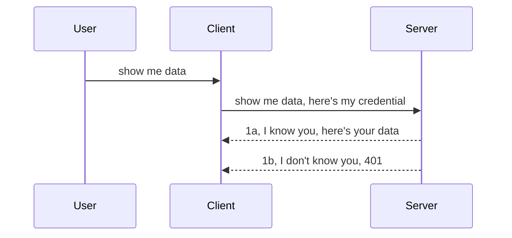

<!--
CO_OP_TRANSLATOR_METADATA:
{
  "original_hash": "5b00b8a8971a07d2d8803be4c9f138f8",
  "translation_date": "2025-10-07T00:58:47+00:00",
  "source_file": "03-GettingStarted/11-simple-auth/README.md",
  "language_code": "tl"
}
-->
# Simpleng Pagpapatunay

Ang MCP SDKs ay sumusuporta sa paggamit ng OAuth 2.1 na, sa totoo lang, ay isang medyo komplikadong proseso na kinabibilangan ng mga konsepto tulad ng auth server, resource server, pag-post ng mga kredensyal, pagkuha ng code, pagpapalit ng code para sa bearer token hanggang sa makuha mo na ang iyong resource data. Kung hindi ka sanay sa OAuth, na isang mahusay na bagay na ipatupad, magandang ideya na magsimula sa mas simpleng antas ng pagpapatunay at unti-unting magtungo sa mas mahusay na seguridad. Kaya't umiiral ang kabanatang ito, upang tulungan kang maabot ang mas advanced na pagpapatunay.

## Ano ang ibig sabihin ng Auth?

Ang Auth ay pinaikling salita para sa authentication at authorization. Ang ideya ay kailangan nating gawin ang dalawang bagay:

- **Authentication**, na proseso ng pag-alam kung papayagan natin ang isang tao na pumasok sa ating bahay, na may karapatan silang "nandito" o may access sa ating resource server kung saan matatagpuan ang mga tampok ng MCP Server.
- **Authorization**, ay proseso ng pag-alam kung ang isang user ay dapat magkaroon ng access sa mga partikular na resources na kanilang hinihingi, halimbawa mga order o mga produkto, o kung pinapayagan silang basahin ang nilalaman ngunit hindi burahin ito bilang isa pang halimbawa.

## Mga Kredensyal: Paano natin sinasabi sa sistema kung sino tayo

Kadalasan, ang mga web developer ay nagsisimulang mag-isip sa mga tuntunin ng pagbibigay ng kredensyal sa server, karaniwang isang lihim na nagsasabing pinapayagan silang narito "Authentication". Ang kredensyal na ito ay karaniwang isang base64 encoded na bersyon ng username at password o isang API key na natatanging tumutukoy sa isang partikular na user.

Kasama rito ang pagpapadala nito sa pamamagitan ng header na tinatawag na "Authorization" tulad ng sumusunod:

```json
{ "Authorization": "secret123" }
```

Karaniwang tinutukoy ito bilang basic authentication. Ang pangkalahatang daloy ay gumagana sa sumusunod na paraan:



Ngayon na nauunawaan natin kung paano ito gumagana mula sa pananaw ng daloy, paano natin ito ipapatupad? Karamihan sa mga web server ay may konsepto na tinatawag na middleware, isang piraso ng code na tumatakbo bilang bahagi ng kahilingan na maaaring mag-verify ng mga kredensyal, at kung ang mga kredensyal ay wasto, maaaring hayaan ang kahilingan na magpatuloy. Kung ang kahilingan ay walang wastong kredensyal, makakakuha ka ng error sa pagpapatunay. Tingnan natin kung paano ito maipapatupad:

**Python**

```python
class AuthMiddleware(BaseHTTPMiddleware):
    async def dispatch(self, request, call_next):

        has_header = request.headers.get("Authorization")
        if not has_header:
            print("-> Missing Authorization header!")
            return Response(status_code=401, content="Unauthorized")

        if not valid_token(has_header):
            print("-> Invalid token!")
            return Response(status_code=403, content="Forbidden")

        print("Valid token, proceeding...")
       
        response = await call_next(request)
        # add any customer headers or change in the response in some way
        return response


starlette_app.add_middleware(CustomHeaderMiddleware)
```

Narito ang ginawa natin:

- Gumawa ng middleware na tinatawag na `AuthMiddleware` kung saan ang `dispatch` method nito ay tinatawag ng web server.
- Idinagdag ang middleware sa web server:

    ```python
    starlette_app.add_middleware(AuthMiddleware)
    ```

- Nagsulat ng validation logic na nagche-check kung ang Authorization header ay naroroon at kung ang lihim na ipinadala ay wasto:

    ```python
    has_header = request.headers.get("Authorization")
    if not has_header:
        print("-> Missing Authorization header!")
        return Response(status_code=401, content="Unauthorized")

    if not valid_token(has_header):
        print("-> Invalid token!")
        return Response(status_code=403, content="Forbidden")
    ```

    kung ang lihim ay naroroon at wasto, hinahayaan natin ang kahilingan na magpatuloy sa pamamagitan ng pagtawag sa `call_next` at ibinabalik ang tugon.

    ```python
    response = await call_next(request)
    # add any customer headers or change in the response in some way
    return response
    ```

Ang paraan ng paggana nito ay kung ang isang web request ay ginawa patungo sa server, ang middleware ay tatawagin at batay sa implementasyon nito, papayagan nitong magpatuloy ang kahilingan o magbabalik ng error na nagpapahiwatig na ang kliyente ay hindi pinapayagang magpatuloy.

**TypeScript**

Dito tayo gagawa ng middleware gamit ang sikat na framework na Express at haharangin ang kahilingan bago ito makarating sa MCP Server. Narito ang code para dito:

```typescript
function isValid(secret) {
    return secret === "secret123";
}

app.use((req, res, next) => {
    // 1. Authorization header present?  
    if(!req.headers["Authorization"]) {
        res.status(401).send('Unauthorized');
    }
    
    let token = req.headers["Authorization"];

    // 2. Check validity.
    if(!isValid(token)) {
        res.status(403).send('Forbidden');
    }

   
    console.log('Middleware executed');
    // 3. Passes request to the next step in the request pipeline.
    next();
});
```

Sa code na ito, ginawa natin ang sumusunod:

1. Sinuri kung ang Authorization header ay naroroon, kung wala, magpapadala tayo ng error na 401.
2. Tiniyak na ang kredensyal/token ay wasto, kung hindi, magpapadala tayo ng error na 403.
3. Sa wakas, pinapasa ang kahilingan sa request pipeline at ibinabalik ang hiniling na resource.

## Ehersisyo: Ipatupad ang authentication

Gamitin natin ang ating kaalaman at subukang ipatupad ito. Narito ang plano:

Server

- Gumawa ng web server at MCP instance.
- Ipatupad ang middleware para sa server.

Client 

- Magpadala ng web request, kasama ang kredensyal, sa pamamagitan ng header.

### -1- Gumawa ng web server at MCP instance

Sa unang hakbang, kailangan nating gumawa ng web server instance at MCP Server.

**Python**

Dito tayo gagawa ng MCP server instance, gagawa ng starlette web app at i-host ito gamit ang uvicorn.

```python
# creating MCP Server

app = FastMCP(
    name="MCP Resource Server",
    instructions="Resource Server that validates tokens via Authorization Server introspection",
    host=settings["host"],
    port=settings["port"],
    debug=True
)

# creating starlette web app
starlette_app = app.streamable_http_app()

# serving app via uvicorn
async def run(starlette_app):
    import uvicorn
    config = uvicorn.Config(
            starlette_app,
            host=app.settings.host,
            port=app.settings.port,
            log_level=app.settings.log_level.lower(),
        )
    server = uvicorn.Server(config)
    await server.serve()

run(starlette_app)
```

Sa code na ito, ginawa natin ang sumusunod:

- Gumawa ng MCP Server.
- Binuo ang starlette web app mula sa MCP Server, `app.streamable_http_app()`.
- I-host at i-serve ang web app gamit ang uvicorn `server.serve()`.

**TypeScript**

Dito tayo gagawa ng MCP Server instance.

```typescript
const server = new McpServer({
      name: "example-server",
      version: "1.0.0"
    });

    // ... set up server resources, tools, and prompts ...
```

Ang paglikha ng MCP Server na ito ay kailangang mangyari sa loob ng ating POST /mcp route definition, kaya't ilipat natin ang code sa ganitong paraan:

```typescript
import express from "express";
import { randomUUID } from "node:crypto";
import { McpServer } from "@modelcontextprotocol/sdk/server/mcp.js";
import { StreamableHTTPServerTransport } from "@modelcontextprotocol/sdk/server/streamableHttp.js";
import { isInitializeRequest } from "@modelcontextprotocol/sdk/types.js"

const app = express();
app.use(express.json());

// Map to store transports by session ID
const transports: { [sessionId: string]: StreamableHTTPServerTransport } = {};

// Handle POST requests for client-to-server communication
app.post('/mcp', async (req, res) => {
  // Check for existing session ID
  const sessionId = req.headers['mcp-session-id'] as string | undefined;
  let transport: StreamableHTTPServerTransport;

  if (sessionId && transports[sessionId]) {
    // Reuse existing transport
    transport = transports[sessionId];
  } else if (!sessionId && isInitializeRequest(req.body)) {
    // New initialization request
    transport = new StreamableHTTPServerTransport({
      sessionIdGenerator: () => randomUUID(),
      onsessioninitialized: (sessionId) => {
        // Store the transport by session ID
        transports[sessionId] = transport;
      },
      // DNS rebinding protection is disabled by default for backwards compatibility. If you are running this server
      // locally, make sure to set:
      // enableDnsRebindingProtection: true,
      // allowedHosts: ['127.0.0.1'],
    });

    // Clean up transport when closed
    transport.onclose = () => {
      if (transport.sessionId) {
        delete transports[transport.sessionId];
      }
    };
    const server = new McpServer({
      name: "example-server",
      version: "1.0.0"
    });

    // ... set up server resources, tools, and prompts ...

    // Connect to the MCP server
    await server.connect(transport);
  } else {
    // Invalid request
    res.status(400).json({
      jsonrpc: '2.0',
      error: {
        code: -32000,
        message: 'Bad Request: No valid session ID provided',
      },
      id: null,
    });
    return;
  }

  // Handle the request
  await transport.handleRequest(req, res, req.body);
});

// Reusable handler for GET and DELETE requests
const handleSessionRequest = async (req: express.Request, res: express.Response) => {
  const sessionId = req.headers['mcp-session-id'] as string | undefined;
  if (!sessionId || !transports[sessionId]) {
    res.status(400).send('Invalid or missing session ID');
    return;
  }
  
  const transport = transports[sessionId];
  await transport.handleRequest(req, res);
};

// Handle GET requests for server-to-client notifications via SSE
app.get('/mcp', handleSessionRequest);

// Handle DELETE requests for session termination
app.delete('/mcp', handleSessionRequest);

app.listen(3000);
```

Ngayon makikita mo kung paano inilipat ang paglikha ng MCP Server sa loob ng `app.post("/mcp")`.

Magpatuloy tayo sa susunod na hakbang ng paglikha ng middleware upang ma-validate ang papasok na kredensyal.

### -2- Ipatupad ang middleware para sa server

Susunod, gagawa tayo ng middleware. Dito tayo gagawa ng middleware na naghahanap ng kredensyal sa `Authorization` header at i-validate ito. Kung ito ay katanggap-tanggap, ang kahilingan ay magpapatuloy upang gawin ang kailangan nito (halimbawa, maglista ng mga tools, magbasa ng resource, o anumang functionality ng MCP na hinihiling ng kliyente).

**Python**

Upang gumawa ng middleware, kailangan nating gumawa ng klase na nagmamana mula sa `BaseHTTPMiddleware`. Mayroong dalawang mahalagang bahagi:

- Ang kahilingan `request`, kung saan natin babasahin ang impormasyon ng header.
- Ang `call_next`, ang callback na kailangan nating tawagan kung ang kliyente ay nagdala ng kredensyal na tinatanggap natin.

Una, kailangan nating hawakan ang kaso kung ang `Authorization` header ay nawawala:

```python
has_header = request.headers.get("Authorization")

# no header present, fail with 401, otherwise move on.
if not has_header:
    print("-> Missing Authorization header!")
    return Response(status_code=401, content="Unauthorized")
```

Dito tayo nagpapadala ng 401 unauthorized message dahil nabigo ang kliyente sa authentication.

Susunod, kung may isinumiteng kredensyal, kailangan nating suriin ang bisa nito tulad ng sumusunod:

```python
 if not valid_token(has_header):
    print("-> Invalid token!")
    return Response(status_code=403, content="Forbidden")
```

Pansinin kung paano tayo nagpapadala ng 403 forbidden message sa itaas. Tingnan natin ang buong middleware sa ibaba na nagpatupad ng lahat ng nabanggit natin:

```python
class AuthMiddleware(BaseHTTPMiddleware):
    async def dispatch(self, request, call_next):

        has_header = request.headers.get("Authorization")
        if not has_header:
            print("-> Missing Authorization header!")
            return Response(status_code=401, content="Unauthorized")

        if not valid_token(has_header):
            print("-> Invalid token!")
            return Response(status_code=403, content="Forbidden")

        print("Valid token, proceeding...")
        print(f"-> Received {request.method} {request.url}")
        response = await call_next(request)
        response.headers['Custom'] = 'Example'
        return response

```

Magaling, ngunit paano naman ang `valid_token` function? Narito ito sa ibaba:

```python
# DON'T use for production - improve it !!
def valid_token(token: str) -> bool:
    # remove the "Bearer " prefix
    if token.startswith("Bearer "):
        token = token[7:]
        return token == "secret-token"
    return False
```

Dapat itong mapabuti.

MAHALAGA: Huwag kailanman maglagay ng mga lihim na tulad nito sa code. Dapat mong kunin ang halaga mula sa isang data source o mula sa isang IDP (identity service provider) o mas mabuti pa, hayaan ang IDP na gawin ang validation.

**TypeScript**

Upang ipatupad ito gamit ang Express, kailangan nating tawagan ang `use` method na tumatanggap ng mga middleware functions.

Kailangan nating:

- Makipag-ugnayan sa request variable upang suriin ang ipinasa na kredensyal sa property na `Authorization`.
- I-validate ang kredensyal, at kung wasto, hayaan ang kahilingan na magpatuloy at gawin ang dapat nitong gawin (halimbawa, maglista ng tools, magbasa ng resource, o anumang may kaugnayan sa MCP).

Dito, sinisigurado natin kung ang `Authorization` header ay naroroon, at kung wala, pinipigilan natin ang kahilingan na magpatuloy:

```typescript
if(!req.headers["authorization"]) {
    res.status(401).send('Unauthorized');
    return;
}
```

Kung ang header ay hindi ipinadala, makakatanggap ka ng 401.

Susunod, sinisigurado natin kung ang kredensyal ay wasto, kung hindi, muli nating pinipigilan ang kahilingan ngunit may bahagyang ibang mensahe:

```typescript
if(!isValid(token)) {
    res.status(403).send('Forbidden');
    return;
} 
```

Pansinin kung paano ka makakakuha ng error na 403.

Narito ang buong code:

```typescript
app.use((req, res, next) => {
    console.log('Request received:', req.method, req.url, req.headers);
    console.log('Headers:', req.headers["authorization"]);
    if(!req.headers["authorization"]) {
        res.status(401).send('Unauthorized');
        return;
    }
    
    let token = req.headers["authorization"];

    if(!isValid(token)) {
        res.status(403).send('Forbidden');
        return;
    }  

    console.log('Middleware executed');
    next();
});
```

Na-set up na natin ang web server upang tanggapin ang middleware para suriin ang kredensyal na ipinapadala ng kliyente. Paano naman ang kliyente mismo?

### -3- Magpadala ng web request na may kredensyal sa pamamagitan ng header

Kailangan nating tiyakin na ang kliyente ay nagpapasa ng kredensyal sa pamamagitan ng header. Dahil gagamit tayo ng MCP client para gawin ito, kailangan nating alamin kung paano ito gagawin.

**Python**

Para sa kliyente, kailangan nating magpasa ng header na may kredensyal tulad ng sumusunod:

```python
# DON'T hardcode the value, have it at minimum in an environment variable or a more secure storage
token = "secret-token"

async with streamablehttp_client(
        url = f"http://localhost:{port}/mcp",
        headers = {"Authorization": f"Bearer {token}"}
    ) as (
        read_stream,
        write_stream,
        session_callback,
    ):
        async with ClientSession(
            read_stream,
            write_stream
        ) as session:
            await session.initialize()
      
            # TODO, what you want done in the client, e.g list tools, call tools etc.
```

Pansinin kung paano natin pinupunan ang property na `headers` tulad ng ` headers = {"Authorization": f"Bearer {token}"}`.

**TypeScript**

Maaari nating gawin ito sa dalawang hakbang:

1. Punan ang configuration object ng ating kredensyal.
2. Ipasok ang configuration object sa transport.

```typescript

// DON'T hardcode the value like shown here. At minimum have it as a env variable and use something like dotenv (in dev mode).
let token = "secret123"

// define a client transport option object
let options: StreamableHTTPClientTransportOptions = {
  sessionId: sessionId,
  requestInit: {
    headers: {
      "Authorization": "secret123"
    }
  }
};

// pass the options object to the transport
async function main() {
   const transport = new StreamableHTTPClientTransport(
      new URL(serverUrl),
      options
   );
```

Dito makikita mo kung paano tayo gumawa ng `options` object at inilagay ang ating mga headers sa ilalim ng property na `requestInit`.

MAHALAGA: Paano natin ito mapapabuti mula dito? Sa kasalukuyang implementasyon, may ilang isyu. Una, ang pagpapasa ng kredensyal sa ganitong paraan ay medyo mapanganib maliban kung mayroon kang HTTPS. Kahit na, ang kredensyal ay maaaring manakaw kaya kailangan mo ng sistema kung saan madali mong ma-revoke ang token at magdagdag ng karagdagang mga pagsusuri tulad ng kung saan ito nanggaling, kung ang kahilingan ay masyadong madalas (parang bot), sa madaling salita, maraming mga alalahanin. 

Gayunpaman, para sa napakasimpleng mga API kung saan ayaw mong may tumawag sa iyong API nang hindi na-authenticate, ang mayroon tayo dito ay isang magandang simula.

Sa sinabi nito, subukan nating palakasin ang seguridad nang kaunti sa pamamagitan ng paggamit ng standardized na format tulad ng JSON Web Token, na kilala rin bilang JWT o "JOT" tokens.

## JSON Web Tokens, JWT

Kaya, sinusubukan nating pagbutihin ang mga bagay mula sa pagpapadala ng napakasimpleng mga kredensyal. Ano ang mga agarang benepisyo na makukuha natin sa pag-aampon ng JWT?

- **Pagpapabuti ng seguridad**. Sa basic auth, ipinapadala mo ang username at password bilang isang base64 encoded token (o isang API key) nang paulit-ulit na nagpapataas ng panganib. Sa JWT, ipinapadala mo ang iyong username at password at makakakuha ng token bilang kapalit na may expiration. Ang JWT ay nagbibigay-daan sa iyo na madaling gamitin ang fine-grained access control gamit ang roles, scopes, at permissions. 
- **Statelessness at scalability**. Ang JWTs ay self-contained, nagdadala ng lahat ng impormasyon ng user at inaalis ang pangangailangan para sa server-side session storage. Ang token ay maaari ring ma-validate nang lokal.
- **Interoperability at federation**. Ang JWTs ay sentral sa Open ID Connect at ginagamit sa mga kilalang identity providers tulad ng Entra ID, Google Identity, at Auth0. Ginagawa rin nitong posible ang paggamit ng single sign-on at marami pang iba na ginagawang enterprise-grade.
- **Modularity at flexibility**. Ang JWTs ay maaari ring gamitin sa mga API Gateways tulad ng Azure API Management, NGINX, at iba pa. Sinusuportahan din nito ang mga authentication scenarios at server-to-service communication kabilang ang impersonation at delegation scenarios.
- **Performance at caching**. Ang JWTs ay maaaring i-cache pagkatapos ma-decode na nagbabawas sa pangangailangan para sa parsing. Ito ay partikular na nakakatulong sa mga high-traffic apps dahil pinapabuti nito ang throughput at binabawasan ang load sa iyong napiling infrastructure.
- **Advanced features**. Sinusuportahan din nito ang introspection (pag-check ng validity sa server) at revocation (pagpapawalang-bisa ng token).

Sa lahat ng mga benepisyong ito, tingnan natin kung paano natin maiaangat ang ating implementasyon sa susunod na antas.

## Pagpapalit ng basic auth sa JWT

Kaya, ang mga pagbabago na kailangan natin sa mataas na antas ay:

- **Matutong gumawa ng JWT token** at ihanda ito para maipadala mula sa kliyente patungo sa server.
- **I-validate ang JWT token**, at kung wasto, hayaan ang kliyente na makuha ang ating mga resources.
- **Secure token storage**. Paano natin itatago ang token na ito.
- **Protektahan ang mga ruta**. Kailangan nating protektahan ang mga ruta, sa ating kaso, kailangan nating protektahan ang mga ruta at partikular na mga tampok ng MCP.
- **Magdagdag ng refresh tokens**. Siguraduhing gumawa ng mga token na maikli ang buhay ngunit may mga refresh tokens na pangmatagalan na maaaring gamitin upang makakuha ng mga bagong token kung mag-expire ang mga ito. Siguraduhin din na mayroong refresh endpoint at rotation strategy.

### -1- Gumawa ng JWT token

Una, ang isang JWT token ay may mga sumusunod na bahagi:

- **header**, algorithm na ginamit at uri ng token.
- **payload**, mga claim, tulad ng sub (ang user o entity na kinakatawan ng token. Sa isang auth scenario, karaniwang ito ang userid), exp (kung kailan ito mag-e-expire) role (ang role).
- **signature**, nilagdaan gamit ang isang lihim o pribadong key.

Para dito, kailangan nating buuin ang header, payload, at ang encoded token.

**Python**

```python

import jwt
import jwt
from jwt.exceptions import ExpiredSignatureError, InvalidTokenError
import datetime

# Secret key used to sign the JWT
secret_key = 'your-secret-key'

header = {
    "alg": "HS256",
    "typ": "JWT"
}

# the user info andits claims and expiry time
payload = {
    "sub": "1234567890",               # Subject (user ID)
    "name": "User Userson",                # Custom claim
    "admin": True,                     # Custom claim
    "iat": datetime.datetime.utcnow(),# Issued at
    "exp": datetime.datetime.utcnow() + datetime.timedelta(hours=1)  # Expiry
}

# encode it
encoded_jwt = jwt.encode(payload, secret_key, algorithm="HS256", headers=header)
```

Sa code sa itaas, ginawa natin ang sumusunod:

- Tinukoy ang header gamit ang HS256 bilang algorithm at uri na JWT.
- Binuo ang payload na naglalaman ng subject o user id, username, role, kung kailan ito na-issue, at kung kailan ito mag-e-expire, kaya't naipatupad ang time-bound aspect na nabanggit natin kanina. 

**TypeScript**

Dito, kakailanganin natin ng mga dependencies na makakatulong sa atin na buuin ang JWT token.

Dependencies

```sh

npm install jsonwebtoken
npm install --save-dev @types/jsonwebtoken
```

Ngayon na mayroon na tayo nito, gawin natin ang header, payload, at sa pamamagitan nito, buuin ang encoded token.

```typescript
import jwt from 'jsonwebtoken';

const secretKey = 'your-secret-key'; // Use env vars in production

// Define the payload
const payload = {
  sub: '1234567890',
  name: 'User usersson',
  admin: true,
  iat: Math.floor(Date.now() / 1000), // Issued at
  exp: Math.floor(Date.now() / 1000) + 60 * 60 // Expires in 1 hour
};

// Define the header (optional, jsonwebtoken sets defaults)
const header = {
  alg: 'HS256',
  typ: 'JWT'
};

// Create the token
const token = jwt.sign(payload, secretKey, {
  algorithm: 'HS256',
  header: header
});

console.log('JWT:', token);
```

Ang token na ito ay:

Nilagdaan gamit ang HS256  
Wasto sa loob ng 1 oras  
Naglalaman ng mga claim tulad ng sub, name, admin, iat, at exp.

### -2- I-validate ang token

Kailangan din nating i-validate ang token, ito ay dapat gawin sa server upang matiyak na ang ipinapadala ng kliyente sa atin ay talagang wasto. Maraming mga pagsusuri ang dapat gawin dito mula sa pag-validate ng istruktura nito hanggang sa bisa nito. Hinihikayat ka rin na magdagdag ng iba pang mga pagsusuri upang makita kung ang user ay nasa iyong sistema at higit pa.

Upang i-validate ang token, kailangan nating i-decode ito upang mabasa ito at pagkatapos ay simulan ang pagsusuri ng bisa nito:

**Python**

```python

# Decode and verify the JWT
try:
    decoded = jwt.decode(token, secret_key, algorithms=["HS256"])
    print("✅ Token is valid.")
    print("Decoded claims:")
    for key, value in decoded.items():
        print(f"  {key}: {value}")
except ExpiredSignatureError:
    print("❌ Token has expired.")
except InvalidTokenError as e:
    print(f"❌ Invalid token: {e}")

```

Sa code na ito, tinatawag natin ang `jwt.decode` gamit ang token, ang secret key, at ang napiling algorithm bilang input. Pansinin kung paano natin ginagamit ang try-catch construct dahil ang nabigong validation ay nagdudulot ng error.

**TypeScript**

Dito, kailangan nating tawagan ang `jwt.verify` upang makakuha ng decoded na bersyon ng token na maaari nating suriin pa. Kung nabigo ang tawag na ito, nangangahulugan ito na ang istruktura ng token ay mali o hindi na ito wasto. 

```typescript

try {
  const decoded = jwt.verify(token, secretKey);
  console.log('Decoded Payload:', decoded);
} catch (err) {
  console.error('Token verification failed:', err);
}
```

NOTE: tulad ng nabanggit dati, dapat tayong magsagawa ng karagdagang mga pagsusuri upang matiyak na ang token na ito ay tumutukoy sa isang user sa ating sistema at tiyakin na ang user ay may mga karapatang sinasabi nitong mayroon siya.
Susunod, tingnan natin ang role-based access control, na kilala rin bilang RBAC.

## Pagdaragdag ng role-based access control

Ang ideya ay nais nating ipakita na ang iba't ibang mga role ay may iba't ibang mga pahintulot. Halimbawa, inaakala natin na ang isang admin ay maaaring gawin ang lahat, ang isang normal na user ay maaaring magbasa/magsulat, at ang isang guest ay maaari lamang magbasa. Kaya, narito ang ilang posibleng antas ng pahintulot:

- Admin.Write 
- User.Read
- Guest.Read

Tingnan natin kung paano natin maipapatupad ang ganitong kontrol gamit ang middleware. Ang mga middleware ay maaaring idagdag sa bawat ruta pati na rin para sa lahat ng ruta.

**Python**

```python
from starlette.middleware.base import BaseHTTPMiddleware
from starlette.responses import JSONResponse
import jwt

# DON'T have the secret in the code like, this is for demonstration purposes only. Read it from a safe place.
SECRET_KEY = "your-secret-key" # put this in env variable
REQUIRED_PERMISSION = "User.Read"

class JWTPermissionMiddleware(BaseHTTPMiddleware):
    async def dispatch(self, request, call_next):
        auth_header = request.headers.get("Authorization")
        if not auth_header or not auth_header.startswith("Bearer "):
            return JSONResponse({"error": "Missing or invalid Authorization header"}, status_code=401)

        token = auth_header.split(" ")[1]
        try:
            decoded = jwt.decode(token, SECRET_KEY, algorithms=["HS256"])
        except jwt.ExpiredSignatureError:
            return JSONResponse({"error": "Token expired"}, status_code=401)
        except jwt.InvalidTokenError:
            return JSONResponse({"error": "Invalid token"}, status_code=401)

        permissions = decoded.get("permissions", [])
        if REQUIRED_PERMISSION not in permissions:
            return JSONResponse({"error": "Permission denied"}, status_code=403)

        request.state.user = decoded
        return await call_next(request)


```

May ilang iba't ibang paraan upang idagdag ang middleware tulad ng nasa ibaba:

```python

# Alt 1: add middleware while constructing starlette app
middleware = [
    Middleware(JWTPermissionMiddleware)
]

app = Starlette(routes=routes, middleware=middleware)

# Alt 2: add middleware after starlette app is a already constructed
starlette_app.add_middleware(JWTPermissionMiddleware)

# Alt 3: add middleware per route
routes = [
    Route(
        "/mcp",
        endpoint=..., # handler
        middleware=[Middleware(JWTPermissionMiddleware)]
    )
]
```

**TypeScript**

Maaari nating gamitin ang `app.use` at isang middleware na tatakbo para sa lahat ng mga request.

```typescript
app.use((req, res, next) => {
    console.log('Request received:', req.method, req.url, req.headers);
    console.log('Headers:', req.headers["authorization"]);

    // 1. Check if authorization header has been sent

    if(!req.headers["authorization"]) {
        res.status(401).send('Unauthorized');
        return;
    }
    
    let token = req.headers["authorization"];

    // 2. Check if token is valid
    if(!isValid(token)) {
        res.status(403).send('Forbidden');
        return;
    }  

    // 3. Check if token user exist in our system
    if(!isExistingUser(token)) {
        res.status(403).send('Forbidden');
        console.log("User does not exist");
        return;
    }
    console.log("User exists");

    // 4. Verify the token has the right permissions
    if(!hasScopes(token, ["User.Read"])){
        res.status(403).send('Forbidden - insufficient scopes');
    }

    console.log("User has required scopes");

    console.log('Middleware executed');
    next();
});

```

Maraming bagay na maaaring gawin ng ating middleware at DAPAT gawin ng ating middleware, tulad ng:

1. Suriin kung may authorization header
2. Suriin kung valid ang token, tatawagin natin ang `isValid` na isang method na isinulat natin upang suriin ang integridad at validity ng JWT token.
3. Siguraduhin na ang user ay umiiral sa ating sistema, dapat natin itong suriin.

   ```typescript
    // users in DB
   const users = [
     "user1",
     "User usersson",
   ]

   function isExistingUser(token) {
     let decodedToken = verifyToken(token);

     // TODO, check if user exists in DB
     return users.includes(decodedToken?.name || "");
   }
   ```

   Sa itaas, gumawa tayo ng napakasimpleng listahan ng `users`, na dapat ay nasa isang database.

4. Bukod pa rito, dapat din nating suriin kung ang token ay may tamang mga pahintulot.

   ```typescript
   if(!hasScopes(token, ["User.Read"])){
        res.status(403).send('Forbidden - insufficient scopes');
   }
   ```

   Sa code sa itaas mula sa middleware, sinuri natin na ang token ay naglalaman ng User.Read permission, kung wala, magpapadala tayo ng 403 error. Narito ang `hasScopes` helper method.

   ```typescript
   function hasScopes(scope: string, requiredScopes: string[]) {
     let decodedToken = verifyToken(scope);
    return requiredScopes.every(scope => decodedToken?.scopes.includes(scope));
  }
   ```

Have a think which additional checks you should be doing, but these are the absolute minimum of checks you should be doing.

Using Express as a web framework is a common choice. There are helpers library when you use JWT so you can write less code.

- `express-jwt`, helper library that provides a middleware that helps decode your token.
- `express-jwt-permissions`, this provides a middleware `guard` that helps check if a certain permission is on the token.

Here's what these libraries can look like when used:

```typescript
const express = require('express');
const jwt = require('express-jwt');
const guard = require('express-jwt-permissions')();

const app = express();
const secretKey = 'your-secret-key'; // put this in env variable

// Decode JWT and attach to req.user
app.use(jwt({ secret: secretKey, algorithms: ['HS256'] }));

// Check for User.Read permission
app.use(guard.check('User.Read'));

// multiple permissions
// app.use(guard.check(['User.Read', 'Admin.Access']));

app.get('/protected', (req, res) => {
  res.json({ message: `Welcome ${req.user.name}` });
});

// Error handler
app.use((err, req, res, next) => {
  if (err.code === 'permission_denied') {
    return res.status(403).send('Forbidden');
  }
  next(err);
});

```

Ngayon nakita mo kung paano magagamit ang middleware para sa parehong authentication at authorization, paano naman ang MCP, nagbabago ba ito kung paano natin ginagawa ang auth? Alamin natin sa susunod na seksyon.

### -3- Magdagdag ng RBAC sa MCP

Nakita mo na kung paano magdagdag ng RBAC gamit ang middleware, gayunpaman, para sa MCP walang madaling paraan upang magdagdag ng per MCP feature RBAC, kaya ano ang gagawin natin? Well, kailangan lang nating magdagdag ng code tulad nito na sumusuri kung ang client ay may karapatang tawagan ang isang partikular na tool:

Mayroon kang ilang iba't ibang mga pagpipilian kung paano makamit ang per feature RBAC, narito ang ilan:

- Magdagdag ng pagsusuri para sa bawat tool, resource, prompt kung saan kailangan mong suriin ang antas ng pahintulot.

   **Python**

   ```python
   @tool()
   def delete_product(id: int):
      try:
          check_permissions(role="Admin.Write", request)
      catch:
        pass # client failed authorization, raise authorization error
   ```

   **TypeScript**

   ```typescript
   server.registerTool(
    "delete-product",
    {
      title: Delete a product",
      description: "Deletes a product",
      inputSchema: { id: z.number() }
    },
    async ({ id }) => {
      
      try {
        checkPermissions("Admin.Write", request);
        // todo, send id to productService and remote entry
      } catch(Exception e) {
        console.log("Authorization error, you're not allowed");  
      }

      return {
        content: [{ type: "text", text: `Deletected product with id ${id}` }]
      };
    }
   );
   ```


- Gumamit ng advanced server approach at ang mga request handlers upang mabawasan ang dami ng lugar kung saan kailangan mong gawin ang pagsusuri.

   **Python**

   ```python
   
   tool_permission = {
      "create_product": ["User.Write", "Admin.Write"],
      "delete_product": ["Admin.Write"]
   }

   def has_permission(user_permissions, required_permissions) -> bool:
      # user_permissions: list of permissions the user has
      # required_permissions: list of permissions required for the tool
      return any(perm in user_permissions for perm in required_permissions)

   @server.call_tool()
   async def handle_call_tool(
     name: str, arguments: dict[str, str] | None
   ) -> list[types.TextContent]:
    # Assume request.user.permissions is a list of permissions for the user
     user_permissions = request.user.permissions
     required_permissions = tool_permission.get(name, [])
     if not has_permission(user_permissions, required_permissions):
        # Raise error "You don't have permission to call tool {name}"
        raise Exception(f"You don't have permission to call tool {name}")
     # carry on and call tool
     # ...
   ```   
   

   **TypeScript**

   ```typescript
   function hasPermission(userPermissions: string[], requiredPermissions: string[]): boolean {
       if (!Array.isArray(userPermissions) || !Array.isArray(requiredPermissions)) return false;
       // Return true if user has at least one required permission
       
       return requiredPermissions.some(perm => userPermissions.includes(perm));
   }
  
   server.setRequestHandler(CallToolRequestSchema, async (request) => {
      const { params: { name } } = request;
  
      let permissions = request.user.permissions;
  
      if (!hasPermission(permissions, toolPermissions[name])) {
         return new Error(`You don't have permission to call ${name}`);
      }
  
      // carry on..
   });
   ```

   Tandaan, kailangan mong tiyakin na ang iyong middleware ay nag-a-assign ng decoded token sa user property ng request upang ang code sa itaas ay maging simple.

### Pagbubuod

Ngayon na natalakay natin kung paano magdagdag ng suporta para sa RBAC sa pangkalahatan at para sa MCP sa partikular, oras na upang subukan ang pag-implement ng seguridad sa iyong sarili upang matiyak na naintindihan mo ang mga konseptong ipinakita sa iyo.

## Assignment 1: Gumawa ng MCP server at MCP client gamit ang basic authentication

Dito, gagamitin mo ang natutunan mo tungkol sa pagpapadala ng mga kredensyal sa pamamagitan ng headers.

## Solution 1

[Solution 1](./code/basic/README.md)

## Assignment 2: I-upgrade ang solusyon mula sa Assignment 1 upang gumamit ng JWT

Gamitin ang unang solusyon ngunit sa pagkakataong ito, pagbutihin natin ito.

Sa halip na gumamit ng Basic Auth, gumamit tayo ng JWT.

## Solution 2

[Solution 2](./solution/jwt-solution/README.md)

## Hamon

Magdagdag ng RBAC per tool na inilarawan namin sa seksyon na "Magdagdag ng RBAC sa MCP".

## Pagbubuod

Sana ay marami kang natutunan sa kabanatang ito, mula sa walang seguridad, hanggang sa basic na seguridad, hanggang sa JWT at kung paano ito maidaragdag sa MCP.

Nakapagtayo tayo ng matibay na pundasyon gamit ang custom JWTs, ngunit habang lumalaki tayo, lumilipat tayo patungo sa isang standards-based na identity model. Ang paggamit ng IdP tulad ng Entra o Keycloak ay nagbibigay-daan sa atin na i-offload ang token issuance, validation, at lifecycle management sa isang pinagkakatiwalaang platform — na nagbibigay sa atin ng pagkakataong mag-focus sa app logic at user experience.

Para diyan, mayroon tayong mas [advanced na kabanata tungkol sa Entra](../../05-AdvancedTopics/mcp-security-entra/README.md)

---

**Paunawa**:  
Ang dokumentong ito ay isinalin gamit ang AI translation service na [Co-op Translator](https://github.com/Azure/co-op-translator). Bagama't sinisikap naming maging tumpak, mangyaring tandaan na ang mga awtomatikong pagsasalin ay maaaring maglaman ng mga pagkakamali o hindi pagkakatugma. Ang orihinal na dokumento sa kanyang katutubong wika ang dapat ituring na opisyal na sanggunian. Para sa mahalagang impormasyon, inirerekomenda ang propesyonal na pagsasalin ng tao. Hindi kami mananagot sa anumang hindi pagkakaunawaan o maling interpretasyon na dulot ng paggamit ng pagsasaling ito.