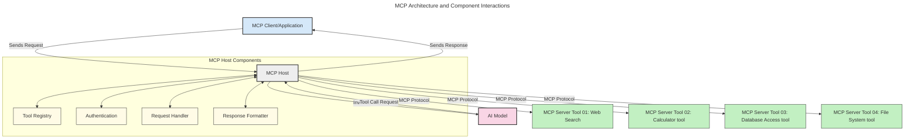
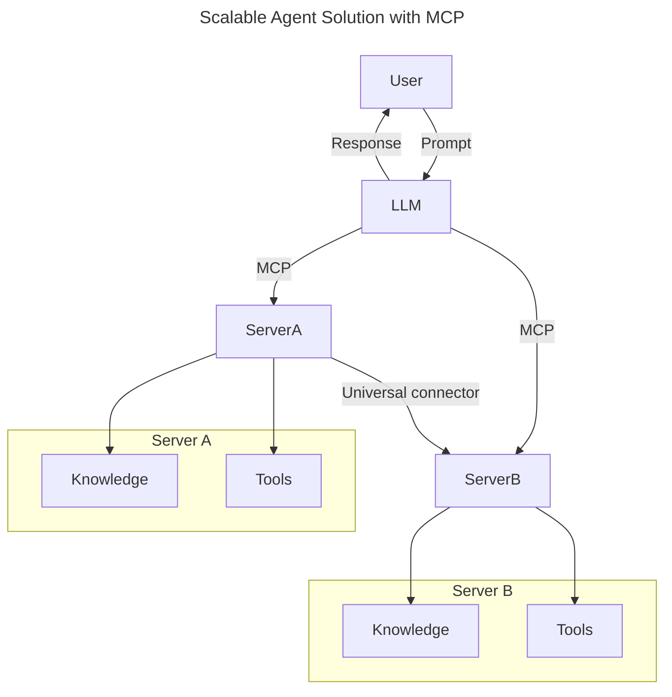
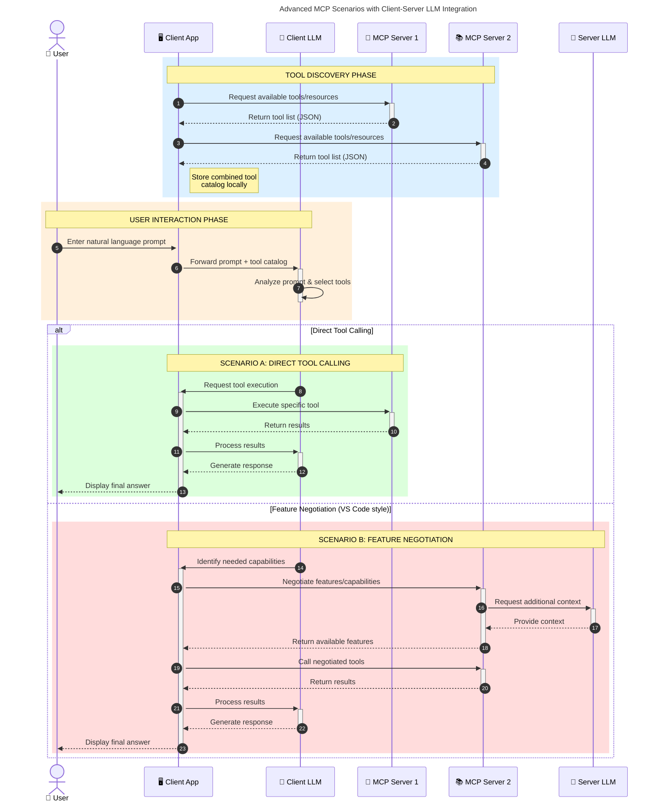

<!--
CO_OP_TRANSLATOR_METADATA:
{
  "original_hash": "9678e0c6945b8e0c23586869b0e26783",
  "translation_date": "2025-10-06T11:01:11+00:00",
  "source_file": "00-Introduction/README.md",
  "language_code": "tr"
}
-->
# Model Bağlam Protokolüne (MCP) Giriş: Ölçeklenebilir Yapay Zeka Uygulamaları İçin Neden Önemli?

_(Bu dersin videosunu izlemek için yukarıdaki görsele tıklayın)_

Üretken yapay zeka uygulamaları, genellikle kullanıcıların doğal dil komutlarıyla uygulama ile etkileşim kurmasına olanak tanıdığı için büyük bir ilerleme kaydediyor. Ancak, bu tür uygulamalara daha fazla zaman ve kaynak yatırıldıkça, işlevsellikleri ve kaynakları kolayca entegre edebilmek, uygulamanızın birden fazla modelle çalışabilmesini sağlamak ve çeşitli model karmaşıklıklarını yönetebilmek önem kazanır. Kısacası, üretken yapay zeka uygulamaları oluşturmak başlangıçta kolaydır, ancak büyüdükçe ve daha karmaşık hale geldikçe bir mimari tanımlamaya başlamanız ve uygulamalarınızın tutarlı bir şekilde oluşturulmasını sağlamak için bir standarda güvenmeniz gerekebilir. İşte bu noktada MCP devreye girer ve işleri düzenler, bir standart sunar.

---

## **🔍 Model Bağlam Protokolü (MCP) Nedir?**

**Model Bağlam Protokolü (MCP)**, Büyük Dil Modellerinin (LLM'ler) harici araçlar, API'ler ve veri kaynaklarıyla sorunsuz bir şekilde etkileşim kurmasını sağlayan **açık, standartlaştırılmış bir arayüzdür**. Eğitim verilerinin ötesinde yapay zeka modeli işlevselliğini artırmak, daha akıllı, ölçeklenebilir ve daha duyarlı yapay zeka sistemleri oluşturmak için tutarlı bir mimari sağlar.

---

## **🎯 Yapay Zekada Standardizasyon Neden Önemlidir**

Üretken yapay zeka uygulamaları daha karmaşık hale geldikçe, **ölçeklenebilirlik, genişletilebilirlik, sürdürülebilirlik** ve **satıcıya bağımlılıktan kaçınma** gibi standartları benimsemek önemlidir. MCP bu ihtiyaçları şu şekilde karşılar:

- Model-araç entegrasyonlarını birleştirir
- Kırılgan, tek seferlik özel çözümleri azaltır
- Farklı satıcılardan birden fazla modelin tek bir ekosistemde bir arada bulunmasına olanak tanır

**Not:** MCP kendisini açık bir standart olarak tanıtsa da, MCP'yi IEEE, IETF, W3C, ISO veya diğer standart kuruluşları gibi mevcut standart kuruluşları aracılığıyla standartlaştırma planı bulunmamaktadır.

---

## **📚 Öğrenme Hedefleri**

Bu makalenin sonunda şunları yapabileceksiniz:

- **Model Bağlam Protokolü (MCP)**'nü ve kullanım alanlarını tanımlayın
- MCP'nin model-araç iletişimini nasıl standartlaştırdığını anlayın
- MCP mimarisinin temel bileşenlerini belirleyin
- MCP'nin kurumsal ve geliştirme bağlamlarındaki gerçek dünya uygulamalarını keşfedin

---

## **💡 Model Bağlam Protokolü (MCP) Neden Önemli?**

### **🔗 MCP, Yapay Zeka Etkileşimlerindeki Parçalanmayı Çözüyor**

MCP'den önce, modelleri araçlarla entegre etmek şunları gerektiriyordu:

- Her araç-model çifti için özel kod
- Her satıcı için standart olmayan API'ler
- Güncellemeler nedeniyle sık sık kesintiler
- Daha fazla araçla zayıf ölçeklenebilirlik

### **✅ MCP Standardizasyonunun Faydaları**

| **Fayda**                 | **Açıklama**                                                                    |
|--------------------------|--------------------------------------------------------------------------------|
| Uyumluluk                | LLM'ler farklı satıcılardan araçlarla sorunsuz çalışır                         |
| Tutarlılık               | Platformlar ve araçlar arasında tutarlı davranış                               |
| Yeniden Kullanılabilirlik| Bir kez oluşturulan araçlar projeler ve sistemler arasında kullanılabilir       |
| Hızlı Geliştirme         | Standartlaştırılmış, tak-çalıştır arayüzler kullanarak geliştirme süresini azaltır |

---

## **🧱 MCP Mimarisine Genel Bakış**

MCP, bir **istemci-sunucu modeli**ni takip eder, burada:

- **MCP Hostları** yapay zeka modellerini çalıştırır
- **MCP İstemcileri** istekleri başlatır
- **MCP Sunucuları** bağlam, araçlar ve yetenekler sunar

### **Temel Bileşenler:**

- **Kaynaklar** – Modeller için statik veya dinamik veriler  
- **Komutlar** – Yönlendirilmiş üretim için önceden tanımlanmış iş akışları  
- **Araçlar** – Arama, hesaplama gibi çalıştırılabilir işlevler  
- **Örnekleme** – Tekrarlayan etkileşimler yoluyla ajans davranışı  

---

## MCP Sunucuları Nasıl Çalışır?

MCP sunucuları şu şekilde çalışır:

- **İstek Akışı**:
    1. Bir istek, bir son kullanıcı veya onun adına hareket eden bir yazılım tarafından başlatılır.
    2. **MCP İstemcisi**, isteği yapay zeka modeli çalışma zamanını yöneten **MCP Host**a gönderir.
    3. **Yapay Zeka Modeli**, kullanıcı komutunu alır ve bir veya daha fazla araç çağrısı yoluyla harici araçlara veya verilere erişim talep edebilir.
    4. **MCP Host**, doğrudan model değil, standartlaştırılmış protokolü kullanarak uygun **MCP Sunucusu(ları)** ile iletişim kurar.
- **MCP Host İşlevselliği**:
    - **Araç Kaydı**: Mevcut araçların ve yeteneklerinin bir kataloğunu tutar.
    - **Kimlik Doğrulama**: Araç erişimi için izinleri doğrular.
    - **İstek İşleyici**: Modelden gelen araç isteklerini işler.
    - **Yanıt Biçimlendirici**: Araç çıktısını modelin anlayabileceği bir formatta yapılandırır.
- **MCP Sunucu İşlemi**:
    - **MCP Host**, araç çağrılarını arama, hesaplama, veri tabanı sorguları gibi özel işlevler sunan bir veya daha fazla **MCP Sunucusu**na yönlendirir.
    - **MCP Sunucuları**, ilgili işlemleri gerçekleştirir ve sonuçları **MCP Host**a tutarlı bir formatta geri gönderir.
    - **MCP Host**, bu sonuçları biçimlendirir ve **Yapay Zeka Modeli**ne iletir.
- **Yanıt Tamamlama**:
    - **Yapay Zeka Modeli**, araç çıktısını nihai bir yanıta entegre eder.
    - **MCP Host**, bu yanıtı **MCP İstemcisi**ne gönderir ve bu da son kullanıcıya veya çağıran yazılıma iletir.

## 👨‍💻 MCP Sunucusu Nasıl Oluşturulur (Örneklerle)

MCP sunucuları, LLM yeteneklerini veri ve işlevsellik sağlayarak genişletmenize olanak tanır.

Denemeye hazır mısınız? İşte farklı dil/yığınlarda basit MCP sunucuları oluşturma örnekleriyle dil ve/veya yığın spesifik SDK'lar:

- **Python SDK**: https://github.com/modelcontextprotocol/python-sdk

- **TypeScript SDK**: https://github.com/modelcontextprotocol/typescript-sdk

- **Java SDK**: https://github.com/modelcontextprotocol/java-sdk

- **C#/.NET SDK**: https://github.com/modelcontextprotocol/csharp-sdk

## 🌍 MCP'nin Gerçek Dünya Uygulamaları

MCP, yapay zeka yeteneklerini genişleterek çok çeşitli uygulamalara olanak tanır:

| **Uygulama**               | **Açıklama**                                                                    |
|----------------------------|--------------------------------------------------------------------------------|
| Kurumsal Veri Entegrasyonu | LLM'leri veri tabanlarına, CRM'lere veya dahili araçlara bağlama               |
| Ajans Yapay Zeka Sistemleri| Araç erişimi ve karar verme iş akışları ile otonom ajanlar oluşturma           |
| Çok Modlu Uygulamalar      | Tek bir birleşik yapay zeka uygulaması içinde metin, görüntü ve ses araçlarını birleştirme |
| Gerçek Zamanlı Veri Entegrasyonu | Daha doğru ve güncel çıktılar için yapay zeka etkileşimlerine canlı veri getirme |

### 🧠 MCP = Yapay Zeka Etkileşimleri İçin Evrensel Standart

Model Bağlam Protokolü (MCP), USB-C'nin cihazlar için fiziksel bağlantıları standartlaştırdığı gibi yapay zeka etkileşimleri için evrensel bir standart olarak hareket eder. Yapay zeka dünyasında MCP, modellerin (istemciler) harici araçlar ve veri sağlayıcılarla (sunucular) sorunsuz bir şekilde entegre olmasını sağlayan tutarlı bir arayüz sunar. Bu, her API veya veri kaynağı için çeşitli, özel protokollere olan ihtiyacı ortadan kaldırır.

MCP altında, MCP uyumlu bir araç (MCP sunucusu olarak adlandırılır) birleşik bir standardı takip eder. Bu sunucular, sundukları araçları veya eylemleri listeleyebilir ve bir yapay zeka ajanı tarafından talep edildiğinde bu eylemleri gerçekleştirebilir. MCP'yi destekleyen yapay zeka ajan platformları, sunuculardan mevcut araçları keşfedebilir ve bu standart protokol aracılığıyla onları çağırabilir.

### 💡 Bilgiye Erişimi Kolaylaştırır

Araçlar sunmanın ötesinde MCP, bilgiye erişimi de kolaylaştırır. Uygulamaların büyük dil modellerine (LLM'ler) çeşitli veri kaynaklarına bağlanarak bağlam sağlamasına olanak tanır. Örneğin, bir MCP sunucusu bir şirketin belge deposunu temsil edebilir ve ajanların talep üzerine ilgili bilgileri almasına olanak tanır. Başka bir sunucu, e-posta gönderme veya kayıt güncelleme gibi belirli eylemleri gerçekleştirebilir. Ajan açısından bakıldığında, bunlar yalnızca kullanabileceği araçlardır—bazı araçlar veri (bilgi bağlamı) döndürürken, diğerleri eylemleri gerçekleştirir. MCP her ikisini de verimli bir şekilde yönetir.

Bir ajan, bir MCP sunucusuna bağlandığında, sunucunun sunduğu yetenekleri ve erişilebilir verileri standart bir format aracılığıyla otomatik olarak öğrenir. Bu standardizasyon, dinamik araç kullanılabilirliğini mümkün kılar. Örneğin, bir ajanın sistemine yeni bir MCP sunucusu eklemek, işlevlerinin hemen kullanılabilir olmasını sağlar ve ajanın talimatlarının daha fazla özelleştirilmesini gerektirmez.

Bu düzenlenmiş entegrasyon, aşağıdaki diyagramda gösterilen akışla uyumludur; burada sunucular hem araçlar hem de bilgi sağlayarak sistemler arasında sorunsuz iş birliği sağlar.

### 👉 Örnek: Ölçeklenebilir Ajan Çözümü

Evrensel Bağlayıcı, MCP sunucularının birbirleriyle iletişim kurmasını ve yeteneklerini paylaşmasını sağlar, ServerA'nın görevleri ServerB'ye devretmesine veya onun araçlarına ve bilgisine erişmesine olanak tanır. Bu, araçları ve verileri sunucular arasında birleştirerek ölçeklenebilir ve modüler ajan mimarilerini destekler. MCP, araçların görünürlüğünü standartlaştırdığı için ajanlar, sunucular arasında istekleri dinamik olarak keşfedebilir ve yönlendirebilir.

Araç ve bilgi birleştirme: Araçlar ve veriler sunucular arasında erişilebilir, daha ölçeklenebilir ve modüler ajans mimarilerine olanak tanır.

### 🔄 İstemci Tarafı LLM Entegrasyonu ile Gelişmiş MCP Senaryoları

Temel MCP mimarisinin ötesinde, hem istemci hem de sunucunun LLM'ler içerdiği daha sofistike etkileşimlere olanak tanıyan gelişmiş senaryolar vardır. Aşağıdaki diyagramda, **İstemci Uygulaması**, kullanıcı tarafından kullanılabilir bir dizi MCP aracı içeren bir IDE olabilir:

## 🔐 MCP'nin Pratik Faydaları

MCP kullanmanın pratik faydaları şunlardır:

- **Güncellik**: Modeller, eğitim verilerinin ötesinde güncel bilgilere erişebilir
- **Yetenek Genişletme**: Modeller, eğitilmedikleri görevler için özel araçlardan yararlanabilir
- **Halüsinasyonları Azaltma**: Harici veri kaynakları, gerçeklere dayalı bir temel sağlar
- **Gizlilik**: Hassas veriler, istemlerde gömülü olmak yerine güvenli ortamlarda kalabilir

## 📌 Önemli Çıkarımlar

MCP kullanımı için önemli çıkarımlar şunlardır:

- **MCP**, yapay zeka modellerinin araçlar ve verilerle nasıl etkileşim kurduğunu standartlaştırır
- **Genişletilebilirlik, tutarlılık ve uyumluluğu** teşvik eder
- MCP, **geliştirme süresini azaltır, güvenilirliği artırır ve model yeteneklerini genişletir**
- İstemci-sunucu mimarisi, **esnek ve genişletilebilir yapay zeka uygulamalarını** mümkün kılar

## 🧠 Egzersiz

Oluşturmak istediğiniz bir yapay zeka uygulamasını düşünün.

- Hangi **harici araçlar veya veriler** uygulamanın yeteneklerini artırabilir?
- MCP entegrasyonu bunu nasıl **daha basit ve güvenilir hale getirebilir?**

## Ek Kaynaklar

- [MCP GitHub Deposu](https://github.com/modelcontextprotocol)

## Sırada Ne Var?

Sıradaki: [Bölüm 1: Temel Kavramlar](../01-CoreConcepts/README.md)

---

**Feragatname**:  
Bu belge, AI çeviri hizmeti [Co-op Translator](https://github.com/Azure/co-op-translator) kullanılarak çevrilmiştir. Doğruluk için çaba göstersek de, otomatik çevirilerin hata veya yanlışlıklar içerebileceğini lütfen unutmayın. Belgenin orijinal dili, yetkili kaynak olarak kabul edilmelidir. Kritik bilgiler için profesyonel insan çevirisi önerilir. Bu çevirinin kullanımından kaynaklanan yanlış anlamalar veya yanlış yorumlamalar için sorumluluk kabul etmiyoruz.