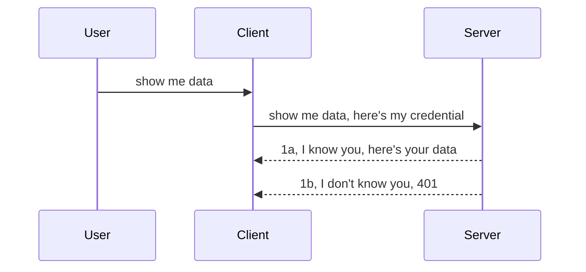

<!--
CO_OP_TRANSLATOR_METADATA:
{
  "original_hash": "5b00b8a8971a07d2d8803be4c9f138f8",
  "translation_date": "2025-10-07T00:48:52+00:00",
  "source_file": "03-GettingStarted/11-simple-auth/README.md",
  "language_code": "tr"
}
-->
# Basit Kimlik Doğrulama

MCP SDK'leri, OAuth 2.1 kullanımını destekler. Ancak dürüst olmak gerekirse, bu süreç kimlik doğrulama sunucusu, kaynak sunucusu, kimlik bilgilerini gönderme, bir kod alma, kodu bir taşıyıcı token ile değiştirme gibi kavramları içeren oldukça karmaşık bir süreçtir. OAuth kullanmaya alışkın değilseniz, ki bu harika bir şeydir, temel bir kimlik doğrulama seviyesiyle başlamak ve güvenliği adım adım geliştirmek iyi bir fikirdir. İşte bu bölüm bu yüzden var; sizi daha gelişmiş kimlik doğrulama yöntemlerine hazırlamak için.

## Kimlik Doğrulama, Ne Demek İstiyoruz?

Kimlik doğrulama, "authentication" ve "authorization" kelimelerinin kısaltmasıdır. Burada iki şeyi yapmamız gerekiyor:

- **Authentication**: Bir kişinin evimize girip giremeyeceğini, yani kaynak sunucumuza erişim hakkına sahip olup olmadığını belirleme süreci. MCP Sunucusu özelliklerimiz bu kaynak sunucuda bulunur.
- **Authorization**: Kullanıcının talep ettiği belirli kaynaklara erişim hakkı olup olmadığını belirleme süreci. Örneğin, bu siparişlere veya ürünlere erişim izni olup olmadığını veya içeriği okuyup okuyamayacağını ama silemeyeceğini kontrol etme.

## Kimlik Bilgileri: Sisteme Kim Olduğumuzu Nasıl Söyleriz?

Çoğu web geliştiricisi, genellikle bir kimlik bilgisi sağlayarak sunucuya kimlik doğrulama yapmayı düşünür. Bu kimlik bilgisi genellikle kullanıcı adı ve şifrenin base64 kodlanmış bir versiyonu veya belirli bir kullanıcıyı benzersiz şekilde tanımlayan bir API anahtarıdır.

Bu kimlik bilgisi, "Authorization" adlı bir başlık aracılığıyla şu şekilde gönderilir:

```json
{ "Authorization": "secret123" }
```

Bu genellikle temel kimlik doğrulama olarak adlandırılır. Genel akış şu şekilde işler:



Artık akış açısından nasıl çalıştığını anladığımıza göre, bunu nasıl uygulayabiliriz? Çoğu web sunucusunda, kimlik bilgilerini doğrulayan ve geçerli ise isteğin devam etmesine izin veren bir "middleware" (ara yazılım) kavramı vardır. Eğer istek geçerli kimlik bilgilerine sahip değilse, bir kimlik doğrulama hatası alırsınız. Bunun nasıl uygulanabileceğini görelim:

**Python**

```python
class AuthMiddleware(BaseHTTPMiddleware):
    async def dispatch(self, request, call_next):

        has_header = request.headers.get("Authorization")
        if not has_header:
            print("-> Missing Authorization header!")
            return Response(status_code=401, content="Unauthorized")

        if not valid_token(has_header):
            print("-> Invalid token!")
            return Response(status_code=403, content="Forbidden")

        print("Valid token, proceeding...")
       
        response = await call_next(request)
        # add any customer headers or change in the response in some way
        return response


starlette_app.add_middleware(CustomHeaderMiddleware)
```

Burada:

- Web sunucusu tarafından çağrılan `dispatch` metoduna sahip bir `AuthMiddleware` ara yazılımı oluşturduk.
- Ara yazılımı web sunucusuna ekledik:

    ```python
    starlette_app.add_middleware(AuthMiddleware)
    ```

- Authorization başlığının mevcut olup olmadığını ve gönderilen gizli bilginin geçerli olup olmadığını kontrol eden doğrulama mantığını yazdık:

    ```python
    has_header = request.headers.get("Authorization")
    if not has_header:
        print("-> Missing Authorization header!")
        return Response(status_code=401, content="Unauthorized")

    if not valid_token(has_header):
        print("-> Invalid token!")
        return Response(status_code=403, content="Forbidden")
    ```

    Eğer gizli bilgi mevcut ve geçerli ise, isteğin devam etmesine izin veririz ve `call_next` çağrılır, ardından yanıt döner.

    ```python
    response = await call_next(request)
    # add any customer headers or change in the response in some way
    return response
    ```

Bu, bir web isteği sunucuya yapıldığında ara yazılımın çağrılacağı ve uygulamasına bağlı olarak isteğin devam etmesine izin vereceği veya istemcinin devam etmesine izin verilmediğini belirten bir hata döndüreceği anlamına gelir.

**TypeScript**

Burada popüler Express framework'ü ile bir ara yazılım oluşturuyoruz ve isteği MCP Sunucusuna ulaşmadan önce kesiyoruz. İşte bunun için kod:

```typescript
function isValid(secret) {
    return secret === "secret123";
}

app.use((req, res, next) => {
    // 1. Authorization header present?  
    if(!req.headers["Authorization"]) {
        res.status(401).send('Unauthorized');
    }
    
    let token = req.headers["Authorization"];

    // 2. Check validity.
    if(!isValid(token)) {
        res.status(403).send('Forbidden');
    }

   
    console.log('Middleware executed');
    // 3. Passes request to the next step in the request pipeline.
    next();
});
```

Bu kodda:

1. Authorization başlığının mevcut olup olmadığını kontrol ediyoruz, eğer yoksa 401 hatası gönderiyoruz.
2. Kimlik bilgisi/token geçerli mi kontrol ediyoruz, eğer değilse 403 hatası gönderiyoruz.
3. Son olarak isteği işlem hattında devam ettiriyor ve talep edilen kaynağı döndürüyoruz.

## Alıştırma: Kimlik Doğrulama Uygulama

Bilgimizi alalım ve uygulamaya çalışalım. İşte plan:

Sunucu

- Bir web sunucusu ve MCP örneği oluşturun.
- Sunucu için bir ara yazılım uygulayın.

İstemci 

- Kimlik bilgisi ile birlikte bir web isteği gönderin, başlık üzerinden.

### -1- Bir Web Sunucusu ve MCP Örneği Oluşturma

İlk adımda, web sunucusu örneğini ve MCP Sunucusunu oluşturmamız gerekiyor.

**Python**

Burada bir MCP sunucu örneği oluşturuyoruz, bir starlette web uygulaması oluşturuyoruz ve bunu uvicorn ile barındırıyoruz.

```python
# creating MCP Server

app = FastMCP(
    name="MCP Resource Server",
    instructions="Resource Server that validates tokens via Authorization Server introspection",
    host=settings["host"],
    port=settings["port"],
    debug=True
)

# creating starlette web app
starlette_app = app.streamable_http_app()

# serving app via uvicorn
async def run(starlette_app):
    import uvicorn
    config = uvicorn.Config(
            starlette_app,
            host=app.settings.host,
            port=app.settings.port,
            log_level=app.settings.log_level.lower(),
        )
    server = uvicorn.Server(config)
    await server.serve()

run(starlette_app)
```

Bu kodda:

- MCP Sunucusunu oluşturuyoruz.
- MCP Sunucusundan starlette web uygulamasını oluşturuyoruz, `app.streamable_http_app()`.
- Web uygulamasını uvicorn ile barındırıyor ve sunuyoruz `server.serve()`.

**TypeScript**

Burada bir MCP Sunucu örneği oluşturuyoruz.

```typescript
const server = new McpServer({
      name: "example-server",
      version: "1.0.0"
    });

    // ... set up server resources, tools, and prompts ...
```

Bu MCP Sunucu oluşturma işlemi, POST /mcp rota tanımımızın içinde gerçekleşmelidir, bu yüzden yukarıdaki kodu şu şekilde taşıyoruz:

```typescript
import express from "express";
import { randomUUID } from "node:crypto";
import { McpServer } from "@modelcontextprotocol/sdk/server/mcp.js";
import { StreamableHTTPServerTransport } from "@modelcontextprotocol/sdk/server/streamableHttp.js";
import { isInitializeRequest } from "@modelcontextprotocol/sdk/types.js"

const app = express();
app.use(express.json());

// Map to store transports by session ID
const transports: { [sessionId: string]: StreamableHTTPServerTransport } = {};

// Handle POST requests for client-to-server communication
app.post('/mcp', async (req, res) => {
  // Check for existing session ID
  const sessionId = req.headers['mcp-session-id'] as string | undefined;
  let transport: StreamableHTTPServerTransport;

  if (sessionId && transports[sessionId]) {
    // Reuse existing transport
    transport = transports[sessionId];
  } else if (!sessionId && isInitializeRequest(req.body)) {
    // New initialization request
    transport = new StreamableHTTPServerTransport({
      sessionIdGenerator: () => randomUUID(),
      onsessioninitialized: (sessionId) => {
        // Store the transport by session ID
        transports[sessionId] = transport;
      },
      // DNS rebinding protection is disabled by default for backwards compatibility. If you are running this server
      // locally, make sure to set:
      // enableDnsRebindingProtection: true,
      // allowedHosts: ['127.0.0.1'],
    });

    // Clean up transport when closed
    transport.onclose = () => {
      if (transport.sessionId) {
        delete transports[transport.sessionId];
      }
    };
    const server = new McpServer({
      name: "example-server",
      version: "1.0.0"
    });

    // ... set up server resources, tools, and prompts ...

    // Connect to the MCP server
    await server.connect(transport);
  } else {
    // Invalid request
    res.status(400).json({
      jsonrpc: '2.0',
      error: {
        code: -32000,
        message: 'Bad Request: No valid session ID provided',
      },
      id: null,
    });
    return;
  }

  // Handle the request
  await transport.handleRequest(req, res, req.body);
});

// Reusable handler for GET and DELETE requests
const handleSessionRequest = async (req: express.Request, res: express.Response) => {
  const sessionId = req.headers['mcp-session-id'] as string | undefined;
  if (!sessionId || !transports[sessionId]) {
    res.status(400).send('Invalid or missing session ID');
    return;
  }
  
  const transport = transports[sessionId];
  await transport.handleRequest(req, res);
};

// Handle GET requests for server-to-client notifications via SSE
app.get('/mcp', handleSessionRequest);

// Handle DELETE requests for session termination
app.delete('/mcp', handleSessionRequest);

app.listen(3000);
```

Şimdi MCP Sunucu oluşturmanın `app.post("/mcp")` içinde nasıl taşındığını görebilirsiniz.

Gelen kimlik bilgilerini doğrulamak için ara yazılım oluşturma adımına geçelim.

### -2- Sunucu için Bir Ara Yazılım Uygulama

Şimdi ara yazılım kısmına geçelim. Burada `Authorization` başlığında bir kimlik bilgisi arayan ve bunu doğrulayan bir ara yazılım oluşturacağız. Kabul edilebilir ise, istek devam eder ve gereken işlemi yapar (örneğin araçları listeleme, bir kaynağı okuma veya istemcinin talep ettiği herhangi bir MCP işlevi).

**Python**

Ara yazılım oluşturmak için `BaseHTTPMiddleware` sınıfından türeyen bir sınıf oluşturmamız gerekiyor. İki ilginç parça var:

- İstek `request`, başlık bilgilerini okuduğumuz yer.
- `call_next`, istemcinin kabul ettiğimiz bir kimlik bilgisi getirdiği durumda çağırmamız gereken geri çağırma.

İlk olarak, `Authorization` başlığı eksikse durumu ele almamız gerekiyor:

```python
has_header = request.headers.get("Authorization")

# no header present, fail with 401, otherwise move on.
if not has_header:
    print("-> Missing Authorization header!")
    return Response(status_code=401, content="Unauthorized")
```

Burada istemci kimlik doğrulamada başarısız olduğu için 401 yetkisiz mesajı gönderiyoruz.

Sonra, bir kimlik bilgisi gönderildiyse, geçerliliğini şu şekilde kontrol etmemiz gerekiyor:

```python
 if not valid_token(has_header):
    print("-> Invalid token!")
    return Response(status_code=403, content="Forbidden")
```

Yukarıda 403 yasak mesajı gönderdiğimize dikkat edin. Aşağıda her şeyi uygulayan tam ara yazılımı görelim:

```python
class AuthMiddleware(BaseHTTPMiddleware):
    async def dispatch(self, request, call_next):

        has_header = request.headers.get("Authorization")
        if not has_header:
            print("-> Missing Authorization header!")
            return Response(status_code=401, content="Unauthorized")

        if not valid_token(has_header):
            print("-> Invalid token!")
            return Response(status_code=403, content="Forbidden")

        print("Valid token, proceeding...")
        print(f"-> Received {request.method} {request.url}")
        response = await call_next(request)
        response.headers['Custom'] = 'Example'
        return response

```

Harika, ama `valid_token` fonksiyonu ne olacak? İşte aşağıda:

```python
# DON'T use for production - improve it !!
def valid_token(token: str) -> bool:
    # remove the "Bearer " prefix
    if token.startswith("Bearer "):
        token = token[7:]
        return token == "secret-token"
    return False
```

Bu kesinlikle geliştirilmeli.

ÖNEMLİ: Kodda bu tür gizli bilgiler ASLA bulunmamalıdır. Karşılaştırılacak değeri bir veri kaynağından veya bir IDP'den (kimlik hizmeti sağlayıcısı) almanız veya daha iyisi, doğrulamayı IDP'nin yapmasına izin vermeniz gerekir.

**TypeScript**

Bunu Express ile uygulamak için, ara yazılım fonksiyonlarını alan `use` metodunu çağırmamız gerekiyor.

Şunları yapmamız gerekiyor:

- İstek değişkeni ile etkileşim kurarak `Authorization` özelliğinde geçen kimlik bilgilerini kontrol edin.
- Kimlik bilgilerini doğrulayın ve eğer geçerliyse, isteğin devam etmesine izin verin ve istemcinin MCP isteğinin gereken işlemi yapmasına izin verin (örneğin araçları listeleme, kaynağı okuma veya MCP ile ilgili herhangi bir şey).

Burada, `Authorization` başlığının mevcut olup olmadığını kontrol ediyoruz ve eğer değilse, isteğin devam etmesini durduruyoruz:

```typescript
if(!req.headers["authorization"]) {
    res.status(401).send('Unauthorized');
    return;
}
```

Başlık ilk etapta gönderilmezse, 401 alırsınız.

Sonra, kimlik bilgisi geçerli mi kontrol ediyoruz, eğer değilse, yine isteği durduruyoruz ama biraz farklı bir mesajla:

```typescript
if(!isValid(token)) {
    res.status(403).send('Forbidden');
    return;
} 
```

Şimdi 403 hatası aldığınıza dikkat edin.

İşte tam kod:

```typescript
app.use((req, res, next) => {
    console.log('Request received:', req.method, req.url, req.headers);
    console.log('Headers:', req.headers["authorization"]);
    if(!req.headers["authorization"]) {
        res.status(401).send('Unauthorized');
        return;
    }
    
    let token = req.headers["authorization"];

    if(!isValid(token)) {
        res.status(403).send('Forbidden');
        return;
    }  

    console.log('Middleware executed');
    next();
});
```

Web sunucusunu, istemcinin umarız bize gönderdiği kimlik bilgilerini kontrol eden bir ara yazılım kabul edecek şekilde ayarladık. Peki ya istemcinin kendisi?

### -3- Kimlik Bilgisi ile Web İsteği Gönderme

İstemcinin kimlik bilgilerini başlık üzerinden ilettiğinden emin olmamız gerekiyor. MCP istemcisini kullanacağımız için, bunun nasıl yapıldığını anlamamız gerekiyor.

**Python**

İstemci için, başlık ile kimlik bilgisi göndermemiz gerekiyor, şu şekilde:

```python
# DON'T hardcode the value, have it at minimum in an environment variable or a more secure storage
token = "secret-token"

async with streamablehttp_client(
        url = f"http://localhost:{port}/mcp",
        headers = {"Authorization": f"Bearer {token}"}
    ) as (
        read_stream,
        write_stream,
        session_callback,
    ):
        async with ClientSession(
            read_stream,
            write_stream
        ) as session:
            await session.initialize()
      
            # TODO, what you want done in the client, e.g list tools, call tools etc.
```

`headers` özelliğini şu şekilde doldurduğumuza dikkat edin: `headers = {"Authorization": f"Bearer {token}"}`.

**TypeScript**

Bunu iki adımda çözebiliriz:

1. Kimlik bilgisi ile bir yapılandırma nesnesi oluşturun.
2. Yapılandırma nesnesini taşıyıcıya iletin.

```typescript

// DON'T hardcode the value like shown here. At minimum have it as a env variable and use something like dotenv (in dev mode).
let token = "secret123"

// define a client transport option object
let options: StreamableHTTPClientTransportOptions = {
  sessionId: sessionId,
  requestInit: {
    headers: {
      "Authorization": "secret123"
    }
  }
};

// pass the options object to the transport
async function main() {
   const transport = new StreamableHTTPClientTransport(
      new URL(serverUrl),
      options
   );
```

Yukarıda, bir `options` nesnesi oluşturup başlıklarımızı `requestInit` özelliği altında nasıl yerleştirdiğimizi görebilirsiniz.

ÖNEMLİ: Peki buradan nasıl geliştirebiliriz? Mevcut uygulamanın bazı sorunları var. İlk olarak, bu şekilde kimlik bilgisi göndermek oldukça risklidir, en azından HTTPS kullanmadığınız sürece. Hatta HTTPS olsa bile, kimlik bilgisi çalınabilir, bu yüzden token'ı kolayca iptal edebileceğiniz ve ek kontroller ekleyebileceğiniz bir sisteme ihtiyacınız var. Örneğin, nereden geldiği, isteğin çok sık olup olmadığı (bot benzeri davranış) gibi. Kısacası, bir dizi endişe var.

Ancak, çok basit API'ler için kimlik doğrulama olmadan kimsenin API'nizi çağırmasını istemediğiniz durumlarda, burada sahip olduğumuz şey iyi bir başlangıçtır.

Bununla birlikte, güvenliği biraz daha sağlamlaştırmaya çalışalım ve JSON Web Token (JWT) gibi standart bir format kullanalım.

## JSON Web Token'lar, JWT

Yani, çok basit kimlik bilgileri göndermekten daha iyi bir şey yapmaya çalışıyoruz. JWT'yi benimseyerek elde ettiğimiz anlık iyileştirmeler nelerdir?

- **Güvenlik iyileştirmeleri**. Temel kimlik doğrulamada, kullanıcı adı ve şifreyi base64 kodlanmış bir token olarak (veya bir API anahtarı) tekrar tekrar gönderirsiniz, bu da riski artırır. JWT ile, kullanıcı adınızı ve şifrenizi gönderirsiniz ve karşılığında bir token alırsınız, ayrıca bu token zaman sınırlıdır, yani süresi dolacaktır. JWT, roller, kapsamlar ve izinler kullanarak ince ayarlı erişim kontrolünü kolayca sağlar.
- **Durumsuzluk ve ölçeklenebilirlik**. JWT'ler kendi kendine yeterlidir, tüm kullanıcı bilgilerini taşır ve sunucu tarafında oturum depolama ihtiyacını ortadan kaldırır. Token ayrıca yerel olarak doğrulanabilir.
- **Uyumluluk ve federasyon**. JWT'ler Open ID Connect'in merkezindedir ve Entra ID, Google Identity ve Auth0 gibi bilinen kimlik sağlayıcıları ile kullanılır. Ayrıca tek oturum açma ve çok daha fazlasını mümkün kılar, bu da onu kurumsal düzeyde yapar.
- **Modülerlik ve esneklik**. JWT'ler ayrıca Azure API Management, NGINX ve daha fazlası gibi API Geçitleri ile kullanılabilir. Ayrıca kimlik doğrulama senaryolarını ve sunucudan sunucuya iletişimi destekler, buna taklit ve yetkilendirme senaryoları da dahildir.
- **Performans ve önbellekleme**. JWT'ler, kod çözme işleminden sonra önbelleğe alınabilir, bu da ayrıştırma ihtiyacını azaltır. Bu, özellikle yüksek trafikli uygulamalarda verimliliği artırır ve seçtiğiniz altyapıya olan yükü azaltır.
- **Gelişmiş özellikler**. Ayrıca introspection (geçerliliği sunucuda kontrol etme) ve revocation (token'ı geçersiz kılma) destekler.

Tüm bu avantajlarla, uygulamamızı bir sonraki seviyeye nasıl taşıyabileceğimizi görelim.

## Temel Kimlik Doğrulamayı JWT'ye Dönüştürme

Yapmamız gereken değişiklikler genel olarak şunlardır:

- **Bir JWT token oluşturmayı öğrenin** ve bunu istemciden sunucuya gönderilmeye hazır hale getirin.
- **Bir JWT token doğrulayın**, ve eğer geçerliyse, istemcinin kaynaklarımıza erişmesine izin verin.
- **Token depolama güvenliği**. Bu token'ı nasıl saklayacağımız.
- **Rotaları koruyun**. Rotaları ve belirli MCP özelliklerini korumamız gerekiyor.
- **Yenileme token'ları ekleyin**. Kısa ömürlü token'lar oluşturduğumuzdan emin olun, ancak uzun ömürlü yenileme token'ları da ekleyin, böylece token'lar süresi dolarsa yeni token'lar alabilirsiniz. Ayrıca bir yenileme uç noktası ve bir döndürme stratejisi ekleyin.

### -1- Bir JWT Token Oluşturma

Öncelikle, bir JWT token şu parçalara sahiptir:

- **header**, kullanılan algoritma ve token türü.
- **payload**, iddialar, örneğin sub (token'ın temsil ettiği kullanıcı veya varlık. Bir kimlik doğrulama senaryosunda bu genellikle kullanıcı kimliği), exp (ne zaman süresi dolacağı), role (rol).
- **signature**, bir gizli anahtar veya özel anahtar ile imzalanır.

Bunun için başlık, yük ve kodlanmış token'ı oluşturmamız gerekiyor.

**Python**

```python

import jwt
import jwt
from jwt.exceptions import ExpiredSignatureError, InvalidTokenError
import datetime

# Secret key used to sign the JWT
secret_key = 'your-secret-key'

header = {
    "alg": "HS256",
    "typ": "JWT"
}

# the user info andits claims and expiry time
payload = {
    "sub": "1234567890",               # Subject (user ID)
    "name": "User Userson",                # Custom claim
    "admin": True,                     # Custom claim
    "iat": datetime.datetime.utcnow(),# Issued at
    "exp": datetime.datetime.utcnow() + datetime.timedelta(hours=1)  # Expiry
}

# encode it
encoded_jwt = jwt.encode(payload, secret_key, algorithm="HS256", headers=header)
```

Yukarıdaki kodda:

- HS256 algoritmasını ve türü JWT olarak tanımlayarak bir başlık oluşturduk.
- Bir konu veya kullanıcı kimliği, bir kullanıcı adı, bir rol, ne zaman oluşturulduğu ve ne zaman süresinin dolacağı gibi iddialar içeren bir yük oluşturduk, böylece daha önce bahsettiğimiz zaman sınırlı yönü uyguladık.

**TypeScript**

Burada JWT token oluşturmak için bazı bağımlılıklara ihtiyacımız olacak.

Bağımlılıklar

```sh

npm install jsonwebtoken
npm install --save-dev @types/jsonwebtoken
```

Şimdi bunu yerine koyduğumuza göre, başlık, yük ve bunun üzerinden kodlanmış token'ı oluşturalım.

```typescript
import jwt from 'jsonwebtoken';

const secretKey = 'your-secret-key'; // Use env vars in production

// Define the payload
const payload = {
  sub: '1234567890',
  name: 'User usersson',
  admin: true,
  iat: Math.floor(Date.now() / 1000), // Issued at
  exp: Math.floor(Date.now() / 1000) + 60 * 60 // Expires in 1 hour
};

// Define the header (optional, jsonwebtoken sets defaults)
const header = {
  alg: 'HS256',
  typ: 'JWT'
};

// Create the token
const token = jwt.sign(payload, secretKey, {
  algorithm: 'HS256',
  header: header
});

console.log('JWT:', token);
```

Bu token:

HS256 kullanılarak imzalanmıştır.
1 saat boyunca geçerlidir.
sub, name, admin, iat ve exp gibi iddialar içerir.

### -2- Bir Token'ı Doğrulama

Bir token'ı doğrulamamız gerekiyor, bu istemcinin bize gönderdiği şeyin gerçekten geçerli olup olmadığını kontrol etmek için sunucuda yapılmalıdır. Burada yapmamız gereken birçok kontrol var, yapısından geçerliliğine kadar. Ayrıca, kullanıcı sisteminizde var mı ve daha fazlasını kontrol etmek için ek kontroller eklemeniz önerilir.

Bir token'ı doğrulamak için, onu çözmemiz ve ardından geçerliliğini kontrol etmeye başlamamız gerekiyor:

**Python**

```python

# Decode and verify the JWT
try:
    decoded = jwt.decode(token, secret_key, algorithms=["HS256"])
    print("✅ Token is valid.")
    print("Decoded claims:")
    for key, value in decoded.items():
        print(f"  {key}: {value}")
except ExpiredSignatureError:
    print("❌ Token has expired.")
except InvalidTokenError as e:
    print(f"❌ Invalid token: {e}")

```

Bu kodda, token, gizli anahtar ve seçilen algoritmayı girdi olarak kullanarak `jwt.decode` çağırıyoruz. Bir doğrulama başarısızlığı, bir hata yükseltilmesine neden olur, bu yüzden bir try-catch yapısı kullanıyoruz.

**TypeScript**

Burada `jwt.verify` çağırmamız gerekiyor, böylece token'ın kod çözülmüş bir versiyonunu alabiliriz ve bunu daha fazla analiz edebiliriz. Bu çağrı başarısız olursa, bu token'ın yapısının yanlış olduğu veya artık geçerli olmadığı anlamına gelir.

```typescript

try {
  const decoded = jwt.verify(token, secretKey);
  console.log('Decoded Payload:', decoded);
} catch (err) {
  console.error('Token verification failed:', err);
}
```

NOT: Daha önce belirtildiği gibi, bu token'ın sisteminizde bir kullanıcıya işaret ettiğinden emin olmak ve kullanıcının iddia ettiği haklara sahip olduğundan emin olmak için ek kontroller yapmalısınız.
Sonraki adımda, rol tabanlı erişim kontrolüne, yani RBAC'a göz atalım.

## Rol Tabanlı Erişim Kontrolü Eklemek

Fikir şu: farklı rollerin farklı izinlere sahip olduğunu ifade etmek istiyoruz. Örneğin, bir adminin her şeyi yapabileceğini, normal bir kullanıcının okuma/yazma yapabileceğini ve bir misafirin yalnızca okuma yapabileceğini varsayıyoruz. Bu nedenle, işte bazı olası izin seviyeleri:

- Admin.Write 
- User.Read
- Guest.Read

Şimdi böyle bir kontrolü middleware ile nasıl uygulayabileceğimize bakalım. Middleware'ler hem belirli rotalara hem de tüm rotalara eklenebilir.

**Python**

```python
from starlette.middleware.base import BaseHTTPMiddleware
from starlette.responses import JSONResponse
import jwt

# DON'T have the secret in the code like, this is for demonstration purposes only. Read it from a safe place.
SECRET_KEY = "your-secret-key" # put this in env variable
REQUIRED_PERMISSION = "User.Read"

class JWTPermissionMiddleware(BaseHTTPMiddleware):
    async def dispatch(self, request, call_next):
        auth_header = request.headers.get("Authorization")
        if not auth_header or not auth_header.startswith("Bearer "):
            return JSONResponse({"error": "Missing or invalid Authorization header"}, status_code=401)

        token = auth_header.split(" ")[1]
        try:
            decoded = jwt.decode(token, SECRET_KEY, algorithms=["HS256"])
        except jwt.ExpiredSignatureError:
            return JSONResponse({"error": "Token expired"}, status_code=401)
        except jwt.InvalidTokenError:
            return JSONResponse({"error": "Invalid token"}, status_code=401)

        permissions = decoded.get("permissions", [])
        if REQUIRED_PERMISSION not in permissions:
            return JSONResponse({"error": "Permission denied"}, status_code=403)

        request.state.user = decoded
        return await call_next(request)


```

Middleware eklemenin birkaç farklı yolu vardır, aşağıdaki gibi:

```python

# Alt 1: add middleware while constructing starlette app
middleware = [
    Middleware(JWTPermissionMiddleware)
]

app = Starlette(routes=routes, middleware=middleware)

# Alt 2: add middleware after starlette app is a already constructed
starlette_app.add_middleware(JWTPermissionMiddleware)

# Alt 3: add middleware per route
routes = [
    Route(
        "/mcp",
        endpoint=..., # handler
        middleware=[Middleware(JWTPermissionMiddleware)]
    )
]
```

**TypeScript**

Tüm istekler için çalışacak bir middleware kullanarak `app.use` ile ekleme yapabiliriz.

```typescript
app.use((req, res, next) => {
    console.log('Request received:', req.method, req.url, req.headers);
    console.log('Headers:', req.headers["authorization"]);

    // 1. Check if authorization header has been sent

    if(!req.headers["authorization"]) {
        res.status(401).send('Unauthorized');
        return;
    }
    
    let token = req.headers["authorization"];

    // 2. Check if token is valid
    if(!isValid(token)) {
        res.status(403).send('Forbidden');
        return;
    }  

    // 3. Check if token user exist in our system
    if(!isExistingUser(token)) {
        res.status(403).send('Forbidden');
        console.log("User does not exist");
        return;
    }
    console.log("User exists");

    // 4. Verify the token has the right permissions
    if(!hasScopes(token, ["User.Read"])){
        res.status(403).send('Forbidden - insufficient scopes');
    }

    console.log("User has required scopes");

    console.log('Middleware executed');
    next();
});

```

Middleware'imizin yapabileceği ve yapması GEREKEN birkaç şey var, bunlar:

1. Yetkilendirme başlığının mevcut olup olmadığını kontrol etmek
2. Token geçerli mi kontrol etmek; bunun için JWT tokenının bütünlüğünü ve geçerliliğini kontrol eden `isValid` adlı bir yöntem yazdık.
3. Kullanıcının sistemimizde mevcut olup olmadığını doğrulamak; bunu kontrol etmeliyiz.

   ```typescript
    // users in DB
   const users = [
     "user1",
     "User usersson",
   ]

   function isExistingUser(token) {
     let decodedToken = verifyToken(token);

     // TODO, check if user exists in DB
     return users.includes(decodedToken?.name || "");
   }
   ```

   Yukarıda, çok basit bir `users` listesi oluşturduk, bu liste elbette bir veritabanında olmalı.

4. Ek olarak, tokenın doğru izinlere sahip olup olmadığını da kontrol etmeliyiz.

   ```typescript
   if(!hasScopes(token, ["User.Read"])){
        res.status(403).send('Forbidden - insufficient scopes');
   }
   ```

   Yukarıdaki middleware kodunda, tokenın User.Read iznini içerip içermediğini kontrol ediyoruz; eğer içermiyorsa 403 hatası gönderiyoruz. Aşağıda `hasScopes` yardımcı yöntemini görebilirsiniz.

   ```typescript
   function hasScopes(scope: string, requiredScopes: string[]) {
     let decodedToken = verifyToken(scope);
    return requiredScopes.every(scope => decodedToken?.scopes.includes(scope));
  }
   ```

Have a think which additional checks you should be doing, but these are the absolute minimum of checks you should be doing.

Using Express as a web framework is a common choice. There are helpers library when you use JWT so you can write less code.

- `express-jwt`, helper library that provides a middleware that helps decode your token.
- `express-jwt-permissions`, this provides a middleware `guard` that helps check if a certain permission is on the token.

Here's what these libraries can look like when used:

```typescript
const express = require('express');
const jwt = require('express-jwt');
const guard = require('express-jwt-permissions')();

const app = express();
const secretKey = 'your-secret-key'; // put this in env variable

// Decode JWT and attach to req.user
app.use(jwt({ secret: secretKey, algorithms: ['HS256'] }));

// Check for User.Read permission
app.use(guard.check('User.Read'));

// multiple permissions
// app.use(guard.check(['User.Read', 'Admin.Access']));

app.get('/protected', (req, res) => {
  res.json({ message: `Welcome ${req.user.name}` });
});

// Error handler
app.use((err, req, res, next) => {
  if (err.code === 'permission_denied') {
    return res.status(403).send('Forbidden');
  }
  next(err);
});

```

Şimdi middleware'in hem kimlik doğrulama hem de yetkilendirme için nasıl kullanılabileceğini gördünüz, peki ya MCP? MCP kimlik doğrulama yöntemimizi değiştiriyor mu? Bir sonraki bölümde bunu öğrenelim.

### -3- MCP'ye RBAC Eklemek

Şimdiye kadar middleware ile RBAC eklemenin nasıl yapılabileceğini gördünüz, ancak MCP için her MCP özelliği için RBAC eklemenin kolay bir yolu yok. Peki ne yapıyoruz? Bu durumda, istemcinin belirli bir aracı çağırma hakkına sahip olup olmadığını kontrol eden kod eklememiz gerekiyor:

Belirli bir özellik için RBAC uygulamak için birkaç seçeneğiniz var, işte bunlar:

- İzin seviyesini kontrol etmeniz gereken her araç, kaynak, prompt için bir kontrol ekleyin.

   **Python**

   ```python
   @tool()
   def delete_product(id: int):
      try:
          check_permissions(role="Admin.Write", request)
      catch:
        pass # client failed authorization, raise authorization error
   ```

   **TypeScript**

   ```typescript
   server.registerTool(
    "delete-product",
    {
      title: Delete a product",
      description: "Deletes a product",
      inputSchema: { id: z.number() }
    },
    async ({ id }) => {
      
      try {
        checkPermissions("Admin.Write", request);
        // todo, send id to productService and remote entry
      } catch(Exception e) {
        console.log("Authorization error, you're not allowed");  
      }

      return {
        content: [{ type: "text", text: `Deletected product with id ${id}` }]
      };
    }
   );
   ```


- Daha gelişmiş bir sunucu yaklaşımı ve istek işleyicileri kullanarak kontrol yapmanız gereken yerlerin sayısını en aza indirin.

   **Python**

   ```python
   
   tool_permission = {
      "create_product": ["User.Write", "Admin.Write"],
      "delete_product": ["Admin.Write"]
   }

   def has_permission(user_permissions, required_permissions) -> bool:
      # user_permissions: list of permissions the user has
      # required_permissions: list of permissions required for the tool
      return any(perm in user_permissions for perm in required_permissions)

   @server.call_tool()
   async def handle_call_tool(
     name: str, arguments: dict[str, str] | None
   ) -> list[types.TextContent]:
    # Assume request.user.permissions is a list of permissions for the user
     user_permissions = request.user.permissions
     required_permissions = tool_permission.get(name, [])
     if not has_permission(user_permissions, required_permissions):
        # Raise error "You don't have permission to call tool {name}"
        raise Exception(f"You don't have permission to call tool {name}")
     # carry on and call tool
     # ...
   ```   
   

   **TypeScript**

   ```typescript
   function hasPermission(userPermissions: string[], requiredPermissions: string[]): boolean {
       if (!Array.isArray(userPermissions) || !Array.isArray(requiredPermissions)) return false;
       // Return true if user has at least one required permission
       
       return requiredPermissions.some(perm => userPermissions.includes(perm));
   }
  
   server.setRequestHandler(CallToolRequestSchema, async (request) => {
      const { params: { name } } = request;
  
      let permissions = request.user.permissions;
  
      if (!hasPermission(permissions, toolPermissions[name])) {
         return new Error(`You don't have permission to call ${name}`);
      }
  
      // carry on..
   });
   ```

   Not: Middleware'inizin, isteklerin kullanıcı özelliğine çözülmüş bir token atadığından emin olmanız gerekiyor, böylece yukarıdaki kod basitleştirilmiş olur.

### Özet

Artık genel olarak RBAC desteği ve özellikle MCP için nasıl eklenebileceğini tartıştık, şimdi size sunulan kavramları anladığınızdan emin olmak için güvenliği kendi başınıza uygulamayı deneme zamanı.

## Görev 1: Temel kimlik doğrulama kullanarak bir MCP sunucusu ve MCP istemcisi oluşturun

Burada, kimlik bilgilerini başlıklar aracılığıyla gönderme konusunda öğrendiklerinizi uygulayacaksınız.

## Çözüm 1

[Çözüm 1](./code/basic/README.md)

## Görev 2: Görev 1 çözümünü JWT kullanacak şekilde yükseltin

İlk çözümü alın, ancak bu sefer üzerine geliştirme yapalım. 

Temel Kimlik Doğrulama yerine JWT kullanalım.

## Çözüm 2

[Çözüm 2](./solution/jwt-solution/README.md)

## Zorluk

"Add RBAC to MCP" bölümünde açıklanan şekilde her araç için RBAC ekleyin.

## Özet

Bu bölümde, güvenlikten hiç olmamasından başlayarak, temel güvenliğe, JWT'ye ve bunun MCP'ye nasıl eklenebileceğine kadar birçok şey öğrendiğinizi umuyoruz.

Özel JWT'lerle sağlam bir temel oluşturduk, ancak ölçeklendikçe standartlara dayalı bir kimlik modeli benimsemeye doğru ilerliyoruz. Entra veya Keycloak gibi bir IdP benimsemek, token oluşturma, doğrulama ve yaşam döngüsü yönetimini güvenilir bir platforma devretmemize olanak tanır — böylece uygulama mantığına ve kullanıcı deneyimine odaklanabiliriz.

Bunun için daha [ileri düzey bir Entra bölümü](../../05-AdvancedTopics/mcp-security-entra/README.md) var.

---

**Feragatname**:  
Bu belge, AI çeviri hizmeti [Co-op Translator](https://github.com/Azure/co-op-translator) kullanılarak çevrilmiştir. Doğruluk için çaba göstersek de, otomatik çevirilerin hata veya yanlışlık içerebileceğini lütfen unutmayın. Belgenin orijinal dili, yetkili kaynak olarak kabul edilmelidir. Kritik bilgiler için profesyonel insan çevirisi önerilir. Bu çevirinin kullanımından kaynaklanan yanlış anlamalar veya yanlış yorumlamalar için sorumluluk kabul etmiyoruz.