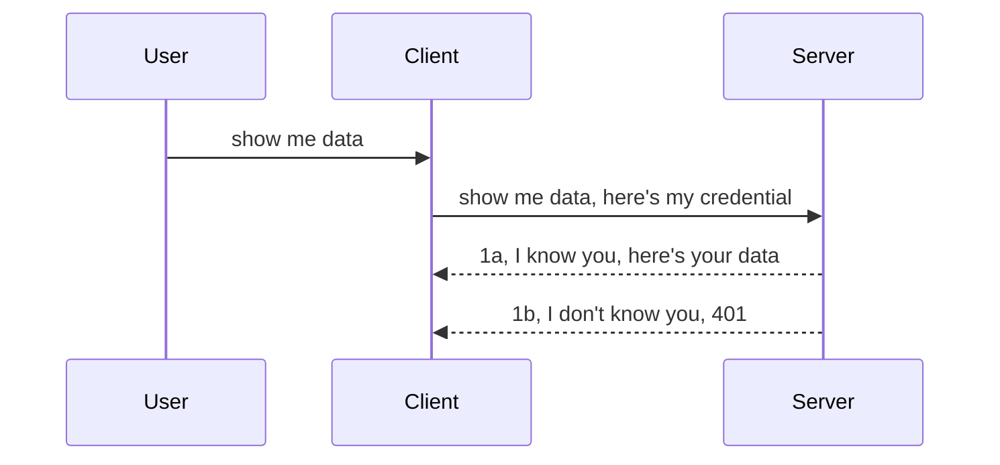

<!--
CO_OP_TRANSLATOR_METADATA:
{
  "original_hash": "5b00b8a8971a07d2d8803be4c9f138f8",
  "translation_date": "2025-10-07T01:09:07+00:00",
  "source_file": "03-GettingStarted/11-simple-auth/README.md",
  "language_code": "uk"
}
-->
# Простий авторизаційний механізм

MCP SDK підтримує використання OAuth 2.1, що, чесно кажучи, є досить складним процесом, який включає такі поняття, як сервер авторизації, сервер ресурсів, надсилання облікових даних, отримання коду, обмін коду на маркер доступу, поки ви нарешті не отримаєте дані ресурсу. Якщо ви не знайомі з OAuth, який є чудовим механізмом для впровадження, варто почати з базового рівня авторизації та поступово переходити до більш складних рівнів безпеки. Саме для цього існує цей розділ — щоб допомогти вам перейти до більш просунутих методів авторизації.

## Що ми маємо на увазі під авторизацією?

Авторизація — це скорочення від автентифікації та авторизації. Ідея полягає в тому, що нам потрібно виконати дві речі:

- **Автентифікація** — це процес визначення, чи дозволимо ми людині увійти до нашого "будинку", тобто чи має вона право бути "тут", тобто отримати доступ до нашого серверу ресурсів, де знаходяться функції MCP Server.
- **Авторизація** — це процес визначення, чи має користувач доступ до конкретних ресурсів, які він запитує, наприклад, до певних замовлень або продуктів, або чи дозволено йому лише читати вміст, але не видаляти його, як інший приклад.

## Облікові дані: як ми повідомляємо системі, хто ми є

Більшість веб-розробників зазвичай думають про надання облікових даних серверу, зазвичай секрету, який підтверджує, що вони мають право бути тут ("автентифікація"). Ці облікові дані зазвичай є закодованою у форматі base64 версією імені користувача та пароля або ключем API, який унікально ідентифікує конкретного користувача.

Це передбачає надсилання через заголовок "Authorization", наприклад:

```json
{ "Authorization": "secret123" }
```

Це зазвичай називається базовою автентифікацією. Загальний процес виглядає наступним чином:



Тепер, коли ми розуміємо, як це працює з точки зору процесу, як це реалізувати? Більшість веб-серверів мають концепцію, яка називається middleware — шматок коду, який виконується як частина запиту, що може перевірити облікові дані, і якщо вони дійсні, дозволити запиту пройти. Якщо запит не має дійсних облікових даних, ви отримуєте помилку авторизації. Давайте подивимося, як це можна реалізувати:

**Python**

```python
class AuthMiddleware(BaseHTTPMiddleware):
    async def dispatch(self, request, call_next):

        has_header = request.headers.get("Authorization")
        if not has_header:
            print("-> Missing Authorization header!")
            return Response(status_code=401, content="Unauthorized")

        if not valid_token(has_header):
            print("-> Invalid token!")
            return Response(status_code=403, content="Forbidden")

        print("Valid token, proceeding...")
       
        response = await call_next(request)
        # add any customer headers or change in the response in some way
        return response


starlette_app.add_middleware(CustomHeaderMiddleware)
```

Тут ми:

- Створили middleware під назвою `AuthMiddleware`, метод `dispatch` якого викликається веб-сервером.
- Додали middleware до веб-сервера:

    ```python
    starlette_app.add_middleware(AuthMiddleware)
    ```

- Написали логіку перевірки, яка перевіряє, чи присутній заголовок Authorization і чи є секрет, що надсилається, дійсним:

    ```python
    has_header = request.headers.get("Authorization")
    if not has_header:
        print("-> Missing Authorization header!")
        return Response(status_code=401, content="Unauthorized")

    if not valid_token(has_header):
        print("-> Invalid token!")
        return Response(status_code=403, content="Forbidden")
    ```

    якщо секрет присутній і дійсний, ми дозволяємо запиту пройти, викликаючи `call_next`, і повертаємо відповідь.

    ```python
    response = await call_next(request)
    # add any customer headers or change in the response in some way
    return response
    ```

Як це працює: якщо веб-запит надсилається до сервера, middleware буде викликано, і залежно від його реалізації він або дозволить запиту пройти, або поверне помилку, яка вказує, що клієнту не дозволено продовжувати.

**TypeScript**

Тут ми створюємо middleware за допомогою популярного фреймворку Express і перехоплюємо запит перед тим, як він досягне MCP Server. Ось код:

```typescript
function isValid(secret) {
    return secret === "secret123";
}

app.use((req, res, next) => {
    // 1. Authorization header present?  
    if(!req.headers["Authorization"]) {
        res.status(401).send('Unauthorized');
    }
    
    let token = req.headers["Authorization"];

    // 2. Check validity.
    if(!isValid(token)) {
        res.status(403).send('Forbidden');
    }

   
    console.log('Middleware executed');
    // 3. Passes request to the next step in the request pipeline.
    next();
});
```

У цьому коді ми:

1. Перевіряємо, чи присутній заголовок Authorization, якщо ні, надсилаємо помилку 401.
2. Переконуємося, що облікові дані/токен дійсні, якщо ні, надсилаємо помилку 403.
3. Нарешті, передаємо запит у конвеєр запитів і повертаємо запитаний ресурс.

## Вправа: Реалізуйте автентифікацію

Давайте використаємо наші знання і спробуємо реалізувати це. Ось план:

Сервер

- Створіть веб-сервер і екземпляр MCP.
- Реалізуйте middleware для сервера.

Клієнт 

- Надішліть веб-запит з обліковими даними через заголовок.

### -1- Створіть веб-сервер і екземпляр MCP

На першому етапі нам потрібно створити екземпляр веб-сервера та MCP Server.

**Python**

Тут ми створюємо екземпляр MCP Server, створюємо веб-додаток starlette і розміщуємо його за допомогою uvicorn.

```python
# creating MCP Server

app = FastMCP(
    name="MCP Resource Server",
    instructions="Resource Server that validates tokens via Authorization Server introspection",
    host=settings["host"],
    port=settings["port"],
    debug=True
)

# creating starlette web app
starlette_app = app.streamable_http_app()

# serving app via uvicorn
async def run(starlette_app):
    import uvicorn
    config = uvicorn.Config(
            starlette_app,
            host=app.settings.host,
            port=app.settings.port,
            log_level=app.settings.log_level.lower(),
        )
    server = uvicorn.Server(config)
    await server.serve()

run(starlette_app)
```

У цьому коді ми:

- Створюємо MCP Server.
- Конструюємо веб-додаток starlette з MCP Server, `app.streamable_http_app()`.
- Розміщуємо та запускаємо веб-додаток за допомогою uvicorn `server.serve()`.

**TypeScript**

Тут ми створюємо екземпляр MCP Server.

```typescript
const server = new McpServer({
      name: "example-server",
      version: "1.0.0"
    });

    // ... set up server resources, tools, and prompts ...
```

Це створення MCP Server потрібно виконати в межах визначення маршруту POST /mcp, тому давайте перемістимо наведений вище код так:

```typescript
import express from "express";
import { randomUUID } from "node:crypto";
import { McpServer } from "@modelcontextprotocol/sdk/server/mcp.js";
import { StreamableHTTPServerTransport } from "@modelcontextprotocol/sdk/server/streamableHttp.js";
import { isInitializeRequest } from "@modelcontextprotocol/sdk/types.js"

const app = express();
app.use(express.json());

// Map to store transports by session ID
const transports: { [sessionId: string]: StreamableHTTPServerTransport } = {};

// Handle POST requests for client-to-server communication
app.post('/mcp', async (req, res) => {
  // Check for existing session ID
  const sessionId = req.headers['mcp-session-id'] as string | undefined;
  let transport: StreamableHTTPServerTransport;

  if (sessionId && transports[sessionId]) {
    // Reuse existing transport
    transport = transports[sessionId];
  } else if (!sessionId && isInitializeRequest(req.body)) {
    // New initialization request
    transport = new StreamableHTTPServerTransport({
      sessionIdGenerator: () => randomUUID(),
      onsessioninitialized: (sessionId) => {
        // Store the transport by session ID
        transports[sessionId] = transport;
      },
      // DNS rebinding protection is disabled by default for backwards compatibility. If you are running this server
      // locally, make sure to set:
      // enableDnsRebindingProtection: true,
      // allowedHosts: ['127.0.0.1'],
    });

    // Clean up transport when closed
    transport.onclose = () => {
      if (transport.sessionId) {
        delete transports[transport.sessionId];
      }
    };
    const server = new McpServer({
      name: "example-server",
      version: "1.0.0"
    });

    // ... set up server resources, tools, and prompts ...

    // Connect to the MCP server
    await server.connect(transport);
  } else {
    // Invalid request
    res.status(400).json({
      jsonrpc: '2.0',
      error: {
        code: -32000,
        message: 'Bad Request: No valid session ID provided',
      },
      id: null,
    });
    return;
  }

  // Handle the request
  await transport.handleRequest(req, res, req.body);
});

// Reusable handler for GET and DELETE requests
const handleSessionRequest = async (req: express.Request, res: express.Response) => {
  const sessionId = req.headers['mcp-session-id'] as string | undefined;
  if (!sessionId || !transports[sessionId]) {
    res.status(400).send('Invalid or missing session ID');
    return;
  }
  
  const transport = transports[sessionId];
  await transport.handleRequest(req, res);
};

// Handle GET requests for server-to-client notifications via SSE
app.get('/mcp', handleSessionRequest);

// Handle DELETE requests for session termination
app.delete('/mcp', handleSessionRequest);

app.listen(3000);
```

Тепер ви бачите, як створення MCP Server було переміщено в межі `app.post("/mcp")`.

Перейдемо до наступного етапу створення middleware, щоб ми могли перевірити вхідні облікові дані.

### -2- Реалізуйте middleware для сервера

Давайте перейдемо до частини middleware. Тут ми створимо middleware, який шукає облікові дані в заголовку `Authorization` і перевіряє їх. Якщо вони прийнятні, запит продовжить виконувати те, що потрібно (наприклад, перелік інструментів, читання ресурсу або будь-яка функціональність MCP, яку запитує клієнт).

**Python**

Щоб створити middleware, нам потрібно створити клас, який успадковує `BaseHTTPMiddleware`. Є два цікаві аспекти:

- Запит `request`, з якого ми читаємо інформацію заголовка.
- `call_next` — зворотний виклик, який ми повинні викликати, якщо клієнт надав облікові дані, які ми приймаємо.

Спочатку нам потрібно обробити випадок, якщо заголовок `Authorization` відсутній:

```python
has_header = request.headers.get("Authorization")

# no header present, fail with 401, otherwise move on.
if not has_header:
    print("-> Missing Authorization header!")
    return Response(status_code=401, content="Unauthorized")
```

Тут ми надсилаємо повідомлення 401 Unauthorized, оскільки клієнт не пройшов автентифікацію.

Далі, якщо облікові дані були надані, нам потрібно перевірити їх дійсність, як показано нижче:

```python
 if not valid_token(has_header):
    print("-> Invalid token!")
    return Response(status_code=403, content="Forbidden")
```

Зверніть увагу, як ми надсилаємо повідомлення 403 Forbidden вище. Давайте подивимося на повний middleware, який реалізує все, що ми згадували вище:

```python
class AuthMiddleware(BaseHTTPMiddleware):
    async def dispatch(self, request, call_next):

        has_header = request.headers.get("Authorization")
        if not has_header:
            print("-> Missing Authorization header!")
            return Response(status_code=401, content="Unauthorized")

        if not valid_token(has_header):
            print("-> Invalid token!")
            return Response(status_code=403, content="Forbidden")

        print("Valid token, proceeding...")
        print(f"-> Received {request.method} {request.url}")
        response = await call_next(request)
        response.headers['Custom'] = 'Example'
        return response

```

Чудово, але що щодо функції `valid_token`? Ось вона нижче:

```python
# DON'T use for production - improve it !!
def valid_token(token: str) -> bool:
    # remove the "Bearer " prefix
    if token.startswith("Bearer "):
        token = token[7:]
        return token == "secret-token"
    return False
```

Це, очевидно, потрібно покращити.

ВАЖЛИВО: НІКОЛИ не зберігайте секрети в коді. Ідеально, якщо ви отримуєте значення для порівняння з джерела даних або від IDP (постачальника послуг ідентифікації), або ще краще — дозволяєте IDP виконувати перевірку.

**TypeScript**

Щоб реалізувати це за допомогою Express, нам потрібно викликати метод `use`, який приймає функції middleware.

Нам потрібно:

- Взаємодіяти зі змінною запиту, щоб перевірити передані облікові дані у властивості `Authorization`.
- Перевірити облікові дані, і якщо вони дійсні, дозволити запиту продовжити виконувати те, що потрібно клієнту MCP (наприклад, перелік інструментів, читання ресурсу або будь-яке інше, пов'язане з MCP).

Тут ми перевіряємо, чи присутній заголовок `Authorization`, і якщо ні, зупиняємо запит:

```typescript
if(!req.headers["authorization"]) {
    res.status(401).send('Unauthorized');
    return;
}
```

Якщо заголовок не надіслано, ви отримуєте помилку 401.

Далі ми перевіряємо, чи облікові дані дійсні, якщо ні, ми знову зупиняємо запит, але з трохи іншим повідомленням:

```typescript
if(!isValid(token)) {
    res.status(403).send('Forbidden');
    return;
} 
```

Зверніть увагу, як тепер ви отримуєте помилку 403.

Ось повний код:

```typescript
app.use((req, res, next) => {
    console.log('Request received:', req.method, req.url, req.headers);
    console.log('Headers:', req.headers["authorization"]);
    if(!req.headers["authorization"]) {
        res.status(401).send('Unauthorized');
        return;
    }
    
    let token = req.headers["authorization"];

    if(!isValid(token)) {
        res.status(403).send('Forbidden');
        return;
    }  

    console.log('Middleware executed');
    next();
});
```

Ми налаштували веб-сервер для прийому middleware, який перевіряє облікові дані, які клієнт, сподіваємося, надсилає нам. А що щодо самого клієнта?

### -3- Надішліть веб-запит з обліковими даними через заголовок

Нам потрібно переконатися, що клієнт передає облікові дані через заголовок. Оскільки ми будемо використовувати клієнт MCP для цього, нам потрібно зрозуміти, як це зробити.

**Python**

Для клієнта нам потрібно передати заголовок з нашими обліковими даними, як показано нижче:

```python
# DON'T hardcode the value, have it at minimum in an environment variable or a more secure storage
token = "secret-token"

async with streamablehttp_client(
        url = f"http://localhost:{port}/mcp",
        headers = {"Authorization": f"Bearer {token}"}
    ) as (
        read_stream,
        write_stream,
        session_callback,
    ):
        async with ClientSession(
            read_stream,
            write_stream
        ) as session:
            await session.initialize()
      
            # TODO, what you want done in the client, e.g list tools, call tools etc.
```

Зверніть увагу, як ми заповнюємо властивість `headers`, як показано: `headers = {"Authorization": f"Bearer {token}"}`.

**TypeScript**

Ми можемо вирішити це у два кроки:

1. Заповнити об'єкт конфігурації нашими обліковими даними.
2. Передати об'єкт конфігурації до транспорту.

```typescript

// DON'T hardcode the value like shown here. At minimum have it as a env variable and use something like dotenv (in dev mode).
let token = "secret123"

// define a client transport option object
let options: StreamableHTTPClientTransportOptions = {
  sessionId: sessionId,
  requestInit: {
    headers: {
      "Authorization": "secret123"
    }
  }
};

// pass the options object to the transport
async function main() {
   const transport = new StreamableHTTPClientTransport(
      new URL(serverUrl),
      options
   );
```

Тут ви бачите, як ми створили об'єкт `options` і розмістили наші заголовки у властивості `requestInit`.

ВАЖЛИВО: Як ми можемо покращити це? Поточна реалізація має деякі проблеми. По-перше, передача облікових даних таким чином досить ризикована, якщо у вас немає хоча б HTTPS. Навіть тоді облікові дані можуть бути викрадені, тому вам потрібна система, де ви можете легко відкликати токен і додати додаткові перевірки, наприклад, звідки він надходить, чи запит відбувається занадто часто (поведінка, схожа на ботів), коротше кажучи, є багато питань. 

Однак слід зазначити, що для дуже простих API, де ви не хочете, щоб хтось викликав ваш API без автентифікації, те, що ми маємо тут, є хорошим початком. 

З огляду на це, давайте спробуємо трохи посилити безпеку, використовуючи стандартизований формат, такий як JSON Web Token, також відомий як JWT або "JOT" токени.

## JSON Web Tokens, JWT

Отже, ми намагаємося покращити ситуацію з передачею дуже простих облікових даних. Які негайні покращення ми отримуємо, впроваджуючи JWT?

- **Покращення безпеки**. У базовій автентифікації ви надсилаєте ім'я користувача та пароль як закодований у форматі base64 токен (або надсилаєте ключ API) знову і знову, що збільшує ризик. З JWT ви надсилаєте ім'я користувача та пароль і отримуєте токен у відповідь, який також має обмежений час дії. JWT дозволяє легко використовувати детальний контроль доступу за допомогою ролей, областей і дозволів. 
- **Безстанність і масштабованість**. JWT є самодостатніми, вони містять всю інформацію про користувача і усувають потребу в зберіганні сесій на сервері. Токен також може бути перевірений локально.
- **Сумісність і федерація**. JWT є центральним елементом Open ID Connect і використовується з відомими постачальниками ідентифікації, такими як Entra ID, Google Identity і Auth0. Вони також дозволяють використовувати єдиний вхід і багато іншого, роблячи його корпоративного рівня.
- **Модульність і гнучкість**. JWT також можна використовувати з API Gateway, такими як Azure API Management, NGINX і інші. Він також підтримує сценарії автентифікації та комунікації сервер-сервер, включаючи сценарії імперсонації та делегування.
- **Продуктивність і кешування**. JWT можна кешувати після декодування, що зменшує потребу в аналізі. Це особливо допомагає додаткам з високим трафіком, оскільки покращує пропускну здатність і зменшує навантаження на вашу інфраструктуру.
- **Розширені функції**. Він також підтримує інспекцію (перевірку дійсності на сервері) і відкликання (зробити токен недійсним).

З усіма цими перевагами давайте подивимося, як ми можемо перейти до наступного рівня.

## Перехід від базової автентифікації до JWT

Отже, зміни, які нам потрібно внести на високому рівні, це:

- **Навчитися створювати JWT токен** і підготувати його для надсилання від клієнта до сервера.
- **Перевіряти JWT токен**, і якщо він дійсний, дозволити клієнту отримати наші ресурси.
- **Забезпечити безпечне зберігання токенів**. Як ми зберігаємо цей токен.
- **Захистити маршрути**. Нам потрібно захистити маршрути, у нашому випадку — маршрути та конкретні функції MCP.
- **Додати токени оновлення**. Забезпечити створення токенів, які мають короткий термін дії, але токени оновлення, які мають довгий термін дії і можуть бути використані для отримання нових токенів, якщо вони закінчуються. Також забезпечити наявність кінцевої точки оновлення і стратегії ротації.

### -1- Створення JWT токена

Спочатку JWT токен має наступні частини:

- **Заголовок**, алгоритм, що використовується, і тип токена.
- **Корисне навантаження**, претензії, такі як sub (користувач або сутність, яку представляє токен. У сценарії авторизації це зазвичай id користувача), exp (коли він закінчується), role (роль).
- **Підпис**, підписаний секретом або приватним ключем.

Для цього нам потрібно створити заголовок, корисне навантаження і закодований токен.

**Python**

```python

import jwt
import jwt
from jwt.exceptions import ExpiredSignatureError, InvalidTokenError
import datetime

# Secret key used to sign the JWT
secret_key = 'your-secret-key'

header = {
    "alg": "HS256",
    "typ": "JWT"
}

# the user info andits claims and expiry time
payload = {
    "sub": "1234567890",               # Subject (user ID)
    "name": "User Userson",                # Custom claim
    "admin": True,                     # Custom claim
    "iat": datetime.datetime.utcnow(),# Issued at
    "exp": datetime.datetime.utcnow() + datetime.timedelta(hours=1)  # Expiry
}

# encode it
encoded_jwt = jwt.encode(payload, secret_key, algorithm="HS256", headers=header)
```

У наведеному вище коді ми:

- Визначили заголовок, використовуючи HS256 як алгоритм і тип JWT.
- Створили корисне навантаження, яке містить суб'єкт або id користувача, ім'я користувача, роль, коли він був виданий і коли він має закінчитися, тим самим реалізуючи аспект обмеження часу, який ми згадували раніше. 

**TypeScript**

Тут нам знадобляться деякі залежності, які допоможуть нам створити JWT токен.

Залежності

```sh

npm install jsonwebtoken
npm install --save-dev @types/jsonwebtoken
```

Тепер, коли ми це налаштували, давайте створимо заголовок, корисне навантаження і через це створимо закодований токен.

```typescript
import jwt from 'jsonwebtoken';

const secretKey = 'your-secret-key'; // Use env vars in production

// Define the payload
const payload = {
  sub: '1234567890',
  name: 'User usersson',
  admin: true,
  iat: Math.floor(Date.now() / 1000), // Issued at
  exp: Math.floor(Date.now() / 1000) + 60 * 60 // Expires in 1 hour
};

// Define the header (optional, jsonwebtoken sets defaults)
const header = {
  alg: 'HS256',
  typ: 'JWT'
};

// Create the token
const token = jwt.sign(payload, secretKey, {
  algorithm: 'HS256',
  header: header
});

console.log('JWT:', token);
```

Цей токен:

Підписаний за допомогою HS256
Дійсний протягом 1 години
Містить претензії, такі як sub, name, admin, iat і exp.

### -2- Перевірка токена

Нам також потрібно перевірити токен, це те, що ми повинні робити на сервері, щоб переконатися, що те, що клієнт нам надсилає, дійсно є дійсним. Є багато перевірок, які ми повинні виконати тут, від перевірки його структури до його дійсності. Також рекомендується додати інші перевірки, щоб переконатися, що користувач є у вашій системі і має права, які він заявляє.

Щоб перевірити токен, нам потрібно декодувати його, щоб ми могли його прочитати, а потім почати перевірку його дійсності:

**Python**

```python

# Decode and verify the JWT
try:
    decoded = jwt.decode(token, secret_key, algorithms=["HS256"])
    print("✅ Token is valid.")
    print("Decoded claims:")
    for key, value in decoded.items():
        print(f"  {key}: {value}")
except ExpiredSignatureError:
    print("❌ Token has expired.")
except InvalidTokenError as e:
    print(f"❌ Invalid token: {e}")

```

У цьому коді ми викликаємо `jwt.decode`, використовуючи токен, секретний ключ і виб
Далі розглянемо контроль доступу на основі ролей, також відомий як RBAC.

## Додавання контролю доступу на основі ролей

Ідея полягає в тому, щоб висловити, що різні ролі мають різні дозволи. Наприклад, ми припускаємо, що адміністратор може робити все, звичайні користувачі можуть читати/записувати, а гість може лише читати. Отже, ось деякі можливі рівні дозволів:

- Admin.Write 
- User.Read
- Guest.Read

Давайте розглянемо, як ми можемо реалізувати такий контроль за допомогою middleware. Middleware можна додавати як для окремих маршрутів, так і для всіх маршрутів.

**Python**

```python
from starlette.middleware.base import BaseHTTPMiddleware
from starlette.responses import JSONResponse
import jwt

# DON'T have the secret in the code like, this is for demonstration purposes only. Read it from a safe place.
SECRET_KEY = "your-secret-key" # put this in env variable
REQUIRED_PERMISSION = "User.Read"

class JWTPermissionMiddleware(BaseHTTPMiddleware):
    async def dispatch(self, request, call_next):
        auth_header = request.headers.get("Authorization")
        if not auth_header or not auth_header.startswith("Bearer "):
            return JSONResponse({"error": "Missing or invalid Authorization header"}, status_code=401)

        token = auth_header.split(" ")[1]
        try:
            decoded = jwt.decode(token, SECRET_KEY, algorithms=["HS256"])
        except jwt.ExpiredSignatureError:
            return JSONResponse({"error": "Token expired"}, status_code=401)
        except jwt.InvalidTokenError:
            return JSONResponse({"error": "Invalid token"}, status_code=401)

        permissions = decoded.get("permissions", [])
        if REQUIRED_PERMISSION not in permissions:
            return JSONResponse({"error": "Permission denied"}, status_code=403)

        request.state.user = decoded
        return await call_next(request)


```

Існує кілька способів додати middleware, як показано нижче:

```python

# Alt 1: add middleware while constructing starlette app
middleware = [
    Middleware(JWTPermissionMiddleware)
]

app = Starlette(routes=routes, middleware=middleware)

# Alt 2: add middleware after starlette app is a already constructed
starlette_app.add_middleware(JWTPermissionMiddleware)

# Alt 3: add middleware per route
routes = [
    Route(
        "/mcp",
        endpoint=..., # handler
        middleware=[Middleware(JWTPermissionMiddleware)]
    )
]
```

**TypeScript**

Ми можемо використовувати `app.use` і middleware, який буде виконуватися для всіх запитів.

```typescript
app.use((req, res, next) => {
    console.log('Request received:', req.method, req.url, req.headers);
    console.log('Headers:', req.headers["authorization"]);

    // 1. Check if authorization header has been sent

    if(!req.headers["authorization"]) {
        res.status(401).send('Unauthorized');
        return;
    }
    
    let token = req.headers["authorization"];

    // 2. Check if token is valid
    if(!isValid(token)) {
        res.status(403).send('Forbidden');
        return;
    }  

    // 3. Check if token user exist in our system
    if(!isExistingUser(token)) {
        res.status(403).send('Forbidden');
        console.log("User does not exist");
        return;
    }
    console.log("User exists");

    // 4. Verify the token has the right permissions
    if(!hasScopes(token, ["User.Read"])){
        res.status(403).send('Forbidden - insufficient scopes');
    }

    console.log("User has required scopes");

    console.log('Middleware executed');
    next();
});

```

Є кілька речей, які ми можемо дозволити нашому middleware робити, і які він ПОВИНЕН робити, а саме:

1. Перевірити, чи присутній заголовок авторизації.
2. Перевірити, чи токен є дійсним, ми викликаємо `isValid`, який є методом, що перевіряє цілісність і дійсність JWT токена.
3. Переконатися, що користувач існує в нашій системі, ми повинні це перевірити.

   ```typescript
    // users in DB
   const users = [
     "user1",
     "User usersson",
   ]

   function isExistingUser(token) {
     let decodedToken = verifyToken(token);

     // TODO, check if user exists in DB
     return users.includes(decodedToken?.name || "");
   }
   ```

   Вище ми створили дуже простий список `users`, який, очевидно, має бути в базі даних.

4. Крім того, ми також повинні перевірити, чи токен має правильні дозволи.

   ```typescript
   if(!hasScopes(token, ["User.Read"])){
        res.status(403).send('Forbidden - insufficient scopes');
   }
   ```

   У коді вище з middleware ми перевіряємо, чи токен містить дозвіл User.Read, якщо ні, ми надсилаємо помилку 403. Нижче наведено допоміжний метод `hasScopes`.

   ```typescript
   function hasScopes(scope: string, requiredScopes: string[]) {
     let decodedToken = verifyToken(scope);
    return requiredScopes.every(scope => decodedToken?.scopes.includes(scope));
  }
   ```

Have a think which additional checks you should be doing, but these are the absolute minimum of checks you should be doing.

Using Express as a web framework is a common choice. There are helpers library when you use JWT so you can write less code.

- `express-jwt`, helper library that provides a middleware that helps decode your token.
- `express-jwt-permissions`, this provides a middleware `guard` that helps check if a certain permission is on the token.

Here's what these libraries can look like when used:

```typescript
const express = require('express');
const jwt = require('express-jwt');
const guard = require('express-jwt-permissions')();

const app = express();
const secretKey = 'your-secret-key'; // put this in env variable

// Decode JWT and attach to req.user
app.use(jwt({ secret: secretKey, algorithms: ['HS256'] }));

// Check for User.Read permission
app.use(guard.check('User.Read'));

// multiple permissions
// app.use(guard.check(['User.Read', 'Admin.Access']));

app.get('/protected', (req, res) => {
  res.json({ message: `Welcome ${req.user.name}` });
});

// Error handler
app.use((err, req, res, next) => {
  if (err.code === 'permission_denied') {
    return res.status(403).send('Forbidden');
  }
  next(err);
});

```

Тепер ви побачили, як middleware може використовуватися як для автентифікації, так і для авторизації. А як щодо MCP, чи змінює це спосіб виконання автентифікації? Давайте дізнаємося в наступному розділі.

### -3- Додати RBAC до MCP

Ви вже бачили, як можна додати RBAC через middleware, однак для MCP немає простого способу додати RBAC для кожної функції MCP. Що ж робити? Ми просто повинні додати код, який перевіряє, чи клієнт має права викликати конкретний інструмент:

У вас є кілька варіантів, як реалізувати RBAC для кожної функції, ось деякі з них:

- Додати перевірку для кожного інструменту, ресурсу, запиту, де потрібно перевірити рівень дозволів.

   **Python**

   ```python
   @tool()
   def delete_product(id: int):
      try:
          check_permissions(role="Admin.Write", request)
      catch:
        pass # client failed authorization, raise authorization error
   ```

   **TypeScript**

   ```typescript
   server.registerTool(
    "delete-product",
    {
      title: Delete a product",
      description: "Deletes a product",
      inputSchema: { id: z.number() }
    },
    async ({ id }) => {
      
      try {
        checkPermissions("Admin.Write", request);
        // todo, send id to productService and remote entry
      } catch(Exception e) {
        console.log("Authorization error, you're not allowed");  
      }

      return {
        content: [{ type: "text", text: `Deletected product with id ${id}` }]
      };
    }
   );
   ```


- Використовувати підхід з розширеним сервером і обробниками запитів, щоб мінімізувати кількість місць, де потрібно виконувати перевірку.

   **Python**

   ```python
   
   tool_permission = {
      "create_product": ["User.Write", "Admin.Write"],
      "delete_product": ["Admin.Write"]
   }

   def has_permission(user_permissions, required_permissions) -> bool:
      # user_permissions: list of permissions the user has
      # required_permissions: list of permissions required for the tool
      return any(perm in user_permissions for perm in required_permissions)

   @server.call_tool()
   async def handle_call_tool(
     name: str, arguments: dict[str, str] | None
   ) -> list[types.TextContent]:
    # Assume request.user.permissions is a list of permissions for the user
     user_permissions = request.user.permissions
     required_permissions = tool_permission.get(name, [])
     if not has_permission(user_permissions, required_permissions):
        # Raise error "You don't have permission to call tool {name}"
        raise Exception(f"You don't have permission to call tool {name}")
     # carry on and call tool
     # ...
   ```   
   

   **TypeScript**

   ```typescript
   function hasPermission(userPermissions: string[], requiredPermissions: string[]): boolean {
       if (!Array.isArray(userPermissions) || !Array.isArray(requiredPermissions)) return false;
       // Return true if user has at least one required permission
       
       return requiredPermissions.some(perm => userPermissions.includes(perm));
   }
  
   server.setRequestHandler(CallToolRequestSchema, async (request) => {
      const { params: { name } } = request;
  
      let permissions = request.user.permissions;
  
      if (!hasPermission(permissions, toolPermissions[name])) {
         return new Error(`You don't have permission to call ${name}`);
      }
  
      // carry on..
   });
   ```

   Зверніть увагу, що вам потрібно переконатися, що ваш middleware призначає декодований токен властивості користувача запиту, щоб код вище був простішим.

### Підсумок

Тепер, коли ми обговорили, як додати підтримку RBAC загалом і для MCP зокрема, настав час спробувати реалізувати безпеку самостійно, щоб переконатися, що ви зрозуміли представлені концепції.

## Завдання 1: Створіть сервер MCP і клієнт MCP, використовуючи базову автентифікацію

Тут ви використаєте те, що ви дізналися про передачу облікових даних через заголовки.

## Рішення 1

[Рішення 1](./code/basic/README.md)

## Завдання 2: Оновіть рішення з Завдання 1 для використання JWT

Візьміть перше рішення, але цього разу покращіть його. 

Замість використання Basic Auth, використовуйте JWT. 

## Рішення 2

[Рішення 2](./solution/jwt-solution/README.md)

## Виклик

Додайте RBAC для кожного інструменту, як ми описали в розділі "Додати RBAC до MCP".

## Підсумок

Сподіваємося, ви багато чого навчилися в цьому розділі: від відсутності безпеки до базової безпеки, до JWT і того, як його можна додати до MCP.

Ми створили міцну основу з кастомними JWT, але з масштабуванням ми рухаємося до моделі ідентифікації на основі стандартів. Впровадження IdP, такого як Entra або Keycloak, дозволяє нам передати випуск токенів, їх перевірку та управління життєвим циклом надійній платформі — звільняючи нас для зосередження на логіці додатків і користувацькому досвіді.

Для цього у нас є більш [розширений розділ про Entra](../../05-AdvancedTopics/mcp-security-entra/README.md)

---

**Відмова від відповідальності**:  
Цей документ був перекладений за допомогою сервісу автоматичного перекладу [Co-op Translator](https://github.com/Azure/co-op-translator). Хоча ми прагнемо до точності, будь ласка, майте на увазі, що автоматичні переклади можуть містити помилки або неточності. Оригінальний документ на його рідній мові слід вважати авторитетним джерелом. Для критичної інформації рекомендується професійний людський переклад. Ми не несемо відповідальності за будь-які непорозуміння або неправильні тлумачення, що виникають внаслідок використання цього перекладу.