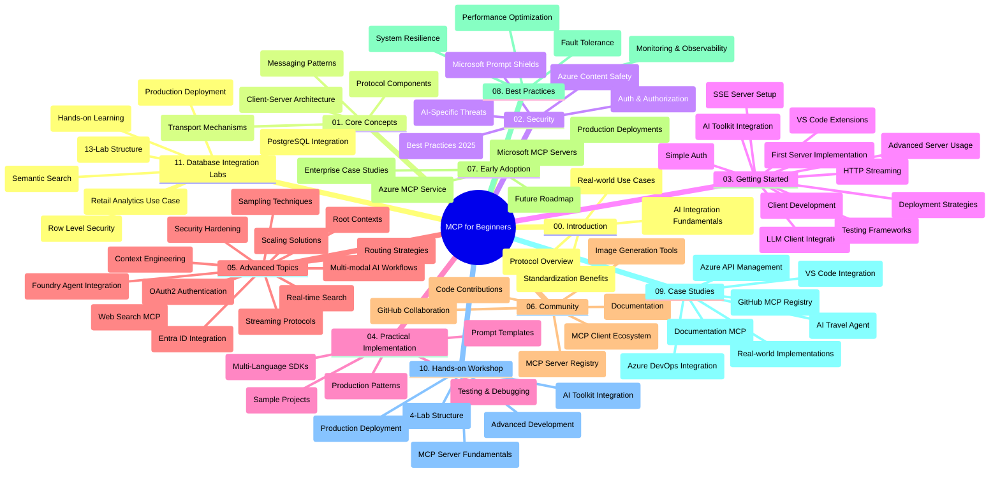

<!--
CO_OP_TRANSLATOR_METADATA:
{
  "original_hash": "af27b0acfae6caa134d9701453884df8",
  "translation_date": "2025-10-07T00:23:52+00:00",
  "source_file": "study_guide.md",
  "language_code": "uk"
}
-->
# Протокол контексту моделі (MCP) для початківців - Навчальний посібник

Цей навчальний посібник надає огляд структури репозиторію та змісту навчальної програми "Протокол контексту моделі (MCP) для початківців". Використовуйте цей посібник для ефективної навігації по репозиторію та максимальної користі від доступних ресурсів.

## Огляд репозиторію

Протокол контексту моделі (MCP) — це стандартизована структура для взаємодії між AI-моделями та клієнтськими додатками. Спочатку створений Anthropic, MCP тепер підтримується ширшою спільнотою MCP через офіційну організацію GitHub. Цей репозиторій пропонує комплексну навчальну програму з практичними прикладами коду на C#, Java, JavaScript, Python та TypeScript, розроблену для AI-розробників, системних архітекторів та програмістів.

## Візуальна карта навчальної програми

## Структура репозиторію

Репозиторій організований у одинадцять основних розділів, кожен з яких зосереджений на різних аспектах MCP:

1. **Вступ (00-Introduction/)**
   - Огляд протоколу контексту моделі
   - Чому стандартизація важлива в AI-пайплайнах
   - Практичні випадки використання та переваги

2. **Основні концепції (01-CoreConcepts/)**
   - Архітектура клієнт-сервер
   - Основні компоненти протоколу
   - Шаблони обміну повідомленнями в MCP

3. **Безпека (02-Security/)**
   - Загрози безпеці в системах на основі MCP
   - Найкращі практики для забезпечення безпеки реалізацій
   - Стратегії аутентифікації та авторизації
   - **Документація з безпеки**:
     - Найкращі практики безпеки MCP 2025
     - Посібник з реалізації Azure Content Safety
     - Контроль та техніки безпеки MCP
     - Швидкий довідник з найкращих практик MCP
   - **Ключові теми безпеки**:
     - Атаки через ін'єкцію підказок та отруєння інструментів
     - Викрадення сесій та проблеми "заплутаного заступника"
     - Уразливості передачі токенів
     - Надмірні дозволи та контроль доступу
     - Безпека ланцюга постачання для AI-компонентів
     - Інтеграція Microsoft Prompt Shields

4. **Початок роботи (03-GettingStarted/)**
   - Налаштування середовища та конфігурація
   - Створення базових серверів та клієнтів MCP
   - Інтеграція з існуючими додатками
   - Включає розділи:
     - Перша реалізація сервера
     - Розробка клієнта
     - Інтеграція клієнта LLM
     - Інтеграція з VS Code
     - Сервер подій, що надсилаються сервером (SSE)
     - Розширене використання сервера
     - HTTP-стрімінг
     - Інтеграція AI Toolkit
     - Стратегії тестування
     - Рекомендації щодо розгортання

5. **Практична реалізація (04-PracticalImplementation/)**
   - Використання SDK для різних мов програмування
   - Техніки налагодження, тестування та перевірки
   - Створення багаторазових шаблонів підказок та робочих процесів
   - Прикладні проекти з реалізацією

6. **Розширені теми (05-AdvancedTopics/)**
   - Техніки інженерії контексту
   - Інтеграція агентів Foundry
   - Багатомодальні AI-робочі процеси
   - Демонстрації аутентифікації OAuth2
   - Можливості пошуку в реальному часі
   - Стрімінг у реальному часі
   - Реалізація кореневих контекстів
   - Стратегії маршрутизації
   - Техніки вибірки
   - Підходи до масштабування
   - Міркування щодо безпеки
   - Інтеграція безпеки Entra ID
   - Інтеграція веб-пошуку

7. **Внески спільноти (06-CommunityContributions/)**
   - Як вносити код та документацію
   - Співпраця через GitHub
   - Покращення та відгуки, керовані спільнотою
   - Використання різних клієнтів MCP (Claude Desktop, Cline, VSCode)
   - Робота з популярними серверами MCP, включаючи генерацію зображень

8. **Уроки раннього впровадження (07-LessonsfromEarlyAdoption/)**
   - Реалізації в реальному світі та історії успіху
   - Створення та розгортання рішень на основі MCP
   - Тенденції та майбутня дорожня карта
   - **Посібник з серверів MCP Microsoft**: Комплексний посібник з 10 готових до виробництва серверів MCP Microsoft, включаючи:
     - Сервер MCP Microsoft Learn Docs
     - Сервер MCP Azure (15+ спеціалізованих конекторів)
     - Сервер MCP GitHub
     - Сервер MCP Azure DevOps
     - Сервер MCP MarkItDown
     - Сервер MCP SQL Server
     - Сервер MCP Playwright
     - Сервер MCP Dev Box
     - Сервер MCP Azure AI Foundry
     - Сервер MCP Microsoft 365 Agents Toolkit

9. **Найкращі практики (08-BestPractices/)**
   - Налаштування продуктивності та оптимізація
   - Проектування відмовостійких систем MCP
   - Стратегії тестування та стійкості

10. **Кейс-стаді (09-CaseStudy/)**
    - **Сім комплексних кейс-стаді**, що демонструють універсальність MCP у різних сценаріях:
    - **Azure AI Travel Agents**: Оркестрація багатьох агентів з Azure OpenAI та AI Search
    - **Інтеграція Azure DevOps**: Автоматизація робочих процесів з оновленнями даних YouTube
    - **Отримання документації в реальному часі**: Консольний клієнт Python зі стрімінгом HTTP
    - **Інтерактивний генератор навчальних планів**: Веб-додаток Chainlit з розмовним AI
    - **Документація в редакторі**: Інтеграція VS Code з робочими процесами GitHub Copilot
    - **Управління API Azure**: Інтеграція корпоративного API з створенням серверів MCP
    - **Реєстр MCP GitHub**: Розвиток екосистеми та платформи інтеграції агентів
    - Приклади реалізації, що охоплюють корпоративну інтеграцію, продуктивність розробників та розвиток екосистеми

11. **Практичний семінар (10-StreamliningAIWorkflowsBuildingAnMCPServerWithAIToolkit/)**
    - Комплексний практичний семінар, що поєднує MCP з AI Toolkit
    - Створення інтелектуальних додатків, що об'єднують AI-моделі з реальними інструментами
    - Практичні модулі, що охоплюють основи, розробку користувацьких серверів та стратегії розгортання у виробництві
    - **Структура лабораторій**:
      - Лабораторія 1: Основи серверів MCP
      - Лабораторія 2: Розширена розробка серверів MCP
      - Лабораторія 3: Інтеграція AI Toolkit
      - Лабораторія 4: Розгортання та масштабування у виробництві
    - Навчання на основі лабораторій з покроковими інструкціями

12. **Лабораторії інтеграції серверів MCP з базами даних (11-MCPServerHandsOnLabs/)**
    - **Комплексний навчальний шлях з 13 лабораторій** для створення серверів MCP, готових до виробництва, з інтеграцією PostgreSQL
    - **Реалізація аналітики роздрібної торгівлі в реальному світі** на основі кейсу Zava Retail
    - **Шаблони корпоративного рівня**, включаючи Row Level Security (RLS), семантичний пошук та доступ до даних для багатьох орендарів
    - **Повна структура лабораторій**:
      - **Лабораторії 00-03: Основи** - Вступ, Архітектура, Безпека, Налаштування середовища
      - **Лабораторії 04-06: Створення сервера MCP** - Проектування бази даних, Реалізація сервера MCP, Розробка інструментів
      - **Лабораторії 07-09: Розширені функції** - Семантичний пошук, Тестування та налагодження, Інтеграція з VS Code
      - **Лабораторії 10-12: Виробництво та найкращі практики** - Розгортання, Моніторинг, Оптимізація
    - **Технології, що охоплюються**: FastMCP framework, PostgreSQL, Azure OpenAI, Azure Container Apps, Application Insights
    - **Результати навчання**: Сервери MCP, готові до виробництва, шаблони інтеграції баз даних, аналітика на основі AI, корпоративна безпека

## Додаткові ресурси

Репозиторій включає допоміжні ресурси:

- **Папка зображень**: Містить діаграми та ілюстрації, використані в навчальній програмі
- **Переклади**: Підтримка багатьох мов з автоматичними перекладами документації
- **Офіційні ресурси MCP**:
  - [Документація MCP](https://modelcontextprotocol.io/)
  - [Специфікація MCP](https://spec.modelcontextprotocol.io/)
  - [Репозиторій MCP на GitHub](https://github.com/modelcontextprotocol)

## Як використовувати цей репозиторій

1. **Послідовне навчання**: Дотримуйтесь розділів у порядку (00–11) для структурованого навчання.
2. **Фокус на конкретній мові**: Якщо вас цікавить певна мова програмування, досліджуйте каталоги з прикладами реалізацій на вашій улюбленій мові.
3. **Практична реалізація**: Почніть з розділу "Початок роботи", щоб налаштувати середовище та створити свій перший сервер і клієнт MCP.
4. **Розширене дослідження**: Після освоєння основ заглиблюйтесь у розширені теми для розширення знань.
5. **Спільнота**: Приєднуйтесь до спільноти MCP через обговорення на GitHub та канали Discord, щоб спілкуватися з експертами та іншими розробниками.

## Клієнти та інструменти MCP

Навчальна програма охоплює різні клієнти та інструменти MCP:

1. **Офіційні клієнти**:
   - Visual Studio Code 
   - MCP у Visual Studio Code
   - Claude Desktop
   - Claude у VSCode 
   - Claude API

2. **Клієнти спільноти**:
   - Cline (на основі терміналу)
   - Cursor (редактор коду)
   - ChatMCP
   - Windsurf

3. **Інструменти управління MCP**:
   - MCP CLI
   - MCP Manager
   - MCP Linker
   - MCP Router

## Популярні сервери MCP

Репозиторій представляє різні сервери MCP, включаючи:

1. **Офіційні сервери MCP Microsoft**:
   - Сервер MCP Microsoft Learn Docs
   - Сервер MCP Azure (15+ спеціалізованих конекторів)
   - Сервер MCP GitHub
   - Сервер MCP Azure DevOps
   - Сервер MCP MarkItDown
   - Сервер MCP SQL Server
   - Сервер MCP Playwright
   - Сервер MCP Dev Box
   - Сервер MCP Azure AI Foundry
   - Сервер MCP Microsoft 365 Agents Toolkit

2. **Офіційні референсні сервери**:
   - Файлова система
   - Fetch
   - Пам'ять
   - Послідовне мислення

3. **Генерація зображень**:
   - Azure OpenAI DALL-E 3
   - Stable Diffusion WebUI
   - Replicate

4. **Інструменти розробки**:
   - Git MCP
   - Управління терміналом
   - Асистент коду

5. **Спеціалізовані сервери**:
   - Salesforce
   - Microsoft Teams
   - Jira & Confluence

## Внесок

Цей репозиторій вітає внески від спільноти. Дивіться розділ "Внески спільноти" для отримання рекомендацій щодо ефективного внеску в екосистему MCP.

----

*Цей навчальний посібник був оновлений 6 жовтня 2025 року і надає огляд репозиторію станом на цю дату. Зміст репозиторію може бути оновлений після цієї дати.*

---

**Відмова від відповідальності**:  
Цей документ було перекладено за допомогою сервісу автоматичного перекладу [Co-op Translator](https://github.com/Azure/co-op-translator). Хоча ми прагнемо до точності, звертаємо вашу увагу, що автоматичні переклади можуть містити помилки або неточності. Оригінальний документ мовою оригіналу слід вважати авторитетним джерелом. Для критично важливої інформації рекомендується професійний людський переклад. Ми не несемо відповідальності за будь-які непорозуміння або неправильні тлумачення, що виникли внаслідок використання цього перекладу.