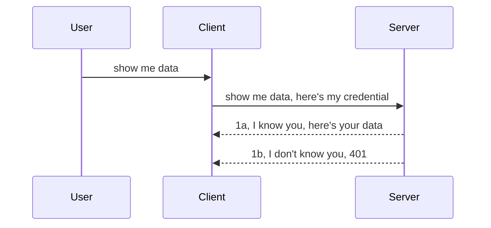

<!--
CO_OP_TRANSLATOR_METADATA:
{
  "original_hash": "5b00b8a8971a07d2d8803be4c9f138f8",
  "translation_date": "2025-10-07T00:34:03+00:00",
  "source_file": "03-GettingStarted/11-simple-auth/README.md",
  "language_code": "ur"
}
-->
# سادہ تصدیق

MCP SDKs OAuth 2.1 کے استعمال کی حمایت کرتے ہیں، جو کہ ایک کافی پیچیدہ عمل ہے جس میں تصدیق سرور، وسائل سرور، اسناد پوسٹ کرنا، کوڈ حاصل کرنا، کوڈ کو بیئرر ٹوکن میں تبدیل کرنا شامل ہے، جب تک کہ آپ آخر کار اپنے وسائل کے ڈیٹا تک رسائی حاصل نہ کر لیں۔ اگر آپ OAuth کے عادی نہیں ہیں، جو کہ ایک بہترین چیز ہے، تو بہتر ہے کہ آپ تصدیق کے بنیادی درجے سے شروع کریں اور آہستہ آہستہ بہتر سیکیورٹی کی طرف بڑھیں۔ یہی وجہ ہے کہ یہ باب موجود ہے، تاکہ آپ کو زیادہ جدید تصدیق تک لے جایا جا سکے۔

## تصدیق، اس سے کیا مراد ہے؟

تصدیق کا مطلب ہے "Authentication" اور "Authorization"۔ اس کا مطلب ہے کہ ہمیں دو کام کرنے ہیں:

- **Authentication**، یہ وہ عمل ہے جس میں ہم یہ جانتے ہیں کہ آیا کسی شخص کو ہمارے گھر میں داخل ہونے کی اجازت ہے، یعنی وہ ہمارے وسائل سرور تک رسائی حاصل کرنے کا حق رکھتے ہیں جہاں ہمارے MCP سرور کی خصوصیات موجود ہیں۔
- **Authorization**، یہ وہ عمل ہے جس میں ہم یہ جانتے ہیں کہ آیا صارف کو ان مخصوص وسائل تک رسائی حاصل کرنی چاہیے جن کی وہ درخواست کر رہے ہیں، جیسے کہ یہ آرڈرز یا یہ پروڈکٹس، یا مثال کے طور پر انہیں مواد پڑھنے کی اجازت ہے لیکن حذف کرنے کی نہیں۔

## اسناد: ہم نظام کو کیسے بتاتے ہیں کہ ہم کون ہیں؟

زیادہ تر ویب ڈویلپرز عام طور پر سرور کو ایک سند فراہم کرنے کے بارے میں سوچتے ہیں، عام طور پر ایک خفیہ چیز جو یہ بتاتی ہے کہ آیا انہیں یہاں "Authentication" کی اجازت ہے۔ یہ سند عام طور پر صارف نام اور پاس ورڈ کا base64 انکوڈ شدہ ورژن یا ایک API کلید ہوتی ہے جو کسی مخصوص صارف کی منفرد شناخت کرتی ہے۔

یہ "Authorization" نامی ہیڈر کے ذریعے بھیجی جاتی ہے، جیسے:

```json
{ "Authorization": "secret123" }
```

اسے عام طور پر بنیادی تصدیق کہا جاتا ہے۔ مجموعی عمل عام طور پر درج ذیل طریقے سے کام کرتا ہے:



اب جب کہ ہم نے سمجھ لیا کہ یہ عمل کیسے کام کرتا ہے، اسے کیسے نافذ کریں؟ زیادہ تر ویب سرورز میں ایک تصور ہوتا ہے جسے "middleware" کہا جاتا ہے، جو درخواست کے حصے کے طور پر چلنے والا کوڈ کا ایک ٹکڑا ہوتا ہے جو اسناد کی تصدیق کر سکتا ہے، اور اگر اسناد درست ہیں تو درخواست کو آگے بڑھنے دے سکتا ہے۔ اگر درخواست میں درست اسناد نہیں ہیں تو آپ کو تصدیق کی خرابی ملتی ہے۔ آئیے دیکھتے ہیں کہ اسے کیسے نافذ کیا جا سکتا ہے:

**Python**

```python
class AuthMiddleware(BaseHTTPMiddleware):
    async def dispatch(self, request, call_next):

        has_header = request.headers.get("Authorization")
        if not has_header:
            print("-> Missing Authorization header!")
            return Response(status_code=401, content="Unauthorized")

        if not valid_token(has_header):
            print("-> Invalid token!")
            return Response(status_code=403, content="Forbidden")

        print("Valid token, proceeding...")
       
        response = await call_next(request)
        # add any customer headers or change in the response in some way
        return response


starlette_app.add_middleware(CustomHeaderMiddleware)
```

یہاں ہم نے:

- ایک middleware بنایا جسے `AuthMiddleware` کہا جاتا ہے، جہاں اس کا `dispatch` طریقہ ویب سرور کے ذریعے چلایا جا رہا ہے۔
- middleware کو ویب سرور میں شامل کیا:

    ```python
    starlette_app.add_middleware(AuthMiddleware)
    ```

- توثیق کی منطق لکھی جو چیک کرتی ہے کہ آیا Authorization ہیڈر موجود ہے اور آیا بھیجا گیا خفیہ کوڈ درست ہے:

    ```python
    has_header = request.headers.get("Authorization")
    if not has_header:
        print("-> Missing Authorization header!")
        return Response(status_code=401, content="Unauthorized")

    if not valid_token(has_header):
        print("-> Invalid token!")
        return Response(status_code=403, content="Forbidden")
    ```

    اگر خفیہ کوڈ موجود ہے اور درست ہے تو ہم درخواست کو `call_next` کے ذریعے آگے بڑھنے دیتے ہیں اور جواب واپس کرتے ہیں۔

    ```python
    response = await call_next(request)
    # add any customer headers or change in the response in some way
    return response
    ```

یہ کیسے کام کرتا ہے: اگر ویب سرور کی طرف کوئی درخواست کی جاتی ہے تو middleware کو چلایا جاتا ہے اور اس کے نفاذ کے مطابق یہ یا تو درخواست کو آگے بڑھنے دیتا ہے یا ایک خرابی واپس کرتا ہے جو ظاہر کرتی ہے کہ کلائنٹ کو آگے بڑھنے کی اجازت نہیں ہے۔

**TypeScript**

یہاں ہم Express فریم ورک کے ساتھ ایک middleware بناتے ہیں اور درخواست کو MCP سرور تک پہنچنے سے پہلے روک لیتے ہیں۔ اس کے لیے کوڈ یہ ہے:

```typescript
function isValid(secret) {
    return secret === "secret123";
}

app.use((req, res, next) => {
    // 1. Authorization header present?  
    if(!req.headers["Authorization"]) {
        res.status(401).send('Unauthorized');
    }
    
    let token = req.headers["Authorization"];

    // 2. Check validity.
    if(!isValid(token)) {
        res.status(403).send('Forbidden');
    }

   
    console.log('Middleware executed');
    // 3. Passes request to the next step in the request pipeline.
    next();
});
```

اس کوڈ میں ہم:

1. چیک کرتے ہیں کہ آیا Authorization ہیڈر موجود ہے، اگر نہیں، تو ہم 401 خرابی بھیجتے ہیں۔
2. اس بات کو یقینی بناتے ہیں کہ سند/ٹوکن درست ہے، اگر نہیں، تو ہم 403 خرابی بھیجتے ہیں۔
3. آخر میں درخواست کو درخواست پائپ لائن میں آگے بڑھاتے ہیں اور مطلوبہ وسائل واپس کرتے ہیں۔

## مشق: تصدیق نافذ کریں

آئیے اپنے علم کو استعمال کرتے ہوئے اسے نافذ کرنے کی کوشش کریں۔ منصوبہ یہ ہے:

سرور

- ایک ویب سرور اور MCP انسٹینس بنائیں۔
- سرور کے لیے ایک middleware نافذ کریں۔

کلائنٹ 

- ویب درخواست بھیجیں، ہیڈر کے ذریعے سند کے ساتھ۔

### -1- ایک ویب سرور اور MCP انسٹینس بنائیں

پہلے مرحلے میں، ہمیں ویب سرور انسٹینس اور MCP سرور بنانا ہوگا۔

**Python**

یہاں ہم ایک MCP سرور انسٹینس بناتے ہیں، ایک starlette ویب ایپ بناتے ہیں اور اسے uvicorn کے ساتھ ہوسٹ کرتے ہیں۔

```python
# creating MCP Server

app = FastMCP(
    name="MCP Resource Server",
    instructions="Resource Server that validates tokens via Authorization Server introspection",
    host=settings["host"],
    port=settings["port"],
    debug=True
)

# creating starlette web app
starlette_app = app.streamable_http_app()

# serving app via uvicorn
async def run(starlette_app):
    import uvicorn
    config = uvicorn.Config(
            starlette_app,
            host=app.settings.host,
            port=app.settings.port,
            log_level=app.settings.log_level.lower(),
        )
    server = uvicorn.Server(config)
    await server.serve()

run(starlette_app)
```

اس کوڈ میں ہم نے:

- MCP سرور بنایا۔
- starlette ویب ایپ کو MCP سرور سے بنایا، `app.streamable_http_app()`۔
- ویب ایپ کو uvicorn کے ذریعے ہوسٹ اور سرور کیا، `server.serve()`۔

**TypeScript**

یہاں ہم ایک MCP سرور انسٹینس بناتے ہیں۔

```typescript
const server = new McpServer({
      name: "example-server",
      version: "1.0.0"
    });

    // ... set up server resources, tools, and prompts ...
```

یہ MCP سرور تخلیق POST /mcp روٹ کی تعریف کے اندر ہونا ضروری ہے، تو آئیے اوپر دیے گئے کوڈ کو اس طرح منتقل کریں:

```typescript
import express from "express";
import { randomUUID } from "node:crypto";
import { McpServer } from "@modelcontextprotocol/sdk/server/mcp.js";
import { StreamableHTTPServerTransport } from "@modelcontextprotocol/sdk/server/streamableHttp.js";
import { isInitializeRequest } from "@modelcontextprotocol/sdk/types.js"

const app = express();
app.use(express.json());

// Map to store transports by session ID
const transports: { [sessionId: string]: StreamableHTTPServerTransport } = {};

// Handle POST requests for client-to-server communication
app.post('/mcp', async (req, res) => {
  // Check for existing session ID
  const sessionId = req.headers['mcp-session-id'] as string | undefined;
  let transport: StreamableHTTPServerTransport;

  if (sessionId && transports[sessionId]) {
    // Reuse existing transport
    transport = transports[sessionId];
  } else if (!sessionId && isInitializeRequest(req.body)) {
    // New initialization request
    transport = new StreamableHTTPServerTransport({
      sessionIdGenerator: () => randomUUID(),
      onsessioninitialized: (sessionId) => {
        // Store the transport by session ID
        transports[sessionId] = transport;
      },
      // DNS rebinding protection is disabled by default for backwards compatibility. If you are running this server
      // locally, make sure to set:
      // enableDnsRebindingProtection: true,
      // allowedHosts: ['127.0.0.1'],
    });

    // Clean up transport when closed
    transport.onclose = () => {
      if (transport.sessionId) {
        delete transports[transport.sessionId];
      }
    };
    const server = new McpServer({
      name: "example-server",
      version: "1.0.0"
    });

    // ... set up server resources, tools, and prompts ...

    // Connect to the MCP server
    await server.connect(transport);
  } else {
    // Invalid request
    res.status(400).json({
      jsonrpc: '2.0',
      error: {
        code: -32000,
        message: 'Bad Request: No valid session ID provided',
      },
      id: null,
    });
    return;
  }

  // Handle the request
  await transport.handleRequest(req, res, req.body);
});

// Reusable handler for GET and DELETE requests
const handleSessionRequest = async (req: express.Request, res: express.Response) => {
  const sessionId = req.headers['mcp-session-id'] as string | undefined;
  if (!sessionId || !transports[sessionId]) {
    res.status(400).send('Invalid or missing session ID');
    return;
  }
  
  const transport = transports[sessionId];
  await transport.handleRequest(req, res);
};

// Handle GET requests for server-to-client notifications via SSE
app.get('/mcp', handleSessionRequest);

// Handle DELETE requests for session termination
app.delete('/mcp', handleSessionRequest);

app.listen(3000);
```

اب آپ دیکھ سکتے ہیں کہ MCP سرور تخلیق کو `app.post("/mcp")` کے اندر منتقل کیا گیا۔

آئیے اگلے مرحلے کی طرف بڑھتے ہیں، middleware بنانے کے لیے تاکہ آنے والی سند کی توثیق کی جا سکے۔

### -2- سرور کے لیے ایک middleware نافذ کریں

اب ہم middleware کے حصے کی طرف بڑھتے ہیں۔ یہاں ہم ایک middleware بنائیں گے جو `Authorization` ہیڈر میں سند تلاش کرے گا اور اس کی توثیق کرے گا۔ اگر یہ قابل قبول ہے تو درخواست آگے بڑھتی ہے اور وہ کام کرتی ہے جو اسے کرنا چاہیے (جیسے ٹولز کی فہرست بنانا، وسائل پڑھنا یا جو بھی MCP فعالیت کلائنٹ مانگ رہا ہے)۔

**Python**

middleware بنانے کے لیے، ہمیں ایک کلاس بنانی ہوگی جو `BaseHTTPMiddleware` سے وراثت حاصل کرے۔ دو دلچسپ حصے ہیں:

- درخواست `request`، جس سے ہم ہیڈر کی معلومات پڑھتے ہیں۔
- `call_next`، وہ کال بیک جسے ہمیں کلائنٹ کی سند قبول کرنے پر چلانا ہوگا۔

پہلے، ہمیں اس صورت حال کو سنبھالنا ہوگا اگر `Authorization` ہیڈر غائب ہو:

```python
has_header = request.headers.get("Authorization")

# no header present, fail with 401, otherwise move on.
if not has_header:
    print("-> Missing Authorization header!")
    return Response(status_code=401, content="Unauthorized")
```

یہاں ہم 401 غیر مجاز پیغام بھیجتے ہیں کیونکہ کلائنٹ تصدیق میں ناکام ہو رہا ہے۔

اگلا، اگر سند پیش کی گئی ہو، تو ہمیں اس کی درستگی کو اس طرح چیک کرنا ہوگا:

```python
 if not valid_token(has_header):
    print("-> Invalid token!")
    return Response(status_code=403, content="Forbidden")
```

نوٹ کریں کہ ہم اوپر 403 ممنوع پیغام بھیجتے ہیں۔ آئیے مکمل middleware کو دیکھتے ہیں جو ہم نے اوپر ذکر کیا ہے:

```python
class AuthMiddleware(BaseHTTPMiddleware):
    async def dispatch(self, request, call_next):

        has_header = request.headers.get("Authorization")
        if not has_header:
            print("-> Missing Authorization header!")
            return Response(status_code=401, content="Unauthorized")

        if not valid_token(has_header):
            print("-> Invalid token!")
            return Response(status_code=403, content="Forbidden")

        print("Valid token, proceeding...")
        print(f"-> Received {request.method} {request.url}")
        response = await call_next(request)
        response.headers['Custom'] = 'Example'
        return response

```

زبردست، لیکن `valid_token` فنکشن کے بارے میں کیا خیال ہے؟ یہ نیچے ہے:

```python
# DON'T use for production - improve it !!
def valid_token(token: str) -> bool:
    # remove the "Bearer " prefix
    if token.startswith("Bearer "):
        token = token[7:]
        return token == "secret-token"
    return False
```

یہ واضح طور پر بہتر ہونا چاہیے۔

اہم: آپ کو کبھی بھی کوڈ میں خفیہ معلومات نہیں رکھنی چاہیے۔ آپ کو مثالی طور پر اس قدر کو ڈیٹا سورس یا IDP (identity service provider) سے حاصل کرنا چاہیے یا بہتر یہ کہ IDP کو توثیق کرنے دیں۔

**TypeScript**

Express کے ساتھ اسے نافذ کرنے کے لیے، ہمیں `use` طریقہ کو کال کرنا ہوگا جو middleware فنکشنز لیتا ہے۔

ہمیں ضرورت ہے:

- درخواست متغیر کے ساتھ تعامل کریں تاکہ `Authorization` پراپرٹی میں دی گئی سند کو چیک کریں۔
- سند کی توثیق کریں، اور اگر درست ہو تو درخواست کو جاری رکھنے دیں تاکہ کلائنٹ کی MCP درخواست وہ کرے جو اسے کرنا چاہیے (جیسے ٹولز کی فہرست بنانا، وسائل پڑھنا یا کوئی بھی MCP متعلقہ کام)۔

یہاں، ہم چیک کرتے ہیں کہ آیا `Authorization` ہیڈر موجود ہے اور اگر نہیں، تو ہم درخواست کو آگے بڑھنے سے روکتے ہیں:

```typescript
if(!req.headers["authorization"]) {
    res.status(401).send('Unauthorized');
    return;
}
```

اگر ہیڈر پہلی جگہ پر نہیں بھیجا گیا، تو آپ کو 401 ملتا ہے۔

اگلا، ہم چیک کرتے ہیں کہ آیا سند درست ہے، اگر نہیں تو ہم درخواست کو دوبارہ روکتے ہیں لیکن تھوڑا مختلف پیغام کے ساتھ:

```typescript
if(!isValid(token)) {
    res.status(403).send('Forbidden');
    return;
} 
```

نوٹ کریں کہ آپ کو اب 403 خرابی ملتی ہے۔

یہاں مکمل کوڈ ہے:

```typescript
app.use((req, res, next) => {
    console.log('Request received:', req.method, req.url, req.headers);
    console.log('Headers:', req.headers["authorization"]);
    if(!req.headers["authorization"]) {
        res.status(401).send('Unauthorized');
        return;
    }
    
    let token = req.headers["authorization"];

    if(!isValid(token)) {
        res.status(403).send('Forbidden');
        return;
    }  

    console.log('Middleware executed');
    next();
});
```

ہم نے ویب سرور کو middleware قبول کرنے کے لیے ترتیب دیا ہے تاکہ کلائنٹ کی طرف سے بھیجی گئی سند کو چیک کیا جا سکے۔ کلائنٹ کے بارے میں کیا خیال ہے؟

### -3- ویب درخواست سند کے ساتھ ہیڈر کے ذریعے بھیجیں

ہمیں یہ یقینی بنانا ہوگا کہ کلائنٹ سند کو ہیڈر کے ذریعے بھیج رہا ہے۔ چونکہ ہم MCP کلائنٹ استعمال کرنے جا رہے ہیں، ہمیں یہ معلوم کرنا ہوگا کہ یہ کیسے کیا جاتا ہے۔

**Python**

کلائنٹ کے لیے، ہمیں اپنی سند کے ساتھ ایک ہیڈر پاس کرنا ہوگا، جیسے:

```python
# DON'T hardcode the value, have it at minimum in an environment variable or a more secure storage
token = "secret-token"

async with streamablehttp_client(
        url = f"http://localhost:{port}/mcp",
        headers = {"Authorization": f"Bearer {token}"}
    ) as (
        read_stream,
        write_stream,
        session_callback,
    ):
        async with ClientSession(
            read_stream,
            write_stream
        ) as session:
            await session.initialize()
      
            # TODO, what you want done in the client, e.g list tools, call tools etc.
```

نوٹ کریں کہ ہم نے `headers` پراپرٹی کو اس طرح آباد کیا: `headers = {"Authorization": f"Bearer {token}"}`۔

**TypeScript**

ہم اسے دو مراحل میں حل کر سکتے ہیں:

1. ایک کنفیگریشن آبجیکٹ کو اپنی سند کے ساتھ آباد کریں۔
2. کنفیگریشن آبجیکٹ کو ٹرانسپورٹ میں پاس کریں۔

```typescript

// DON'T hardcode the value like shown here. At minimum have it as a env variable and use something like dotenv (in dev mode).
let token = "secret123"

// define a client transport option object
let options: StreamableHTTPClientTransportOptions = {
  sessionId: sessionId,
  requestInit: {
    headers: {
      "Authorization": "secret123"
    }
  }
};

// pass the options object to the transport
async function main() {
   const transport = new StreamableHTTPClientTransport(
      new URL(serverUrl),
      options
   );
```

یہاں آپ دیکھ سکتے ہیں کہ ہم نے ایک `options` آبجیکٹ بنایا اور اپنی ہیڈرز کو `requestInit` پراپرٹی کے تحت رکھا۔

اہم: ہم اسے یہاں سے کیسے بہتر بنائیں؟ موجودہ نفاذ میں کچھ مسائل ہیں۔ سب سے پہلے، اس طرح سند پاس کرنا کافی خطرناک ہے جب تک کہ آپ کے پاس کم از کم HTTPS نہ ہو۔ پھر بھی، سند چوری ہو سکتی ہے، لہذا آپ کو ایک ایسا نظام چاہیے جہاں آپ آسانی سے ٹوکن کو منسوخ کر سکیں اور اضافی چیک شامل کر سکیں جیسے کہ یہ کہاں سے آ رہا ہے، کیا درخواست بہت زیادہ بار ہو رہی ہے (بوٹ جیسا رویہ)، مختصر یہ کہ، بہت سے خدشات ہیں۔

یہ کہا جانا چاہیے کہ، بہت سادہ APIs کے لیے جہاں آپ نہیں چاہتے کہ کوئی بھی آپ کے API کو تصدیق کے بغیر کال کرے، جو ہمارے پاس یہاں ہے وہ ایک اچھا آغاز ہے۔

یہ کہنے کے ساتھ، آئیے سیکیورٹی کو تھوڑا سخت کرنے کی کوشش کریں اور JSON Web Token، جسے JWT یا "JOT" ٹوکن بھی کہا جاتا ہے، جیسے معیاری فارمیٹ استعمال کریں۔

## JSON Web Tokens، JWT

تو، ہم بہت سادہ اسناد بھیجنے سے چیزوں کو بہتر بنانے کی کوشش کر رہے ہیں۔ JWT اپنانے سے ہمیں فوری طور پر کیا بہتری ملتی ہے؟

- **سیکیورٹی میں بہتری**۔ بنیادی تصدیق میں، آپ صارف نام اور پاس ورڈ کو base64 انکوڈ شدہ ٹوکن کے طور پر (یا آپ API کلید بھیجتے ہیں) بار بار بھیجتے ہیں، جس سے خطرہ بڑھتا ہے۔ JWT کے ساتھ، آپ اپنا صارف نام اور پاس ورڈ بھیجتے ہیں اور بدلے میں ایک ٹوکن حاصل کرتے ہیں، اور یہ وقت کے ساتھ محدود ہوتا ہے، یعنی یہ ختم ہو جائے گا۔ JWT آپ کو کردار، دائرہ کار اور اجازتوں کا استعمال کرتے ہوئے باریک بینی سے رسائی کنٹرول کو آسانی سے نافذ کرنے دیتا ہے۔
- **بے ترتیبی اور توسیع پذیری**۔ JWTs خود مختار ہیں، وہ تمام صارف کی معلومات لے کر جاتے ہیں اور سرور سائیڈ سیشن اسٹوریج کو ختم کرتے ہیں۔ ٹوکن کو مقامی طور پر بھی توثیق کیا جا سکتا ہے۔
- **انٹرآپریبلٹی اور فیڈریشن**۔ JWTs Open ID Connect کا مرکز ہیں اور معروف شناخت فراہم کنندگان جیسے Entra ID، Google Identity اور Auth0 کے ساتھ استعمال ہوتے ہیں۔ یہ سنگل سائن آن اور بہت کچھ کو ممکن بناتے ہیں، جس سے یہ انٹرپرائز گریڈ بن جاتا ہے۔
- **ماڈیولریٹی اور لچک**۔ JWTs کو Azure API Management، NGINX اور مزید جیسے API گیٹ ویز کے ساتھ بھی استعمال کیا جا سکتا ہے۔ یہ تصدیق کے مختلف منظرناموں اور سرور سے سروس مواصلات بشمول نقلی اور تفویض منظرناموں کی حمایت کرتا ہے۔
- **کارکردگی اور کیشنگ**۔ JWTs کو ڈیکوڈنگ کے بعد کیش کیا جا سکتا ہے، جس سے پارسنگ کی ضرورت کم ہو جاتی ہے۔ یہ خاص طور پر ہائی ٹریفک ایپس کے ساتھ مدد کرتا ہے کیونکہ یہ تھروپٹ کو بہتر بناتا ہے اور آپ کے منتخب کردہ انفراسٹرکچر پر بوجھ کو کم کرتا ہے۔
- **جدید خصوصیات**۔ یہ introspection (سرور پر درستگی کی جانچ) اور revocation (ٹوکن کو غیر فعال کرنا) کی بھی حمایت کرتا ہے۔

ان تمام فوائد کے ساتھ، آئیے دیکھتے ہیں کہ ہم اپنے نفاذ کو اگلے درجے تک کیسے لے جا سکتے ہیں۔

## بنیادی تصدیق کو JWT میں تبدیل کرنا

تو، ہمیں جو تبدیلیاں کرنی ہیں وہ ہیں:

- **JWT ٹوکن بنانا سیکھیں** اور اسے کلائنٹ سے سرور تک بھیجنے کے لیے تیار کریں۔
- **JWT ٹوکن کی توثیق کریں**، اور اگر درست ہو، تو کلائنٹ کو ہمارے وسائل تک رسائی دیں۔
- **ٹوکن اسٹوریج کو محفوظ کریں**۔ ہم اس ٹوکن کو کیسے محفوظ کریں۔
- **روٹس کی حفاظت کریں**۔ ہمیں روٹس کی حفاظت کرنی ہے، ہمارے معاملے میں، ہمیں روٹس اور مخصوص MCP خصوصیات کی حفاظت کرنی ہے۔
- **ریفریش ٹوکنز شامل کریں**۔ یقینی بنائیں کہ ہم ایسے ٹوکن بناتے ہیں جو مختصر مدت کے ہوں لیکن ریفریش ٹوکنز جو طویل مدت کے ہوں اور اگر وہ ختم ہو جائیں تو نئے ٹوکن حاصل کرنے کے لیے استعمال کیے جا سکتے ہیں۔ اس کے علاوہ، ایک ریفریش اینڈ پوائنٹ اور ایک روٹیشن حکمت عملی شامل کریں۔

### -1- JWT ٹوکن بنانا

سب سے پہلے، ایک JWT ٹوکن کے درج ذیل حصے ہوتے ہیں:

- **header**، استعمال شدہ الگورتھم اور ٹوکن کی قسم۔
- **payload**، دعوے، جیسے sub (صارف یا ادارہ جس کی نمائندگی ٹوکن کرتا ہے۔ تصدیق کے منظرنامے میں یہ عام طور پر صارف کی شناخت ہوتی ہے)، exp (جب یہ ختم ہوتا ہے)، role (کردار)۔
- **signature**، ایک خفیہ یا نجی کلید کے ساتھ دستخط شدہ۔

اس کے لیے، ہمیں header، payload اور encoded ٹوکن بنانا ہوگا۔

**Python**

```python

import jwt
import jwt
from jwt.exceptions import ExpiredSignatureError, InvalidTokenError
import datetime

# Secret key used to sign the JWT
secret_key = 'your-secret-key'

header = {
    "alg": "HS256",
    "typ": "JWT"
}

# the user info andits claims and expiry time
payload = {
    "sub": "1234567890",               # Subject (user ID)
    "name": "User Userson",                # Custom claim
    "admin": True,                     # Custom claim
    "iat": datetime.datetime.utcnow(),# Issued at
    "exp": datetime.datetime.utcnow() + datetime.timedelta(hours=1)  # Expiry
}

# encode it
encoded_jwt = jwt.encode(payload, secret_key, algorithm="HS256", headers=header)
```

اوپر دیے گئے کوڈ میں ہم نے:

- ایک header کی وضاحت کی جس میں الگورتھم HS256 اور قسم JWT ہے۔
- ایک payload بنایا جس میں ایک subject یا صارف کی شناخت، ایک صارف نام، ایک کردار، جب یہ جاری کیا گیا تھا اور جب یہ ختم ہونے کے لیے مقرر کیا گیا تھا شامل ہے، اس طرح ہم نے پہلے ذکر کردہ وقت کی حد کے پہلو کو نافذ کیا۔

**TypeScript**

یہاں ہمیں کچھ dependencies کی ضرورت ہوگی جو ہمیں JWT ٹوکن بنانے میں مدد کریں گی۔

dependencies

```sh

npm install jsonwebtoken
npm install --save-dev @types/jsonwebtoken
```

اب جب کہ ہمارے پاس یہ موجود ہے، آئیے header، payload بنائیں اور اس کے ذریعے encoded ٹوکن بنائیں۔

```typescript
import jwt from 'jsonwebtoken';

const secretKey = 'your-secret-key'; // Use env vars in production

// Define the payload
const payload = {
  sub: '1234567890',
  name: 'User usersson',
  admin: true,
  iat: Math.floor(Date.now() / 1000), // Issued at
  exp: Math.floor(Date.now() / 1000) + 60 * 60 // Expires in 1 hour
};

// Define the header (optional, jsonwebtoken sets defaults)
const header = {
  alg: 'HS256',
  typ: 'JWT'
};

// Create the token
const token = jwt.sign(payload, secretKey, {
  algorithm: 'HS256',
  header: header
});

console.log('JWT:', token);
```

یہ ٹوکن:

HS256 کا استعمال کرتے ہوئے دستخط شدہ
1 گھنٹے کے لیے درست
دعوے شامل کرتا ہے جیسے sub, name, admin, iat, اور exp۔

### -2- ٹوکن کی توثیق کریں

ہمیں ٹوکن کی توثیق بھی کرنی ہوگی، یہ وہ چیز ہے جو ہمیں سرور پر کرنی چاہیے تاکہ یہ یقینی بنایا جا سکے کہ کلائنٹ ہمیں جو بھیج رہا ہے وہ حقیقت میں درست ہے۔ یہاں بہت سے چیک کرنے ہیں، جیسے اس کی ساخت کی توثیق کرنا اور اس کی درستگی۔ آپ کو یہ بھی مشورہ دیا جاتا ہے کہ دیگر چیک شامل کریں تاکہ یہ دیکھا جا سکے کہ صارف آپ کے سسٹم میں موجود ہے اور مزید۔

ٹوکن کی توثیق کرنے کے لیے، ہمیں اسے ڈیکوڈ کرنا ہوگا تاکہ ہم اسے پڑھ سکیں اور پھر اس کی درستگی کو چیک کرنا شروع کریں:

**Python**

```python

# Decode and verify the JWT
try:
    decoded = jwt.decode(token, secret_key, algorithms=["HS256"])
    print("✅ Token is valid.")
    print("Decoded claims:")
    for key, value in decoded.items():
        print(f"  {key}: {value}")
except ExpiredSignatureError:
    print("❌ Token has expired.")
except InvalidTokenError as e:
    print(f"❌ Invalid token: {e}")

```

اس کوڈ میں، ہم `jwt.decode` کو ٹوکن، خفیہ کلید اور منتخب کردہ الگورتھم کے ساتھ کال کرتے ہیں۔ نوٹ کریں کہ ہم try-catch کنسٹرکٹ استعمال کرتے ہیں کیونکہ ناکام توثیق ایک خرابی پیدا کرتی ہے۔

**TypeScript**

یہاں ہمیں `jwt.verify` کو کال کرنا ہوگا تاکہ ہمیں ٹوکن کا ڈیکوڈ شدہ ورژن ملے جسے ہم مزید تجزیہ کر سکیں۔ اگر یہ کال ناکام ہو جاتی ہے، تو اس کا مطلب ہے کہ ٹوکن کی ساخت غلط ہے یا یہ اب درست نہیں ہے۔

```typescript

try {
  const decoded = jwt.verify(token, secretKey);
  console.log('Decoded Payload:', decoded);
} catch (err) {
  console.error('Token verification failed:', err);
}
```

نوٹ: جیسا کہ پہلے ذکر کیا گیا ہے، ہمیں اضافی چیک کرنے چاہئیں تاکہ یہ یقینی بنایا جا سکے کہ یہ ٹوکن ہمارے سسٹم میں موجود صارف کی نشاندہی کرتا ہے اور یہ یقینی بنائے کہ صارف کے پاس وہ حقوق ہیں جو وہ دعویٰ کرتا ہے۔
آئیے اب رول بیسڈ ایکسس کنٹرول، جسے RBAC بھی کہا جاتا ہے، پر نظر ڈالتے ہیں۔

## رول بیسڈ ایکسس کنٹرول شامل کرنا

خیال یہ ہے کہ ہم مختلف رولز کے مختلف اجازت نامے ظاہر کرنا چاہتے ہیں۔ مثال کے طور پر، ہم فرض کرتے ہیں کہ ایک ایڈمن سب کچھ کر سکتا ہے، ایک عام صارف پڑھنے/لکھنے کی اجازت رکھتا ہے، اور ایک مہمان صرف پڑھنے کی اجازت رکھتا ہے۔ لہذا، یہاں کچھ ممکنہ اجازت نامے ہیں:

- Admin.Write  
- User.Read  
- Guest.Read  

آئیے دیکھتے ہیں کہ ہم اس قسم کے کنٹرول کو مڈل ویئر کے ذریعے کیسے نافذ کر سکتے ہیں۔ مڈل ویئرز کو مخصوص راستوں کے لیے یا تمام راستوں کے لیے شامل کیا جا سکتا ہے۔

**Python**

```python
from starlette.middleware.base import BaseHTTPMiddleware
from starlette.responses import JSONResponse
import jwt

# DON'T have the secret in the code like, this is for demonstration purposes only. Read it from a safe place.
SECRET_KEY = "your-secret-key" # put this in env variable
REQUIRED_PERMISSION = "User.Read"

class JWTPermissionMiddleware(BaseHTTPMiddleware):
    async def dispatch(self, request, call_next):
        auth_header = request.headers.get("Authorization")
        if not auth_header or not auth_header.startswith("Bearer "):
            return JSONResponse({"error": "Missing or invalid Authorization header"}, status_code=401)

        token = auth_header.split(" ")[1]
        try:
            decoded = jwt.decode(token, SECRET_KEY, algorithms=["HS256"])
        except jwt.ExpiredSignatureError:
            return JSONResponse({"error": "Token expired"}, status_code=401)
        except jwt.InvalidTokenError:
            return JSONResponse({"error": "Invalid token"}, status_code=401)

        permissions = decoded.get("permissions", [])
        if REQUIRED_PERMISSION not in permissions:
            return JSONResponse({"error": "Permission denied"}, status_code=403)

        request.state.user = decoded
        return await call_next(request)


```
  
مڈل ویئر شامل کرنے کے مختلف طریقے ہیں، جیسے کہ نیچے دیے گئے ہیں:

```python

# Alt 1: add middleware while constructing starlette app
middleware = [
    Middleware(JWTPermissionMiddleware)
]

app = Starlette(routes=routes, middleware=middleware)

# Alt 2: add middleware after starlette app is a already constructed
starlette_app.add_middleware(JWTPermissionMiddleware)

# Alt 3: add middleware per route
routes = [
    Route(
        "/mcp",
        endpoint=..., # handler
        middleware=[Middleware(JWTPermissionMiddleware)]
    )
]
```
  

**TypeScript**

ہم `app.use` اور ایک مڈل ویئر استعمال کر سکتے ہیں جو تمام درخواستوں کے لیے چلے گا۔

```typescript
app.use((req, res, next) => {
    console.log('Request received:', req.method, req.url, req.headers);
    console.log('Headers:', req.headers["authorization"]);

    // 1. Check if authorization header has been sent

    if(!req.headers["authorization"]) {
        res.status(401).send('Unauthorized');
        return;
    }
    
    let token = req.headers["authorization"];

    // 2. Check if token is valid
    if(!isValid(token)) {
        res.status(403).send('Forbidden');
        return;
    }  

    // 3. Check if token user exist in our system
    if(!isExistingUser(token)) {
        res.status(403).send('Forbidden');
        console.log("User does not exist");
        return;
    }
    console.log("User exists");

    // 4. Verify the token has the right permissions
    if(!hasScopes(token, ["User.Read"])){
        res.status(403).send('Forbidden - insufficient scopes');
    }

    console.log("User has required scopes");

    console.log('Middleware executed');
    next();
});

```
  
ہمارا مڈل ویئر کئی کام کر سکتا ہے اور کرنا چاہیے، جیسے کہ:

1. چیک کریں کہ آیا اتھورائزیشن ہیڈر موجود ہے۔  
2. چیک کریں کہ ٹوکن درست ہے؛ ہم `isValid` کو کال کرتے ہیں، جو ایک ایسا طریقہ ہے جو ہم نے JWT ٹوکن کی سالمیت اور درستگی کو چیک کرنے کے لیے لکھا ہے۔  
3. تصدیق کریں کہ صارف ہمارے سسٹم میں موجود ہے؛ ہمیں یہ چیک کرنا چاہیے۔  

   ```typescript
    // users in DB
   const users = [
     "user1",
     "User usersson",
   ]

   function isExistingUser(token) {
     let decodedToken = verifyToken(token);

     // TODO, check if user exists in DB
     return users.includes(decodedToken?.name || "");
   }
   ```
  
   اوپر، ہم نے ایک بہت سادہ `users` لسٹ بنائی ہے، جو ظاہر ہے کہ ڈیٹا بیس میں ہونی چاہیے۔

4. اضافی طور پر، ہمیں یہ بھی چیک کرنا چاہیے کہ ٹوکن کے پاس صحیح اجازت نامے ہیں۔

   ```typescript
   if(!hasScopes(token, ["User.Read"])){
        res.status(403).send('Forbidden - insufficient scopes');
   }
   ```
  
   اس کوڈ میں، ہم مڈل ویئر سے چیک کرتے ہیں کہ ٹوکن میں User.Read اجازت موجود ہے؛ اگر نہیں، تو ہم 403 ایرر بھیجتے ہیں۔ نیچے `hasScopes` ہیلپر میتھڈ دیا گیا ہے۔

   ```typescript
   function hasScopes(scope: string, requiredScopes: string[]) {
     let decodedToken = verifyToken(scope);
    return requiredScopes.every(scope => decodedToken?.scopes.includes(scope));
  
   ```

Have a think which additional checks you should be doing, but these are the absolute minimum of checks you should be doing.

Using Express as a web framework is a common choice. There are helpers library when you use JWT so you can write less code.

- `express-jwt`, helper library that provides a middleware that helps decode your token.
- `express-jwt-permissions`, this provides a middleware `guard` that helps check if a certain permission is on the token.

Here's what these libraries can look like when used:

```typescript
const express = require('express');
const jwt = require('express-jwt');
const guard = require('express-jwt-permissions')();

const app = express();
const secretKey = 'your-secret-key'; // put this in env variable

// Decode JWT and attach to req.user
app.use(jwt({ secret: secretKey, algorithms: ['HS256'] }));

// Check for User.Read permission
app.use(guard.check('User.Read'));

// multiple permissions
// app.use(guard.check(['User.Read', 'Admin.Access']));

app.get('/protected', (req, res) => {
  res.json({ message: `Welcome ${req.user.name}` });
});

// Error handler
app.use((err, req, res, next) => {
  if (err.code === 'permission_denied') {
    return res.status(403).send('Forbidden');
  }
  next(err);
});

```
  
اب آپ نے دیکھا کہ مڈل ویئر کو تصدیق اور اجازت دونوں کے لیے کیسے استعمال کیا جا سکتا ہے۔ لیکن MCP کے بارے میں کیا خیال ہے؟ کیا یہ تصدیق کے طریقے کو تبدیل کرتا ہے؟ آئیے اگلے حصے میں معلوم کرتے ہیں۔

### -3- MCP میں RBAC شامل کریں

آپ نے اب تک دیکھا کہ RBAC کو مڈل ویئر کے ذریعے کیسے شامل کیا جا سکتا ہے، لیکن MCP کے لیے فیچر کے لحاظ سے RBAC شامل کرنے کا کوئی آسان طریقہ نہیں ہے۔ تو ہم کیا کریں؟ ہمیں صرف ایسا کوڈ شامل کرنا ہوگا جو چیک کرے کہ آیا کلائنٹ کے پاس کسی مخصوص ٹول کو کال کرنے کے حقوق ہیں۔

فیچر کے لحاظ سے RBAC کو نافذ کرنے کے لیے آپ کے پاس چند مختلف اختیارات ہیں، جیسے کہ:

- ہر ٹول، ریسورس، یا پرامپٹ کے لیے چیک شامل کریں جہاں آپ کو اجازت نامے کی سطح چیک کرنے کی ضرورت ہو۔

   **Python**

   ```python
   @tool()
   def delete_product(id: int):
      try:
          check_permissions(role="Admin.Write", request)
      catch:
        pass # client failed authorization, raise authorization error
   ```
  
   **TypeScript**

   ```typescript
   server.registerTool(
    "delete-product",
    {
      title: Delete a product",
      description: "Deletes a product",
      inputSchema: { id: z.number() }
    },
    async ({ id }) => {
      
      try {
        checkPermissions("Admin.Write", request);
        // todo, send id to productService and remote entry
      } catch(Exception e) {
        console.log("Authorization error, you're not allowed");  
      }

      return {
        content: [{ type: "text", text: `Deletected product with id ${id}` }]
      };
    }
   );
   ```
  

- ایڈوانسڈ سرور اپروچ اور ریکویسٹ ہینڈلرز استعمال کریں تاکہ آپ کو چیک کرنے کے مقامات کم سے کم کرنے میں مدد ملے۔

   **Python**

   ```python
   
   tool_permission = {
      "create_product": ["User.Write", "Admin.Write"],
      "delete_product": ["Admin.Write"]
   }

   def has_permission(user_permissions, required_permissions) -> bool:
      # user_permissions: list of permissions the user has
      # required_permissions: list of permissions required for the tool
      return any(perm in user_permissions for perm in required_permissions)

   @server.call_tool()
   async def handle_call_tool(
     name: str, arguments: dict[str, str] | None
   ) -> list[types.TextContent]:
    # Assume request.user.permissions is a list of permissions for the user
     user_permissions = request.user.permissions
     required_permissions = tool_permission.get(name, [])
     if not has_permission(user_permissions, required_permissions):
        # Raise error "You don't have permission to call tool {name}"
        raise Exception(f"You don't have permission to call tool {name}")
     # carry on and call tool
     # ...
   ```   
  

   **TypeScript**

   ```typescript
   function hasPermission(userPermissions: string[], requiredPermissions: string[]): boolean {
       if (!Array.isArray(userPermissions) || !Array.isArray(requiredPermissions)) return false;
       // Return true if user has at least one required permission
       
       return requiredPermissions.some(perm => userPermissions.includes(perm));
   }
  
   server.setRequestHandler(CallToolRequestSchema, async (request) => {
      const { params: { name } } = request;
  
      let permissions = request.user.permissions;
  
      if (!hasPermission(permissions, toolPermissions[name])) {
         return new Error(`You don't have permission to call ${name}`);
      }
  
      // carry on..
   });
   ```
  
   نوٹ کریں، آپ کو یہ یقینی بنانا ہوگا کہ آپ کا مڈل ویئر ڈیکوڈ شدہ ٹوکن کو درخواست کے `user` پراپرٹی میں تفویض کرے تاکہ اوپر دیا گیا کوڈ آسان بنایا جا سکے۔

### خلاصہ

اب ہم نے عمومی طور پر RBAC اور خاص طور پر MCP کے لیے سپورٹ شامل کرنے پر بات کی ہے، اب وقت ہے کہ آپ خود سیکیورٹی نافذ کریں تاکہ آپ کو پیش کیے گئے تصورات کو سمجھنے کی تصدیق ہو سکے۔

## اسائنمنٹ 1: بنیادی تصدیق کے ساتھ MCP سرور اور MCP کلائنٹ بنائیں

یہاں آپ وہ سیکھیں گے جو آپ نے ہیڈرز کے ذریعے اسناد بھیجنے کے بارے میں سیکھا ہے۔

## حل 1

[حل 1](./code/basic/README.md)

## اسائنمنٹ 2: اسائنمنٹ 1 کے حل کو JWT کے ساتھ اپ گریڈ کریں

پہلے حل کو لیں، لیکن اس بار اسے بہتر بنائیں۔

بنیادی تصدیق کے بجائے، آئیے JWT استعمال کریں۔

## حل 2

[حل 2](./solution/jwt-solution/README.md)

## چیلنج

RBAC کو فی ٹول شامل کریں جیسا کہ ہم نے "MCP میں RBAC شامل کریں" سیکشن میں بیان کیا ہے۔

## خلاصہ

امید ہے کہ آپ نے اس باب میں بہت کچھ سیکھا ہوگا، بغیر کسی سیکیورٹی سے لے کر بنیادی سیکیورٹی تک، JWT تک، اور یہ MCP میں کیسے شامل کیا جا سکتا ہے۔

ہم نے کسٹم JWTs کے ساتھ ایک مضبوط بنیاد بنائی ہے، لیکن جیسے جیسے ہم اسکیل کرتے ہیں، ہم ایک معیاری شناختی ماڈل کی طرف بڑھ رہے ہیں۔ Entra یا Keycloak جیسے IdP کو اپنانا ہمیں ٹوکن کے اجرا، تصدیق، اور لائف سائیکل مینجمنٹ کو ایک قابل اعتماد پلیٹ فارم پر منتقل کرنے کی اجازت دیتا ہے — جس سے ہم ایپ کے منطق اور صارف کے تجربے پر توجہ مرکوز کر سکیں۔

اس کے لیے، ہمارے پاس [Entra پر ایک زیادہ ایڈوانسڈ باب](../../05-AdvancedTopics/mcp-security-entra/README.md) موجود ہے۔

---

**ڈسکلیمر**:  
یہ دستاویز AI ترجمہ سروس [Co-op Translator](https://github.com/Azure/co-op-translator) کا استعمال کرتے ہوئے ترجمہ کی گئی ہے۔ ہم درستگی کے لیے کوشش کرتے ہیں، لیکن براہ کرم آگاہ رہیں کہ خودکار ترجمے میں غلطیاں یا غیر درستیاں ہو سکتی ہیں۔ اصل دستاویز کو اس کی اصل زبان میں مستند ذریعہ سمجھا جانا چاہیے۔ اہم معلومات کے لیے، پیشہ ور انسانی ترجمہ کی سفارش کی جاتی ہے۔ ہم اس ترجمے کے استعمال سے پیدا ہونے والی کسی بھی غلط فہمی یا غلط تشریح کے ذمہ دار نہیں ہیں۔